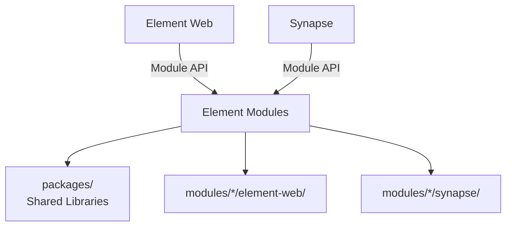

# Sub-Project Exploration: Element Modules

## Overview

Element Modules is a monorepo containing pluggable modules for Element Web and Synapse. It provides an extension system where custom functionality (guest access, third-party integrations, Nordeck plugins) can be developed and tested in isolation, then plugged into Element deployments.

## Architecture



### Structure

```
element-modules/
├── modules/                # Individual modules
│   └── */
│       ├── element-web/    # Element Web plugins
│       └── synapse/        # Synapse plugins
├── packages/               # Shared packages
│   └── element-web-module-api/
├── playwright/             # E2E tests
├── docker-bake.hcl         # Docker build definitions
├── playwright.config.ts
└── package.json            # Yarn workspaces
```

## Key Insights

- Yarn workspaces monorepo structure
- Modules target both Element Web (TypeScript) and Synapse (Python)
- Docker Bake for building module containers
- Playwright E2E tests for module integration testing
- Knip for dead code detection
- Module API package defines the contract between Element Web and plugins
- Node 20+ required
