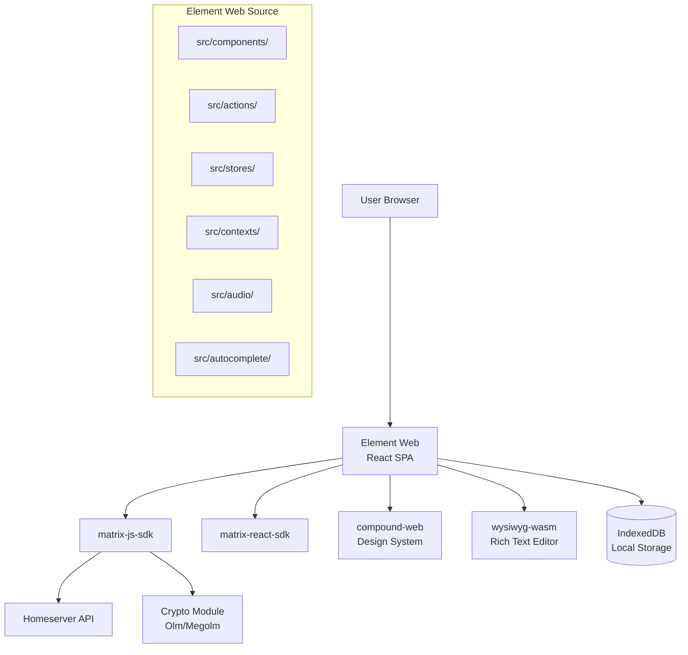

# Sub-Project Exploration: Element Web

## Overview

Element Web is the flagship Matrix web client, built with TypeScript and React. It provides a full-featured communication interface including messaging, voice/video calls, end-to-end encryption, room management, spaces, and threads. Version 1.11.95, it serves as both a standalone web application and the embedded content for Element Desktop (Electron).

The application uses the matrix-js-sdk for Matrix protocol communication and matrix-react-sdk for reusable React UI components.

## Architecture

### High-Level Diagram



### Source Structure

```
element-web/
├── src/
│   ├── vector/                 # App entry point and initialization
│   ├── components/             # React components
│   ├── actions/                # Redux-style actions
│   ├── contexts/               # React contexts
│   ├── audio/                  # Audio playback/recording
│   ├── autocomplete/           # Message autocomplete
│   ├── accessibility/          # A11y utilities
│   ├── async-components/       # Code-split components
│   ├── customisations/         # White-label customization hooks
│   ├── stores/                 # State management
│   ├── i18n/                   # Internationalization
│   └── @types/                 # TypeScript type definitions
├── playwright/                 # E2E test suite
├── docker/                     # Docker deployment
├── debian/                     # Debian packaging
├── docs/                       # Developer documentation
├── config.sample.json          # Runtime configuration sample
└── package.json
```

## Key Components

### Entry Point (`src/vector/`)
- Initializes the Matrix client, loads configuration, sets up routing, renders the React app tree.

### Components Layer
- Room views, message timeline, room list, spaces, member list, settings panels, dialogs.
- Uses compound-web design system components as building blocks.

### State Management
- Combination of React contexts, custom stores, and matrix-js-sdk's built-in event emitters.
- IndexedDB for persistent local storage of sync state and crypto keys.

### Rich Text Composition
- Integrates the matrix-rich-text-editor WASM module for WYSIWYG message composition.

### E2E Testing
- Playwright test suite for end-to-end testing of user flows.

## Key Insights

- The codebase is mature (v1.11.95) with extensive feature coverage
- Configuration is runtime-loaded (config.json), enabling deployment-specific customization without rebuilds
- Supports white-labeling through a customization API
- Docker deployment and Debian packaging are first-class concerns
- The project references both the old `vector-im` and new `element-hq` GitHub organizations (ongoing migration)
- Playwright E2E tests provide comprehensive regression coverage
- Book.toml indicates mdBook documentation is available
