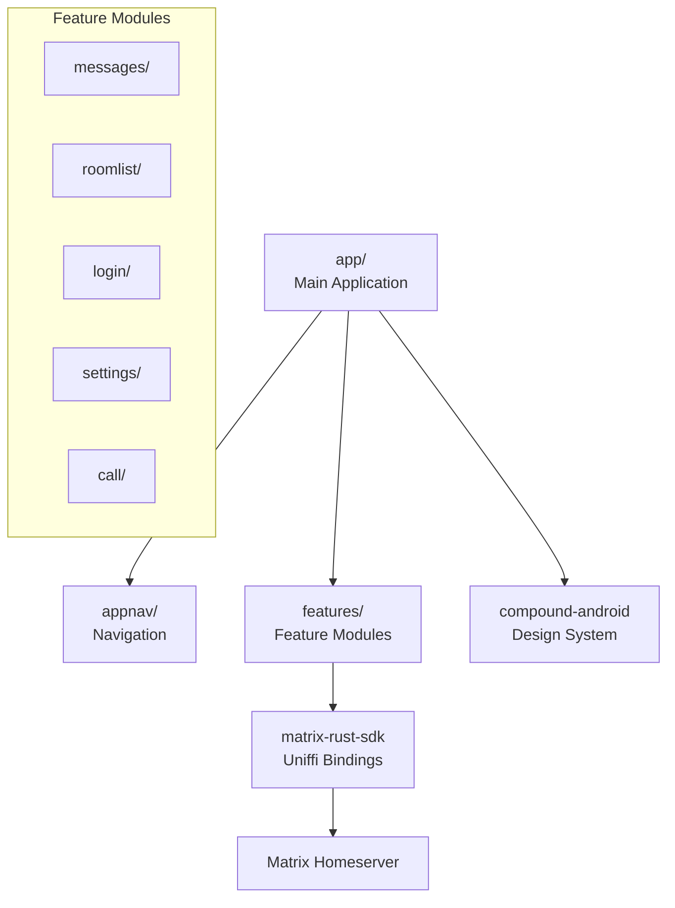

# Sub-Project Exploration: Element X Android

## Overview

Element X Android is the next-generation Matrix client for Android, built with Kotlin and Jetpack Compose. Unlike the legacy Element Android, it uses the matrix-rust-sdk (via Uniffi-generated Kotlin bindings) for all Matrix protocol operations, ensuring consistent behavior with the iOS and web clients. The "X" signifies the architectural rewrite.

## Architecture



### Structure

```
element-x-android/
├── app/                    # Main application
├── appnav/                 # Navigation graph
├── appconfig/              # Build configuration
├── appicon/                # App icon assets
├── features/               # Feature modules (multi-module architecture)
├── anvilannotations/       # DI annotations (Anvil)
├── anvilcodegen/           # DI code generation
├── enterprise/             # Enterprise-specific features
├── docs/                   # Documentation
├── fastlane/               # Play Store deployment
├── gradle/                 # Gradle wrapper and version catalog
└── build.gradle.kts
```

## Key Insights

- **matrix-rust-sdk** powers all Matrix protocol operations (no Kotlin-native SDK)
- Multi-module Gradle architecture with feature modules for compile-time isolation
- Jetpack Compose for the entire UI layer
- Anvil for compile-time dependency injection (Dagger alternative)
- Enterprise module for commercial-specific features (dual license)
- Compound Android for design system components
- Fastlane for Play Store automation
- The Rust SDK provides E2EE, sync, room management, and all client-server operations
