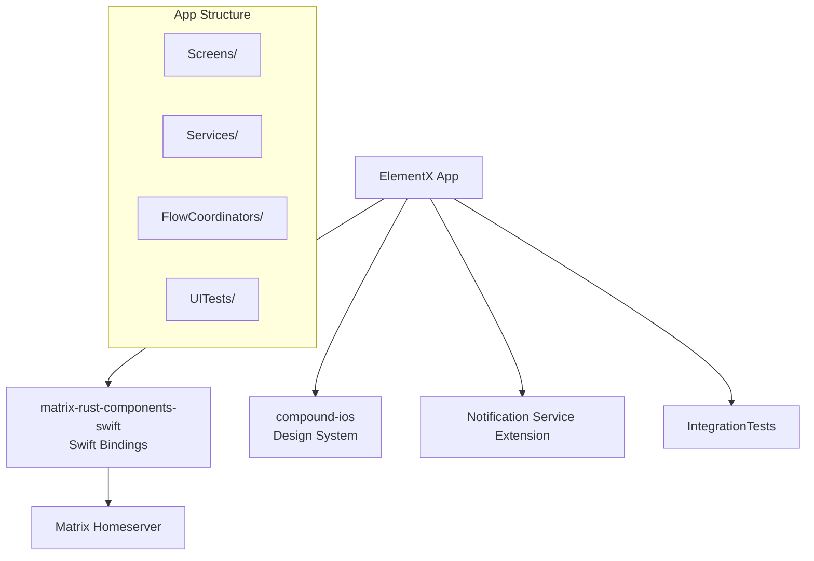

# Sub-Project Exploration: Element X iOS

## Overview

Element X iOS is the next-generation Matrix client for iOS, built with SwiftUI and powered by the matrix-rust-sdk (via matrix-rust-components-swift). It represents a complete rewrite of the iOS client with modern Swift concurrency, SwiftUI, and a shared Rust core for Matrix protocol operations.

## Architecture



### Structure

```
element-x-ios/
├── ElementX/               # Main application target
├── ElementX.xcodeproj/     # Xcode project
├── NSE/                    # Notification Service Extension
├── IntegrationTests/       # Integration test target
├── DevelopmentAssets/       # Debug/dev assets
├── Enterprise/             # Enterprise features
├── ci_scripts/             # CI/CD scripts
├── fastlane/               # App Store deployment
├── docs/                   # Documentation
├── app.yml                 # App configuration
└── localazy.json           # Translation management
```

## Key Insights

- **matrix-rust-components-swift** (XCFramework) provides all Matrix SDK functionality
- SwiftUI-first UI with coordinator pattern for navigation
- Notification Service Extension for background push handling
- Enterprise module for commercial features
- Fastlane for App Store automation
- Localazy for translation management
- Codecov for test coverage tracking
- Dangerfile.swift for PR automation
- The app config in `app.yml` defines bundle identifiers and display names
