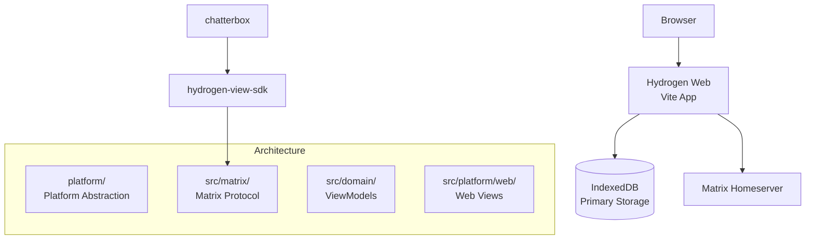

# Sub-Project Exploration: Hydrogen Web

## Overview

Hydrogen is a lightweight, performance-focused Matrix web client designed to minimize RAM usage by leveraging IndexedDB for data storage and offloading as much processing as possible from main memory. Version 0.5.1, it targets low-end devices and constrained environments where Element Web's resource usage is prohibitive.

Hydrogen also provides a reusable SDK (`hydrogen-view-sdk`) that powers embedded clients like Chatterbox.

## Architecture



### Structure

```
hydrogen-web/
├── src/
│   ├── matrix/             # Matrix protocol implementation
│   ├── domain/             # ViewModel layer
│   ├── platform/
│   │   └── web/            # Web platform (DOM, IndexedDB)
│   └── lib/                # Shared library code
├── scripts/
│   └── sdk/                # SDK build scripts
├── prototypes/             # Experimental features
├── doc/                    # Documentation
├── docker/                 # Docker deployment
├── playwright/             # E2E tests
└── package.json
```

## Key Insights

- **IndexedDB-first design** keeps memory footprint minimal by not holding full sync state in RAM
- Provides `hydrogen-view-sdk` as an npm package for embedding Matrix in other applications
- MVVM architecture (ViewModel + View separation) enables platform portability
- Vite-based build system
- Used as the foundation for Chatterbox (embeddable chat widget)
- Lighter alternative to Element Web for resource-constrained environments
- Node 15+ requirement
