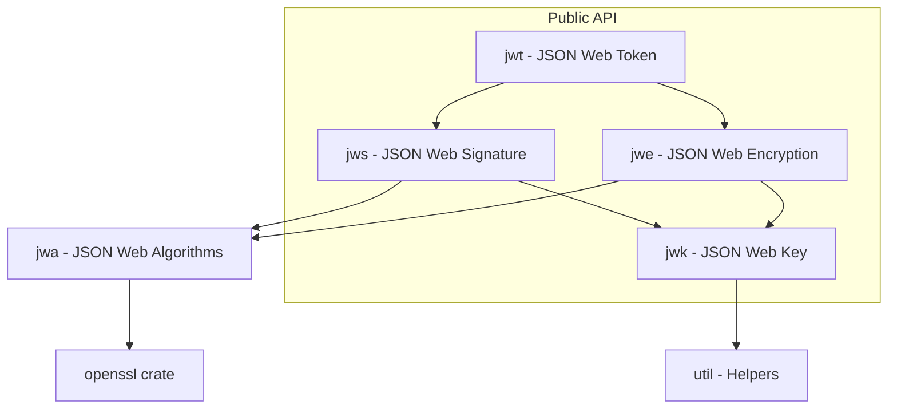

# Sub-Project Exploration: josekit-rs

## Overview

josekit-rs is a comprehensive JOSE (Javascript Object Signing and Encryption) library for Rust, providing implementations for JWT (JSON Web Token), JWS (JSON Web Signature), JWE (JSON Web Encryption), JWA (JSON Web Algorithms), and JWK (JSON Web Key). It serves as the cryptographic foundation for token handling in the Matrix Authentication Service.

The library wraps OpenSSL for cryptographic operations and supports a wide range of algorithms including HMAC, RSA, ECDSA (P-256/P-384/P-521/secp256k1), and EdDSA (Ed25519/Ed448).

## Architecture

### High-Level Diagram



### Source Structure

```
josekit-rs/
├── src/
│   ├── lib.rs              # Public re-exports
│   ├── jwt/                # JWT encoding/decoding
│   │   └── jwt.rs
│   ├── jws/                # JWS signing/verification
│   │   └── jws.rs
│   ├── jwe/                # JWE encryption/decryption
│   │   └── jwe.rs
│   ├── jwk/                # JWK key management
│   │   └── jwk.rs
│   ├── jwa/                # Algorithm implementations
│   │   └── ...
│   ├── jose_header.rs      # JOSE header types
│   ├── jose_error.rs       # Error types
│   ├── util/               # Utility functions
│   │   └── util.rs
│   └── util.rs
├── data/                   # Test data (keys, tokens)
├── Cargo.toml
└── README.md
```

## Component Breakdown

### JWT Module
- **Purpose:** High-level JWT creation and validation. Handles claims (iss, sub, aud, exp, nbf, iat, jti) and payload serialization.

### JWS Module
- **Purpose:** JSON Web Signature - signs payloads and verifies signatures. Supports compact and JSON serialization.
- **Algorithms:** HS256/384/512, RS256/384/512, PS256/384/512, ES256/384/512, ES256K, EdDSA

### JWE Module
- **Purpose:** JSON Web Encryption - encrypts and decrypts payloads. Supports key wrapping, direct key agreement, and content encryption.

### JWK Module
- **Purpose:** JSON Web Key - key generation, import/export, key sets (JWKS), and key type detection.

### JWA Module
- **Purpose:** Algorithm-specific implementations wrapping OpenSSL operations.

## External Dependencies

| Dependency | Version | Purpose |
|------------|---------|---------|
| openssl | 0.10.68 | Cryptographic operations |
| serde/serde_json | 1 | JSON serialization |
| base64 | 0.22 | Base64url encoding |
| thiserror | 1 | Error type derivation |
| anyhow | 1 | Error context |
| regex | 1 | Pattern matching |
| flate2 | 1 | Compression for JWE |
| time | 0.3 | Timestamp handling |

## Key Insights

- **OpenSSL dependency** is the main external crypto backend; a `vendored` feature flag allows static linking
- Dual-licensed MIT/Apache-2.0 (permissive)
- Used by MAS (`mas-jose` crate wraps/extends this library)
- Edition 2021, version 0.10.1
- The library covers the full JOSE specification family, making it suitable for any OAuth2/OIDC implementation
