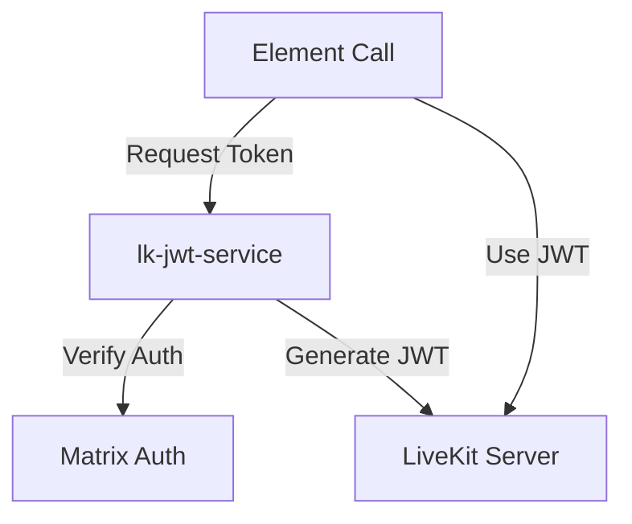

# Sub-Project Exploration: lk-jwt-service

## Overview

lk-jwt-service is a lightweight Go HTTP service that generates LiveKit JWT tokens for authenticated Matrix users. It serves as the bridge between Matrix authentication and LiveKit room access, enabling Element Call to grant users permission to join LiveKit-powered video/voice rooms.

## Architecture



### Structure

```
lk-jwt-service/
├── main.go                 # Complete service implementation
├── main_test.go            # Tests
├── go.mod                  # Dependencies
├── Dockerfile              # Container build
├── renovate.json           # Dependency updates
└── README.md
```

## Key Insights

- Entire service fits in a single `main.go` file - intentionally minimal
- Uses `github.com/livekit/protocol/auth` for LiveKit JWT generation
- Verifies Matrix authentication before issuing LiveKit tokens
- Docker deployment
- Companion to Element Call for WebRTC conferencing
- AGPL-3.0 licensed
