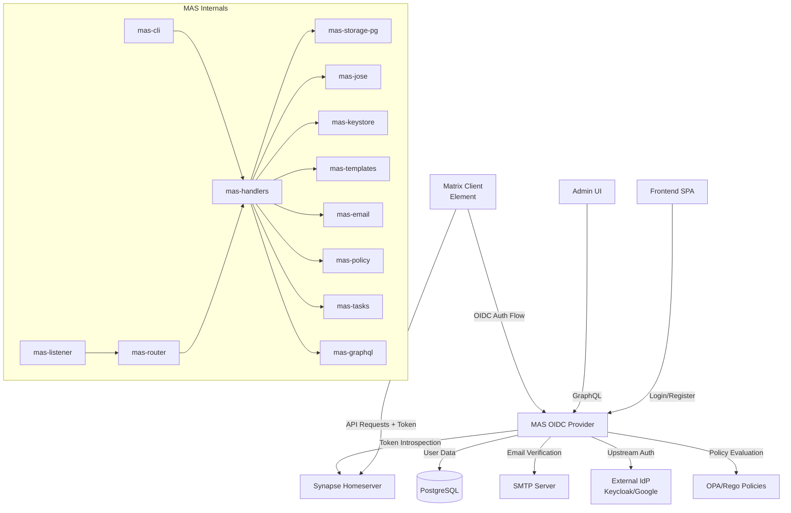
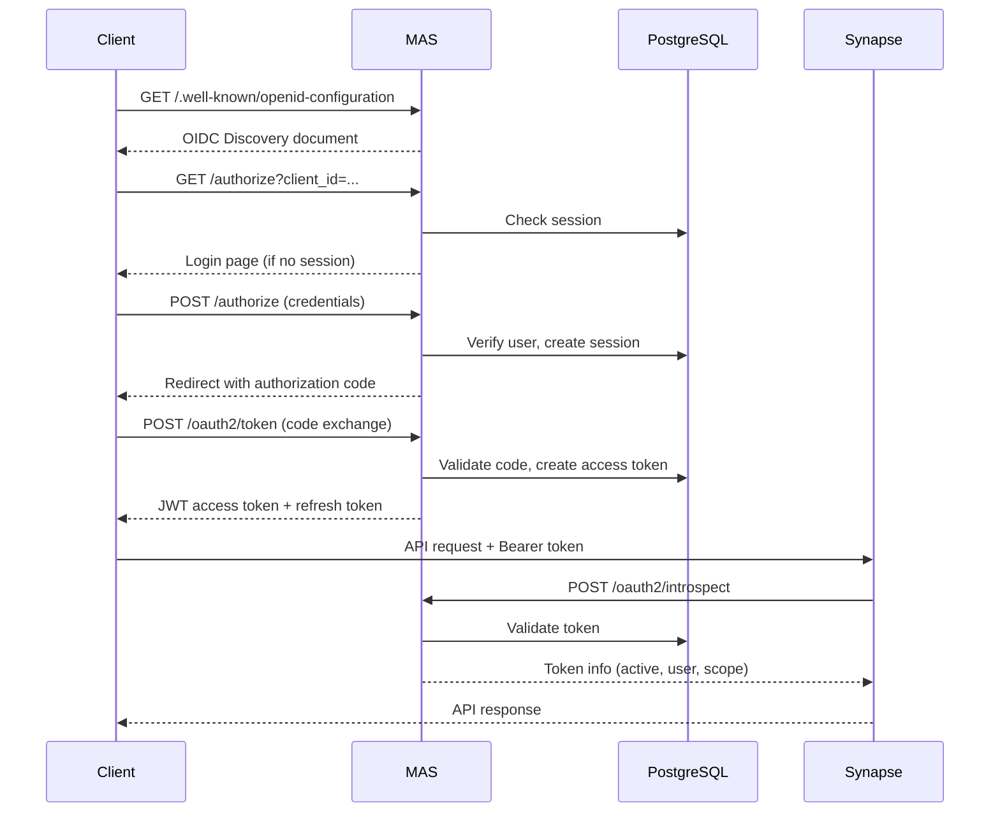

# Sub-Project Exploration: Matrix Authentication Service (MAS)

## Overview

MAS is an OAuth 2.0 and OpenID Connect (OIDC) Provider purpose-built for Matrix homeservers. It implements [MSC3861](https://github.com/matrix-org/matrix-doc/pull/3861), which moves authentication responsibility out of Synapse and into a dedicated, standards-compliant identity provider. MAS handles user login, token issuance, session management, upstream IdP delegation, and provides a GraphQL admin API for managing users and sessions.

The project is a Rust workspace (edition 2024, v0.14.1) consisting of 27 internal crates, structured around the Axum web framework with PostgreSQL storage, Tower middleware, and comprehensive observability through OpenTelemetry and Sentry.

## Architecture

### High-Level Diagram

### Component Breakdown

#### mas-cli (Binary Crate)
- **Location:** `crates/cli/`
- **Purpose:** Main entry point binary. Provides `serve`, `config`, `manage`, `syn2mas` subcommands.
- **Dependencies:** mas-config, mas-listener, mas-handlers, mas-tasks

#### mas-handlers
- **Location:** `crates/handlers/`
- **Purpose:** HTTP request handlers implementing OAuth 2.0/OIDC endpoints: authorization, token, introspection, userinfo, registration, device authorization.
- **Dependencies:** mas-data-model, mas-storage, mas-jose, mas-keystore, mas-templates, mas-policy

#### mas-storage / mas-storage-pg
- **Location:** `crates/storage/`, `crates/storage-pg/`
- **Purpose:** `mas-storage` defines async trait-based repository interfaces. `mas-storage-pg` implements them for PostgreSQL using sqlx with sea-query for query building.
- **Dependencies:** sqlx, sea-query, chrono, ulid

#### mas-jose
- **Location:** `crates/jose/`
- **Purpose:** JOSE (JWT/JWS/JWE) implementation for token signing and verification. Handles RS256, ES256, EdDSA algorithms.
- **Dependencies:** elliptic-curve, p256, p384, k256, pkcs1, pkcs8

#### mas-keystore
- **Location:** `crates/keystore/`
- **Purpose:** Cryptographic key management - key loading, rotation, and storage of signing keys in JWK format.

#### mas-graphql
- **Location:** `crates/graphql/`
- **Purpose:** GraphQL admin API using async-graphql. Manages users, sessions, OAuth2 clients, and upstream IdPs.
- **Dependencies:** async-graphql

#### mas-policy
- **Location:** `crates/policy/`
- **Purpose:** Authorization policy engine. Evaluates Rego policies (OPA) for access control decisions.

#### mas-templates
- **Location:** `crates/templates/`
- **Purpose:** HTML template rendering for login, registration, consent screens using minijinja.

#### mas-config
- **Location:** `crates/config/`
- **Purpose:** Configuration loading via figment (YAML + env vars). Defines all runtime settings.

#### mas-email
- **Location:** `crates/email/`
- **Purpose:** Email sending for verification and password reset using lettre.

#### mas-tasks
- **Location:** `crates/tasks/`
- **Purpose:** Background task system for deferred operations (session cleanup, token pruning, user sync).

#### mas-data-model
- **Location:** `crates/data-model/`
- **Purpose:** Core domain types - User, Session, OAuthClient, BrowserSession, UpstreamOAuthLink.

#### mas-router
- **Location:** `crates/router/`
- **Purpose:** URL routing definitions mapping endpoints to handlers.

#### mas-listener
- **Location:** `crates/listener/`
- **Purpose:** HTTP listener configuration - binds to addresses, TLS setup, graceful shutdown.

#### mas-tower
- **Location:** `crates/tower/`
- **Purpose:** Tower middleware layers for request tracing, error handling, rate limiting.

#### mas-matrix / mas-matrix-synapse
- **Location:** `crates/matrix/`, `crates/matrix-synapse/`
- **Purpose:** Matrix protocol integration and Synapse-specific API calls (user provisioning, device management).

#### oauth2-types
- **Location:** `crates/oauth2-types/`
- **Purpose:** OAuth 2.0 type definitions (grant types, token types, error codes, request/response shapes).

#### mas-oidc-client
- **Location:** `crates/oidc-client/`
- **Purpose:** OIDC client implementation for upstream IdP delegation (e.g., login with Google/Keycloak).

#### mas-i18n / mas-i18n-scan
- **Location:** `crates/i18n/`, `crates/i18n-scan/`
- **Purpose:** Internationalization system and translation string scanning tool.

#### mas-iana / mas-iana-codegen
- **Location:** `crates/iana/`, `crates/iana-codegen/`
- **Purpose:** IANA registry data (OAuth parameters, JWT claims) as Rust types, with codegen.

#### mas-spa
- **Location:** `crates/spa/`
- **Purpose:** Serving the frontend single-page application (login/account management UI).

#### mas-axum-utils
- **Location:** `crates/axum-utils/`
- **Purpose:** Shared Axum extractors and utilities (cookie handling, CSRF, typed headers).

#### syn2mas
- **Location:** `crates/syn2mas/`
- **Purpose:** Migration tool for converting existing Synapse user databases to MAS-managed authentication.

## Entry Points

### CLI Binary (`mas-cli serve`)
- **File:** `crates/cli/src/main.rs`
- **Flow:** Parse CLI args -> Load config (figment) -> Initialize PostgreSQL pool (sqlx) -> Start background tasks -> Bind HTTP listener -> Serve Axum router with Tower middleware stack

### OAuth2 Authorization Endpoint
- **Flow:** Client redirect -> Session check -> Login form (if needed) -> Consent screen -> Authorization code issuance -> Redirect back to client

### Token Endpoint
- **Flow:** Authorization code / refresh token -> Validate grant -> Sign JWT access token (mas-jose) -> Return token response

### GraphQL Admin API
- **Flow:** Authenticated admin request -> async-graphql resolver -> mas-storage-pg queries -> JSON response

## Data Flow

## External Dependencies

| Dependency | Version | Purpose |
|------------|---------|---------|
| axum | 0.8.1 | HTTP framework |
| sqlx | 0.8.3 | PostgreSQL driver with compile-time checked queries |
| async-graphql | 7.0.16 | GraphQL server |
| tokio | 1.44.1 | Async runtime |
| figment | 0.10.19 | Configuration loading |
| lettre | 0.11.15 | Email sending |
| minijinja | 2.8.0 | Template rendering |
| sentry | 0.36.0 | Error tracking |
| opentelemetry | 0.28.0 | Distributed tracing and metrics |
| tower/tower-http | 0.5.2/0.6.2 | Middleware layers |
| sea-query | 0.32.3 | SQL query builder |
| aide | 0.14.2 | OpenAPI schema generation |

## Key Insights

- **27 internal crates** demonstrate disciplined separation of concerns in a large Rust workspace
- Storage layer uses trait-based abstraction (`mas-storage`) with concrete PostgreSQL implementation, making testing and future backend swaps feasible
- **Edition 2024** adoption shows this is a cutting-edge Rust project
- `unsafe_code = "deny"` enforced workspace-wide
- Release profile uses LTO and single codegen unit for maximum optimization
- Dev profile selectively optimizes crypto crates (argon2, bcrypt, sha2) to keep test suite fast
- Policy engine uses OPA/Rego for flexible authorization rules
- The `syn2mas` migration tool is critical for Synapse-to-MAS transition in production deployments
- Comprehensive observability stack: OpenTelemetry traces + Prometheus metrics + Sentry error tracking
