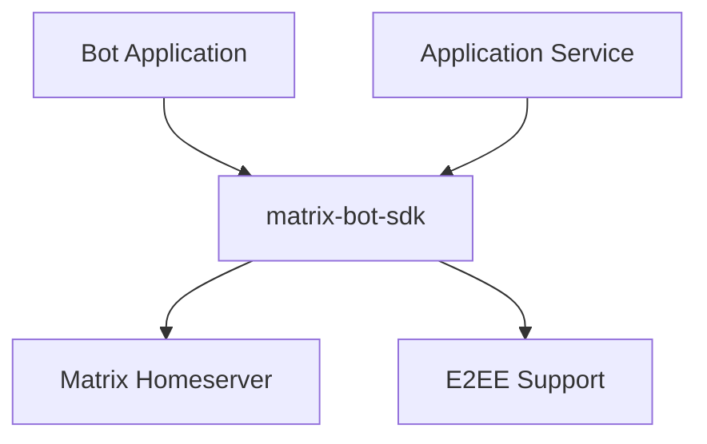

# Sub-Project Exploration: Matrix Bot SDK

## Overview

The Matrix Bot SDK (`@vector-im/matrix-bot-sdk`) is a TypeScript/JavaScript SDK for building Matrix bots and application services. Version 0.7.1-element.8, it provides a high-level API for Matrix client operations, bot command handling, application service registration, and end-to-end encryption support.

## Architecture



### Structure

```
matrix-bot-sdk/
├── src/                    # TypeScript source
├── test/                   # Jest test suite
├── examples/               # Example bots
│   ├── bot.ts              # Simple bot
│   ├── appservice.ts       # Application service
│   ├── login_register.ts   # Auth example
│   ├── encryption_bot.ts   # E2EE bot
│   └── encryption_appservice.ts
├── docs/
│   └── tutorials/          # Usage tutorials
├── scripts/                # Build scripts
├── jsdoc.json              # API documentation config
└── package.json
```

## Key Insights

- Published as `@vector-im/matrix-bot-sdk` on npm (public)
- Provides both bot and application service abstractions
- E2EE support for encrypted bot interactions
- Jest for testing, JSDoc for API documentation
- Multiple example bots for common patterns
- TypeScript with separate release and example tsconfigs
- MIT licensed (permissive, suitable for third-party bot development)
