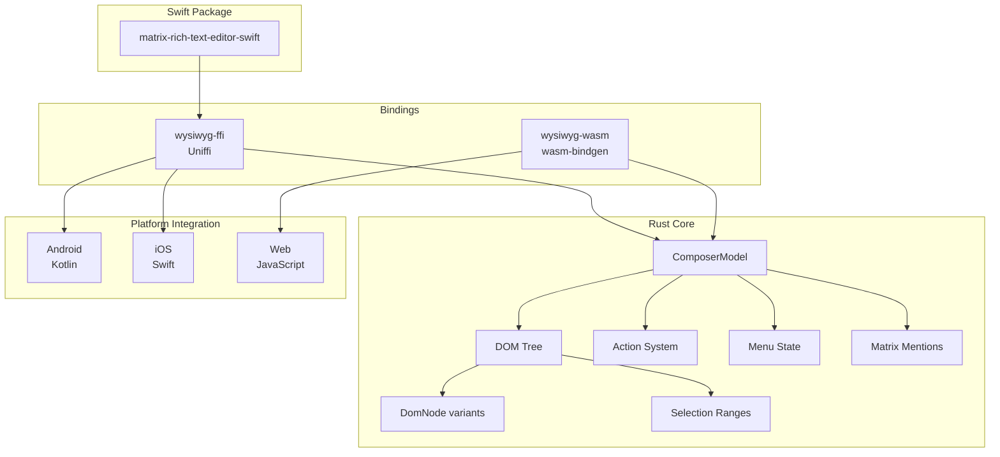

# Sub-Project Exploration: Matrix Rich Text Editor

## Overview

The Matrix Rich Text Editor is a cross-platform WYSIWYG editor designed for composing Matrix messages. The core logic is implemented entirely in Rust, with platform-specific bindings generated via Uniffi (for Android/iOS) and wasm-bindgen (for Web). This "write once in Rust, deploy everywhere" approach ensures consistent behavior across all Element clients.

The editor maintains its own DOM tree representation, handles rich text formatting (bold, italic, links, lists, mentions), and produces both HTML and Markdown output compatible with Matrix message formatting.

## Architecture

### High-Level Diagram



### Workspace Structure

```
matrix-rich-text-editor/
├── crates/
│   ├── wysiwyg/                    # Core editor logic
│   │   ├── src/
│   │   │   ├── lib.rs              # Public API surface
│   │   │   ├── composer_model.rs   # Main state machine module
│   │   │   ├── composer_model/     # ComposerModel implementation files
│   │   │   ├── composer_state.rs   # Editor state (content + selection)
│   │   │   ├── composer_action.rs  # Available actions enum
│   │   │   ├── composer_update.rs  # Update result type
│   │   │   ├── dom.rs              # DOM tree module
│   │   │   ├── dom/                # DOM implementation (nodes, handles, ranges)
│   │   │   ├── action_state.rs     # Action enabled/disabled state
│   │   │   ├── menu_state.rs       # Toolbar button states
│   │   │   ├── menu_action.rs      # Menu interaction types
│   │   │   ├── link_action.rs      # Link creation/editing
│   │   │   ├── list_type.rs        # Ordered/unordered lists
│   │   │   ├── mentions_state.rs   # @mention tracking
│   │   │   ├── suggestion_pattern.rs # Autocomplete patterns
│   │   │   ├── pattern_key.rs      # Pattern matching keys
│   │   │   ├── text_update.rs      # Text change descriptions
│   │   │   ├── format_type.rs      # Formatting types
│   │   │   ├── location.rs         # Cursor/selection positions
│   │   │   ├── char.rs             # Character-level operations
│   │   │   ├── tests.rs            # Test module
│   │   │   └── tests/              # Test files
│   │   └── Cargo.toml
│   └── matrix_mentions/            # Matrix @-mention handling
│       ├── src/
│       │   ├── lib.rs
│       │   └── mention.rs          # Mention detection and parsing
│       └── Cargo.toml
├── bindings/
│   ├── wysiwyg-ffi/                # Uniffi FFI bindings (Android + iOS)
│   │   ├── src/
│   │   │   ├── lib.rs
│   │   │   ├── ffi_composer_model.rs
│   │   │   ├── ffi_composer_state.rs
│   │   │   ├── ffi_composer_action.rs
│   │   │   ├── ffi_composer_update.rs
│   │   │   ├── ffi_menu_state.rs
│   │   │   ├── ffi_menu_action.rs
│   │   │   ├── ffi_link_actions.rs
│   │   │   ├── ffi_mention_detector.rs
│   │   │   ├── ffi_mentions_state.rs
│   │   │   ├── ffi_action_state.rs
│   │   │   ├── ffi_suggestion_pattern.rs
│   │   │   ├── ffi_pattern_key.rs
│   │   │   ├── ffi_text_update.rs
│   │   │   ├── ffi_dom_creation_error.rs
│   │   │   ├── into_ffi.rs         # Conversion traits
│   │   │   └── wysiwyg_composer.udl # Uniffi definition file
│   │   └── Cargo.toml
│   └── wysiwyg-wasm/               # WASM bindings (Web)
│       ├── src/
│       │   └── lib.rs              # wasm-bindgen exports
│       ├── package.json
│       └── Cargo.toml
├── platforms/
│   ├── android/                    # Android Kotlin integration
│   ├── ios/                        # iOS Swift integration
│   └── web/                        # Web JavaScript/React integration
├── uniffi-bindgen/                 # Custom Uniffi binding generator
├── Cargo.toml                      # Workspace root
├── Makefile                        # Cross-platform build orchestration
└── build_xcframework.sh            # iOS XCFramework builder
```

## Component Breakdown

### ComposerModel (Core State Machine)
- **Location:** `crates/wysiwyg/src/composer_model.rs` and `composer_model/`
- **Purpose:** The central type. Maintains editor state, processes user input, and produces HTML/Markdown output.
- **Key operations:** `replace_text()`, `bold()`, `italic()`, `set_link()`, `select()`, `get_content_as_html()`, `compute_menu_state()`
- **Generic over string type:** `ComposerModel<S: UnicodeString>` allows different string backends

### DOM Tree
- **Location:** `crates/wysiwyg/src/dom/`
- **Purpose:** Custom DOM tree that models rich text as a tree of typed nodes (text, formatting, container, link, mention, list, code block). Supports efficient tree manipulation for formatting operations.

### Matrix Mentions
- **Location:** `crates/matrix_mentions/`
- **Purpose:** Handles Matrix-specific @-mention detection and parsing (user mentions `@user:server`, room mentions `#room:server`).

### FFI Layer (Uniffi)
- **Location:** `bindings/wysiwyg-ffi/`
- **Purpose:** Wraps core Rust types in FFI-safe types defined by a `.udl` file. Mozilla's Uniffi generates Kotlin and Swift bindings automatically.

### WASM Layer
- **Location:** `bindings/wysiwyg-wasm/`
- **Purpose:** Exposes editor to JavaScript via wasm-bindgen. Compiles to WebAssembly for browser use.

## Entry Points

### From Web (WASM)
1. JavaScript imports WASM module
2. `WysiwygComposer::new()` creates editor instance
3. DOM events (keypress, paste) call methods like `replace_text()`, `bold()`
4. `get_content_as_html()` extracts formatted content

### From Mobile (FFI)
1. Kotlin/Swift code instantiates `ComposerModel` via generated bindings
2. Platform text input events forwarded to Rust model
3. Rust returns `ComposerUpdate` with new content and menu state
4. Platform renders updated content in native text view

## Key Insights

- **Release profile optimizes for size** (`opt-level = 'z'`) since WASM bundle size matters for web
- **Panic = unwind** in release to allow error handling at FFI boundary (not abort)
- Debug symbols enabled in release for crash trace analysis via dwarfdump
- Uniffi pinned to specific git rev for reproducible builds
- Workspace uses Rust 1.83 minimum
- The `into_ffi.rs` conversion layer demonstrates the pattern for mapping rich Rust types to FFI-safe representations
- Separate `matrix-rich-text-editor-swift` package exists as a Swift Package Manager distribution wrapper
