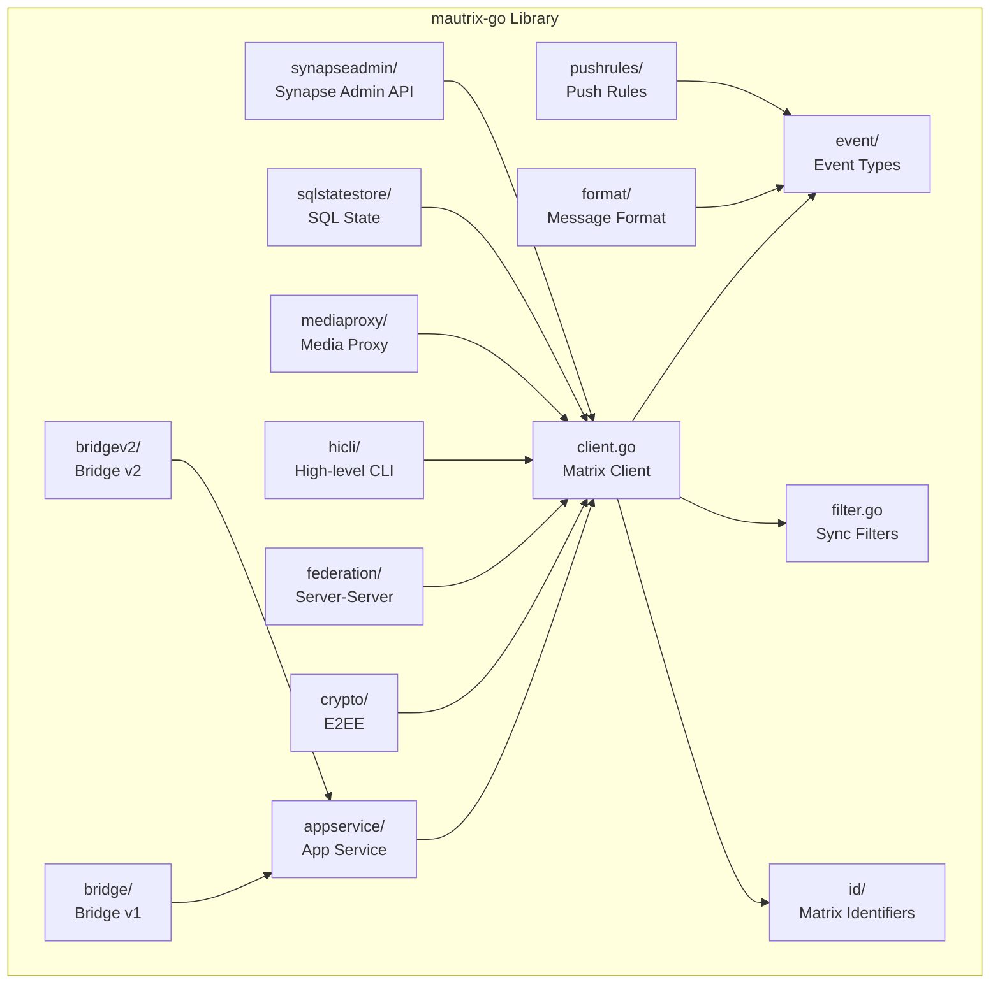

# Sub-Project Exploration: mautrix-go

## Overview

mautrix-go is a comprehensive Go library and framework for building Matrix bridges and bots. It provides a full Matrix client implementation, application service framework, bridge scaffolding (both v1 and v2 architectures), end-to-end encryption support, and utilities for building protocol bridges that connect Matrix to external messaging platforms like WhatsApp, Telegram, Signal, and others.

The library is maintained under the `go.mau.fi` namespace and forked/maintained by Element for their bridge deployments.

## Architecture

### High-Level Diagram



### Package Structure

```
mautrix-go/
├── client.go               # Core Matrix client
├── requests.go             # API request types
├── filter.go               # Sync filter definitions
├── error.go                # Error types
├── appservice/             # Application Service framework
├── bridge/                 # Bridge framework v1 (legacy)
├── bridgev2/               # Bridge framework v2 (current)
├── crypto/                 # End-to-end encryption (Olm/Megolm)
├── event/                  # Matrix event type definitions
├── federation/             # Server-server federation types
├── format/                 # Message formatting (HTML/Markdown)
├── hicli/                  # High-level CLI client library
├── id/                     # Matrix identifier types (@user, #room, !room)
├── mediaproxy/             # Media proxy for bridges
├── pushrules/              # Push notification rule engine
├── sqlstatestore/          # SQL-backed state storage
├── synapseadmin/           # Synapse admin API client
├── go.mod
└── go.sum
```

## Component Breakdown

### Bridge Framework v2 (`bridgev2/`)
- **Purpose:** Modern bridge architecture with improved message deduplication, double-puppeting, backfill, and relay mode.
- **Key abstractions:** NetworkAPI, NetworkConnector, Portal, Ghost (remote user puppet)
- Used by mautrix-whatsapp, mautrix-telegram, and other bridges

### Application Service (`appservice/`)
- **Purpose:** Implements the Matrix Application Service API, handling transactions, namespace registration, and virtual user management.

### Crypto (`crypto/`)
- **Purpose:** End-to-end encryption support for bridges. Handles Olm sessions, Megolm group sessions, key sharing, and device verification.

### Event Types (`event/`)
- **Purpose:** Complete type definitions for all Matrix event types (m.room.message, m.room.member, m.room.encrypted, etc.).

### HiCli (`hicli/`)
- **Purpose:** High-level interactive Matrix client library, useful for building CLI-based Matrix clients.

## External Dependencies

| Dependency | Purpose |
|------------|---------|
| gorilla/mux | HTTP routing |
| gorilla/websocket | WebSocket support |
| lib/pq | PostgreSQL driver |
| mattn/go-sqlite3 | SQLite driver |
| rs/zerolog | Structured logging |
| tidwall/gjson/sjson | JSON path manipulation |
| yuin/goldmark | Markdown to HTML |
| skip2/go-qrcode | QR code generation |
| go.mau.fi/util | Shared utilities |
| golang.org/x/crypto | Cryptographic primitives |

## Key Insights

- **Dual bridge architecture:** v1 (legacy, `bridge/`) and v2 (`bridgev2/`) coexist for migration
- Bridge v2 provides significant improvements in reliability and feature completeness
- Media proxy allows bridges to serve remote media through Matrix's media API
- SQL state store supports both PostgreSQL and SQLite for bridge state persistence
- The library is the foundation for Element's entire bridge ecosystem
- Go 1.21 minimum version requirement
- `go.mau.fi` namespace indicates the original mautrix ecosystem by tulir (Mau)
