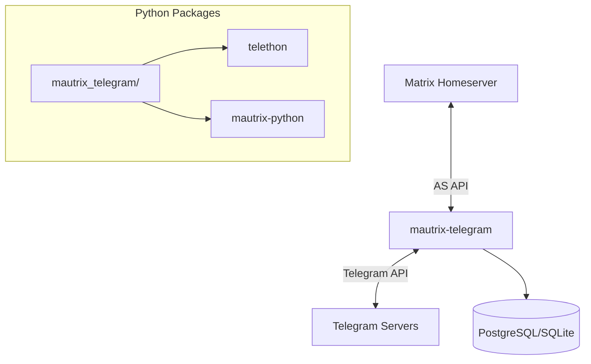

# Sub-Project Exploration: mautrix-telegram

## Overview

mautrix-telegram is a Matrix-Telegram bridge written in Python using Telethon (Telegram client library) and the mautrix-python bridge framework. It bridges Telegram chats, groups, supergroups, and channels to Matrix rooms, supporting message formatting, media, reactions, edits, and Telegram bot commands.

## Architecture



### Structure

```
mautrix-telegram/
├── mautrix_telegram/       # Main Python package
├── pyproject.toml          # Python project config
├── setup.py                # Legacy setup
├── requirements.txt        # Core dependencies
├── optional-requirements.txt # Optional features
├── Dockerfile
└── docker-run.sh
```

## Key Insights

- Python-based bridge using Telethon for Telegram API access
- Supports both user login (personal Telegram account) and bot login modes
- Part of the mautrix bridge ecosystem (Python variant, complementing Go bridges)
- Docker deployment is standard
- Separate requirements files for core vs optional dependencies
