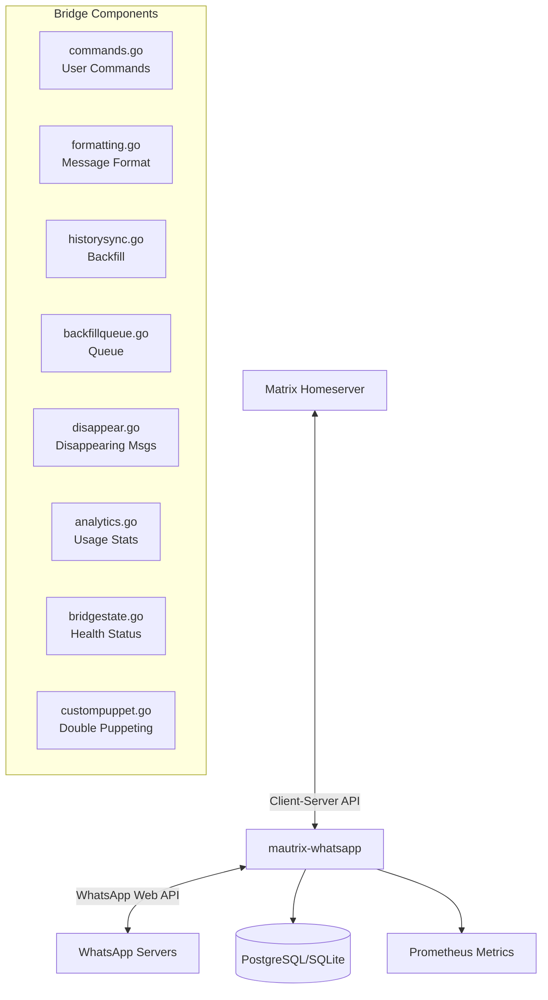

# Sub-Project Exploration: mautrix-whatsapp

## Overview

mautrix-whatsapp is a Matrix-WhatsApp bridge that allows Matrix users to communicate with WhatsApp contacts. Built on mautrix-go's bridge framework and the whatsmeow WhatsApp Web multi-device API library, it supports message bridging, media transfer, reactions, read receipts, typing notifications, contact list sync, group management, and end-to-end encryption.

## Architecture



### Key Files

```
mautrix-whatsapp/
├── main.go                 # Entry point (not shown, likely in cmd/)
├── commands.go             # Bridge user commands (!wa ...)
├── formatting.go           # WhatsApp <-> Matrix message format conversion
├── historysync.go          # WhatsApp history sync/backfill to Matrix
├── backfillqueue.go        # Queued backfill operations
├── disappear.go            # Disappearing message support
├── analytics.go            # Usage analytics
├── bridgestate.go          # Bridge health reporting
├── custompuppet.go         # Double-puppeting (appear as real Matrix user)
├── config/                 # Bridge configuration
├── database/               # Database schema and queries
├── example-config.yaml     # Sample configuration
├── build.sh                # Build script
├── Dockerfile              # Container build
├── docker-run.sh           # Container run script
└── go.mod
```

## Key Insights

- Uses `go.mau.fi/whatsmeow` for WhatsApp Web multi-device protocol (no phone required after initial QR scan)
- Supports history sync (backfill) from WhatsApp to Matrix rooms
- Double-puppeting allows messages sent from WhatsApp to appear from the user's real Matrix account
- Disappearing messages are bridged with Matrix's self-destruct timer
- Prometheus metrics for monitoring bridge health and throughput
- PostgreSQL and SQLite both supported for bridge state
- Docker deployment is the primary distribution method
- Built on mautrix-go bridge framework (v1 era, potential migration to v2)
