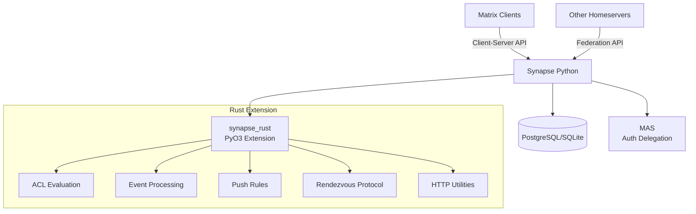

# Sub-Project Exploration: Synapse

## Overview

Synapse is the reference Matrix homeserver implementation, primarily written in Python with performance-critical components implemented as Rust extension modules via PyO3. It handles room management, message routing, federation between homeservers, user management, and the full Matrix Client-Server and Server-Server APIs.

The Rust extension module (`synapse_rust`) provides optimized implementations for canonical JSON serialization, event hashing, push rule evaluation, and other hot paths where Python's performance is insufficient.

## Architecture

### High-Level Diagram



### Rust Extension Structure

```
synapse/
├── rust/
│   ├── Cargo.toml              # Rust crate config (cdylib + lib)
│   └── src/
│       ├── lib.rs              # PyO3 module definition
│       ├── acl/                # Server ACL evaluation
│       ├── errors.rs           # Error types bridged to Python
│       ├── events/             # Event processing (canonical JSON, hashing)
│       ├── http.rs             # HTTP utilities
│       ├── identifier.rs       # Matrix identifier parsing
│       ├── matrix_const.rs     # Protocol constants
│       ├── push/               # Push notification rule evaluation
│       └── rendezvous/         # QR code login rendezvous protocol
├── synapse/                    # Main Python codebase
├── Cargo.toml                  # Workspace root
├── poetry.lock                 # Python dependencies
└── build_rust.py               # Maturin build integration
```

## Component Breakdown

### Rust Extension Modules

#### ACL Module
- **Purpose:** Evaluates server access control lists efficiently in Rust, avoiding Python overhead for this hot path.

#### Events Module
- **Purpose:** Canonical JSON serialization for Matrix events (required for federation signatures), event content hashing.

#### Push Rules Module
- **Purpose:** Evaluates push notification rules against events. This is performance-critical as it runs for every event for every user.

#### Rendezvous Module
- **Purpose:** Implements the QR code login rendezvous protocol for cross-device sign-in.

#### HTTP Module
- **Purpose:** HTTP header parsing and utility functions.

#### Identifier Module
- **Purpose:** Matrix identifier parsing and validation (@user:server, #room:server, !room:server).

## External Dependencies (Rust)

| Dependency | Version | Purpose |
|------------|---------|---------|
| pyo3 | 0.23.5 | Python-Rust bindings (abi3, Python 3.9+) |
| pyo3-log | 0.12.0 | Bridge Rust logging to Python |
| pythonize | 0.23.0 | Convert between Python objects and serde types |
| serde/serde_json | 1 | JSON serialization |
| sha2 | 0.10.8 | SHA-256 hashing for events |
| regex | 1.6.0 | Pattern matching |
| ulid | 1.1.2 | ULID generation |
| base64 | 0.21.7 | Base64 encoding |

## Key Insights

- **PyO3 with abi3** ensures the compiled extension works across Python 3.9+ without recompilation per Python version
- The Rust extension is built as a `cdylib` (shared library) loaded by Python at runtime
- Maturin handles the build/packaging pipeline (`build_rust.py`)
- The workspace root `Cargo.toml` exists solely to allow running `cargo` commands from the project root
- Canonical JSON is a Matrix-specific JSON serialization format required for federation - keys must be sorted, no insignificant whitespace, specific number formatting
- Push rule evaluation in Rust is a significant performance win since it's an O(users * rules * events) operation
- Synapse uses both PostgreSQL and SQLite backends; the Rust extension is storage-agnostic
