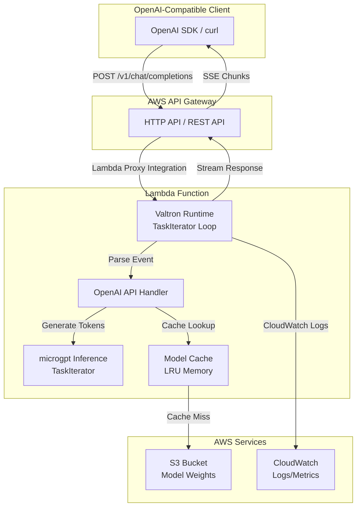
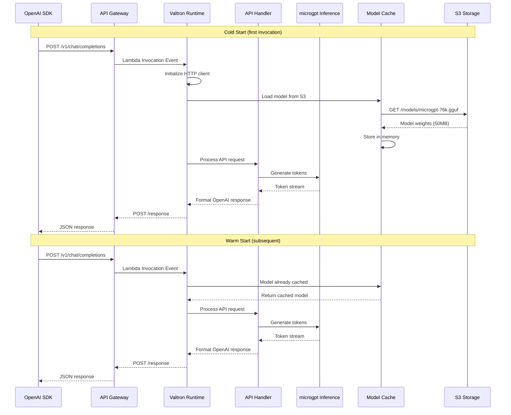

# Valtron Integration: Serverless GPT Inference on AWS Lambda

## Overview

This deep dive covers implementing a **serverless GPT model inference service** on AWS Lambda using **Valtron executors**. The service provides an OpenAI-compatible API (`/v1/chat/completions`, `/v1/completions`, `/v1/models`) while running entirely on Lambda's serverless infrastructure.

Key characteristics:
- **No tokio, no async/await** - Uses Valtron's synchronous TaskIterator pattern
- **OpenAI-compatible API** - Drop-in replacement for OpenAI endpoints
- **Streaming responses (SSE)** - Server-Sent Events for token-by-token streaming
- **S3 model storage** - Load model weights from S3 with local caching
- **Memory-efficient inference** - microgpt forward pass as TaskIterator

### Why Lambda for GPT Inference?

| Aspect | Traditional EC2/GPU | Lambda + Valtron |
|--------|--------------------|------------------|
| **Cost** | $0.50-5/hour (always on) | $0.0000166/GB-second (pay per request) |
| **Scaling** | Manual or Auto Scaling Groups | Automatic, instant scaling |
| **Cold Start** | N/A (always warm) | 100-500ms (acceptable for inference) |
| **Max Request Time** | Unlimited | 15 minutes (sufficient for most completions) |
| **Memory** | Fixed instance size | 128MB - 10GB per invocation |
| **Management** | OS patches, updates | Fully managed |
| **Binary Size** | No limit | 250MB unzipped (sufficient for small models) |

### Architecture Overview



---

## 1. Lambda Runtime API for Inference Services

### 1.1 Core Endpoints

AWS Lambda provides a **Runtime API** at `http://127.0.0.1:9001` that all custom runtimes must implement.

#### `/runtime/invocation/next` (GET)

Long-polling endpoint that blocks until an invocation is available.

**Request:**
```http
GET /runtime/invocation/next HTTP/1.1
Host: 127.0.0.1:9001
User-Agent: microgpt-lambda/1.0
```

**Response Headers:**
```http
HTTP/1.1 200 OK
Content-Type: application/json
Lambda-Runtime-Aws-Request-Id: af9c3624-3842-4d84-8c95-e0a8e7f6c4b5
Lambda-Runtime-Deadline-Ms: 1711564800000
Lambda-Runtime-Invoked-Function-Arn: arn:aws:lambda:us-east-1:123456789012:function:microgpt
Lambda-Runtime-Trace-Id: Root=1-65f9c8a0-1234567890abcdef12345678
```

**Response Body (API Gateway v2 proxy format):**
```json
{
  "version": "2.0",
  "routeKey": "POST /v1/chat/completions",
  "rawPath": "/v1/chat/completions",
  "rawQueryString": "",
  "headers": {
    "content-type": "application/json",
    "host": "api.example.com",
    "authorization": "Bearer sk-xxx"
  },
  "requestContext": {
    "accountId": "123456789012",
    "apiId": "abc123",
    "domainName": "api.example.com",
    "http": {
      "method": "POST",
      "path": "/v1/chat/completions",
      "protocol": "HTTP/1.1",
      "sourceIp": "203.0.113.1"
    },
    "requestId": "abc123",
    "stage": "$default",
    "time": "27/Mar/2026:10:00:00 +0000",
    "timeEpoch": 1711564800000
  },
  "body": "{\"model\":\"microgpt\",\"messages\":[{\"role\":\"user\",\"content\":\"Hello\"}]}",
  "isBase64Encoded": false
}
```

#### `/runtime/invocation/{id}/response` (POST)

Sends the invocation response back to Lambda.

**Request:**
```http
POST /runtime/invocation/af9c3624-3842-4d84-8c95-e0a8e7f6c4b5/response HTTP/1.1
Host: 127.0.0.1:9001
Content-Type: application/json

{
  "statusCode": 200,
  "headers": {
    "content-type": "application/json",
    "cache-control": "no-cache",
    "x-accel-buffering": "no"
  },
  "body": "{\"id\":\"chatcmpl-123\",\"choices\":[{\"message\":{\"role\":\"assistant\",\"content\":\"Hello!\"}}]}",
  "isBase64Encoded": false
}
```

**For Streaming (SSE):**
```http
POST /runtime/invocation/{id}/response HTTP/1.1
Host: 127.0.0.1:9001
Content-Type: application/json
Lambda-Runtime-Function-Response-Mode: Streaming

{
  "statusCode": 200,
  "headers": {
    "content-type": "text/event-stream",
    "cache-control": "no-cache",
    "connection": "keep-alive"
  },
  "body": "data: {\"choices\":[{\"delta\":{\"content\":\"Hello\"}}]}\n\n"
}
```

### 1.2 API Gateway Integration

**API Gateway Configuration for OpenAI Compatibility:**

```yaml
# serverless.yml or SAM template
Resources:
  ApiGateway:
    Type: AWS::ApiGatewayV2::Api
    Properties:
      Name: microgpt-api
      ProtocolType: HTTP
      RouteSelectionExpression: "$request.method $request.path"

  ChatCompletionsRoute:
    Type: AWS::ApiGatewayV2::Route
    Properties:
      ApiId: !Ref ApiGateway
      RouteKey: "POST /v1/chat/completions"
      Target: !Sub "integrations/${LambdaIntegration}"

  CompletionsRoute:
    Type: AWS::ApiGatewayV2::Route
    Properties:
      ApiId: !Ref ApiGateway
      RouteKey: "POST /v1/completions"
      Target: !Sub "integrations/${LambdaIntegration}"

  ModelsRoute:
    Type: AWS::ApiGatewayV2::Route
    Properties:
      ApiId: !Ref ApiGateway
      RouteKey: "GET /v1/models"
      Target: !Sub "integrations/${LambdaIntegration}"

  LambdaIntegration:
    Type: AWS::ApiGatewayV2::Integration
    Properties:
      ApiId: !Ref ApiGateway
      IntegrationType: AWS_PROXY
      IntegrationUri: !GetAtt LambdaFunction.Arn
      PayloadFormatVersion: "2.0"
      TimeoutInMillis: 900000  # 15 minutes (Lambda max)
```

### 1.3 Invocation Sequence Diagram



---

## 2. OpenAI-Compatible HTTP API

### 2.1 Endpoint Summary

| Endpoint | Method | Description | Streaming |
|----------|--------|-------------|-----------|
| `/v1/chat/completions` | POST | Chat completion API | Yes (SSE) |
| `/v1/completions` | POST | Legacy completion API | Yes (SSE) |
| `/v1/models` | GET | List available models | No |
| `/v1/models/{id}` | GET | Get model details | No |

### 2.2 `/v1/chat/completions` Endpoint

**Request:**
```json
{
  "model": "microgpt",
  "messages": [
    {"role": "system", "content": "You are a helpful assistant."},
    {"role": "user", "content": "Hello, world!"}
  ],
  "temperature": 0.7,
  "max_tokens": 100,
  "top_p": 1.0,
  "stream": false,
  "stop": ["\n\n"],
  "presence_penalty": 0.0,
  "frequency_penalty": 0.0
}
```

**Response (non-streaming):**
```json
{
  "id": "chatcmpl-abc123",
  "object": "chat.completion",
  "created": 1711564800,
  "model": "microgpt",
  "choices": [
    {
      "index": 0,
      "message": {
        "role": "assistant",
        "content": "Hello! How can I help you today?"
      },
      "finish_reason": "stop"
    }
  ],
  "usage": {
    "prompt_tokens": 15,
    "completion_tokens": 10,
    "total_tokens": 25
  }
}
```

**Streaming Response (SSE format):**
```
data: {"id":"chatcmpl-abc123","choices":[{"index":0,"delta":{"role":"assistant"},"finish_reason":null}]}

data: {"id":"chatcmpl-abc123","choices":[{"index":0,"delta":{"content":"Hello"},"finish_reason":null}]}

data: {"id":"chatcmpl-abc123","choices":[{"index":0,"delta":{"content":"!"},"finish_reason":null}]}

data: {"id":"chatcmpl-abc123","choices":[{"index":0,"delta":{"content":" How"},"finish_reason":null}]}

data: {"id":"chatcmpl-abc123","choices":[{"index":0,"delta":{},"finish_reason":"stop"}]}

data: [DONE]
```

### 2.3 `/v1/completions` Endpoint

**Request:**
```json
{
  "model": "microgpt",
  "prompt": "Once upon a time",
  "temperature": 0.7,
  "max_tokens": 100,
  "top_p": 1.0,
  "stream": false,
  "stop": ["\n", "."],
  "presence_penalty": 0.0,
  "frequency_penalty": 0.0
}
```

**Response:**
```json
{
  "id": "cmpl-abc123",
  "object": "text_completion",
  "created": 1711564800,
  "model": "microgpt",
  "choices": [
    {
      "text": ", there was a brave knight who lived in a castle.",
      "index": 0,
      "finish_reason": "stop"
    }
  ],
  "usage": {
    "prompt_tokens": 4,
    "completion_tokens": 15,
    "total_tokens": 19
  }
}
```

### 2.4 `/v1/models` Endpoint

**Request:**
```http
GET /v1/models HTTP/1.1
Host: api.example.com
Authorization: Bearer sk-xxx
```

**Response:**
```json
{
  "object": "list",
  "data": [
    {
      "id": "microgpt",
      "object": "model",
      "created": 1711564800,
      "owned_by": "microgpt-lambda",
      "permission": [],
      "root": "microgpt",
      "parent": null
    }
  ]
}
```

**`/v1/models/{id}` Response:**
```json
{
  "id": "microgpt",
  "object": "model",
  "created": 1711564800,
  "owned_by": "microgpt-lambda",
  "context_window": 256,
  "max_tokens": 256,
  "capabilities": {
    "chat": true,
    "completion": true,
    "streaming": true
  }
}
```

---

## 3. Valtron-Based Inference Runtime

### 3.1 Core Types

```rust
// src/lambda/runtime.rs

use foundation_core::valtron::{TaskIterator, TaskStatus, NoSpawner};
use std::time::Duration;

/// Lambda Runtime API base URL
const LAMBDA_RUNTIME_API: &str = "http://127.0.0.1:9001";

/// Invocation context from Lambda Runtime API
#[derive(Debug, Clone)]
pub struct InvocationContext {
    pub request_id: String,
    pub deadline_ms: u64,
    pub invoked_function_arn: String,
    pub trace_id: String,
}

impl InvocationContext {
    pub fn from_headers(headers: &std::collections::HashMap<String, String>) -> Option<Self> {
        Some(Self {
            request_id: headers.get("lambda-runtime-aws-request-id")?.clone(),
            deadline_ms: headers.get("lambda-runtime-deadline-ms")?
                .parse::<u64>()
                .unwrap_or(0),
            invoked_function_arn: headers.get("lambda-runtime-invoked-function-arn")?.clone(),
            trace_id: headers.get("lambda-runtime-trace-id")?.clone(),
        })
    }

    /// Check remaining time before deadline
    pub fn remaining_time_ms(&self) -> u64 {
        let now = std::time::SystemTime::now()
            .duration_since(std::time::UNIX_EPOCH)
            .unwrap()
            .as_millis() as u64;
        self.deadline_ms.saturating_sub(now)
    }

    /// Check if we should stop generation (approaching timeout)
    pub fn should_stop_generation(&self, buffer_ms: u64) -> bool {
        self.remaining_time_ms() < buffer_ms
    }
}
```

### 3.2 HTTP Client for Lambda Runtime API

```rust
// src/lambda/http_client.rs

use std::collections::HashMap;
use std::time::Duration;

/// Minimal blocking HTTP client for Lambda Runtime API
/// No tokio, no async - pure synchronous HTTP
pub struct HttpClient {
    timeout_ms: u64,
}

impl HttpClient {
    pub fn new(timeout_ms: u64) -> Self {
        Self { timeout_ms }
    }

    /// GET request to Runtime API
    pub fn get(&self, url: &str) -> Result<(HashMap<String, String>, String), String> {
        // Using ureq for blocking HTTP (or minimal_req)
        let response = ureq::get(url)
            .timeout(Duration::from_millis(self.timeout_ms))
            .call()
            .map_err(|e| format!("HTTP GET failed: {}", e))?;

        let mut headers = HashMap::new();
        for name in response.headers_names() {
            if let Some(value) = response.header(&name) {
                headers.insert(name.to_lowercase(), value.to_string());
            }
        }

        let body = response.into_string()
            .map_err(|e| format!("Failed to read body: {}", e))?;

        Ok((headers, body))
    }

    /// POST request with JSON body
    pub fn post(&self, url: &str, body: &str) -> Result<(), String> {
        ureq::post(url)
            .set("Content-Type", "application/json")
            .send_string(body)
            .map_err(|e| format!("HTTP POST failed: {}", e))?;
        Ok(())
    }

    /// POST response to Runtime API
    pub fn post_response(&self, request_id: &str, response: &str) -> Result<(), String> {
        let url = format!("{}/runtime/invocation/{}/response", LAMBDA_RUNTIME_API, request_id);
        self.post(&url, response)
    }

    /// POST error to Runtime API
    pub fn post_error(&self, request_id: &str, error: &LambdaError) -> Result<(), String> {
        let url = format!("{}/runtime/invocation/{}/error", LAMBDA_RUNTIME_API, request_id);
        let body = serde_json::to_string(error).unwrap_or_default();
        self.post(&url, &body)
    }
}

/// Lambda error structure
#[derive(Debug, serde::Serialize)]
pub struct LambdaError {
    pub error_message: String,
    pub error_type: String,
    #[serde(skip_serializing_if = "Option::is_none")]
    pub stack_trace: Option<Vec<String>>,
}
```

### 3.3 S3 Integration for Model Loading

```rust
// src/model/s3_loader.rs

use std::collections::HashMap;
use std::fs::{self, File};
use std::io::{Read, Write};
use std::path::Path;

/// S3 HTTP client for model loading (uses presigned URLs)
pub struct S3ModelLoader {
    bucket: String,
    region: String,
    http_client: HttpClient,
}

impl S3ModelLoader {
    pub fn new(bucket: &str, region: &str) -> Self {
        Self {
            bucket: bucket.to_string(),
            region: region.to_string(),
            http_client: HttpClient::new(60_000), // 60 second timeout for large downloads
        }
    }

    /// Download model from S3 using presigned URL
    /// Presigned URL should be generated with appropriate IAM permissions
    pub fn download_model(&self, key: &str, presigned_url: &str, local_path: &Path) -> Result<u64, String> {
        // Download from presigned URL
        let response = ureq::get(presigned_url)
            .timeout(Duration::from_secs(300)) // 5 minutes for large models
            .call()
            .map_err(|e| format!("S3 download failed: {}", e))?;

        let content_length: u64 = response.header("Content-Length")
            .and_then(|s| s.parse().ok())
            .unwrap_or(0);

        // Read response body
        let mut bytes = response.into_bytes()
            .map_err(|e| format!("Failed to read S3 response: {}", e))?;

        // Ensure directory exists
        if let Some(parent) = local_path.parent() {
            fs::create_dir_all(parent)
                .map_err(|e| format!("Failed to create directory: {}", e))?;
        }

        // Write to local file
        let mut file = File::create(local_path)
            .map_err(|e| format!("Failed to create file: {}", e))?;
        file.write_all(&bytes)
            .map_err(|e| format!("Failed to write file: {}", e))?;

        Ok(content_length)
    }

    /// Check if model exists in S3
    pub fn model_exists(&self, key: &str) -> Result<bool, String> {
        // This would typically use AWS SDK or a HEAD request
        // For simplicity, we assume presigned URL generation would fail if not exists
        Ok(true)
    }
}
```

### 3.4 Model Caching Strategies

```rust
// src/model/cache.rs

use std::collections::HashMap;
use std::sync::{Arc, Mutex};
use std::time::{Duration, Instant};

/// Cached model with metadata
pub struct CachedModel {
    pub weights: Vec<f32>,
    pub config: ModelConfig,
    pub loaded_at: Instant,
    pub last_used: Instant,
    pub size_bytes: u64,
}

/// LRU model cache with size limits
pub struct ModelCache {
    models: HashMap<String, Arc<Mutex<CachedModel>>>,
    max_memory_bytes: u64,
    current_memory_bytes: u64,
}

impl ModelCache {
    pub fn new(max_memory_mb: u64) -> Self {
        Self {
            models: HashMap::new(),
            max_memory_bytes: max_memory_mb * 1024 * 1024,
            current_memory_bytes: 0,
        }
    }

    /// Get model from cache
    pub fn get(&self, model_id: &str) -> Option<Arc<Mutex<CachedModel>>> {
        self.models.get(model_id).cloned()
    }

    /// Insert model into cache (evicts LRU if needed)
    pub fn insert(&mut self, model_id: String, model: CachedModel) -> Result<(), String> {
        let model_size = model.size_bytes;

        // Evict LRU models if we exceed memory limit
        while self.current_memory_bytes + model_size > self.max_memory_bytes {
            if !self.evict_lru() {
                return Err("Cannot fit model in cache even after evicting all".to_string());
            }
        }

        let arc_model = Arc::new(Mutex::new(model));
        self.models.insert(model_id.clone(), arc_model);
        self.current_memory_bytes += model_size;

        Ok(())
    }

    /// Evict least recently used model
    fn evict_lru(&mut self) -> bool {
        let lru_key = self.models
            .iter()
            .min_by_key(|(_, v)| v.lock().unwrap().last_used)
            .map(|(k, _)| k.clone());

        if let Some(key) = lru_key {
            if let Some(model) = self.models.remove(&key) {
                let size = model.lock().unwrap().size_bytes;
                self.current_memory_bytes = self.current_memory_bytes.saturating_sub(size);
                return true;
            }
        }
        false
    }

    /// Update last_used timestamp
    pub fn touch(&self, model_id: &str) {
        if let Some(model) = self.models.get(model_id) {
            model.lock().unwrap().last_used = Instant::now();
        }
    }

    /// Cache statistics
    pub fn stats(&self) -> CacheStats {
        CacheStats {
            cached_models: self.models.len(),
            memory_used_bytes: self.current_memory_bytes,
            memory_limit_bytes: self.max_memory_bytes,
        }
    }
}

#[derive(Debug)]
pub struct CacheStats {
    pub cached_models: usize,
    pub memory_used_bytes: u64,
    pub memory_limit_bytes: u64,
}
```

---

## 4. Model Inference on Lambda

### 4.1 microgpt Forward Pass as TaskIterator

```rust
// src/inference/task_iterator.rs

use foundation_core::valtron::{TaskIterator, TaskStatus, NoSpawner};
use std::time::Duration;

/// Token generation state
#[derive(Debug, Clone)]
pub enum InferenceState {
    /// Initializing (loading context, etc.)
    Initializing,
    /// Processing prompt
    ProcessingPrompt { tokens: Vec<u32> },
    /// Ready to generate next token
    ReadyToGenerate { position: usize },
    /// Generating token (forward pass in progress)
    Generating { position: usize },
    /// Token generated, yielding result
    TokenReady { token: u32, position: usize },
    /// Generation complete
    Completed { stop_reason: StopReason },
    /// Error occurred
    Error { message: String },
}

/// Stop reason for generation
#[derive(Debug, Clone)]
pub enum StopReason {
    StopToken,
    MaxTokens,
    Timeout,
    EOS,
}

/// microgpt inference TaskIterator
pub struct InferenceTask<'a> {
    /// Model weights and config
    model: &'a mut MicroGPTModel,
    /// Input prompt tokens
    prompt_tokens: Vec<u32>,
    /// Current state
    state: InferenceState,
    /// Generation config
    config: GenerationConfig,
    /// Generated tokens so far
    generated_tokens: Vec<u32>,
    /// Current position in sequence
    position: usize,
    /// Token count (for max_tokens limit)
    token_count: usize,
    /// Start time (for timeout)
    start_time: std::time::Instant,
    /// Deadline from Lambda context
    deadline_ms: Option<u64>,
}

impl<'a> InferenceTask<'a> {
    pub fn new(
        model: &'a mut MicroGPTModel,
        prompt_tokens: Vec<u32>,
        config: GenerationConfig,
        deadline_ms: Option<u64>,
    ) -> Self {
        Self {
            model,
            prompt_tokens,
            state: InferenceState::Initializing,
            config,
            generated_tokens: Vec::new(),
            position: 0,
            token_count: 0,
            start_time: std::time::Instant::now(),
            deadline_ms,
        }
    }

    /// Check if we should stop generation
    fn should_stop(&self) -> Option<StopReason> {
        // Check max tokens
        if self.token_count >= self.config.max_tokens {
            return Some(StopReason::MaxTokens);
        }

        // Check timeout
        if let Some(deadline) = self.deadline_ms {
            let now = std::time::SystemTime::now()
                .duration_since(std::time::UNIX_EPOCH)
                .unwrap()
                .as_millis() as u64;
            if now >= deadline {
                return Some(StopReason::Timeout);
            }
        }

        // Check stop tokens
        if let Some(last_token) = self.generated_tokens.last() {
            if self.config.stop_tokens.contains(last_token) {
                return Some(StopReason::StopToken);
            }
        }

        None
    }

    /// Single forward pass to generate next token
    fn forward_pass(&mut self) -> u32 {
        // Prepare input sequence
        let mut sequence = self.prompt_tokens.clone();
        sequence.extend(&self.generated_tokens);

        // Run forward pass through model
        let logits = self.model.forward(&sequence, self.position);

        // Apply temperature sampling
        let token = sample_token(&logits, self.config.temperature, self.config.top_p);

        token
    }
}

impl<'a> TaskIterator for InferenceTask<'a> {
    type Pending = Duration;  // Yield between tokens
    type Ready = InferenceResult;  // Generated token
    type Spawner = NoSpawner;

    fn next(&mut self) -> Option<TaskStatus<Self::Ready, Self::Pending, Self::Spawner>> {
        match std::mem::replace(&mut self.state, InferenceState::Error { message: "Invalid state".to_string() }) {
            InferenceState::Initializing => {
                // Start with processing prompt
                self.state = InferenceState::ProcessingPrompt {
                    tokens: self.prompt_tokens.clone(),
                };
                self.next()  // Continue immediately
            }

            InferenceState::ProcessingPrompt { .. } => {
                // Prompt processed, ready to generate
                self.state = InferenceState::ReadyToGenerate { position: 0 };
                self.next()  // Continue immediately
            }

            InferenceState::ReadyToGenerate { position } => {
                // Check if we should stop
                if let Some(reason) = self.should_stop() {
                    self.state = InferenceState::Completed { stop_reason: reason };
                    return self.next();
                }

                // Start forward pass
                self.state = InferenceState::Generating { position };
                self.next()  // Continue immediately (forward pass is synchronous)
            }

            InferenceState::Generating { position } => {
                // Run forward pass (synchronous in valtron)
                let token = self.forward_pass();

                self.generated_tokens.push(token);
                self.token_count += 1;
                self.position = position + 1;

                // Yield token immediately
                self.state = InferenceState::ReadyToGenerate { position: self.position };

                Some(TaskStatus::Ready(InferenceResult {
                    token,
                    position,
                    is_done: false,
                }))
            }

            InferenceState::TokenReady { token, position } => {
                // This state shouldn't be reached due to immediate yielding above
                self.state = InferenceState::ReadyToGenerate { position: position + 1 };
                Some(TaskStatus::Ready(InferenceResult {
                    token,
                    position,
                    is_done: false,
                }))
            }

            InferenceState::Completed { stop_reason } => {
                // Yield final result indicating completion
                Some(TaskStatus::Ready(InferenceResult {
                    token: 0,  // Sentinel value
                    position: self.position,
                    is_done: true,
                }))
            }

            InferenceState::Error { message } => {
                Some(TaskStatus::Ready(InferenceResult {
                    token: 0,
                    position: 0,
                    is_done: true,
                }))
            }
        }
    }
}

/// Single inference result
#[derive(Debug, Clone)]
pub struct InferenceResult {
    pub token: u32,
    pub position: usize,
    pub is_done: bool,
}
```

### 4.2 Token-by-Token Generation

```rust
// src/inference/sampling.rs

use rand::{Rng, distributions::WeightedIndex};

/// Sample a token from logits with temperature
pub fn sample_token(logits: &[f32], temperature: f32, top_p: f32) -> u32 {
    if temperature == 0.0 {
        // Greedy decoding
        return logits.iter()
            .enumerate()
            .max_by(|(_, a), (_, b)| a.partial_cmp(b).unwrap())
            .map(|(i, _)| i as u32)
            .unwrap_or(0);
    }

    // Apply temperature scaling
    let scaled: Vec<f32> = logits.iter()
        .map(|&l| l / temperature)
        .collect();

    // Apply softmax
    let probs = softmax(&scaled);

    // Apply top-p (nucleus) sampling
    let filtered_probs = apply_top_p(probs, top_p);

    // Sample from distribution
    let dist = WeightedIndex::new(&filtered_probs).unwrap();
    let mut rng = rand::thread_rng();
    dist.sample(&mut rng) as u32
}

/// Softmax function
fn softmax(logits: &[f32]) -> Vec<f32> {
    let max_logit = logits.iter().cloned().fold(f32::NEG_INFINITY, f32::max);
    let exps: Vec<f32> = logits.iter()
        .map(|&l| (l - max_logit).exp())
        .collect();
    let sum_exp: f32 = exps.iter().sum();
    exps.iter().map(|&e| e / sum_exp).collect()
}

/// Apply top-p (nucleus) sampling
fn apply_top_p(probs: Vec<f32>, top_p: f32) -> Vec<f32> {
    if top_p >= 1.0 {
        return probs;
    }

    // Sort probabilities in descending order
    let mut indexed: Vec<(usize, f32)> = probs.iter()
        .enumerate()
        .map(|(i, &p)| (i, p))
        .collect();
    indexed.sort_by(|a, b| b.1.partial_cmp(&a.1).unwrap());

    // Find cutoff
    let mut cumsum = 0.0f32;
    let mut cutoff_idx = indexed.len();

    for (i, (_, prob)) in indexed.iter().enumerate() {
        cumsum += prob;
        if cumsum > top_p {
            cutoff_idx = i + 1;
            break;
        }
    }

    // Zero out probabilities below cutoff
    let mut result = vec![0.0f32; probs.len()];
    for (i, _) in indexed.iter().enumerate().take(cutoff_idx) {
        result[indexed[i].0] = indexed[i].1;
    }

    // Renormalize
    let sum: f32 = result.iter().sum();
    if sum > 0.0 {
        for p in &mut result {
            *p /= sum;
        }
    }

    result
}
```

### 4.3 KV Cache Management

```rust
// src/inference/kv_cache.rs

/// KV Cache for efficient autoregressive generation
/// Stores key and value matrices for each layer to avoid recomputation
pub struct KVCache {
    /// Keys for each layer: [layer][position][head][dim]
    pub keys: Vec<Vec<f32>>,
    /// Values for each layer: [layer][position][head][dim]
    pub values: Vec<Vec<f32>>,
    /// Current sequence length
    pub seq_len: usize,
    /// Maximum sequence length
    pub max_len: usize,
    /// Number of layers
    pub n_layer: usize,
    /// Number of attention heads
    pub n_head: usize,
    /// Head dimension
    pub head_dim: usize,
}

impl KVCache {
    pub fn new(n_layer: usize, n_head: usize, head_dim: usize, max_len: usize) -> Self {
        let kv_size = n_layer * max_len * n_head * head_dim;
        Self {
            keys: vec![0.0f32; kv_size],
            values: vec![0.0f32; kv_size],
            seq_len: 0,
            max_len,
            n_layer,
            n_head,
            head_dim,
        }
    }

    /// Get cache index for a specific position
    #[inline]
    fn index(&self, layer: usize, position: usize, head: usize, dim: usize) -> usize {
        ((layer * self.max_len + position) * self.n_head + head) * self.head_dim + dim
    }

    /// Update cache with new key/value for a single position
    pub fn update(&mut self, layer: usize, head: usize, key: &[f32], value: &[f32], position: usize) {
        for d in 0..self.head_dim {
            let idx = self.index(layer, position, head, d);
            self.keys[idx] = key[d];
            self.values[idx] = value[d];
        }
    }

    /// Get cached keys for a layer up to a position
    pub fn get_keys(&self, layer: usize, up_to: usize) -> &[f32] {
        let start = self.index(layer, 0, 0, 0);
        let end = self.index(layer, up_to, 0, 0);
        &self.keys[start..end]
    }

    /// Get cached values for a layer up to a position
    pub fn get_values(&self, layer: usize, up_to: usize) -> &[f32] {
        let start = self.index(layer, 0, 0, 0);
        let end = self.index(layer, up_to, 0, 0);
        &self.values[start..end]
    }

    /// Clear cache for new sequence
    pub fn clear(&mut self) {
        self.keys.fill(0.0);
        self.values.fill(0.0);
        self.seq_len = 0;
    }

    /// Memory usage in bytes
    pub fn memory_bytes(&self) -> usize {
        (self.keys.len() + self.values.len()) * std::mem::size_of::<f32>()
    }
}
```

---

## 5. Request Types

### 5.1 ChatCompletion Request

```rust
// src/api/types.rs

use serde::{Deserialize, Serialize};
use std::collections::HashMap;

/// OpenAI-compatible ChatCompletion request
#[derive(Debug, Clone, Deserialize)]
pub struct ChatCompletionRequest {
    /// Model ID (e.g., "microgpt")
    pub model: String,

    /// Messages to process
    pub messages: Vec<Message>,

    /// Controls randomness (0.0 - 2.0, default: 1.0)
    #[serde(default)]
    pub temperature: Option<f32>,

    /// Nucleus sampling (0.0 - 1.0, default: 1.0)
    #[serde(default)]
    pub top_p: Option<f32>,

    /// Number of completions (default: 1, we only support 1)
    #[serde(default)]
    pub n: Option<usize>,

    /// Whether to stream responses
    #[serde(default)]
    pub stream: Option<bool>,

    /// Stop sequences
    #[serde(default)]
    pub stop: Option<Vec<String>>,

    /// Max tokens to generate
    #[serde(default)]
    pub max_tokens: Option<usize>,

    /// Presence penalty (-2.0 - 2.0)
    #[serde(default)]
    pub presence_penalty: Option<f32>,

    /// Frequency penalty (-2.0 - 2.0)
    #[serde(default)]
    pub frequency_penalty: Option<f32>,

    /// Logit bias (not implemented, ignored)
    #[serde(default)]
    pub logit_bias: Option<HashMap<String, f32>>,

    /// User identifier (for monitoring)
    #[serde(default)]
    pub user: Option<String>,

    /// Random seed (not implemented, ignored)
    #[serde(default)]
    pub seed: Option<u32>,
}

/// Message in a chat conversation
#[derive(Debug, Clone, Deserialize, Serialize)]
#[serde(tag = "role", rename_all = "lowercase")]
pub enum Message {
    System {
        content: String,
    },
    User {
        content: String,
    },
    Assistant {
        content: String,
        #[serde(skip_serializing_if = "Option::is_none")]
        name: Option<String>,
    },
    Tool {
        content: String,
        tool_call_id: String,
    },
}

impl Message {
    pub fn content(&self) -> &str {
        match self {
            Message::System { content } => content,
            Message::User { content } => content,
            Message::Assistant { content, .. } => content,
            Message::Tool { content, .. } => content,
        }
    }
}
```

### 5.2 Completion Request

```rust
/// OpenAI-compatible Completion request (legacy API)
#[derive(Debug, Clone, Deserialize)]
pub struct CompletionRequest {
    /// Model ID
    pub model: String,

    /// Prompt (string or token array)
    pub prompt: Prompt,

    /// Max tokens to generate
    #[serde(default)]
    pub max_tokens: Option<usize>,

    /// Temperature
    #[serde(default)]
    pub temperature: Option<f32>,

    /// Top-p
    #[serde(default)]
    pub top_p: Option<f32>,

    /// Stop sequences
    #[serde(default)]
    pub stop: Option<Vec<String>>,

    /// Stream responses
    #[serde(default)]
    pub stream: Option<bool>,

    /// Number of completions
    #[serde(default)]
    pub n: Option<usize>,

    /// Presence penalty
    #[serde(default)]
    pub presence_penalty: Option<f32>,

    /// Frequency penalty
    #[serde(default)]
    pub frequency_penalty: Option<f32>,
}

/// Prompt can be a string or array of tokens
#[derive(Debug, Clone, Deserialize)]
#[serde(untagged)]
pub enum Prompt {
    String(String),
    Tokens(Vec<u32>),
    MultipleStrings(Vec<String>),
}
```

### 5.3 API Gateway Proxy Format

```rust
/// API Gateway v2 proxy integration format
#[derive(Debug, Clone, Deserialize)]
pub struct APIGatewayV2Request {
    pub version: String,
    pub route_key: String,
    pub raw_path: String,
    pub raw_query_string: String,
    #[serde(default)]
    pub cookies: Vec<String>,
    #[serde(default)]
    pub headers: HashMap<String, String>,
    #[serde(default)]
    pub query_string_parameters: Option<HashMap<String, String>>,
    pub request_context: APIGatewayV2RequestContext,
    pub body: Option<String>,
    #[serde(default)]
    pub is_base64_encoded: bool,
}

#[derive(Debug, Clone, Deserialize)]
pub struct APIGatewayV2RequestContext {
    pub account_id: String,
    pub api_id: String,
    pub domain_name: String,
    pub domain_prefix: String,
    pub http: APIGatewayV2Http,
    pub request_id: String,
    pub route_key: String,
    pub stage: String,
    pub time: String,
    pub time_epoch: u64,
}

#[derive(Debug, Clone, Deserialize)]
pub struct APIGatewayV2Http {
    pub method: String,
    pub path: String,
    pub protocol: String,
    pub source_ip: String,
    #[serde(default)]
    pub user_agent: String,
}

/// Extract OpenAI request from API Gateway format
impl ChatCompletionRequest {
    pub fn from_gateway_request(gw: &APIGatewayV2Request) -> Result<Self, ApiError> {
        let body = gw.body.as_ref()
            .ok_or_else(|| ApiError::BadRequest("Missing body".to_string()))?;

        let decoded = if gw.is_base64_encoded {
            use std::io::Write;
            let mut decoder = base64::Decoder::new(body.as_bytes());
            let mut decoded = Vec::new();
            std::io::copy(&mut decoder, &mut decoded)
                .map_err(|e| ApiError::BadRequest(format!("Invalid base64: {}", e)))?;
            String::from_utf8(decoded)
                .map_err(|e| ApiError::BadRequest(format!("Invalid UTF-8: {}", e)))?
        } else {
            body.clone()
        };

        serde_json::from_str(&decoded)
            .map_err(|e| ApiError::BadRequest(format!("Invalid JSON: {}", e)))
    }
}
```

---

## 6. Response Types

### 6.1 ChatCompletion Response

```rust
// src/api/responses.rs

use serde::{Deserialize, Serialize};

/// ChatCompletion response
#[derive(Debug, Clone, Serialize)]
pub struct ChatCompletionResponse {
    pub id: String,
    pub object: String,
    pub created: u64,
    pub model: String,
    pub choices: Vec<ChatCompletionChoice>,
    pub usage: Usage,
    #[serde(skip_serializing_if = "Option::is_none")]
    pub system_fingerprint: Option<String>,
}

#[derive(Debug, Clone, Serialize)]
pub struct ChatCompletionChoice {
    pub index: usize,
    pub message: AssistantMessage,
    pub finish_reason: Option<FinishReason>,
}

#[derive(Debug, Clone, Serialize)]
pub struct AssistantMessage {
    pub role: String,
    #[serde(skip_serializing_if = "Option::is_none")]
    pub content: Option<String>,
    #[serde(skip_serializing_if = "Option::is_none")]
    pub tool_calls: Option<Vec<ToolCall>>,
}

#[derive(Debug, Clone, Serialize)]
#[serde(rename_all = "snake_case")]
pub enum FinishReason {
    Stop,
    Length,
    ToolCalls,
    ContentFilter,
}

#[derive(Debug, Clone, Serialize)]
pub struct Usage {
    pub prompt_tokens: usize,
    pub completion_tokens: usize,
    pub total_tokens: usize,
}

impl ChatCompletionResponse {
    pub fn new(
        model: &str,
        content: String,
        prompt_tokens: usize,
        completion_tokens: usize,
        finish_reason: FinishReason,
    ) -> Self {
        Self {
            id: format!("chatcmpl-{}", uuid::simple()),
            object: "chat.completion".to_string(),
            created: std::time::SystemTime::now()
                .duration_since(std::time::UNIX_EPOCH)
                .unwrap()
                .as_secs(),
            model: model.to_string(),
            choices: vec![ChatCompletionChoice {
                index: 0,
                message: AssistantMessage {
                    role: "assistant".to_string(),
                    content: Some(content),
                    tool_calls: None,
                },
                finish_reason: Some(finish_reason),
            }],
            usage: Usage {
                prompt_tokens,
                completion_tokens,
                total_tokens: prompt_tokens + completion_tokens,
            },
            system_fingerprint: None,
        }
    }
}
```

### 6.2 Streaming Responses (SSE Format)

```rust
/// ChatCompletion chunk for streaming
#[derive(Debug, Clone, Serialize)]
pub struct ChatCompletionChunk {
    pub id: String,
    pub object: String,
    pub created: u64,
    pub model: String,
    pub choices: Vec<ChunkChoice>,
}

#[derive(Debug, Clone, Serialize)]
pub struct ChunkChoice {
    pub index: usize,
    pub delta: ChoiceDelta,
    pub finish_reason: Option<FinishReason>,
}

#[derive(Debug, Clone, Serialize)]
pub struct ChoiceDelta {
    #[serde(skip_serializing_if = "Option::is_none")]
    pub role: Option<String>,
    #[serde(skip_serializing_if = "Option::is_none")]
    pub content: Option<String>,
}

/// SSE chunk formatter
pub struct SSEFormatter {
    response_id: String,
    created: u64,
    model: String,
}

impl SSEFormatter {
    pub fn new(model: &str) -> Self {
        Self {
            response_id: format!("chatcmpl-{}", uuid::simple()),
            created: std::time::SystemTime::now()
                .duration_since(std::time::UNIX_EPOCH)
                .unwrap()
                .as_secs(),
            model: model.to_string(),
        }
    }

    /// Format role delta (first chunk)
    pub fn format_role(&self, role: &str) -> String {
        let chunk = ChatCompletionChunk {
            id: self.response_id.clone(),
            object: "chat.completion.chunk".to_string(),
            created: self.created,
            model: self.model.clone(),
            choices: vec![ChunkChoice {
                index: 0,
                delta: ChoiceDelta {
                    role: Some(role.to_string()),
                    content: None,
                },
                finish_reason: None,
            }],
        };
        self.format_chunk(chunk)
    }

    /// Format content delta
    pub fn format_content(&self, content: &str) -> String {
        let chunk = ChatCompletionChunk {
            id: self.response_id.clone(),
            object: "chat.completion.chunk".to_string(),
            created: self.created,
            model: self.model.clone(),
            choices: vec![ChunkChoice {
                index: 0,
                delta: ChoiceDelta {
                    role: None,
                    content: Some(content.to_string()),
                },
                finish_reason: None,
            }],
        };
        self.format_chunk(chunk)
    }

    /// Format final chunk with finish reason
    pub fn format_done(&self, finish_reason: FinishReason) -> String {
        let chunk = ChatCompletionChunk {
            id: self.response_id.clone(),
            object: "chat.completion.chunk".to_string(),
            created: self.created,
            model: self.model.clone(),
            choices: vec![ChunkChoice {
                index: 0,
                delta: ChoiceDelta {
                    role: None,
                    content: None,
                },
                finish_reason: Some(finish_reason),
            }],
        };
        self.format_chunk(chunk)
    }

    /// Format chunk as SSE event
    fn format_chunk(&self, chunk: ChatCompletionChunk) -> String {
        let json = serde_json::to_string(&chunk).unwrap_or_default();
        format!("data: {}\n\n", json)
    }

    /// Format [DONE] marker
    pub fn format_done_marker() -> String {
        "data: [DONE]\n\n".to_string()
    }

    pub fn response_id(&self) -> &str {
        &self.response_id
    }
}
```

### 6.3 Error Responses

```rust
/// OpenAI-compatible error response
#[derive(Debug, Clone, Serialize)]
pub struct ErrorResponse {
    pub error: ErrorBody,
}

#[derive(Debug, Clone, Serialize)]
pub struct ErrorBody {
    pub message: String,
    #[serde(rename = "type")]
    pub error_type: String,
    #[serde(skip_serializing_if = "Option::is_none")]
    pub param: Option<String>,
    #[serde(skip_serializing_if = "Option::is_none")]
    pub code: Option<String>,
}

/// API error types
#[derive(Debug, Clone)]
pub enum ApiError {
    BadRequest(String),
    NotFound(String),
    Unauthorized(String),
    RateLimit(String),
    Internal(String),
    ModelNotFound(String),
    GenerationError(String),
}

impl ApiError {
    pub fn to_response(&self, request_id: &str) -> (u16, ErrorResponse) {
        match self {
            ApiError::BadRequest(msg) => (400, ErrorResponse {
                error: ErrorBody {
                    message: msg.clone(),
                    error_type: "invalid_request_error".to_string(),
                    param: None,
                    code: None,
                },
            }),
            ApiError::NotFound(msg) => (404, ErrorResponse {
                error: ErrorBody {
                    message: msg.clone(),
                    error_type: "invalid_request_error".to_string(),
                    param: None,
                    code: None,
                },
            }),
            ApiError::Unauthorized(msg) => (401, ErrorResponse {
                error: ErrorBody {
                    message: msg.clone(),
                    error_type: "authentication_error".to_string(),
                    param: None,
                    code: None,
                },
            }),
            ApiError::RateLimit(msg) => (429, ErrorResponse {
                error: ErrorBody {
                    message: msg.clone(),
                    error_type: "rate_limit_error".to_string(),
                    param: None,
                    code: None,
                },
            }),
            ApiError::ModelNotFound(model) => (404, ErrorResponse {
                error: ErrorBody {
                    message: format!("Model '{}' not found", model),
                    error_type: "invalid_request_error".to_string(),
                    param: Some("model".to_string()),
                    code: Some("model_not_found".to_string()),
                },
            }),
            ApiError::GenerationError(msg) => (500, ErrorResponse {
                error: ErrorBody {
                    message: msg.clone(),
                    error_type: "api_error".to_string(),
                    param: None,
                    code: None,
                },
            }),
            ApiError::Internal(msg) => (500, ErrorResponse {
                error: ErrorBody {
                    message: msg.clone(),
                    error_type: "internal_error".to_string(),
                    param: None,
                    code: None,
                },
            }),
        }
    }
}
```

---

## 7. Valtron Integration Pattern

### 7.1 Token Generation as TaskIterator

```rust
// src/valtron/integration.rs

use foundation_core::valtron::{
    TaskIterator, TaskStatus, NoSpawner,
    single::{initialize_pool, execute, spawn, run_until_complete},
    FnReady,
};

/// Complete inference pipeline as TaskIterator
pub struct InferencePipeline<'a> {
    model: &'a mut MicroGPTModel,
    tokenizer: &'a Tokenizer,
    request: ChatCompletionRequest,
    state: PipelineState,
    sse_formatter: Option<SSEFormatter>,
}

enum PipelineState {
    ProcessingRequest,
    Tokenizing,
    RunningInference { inference: InferenceTask<'static> },
    FormattingTokens { tokens: Vec<u32> },
    StreamingChunk { chunk: String },
    Completed,
}

impl<'a> TaskIterator for InferencePipeline<'a> {
    type Pending = std::time::Duration;
    type Ready = PipelineResult;
    type Spawner = NoSpawner;

    fn next(&mut self) -> Option<TaskStatus<Self::Ready, Self::Pending, Self::Spawner>> {
        match std::mem::replace(&mut self.state, PipelineState::Completed) {
            PipelineState::ProcessingRequest => {
                // Validate request, extract parameters
                self.state = PipelineState::Tokenizing;
                self.next()
            }

            PipelineState::Tokenizing => {
                // Tokenize prompt
                let tokens = self.tokenizer.encode(
                    &self.request.messages.last().unwrap().content()
                );

                // Create inference task
                let config = GenerationConfig {
                    temperature: self.request.temperature.unwrap_or(1.0),
                    top_p: self.request.top_p.unwrap_or(1.0),
                    max_tokens: self.request.max_tokens.unwrap_or(256),
                    stop_tokens: vec![],  // Convert stop sequences to tokens
                };

                // Initialize SSE formatter if streaming
                if self.request.stream.unwrap_or(false) {
                    self.sse_formatter = Some(SSEFormatter::new(&self.request.model));
                }

                self.state = PipelineState::RunningInference {
                    inference: InferenceTask::new(self.model, tokens, config, None),
                };
                self.next()
            }

            PipelineState::RunningInference { mut inference } => {
                // Execute one step of inference
                match inference.next() {
                    Some(TaskStatus::Ready(result)) => {
                        if result.is_done {
                            self.state = PipelineState::Completed;
                            return Some(TaskStatus::Ready(PipelineResult::Done));
                        }

                        // Continue inference for next token
                        self.state = PipelineState::RunningInference { inference };

                        Some(TaskStatus::Ready(PipelineResult::Token(result.token)))
                    }
                    Some(TaskStatus::Pending(duration)) => {
                        self.state = PipelineState::RunningInference { inference };
                        Some(TaskStatus::Pending(duration))
                    }
                    None => {
                        self.state = PipelineState::Completed;
                        Some(TaskStatus::Ready(PipelineResult::Done))
                    }
                    _ => self.next(),
                }
            }

            PipelineState::FormattingTokens { .. } |
            PipelineState::StreamingChunk { chunk } => {
                // These states would handle formatting
                self.state = PipelineState::Completed;
                None
            }

            PipelineState::Completed => None,
        }
    }
}

enum PipelineResult {
    Token(u32),
    Chunk(String),
    Done,
}
```

### 7.2 S3 HTTP Client Tasks for Model Loading

```rust
// src/valtron/s3_tasks.rs

use foundation_core::valtron::{TaskIterator, TaskStatus, NoSpawner};
use std::time::Duration;

/// S3 model download as TaskIterator
pub struct S3DownloadTask {
    url: String,
    local_path: String,
    state: DownloadState,
    chunk_size: usize,
    downloaded_bytes: usize,
    total_bytes: Option<usize>,
}

enum DownloadState {
    Initializing,
    Downloading { bytes: Vec<u8> },
    Writing,
    Completed,
    Error(String),
}

impl TaskIterator for S3DownloadTask {
    type Pending = Duration;
    type Ready = DownloadResult;
    type Spawner = NoSpawner;

    fn next(&mut self) -> Option<TaskStatus<Self::Ready, Self::Pending, Self::Spawner>> {
        match std::mem::replace(&mut self.state, DownloadState::Error("Invalid state".to_string())) {
            DownloadState::Initializing => {
                // Start HTTP request
                match ureq::get(&self.url).call() {
                    Ok(response) => {
                        self.total_bytes = response.header("Content-Length")
                            .and_then(|s| s.parse().ok());

                        // For simplicity, read all at once (in production, chunk it)
                        match response.into_bytes() {
                            Ok(bytes) => {
                                self.state = DownloadState::Downloading { bytes: bytes.to_vec() };
                                self.next()
                            }
                            Err(e) => {
                                self.state = DownloadState::Error(format!("Read error: {}", e));
                                self.next()
                            }
                        }
                    }
                    Err(e) => {
                        self.state = DownloadState::Error(format!("HTTP error: {}", e));
                        self.next()
                    }
                }
            }

            DownloadState::Downloading { bytes } => {
                // Write to file
                use std::fs::File;
                use std::io::Write;

                self.downloaded_bytes = bytes.len();

                if let Some(parent) = std::path::Path::new(&self.local_path).parent() {
                    let _ = std::fs::create_dir_all(parent);
                }

                match File::create(&self.local_path) {
                    Ok(mut file) => {
                        if file.write_all(&bytes).is_ok() {
                            self.state = DownloadState::Completed;
                            return Some(TaskStatus::Ready(DownloadResult::Success {
                                path: self.local_path.clone(),
                                bytes: self.downloaded_bytes,
                            }));
                        }
                    }
                    Err(e) => {
                        self.state = DownloadState::Error(format!("Write error: {}", e));
                        return self.next();
                    }
                }

                self.state = DownloadState::Error("Write failed".to_string());
                self.next()
            }

            DownloadState::Writing => {
                self.state = DownloadState::Completed;
                Some(TaskStatus::Ready(DownloadResult::Success {
                    path: self.local_path.clone(),
                    bytes: self.downloaded_bytes,
                }))
            }

            DownloadState::Completed => {
                Some(TaskStatus::Ready(DownloadResult::Success {
                    path: self.local_path.clone(),
                    bytes: self.downloaded_bytes,
                }))
            }

            DownloadState::Error(msg) => {
                Some(TaskStatus::Ready(DownloadResult::Error(msg)))
            }
        }
    }
}

enum DownloadResult {
    Success { path: String, bytes: usize },
    Error(String),
}
```

### 7.3 Batching for Throughput

```rust
// For Lambda, batching is limited since each invocation is independent.
// However, we can batch within a single invocation for n > 1 requests.

use foundation_core::valtron::{TaskIterator, TaskStatus, NoSpawner};

/// Batch inference for multiple completions (n > 1)
pub struct BatchInferenceTask<'a> {
    model: &'a mut MicroGPTModel,
    prompt_tokens: Vec<u32>,
    config: GenerationConfig,
    n: usize,  // Number of completions
    current: usize,
    current_inference: Option<InferenceTask<'a>>,
    results: Vec<Vec<u32>>,
}

impl<'a> TaskIterator for BatchInferenceTask<'a> {
    type Pending = std::time::Duration;
    type Ready = BatchResult;
    type Spawner = NoSpawner;

    fn next(&mut self) -> Option<TaskStatus<Self::Ready, Self::Pending, Self::Spawner>> {
        // Check if we have a current inference running
        if let Some(ref mut inference) = self.current_inference {
            match inference.next() {
                Some(TaskStatus::Ready(result)) => {
                    match result {
                        InferenceResult { token, is_done: true, .. } => {
                            // This sequence is done
                            let sequence = self.results.get(self.current - 1).unwrap().clone();
                            self.current_inference = None;
                            self.current += 1;

                            return Some(TaskStatus::Ready(BatchResult::SequenceComplete {
                                index: self.current - 1,
                                tokens: sequence,
                            }));
                        }
                        InferenceResult { token, .. } => {
                            // Collect token
                            if let Some(seq) = self.results.last_mut() {
                                seq.push(token);
                            }
                            Some(TaskStatus::Ready(BatchResult::Token {
                                index: self.current - 1,
                                token,
                            }))
                        }
                    }
                }
                Some(TaskStatus::Pending(duration)) => {
                    Some(TaskStatus::Pending(duration))
                }
                None => {
                    self.current_inference = None;
                    self.current += 1;
                    self.next()
                }
                _ => self.next(),
            }
        } else {
            // Start next sequence
            if self.current < self.n {
                let inference = InferenceTask::new(
                    self.model,
                    self.prompt_tokens.clone(),
                    self.config.clone(),
                    None,
                );
                self.results.push(Vec::new());
                self.current_inference = Some(inference);
                self.next()
            } else {
                // All done
                Some(TaskStatus::Ready(BatchResult::AllComplete {
                    sequences: std::mem::take(&mut self.results),
                }))
            }
        }
    }
}

enum BatchResult {
    Token { index: usize, token: u32 },
    SequenceComplete { index: usize, tokens: Vec<u32> },
    AllComplete { sequences: Vec<Vec<u32>> },
}
```

### 7.4 Cold Start Optimization

```rust
// src/lambda/cold_start.rs

use std::sync::{Arc, Mutex};
use std::time::Instant;

/// Global model cache (persists across warm starts)
static MODEL_CACHE: once_cell::sync::OnceCell<Arc<Mutex<ModelCache>>> = once_cell::sync::OnceCell::new();

/// Initialization phase for Lambda cold start
pub struct InitPhase {
    http_client: HttpClient,
    s3_loader: S3ModelLoader,
    model_cache: Arc<Mutex<ModelCache>>,
    initialized: bool,
}

impl InitPhase {
    pub fn new() -> Self {
        Self {
            http_client: HttpClient::new(30_000),
            s3_loader: S3ModelLoader::new(
                &std::env::var("MODEL_BUCKET").unwrap_or_else(|_| "microgpt-models".to_string()),
                &std::env::var("AWS_REGION").unwrap_or_else(|_| "us-east-1".to_string()),
            ),
            model_cache: Arc::new(Mutex::new(ModelCache::new(
                std::env::var("MAX_CACHE_MB").ok().and_then(|s| s.parse().ok()).unwrap_or(500)
            ))),
            initialized: false,
        }
    }

    /// Initialize during cold start
    pub fn initialize(&mut self) -> Result<(), String> {
        if self.initialized {
            return Ok(());
        }

        // Load default model
        let model_key = std::env::var("DEFAULT_MODEL").unwrap_or_else(|_| "microgpt-76k".to_string());
        let model_path = format!("/tmp/models/{}.gguf", model_key);

        // Check if model exists in cache
        {
            let cache = self.model_cache.lock().unwrap();
            if cache.get(&model_key).is_some() {
                self.initialized = true;
                return Ok(());
            }
        }

        // Download from S3
        // (In production, use presigned URLs or IAM roles)
        let presigned_url = self.generate_presigned_url(&model_key)?;

        // Download to /tmp (Lambda's writable storage)
        self.s3_loader.download_model(&model_key, &presigned_url, std::path::Path::new(&model_path))?;

        // Load into memory
        let model_data = std::fs::read(&model_path)
            .map_err(|e| format!("Failed to read model: {}", e))?;

        // Parse and cache
        let model = MicroGPTModel::from_bytes(&model_data)?;
        let cached = CachedModel {
            weights: model.weights,
            config: model.config,
            loaded_at: Instant::now(),
            last_used: Instant::now(),
            size_bytes: model_data.len() as u64,
        };

        {
            let mut cache = self.model_cache.lock().unwrap();
            cache.insert(model_key, cached)?;
        }

        self.initialized = true;
        Ok(())
    }

    fn generate_presigned_url(&self, key: &str) -> Result<String, String> {
        // In production, use AWS SDK or STS to generate presigned URL
        // For now, construct URL directly (requires public bucket or IAM on Lambda)
        let bucket = std::env::var("MODEL_BUCKET").unwrap_or_else(|_| "microgpt-models".to_string());
        let region = std::env::var("AWS_REGION").unwrap_or_else(|_| "us-east-1".to_string());
        Ok(format!(
            "https://{}.s3.{}.amazonaws.com/{}.gguf",
            bucket, region, key
        ))
    }

    pub fn get_model(&self, model_id: &str) -> Option<std::sync::MutexGuard<CachedModel>> {
        self.model_cache.lock().unwrap().get(model_id)?;
        // Would need Arc cloning for proper return
        None
    }
}

/// Cold start timing wrapper
pub fn time_cold_start<F, R>(f: F) -> (R, std::time::Duration)
where
    F: FnOnce() -> R,
{
    let start = Instant::now();
    let result = f();
    (result, start.elapsed())
}
```

---

## 8. Production Deployment

### 8.1 Deployment Packaging

```bash
# Project structure
microgpt-lambda/
├── Cargo.toml
├── src/
│   ├── main.rs              # Lambda entry point
│   ├── lambda/
│   │   ├── runtime.rs       # Valtron Lambda runtime
│   │   ├── http_client.rs   # Runtime API client
│   │   └── events.rs        # Event types
│   ├── api/
│   │   ├── types.rs         # OpenAI request types
│   │   ├── responses.rs     # OpenAI response types
│   │   └── handler.rs       # API handlers
│   ├── inference/
│   │   ├── model.rs         # microgpt model
│   │   ├── task_iterator.rs # Inference as TaskIterator
│   │   ├── sampling.rs      # Token sampling
│   │   └── kv_cache.rs      # KV cache
│   ├── model/
│   │   ├── s3_loader.rs     # S3 model loading
│   │   └── cache.rs         # Model caching
│   └── valtron/
│       ├── integration.rs   # Valtron integration
│       └── s3_tasks.rs      # S3 download tasks
├── bootstrap                # Lambda bootstrap script
└── target/
    └── lambda/
        └── release/
            └── bootstrap    # Final binary
```

### 8.2 Cargo.toml

```toml
[package]
name = "microgpt-lambda"
version = "0.1.0"
edition = "2021"

[dependencies]
foundation_core = { path = "../ewe_platform/backends/foundation_core" }
serde = { version = "1.0", features = ["derive"] }
serde_json = "1.0"
ureq = { version = "2.9", features = ["json"] }
base64 = "0.21"
uuid = { version = "1.0", features = ["v4"] }
rand = "0.8"
once_cell = "1.19"
tracing = "0.1"
tracing-subscriber = { version = "0.3", features = ["env-filter"] }

[profile.release]
opt-level = 3
lto = true
codegen-units = 1
panic = "abort"
strip = true

# Cross-compile for Lambda (Amazon Linux 2/2023)
[target.x86_64-unknown-linux-gnu]
linker = "x86_64-linux-gnu-gcc"

[target.aarch64-unknown-linux-gnu]
linker = "aarch64-linux-gnu-gcc"
```

### 8.3 Bootstrap Script

```bash
#!/bin/sh
set -euo pipefail

# Lambda bootstrap for custom Rust runtime
# This script is required by Lambda for custom runtimes

# Execute the Lambda runtime binary
exec ./target/lambda/release/bootstrap
```

### 8.4 Build Script

```bash
#!/bin/bash
set -euo pipefail

# Build for x86_64 Lambda
echo "Building for x86_64-unknown-linux-gnu..."
cargo build --release --target x86_64-unknown-linux-gnu

# Create output directory
mkdir -p target/lambda/release

# Copy binary to expected location
cp target/x86_64-unknown-linux-gnu/release/microgpt-lambda \
   target/lambda/release/bootstrap

# Make executable
chmod +x target/lambda/release/bootstrap

# Create deployment package
cd target/lambda/release
zip -r microgpt-lambda.zip bootstrap

echo "Deployment package created: target/lambda/release/microgpt-lambda.zip"
echo "Binary size: $(du -h bootstrap | cut -f1)"
```

### 8.5 IAM Permissions

```json
{
  "Version": "2012-10-17",
  "Statement": [
    {
      "Effect": "Allow",
      "Principal": {
        "Service": "lambda.amazonaws.com"
      },
      "Action": "sts:AssumeRole"
    }
  ]
}
```

**Execution Role Policy:**

```json
{
  "Version": "2012-10-17",
  "Statement": [
    {
      "Effect": "Allow",
      "Action": [
        "logs:CreateLogGroup",
        "logs:CreateLogStream",
        "logs:PutLogEvents"
      ],
      "Resource": "arn:aws:logs:*:*:*"
    },
    {
      "Effect": "Allow",
      "Action": [
        "s3:GetObject"
      ],
      "Resource": "arn:aws:s3:::microgpt-models/*"
    },
    {
      "Effect": "Allow",
      "Action": [
        "xray:PutTraceSegments",
        "xray:PutTelemetryRecords"
      ],
      "Resource": "*"
    }
  ]
}
```

### 8.6 Environment Configuration

```bash
# Lambda environment variables
LAMBDA_TASK_ROOT=/var/task
LAMBDA_RUNTIME_API=127.0.0.1:9001
AWS_REGION=us-east-1

# Application configuration
DEFAULT_MODEL=microgpt-76k
MODEL_BUCKET=microgpt-models
MAX_CACHE_MB=500
LOG_LEVEL=info

# Inference defaults
DEFAULT_TEMPERATURE=0.7
DEFAULT_MAX_TOKENS=256
DEFAULT_TOP_P=1.0

# Lambda configuration
# Memory: 1024 MB minimum (for model caching)
# Timeout: 60 seconds (adjust based on expected generation length)
# Ephemeral storage: 512 MB minimum (for /tmp model storage)
```

### 8.7 Terraform Deployment

```hcl
# main.tf

provider "aws" {
  region = var.aws_region
}

variable "aws_region" {
  default = "us-east-1"
}

# Lambda function
resource "aws_lambda_function" "microgpt" {
  function_name = "microgpt-inference"
  role          = aws_iam_role.lambda_exec.arn
  handler       = "bootstrap"
  runtime       = "provided.al2"  # Amazon Linux 2 custom runtime

  filename         = "target/lambda/release/microgpt-lambda.zip"
  source_code_hash = filebase64sha256("target/lambda/release/microgpt-lambda.zip")

  memory_size = 2048  # 2GB for model caching
  timeout     = 60    # 60 seconds max per request

  ephemeral_storage {
    size = 1024  # 1GB for /tmp storage
  }

  environment {
    variables = {
      DEFAULT_MODEL   = "microgpt-76k"
      MODEL_BUCKET    = aws_s3_bucket.models.bucket
      MAX_CACHE_MB    = "500"
      LOG_LEVEL       = "info"
    }
  }

  tracing_config {
    mode = "Active"
  }
}

# API Gateway
resource "aws_apigatewayv2_api" "microgpt" {
  name          = "microgpt-api"
  protocol_type = "HTTP"
}

resource "aws_apigatewayv2_route" "chat_completions" {
  api_id = aws_apigatewayv2_api.microgpt.id
  route_key = "POST /v1/chat/completions"
  target = "integrations/${aws_apigatewayv2_integration.microgpt.id}"
}

resource "aws_apigatewayv2_route" "completions" {
  api_id = aws_apigatewayv2_api.microgpt.id
  route_key = "POST /v1/completions"
  target = "integrations/${aws_apigatewayv2_integration.microgpt.id}"
}

resource "aws_apigatewayv2_route" "models" {
  api_id = aws_apigatewayv2_api.microgpt.id
  route_key = "GET /v1/models"
  target = "integrations/${aws_apigatewayv2_integration.microgpt.id}"
}

resource "aws_apigatewayv2_integration" "microgpt" {
  api_id = aws_apigatewayv2_api.microgpt.id
  integration_type = "AWS_PROXY"
  integration_uri  = aws_lambda_function.microgpt.invoke_arn
  payload_format_version = "2.0"
  timeout_milliseconds = 60000
}

resource "aws_apigatewayv2_stage" "prod" {
  api_id = aws_apigatewayv2_api.microgpt.id
  name   = "prod"
  auto_deploy = true
}

# S3 bucket for models
resource "aws_s3_bucket" "models" {
  bucket = "microgpt-models-${random_id.suffix.hex}"
}

resource "random_id" "suffix" {
  byte_length = 4
}

# IAM role
resource "aws_iam_role" "lambda_exec" {
  name = "microgpt-lambda-exec"

  assume_role_policy = jsonencode({
    Version = "2012-10-17"
    Statement = [{
      Action = "sts:AssumeRole"
      Effect = "Allow"
      Principal = { Service = "lambda.amazonaws.com" }
    }]
  })
}

resource "aws_iam_role_policy_attachment" "lambda_logs" {
  role       = aws_iam_role.lambda_exec.name
  policy_arn = "arn:aws:iam::aws:policy/service-role/AWSLambdaBasicExecutionRole"
}

resource "aws_iam_role_policy" "s3_access" {
  name = "microgpt-s3-access"
  role = aws_iam_role.lambda_exec.id

  policy = jsonencode({
    Version = "2012-10-17"
    Statement = [{
      Effect = "Allow"
      Action = ["s3:GetObject"]
      Resource = "${aws_s3_bucket.models.arn}/*"
    }]
  })
}

# CloudWatch alarms
resource "aws_cloudwatch_metric_alarm" "errors" {
  alarm_name          = "microgpt-errors"
  comparison_operator = "GreaterThanThreshold"
  evaluation_periods  = "1"
  metric_name         = "Errors"
  namespace           = "AWS/Lambda"
  period              = "60"
  statistic           = "Sum"
  threshold           = "5"
  alarm_description   = "Lambda error rate"

  dimensions = {
    FunctionName = aws_lambda_function.microgpt.function_name
  }
}

resource "aws_cloudwatch_metric_alarm" "duration" {
  alarm_name          = "microgpt-duration"
  comparison_operator = "GreaterThanThreshold"
  evaluation_periods  = "1"
  metric_name         = "Duration"
  namespace           = "AWS/Lambda"
  period              = "60"
  statistic           = "Average"
  threshold           = "50000"  # 50 seconds
  alarm_description   = "Lambda duration approaching timeout"

  dimensions = {
    FunctionName = aws_lambda_function.microgpt.function_name
  }
}

# Outputs
output "api_endpoint" {
  value = "${aws_apigatewayv2_stage.prod.invoke_url}/v1"
}

output "lambda_function" {
  value = aws_lambda_function.microgpt.function_name
}
```

---

## 9. Monitoring and Logging

### 9.1 Structured Logging

```rust
// src/lambda/logging.rs

use tracing_subscriber::{fmt, prelude::*, EnvFilter};

/// Initialize logging for Lambda (stdout -> CloudWatch)
pub fn init_logging() {
    fmt()
        .with_env_filter(EnvFilter::from_default_env())
        .with_target(false)
        .with_thread_ids(false)
        .with_file(false)
        .with_line_number(false)
        .with_ansi(false)  // CloudWatch doesn't support ANSI
        .init();
}

/// Structured log entry for CloudWatch
#[derive(Debug, serde::Serialize)]
pub struct LogEntry {
    pub timestamp: String,
    pub level: String,
    pub request_id: String,
    pub model: String,
    pub message: String,
    pub metrics: LogMetrics,
}

#[derive(Debug, serde::Serialize)]
pub struct LogMetrics {
    pub prompt_tokens: usize,
    pub completion_tokens: usize,
    pub total_tokens: usize,
    pub generation_time_ms: u64,
    pub tokens_per_second: f64,
}

impl LogEntry {
    pub fn new(request_id: &str, model: &str, message: &str) -> Self {
        Self {
            timestamp: chrono::Utc::now().to_rfc3339(),
            level: "INFO".to_string(),
            request_id: request_id.to_string(),
            model: model.to_string(),
            message: message.to_string(),
            metrics: LogMetrics {
                prompt_tokens: 0,
                completion_tokens: 0,
                total_tokens: 0,
                generation_time_ms: 0,
                tokens_per_second: 0.0,
            },
        }
    }

    pub fn with_metrics(mut self, metrics: LogMetrics) -> Self {
        self.metrics = metrics;
        self
    }
}
```

### 9.2 CloudWatch Embedded Metric Format

```rust
// src/lambda/metrics.rs

/// CloudWatch Embedded Metric Format (EMF)
pub fn put_metric(name: &str, value: f64, unit: &str, dimensions: &[(&str, &str)]) {
    let emf = serde_json::json!({
        "_aws": {
            "Timestamp": chrono::Utc::now().timestamp_millis(),
            "CloudWatchMetrics": [{
                "Namespace": "MicroGPT",
                "Metrics": [{
                    "Name": name,
                    "Unit": unit
                }],
                "Dimensions": [dimensions.iter().map(|(k, _)| k).collect::<Vec<_>>()]
            }]
        },
        name: value,
    });

    // Log to stdout (automatically sent to CloudWatch)
    println!("{}", emf);
}

/// Common metrics to track
pub fn record_inference_metrics(
    request_id: &str,
    model: &str,
    prompt_tokens: usize,
    completion_tokens: usize,
    duration_ms: u64,
) {
    // Tokens generated
    put_metric("CompletionTokens", completion_tokens as f64, "Count", &[
        ("Model", model),
    ]);

    // Generation speed
    let tokens_per_second = if duration_ms > 0 {
        (completion_tokens as f64) / (duration_ms as f64 / 1000.0)
    } else {
        0.0
    };
    put_metric("TokensPerSecond", tokens_per_second, "Count/Second", &[
        ("Model", model),
    ]);

    // Latency
    put_metric("GenerationLatency", duration_ms as f64, "Milliseconds", &[
        ("Model", model),
    ]);

    // Token efficiency
    put_metric("TotalTokens", (prompt_tokens + completion_tokens) as f64, "Count", &[
        ("Model", model),
    ]);
}
```

---

## Deployment Checklist

### Pre-Deployment

- [ ] Binary compiled for Amazon Linux 2 (`x86_64-unknown-linux-gnu` or `aarch64-unknown-linux-gnu`)
- [ ] Bootstrap script is executable (`chmod +x bootstrap`)
- [ ] Binary size is under 50 MB (unzipped limit: 250 MB)
- [ ] Model weights fit in Lambda memory (128MB - 10GB)
- [ ] Ephemeral storage configured for /tmp model caching
- [ ] Release build with `lto = true` and `panic = "abort"`
- [ ] Binary stripped (`strip` or cargo-strip)

### IAM & Permissions

- [ ] Lambda execution role created
- [ ] CloudWatch Logs permissions
- [ ] S3 GetObject permissions for model bucket
- [ ] X-Ray tracing permissions (optional)
- [ ] VPC permissions if in VPC

### Configuration

- [ ] MODEL_BUCKET environment variable set
- [ ] DEFAULT_MODEL configured
- [ ] MAX_CACHE_MB set based on Lambda memory
- [ ] Memory allocation: 2048MB minimum recommended
- [ ] Timeout: 60 seconds for short completions
- [ ] Ephemeral storage: 1024MB for model caching

### Model Deployment

- [ ] Model uploaded to S3 bucket
- [ ] S3 bucket policy allows Lambda access
- [ ] Model format compatible (GGUF or custom binary)
- [ ] Model size fits in allocated memory
- [ ] Presigned URLs configured (if using private bucket)

### API Gateway

- [ ] HTTP API created
- [ ] Routes configured for /v1/* endpoints
- [ ] Lambda integration configured with 60s timeout
- [ ] CORS headers configured for browser clients
- [ ] Usage plans and API keys (optional)

### Monitoring

- [ ] CloudWatch Logs enabled
- [ ] CloudWatch Alarms for errors
- [ ] CloudWatch Alarms for duration
- [ ] Custom metrics (TokensPerSecond, GenerationLatency)
- [ ] X-Ray tracing enabled (optional)

### Testing

- [ ] Cold start timing measured
- [ ] Warm start timing measured
- [ ] Token generation rate verified
- [ ] Streaming responses working
- [ ] Error handling tested
- [ ] Timeout scenarios tested

---

## Complete Example: Main Entry Point

```rust
// src/main.rs

use foundation_core::valtron::{
    TaskIterator, TaskStatus, NoSpawner,
    single::{initialize_pool, spawn, run_until_complete},
    FnReady,
};
use microgpt_lambda::{
    lambda::{runtime::ValtronLambdaRuntime, http_client::HttpClient},
    api::{types::ChatCompletionRequest, handler::handle_chat_completion},
    inference::model::MicroGPTModel,
};
use tracing_subscriber::{fmt, EnvFilter};

fn main() -> Result<(), String> {
    // Initialize logging
    fmt()
        .with_env_filter(EnvFilter::from_default_env())
        .with_target(false)
        .with_thread_ids(false)
        .init();

    tracing::info!("Starting microgpt-lambda runtime");

    // Initialize Valtron executor
    initialize_pool(42);

    // Cold start: initialize model
    tracing::info!("Cold start: loading model");
    let start = std::time::Instant::now();

    // Load model from cache or S3
    let mut model = load_model()?;

    let cold_start_duration = start.elapsed();
    tracing::info!("Cold start completed in {:?}", cold_start_duration);

    // Create Lambda runtime
    let runtime = ValtronLambdaRuntime::new(|event, ctx| {
        handle_invocation(&mut model, event, ctx)
    });

    // Create and schedule invocation task
    let task = LambdaInvocationTask::new(runtime);

    spawn()
        .with_task(task)
        .with_resolver(Box::new(FnReady::new(|result, _| {
            match result {
                Ok(_) => tracing::info!("Invocation completed"),
                Err(e) => tracing::error!("Invocation failed: {}", e),
            }
        })))
        .schedule()
        .expect("Failed to schedule task");

    // Run forever (Lambda lifecycle)
    run_until_complete();

    Ok(())
}

fn load_model() -> Result<MicroGPTModel, String> {
    // Check cache first
    // If not cached, download from S3
    // Parse and return model
    // In production, use the ModelCache implementation
    todo!()
}

fn handle_invocation(
    model: &mut MicroGPTModel,
    event: APIGatewayV2Request,
    ctx: InvocationContext,
) -> Result<APIGatewayV2Response, ApiError> {
    // Route to appropriate handler
    match event.raw_path.as_str() {
        "/v1/chat/completions" => {
            let request = ChatCompletionRequest::from_gateway_request(&event)?;
            handle_chat_completion(model, request, ctx)
        }
        "/v1/completions" => {
            todo!()
        }
        "/v1/models" => {
            todo!()
        }
        _ => Err(ApiError::NotFound(format!("Unknown path: {}", event.raw_path))),
    }
}
```

---

## Summary

This Valtron-based Lambda runtime for microgpt inference provides:

1. **No tokio dependency** - Uses Valtron's synchronous TaskIterator pattern
2. **OpenAI-compatible API** - Drop-in replacement for OpenAI endpoints
3. **Streaming responses** - SSE format for token-by-token streaming
4. **S3 model storage** - Load weights from S3 with LRU caching
5. **Memory-efficient inference** - microgpt forward pass as TaskIterator
6. **Serverless scaling** - Automatic scaling with Lambda

### Trade-offs

| Aspect | Consideration |
|--------|---------------|
| **Cold Start** | 100-500ms (acceptable for inference) |
| **Model Size** | Limited by Lambda memory (max 10GB) |
| **Generation Time** | Max 15 minutes per invocation |
| **Concurrent Requests** | Handled by Lambda scaling, not batching |
| **GPU Access** | Not available (Lambda is CPU-only) |

### Best Use Cases

- **Low to medium traffic** APIs (pay per request)
- **Prototyping** and development
- **Small models** (< 1B parameters)
- **Batch processing** with event triggers
- **Edge inference** with regional Lambda deployment

### When NOT to Use

- High-throughput production APIs (use EC2/GPU)
- Large models (> 1B parameters)
- Sub-100ms latency requirements
- GPU-accelerated inference needs

---

*Created: 2026-03-27*
*Related: [Valtron Integration Guide](../alchemy/fragment/08-valtron-integration.md), [microgpt Exploration](./exploration.md)*
