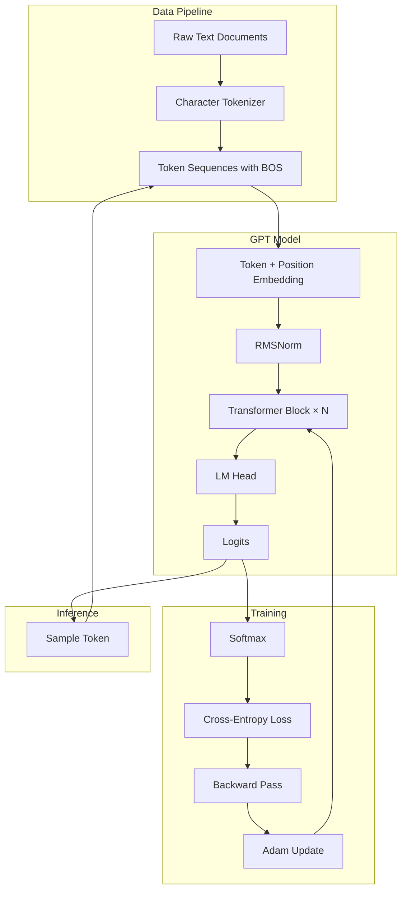

# microgpt: Complete Exploration

## Overview

**microgpt** by Andrej Karpathy is a minimal, dependency-free implementation of a GPT (Generative Pre-trained Transformer) model in pure Python. The entire training and inference pipeline fits in ~200 lines of code with zero external dependencies.

### Why This Exploration Exists

This is not just a code exploration—this is a **complete textbook** that takes you from zero machine learning knowledge to understanding how to build and train language models from first principles.

### Key Characteristics

| Aspect | microgpt |
|--------|----------|
| **Dependencies** | Zero (only `os`, `math`, `random`) |
| **Lines of Code** | ~200 |
| **Purpose** | Educational clarity |
| **Architecture** | GPT-2 (decoder-only transformer) |
| **Parameters** | ~76,000 (configurable) |
| **Dataset** | Character-level names |

---

## Complete Table of Contents

This exploration consists of multiple deep-dive documents. Read them in order for complete understanding:

### Part 1: Foundations
1. **[Zero to ML Engineer](00-zero-to-ml-engineer.md)** - Start here if new to ML
   - What is machine learning?
   - Mathematical foundations (calculus, linear algebra)
   - Neural networks from scratch
   - Transformer architecture introduction
   - Training and inference basics

### Part 2: Core Implementation
2. **[Autograd and Backpropagation](01-autograd-backpropagation-deep-dive.md)**
   - Why automatic differentiation?
   - Computation graphs
   - Forward vs reverse mode AD
   - Value class implementation
   - Worked examples with traces

3. **[Transformer Architecture](02-transformer-architecture-deep-dive.md)**
   - Embeddings (token, position)
   - Attention mechanism (Q, K, V)
   - Multi-head attention
   - Complete GPT forward pass
   - Component ablation analysis

4. **[Training Loop and Adam](03-training-loop-adam-deep-dive.md)**
   - Loss functions (cross-entropy)
   - Training loop architecture
   - Adam optimizer deep dive
   - Learning rate scheduling
   - Debugging training issues

5. **[Inference and Sampling](04-inference-sampling-deep-dive.md)**
   - Autoregressive generation
   - Temperature-controlled sampling
   - KV cache optimization
   - Sampling strategies (top-k, top-p)
   - Debugging generation

### Part 3: Production
6. **[Production-Grade Implementation](production-grade.md)**
   - Performance optimizations
   - Memory management
   - Batching and throughput
   - Model serialization
   - Serving infrastructure
   - Monitoring and observability

7. **[Rust Revision](rust-revision.md)**
   - Complete Rust translation
   - Type system design
   - Ownership and borrowing strategy
   - Code examples

---

## Quick Reference: microgpt Architecture

### High-Level Flow



### Component Summary

| Component | Lines | Purpose | Deep Dive |
|-----------|-------|---------|-----------|
| Tokenizer | 5 | Character → token ID | [Zero to ML](00-zero-to-ml-engineer.md) |
| Value (Autograd) | 45 | Automatic differentiation | [Autograd Deep Dive](01-autograd-backpropagation-deep-dive.md) |
| Embeddings | 10 | Token/position → vector | [Transformer Deep Dive](02-transformer-architecture-deep-dive.md) |
| Attention | 25 | Context-aware mixing | [Transformer Deep Dive](02-transformer-architecture-deep-dive.md) |
| MLP | 10 | Non-linear transformation | [Transformer Deep Dive](02-transformer-architecture-deep-dive.md) |
| Adam | 15 | Parameter optimization | [Training Deep Dive](03-training-loop-adam-deep-dive.md) |
| Training Loop | 20 | Forward/backward/update | [Training Deep Dive](03-training-loop-adam-deep-dive.md) |
| Inference | 15 | Autoregressive sampling | [Inference Deep Dive](04-inference-sampling-deep-dive.md) |

---

## File Structure

```
microgpt/
├── microgpt.py                    # Core implementation (~200 lines)
├── input.txt                      # Training dataset (names)
│
├── exploration.md                 # This file (index)
├── rust-revision.md               # Rust translation guide
├── production-grade.md            # Production considerations
│
├── 00-zero-to-ml-engineer.md      # START HERE: ML foundations
├── 01-autograd-backpropagation-deep-dive.md
├── 02-transformer-architecture-deep-dive.md
├── 03-training-loop-adam-deep-dive.md
└── 04-inference-sampling-deep-dive.md
│
└── microgpt_files/                # GitHub assets (ignore)
```

---

## How to Use This Exploration

### For Complete Beginners (Zero ML Experience)

1. Start with **[00-zero-to-ml-engineer.md](00-zero-to-ml-engineer.md)**
2. Read each section carefully, work through examples
3. Continue through all deep dives in order
4. Implement along with the explanations
5. Finish with production-grade considerations

**Time estimate:** 20-40 hours for complete understanding

### For Experienced Developers

1. Skim [00-zero-to-ml-engineer.md](00-zero-to-ml-engineer.md) for context
2. Deep dive into areas of interest (autograd, transformers, etc.)
3. Review [rust-revision.md](rust-revision.md) for implementation patterns
4. Check [production-grade.md](production-grade.md) for deployment considerations

### For ML Practitioners

1. Review [microgpt.py](microgpt.py) directly
2. Use deep dives as reference for specific components
3. Compare with your framework-based implementations
4. Extract insights for educational content

---

## Running microgpt

```bash
# Navigate to microgpt directory
cd microgpt/

# Run (requires Python 3.x)
python microgpt.py

# Output:
# num docs: 32032
# vocab size: 26
# num params: 76832
# step    1 / 1000 | loss 2.7183
# step    2 / 1000 | loss 2.6891
# ...
# step 1000 / 1000 | loss 0.6123
#
# --- inference (new, hallucinated names) ---
# sample  1: emma
# sample  2: lialla
# ...
```

---

## Key Insights

### 1. Simplicity at the Core

Despite the complexity of modern LLMs (GPT-4, Claude, etc.), the fundamental algorithm is remarkably simple:
- Embed tokens
- Apply attention
- Transform features
- Predict next token
- Update via gradient descent

### 2. Autograd is Understandable

The Value class demonstrates that automatic differentiation is conceptually straightforward:
- Build computation graph during forward pass
- Apply chain rule during backward pass
- No magic, just calculus

### 3. Transformers Are Just Functions

The transformer architecture is a composition of:
- Linear transformations (matrix multiply)
- Attention (weighted averaging)
- Normalization (scaling)
- Non-linearities (ReLU)

### 4. Training Is Iterative Refinement

The training loop is conceptually simple:
1. Make predictions
2. Measure error (loss)
3. Compute how to improve (gradients)
4. Adjust parameters (optimization)
5. Repeat

### 5. Inference Is Controlled Sampling

Generation balances:
- Model confidence (logits)
- Desired randomness (temperature)
- Diversity strategies (top-k, top-p)

---

## From microgpt to Real LLMs

| Aspect | microgpt | Production LLMs |
|--------|----------|-----------------|
| Parameters | 76K | 7B - 175B+ |
| Training data | 32K names | Web-scale text |
| Context length | 16 tokens | 32K - 1M+ tokens |
| Training time | Minutes | Months on GPU clusters |
| Inference speed | ~100ms/token | ~10-50ms/token (optimized) |
| Architecture | Standard GPT-2 | Variants (MoE, RWKV, etc.) |

**Key takeaway:** The core algorithm is the same. Scaling introduces engineering challenges, not algorithmic changes.

---

## Your Path Forward

### To Build ML Skills

1. **Implement microgpt yourself** (without looking)
2. **Modify the architecture** (add layers, change attention)
3. **Train on different data** (your own datasets)
4. **Translate to another framework** (PyTorch, JAX, Rust)
5. **Study the papers** (Attention Is All You Need, GPT papers)

### Recommended Resources

- [Andrej Karpathy's Neural Networks: Zero to Hero](https://youtube.com/@AndrejKarpathy)
- [The Illustrated Transformer](https://jalammar.github.io/illustrated-transformer/)
- [Hugging Face Course](https://huggingface.co/learn)
- [PyTorch Documentation](https://pytorch.org/docs/)

---

## Document History

| Date | Change |
|------|--------|
| 2026-03-27 | Initial exploration completed |
| 2026-03-27 | Added comprehensive deep dives (00-04) |
| 2026-03-27 | Added production-grade.md |
| 2026-03-27 | Expanded to textbook-level depth |

---

*This exploration is a living document. Revisit sections as concepts become clearer through implementation.*
