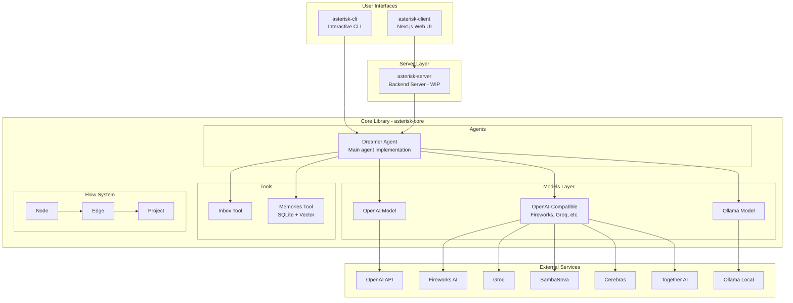
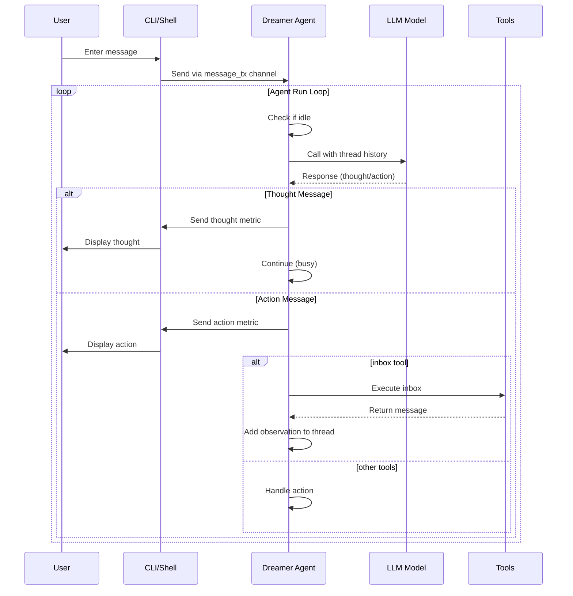
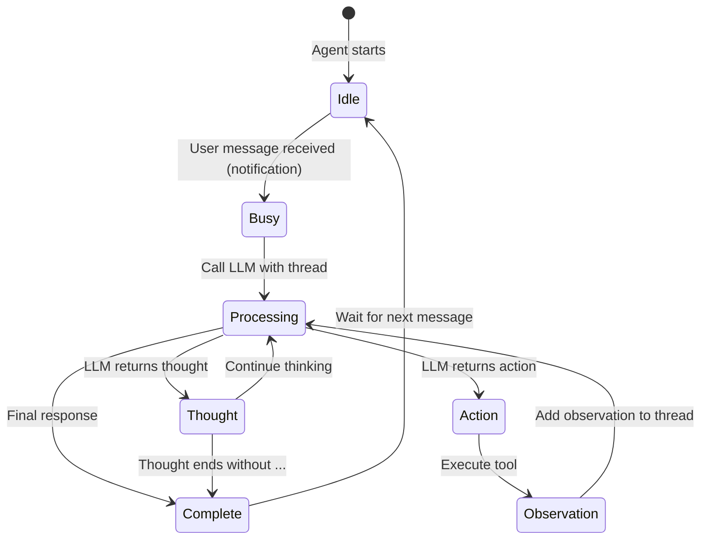

# Asterisk Codebase Exploration

## Overview

**Asterisk** is an AI agent building platform designed for creating and managing AI agents through a visual interface. The project consists of three main Rust crates (`asterisk-core`, `asterisk-cli`, `asterisk-server`) and a Next.js-based web client (`asterisk-client`). The core functionality centers around the "Dreamer" agent - a general-purpose AI agent that operates through a structured thought-action-observation cycle.

> **Note**: According to the README, asterisk is being merged into [monocore](https://github.com/appcypher/monocore).

The codebase follows a monorepo structure using Cargo workspaces for Rust packages and pnpm for the TypeScript client.

## Repository

- **Path**: `/home/darkvoid/Boxxed/@formulas/src.rust/src.Containers/src.Microsandbox/asterisk`
- **Type**: Cargo workspace (Rust monorepo)
- **License**: Apache 2.0
- **Rust Toolchain**: Stable channel with components: cargo, clippy, rustfmt, rust-src, rust-std

### Git Information

This is not a standalone git repository but appears to be a submodule or nested directory within a larger project structure at `/home/darkvoid/Boxxed/@formulas/src.rust/src.Containers/src.Microsandbox/`.

## Directory Structure

```
asterisk/
├── asterisk-cli/          # Command-line interface application
│   ├── bin/
│   │   └── cli.rs         # CLI entry point
│   ├── lib/
│   │   ├── args.rs        # CLI argument definitions (clap)
│   │   ├── error.rs       # CLI error types
│   │   ├── lib.rs         # Library exports
│   │   ├── shell.rs       # Interactive shell implementation
│   │   └── styles.rs      # CLI styling/colors
│   └── Cargo.toml
├── asterisk-client/       # Web-based visual UI (Next.js)
│   ├── src/app/
│   │   ├── components/
│   │   │   ├── AgentDesigner/   # Visual agent builder components
│   │   │   │   ├── AgentDesigner.tsx
│   │   │   │   ├── Canvas.tsx
│   │   │   │   ├── CanvasContextProvider.tsx
│   │   │   │   ├── ConnectionLine.tsx
│   │   │   │   ├── ContextMenu.tsx
│   │   │   │   ├── Controls.tsx
│   │   │   │   ├── Edge.tsx
│   │   │   │   ├── Node.tsx
│   │   │   │   ├── NodeHandle.tsx
│   │   │   │   ├── NodeResizer/
│   │   │   │   │   ├── Handle.tsx
│   │   │   │   │   ├── index.tsx
│   │   │   │   │   └── Line.tsx
│   │   │   │   └── state/
│   │   │   │       ├── edges.ts
│   │   │   │       └── nodes.ts
│   │   │   └── SidePanel/       # Side panel components
│   │   │       ├── Header.tsx
│   │   │       ├── HoverZone.tsx
│   │   │       ├── IconTray.tsx
│   │   │       ├── Main.tsx
│   │   │       ├── Project.tsx
│   │   │       ├── ProjectGroup.tsx
│   │   │       ├── SidePanel.tsx
│   │   │       └── WorkspaceSelect.tsx
│   │   ├── favicon.ico
│   │   ├── fonts/
│   │   ├── globals.css
│   │   ├── layout.tsx
│   │   └── page.tsx
│   ├── package.json
│   ├── pnpm-lock.yaml
│   ├── tailwind.config.ts
│   ├── tsconfig.json
│   ├── next.config.mjs
│   └── postcss.config.mjs
├── asterisk-core/         # Core library with agent logic
│   ├── lib/
│   │   ├── lib.rs         # Root library exports
│   │   ├── agents/        # Agent implementations
│   │   │   ├── dreamer/   # Dreamer agent (main agent)
│   │   │   │   ├── agent.rs        # Dreamer agent struct & logic
│   │   │   │   ├── builder.rs      # DreamerBuilder
│   │   │   │   ├── channels.rs     # Communication channels
│   │   │   │   ├── context.rs      # Context handling
│   │   │   │   ├── error.rs        # Dreamer-specific errors
│   │   │   │   ├── metrics.rs      # Metrics types
│   │   │   │   ├── thread.rs       # Thread/message types
│   │   │   │   ├── instructions/   # Agent system prompts
│   │   │   │   │   ├── dreamer-0.1.0.md
│   │   │   │   │   ├── dreamer-0.1.1.md
│   │   │   │   │   └── dreamer-0.1.2.md
│   │   │   │   └── mod.rs
│   │   │   ├── error.rs
│   │   │   └── mod.rs
│   │   ├── flow/          # Flow/graph building (WIP)
│   │   │   ├── edge.rs    # Edge trait for node connections
│   │   │   ├── mod.rs
│   │   │   ├── node.rs    # Node trait
│   │   │   ├── project.rs # Project trait (tree of nodes)
│   │   │   └── trigger.rs # Trigger trait
│   │   ├── models/        # LLM model integrations
│   │   │   ├── ollama/    # Ollama model support
│   │   │   │   ├── builder.rs
│   │   │   │   ├── config.rs
│   │   │   │   ├── message.rs
│   │   │   │   ├── model.rs
│   │   │   │   ├── mod.rs
│   │   │   │   └── stream.rs
│   │   │   ├── openai/    # OpenAI & OpenAI-compatible APIs
│   │   │   │   ├── builder.rs
│   │   │   │   ├── config.rs
│   │   │   │   ├── message.rs
│   │   │   │   ├── model.rs
│   │   │   │   ├── mod.rs
│   │   │   │   └── stream.rs
│   │   │   ├── error.rs
│   │   │   ├── mod.rs
│   │   │   ├── prompt.rs  # Prompt types
│   │   │   └── traits.rs  # TextModel, TextStreamModel traits
│   │   ├── tools/         # Tool system for agents
│   │   │   ├── inbox.rs   # Inbox tool (read user messages)
│   │   │   ├── memories.rs# Memories tool (SQLite-based KB)
│   │   │   ├── helper.rs  # Helper functions
│   │   │   ├── traits.rs  # Tool trait definition
│   │   │   ├── error.rs
│   │   │   └── mod.rs
│   │   └── utils/         # Utilities
│   │       ├── env.rs     # Environment loading
│   │       └── mod.rs
│   ├── examples/          # Example applications
│   │   ├── cli.rs         # Model streaming CLI example
│   │   ├── model.rs       # Model usage example
│   │   ├── model_stream.rs# Streaming example
│   │   └── prompts.rs     # Prompt examples
│   └── Cargo.toml
├── asterisk-server/       # Server component (placeholder)
│   ├── bin/
│   │   └── server.rs      # Server entry point (stub)
│   └── Cargo.toml
├── Cargo.toml             # Workspace definition
├── Cargo.lock
├── CHANGELOG.md           # Empty changelog
├── CODE_OF_CONDUCT.md     # Community guidelines
├── CONTRIBUTING.md        # Contribution guidelines
├── SECURITY.md            # Security policy
├── LICENSE                # Apache 2.0 license
├── README.md              # Project overview
├── codecov.yml            # Codecov configuration
├── deny.toml              # Cargo-deny configuration
├── rust-toolchain.toml    # Rust toolchain pinning
├── .rustfmt.toml          # Rust formatting config
├── .env.sample            # Environment variable template
├── .gitignore
├── .pre-commit-config.yaml# Pre-commit hooks
├── .todo.md               # TODO list
└── .github/               # GitHub configuration
    ├── workflows/
    │   ├── audit.yml      # Security auditing
    │   ├── coverage.yml   # Code coverage
    │   └── tests_and_checks.yml
    ├── dependabot.yml
    ├── CODEOWNERS
    ├── ISSUE_TEMPLATE/
    └── PULL_REQUEST_TEMPLATE.md
```

**Total**: 27 directories, 103 files

## Architecture

### High-Level Architecture



### Agent Communication Flow



### Thread Message Cycle



## Component Breakdown

### asterisk-core

The heart of the system containing all agent logic, model integrations, and tool definitions.

#### Agents Module (`lib/agents/`)

**Dreamer Agent** (`lib/agents/dreamer/`):
- **Purpose**: General-purpose AI agent that solves problems through structured thinking
- **Key Components**:
  - `agent.rs`: Main `Dreamer` struct with run loop
  - `thread.rs`: `Thread` struct managing conversation history with typed messages
  - `channels.rs`: `AgentSideChannels` and `ExternalSideChannels` for tokio mpsc communication
  - `builder.rs`: `DreamerBuilder` for fluent agent construction
  - `metrics.rs`: `Metrics` enum for observability
  - `error.rs`: `DreamerError` types

**Thread Message Types**:
| Type | Tag | Purpose |
|------|-----|---------|
| `ThoughtMessage` | `[thought]` | Agent's internal reasoning |
| `ActionMessage` | `[action]` | Tool execution requests |
| `ObservationMessage` | `[observation]` | Tool execution results |
| `NotificationMessage` | `[notification]` | System/user notifications |

#### Models Module (`lib/models/`)

Provides abstraction over different LLM providers through unified traits.

**Core Traits** (`traits.rs`):
```rust
pub trait TextModel {
    fn prompt(&self, prompt: impl Into<Prompt> + Send)
        -> impl Future<Output = ModelResult<String>> + Send;
}

pub trait TextStreamModel {
    fn prompt_stream(&self, prompt: impl Into<Prompt> + Send)
        -> impl Future<Output = ModelResult<BoxStream<'static, ModelResult<String>>>> + Send;
}
```

**Supported Providers**:
| Provider | Module | Configuration |
|----------|--------|---------------|
| OpenAI | `openai/` | `OPENAI_API_KEY` |
| Perplexity | via OpenAI-like | `PERPLEXITY_API_KEY` |
| Together.ai | via OpenAI-like | `TOGETHER_API_KEY` |
| Fireworks | via OpenAI-like | `FIREWORKS_API_KEY` |
| Groq | via OpenAI-like | `GROQ_API_KEY` |
| SambaNova | via OpenAI-like | `SAMBA_NOVA_API_KEY` |
| Cerebras | via OpenAI-like | `CEREBRAS_API_KEY` |
| Ollama | `ollama/` | Local deployment |

**OpenAI-Compatible Implementation**:
- Uses `OpenAIModel` for native OpenAI API
- Uses `OpenAILikeModel` wrapper for compatible APIs
- Shared request/response structure with configurable base URLs
- Streaming support via Server-Sent Events (SSE)

#### Tools Module (`lib/tools/`)

Extensible tool system allowing agents to interact with external systems.

**Tool Trait**:
```rust
pub trait Tool {
    fn name(&self) -> String;
    fn description(&self) -> String;
    fn execute(&self, input: Map<String, Value>) -> ToolResult<String>;
}
```

**Built-in Tools**:
| Tool | File | Purpose |
|------|------|---------|
| `Inbox` | `inbox.rs` | Read user messages from input channel |
| `Memories` | `memories.rs` | SQLite-based knowledge base with vector search (via `sqlite-vec`) |

#### Flow Module (`lib/flow/`)

Work-in-progress graph-based workflow system for composing agents.

**Traits**:
- `Node`: Base trait for flow nodes
- `Edge`: Connection between two nodes (`out_node`, `in_node`)
- `Project`: Tree of nodes and branches
- `Trigger`: (Placeholder) Trigger mechanism

### asterisk-cli

Interactive command-line interface for running Dreamer agent.

**Key Features**:
- Model selection menu (9 options including OpenAI, Fireworks, SambaNova)
- Colored output with styled message types
- Raw terminal mode for responsive input
- Ctrl+C handling for graceful exit

**CLI Commands**:
```
asterisk serve    # Start server (not implemented)
asterisk shell    # Interactive agent shell
```

**Architecture**:
- Uses `crossterm` for terminal manipulation
- Async runtime with `tokio`
- Separate task for agent execution and terminal event handling
- Metrics streaming for real-time thought/action display

### asterisk-client

Next.js-based web UI for visual agent building.

**Tech Stack**:
- React 18, Next.js 14
- `@xyflow/react` (React Flow) for node-based editor
- `@mdxeditor/editor` for markdown editing
- Tailwind CSS for styling

**Key Components**:
- `AgentDesigner`: Main canvas for agent workflow design
- `SidePanel`: Project/workspace navigation
- Node-based editor with custom nodes, edges, and handles

### asterisk-server

Placeholder server component intended to bridge web client with core.

**Current State**: Minimal stub printing "coming soon"

## Entry Points

### CLI Entry Point (`asterisk-cli/bin/cli.rs`)

```rust
#[tokio::main]
async fn main() -> CliResult<()> {
    tracing_subscriber::fmt::init();

    match AsteriskArgs::parse().subcommand {
        Some(Subcommand::Serve {}) => println!("Coming soon..."),
        Some(Subcommand::Shell {}) => shell::run().await?,
        None => AsteriskArgs::command().print_help()?,
    }

    Ok(())
}
```

### Shell Implementation (`asterisk-cli/lib/shell.rs`)

The shell is the main interactive entry point:

1. Loads environment variables (`utils::load_env(Env::Dev)`)
2. Prompts user to select a model
3. Creates agent with selected model via `Dreamer::builder()`
4. Creates communication channels
5. Spawns agent task
6. Handles terminal events and metrics streaming

### Agent Run Loop (`asterisk-core/lib/agents/dreamer/agent.rs`)

```rust
pub fn run(mut self, mut channels: AgentSideChannels) -> JoinHandle<DreamerResult<()>> {
    tokio::spawn(async move {
        loop {
            if self.idle {
                if let Some(message) = channels.message_rx.recv().await {
                    self.handle_incoming_message(message, &channels.metrics_tx)?;
                }
                continue;
            }

            tokio::select! {
                response = self.call() => {
                    self.handle_model_response(response?, &channels.metrics_tx)?;
                }
                message = channels.message_rx.recv() => {
                    if let Some(message) = message {
                        self.handle_incoming_message(message, &channels.metrics_tx)?;
                    }
                }
            }
        }
    })
}
```

## Data Flow

### Message Processing Pipeline

```
User Input -> CLI (shell.rs)
          -> mpsc channel (message_tx)
          -> Dreamer.handle_incoming_message()
          -> Inbox.update_message()
          -> Thread.push_message(Notification)
          -> Dreamer.call() -> Model.prompt(Thread)
          -> LLM API
          -> Response parsing (ThreadMessage::from_str)
          -> handle_thought() or handle_action()
          -> Tool execution (if action)
          -> Thread.push_message(Observation)
          -> metrics_tx -> CLI display
```

### Thread to Prompt Conversion

```rust
impl From<Thread> for Prompt {
    fn from(thread: Thread) -> Self {
        let mut prompt = Prompt::new();
        prompt.push(PromptMessage::system(thread.system.content));

        for message in thread.history {
            prompt.push(message.into()); // ThreadMessage -> PromptMessage
        }

        if let Some(context) = thread.context {
            prompt.push(context.into());
        }

        prompt
    }
}
```

## External Dependencies

### Rust Dependencies (Workspace)

| Crate | Version | Purpose |
|-------|---------|---------|
| `tokio` | 1.34 | Async runtime |
| `serde`/`serde_json` | 1.0 | Serialization |
| `reqwest` | 0.12 | HTTP client |
| `thiserror` | 1.0 | Error handling |
| `anyhow` | 1.0 | Error context |
| `futures` | 0.3 | Async utilities |
| `tracing` | 0.1.40 | Logging/tracing |
| `clap` | 4.5.16 | CLI parsing |
| `crossterm` | 0.28.1 | Terminal manipulation |
| `rusqlite` | 0.32.1 | SQLite database |
| `sqlite-vec` | 0.1.1 | Vector search extension |
| `colored` | 2.1.0 | Terminal colors |
| `reqwest-eventsource` | 0.6.0 | SSE streaming |
| `strum_macros` | 0.26.4 | Enum macros |

### TypeScript Dependencies

| Package | Version | Purpose |
|---------|---------|---------|
| `next` | 14.2.12 | React framework |
| `react`/`react-dom` | ^18 | UI library |
| `@xyflow/react` | ^12.3.0 | Node-based editor |
| `@mdxeditor/editor` | ^3.11.5 | Markdown editor |
| `tailwindcss` | ^3.4.1 | CSS framework |
| `typescript` | ^5 | Type safety |
| `eslint` | ^8 | Linting |
| `prettier` | 3.3.3 | Formatting |

## Configuration

### Environment Variables

Sample from `.env.sample`:
```bash
OPENAI_API_KEY=sk-xxx
PERPLEXITY_API_KEY=pplx-xxx
TOGETHER_API_KEY=xxx
FIREWORKS_API_KEY=fw_xxx
GROQ_API_KEY=gsk_xxx
SAMBA_NOVA_API_KEY=xxx
CEREBRAS_API_KEY=csk_xxx
```

### Rust Toolchain (`rust-toolchain.toml`)

```toml
[toolchain]
channel = "stable"
components = ["cargo", "clippy", "rustfmt", "rust-src", "rust-std"]
```

### Pre-commit Hooks (`.pre-commit-config.yaml`)

- `fmt`: Rust formatting check (`cargo +nightly fmt`)
- `cargo-check`: Compilation check
- `clippy`: Linting with deny warnings
- `cargo-sort`: Sort Cargo.toml dependencies
- `conventional-pre-commit`: Enforce conventional commits
- Client formatting (`pnpm fmt`) and linting (`pnpm lint`)
- Standard hooks (trailing whitespace, YAML check, etc.)

### Cargo-deny (`deny.toml`)

Security and license auditing configuration (9KB file with comprehensive rules).

### Code Coverage (`codecov.yml`)

```yaml
ignore:
  - "tests"

comment:
  layout: "reach, diff, flags, files"
  require_changes: true

coverage:
  status:
    project:
      default:
        threshold: 5%
```

## Testing

### Test Organization

- Unit tests inline with modules (marked with `#[cfg(test)]`)
- Integration tests would go in `tests/` directory (not present)
- Examples in `asterisk-core/examples/` serve as integration tests

### CI Workflows

**tests_and_checks.yml**:
- Runs on PR and push to main
- Executes: `cargo fmt --check`, `cargo clippy`, `cargo test`

**coverage.yml**:
- Runs codecov for coverage reporting
- Threshold: 5% project coverage tolerance

**audit.yml**:
- Runs `cargo audit` for security vulnerability scanning

### Running Tests

```bash
cargo test          # Run all tests
cargo clippy        # Run linter
cargo fmt --check   # Check formatting
```

## Key Insights

### Design Patterns

1. **Builder Pattern**: Used extensively for constructing `Dreamer`, `OpenAIModel`, etc.
   - Type-state-like pattern with generic parameters
   - Fluent API for configuration

2. **Channel-based Communication**: Tokio mpsc channels for agent-external communication
   - Clean separation between agent internal state and external interfaces
   - Enables concurrent message handling

3. **Tagged Message Protocol**: Structured message format with tags
   - Enables parsing LLM output into typed messages
   - Clear separation of concerns (thought vs action vs observation)

4. **Trait Abstraction for Models**: `TextModel` and `TextStreamModel` traits
   - Enables swapping LLM providers without code changes
   - Unified interface across different API formats

5. **Thread History Management**: `Thread` struct maintains full conversation context
   - Automatic conversion to `Prompt` for model consumption
   - Context field for additional metadata

### Architectural Decisions

1. **Async-first**: All I/O operations are async with tokio
2. **Error Handling**: Custom error types with `thiserror` + `anyhow` for context
3. **Zero-cost Abstractions**: Trait-based design minimizes runtime overhead
4. **Extensibility**: Tool system allows adding new capabilities without core changes

### Notable Code Quality Practices

1. Comprehensive pre-commit hooks ensure code quality
2. Conventional commits for changelog generation
3. Inline documentation with rustdoc
4. Module-level documentation comments
5. Type-safe error handling throughout

### Agent Instruction System

The Dreamer agent uses markdown-based system prompts stored in `instructions/`:
- **Identity Statement**: Defines what the agent is and its capabilities
- **Operating Procedure**: Rules for interaction and tool usage
- **Problem Solving Methodology**: Step-by-step thinking approach

The agent is designed to think in single sentences ending with `...<contd>` to indicate ongoing thought, promoting deliberate step-by-step reasoning.

## Open Questions

1. **Flow System Status**: The `flow/` module has minimal implementation (traits only). Is this planned for future releases or deprecated?

2. **Server Implementation**: `asterisk-server` is a stub. What is the intended architecture for the server component? Will it use Tauri (referenced in workspace deps)?

3. **Memory Tool Implementation**: `Memories` tool has SQLite setup but `execute()` returns empty string. What is the intended vector search implementation with `sqlite-vec`?

4. **Response Channel**: The dreamer instructions mention a `response_channel` tool but it's not implemented in the tools module.

5. **Client-Server Integration**: How does `asterisk-client` (Next.js) integrate with the Rust backend? There's no apparent API layer connecting them.

6. **Agent Coherence**: TODO comments in `agent.rs` mention "General coherence for thoughts and actions" and "Relying on context and knowledge base only" - what mechanisms are planned?

7. **Tool Registration**: How are custom tools registered with the Dreamer agent beyond the built-in `inbox` and `memories`?

8. **Conversation Persistence**: Is thread history persisted between sessions? No apparent serialization mechanism exists.

9. **Tauri Integration**: Workspace dependencies include Tauri 2.0 (`tauri`, `tauri-build`), but no Tauri configuration files exist. Is a desktop app planned?

10. **Monocore Migration**: Given the note about merging into monocore, what is the future development path for this repository?

11. **OpenAI Module Missing from Initial Scan**: The `openai/` module under `models/` was not visible in the initial directory scan but exists with full implementation including streaming support.
