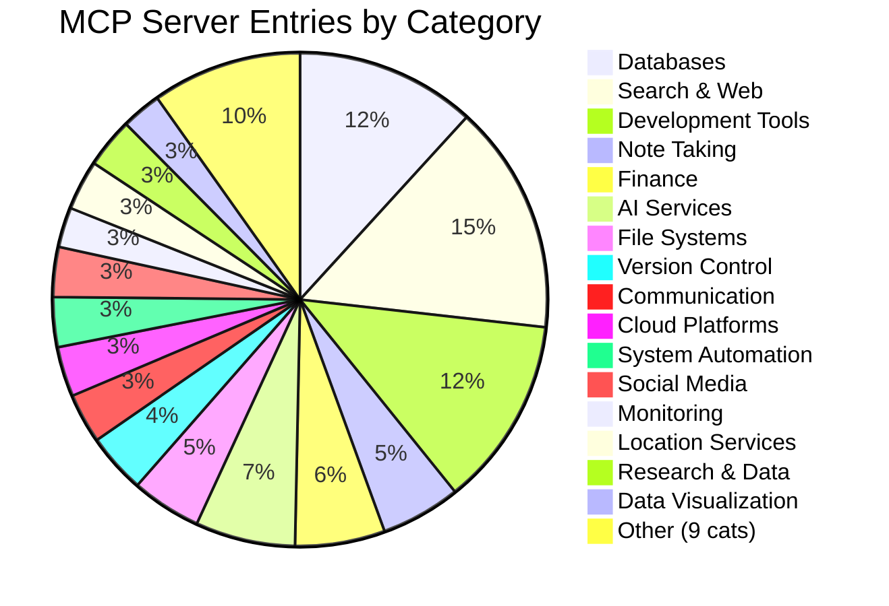
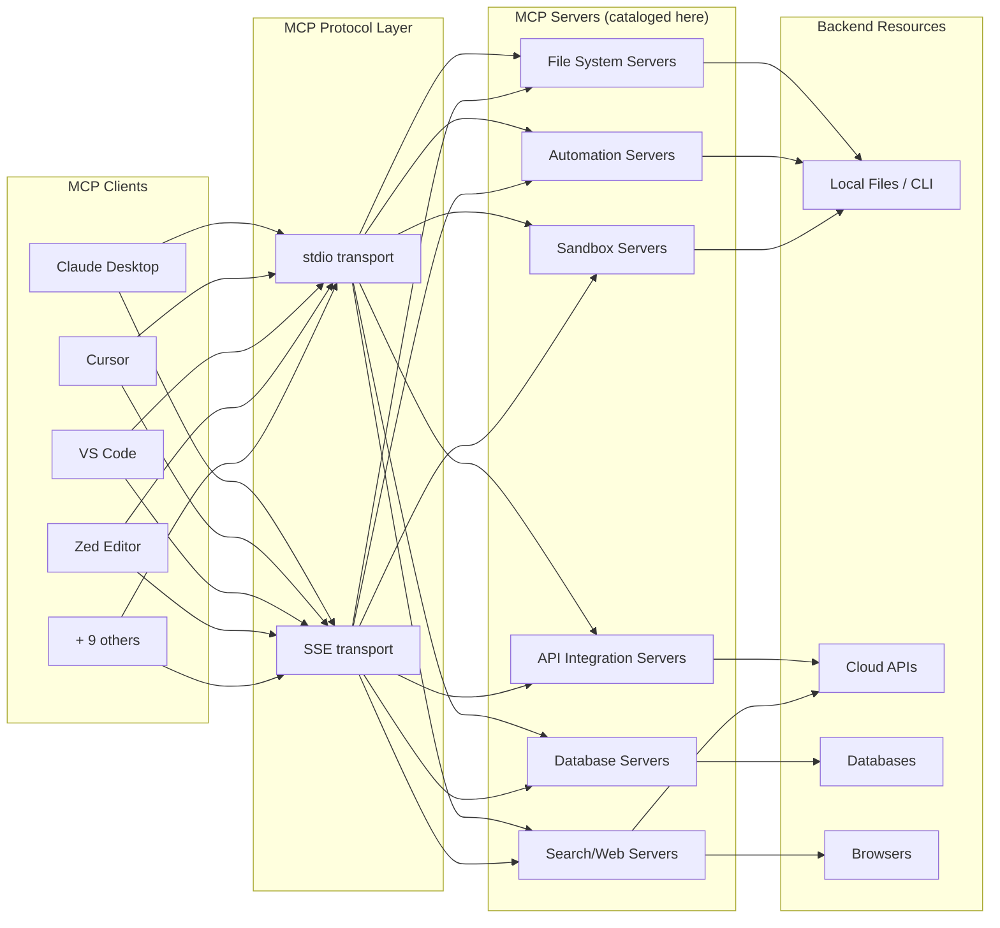

# Awesome MCP Servers - Exploration

## Overview

**awesome-mcp-servers** is a community-curated "awesome list" of Model Context Protocol (MCP) servers. MCP is an open protocol that enables AI models to securely interact with local and remote resources through standardized server implementations. The project catalogs production-ready and experimental MCP servers across dozens of categories -- from file systems and databases to gaming and IoT.

The repository is maintained by Stephen Akinyemi (appcypher) and is licensed under CC0 (public domain). It is a documentation-only project with no source code, build system, or runtime dependencies.

## Repository Info

| Field | Value |
|-------|-------|
| **Remote** | `https://github.com/punkpeye/awesome-mcp-servers` (originally by appcypher) |
| **Primary Language** | Markdown |
| **License** | CC0 1.0 Universal (Public Domain) |
| **Maintainer** | Stephen Akinyemi (appcypher@outlook.com) |
| **Git Status** | Local copy is not a standalone git repository (no `.git` directory); stored as a subdirectory within the Microsandbox formula tree |

## Directory Structure

```
awesome-mcp-servers/
├── CODE_OF_CONDUCT.md    (3.2 KB) - Contributor Covenant v1.4
├── CONTRIBUTING.md       (785 B)  - Contribution guidelines for adding entries
└── README.md             (56 KB, 492 lines) - The entire curated list
```

There are **3 files** total. No subdirectories, no source code, no configuration files, no tests.

## Architecture

This is a documentation-only project. There is no software architecture in the traditional sense. The "architecture" is the organizational taxonomy of the README itself.

### Content Taxonomy

```mermaid
graph TD
    ROOT["awesome-mcp-servers README"]

    ROOT --> SEC_WARN["Security Warning"]
    ROOT --> CLIENTS["Supported MCP Clients"]
    ROOT --> SERVERS["Server Implementations"]
    ROOT --> TOOLS["Tools & Utilities"]
    ROOT --> META["Meta: Contributing / CoC / License"]

    CLIENTS --> C1["Claude Desktop"]
    CLIENTS --> C2["Zed Editor"]
    CLIENTS --> C3["Cursor"]
    CLIENTS --> C4["VS Code"]
    CLIENTS --> C5["+ 9 others"]

    SERVERS --> S1["File Systems"]
    SERVERS --> S2["Sandbox & Virtualization"]
    SERVERS --> S3["Version Control"]
    SERVERS --> S4["Cloud Storage"]
    SERVERS --> S5["Databases"]
    SERVERS --> S6["Communication"]
    SERVERS --> S7["Monitoring"]
    SERVERS --> S8["Search & Web"]
    SERVERS --> S9["Location Services"]
    SERVERS --> S10["Marketing"]
    SERVERS --> S11["Note Taking"]
    SERVERS --> S12["Cloud Platforms"]
    SERVERS --> S13["Workflow Automation"]
    SERVERS --> S14["System Automation"]
    SERVERS --> S15["Social Media"]
    SERVERS --> S16["Gaming"]
    SERVERS --> S17["Finance"]
    SERVERS --> S18["Research & Data"]
    SERVERS --> S19["AI Services"]
    SERVERS --> S20["Development Tools"]
    SERVERS --> S21["Data Visualization"]
    SERVERS --> S22["Identity"]
    SERVERS --> S23["Aggregators"]
    SERVERS --> S24["Language & Translation"]
    SERVERS --> S25["Security"]
    SERVERS --> S26["IoT"]
    SERVERS --> S27["Art & Literature"]
    SERVERS --> S28["E-Commerce"]
    SERVERS --> S29["Data Platforms"]

    TOOLS --> T1["Server Managers"]
```



### Server Category Distribution



### MCP Ecosystem Relationship



## Component Breakdown

### README.md (56 KB, 492 lines)

The main file. Contains:

1. **Header and Security Warning** (lines 1-25) -- Warns about running MCP servers without sandboxing (arbitrary code execution, prompt injection, data exposure risks).

2. **Supported Clients Table** (lines 27-45) -- Lists 14 MCP host clients including Claude Desktop, Zed, Cursor, VS Code, Goose, Nerve, and others. Each with documentation links.

3. **Server Implementations** (lines 48-465) -- The core content. 29 categories containing approximately 150+ individual MCP server entries. Each entry includes:
   - An icon (via simpleicons.org CDN or project favicons)
   - Name with GitHub link
   - Superscript annotations: star for official implementations, numbers for multiple implementations
   - Brief description

4. **Tools & Utilities** (lines 467-481) -- 5 server management tools (mcp-get, mxcp, Remote MCP, yamcp, ToolHive).

5. **License** (lines 486-493) -- CC0 public domain.

### CONTRIBUTING.md (785 bytes)

Short contribution guidelines: search for duplicates, individual PRs per suggestion, alphabetical ordering, bottom-of-category placement.

### CODE_OF_CONDUCT.md (3.2 KB)

Standard Contributor Covenant v1.4. Contact: appcypher@outlook.com.

## Entry Points

Not applicable -- this is a documentation-only project with no executable code.

## Data Flow

Not applicable -- no runtime data flow exists. The "data" is the curated list itself, which flows from contributor PRs through GitHub review to the README.

## External Dependencies

None. The project has no package manager, no build system, no runtime dependencies. The README references external image CDNs for icons:
- `cdn.simpleicons.org` -- most server category icons
- Various project favicons -- for official/branded entries
- `github.com/user-attachments` -- some inline images

## Configuration

None. No configuration files exist.

## Testing

None. No test infrastructure exists. Quality is maintained through PR review and the contribution guidelines.

## Key Insights

1. **Microsandbox is featured prominently.** The "Sandbox & Virtualization" category lists Microsandbox first with the official star designation. This repository is stored within the Microsandbox formula tree, suggesting it is a reference or competitive landscape document for the Microsandbox project.

2. **MCP ecosystem is broad.** The list covers 29 distinct categories with 150+ servers, indicating significant ecosystem adoption. The protocol bridges AI models to practically any external system.

3. **Security is a first-class concern.** The very first section after the title is a security warning about running MCP servers without sandboxing -- directly relevant to Microsandbox's value proposition.

4. **Official vs community implementations.** Entries marked with a star are official protocol implementations from the service providers themselves (e.g., Cloudflare, Stripe, GitHub). Numbered superscripts track alternative implementations of the same integration.

5. **Dominant categories.** Search & Web (23 entries), Development Tools (19 entries), and Databases (18 entries) are the largest categories, reflecting the primary use cases for MCP: information retrieval, developer workflow augmentation, and data access.

6. **Transport mechanisms.** MCP servers communicate via stdio or SSE (Server-Sent Events) transports, connecting to clients like Claude Desktop, Cursor, and VS Code.

## Open Questions

1. **Staleness tracking** -- How are entries validated over time? Dead links or abandoned projects may accumulate without a maintenance process.

2. **Relationship to punkpeye/awesome-mcp-servers** -- The original repo appears to be `appcypher/awesome-mcp-servers` based on the license attribution, but the canonical upstream may have moved to `punkpeye/awesome-mcp-servers`. The local copy has no git history to confirm provenance.

3. **Completeness** -- The list is manually curated. There may be significant MCP servers not yet included. No automated discovery or registry scanning is mentioned.

4. **Version/date of snapshot** -- Without git history in this local copy, it is unclear when this snapshot was taken or how current the entries are.
