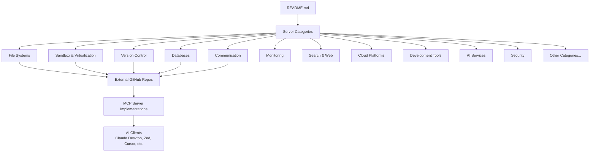
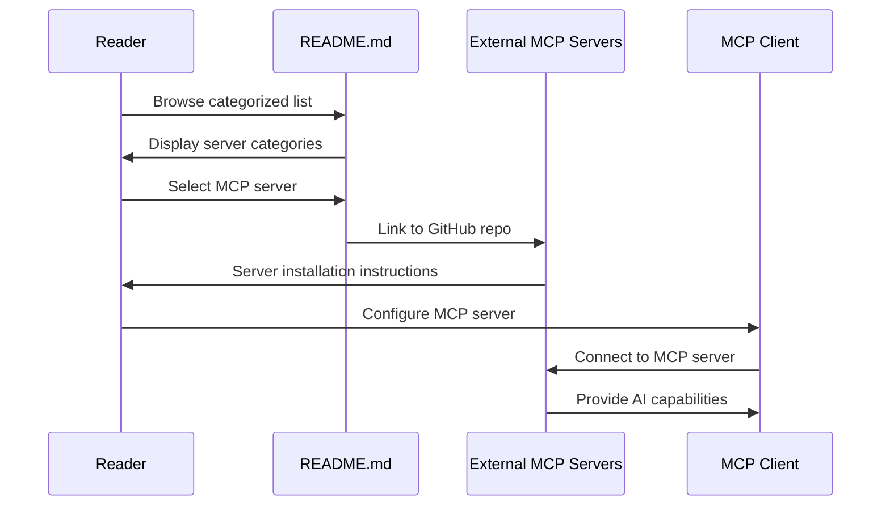
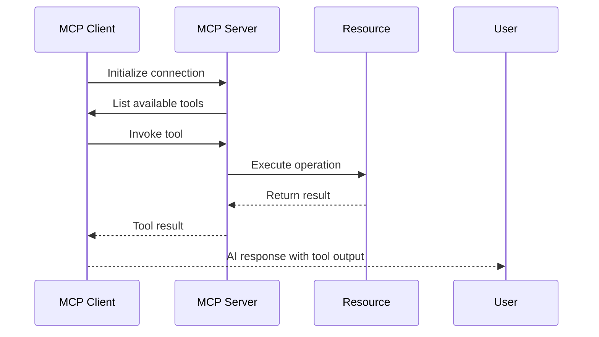

# Awesome MCP Servers - Exploration Report

## Overview

This repository is a **curated awesome list** of Model Context Protocol (MCP) servers. MCP is an open protocol that enables AI models to securely interact with local and remote resources through standardized server implementations. The repository serves as a comprehensive directory of production-ready and experimental MCP servers that extend AI capabilities through file access, database connections, API integrations, and other contextual services.

**Key Purpose**: Provide a centralized, categorized list of MCP server implementations that developers can discover and integrate with AI assistants like Claude Desktop, Zed Editor, Cursor, and other MCP-compatible clients.

**Repository Type**: Static documentation/awesome list (no source code, purely Markdown-based curation)

**License**: CC0 1.0 Universal (public domain dedication)

---

## Repository Information

| Property | Value |
|----------|-------|
| **Path** | `/home/darkvoid/Boxxed/@formulas/src.rust/src.Containers/src.Microsandbox/awesome-mcp-servers` |
| **Type** | Awesome List / Documentation |
| **Git Repository** | No (standalone directory, not a git repo) |
| **Total Files** | 3 |
| **Primary Language** | Markdown |
| **Maintainer** | Stephen Akinyemi (@appcypher) |
| **Contact** | appcypher@outlook.com |

---

## Directory Structure

```
awesome-mcp-servers/
├── README.md              (56KB - Main curated list with 100+ MCP servers)
├── CONTRIBUTING.md        (785 bytes - Contribution guidelines)
└── CODE_OF_CONDUCT.md     (3.2KB - Contributor Covenant 1.4)
```

### File Breakdown

| File | Size | Purpose |
|------|------|---------|
| `README.md` | 56,133 bytes | Main curated list containing categorized MCP servers |
| `CONTRIBUTING.md` | 785 bytes | Guidelines for adding new servers to the list |
| `CODE_OF_CONDUCT.md` | 3,218 bytes | Community conduct standards (Contributor Covenant v1.4) |

---

## Architecture

This repository follows a **static documentation architecture** - it contains no executable code, build systems, or runtime components. The architecture is purely informational:



### Content Organization Flow



---

## Component Breakdown

### 1. Main List (README.md)

The README.md is organized into the following sections:

#### Security Warning Section
- Prominent warning about security risks of running MCP servers
- Best practices for safe MCP server usage
- Recommendation to use official implementations when available

#### Supported Clients Table
Lists 14+ MCP-compatible clients including:
- Claude Desktop (official Anthropic integration)
- Zed Editor
- Sourcegraph Cody
- Continue.dev
- Cursor
- Visual Studio Code
- LibreChat
- Goose (Block)
- And more...

#### Server Categories (28 total)

| Category | Count | Description |
|----------|-------|-------------|
| File Systems | 6 | Local file access, backup, search |
| Sandbox & Virtualization | 3 | Secure code execution environments |
| Version Control | 6 | GitHub, GitLab, Git integration |
| Cloud Storage | 3 | Google Drive, Microsoft 365 |
| Databases | 18 | PostgreSQL, SQLite, MongoDB, Redis, etc. |
| Communication | 5 | Slack, Linear, Atlassian, LINE |
| Monitoring | 4 | Sentry, Raygun, VictoriaMetrics |
| Search & Web | 22 | Web scraping, search APIs, browser automation |
| Location Services | 5 | Google Maps, IP geolocation |
| Marketing | 4 | Analytics, Google/Facebook Ads |
| Note Taking | 9 | Obsidian, Notion, Apple Notes, Todoist |
| Cloud Platforms | 5 | Cloudflare, Kubernetes |
| Workflow Automation | 2 | Make, Taskade |
| System Automation | 5 | Shell access, Windows/Mac control |
| Social Media | 5 | Bluesky, YouTube, Spotify, TikTok |
| Gaming | 3 | Unity Engine integrations |
| Finance | 10 | Stripe, PayPal, crypto APIs |
| Research & Data | 5 | ArXiv, genetics, nutrition data |
| AI Services | 10 | OpenAI, HuggingFace, LlamaCloud |
| Development Tools | 18 | Figma, Postman, VSCode integration |
| Data Visualization | 4 | VegaLite, Mermaid, charts |
| Identity | 1 | Keycloak |
| Aggregators | 3 | Zapier, Pipedream, MCPJungle |
| Language & Translation | 1 | Lara Translate |
| Security | 4 | Semgrep, OSV, Microsoft Entra |
| IoT | 1 | MQTT broker integration |
| Art & Literature | 1 | Open Library |
| E-Commerce | 1 | Mercado Libre |
| Data Platforms | 1 | Keboola |

#### Tools & Utilities Section
Server management tools:
- **mcp-get** - CLI for installing/managing MCP servers
- **mxcp** - SQL/Python MCP tool builder
- **Remote MCP** - Remote communication solution
- **yamcp** - Workspace manager for MCP servers
- **ToolHive** - Containerized MCP deployment

### 2. CONTRIBUTING.md

Establishes guidelines for adding new servers:
- Search for duplicates before submitting
- Ensure list items have good descriptions
- Individual pull requests per suggestion
- Add links to bottom of relevant category
- Alphabetical ordering required
- Proper spelling and grammar
- Remove trailing whitespace

### 3. CODE_OF_CONDUCT.md

Standard Contributor Covenant v1.4 including:
- Pledge for harassment-free experience
- Examples of acceptable/unacceptable behavior
- Scope and enforcement guidelines
- Contact: appcypher@outlook.com

---

## Entry Points

Since this is a documentation repository, there are no code entry points. The **README.md** serves as the primary entry point for users discovering MCP servers.

**Entry Flow**:
1. User discovers the awesome list (via search, recommendation, or direct link)
2. Browses README.md for relevant MCP server categories
3. Follows links to external GitHub repositories
4. Installs and configures MCP servers in their AI client

---

## Data Flow


### MCP Protocol Flow (as documented)



---

## External Dependencies

This repository has **no technical dependencies**. However, the content references:

### Referenced External Services

| Service | Usage |
|---------|-------|
| GitHub | Hosting for 100+ MCP server repositories |
| SimpleIcons.org | Icons for category visualization |
| CDN services | Badge images, favicons |
| MCP Protocol | The underlying protocol standard |

### MCP Client Integrations Referenced

The README documents compatibility with:
- Claude Desktop (Anthropic)
- Zed Editor
- Sourcegraph Cody
- Continue.dev
- Cursor
- Visual Studio Code
- LibreChat
- Goose (Block)
- Nerve
- MCP Router
- mcp-use
- WhatsMCP (WhatsApp)

---

## Configuration

Since this is a documentation repository, there is no configuration. However, the README documents **MCP server configuration patterns**:

### Documented Configuration Patterns

1. **stdio transport** - Local process communication
2. **SSE transport** - Server-Sent Events for remote servers
3. **Proxy support** - For network isolation
4. **Token-based auth** - API key configuration
5. **Docker containers** - Sandboxed deployment

### Example Configuration Structure (Documented)

Servers are typically configured in MCP clients with:
```json
{
  "mcpServers": {
    "server-name": {
      "command": "npx",
      "args": ["-y", "@org/server-name"],
      "env": {
        "API_KEY": "..."
      }
    }
  }
}
```

---

## Testing

**No testing infrastructure** - This is a static documentation repository. Quality assurance comes from:
- Pull request review process
- Community contributions
- Maintainer curation

---

## Key Insights

### 1. Scale and Scope
- **100+ MCP servers** documented across 28 categories
- **14+ MCP clients** supported
- **Diverse categories** from file systems to AI services to finance

### 2. Security Emphasis
The repository leads with a prominent security warning, highlighting:
- Code execution risks
- System access concerns
- Data exposure possibilities
- Best practices for sandboxing

### 3. Ecosystem Maturity
The list demonstrates a mature MCP ecosystem with:
- Multiple implementations per category (e.g., 3 Unity integrations, 2 Notion servers)
- Official implementations from major companies (Stripe, PayPal, Cloudflare, GitHub)
- Specialized tools for niche use cases

### 4. Common Patterns Observed

| Pattern | Frequency |
|---------|-----------|
| TypeScript/Node.js servers | Most common |
| Go implementations | Growing |
| Python servers | Present |
| Docker deployment | Widely supported |
| API key authentication | Standard |
| Read-only modes | Common for databases |

### 5. Category Distribution

**Most populated categories**:
1. Databases (18 servers)
2. Development Tools (18 servers)
3. Search & Web (22 servers)
4. AI Services (10 servers)
5. Finance (10 servers)

This reflects developer-focused tooling as the primary MCP use case.

### 6. Official vs Community Implementations

Many categories have both:
- **Official** (marked with ⭐) - From the service owner
- **Community** - Third-party implementations

Examples:
- GitHub MCP (official from GitHub) + GitHub repos manager (community)
- Stripe Agent Toolkit (official) + community implementations
- Cloudflare MCP (official from Cloudflare)

---

## Open Questions

### 1. Repository Provenance
- Is this a fork of the original [awesome-mcp-servers](https://github.com/appcypher/awesome-mcp-servers) by @appcypher?
- What is the relationship to the source repository?
- Is this intended as a local copy or mirror?

### 2. Update Strategy
- How frequently should this list be updated?
- Is there a process for syncing with upstream changes?
- Are new servers being added locally or should updates come from upstream?

### 3. Missing Information
- No LICENSE file present (though README states CC0)
- No git history to track changes
- No indication of maintenance schedule

### 4. Integration Questions
- Is this meant to be consumed programmatically?
- Should there be a machine-readable format (JSON/YAML)?
- Would a website/generated documentation improve discoverability?

---

## Summary

This **awesome-mcp-servers** repository is a comprehensive curated list of Model Context Protocol servers, serving as a discovery mechanism for developers looking to extend AI assistant capabilities. The repository contains no executable code - it is purely documentation organized into 28 categories covering everything from file systems to finance APIs.

**For a new engineer**: This repository serves as a reference document. To "use" it, you would:
1. Browse the README.md for your use case category
2. Follow the GitHub links to specific MCP server implementations
3. Install and configure those servers per their documentation
4. Connect them to your MCP-compatible AI client

The value proposition is **curation and discovery** - saving developers time by aggregating known MCP servers in one well-organized location with security guidance and category organization.

---

**Generated by Exploration Agent**
*Exploration completed: 2026-03-19*
