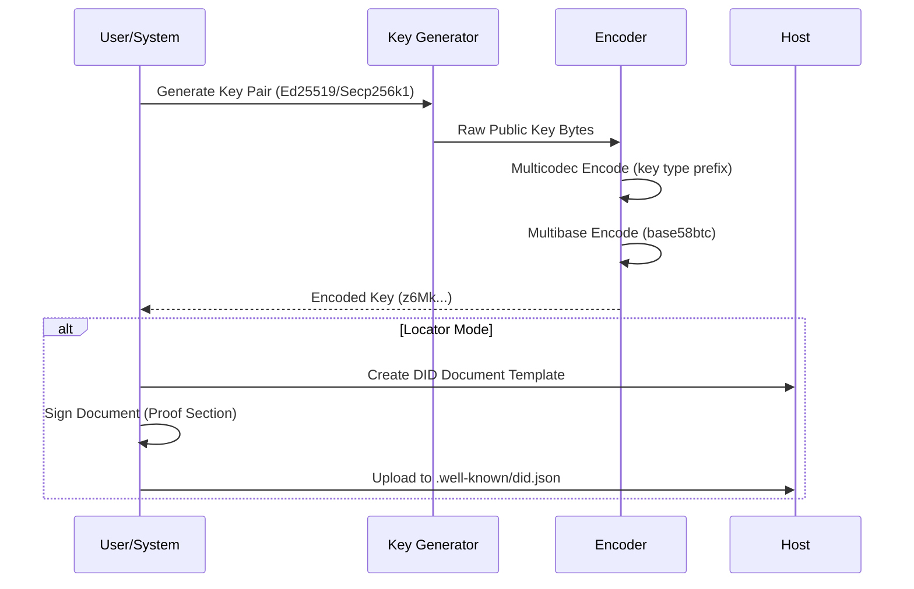
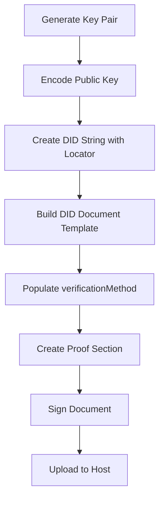
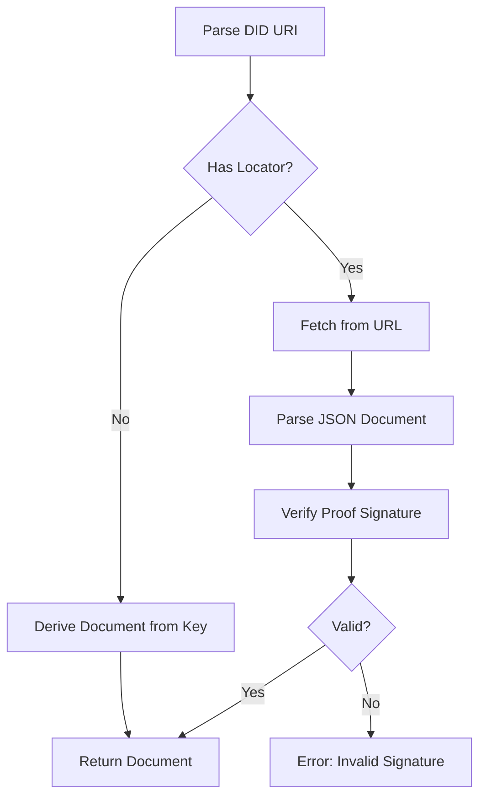

# did-wk Exploration Report

## Overview

`did-wk` is a Rust library for working with DID-Web-Key (did:wk) and DID-Key decentralized identifiers (DIDs). The library implements the `did:wk` method specification, which is a decentralized identity method that bridges concepts from `did:key` and `did:web` to offer a self-sovereign identity solution with verifiable ownership proofs.

The project is currently at version 0.1.0 and is in a work-in-progress state. It is part of the larger MicroSandbox monobase repository.

## Repository

- **Name:** did-wk
- **Repository:** https://github.com/microsandbox/monobase
- **License:** Apache-2.0
- **Authors:** Team MicroSandbox <team@microsandbox.dev>
- **Primary Author (Specification):** Stephen Akinyemi (@appcypher)
- **Rust Edition:** 2021
- **Git Repository:** No (this is a subdirectory within a larger monorepo)

## Directory Structure

```
did-wk/
├── .gitignore          # Git ignore patterns (Rust + monocore specific)
├── Cargo.lock          # Dependency lock file (minimal - no external deps)
├── Cargo.toml          # Package manifest and metadata
├── LICENSE             # Apache-2.0 license text
├── README.md           # DID-WK method specification document (266 lines)
└── lib/
    └── lib.rs          # Library root (module exports, currently minimal)
```

### File Descriptions

| File | Purpose |
|------|---------|
| `.gitignore` | Standard Rust ignore patterns plus monocore-specific patterns (target/, *.rs.bk, private/, build artifacts) |
| `Cargo.lock` | Auto-generated lock file with only the did-wk package (no external dependencies) |
| `Cargo.toml` | Package configuration with metadata and library definition |
| `LICENSE` | Full Apache-2.0 license text |
| `README.md` | Comprehensive DID-WK method specification document |
| `lib/lib.rs` | Library entry point with module declarations (currently minimal stub) |

## Architecture

### Current State

The library is in an **initial scaffolding state**. The core implementation has not yet been written. The `lib/lib.rs` file is essentially a stub with only module-level documentation and warning configurations:

```rust
//! `did-wk` is a library for working with DID-Web-Key and DID-Key decentralized identifiers (DIDs) methods.

#![warn(missing_docs)]
#![allow(clippy::module_inception)]

// Exports section is empty
```

### Specification Architecture

The README.md contains a complete method specification for `did:wk`. The planned architecture includes:

```mermaid
graph TD
    subgraph "DID-WK Methods"
        A[did:wk] --> B[Key Mode<br/>No Locator]
        A --> C[Locator Mode<br/>With @host]
    end

    subgraph "Key Mode Flow"
        B --> D[Generate Key Pair]
        D --> E[Encode with Multicodec]
        E --> F[Encode with Multibase]
        F --> G[did:wk:z6Mk...]
    end

    subgraph "Locator Mode Flow"
        C --> H[Generate Key Pair]
        H --> I[Create DID Document]
        I --> J[Sign Document with Proof]
        J --> K[Host at .well-known/did.json]
        K --> L[did:wk:z6Mk...@example.com]
    end

    subgraph "Resolution"
        G --> M[Derive Document from Key]
        L --> N[Fetch from URL]
        N --> O[Verify Proof Signature]
        O --> P[Return Validated Document]
    end
```

### DID-WK Format Architecture



## Component Breakdown

### Planned Components (from Specification)

Based on the specification document, the library will need to implement:

| Component | Description | Status |
|-----------|-------------|--------|
| **Key Generation** | Generate Ed25519, Secp256k1 key pairs | Not implemented |
| **Multicodec Encoding** | Encode keys with type prefixes per multiformats spec | Not implemented |
| **Multibase Encoding** | Encode binary data as base58btc strings | Not implemented |
| **DID Document Creation** | Generate JSON-LD DID documents | Not implemented |
| **Proof/Signature Creation** | Sign DID documents with Ed25519Signature2018 | Not implemented |
| **DID Parsing** | Parse did:wk URIs into components | Not implemented |
| **Document Resolution** | Fetch and validate hosted documents | Not implemented |
| **Signature Verification** | Verify proof signatures on documents | Not implemented |
| **Key Rotation** | Update documents with new keys | Not implemented |
| **Revocation** | Mark keys/documents as revoked | Not implemented |

### Module Structure (Planned)

```
lib/
├── lib.rs           # Root module, re-exports
├── did/             # DID parsing and formatting
│   ├── parser.rs    # URI parsing
│   └── format.rs    # DID string generation
├── key/             # Key management
│   ├── generator.rs # Key pair generation
│   ├── codec.rs     # Multicodec encoding/decoding
│   └── multibase.rs # Multibase encoding/decoding
├── document/        # DID document handling
│   ├── builder.rs   # Document construction
│   ├── proof.rs     # Proof/signature handling
│   └── resolver.rs  # Document fetching and validation
└── operations/      # CRUD operations
    ├── create.rs    # DID creation
    ├── read.rs      # DID resolution
    ├── update.rs    # Document updates
    └── deactivate.rs# Revocation handling
```

## Entry Points

### Current Entry Points

The library defines a single library target in `Cargo.toml`:

```toml
[lib]
name = "did_wk"
path = "lib/lib.rs"
```

### Planned Public API (inferred from spec)

```rust
// Key operations
pub fn generate_key(algorithm: Algorithm) -> Result<KeyPair>;
pub fn encode_public_key(key: &PublicKey) -> String;
pub fn decode_public_key(encoded: &str) -> Result<PublicKey>;

// DID operations
pub fn create_did(key: &PublicKey, locator: Option<Locator>) -> Did;
pub fn resolve_did(did: &Did) -> Result<DidDocument>;
pub fn verify_document(document: &DidDocument) -> Result<bool>;

// Document operations
pub fn create_document(did: &Did, methods: Vec<VerificationMethod>) -> DidDocument;
pub fn sign_document(document: &mut DidDocument, key: &PrivateKey) -> Result<()>;
```

## Data Flow

### DID Creation Flow (Key Mode)


### DID Creation Flow (Locator Mode)



### DID Resolution Flow



## External Dependencies

### Current Dependencies

The library currently has **no external dependencies** (empty `[dependencies]` section in Cargo.toml).

### Required Dependencies (inferred from spec)

To implement the specification, the library will need:

| Dependency | Purpose |
|------------|---------|
| `multibase` | Multibase encoding/decoding (base58btc) |
| `multicodec` | Multicodec prefix handling |
| `ed25519` / `ed25519-dalek` | Ed25519 key operations and signatures |
| `k256` | Secp256k1 key operations |
| `serde` + `serde_json` | JSON document serialization |
| `url` | URL parsing and validation |
| `tokio` or `reqwest` | HTTP fetching for locator mode |
| `json-canonicalization` | Document canonicalization for signing |

## Configuration

### Cargo.toml Configuration

```toml
[package]
name = "did-wk"
version = "0.1.0"
description = "Library for DID-Web-Key and DID-Key methods"
authors = ["Team MicroSandbox <team@microsandbox.dev>"]
repository = "https://github.com/microsandbox/monobase"
license = "Apache-2.0"
edition = "2021"

[lib]
name = "did_wk"
path = "lib/lib.rs"
```

### .gitignore Configuration

The project ignores:
- Standard Rust build artifacts (`target/`, `*.rs.bk`)
- Monocore-specific files (`private/`, `build/`, `libkrunfw.*`, `libkrun.*`, `.menv/`, `Sandboxfile*`)
- Common development files (`.DS_Store`, `.history`, `*.temp`, `*.tmp`)

## Testing

No test files currently exist in the project. The specification mentions various operations that should be tested:

- Key generation and encoding/decoding round-trips
- DID parsing and formatting
- Document creation and proof generation
- Signature verification
- Resolution with and without locators
- Key rotation scenarios
- Revocation handling

## Key Insights

1. **Hybrid Approach:** The `did:wk` method cleverly combines the simplicity of `did:key` (self-contained DIDs from keys) with the flexibility of `did:web` (hosted documents with rich metadata).

2. **Proof Mechanism:** The key innovation is the `proof` section in locator mode, which cryptographically links the hosted DID document to the public key, providing verifiable ownership that neither `did:key` nor `did:web` offers alone.

3. **Dual Mode Operation:**
   - **Key Mode:** Functions like `did:key` - no external dependencies, document derived from key
   - **Locator Mode:** Points to hosted document with enhanced features and verifiable proof

4. **Minimal Implementation:** The library is at the earliest stage - only scaffolding exists. The full specification in README.md provides a clear roadmap for implementation.

5. **Standards Compliance:** The specification references established standards:
   - W3C DID specification
   - Multiformats (Multibase, Multicodec)
   - RFC 3986 (URI syntax)

## Open Questions

1. **Implementation Timeline:** No indication of when the library implementation will begin.

2. **Algorithm Support:** Specification mentions Ed25519 and Secp256k1, but does it support other algorithms (P-256, P-384, BLS)?

3. **Serialization Format:** The spec mentions "canonicalization" but doesn't specify the exact algorithm (URDNA2015?).

4. **Proof Format:** Is the proof format compatible with Linked Data Proofs v2.0?

5. **Locator URL Resolution:** How are ports and paths handled in the locator component? The spec shows `:port` and `<path-abempty>` but examples don't demonstrate these.

6. **Caching Strategy:** No guidance on cache invalidation for hosted documents.

7. **Error Handling:** No error types or error handling strategy defined.

8. **Async vs Sync:** Will document resolution be async (required for network fetches)?

9. **No External Dependencies:** The empty dependencies suggest the library may need significant additions. Will dependencies be added as implementation proceeds?

10. **Integration with monobase:** How does this library integrate with the larger monobase project?

## Appendix: DID-WK Examples

From the specification:

```
# Key mode (no locator)
did:wk:z6MkwFK7L2unwCxXNaws5wxbWKbzEiC84mCYno7RW5dZ7rzq

# Locator mode with path
did:wk:z6MkwFK7L2unwCxXNaws5wxbWKbzEiC84mCYno7RW5dZ7rzq@steve.monocore.dev/pub

# Locator mode without path
did:wk:z6MkwFK7L2unwCxXNaws5wxbWKbzEiC84mCYno7RW5dZ7rzq@steve.monocore.dev
```

### Example DID Document (Locator Mode)

```json5
{
  "@context": "https://www.w3.org/ns/did/v1",
  "id": "did:wk:z6MkwFK7L2unwCxXNaws5wxbWKbzEiC84mCYno7RW5dZ7rzq@steve.monocore.dev",
  "verificationMethod": [
    {
      "id": "did:wk:z6MkwFK7L2unwCxXNaws5wxbWKbzEiC84mCYno7RW5dZ7rzq@steve.monocore.dev#keys-1",
      "type": "Ed25519VerificationKey2018",
      "controller": "did:wk:z6MkwFK7L2unwCxXNaws5wxbWKbzEiC84mCYno7RW5dZ7rzq@steve.monocore.dev",
      "publicKeyBase58": "<base58-encoded-public-key>"
    }
  ],
  "authentication": ["did:wk:...#keys-1"],
  "proof": {
    "type": "Ed25519Signature2018",
    "created": "2024-01-01T00:00:00Z",
    "verificationMethod": "did:wk:...#keys-1",
    "proofPurpose": "assertionMethod",
    "nonce": "<random-nonce>",
    "signatureValue": "<base64-encoded-signature>"
  }
}
```
