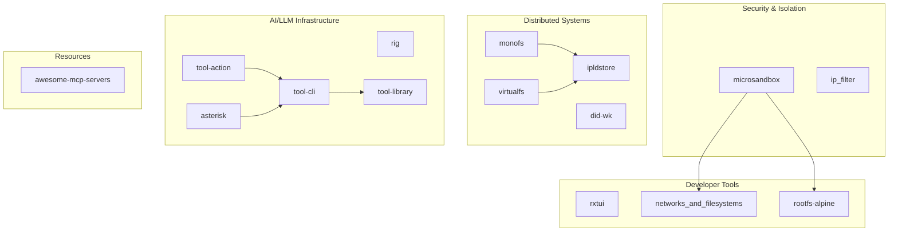
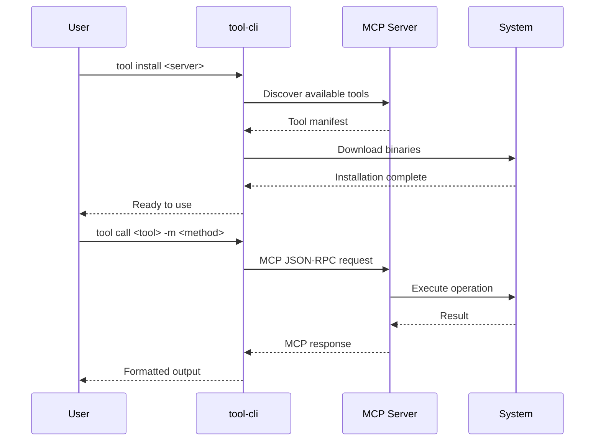

# Project Exploration: Microsandbox Projects

## Overview

This is a collection of 18+ Rust projects focused on secure sandboxing, distributed systems, AI/LLM tooling, and developer infrastructure. The projects are organized as independent crates/repositories grouped under a common monorepo-style directory.

The main project, **microsandbox**, provides hardware-isolated execution environments for untrusted code with sub-200ms boot times, OCI compatibility, and MCP (Model Context Protocol) integration for AI agents.

## Repository

- **Location:** `/home/darkvoid/Boxxed/@formulas/src.rust/src.Containers/src.Microsandbox`
- **Remote:** N/A - not a git repository
- **Primary Language:** Rust (edition 2021/2024)
- **License:** Apache-2.0 (majority), MIT (tool-cli), CC0 (awesome-mcp-servers)

## Directory Structure

```
Microsandbox/
├── agents/                          # Radical agents collection (git submodule)
├── asterisk/                        # Tauri-based AI agent toolkit
│   ├── asterisk-cli/                # CLI interface
│   ├── asterisk-core/               # Core logic
│   ├── asterisk-server/             # Backend server
│   └── Cargo.toml                   # Workspace definition
├── awesome-mcp-servers/             # Curated list of MCP servers (see exploration.md)
├── commands/                        # Radical commands collection (git submodule)
├── did-wk/                          # DID:WK specification & implementation
├── ip_filter/                       # Network IP filtering via syscall interception (see exploration.md)
├── ipldstore/                       # IPLD content-addressed storage library
├── microsandbox/                    # Main sandboxing platform
│   ├── microsandbox-cli/            # Command-line interface
│   ├── microsandbox-core/           # Core sandboxing logic
│   ├── microsandbox-portal/         # Management portal
│   ├── microsandbox-server/         # REST API server
│   └── microsandbox-utils/          # Utility functions
├── monofs/                          # Distributed versioned filesystem
├── networks_and_filesystems/        # Network interface management daemon
├── radical-plugins/                 # Plugin aggregator (git submodule)
├── rig/                             # RAG framework for LLMs
├── rootfs-alpine/                   # Alpine Linux root filesystems
├── rxtui/                           # Reactive TUI framework
├── tool-action/                     # GitHub Actions for MCPB bundles
├── tool-cli/                        # MCP tool manager CLI
├── tool-library/                    # MCP tool implementations
└── virtualfs/                       # Virtual filesystem abstraction
```

## Architecture

### High-Level Diagram



### Component Breakdown

#### microsandbox (Main Project)
- **Location:** `microsandbox/`
- **Purpose:** Hardware-isolated sandboxing for untrusted code execution
- **Dependencies:** libkrun, OCI spec, tokio, axum
- **Dependents:** All other projects benefit from isolation capabilities

#### ipldstore
- **Location:** `ipldstore/`
- **Purpose:** IPLD content-addressed storage abstraction
- **Dependencies:** ipld-core, multihash, tokio, DAG-CBOR
- **Dependents:** monofs, virtualfs

#### monofs
- **Location:** `monofs/`
- **Purpose:** Versioned distributed filesystem
- **Dependencies:** ipldstore, nfsserve, tokio, sqlx
- **Dependents:** None (end-user library)

#### rig
- **Location:** `rig/`
- **Purpose:** RAG framework with 16+ database/AI integrations
- **Dependencies:** Multiple vector DBs, AI provider SDKs
- **Dependents:** AI agent applications

#### tool-cli
- **Location:** `tool-cli/`
- **Purpose:** MCP tool manager and installer
- **Dependencies:** rmcp (Rust MCP SDK), tokio, clap
- **Dependents:** tool-library consumers, asterisk

#### tool-library
- **Location:** `tool-library/`
- **Purpose:** Collection of MCP tool implementations
- **Dependencies:** Internal tools
- **Dependents:** tool-cli users

#### rxtui
- **Location:** `rxtui/`
- **Purpose:** Reactive TUI framework with virtual DOM
- **Dependencies:** tokio, crossterm/ratatui
- **Dependents:** CLI applications

#### asterisk
- **Location:** `asterisk/`
- **Purpose:** AI agent toolkit with Tauri frontend
- **Dependencies:** Tauri 2.0, tool-cli
- **Dependents:** None (end-user application)

## Entry Points

### Microsandbox CLI
- **File:** `microsandbox/microsandbox-cli/src/main.rs`
- **Description:** Main entry point for sandbox management
- **Flow:**
  1. Parse CLI args with clap
  2. Initialize server connection
  3. Route to command handler (server start/stop, sandbox create/run, etc.)
  4. Execute RPC calls to microsandbox-server
  5. Display results/output

### Tool CLI
- **File:** `tool-cli/bin/tool.rs`
- **Description:** MCP tool management CLI
- **Flow:**
  1. Parse command (install, discover, call, etc.)
  2. Resolve tool from registry or local path
  3. Execute MCP protocol handshake
  4. Stream tool output

### Monofs CLI
- **File:** `monofs/bin/monofs.rs`
- **Description:** Filesystem operations CLI
- **Flow:**
  1. Initialize store backend
  2. Load/create filesystem
  3. Execute file/dir operations
  4. Checkpoint to IPLD

## Data Flow



## External Dependencies

| Dependency | Version | Purpose |
|------------|---------|---------|
| libkrun | git | Lightweight VM isolation |
| tokio | 1.42+ | Async runtime |
| ipld-core | 0.4 | IPLD data model |
| multihash | 0.19 | Content addressing |
| nfsserve | 0.10 | NFS server |
| rmcp | git | Rust MCP SDK |
| Tauri | 2.0 | Desktop app framework |
| axum | 0.8 | Web framework |
| sqlx | 0.8 | Database toolkit |

## Configuration

### Microsandbox
- Server config via `~/.microsandbox/config.toml`
- Environment: `MSB_SERVER_ADDR`, `MSB_DEV_MODE`
- Pulls OCI images from registries

### Tool-CLI
- Config: `~/.tool-cli/config.json`
- Registry: `TOOL_REGISTRY_URL`, `TOOL_REGISTRY_TOKEN`
- OAuth: Client ID/secret for authenticated tools

### Monofs
- Store backend: Memory, SQLite, or custom
- NFS mount options for network mode

## Testing

- **Coverage:** Varies by project
- **Frameworks:** tokio-test, serial_test, test-log
- **Run:** `cargo test` in each project directory
- **CI:** GitHub Actions (where configured)

## Key Insights

1. **Unified Vision:** All projects support the "agentic web" - secure, distributed AI agent infrastructure
2. **Content-Addressed Foundation:** IPLD underpins monofs and virtualfs for distributed storage
3. **MCP Ecosystem:** tool-cli/tool-library form a package manager for AI agent capabilities
4. **Security First:** microsandbox provides hardware isolation; ip_filter adds network filtering
5. **Rust-First:** All projects use modern Rust (2021/2024 edition) with async/await

## Open Questions

1. How do the Radical agents/commands/plugins submodules integrate with the rest?
2. What's the relationship between this repo and upstream microsandbox/monofs/etc.?
3. Are there integration tests across projects?
4. What's the deployment strategy for production microsandbox?

## Related Explorations

- [`awesome-mcp-servers/exploration.md`](./awesome-mcp-servers/exploration.md) - MCP server catalog
- [`ip_filter/exploration.md`](./ip_filter/exploration.md) - Network filtering deep dive
