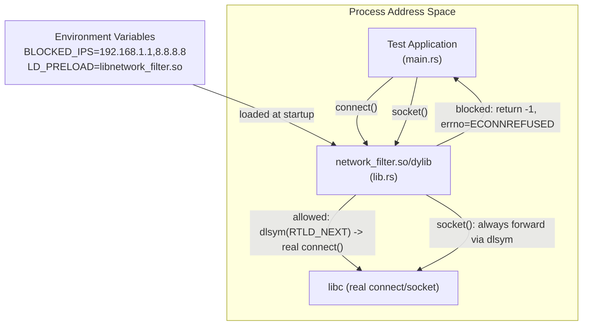
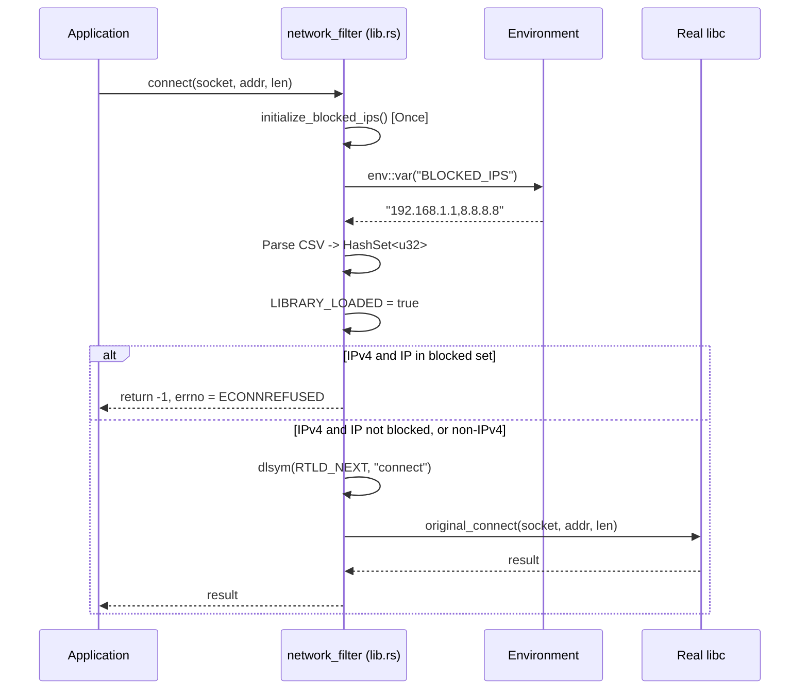
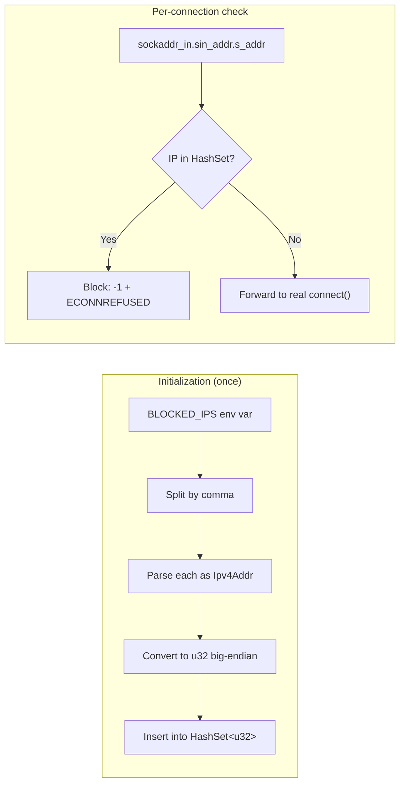

# ip_filter - Network Connection Interception via LD_PRELOAD / DYLD_INSERT_LIBRARIES

## Overview

`ip_filter` is a Rust-based shared library (`cdylib`) that intercepts outbound network connections at the libc level using the `LD_PRELOAD` (Linux) or `DYLD_INSERT_LIBRARIES` (macOS) mechanism. It replaces the `connect()` and `socket()` system call wrappers, allowing it to block connections to specific IPv4 addresses based on an environment variable (`BLOCKED_IPS`). Blocked connections receive an `ECONNREFUSED` error. Allowed connections are forwarded to the real libc `connect()` via `dlsym(RTLD_NEXT, ...)`.

This is an exploratory/prototype project within the broader Microsandbox formula collection, investigating syscall-level network filtering as a sandboxing primitive.

## Repository

Not a standalone git repository. Part of the `@formulas/src.rust/src.Containers/src.Microsandbox` directory tree, which contains related container and sandboxing experiments (microsandbox core, monofs, rootfs-alpine, virtualfs, networking, agents, etc.).

## Directory Structure

```
ip_filter/
├── .gitignore          # Ignores /target
├── Cargo.toml          # Package manifest (name: network_filter, edition 2021)
├── Cargo.lock          # Locked dependency versions
├── README.md           # Build & run instructions for macOS and Linux
└── src/
    ├── lib.rs          # Core library: connect() and socket() interception (139 lines)
    └── main.rs         # Test harness: attempts connections to 3 IPs (47 lines)
```

**Total source**: 186 lines of Rust across 2 files.

## Architecture

### High-Level Design

The project uses the classic Unix technique of shared library interposition. A `cdylib` crate produces a `.so` (Linux) or `.dylib` (macOS) that exports symbols named `connect` and `socket` -- the same names as the libc functions. When loaded via `LD_PRELOAD`/`DYLD_INSERT_LIBRARIES`, the dynamic linker resolves these symbols to the library's versions first, giving the library a chance to inspect, block, or forward each call.



### Initialization Flow



### Data Flow



## Component Breakdown

### lib.rs -- Core Interception Library (139 lines)

**Globals:**
- `INIT: Once` -- ensures `initialize_blocked_ips()` runs exactly once.
- `BLOCKED_IPS: Option<HashSet<u32>>` -- static mutable storing the blocked IP set. IPs stored as raw `u32` in big-endian byte order for direct comparison with `sockaddr_in.sin_addr.s_addr`.
- `LIBRARY_LOADED: AtomicBool` -- flag set after initialization completes; used for diagnostic warnings.
- `RTLD_NEXT` -- constant set to `-1` as a `*mut c_void`, used with `dlsym` to find the next symbol in the dynamic linker search order (i.e., the real libc function).

**Functions:**

| Function | Signature | Purpose |
|----------|-----------|---------|
| `initialize_blocked_ips()` | `fn initialize_blocked_ips()` | Reads `BLOCKED_IPS` env var, parses comma-separated IPv4 addresses, stores as `HashSet<u32>`. Protected by `Once`. |
| `connect()` | `pub unsafe extern "C" fn connect(socket: c_int, address: *const sockaddr, len: c_int) -> c_int` | Exported `#[no_mangle]`. Intercepts the libc `connect()` call. Checks if the target is an IPv4 address in the blocked set. If blocked, sets `errno` to `ECONNREFUSED` and returns `-1`. Otherwise, resolves the real `connect` via `dlsym(RTLD_NEXT)` and forwards. |
| `socket()` | `pub unsafe extern "C" fn socket(domain: c_int, sock_type: c_int, protocol: c_int) -> c_int` | Exported `#[no_mangle]`. Intercepts the libc `socket()` call. Purely a passthrough -- resolves the real `socket` via `dlsym(RTLD_NEXT)` and forwards. Included for observability (prints interception messages). |

**FFI:**
- Links against libc (`#[link(name = "c")]`) to access `dlsym` directly.
- Uses `std::mem::transmute` to cast raw function pointers from `dlsym` to typed Rust function pointers.

### main.rs -- Test Harness (47 lines)

A standalone binary that attempts TCP connections to three hardcoded addresses:

| Address | Port | Expected behavior with `BLOCKED_IPS=192.168.1.1,8.8.8.8` |
|---------|------|-----------------------------------------------------------|
| 192.168.1.1 | 80 | Blocked (ECONNREFUSED) |
| 8.8.8.8 | 53 | Blocked (ECONNREFUSED) |
| 1.1.1.1 | 53 | Allowed (forwarded to real connect) |

Note: `main.rs` uses `sockaddr_in.sin_len` and casts `sin_family` as `u8`, which are macOS-specific. This would not compile on Linux without modification (`sin_len` does not exist on Linux's `sockaddr_in`).

## Entry Points

| Entry Point | Type | Description |
|-------------|------|-------------|
| `lib.rs::connect()` | Exported C symbol (`cdylib`) | Intercepted by dynamic linker when library is preloaded |
| `lib.rs::socket()` | Exported C symbol (`cdylib`) | Intercepted by dynamic linker when library is preloaded |
| `main.rs::main()` | Binary entry point | Test program; only useful when run with the library preloaded |

## External Dependencies

| Crate | Version | Purpose |
|-------|---------|---------|
| `libc` | 0.2.161 | Provides Rust bindings for C types: `sockaddr`, `sockaddr_in`, `AF_INET`, `SOCK_STREAM`, `ECONNREFUSED`, etc. |
| `errno` | 0.3.9 | Provides `set_errno()` to set the thread-local errno value, required for returning proper error codes from intercepted syscalls. |

No async runtime, no networking crate, no build dependencies. Minimal dependency footprint.

## Configuration

| Mechanism | Variable | Format | Example |
|-----------|----------|--------|---------|
| Environment variable | `BLOCKED_IPS` | Comma-separated IPv4 addresses | `192.168.1.1,8.8.8.8` |
| Environment variable | `LD_PRELOAD` (Linux) | Path to `.so` | `target/release/libnetwork_filter.so` |
| Environment variable | `DYLD_INSERT_LIBRARIES` (macOS) | Path to `.dylib` | `target/release/libnetwork_filter.dylib` |
| Environment variable | `DYLD_FORCE_FLAT_NAMESPACE` (macOS) | Must be `1` | `1` |

No config files. No CLI flags. Everything is environment-driven.

## Testing

No automated tests (no `#[test]` functions, no `tests/` directory, no CI configuration).

Testing is manual:
1. Build the library: `cargo build --release`
2. Set environment variables for preloading and blocked IPs
3. Run the test binary: `cargo run --release`
4. Observe stdout for interception messages and connection results

## Key Insights

1. **Classic Unix interposition pattern in Rust**: This is a textbook `LD_PRELOAD` hook implemented in Rust rather than C. The `cdylib` crate type produces a shared library with C-compatible exported symbols.

2. **Safety trade-offs**: The code uses `static mut` for the blocked IPs set, which requires `unsafe`. The `Once` guard ensures single initialization, but the pattern is not idiomatic modern Rust (which would prefer `OnceLock` or `LazyLock` from `std::sync`).

3. **IP comparison strategy**: IPs are stored as raw `u32` in big-endian form (`Ipv4Addr::octets()` -> `u32::from_be_bytes()`), allowing direct comparison with `sockaddr_in.sin_addr.s_addr` (which is also in network byte order).

4. **Socket interception is a no-op**: The `socket()` hook does nothing beyond logging and forwarding. It exists as scaffolding -- potentially for future filtering by socket domain/type, or for observability.

5. **Platform divergence**: `lib.rs` targets both Linux and macOS (via `RTLD_NEXT` and `dlsym`), but `main.rs` uses macOS-specific `sockaddr_in` fields (`sin_len`, `sin_family` as `u8`), making the test binary macOS-only without modification.

6. **Verbose logging**: Every interception prints to stdout. This is appropriate for a prototype/exploration but would be removed or gated behind a flag in production.

7. **IPv4 only**: No IPv6 (`AF_INET6`) support. Only `sockaddr_in` is inspected; `sockaddr_in6` connections pass through unfiltered.

8. **Sandboxing relevance**: Within the Microsandbox project, this demonstrates one layer of a defense-in-depth approach -- network filtering at the syscall interposition level, complementary to kernel-level mechanisms (seccomp, namespaces) explored elsewhere in the parent directory.

## Open Questions

1. **Why not use seccomp-bpf instead?** -- `LD_PRELOAD` can be bypassed by statically linked binaries or direct syscalls. For a sandboxing tool, seccomp would be more robust. Is this intended as a complementary layer or just a prototype?

2. **IPv6 support planned?** -- The current implementation silently allows all IPv6 connections. Is this intentional?

3. **Thread safety of `BLOCKED_IPS`** -- While `Once` protects initialization, the `static mut` pattern is technically unsound in Rust's memory model. Would migrating to `OnceLock<HashSet<u32>>` (stable since Rust 1.70) be worth doing?

4. **CIDR / subnet blocking** -- Currently only exact IP matches. Is range-based blocking (e.g., `10.0.0.0/8`) in scope?

5. **Integration with microsandbox runtime** -- How does this library get injected in a real microsandbox container? Is it bundled into a rootfs, or injected at runtime by the orchestrator?

6. **DNS resolution bypass** -- Blocking `connect()` doesn't prevent DNS lookups. A blocked IP could still be resolved; only the connection is refused. Should `getaddrinfo` also be intercepted?
