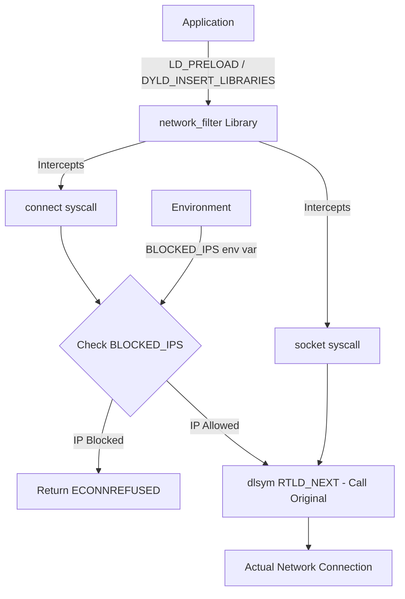
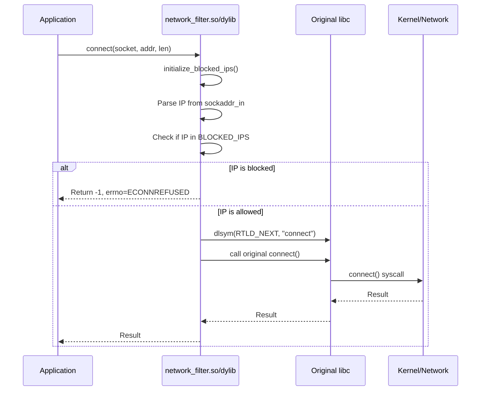
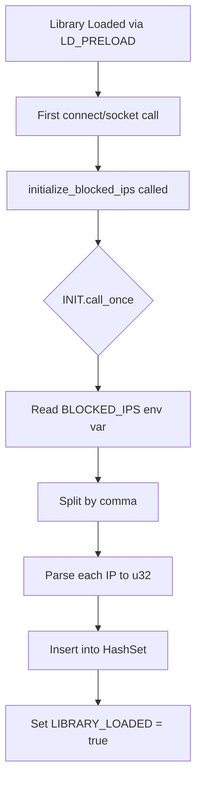

# IP Filter - Exploration Report

## Overview

`ip_filter` is a lightweight Rust library that implements network connection filtering by intercepting the `connect()` syscall. It functions as a dynamically loaded library (using `LD_PRELOAD` on Linux or `DYLD_INSERT_LIBRARIES` on macOS) that hooks into network calls and blocks connections to specified IP addresses. The library reads a list of blocked IPs from an environment variable (`BLOCKED_IPS`) and prevents outbound TCP connections to those addresses by returning `ECONNREFUSED`.

This is a small, focused utility project (2 source files, ~140 lines of code) demonstrating syscall interception techniques for network filtering at the application level.

## Repository

| Property | Value |
|----------|-------|
| **Path** | `/home/darkvoid/Boxxed/@formulas/src.rust/src.Containers/src.Microsandbox/ip_filter` |
| **Git** | Not a git repository |
| **Created** | July 22, 2025 (based on file timestamps) |
| **Name** | `network_filter` (crate name) |
| **Version** | 0.1.0 |
| **Rust Edition** | 2021 |

## Directory Structure

```
ip_filter/
├── Cargo.toml           # Project manifest (dependencies, crate type)
├── Cargo.lock           # Dependency lock file
├── .gitignore           # Git ignore rules (/target)
├── README.md            # Build and usage instructions
└── src/
    ├── lib.rs           # Core library - syscall interception logic
    └── main.rs          # Test program - demonstrates filtering
```

### File Summary

| File | Size | Purpose |
|------|------|---------|
| `Cargo.toml` | 167 bytes | Project configuration, dependencies (`libc`, `errno`) |
| `Cargo.lock` | 2.9 KB | Pinned dependency versions |
| `.gitignore` | 8 bytes | Excludes `/target` build directory |
| `README.md` | 519 bytes | Build instructions for macOS and Linux |
| `src/lib.rs` | ~4.5 KB | Core filtering library with `connect()` and `socket()` hooks |
| `src/main.rs` | ~1.5 KB | Test harness that attempts connections to sample IPs |

## Architecture

### High-Level Design



### Interception Flow



## Component Breakdown

### 1. Core Library (`src/lib.rs`)

#### Static State Management
```rust
static INIT: Once = Once::new();
static mut BLOCKED_IPS: Option<HashSet<u32>> = None;
static LIBRARY_LOADED: AtomicBool = AtomicBool::new(false);
```

- **`INIT`**: `Once` ensures one-time initialization of blocked IPs
- **`BLOCKED_IPS`**: `HashSet<u32>` storing blocked IPs as big-endian 32-bit integers
- **`LIBRARY_LOADED`**: `AtomicBool` flag for thread-safe load status checking

#### Key Functions

| Function | Signature | Purpose |
|----------|-----------|---------|
| `initialize_blocked_ips()` | `fn()` | Parses `BLOCKED_IPS` env var, populates HashSet |
| `connect()` | `unsafe extern "C" fn(c_int, *const sockaddr, c_int) -> c_int` | Intercepts and filters TCP connection attempts |
| `socket()` | `unsafe extern "C" fn(c_int, c_int, c_int) -> c_int` | Intercepts socket creation (pass-through, for logging) |

#### Syscall Interception Pattern

The library uses the **dynamic linker symbol resolution** technique:

1. Define `RTLD_NEXT` as `-1` to search for the next occurrence of a symbol in the dynamic linker search order
2. Use `dlsym(RTLD_NEXT, "symbol_name")` to get a pointer to the original libc function
3. Transmute the pointer to a callable function
4. Conditionally call the original or return an error

```rust
const RTLD_NEXT: *mut std::ffi::c_void = -1isize as *mut std::ffi::c_void;

let connect_sym = CStr::from_bytes_with_nul(b"connect\0").unwrap();
let sym = dlsym(RTLD_NEXT, connect_sym.as_ptr());
let original_connect = Some(std::mem::transmute(sym));
```

### 2. Test Program (`src/main.rs`)

A simple test harness that:

1. Creates TCP sockets using raw `socket()` syscalls
2. Attempts connections to 3 test addresses:
   - `192.168.1.1:80` (typical local network gateway)
   - `8.8.8.8:53` (Google DNS)
   - `1.1.1.1:53` (Cloudflare DNS)
3. Reports connection success/failure

```rust
let addresses = [
    ("192.168.1.1", 80),
    ("8.8.8.8", 53),
    ("1.1.1.1", 53),
];
```

## Entry Points

### Library Entry Points (Exported Symbols)

| Symbol | Type | Visibility |
|--------|------|------------|
| `connect` | `extern "C"` | `#[no_mangle]` - exported for LD_PRELOAD |
| `socket` | `extern "C"` | `#[no_mangle]` - exported for LD_PRELOAD |

### Crate Type

```toml
[lib]
name = "network_filter"
crate-type = ["cdylib"]
```

The `cdylib` crate type produces a dynamic library:
- **Linux**: `libnetwork_filter.so`
- **macOS**: `libnetwork_filter.dylib`

## Data Flow

### Initialization Sequence



### Connection Filtering Logic

1. Intercept `connect()` call
2. Check if address is IPv4 (`AF_INET`)
3. Extract IP address from `sockaddr_in` structure
4. Convert IP to big-endian `u32`
5. Check against `BLOCKED_IPS` HashSet
6. If blocked: set `errno = ECONNREFUSED`, return `-1`
7. If not blocked: call original `connect()` via `dlsym`

## External Dependencies

| Dependency | Version | Purpose |
|------------|---------|---------|
| `libc` | 0.2.161 | FFI bindings for C standard library (socket, connect, dlsym, etc.) |
| `errno` | 0.3.9 | Thread-safe errno access (`set_errno`, `Errno`) |

### Transitive Dependencies (from Cargo.lock)

- `windows-sys` 0.52.0 - Pulled in by `errno` crate (cross-platform support)
- Various `windows_*` platform-specific crates

## Configuration

### Environment Variables

| Variable | Required | Format | Example |
|----------|----------|--------|---------|
| `BLOCKED_IPS` | No | Comma-separated IPv4 addresses | `192.168.1.1,8.8.8.8` |
| `LD_PRELOAD` | Yes (Linux) | Path to `.so` file | `target/release/libnetwork_filter.so` |
| `DYLD_INSERT_LIBRARIES` | Yes (macOS) | Path to `.dylib` file | `target/release/libnetwork_filter.dylib` |
| `DYLD_FORCE_FLAT_NAMESPACE` | Yes (macOS) | `1` | Forces symbol resolution |

### Build Configuration (Cargo.toml)

```toml
[package]
name = "network_filter"
version = "0.1.0"
edition = "2021"

[dependencies]
libc = "0.2"
errno = "0.3"

[lib]
name = "network_filter"
crate-type = ["cdylib"]
```

## Testing

### Manual Test Procedure (from README.md)

**Linux:**
```bash
cargo build --release && \
    export LD_PRELOAD="target/release/libnetwork_filter.so" && \
    export BLOCKED_IPS="192.168.1.1,8.8.8.8" && \
    cargo run --release
```

**macOS:**
```bash
cargo build --release && \
    export DYLD_INSERT_LIBRARIES="target/release/libnetwork_filter.dylib" && \
    export DYLD_FORCE_FLAT_NAMESPACE=1 && \
    export BLOCKED_IPS="192.168.1.1,8.8.8.8" && \
    cargo run --release
```

### Expected Output

When filtering is active:
- Connections to blocked IPs should fail with "Connection refused"
- Console output shows interception logs:
  - "Initializing blocked IPs"
  - "Intercepted connect call"
  - "Blocking connection to IP: X.X.X.X"

### Automated Tests

**None present.** The project lacks:
- Unit tests (`#[cfg(test)]` modules)
- Integration tests (`tests/` directory)
- CI/CD configuration

## Key Insights

1. **LD_PRELOAD Technique**: Uses dynamic linker symbol interposition to intercept libc calls without modifying the target application. This is a well-known technique used by tools like `valgrind`, `strace`, and various profilers.

2. **Thread-Safe Initialization**: Uses `Once` for one-time setup and `AtomicBool` for the load flag, ensuring safe initialization even with concurrent calls.

3. **IP Storage Efficiency**: Stores IPs as `u32` (big-endian) rather than strings, enabling O(1) HashSet lookups instead of string comparisons.

4. **Minimal Dependencies**: Only `libc` and `errno` - no heavy framework dependencies, keeping the library lightweight.

5. **Cross-Platform Design**: Works on both Linux (`LD_PRELOAD`) and macOS (`DYLD_INSERT_LIBRARIES`), though macOS requires `DYLD_FORCE_FLAT_NAMESPACE=1` for symbol interposition to work reliably.

6. **Debug Logging**: Extensive `println!` statements throughout for debugging interception flow - useful for development but would need to be conditionalized for production.

## Open Questions

1. **IPv6 Support**: Currently only handles IPv4 (`AF_INET`). How should IPv6 (`AF_INET6`) be handled?

2. **Error Handling**: If `dlsym` fails to find the original symbol, it returns `ENOSYS`. Should there be fallback behavior or panic?

3. **Logging**: Production use would require proper logging (e.g., `tracing` or `log` crate) instead of `println!`. Should this be configurable?

4. **Performance**: The `println!` calls on every connection could impact performance. Should verbose logging be optional via another env var?

5. **Security**: The `BLOCKED_IPS` parsing happens at runtime with no validation beyond IP format. Should malformed IPs cause startup failure?

6. **Testing Strategy**: How should this be tested automatically? Mocking `dlsym` is non-trivial. Should there be a pure-Rust testing mode?

7. **Build Artifacts**: No `.cargo/config.toml` to simplify build commands. Should this be added for easier development?

8. **Integration with Microsandbox**: Given the path (`src.Microsandbox/ip_filter`), how does this integrate with the broader Microsandbox project? Is it used as a dependency or standalone tool?
