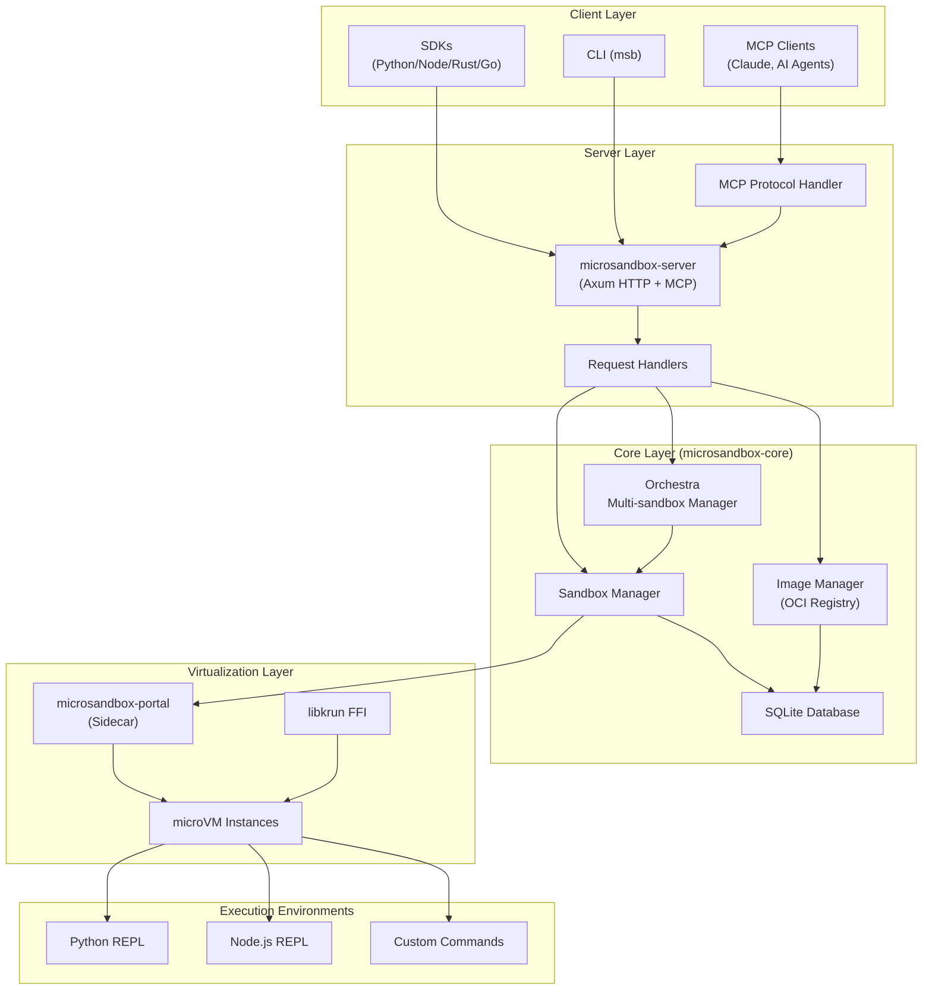
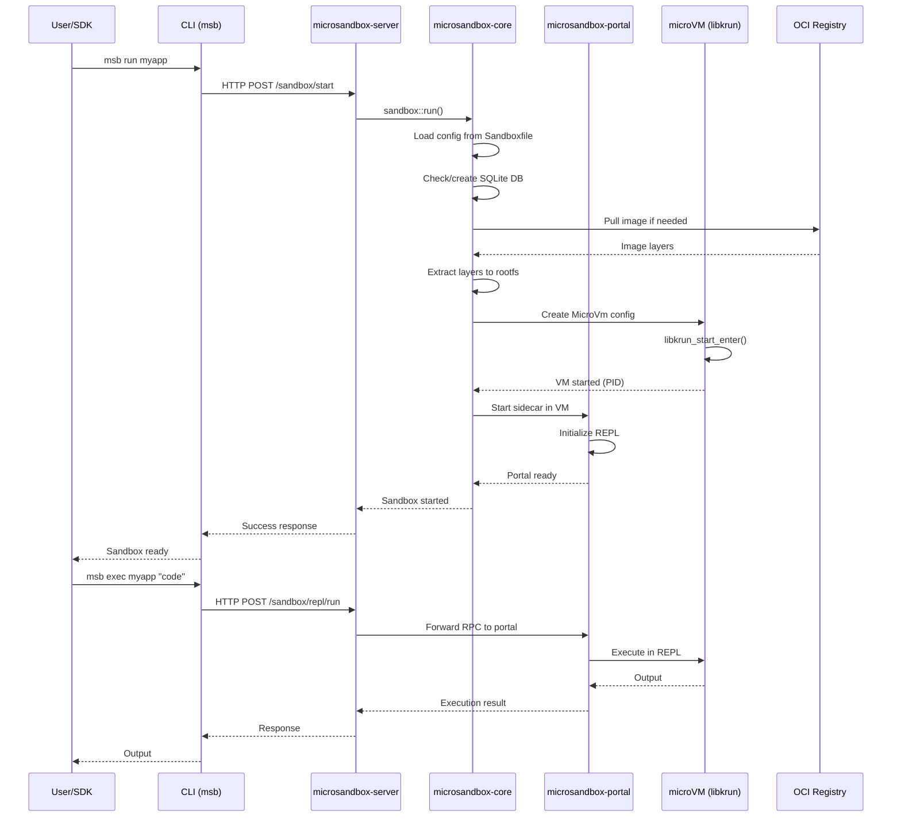
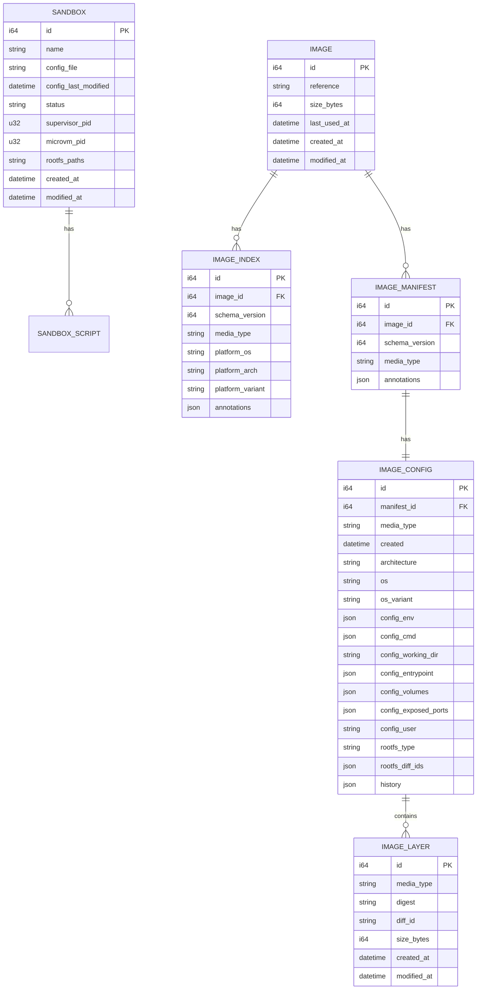

# Microsandbox - Comprehensive Exploration Report

## Overview

Microsandbox is a secure microVM provisioning system designed for running untrusted code in isolated environments with hardware-level isolation. It provides a container-like experience using OCI/Docker images while delivering true VM-level security through libkrun-based microVMs with sub-200ms boot times.

The project targets AI/LLM workloads, secure code execution environments, and development sandboxing scenarios. It integrates with the Model Context Protocol (MCP) for AI agent workflows and supports both macOS (Apple Silicon) and Linux (KVM-enabled) platforms.

**Key Characteristics:**
- **Isolation**: Hardware-level VM isolation via libkrun
- **Compatibility**: Standard OCI/Docker image support
- **Performance**: Boot times under 200ms
- **Security**: Resource constraints, network isolation, filesystem sandboxing
- **Integration**: MCP server for AI agent integration, CLI and SDK interfaces

## Repository

- **URL**: https://github.com/zerocore-ai/microsandbox
- **Primary Branch**: main
- **Current Version**: 0.2.6
- **License**: Apache-2.0
- **Edition**: Rust 2024

**Git Status at Exploration:**
- Branch: main (up to date with origin/main)
- Recent commits focus on security fixes (RUSTSEC advisories), namespace deprecation, health check optimization, and CI/CD improvements

## Directory Structure

```
microsandbox/
├── assets/                          # Marketing/documentation assets
│   ├── microsandbox-banner-xl-dark.png
│   └── microsandbox-banner-xl.png
│
├── docs/                            # Documentation site
│   ├── guides/                      # User guides
│   │   ├── api-keys.md
│   │   ├── architecture.md
│   │   ├── getting-started.md
│   │   ├── mcp.md
│   │   ├── projects.md
│   │   ├── sandboxes.md
│   │   └── index.md
│   ├── references/                  # API/CLI references
│   │   ├── api.md
│   │   ├── cli.md
│   │   ├── python-sdk.md
│   │   ├── rust-sdk.md
│   │   ├── typescript-sdk.md
│   │   └── index.md
│   ├── static/                      # Static documentation assets
│   ├── favicon.ico
│   ├── index.md
│   ├── retype.manifest
│   ├── retype.yml                   # Documentation config
│   └── wrangler.toml                # Cloudflare Workers config for docs
│
├── microsandbox-cli/                # Command-line interface
│   ├── bin/                         # Binary entry points
│   │   ├── msb/                     # Main CLI (msb command)
│   │   │   ├── main.rs              # CLI entry point with all subcommands
│   │   │   ├── handlers.rs          # Command handler implementations
│   │   │   └── mod.rs
│   │   ├── msbrun.rs                # Sandbox run binary
│   │   └── msbserver.rs             # Server binary
│   ├── lib/                         # CLI library
│   │   ├── args/                    # CLI argument definitions
│   │   │   ├── mod.rs
│   │   │   ├── msb.rs               # Main msb command args
│   │   │   ├── msbrun.rs
│   │   │   └── msbserver.rs
│   │   ├── error.rs                 # CLI error types
│   │   ├── lib.rs                   # CLI library exports
│   │   └── styles.rs                # Terminal styling utilities
│   └── Cargo.toml
│
├── microsandbox-core/               # Core sandbox/VM management
│   ├── lib/                         # Core library
│   │   ├── config/                  # Configuration types
│   │   │   ├── env_pair.rs          # Environment variable pairs
│   │   │   ├── path_pair.rs         # Host:guest path mappings
│   │   │   ├── path_segment.rs
│   │   │   ├── port_pair.rs         # Port mapping pairs
│   │   │   ├── reference_path.rs
│   │   │   └── microsandbox/        # Microsandbox config structure
│   │   │       ├── builder.rs
│   │   │       ├── config.rs        # Main config types (Sandbox, Build, Meta)
│   │   │       └── mod.rs
│   │   ├── management/              # Sandbox/image orchestration
│   │   │   ├── config.rs            # Config loading utilities
│   │   │   ├── db.rs                # SQLite database management
│   │   │   ├── home.rs              # Home directory management
│   │   │   ├── menv.rs              # Microsandbox environment (.menv)
│   │   │   ├── mod.rs
│   │   │   ├── orchestra.rs         # Multi-sandbox orchestration
│   │   │   ├── rootfs.rs            # Root filesystem management
│   │   │   ├── sandbox.rs           # Sandbox lifecycle management
│   │   │   └── toolchain.rs
│   │   ├── migrations/              # Database migrations
│   │   │   ├── oci/                 # OCI image DB schema
│   │   │   └── sandbox/             # Sandbox DB schema
│   │   ├── models.rs                # Database models (Sandbox, Image, Layer, etc.)
│   │   ├── oci/                     # OCI image/registry operations
│   │   │   ├── global_cache.rs      # Layer caching
│   │   │   ├── image.rs             # Image pulling/management
│   │   │   ├── layer/               # Layer extraction
│   │   │   │   ├── extraction.rs
│   │   │   │   ├── mod.rs
│   │   │   │   └── progress.rs
│   │   │   ├── mocks.rs             # Test mocks
│   │   │   ├── mod.rs
│   │   │   ├── reference.rs         # OCI reference parsing
│   │   │   ├── registry.rs          # Registry client
│   │   │   └── tests.rs
│   │   ├── runtime/                 # Process supervision
│   │   │   ├── mod.rs
│   │   │   └── monitor.rs           # Resource monitoring
│   │   ├── utils/                   # Common utilities
│   │   │   ├── conversion.rs
│   │   │   ├── file.rs
│   │   │   ├── mod.rs
│   │   │   └── path.rs
│   │   ├── vm/                      # MicroVM management
│   │   │   ├── builder.rs           # VM configuration builder
│   │   │   ├── errors.rs            # VM error types
│   │   │   ├── ffi.rs               # libkrun FFI bindings
│   │   │   ├── microvm.rs           # Core MicroVm implementation
│   │   │   ├── mod.rs
│   │   │   └── rlimit.rs            # Resource limits
│   │   ├── error.rs                 # Core error types
│   │   └── lib.rs                   # Core library exports
│   ├── tests/                       # Integration tests
│   │   └── cli/                     # CLI integration tests
│   │       ├── init.rs
│   │       └── mod.rs
│   ├── build.rs                     # Build script
│   ├── Cargo.toml
│   ├── CHANGELOG.md
│   └── README.md
│
├── microsandbox-portal/             # Sidecar for code execution
│   ├── bin/
│   │   └── portal.rs                # Portal binary entry point
│   ├── examples/                    # Portal usage examples
│   │   ├── repl.rs
│   │   ├── repl_timer.rs
│   │   ├── rpc_command.rs
│   │   └── rpc_repl.rs
│   ├── lib/                         # Portal implementation
│   │   ├── portal/                  # Portal implementation
│   │   │   ├── command.rs           # Command execution
│   │   │   ├── fs.rs                # Filesystem operations
│   │   │   ├── mod.rs
│   │   │   └── repl/                # REPL implementations
│   │   │       ├── engine.rs
│   │   │       ├── mod.rs
│   │   │       ├── nodejs.rs        # Node.js REPL
│   │   │       ├── python.rs        # Python REPL
│   │   │       └── types.rs
│   │   ├── error.rs
│   │   ├── handler.rs               # Request handlers
│   │   ├── lib.rs
│   │   ├── payload.rs               # Request/response payloads
│   │   ├── route.rs                 # HTTP routes
│   │   └── state.rs                 # Application state
│   └── Cargo.toml
│
├── microsandbox-server/             # HTTP/MCP server
│   ├── lib/
│   │   ├── config.rs                # Server configuration
│   │   ├── error.rs                 # Server error types
│   │   ├── handler.rs               # HTTP/MCP handlers
│   │   ├── lib.rs                   # Server exports
│   │   ├── management.rs            # Server management
│   │   ├── mcp.rs                   # MCP protocol implementation
│   │   ├── middleware.rs            # HTTP middleware
│   │   ├── payload.rs               # JSON-RPC payloads
│   │   ├── port.rs                  # Port management
│   │   ├── route.rs                 # HTTP routes
│   │   └── state.rs                 # Application state
│   └── Cargo.toml
│
├── microsandbox-utils/              # Shared utilities
│   ├── lib/
│   │   ├── log/                     # Logging utilities
│   │   │   ├── mod.rs
│   │   │   └── rotating.rs          # Log rotation
│   │   ├── runtime/                 # Runtime utilities
│   │   │   ├── mod.rs
│   │   │   ├── monitor.rs
│   │   │   └── supervisor.rs
│   │   ├── defaults.rs              # Default values/constants
│   │   ├── env.rs                   # Environment variable helpers
│   │   ├── error.rs                 # Utils error types
│   │   ├── lib.rs
│   │   ├── path.rs                  # Path utilities
│   │   ├── seekable.rs
│   │   └── term.rs                  # Terminal utilities (spinners, styling)
│   └── Cargo.toml
│
├── sdk/                             # Language SDKs
│   ├── go/
│   ├── javascript/
│   ├── python/
│   ├── rust/                        # Rust SDK
│   │   ├── examples/
│   │   │   ├── command.rs
│   │   │   ├── metrics.rs
│   │   │   ├── node.rs
│   │   │   └── repl.rs
│   │   ├── src/
│   │   │   ├── base.rs              # Base sandbox trait
│   │   │   ├── builder.rs           # SandboxOptions builder
│   │   │   ├── command.rs           # Command execution
│   │   │   ├── error.rs             # SDK error types
│   │   │   ├── execution.rs         # Execution handling
│   │   │   ├── lib.rs               # SDK exports
│   │   │   ├── metrics.rs           # Metrics interface
│   │   │   ├── node.rs              # NodeSandbox implementation
│   │   │   ├── python.rs            # PythonSandbox implementation
│   │   │   ├── start_options.rs
│   │   │   └── ...
│   │   └── Cargo.toml
│   └── README.md
│
├── sdk-images/                      # Pre-built SDK container images
│   ├── node/                        # Node.js SDK image Dockerfile
│   └── python/                      # Python SDK image Dockerfile
│
├── scripts/                         # Build/deployment scripts
│   ├── aliases/                     # Shell aliases
│   ├── debug/                       # Debug utilities
│   ├── build_libkrun.sh             # libkrun build script
│   ├── build_sdk_images.sh          # SDK image build
│   ├── install_microsandbox.sh      # Installation script
│   ├── package_microsandbox.sh      # Release packaging
│   ├── publish_crates.sh            # Crates.io publishing
│   ├── publish_sdk_images.sh        # SDK image publishing
│   └── setup_env.sh                 # Environment setup
│
├── workers/                         # Cloudflare Workers
│   └── get-microsandbox             # Installation endpoint worker
│
├── .cargo/
│   └── config.toml                  # Cargo configuration
│
├── .github/
│   ├── ISSUE_TEMPLATE/
│   │   ├── bug_report.md
│   │   └── feature_request.md
│   └── workflows/                   # CI/CD workflows
│
├── .dockerignore
├── .gitignore
├── .pre-commit-config.yaml          # Pre-commit hooks config
├── .release-please-config.json      # Release automation
├── .release-please-manifest.json
├── .rustfmt.toml                    # Rust formatting config
├── .taplo.toml                      # TOML formatting config
├── CHANGELOG.md
├── CLOUD_HOSTING.md                 # Cloud hosting guide
├── CODE_OF_CONDUCT.md
├── CONTRIBUTING.md
├── deny.toml                        # cargo-deny security config
├── DEVELOPMENT.md                   # Development guide
├── LICENSE                          # Apache-2.0 license
├── Makefile                         # Build automation
├── MCP.md                           # MCP integration guide
├── microsandbox.entitlements        # macOS entitlements for libkrun
├── MSB_V_DOCKER.md                  # Microsandbox vs Docker comparison
├── PROJECTS.md                      # Project-based workflow guide
├── README.md
├── rust-toolchain.toml              # Rust toolchain specification
├── SECURITY.md
├── SELF_HOSTING.md                  # Self-hosting guide
└── USE_CASE.md                      # Use case examples
```

## Architecture

### High-Level System Architecture



### Component Communication Flow



### Data Model (Database Schema)



## Component Breakdown

### microsandbox-core

**Purpose**: Core library providing sandbox lifecycle management, OCI image handling, and microVM configuration.

**Key Modules**:
- `vm::MicroVm` - libkrun-based microVM abstraction with builder pattern
- `oci::Image` - OCI image pulling, layer extraction, and caching
- `management::sandbox` - Sandbox creation, start, stop, and monitoring
- `management::orchestra` - Multi-sandbox orchestration (up/down/apply)
- `management::db` - SQLite database operations with migrations
- `config::microsandbox` - Configuration types (Sandbox, Build, Meta)

**Critical Types**:
```rust
pub struct MicroVm {
    ctx_id: u32,
    config: MicroVmConfig,
}

pub struct MicroVmConfig {
    pub log_level: LogLevel,
    pub rootfs: Rootfs,        // Native or Overlayfs
    pub num_vcpus: u8,
    pub memory_mib: u32,
    pub mapped_dirs: Vec<PathPair>,
    pub port_map: Vec<PortPair>,
    pub scope: NetworkScope,
    pub exec_path: Utf8UnixPathBuf,
    pub args: Vec<String>,
    pub env: Vec<EnvPair>,
}

pub enum Rootfs {
    Native(PathBuf),
    Overlayfs(Vec<PathBuf>),
}
```

### microsandbox-server

**Purpose**: HTTP server exposing sandbox management APIs and MCP protocol endpoints.

**Key Endpoints**:
- `POST /sandbox/start` - Start a sandbox
- `POST /sandbox/stop` - Stop a sandbox
- `POST /sandbox/repl/run` - Execute code in REPL
- `POST /sandbox/command/run` - Execute command
- `GET /sandbox/metrics/get` - Get sandbox metrics
- `POST /mcp` - MCP JSON-RPC endpoint

**MCP Tools Exposed**:
- `sandbox_start` - Start sandbox with configuration
- `sandbox_stop` - Stop sandbox and cleanup
- `sandbox_run_code` - Execute code in running sandbox
- `sandbox_run_command` - Execute shell command
- `sandbox_get_metrics` - Get CPU/memory/disk usage

### microsandbox-portal

**Purpose**: Sidecar process running inside microVM handling code execution and RPC communication.

**Key Features**:
- REPL engine for Python and Node.js
- Command execution with output streaming
- RPC forwarding to host server
- Filesystem operations within sandbox

**REPL Implementations**:
- `repl::python::PythonRepl` - Python interactive execution
- `repl::nodejs::NodeRepl` - Node.js interactive execution

### microsandbox-cli

**Purpose**: Command-line interface for all microsandbox operations.

**Main Commands**:
```
msb init                      # Initialize new project
msb add <name>                # Add sandbox to project
msb run <sandbox>             # Run a sandbox
msb shell <sandbox>           # Enter sandbox shell
msb exe <image>               # Execute temporary sandbox
msb install <image> <alias>   # Install system-wide sandbox
msb pull <image>              # Pull OCI image
msb server start              # Start server daemon
msb apply                     # Apply Sandboxfile config
msb up/down                   # Start/stop all sandboxes
msb status                    # Show sandbox status
msb logs                      # View sandbox logs
msb clean                     # Cleanup resources
msb self uninstall            # Uninstall microsandbox
```

### microsandbox-utils

**Purpose**: Shared utilities across all crates.

**Key Modules**:
- `log::rotating` - Rotating log file management
- `runtime::supervisor` - Process supervision utilities
- `term` - Terminal UI (spinners, styled output)
- `env` - Environment variable helpers
- `path` - Path manipulation utilities

## Entry Points

### Binary Entry Points

1. **msb** (`microsandbox-cli/bin/msb/main.rs`)
   - Main CLI binary
   - Command routing to handlers
   - All subcommand implementations

2. **msbrun** (`microsandbox-cli/bin/msbrun.rs`)
   - Direct sandbox execution
   - Used for `msb run` command internals

3. **msbserver** (`microsandbox-cli/bin/msbserver.rs`)
   - Server daemon entry point
   - Alternative to `msb server start`

4. **portal** (`microsandbox-portal/bin/portal.rs`)
   - Sidecar process inside microVM
   - Handles REPL and command execution

### Library Entry Points

```rust
// Core library
use microsandbox_core::{
    vm::{MicroVm, Rootfs, MicroVmConfig},
    oci::Image,
    management::{sandbox, orchestra, db},
    config::{Microsandbox, Sandbox, NetworkScope},
};

// Server library
use microsandbox_server::{
    handler::{sandbox_start_impl, sandbox_stop_impl},
    mcp::{handle_mcp_method, handle_mcp_call_tool},
    state::AppState,
};

// Portal library
use microsandbox_portal::{
    portal::{command::run_command, repl::engine::ReplEngine},
    handler::handle_request,
};

// SDK (Rust)
use microsandbox::{
    PythonSandbox, NodeSandbox,
    SandboxOptions, StartOptions,
    BaseSandbox, Execution,
};
```

## Data Flow

### Image Pull Flow

```
1. User: msb pull microsandbox/python
2. CLI -> Image::pull(Reference)
3. Image::pull():
   - Create temp download directory
   - Initialize SQLite DB (oci.db)
   - Create GlobalCache (download + extracted dirs)
   - Create Registry client with platform (Linux)
4. Registry::pull_image():
   - Parse OCI reference
   - Fetch manifest from registry
   - Resolve platform-specific manifest
   - Download layers in parallel
   - Extract each layer with overlayfs
   - Store metadata in SQLite
5. Layers stored in:
   - ~/.microsandbox/layers/download/<digest>.tar.gz
   - ~/.microsandbox/layers/extracted/<digest>-extracted/
```

### Sandbox Start Flow

```
1. User: msb run myapp OR SDK: PythonSandbox.create()
2. Server receives POST /sandbox/start
3. sandbox::run():
   - Load Sandboxfile config
   - Ensure .menv directory exists
   - Get/create SQLite pool (sandbox.db)
   - Check if sandbox already running
4. sandbox::prepare_run():
   - Pull image if not cached
   - Build overlayfs rootfs path
   - Create MicroVm config:
     * Set vCPUs, memory
     * Map directories via virtio-fs
     * Set port mappings
     * Configure network scope
   - Build portal command
5. MicroVm::start():
   - Create libkrun context (krun_create_ctx)
   - Apply config (krun_set_vm_config, krun_set_root, etc.)
   - Enter VM (krun_start_enter) - BLOCKING
6. Supervisor process spawned:
   - Starts microVM in background
   - Starts portal sidecar
   - Records PID in database
7. Return sandbox info to user
```

### Code Execution Flow

```
1. User: msb exec myapp "print('hello')" OR SDK: sandbox.run()
2. Server receives POST /sandbox/repl/run
3. handler::forward_rpc_to_portal():
   - Lookup sandbox in DB
   - Get portal address
   - Forward JSON-RPC request
4. Portal receives request:
   - Parse payload (sandbox.repl.run)
   - Route to appropriate REPL engine
5. PythonRepl/NodeRepl:
   - Execute code in interpreter
   - Capture stdout/stderr
   - Return execution result
6. Response flows back through server to client
```

### MCP Integration Flow

```
1. MCP Client (Claude): "Start a Python sandbox"
2. Claude -> POST /mcp (JSON-RPC)
3. Server: handle_mcp_method("tools/call")
4. handle_mcp_call_tool():
   - Parse tool name (sandbox_start)
   - Convert to internal method (sandbox.start)
   - Build internal JSON-RPC request
5. handler::sandbox_start_impl():
   - Create SandboxOptions from params
   - Call sandbox::run()
6. Return result in MCP format:
   {
     "content": [{
       "type": "text",
       "text": "Sandbox 'python-sandbox' started"
     }]
   }
```

## External Dependencies

### Core Runtime Dependencies

| Dependency | Version | Purpose |
|------------|---------|---------|
| libkrun | (bundled) | MicroVM hypervisor via FFI |
| tokio | 1.42 | Async runtime |
| axum | 0.8 | HTTP server framework |
| sqlx | 0.8 | SQLite database with migrations |
| oci-client | 0.15 (patched) | OCI registry client |
| oci-spec | 0.8 | OCI image specification types |
| serde/serde_json | 1.0 | Serialization |
| thiserror | 2.0 | Error type derivation |
| tracing | 0.1 | Logging/instrumentation |
| nix | 0.30 | POSIX APIs (signals, processes, mounts) |
| clap | 4.5 | CLI argument parsing |
| console | 0.16 | Terminal styling |
| indicatif | 0.18 | Progress indicators |

### Key Workspace Dependencies

```toml
[workspace.dependencies]
anyhow = "1.0"
astral-tokio-tar = "0.5.6"       # Async tar extraction
async-compression = "0.4"        # Compression (gzip)
async-trait = "0.1"
axum = "0.8"
chrono = { version = "0.4", features = ["serde"] }
clap = { version = "4.5", features = ["color", "derive"] }
dirs = "6.0"
futures = "0.3"
getset = "0.1"                   # Getter derivation
ipnetwork = { version = "0.21.0", features = ["serde"] }
jsonwebtoken = "9.3"             # Server API authentication
multihash = "0.19"
nfsserve = "0.10"                # NFS server (overlayfs)
nondestructive = { version = "0.0.28", features = ["serde"] }
oci-client = { git = "...", branch = "toks/string-impl-for-enums" }  # Patched
oci-spec = "0.8"
procspawn = "1.0"
psutil = "3.3.0"                 # Process metrics
reqwest = { version = "0.13", features = ["json", "stream"] }
reqwest-middleware = "0.3"       # HTTP client with retry
reqwest-retry = "0.8"
semver = { version = "1.0.24", features = ["serde"] }
sha2 = "0.10"
tar = "0.4"
tempfile = "3.15"
tower = { version = "0.5" }
tower-http = { version = "0.6.2", features = ["cors"] }
typed-builder = "0.23"
typed-path = "0.12"              # UTF-8 paths
uuid = { version = "1.11", features = ["v4"] }
uzers = "0.12"                   # User/group lookup
which = "8"
xattr = "1.3"                    # Extended attributes
```

### Patches

```toml
[patch.crates-io]
# Custom oci-client fork with string impl for enums
oci-client = { git = "https://github.com/toksdotdev/rust-oci-client.git", branch = "toks/string-impl-for-enums" }
```

## Configuration

### Sandboxfile (YAML Configuration)

```yaml
# Meta section (optional)
meta:
  authors: ["John Doe <john@example.com>"]
  description: "My project"
  homepage: "https://example.com"
  repository: "https://github.com/example/project"
  readme: "./README.md"
  tags: ["project", "example"]
  icon: "./icon.png"

# Module imports (optional)
modules:
  "./database.yaml":
    database: {}
  "./redis.yaml":
    redis:
      as: "cache"

# Build configurations (optional)
builds:
  base_build:
    image: "python:3.11-slim"
    memory: 2048
    cpus: 2
    volumes:
      - "./requirements.txt:/build/requirements.txt"
    envs:
      - "PYTHON_VERSION=3.11"
    workdir: "/build"
    shell: "/bin/bash"
    steps:
      - "pip install -r requirements.txt"
    depends_on: ["deps"]
    imports:
      requirements: "./requirements.txt"
    exports:
      packages: "/build/dist/packages"

# Sandbox configurations
sandboxes:
  api:
    version: "1.0.0"
    meta:
      description: "API service"
    image: "python:3.11-slim"  # or local path
    memory: 1024                # MiB
    cpus: 1
    volumes:
      - "./api:/app/src"        # host:guest
    ports:
      - "8000:8000"             # host:guest
    envs:
      - "DEBUG=false"
      - "API_KEY=secret"
    depends_on:
      - "database"
      - "cache"
    workdir: "/app"
    shell: "/bin/bash"
    scripts:
      start: "python -m uvicorn src.main:app"
      test: "pytest"
      dev: "python -m uvicorn src.main:app --reload"
    imports:
      config: "./config.yaml"
    exports:
      logs: "/app/logs"
    scope: "public"             # none, group, public, any

  database:
    image: "postgres:15"
    memory: 512
    ports:
      - "5432:5432"
    envs:
      - "POSTGRES_PASSWORD=secret"
    scripts:
      start: "docker-entrypoint.sh postgres"
    scope: "none"
```

### Configuration Types

```rust
// Network scope options
pub enum NetworkScope {
    None = 0,    // No network access
    Group = 1,   // Subnet only (not implemented)
    Public = 2,  // Public addresses only (default)
    Any = 3,     // Full network access
}

// Path mapping
pub struct PathPair {
    host: Utf8UnixPathBuf,
    guest: Utf8UnixPathBuf,
}

// Port mapping
pub struct PortPair {
    host: u16,
    guest: u16,
}

// Environment variable
pub struct EnvPair {
    key: String,
    value: String,
}
```

### Environment Variables

| Variable | Purpose | Default |
|----------|---------|---------|
| `MICROSANDBOX_HOME` | Override home directory | `~/.microsandbox` |
| `OCI_REGISTRY_DOMAIN` | Default registry domain | `docker.io` |
| `RUST_LOG` | Logging level | `info` |

### CLI Configuration

```toml
# .cargo/config.toml
[alias]
# Custom cargo aliases

# rust-toolchain.toml
[toolchain]
channel = "nightly-2024-XX-XX"  # Specific nightly version
components = ["rustfmt", "clippy"]
```

## Testing

### Test Structure

```
microsandbox-core/
└── tests/
    └── cli/
        ├── mod.rs          # CLI integration tests
        └── init.rs         # msb init tests

microsandbox-core/lib/
├── oci/tests.rs            # OCI unit tests
├── vm/microvm.rs           # VM tests (extensive)
├── config/microsandbox/config.rs  # Config tests
└── ...                     # Module-level tests
```

### Test Categories

1. **Unit Tests** - Inline `#[cfg(test)]` modules in each source file
2. **Integration Tests** - `tests/` directory with full CLI testing
3. **Doc Tests** - `#[doc = "..."]` examples with `no_run` or actual execution

### Running Tests

```bash
# All tests
cargo test --all

# Specific crate
cargo test -p microsandbox-core

# With features
cargo test --all --features cli

# Specific test
cargo test test_microvm_config_validation

# Ignored tests (require network)
cargo test -- --ignored
```

### Test Examples

```rust
// VM config validation tests
#[test]
fn test_microvm_config_validation_success() {
    let temp_dir = TempDir::new().unwrap();
    let config = MicroVmConfig::builder()
        .rootfs(Rootfs::Native(temp_dir.path().to_path_buf()))
        .exec_path("/bin/echo")
        .build();
    assert!(config.validate().is_ok());
}

#[test]
fn test_validate_guest_paths() -> anyhow::Result<()> {
    // Valid paths
    let valid_paths = vec![
        "/app".parse::<PathPair>()?,
        "/data".parse()?,
    ];
    assert!(MicroVmConfig::validate_guest_paths(&valid_paths).is_ok());

    // Conflicting paths (subset)
    let subset_paths = vec![
        "/app".parse()?,
        "/app/data".parse()?,
    ];
    assert!(MicroVmConfig::validate_guest_paths(&subset_paths).is_err());
    Ok(())
}

// OCI image extraction (ignored by default - needs network)
#[rstest]
#[case("docker.io/library/nginx:stable-alpine3.23", 8)]
#[test_log::test(tokio::test)]
#[ignore = "makes network requests"]
async fn test_image_extraction(
    #[case] image_ref: Reference,
    #[case] expected_extracted_layers: usize,
) -> MicrosandboxResult<()> {
    let (registry, db, layers_dir) = mock_registry_and_db().await;
    registry.pull_image(&image_ref).await?;
    // Verify layers extracted correctly
    Ok(())
}
```

### Pre-commit Hooks

```yaml
# .pre-commit-config.yaml
repos:
  - repo: local
    hooks:
      - id: cargo-fmt
        name: cargo fmt
        entry: cargo fmt
        language: system
        types: [rust]
      - id: cargo-clippy
        name: cargo clippy
        entry: cargo clippy --all-targets --all-features -- -D warnings
        language: system
        types: [rust]
        require_serial: true
```

## Key Insights

### 1. MicroVM Architecture

Microsandbox uses **libkrun** (from containers/libkrun) as the hypervisor backend. libkrun is a lightweight VMM that leverages Linux KVM/macOS Hypervisor.framework for near-native performance. Key characteristics:

- **Fast boot**: Context creation and VM startup in <200ms
- **Low overhead**: Minimal memory footprint vs traditional VMs
- **KVM-based**: Hardware virtualization on Linux, Hypervisor.framework on macOS
- **FFI interface**: Direct C bindings via `vm/ffi.rs`

### 2. Overlayfs Root Filesystem

Instead of copying entire images, microsandbox uses **overlayfs** to layer images:

```rust
pub enum Rootfs {
    Native(PathBuf),        // Single directory
    Overlayfs(Vec<PathBuf>), // Multiple layers (bottom to top)
}
```

When pulling an image:
1. Each OCI layer is extracted to `~/.microsandbox/layers/extracted/<digest>-extracted/`
2. Layers are stacked: base layer at bottom, top layer is RW
3. Overlayfs mounts combine all layers into single filesystem
4. Changes persist only in top RW layer (for project sandboxes in `.menv`)

### 3. Sandbox Orchestration

The **orchestra** module provides Docker Compose-like functionality:

- `apply()` - Reconcile running sandboxes with Sandboxfile
- `up()` - Start specified or all sandboxes
- `down()` - Stop specified or all sandboxes
- `status()` - Get resource usage (CPU, memory, disk)

Key features:
- Dependency resolution (via `depends_on`)
- Multiplexed output with colored prefixes for non-detached mode
- Concurrent startup with proper ordering
- Graceful shutdown via SIGTERM to supervisor processes

### 4. Database Persistence

Uses **SQLite** with **sqlx** for state management:

- **sandbox.db** - Tracks running sandboxes (PID, config, timestamps)
- **oci.db** - Tracks pulled images, layers, manifests

Benefits:
- No external database dependency
- Migration support via sqlx-macros
- ACID guarantees for state consistency
- Efficient queries for status/list operations

### 5. MCP Protocol Integration

Full **Model Context Protocol** support at `/mcp` endpoint:

- JSON-RPC 2.0 over HTTP POST
- Tools: sandbox_start, sandbox_stop, sandbox_run_code, etc.
- Prompts: create_python_sandbox, create_node_sandbox
- Capabilities advertised via `initialize` response

This enables AI agents (Claude, etc.) to:
1. Discover available tools via `tools/list`
2. Start sandboxes autonomously
3. Execute code and retrieve results
4. Monitor resource usage

### 6. Security Model

Multiple isolation layers:

1. **VM Isolation**: Separate kernel space via libkrun
2. **Resource Limits**: cgroups-like limits via libkrun API (vCPUs, memory)
3. **Network Scoping**: Configurable network access (none/group/public/any)
4. **Filesystem Isolation**: Only mapped directories accessible
5. **Port Mapping**: Explicit port forwarding required
6. **No Privilege Escalation**: libkrun runs unprivileged

### 7. Project-Based Development

`.menv` directory pattern:

```
project/
├── Sandboxfile
├── .menv/
│   ├── sandbox.db          # Local sandbox database
│   ├── oci.db              # Local image cache metadata
│   └── layers/             # Symlinks to global cache or local copies
├── src/
└── ...
```

Benefits:
- Sandboxes persist across sessions
- State isolated per project
- Easy cleanup (remove .menv)
- Version-controllable config (Sandboxfile)

### 8. Portal Sidecar Pattern

Each microVM runs a **portal** sidecar:

- Embedded HTTP server inside VM
- Exposes RPC endpoints for code execution
- Manages REPL processes (Python/Node)
- Handles file I/O requests
- Reports metrics to host

Communication flow:
```
Host Server -> Portal (HTTP RPC) -> REPL -> Result -> Portal -> Host
```

## Open Questions

### 1. Windows Support Status

The README indicates Windows is "wip" (work in progress). Key blockers:
- libkrun Windows support status?
- WSL2 vs native Hyper-V approach?
- What features would be limited on Windows?

### 2. Group Network Scope Implementation

The `NetworkScope::Group = 1` variant is marked as "not implemented" in code comments. Questions:
- Is this planned for subnet-based sandbox communication?
- What's the timeline for implementation?
- Would this enable service mesh patterns?

### 3. Layer Caching Strategy

Current implementation caches layers in `~/.microsandbox/layers/`:
- No explicit eviction policy visible
- How is disk space managed for large image libraries?
- Is there a `prune` command for orphaned layers?

### 4. Multi-Architecture Image Support

Code sets platform explicitly to Linux:
```rust
let mut platform = Platform::default();
platform.set_os(Os::Linux);
```
- What about ARM64 vs AMD64 selection?
- How does Apple Silicon handle x86_64 images (Rosetta)?
- Is cross-architecture emulation supported?

### 5. Portal Security Model

Portal runs inside VM and accepts HTTP requests:
- What authentication exists between server and portal?
- Can portal be accessed directly if network scope allows?
- Is there rate limiting on RPC calls?

### 6. Concurrency Limits

When running multiple sandboxes:
- Is there a configurable max concurrent VMs?
- How does the system handle resource exhaustion?
- Are there per-sandbox I/O limits?

### 7. SDK Feature Parity

SDKs exist for Python, Node.js, Rust, Go:
- Are all SDKs at feature parity?
- Which SDK is the "reference" implementation?
- Are there known gaps in functionality?

### 8. Production Readiness

The README states "experimental software":
- What's needed for v1.0 stability guarantee?
- Are there known security vulnerabilities?
- What's the production deployment pattern (systemd, launchd, container)?

### 9. Monitoring/Observability

Current metrics include CPU, memory, disk:
- Are there Prometheus/OpenTelemetry integrations planned?
- What about distributed tracing across sandbox boundaries?
- Is there structured logging with correlation IDs?

### 10. Image Building

Currently focuses on pulling/running existing images:
- Is there a `msb build` for creating custom images?
- Can sandboxes export to OCI format?
- How are SDK images (`microsandbox/python`, `microsandbox/node`) built and published?

---

## Related Deep Dives

- [`secrets-deep-dive.md`](./secrets-deep-dive.md) - Placeholder-based secret injection: how secrets are replaced with placeholders, injected as env vars, and substituted at the TLS network proxy layer

---

## Appendix: File Reference

### Key Source Files

| Path | Lines | Purpose |
|------|-------|---------|
| `microsandbox-core/lib/vm/microvm.rs` | ~936 | Core MicroVM implementation |
| `microsandbox-core/lib/management/orchestra.rs` | ~1629 | Multi-sandbox orchestration |
| `microsandbox-core/lib/config/microsandbox/config.rs` | ~799 | Configuration types |
| `microsandbox-core/lib/oci/image.rs` | ~231 | Image pulling/extraction |
| `microsandbox-server/lib/mcp.rs` | ~570 | MCP protocol handler |
| `microsandbox-cli/bin/msb/main.rs` | ~267 | CLI entry point |
| `microsandbox-core/lib/models.rs` | ~213 | Database models |

### Configuration Files

| Path | Purpose |
|------|---------|
| `Cargo.toml` | Workspace configuration, dependency versions |
| `deny.toml` | Security audit configuration (cargo-deny) |
| `.pre-commit-config.yaml` | Git hook configuration |
| `rust-toolchain.toml` | Rust toolchain pinning |
| `.github/workflows/*` | CI/CD pipeline definitions |

### Documentation Files

| Path | Purpose |
|------|---------|
| `README.md` | Project overview and quickstart |
| `DEVELOPMENT.md` | Developer setup guide |
| `CONTRIBUTING.md` | Contribution guidelines |
| `MCP.md` | MCP integration documentation |
| `PROJECTS.md` | Project-based workflow guide |
| `docs/guides/*` | User documentation |
| `docs/references/*` | API/CLI reference docs |

---

*Exploration generated by exploring the microsandbox codebase at commit ba02ae3 on 2026-03-19.*
