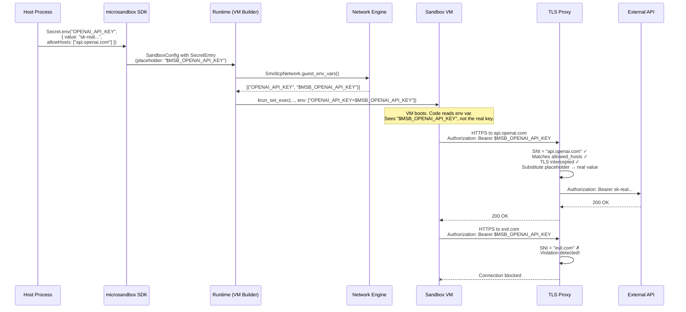
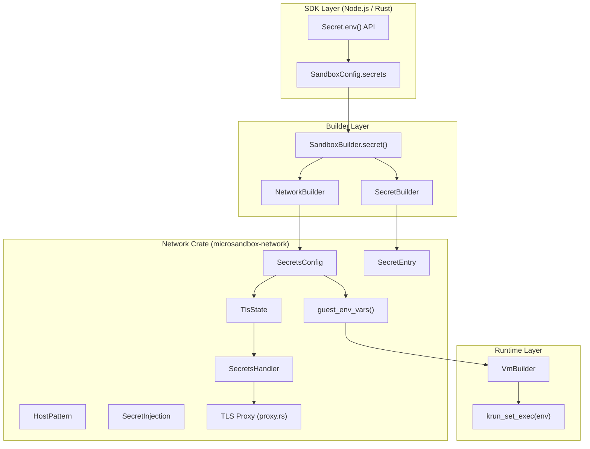

# Microsandbox Secrets Deep Dive

## Overview

Microsandbox implements a **placeholder-based secret injection** system where the real secret value **never enters the sandbox VM**. Instead, the sandbox receives a placeholder string (e.g., `$MSB_OPENAI_API_KEY`), and the real value is only substituted at the **network layer** — specifically in the TLS interception proxy — when the sandbox makes HTTPS requests to explicitly allowed hosts.

This is a fundamentally different model from Docker/Kubernetes secrets (which mount real values inside containers). It provides defense-in-depth against secret exfiltration: even if the sandbox is fully compromised, the attacker only obtains a useless placeholder string.

## Architecture

### High-Level Flow



### Component Map



## Detailed Walkthrough

### Phase 1: Secret Declaration (Host-Side)

Secrets are declared at sandbox creation time via the SDK. The user provides:

| Field | Required | Description |
|-------|----------|-------------|
| `env_var` | Yes | Environment variable name exposed in the sandbox |
| `value` | Yes | The real secret (stays on the host, never enters VM) |
| `allowHosts` | No | Exact hostnames allowed to receive this secret |
| `allowHostPatterns` | No | Wildcard patterns (e.g., `*.openai.com`) |
| `placeholder` | No | Custom placeholder (default: `$MSB_<ENV_VAR>`) |
| `requireTls` | No | Require TLS-intercepted connection (default: `true`) |
| `onViolation` | No | Action on leak attempt: `block`, `block-and-log`, `block-and-terminate` |

**TypeScript example:**

```typescript
import { Sandbox, Secret } from "microsandbox";

const sandbox = await Sandbox.create({
  name: "agent",
  image: "python",
  secrets: [
    Secret.env("OPENAI_API_KEY", {
      value: process.env.OPENAI_API_KEY!,
      allowHosts: ["api.openai.com"],
    }),
  ],
});
```

**Source:** `sdk/node-ts/lib/types.rs:168-191` (`SecretEntry` struct)

### Phase 2: Placeholder Generation (Build Phase)

When `SecretBuilder.build()` is called, the placeholder is either the user-provided value or auto-generated:

```rust
// crates/network/lib/builder.rs:319-324
let placeholder = self
    .placeholder
    .unwrap_or_else(|| format!("$MSB_{env_var}"));
```

For `OPENAI_API_KEY`, this produces `$MSB_OPENAI_API_KEY`.

The `SecretEntry` struct that gets created:

```rust
// crates/network/lib/secrets/config.rs:22-46
pub struct SecretEntry {
    pub env_var: String,            // "OPENAI_API_KEY"
    pub value: String,              // "sk-real-secret-value" (host-only)
    pub placeholder: String,        // "$MSB_OPENAI_API_KEY"
    pub allowed_hosts: Vec<HostPattern>,
    pub injection: SecretInjection, // where substitution is allowed
    pub require_tls_identity: bool, // must be TLS-intercepted
}
```

**Critical detail:** Adding a secret automatically enables TLS interception:

```rust
// crates/microsandbox/lib/sandbox/builder.rs:264-267
// Auto-enable TLS when secrets are configured.
if !self.config.network.tls.enabled {
    self.config.network.tls.enabled = true;
}
```

### Phase 3: Environment Variable Injection (VM Boot)

During VM preparation, the network engine generates environment variables for the guest. The **placeholder** (not the real value) becomes the env var value:

```rust
// crates/network/lib/network.rs:216-219
// Auto-expose secret placeholders as environment variables.
for secret in &self.config.secrets.secrets {
    vars.push((secret.env_var.clone(), secret.placeholder.clone()));
}
```

These env vars are collected and passed to the VM via `krun_set_exec()`:

```rust
// crates/runtime/lib/vm.rs:543-545
for (key, value) in network.guest_env_vars() {
    exec_env.push(format!("{key}={value}"));
}
```

Which ultimately reaches the libkrun FFI:

```rust
// microsandbox-core/lib/vm/ffi.rs:300-315
pub(crate) fn krun_set_exec(
    ctx_id: u32,
    c_exec_path: *const c_char,
    c_argv: *const *const c_char,
    c_envp: *const *const c_char,  // <-- placeholders go here
) -> i32;
```

**Result:** Inside the VM, `echo $OPENAI_API_KEY` outputs `$MSB_OPENAI_API_KEY`.

### Phase 4: Secret Substitution (Network Phase / TLS Proxy)

When the sandbox makes an outbound HTTPS connection, the TLS proxy intercepts it. The substitution pipeline:

#### 4a. Handler Creation Per Connection

For each new TLS connection, a `SecretsHandler` is created by filtering secrets against the connection's SNI (Server Name Indication):

```rust
// crates/network/lib/tls/proxy.rs:139-141
let secrets_handler = SecretsHandler::new(&tls_state.secrets, sni_name, true);
```

```rust
// crates/network/lib/secrets/handler.rs:53-85
pub fn new(config: &SecretsConfig, sni: &str, tls_intercepted: bool) -> Self {
    let mut eligible = Vec::new();
    let mut all_placeholders = Vec::new();

    for secret in &config.secrets {
        all_placeholders.push(secret.placeholder.clone());

        // Only secrets whose allowed_hosts match this SNI are eligible
        let host_allowed = secret.allowed_hosts.is_empty()
            || secret.allowed_hosts.iter().any(|p| p.matches(sni));

        if host_allowed {
            eligible.push(EligibleSecret { /* ... */ });
        }
    }

    let has_ineligible = eligible.len() < all_placeholders.len();
    // ...
}
```

#### 4b. Host Pattern Matching

Host patterns support three forms:

```rust
// crates/network/lib/secrets/config.rs:49-57
pub enum HostPattern {
    Exact(String),     // "api.openai.com"
    Wildcard(String),  // "*.openai.com"
    Any,               // matches everything (dangerous)
}
```

Matching uses ASCII case-insensitive comparison (per RFC 4343):

```rust
// crates/network/lib/secrets/config.rs:113-129
pub fn matches(&self, hostname: &str) -> bool {
    match self {
        HostPattern::Exact(h) => hostname.eq_ignore_ascii_case(h),
        HostPattern::Wildcard(pattern) => {
            if let Some(suffix) = pattern.strip_prefix("*.") {
                hostname.eq_ignore_ascii_case(suffix)
                    || (hostname.len() > suffix.len() + 1
                        && hostname[hostname.len() - suffix.len()..]
                            .eq_ignore_ascii_case(suffix))
            } else {
                hostname.eq_ignore_ascii_case(pattern)
            }
        }
        HostPattern::Any => true,
    }
}
```

#### 4c. Placeholder Substitution in Decrypted HTTP Traffic

The TLS proxy decrypts traffic (MITM), and the handler scans it for placeholders. Substitution is scoped to specific parts of the HTTP request:

```rust
// crates/network/lib/secrets/config.rs:60-77
pub struct SecretInjection {
    pub headers: bool,       // default: true
    pub basic_auth: bool,    // default: true
    pub query_params: bool,  // default: false
    pub body: bool,          // default: false
}
```

The `substitute()` method splits the HTTP message at `\r\n\r\n`:

```rust
// crates/network/lib/secrets/handler.rs:97-176
pub fn substitute<'a>(&self, data: &'a [u8]) -> Option<Cow<'a, [u8]>> {
    // 1. Violation check: any placeholder going to disallowed host?
    if self.has_ineligible {
        if self.has_violation(&text) {
            return None; // Block/log/terminate
        }
    }

    // 2. Split at header boundary
    let boundary = find_header_boundary(data);
    let (header_bytes, body_bytes) = ...;

    // 3. Per-secret substitution with scoping
    for secret in &self.eligible {
        if secret.require_tls_identity && !self.tls_intercepted {
            continue; // Skip on non-intercepted connections
        }
        // Headers: substitute based on injection scope
        // Body: substitute only if inject_body is true
    }
}
```

#### 4d. Violation Detection

If a placeholder is detected being sent to a host **not** in the secret's allowlist, a violation is triggered:

```rust
// crates/network/lib/secrets/config.rs:79-89
pub enum ViolationAction {
    Block,              // silently drop
    BlockAndLog,        // drop + warn (default)
    BlockAndTerminate,  // drop + kill the sandbox
}
```

The violation check is optimized — it only runs when there are ineligible secrets (`has_ineligible` is pre-computed):

```rust
// crates/network/lib/secrets/handler.rs:191-207
fn has_violation(&self, text: &str) -> bool {
    if self.eligible.len() == self.all_placeholders.len() {
        return false; // fast path: all secrets allowed for this host
    }
    for placeholder in &self.all_placeholders {
        if text.contains(placeholder.as_str())
            && !self.eligible.iter().any(|s| s.placeholder == *placeholder)
        {
            return true;
        }
    }
    false
}
```

### Phase 5: Response Path

Responses flow back through the TLS proxy **without** substitution — the proxy only intercepts the outgoing (guest → server) direction for secret injection. Responses pass through normally.

## Security Properties

### What the Sandbox Can See

| Item | Visible to Sandbox? |
|------|---------------------|
| Placeholder string (`$MSB_OPENAI_API_KEY`) | Yes (as env var) |
| Real secret value | **No** — never enters VM memory |
| Which hosts receive the secret | No — configured host-side |
| TLS proxy CA certificate | Yes — injected for MITM |

### Defenses Against Exfiltration

1. **Memory isolation**: Real secret lives only in host-side `SecretsHandler` memory, inside the TLS proxy thread. The VM has hardware-isolated memory (libkrun microVM).

2. **Host allowlist**: Even if the sandbox constructs a request with the placeholder, it can only be substituted for traffic going to approved hosts.

3. **Violation detection**: Sending a placeholder to a non-approved host triggers `Block`/`BlockAndLog`/`BlockAndTerminate`.

4. **TLS identity requirement**: By default, `require_tls_identity = true` means substitution only happens on TLS-intercepted connections. If the connection is bypassed (not MITM'd), the placeholder passes through unsubstituted.

5. **Scoped injection**: By default, substitution only occurs in HTTP headers and Authorization headers — not in request bodies or query parameters (unless explicitly enabled).

## File Map

| File | Role |
|------|------|
| `crates/network/lib/secrets/config.rs` | `SecretsConfig`, `SecretEntry`, `HostPattern`, `SecretInjection`, `ViolationAction` types |
| `crates/network/lib/secrets/handler.rs` | `SecretsHandler` — per-connection substitution engine |
| `crates/network/lib/secrets/mod.rs` | Module docstring |
| `crates/network/lib/builder.rs` | `SecretBuilder` — fluent API for building `SecretEntry`, placeholder auto-generation |
| `crates/network/lib/network.rs:216-219` | `guest_env_vars()` — injects placeholder as env var |
| `crates/network/lib/tls/proxy.rs:139-229` | TLS proxy — creates `SecretsHandler` per connection, calls `substitute()` |
| `crates/network/lib/tls/state.rs` | `TlsState` — holds `SecretsConfig` for the proxy |
| `crates/microsandbox/lib/sandbox/builder.rs:246-289` | `SandboxBuilder.secret()` / `.secret_env()` — high-level API |
| `crates/runtime/lib/vm.rs:543-545` | Passes `guest_env_vars()` into `krun_set_exec()` |
| `sdk/node-ts/lib/types.rs:168-191` | TypeScript `SecretEntry` type |
| `sdk/node-ts/lib/sandbox.rs:450-489` | N-API binding — converts JS secrets to Rust `SecretBuilder` |
| `sdk/node-ts/lib/helpers.rs:225-360` | `Secret` factory class for TypeScript |

## Lifecycle Summary

```
┌─────────────────────────────────────────────────────────────────┐
│  HOST PROCESS                                                    │
│                                                                  │
│  1. User declares: Secret.env("KEY", { value: "real-secret",    │
│                    allowHosts: ["api.example.com"] })            │
│                                                                  │
│  2. SecretBuilder generates placeholder: "$MSB_KEY"             │
│     Creates SecretEntry with value + placeholder + host rules    │
│                                                                  │
│  3. Auto-enables TLS interception                               │
│                                                                  │
├────────────────────────┬────────────────────────────────────────┤
│  NETWORK ENGINE        │  VM BOOT                               │
│                        │                                         │
│  4. guest_env_vars()   │  5. krun_set_exec(env: [              │
│     returns:           │       "KEY=$MSB_KEY",                  │
│     [("KEY",           │       ...                              │
│       "$MSB_KEY")]     │     ])                                 │
│                        │                                         │
├────────────────────────┼────────────────────────────────────────┤
│  TLS PROXY (per conn)  │  SANDBOX VM                            │
│                        │                                         │
│  6. SecretsHandler     │  7. Code reads os.environ["KEY"]       │
│     filters by SNI     │     → gets "$MSB_KEY"                  │
│                        │                                         │
│  8. substitute() swaps │  9. Makes HTTPS request with           │
│     "$MSB_KEY" →       │     placeholder in headers             │
│     "real-secret"      │                                         │
│     (only for allowed  │                                         │
│      hosts)            │                                         │
│                        │                                         │
│  VIOLATION: placeholder│                                         │
│  to wrong host →       │                                         │
│  BLOCK + optional      │                                         │
│  terminate             │                                         │
└────────────────────────┴────────────────────────────────────────┘
```

## Key Insights

1. **Zero-trust by default**: The sandbox is never trusted with the real secret. Even `echo $OPENAI_API_KEY` inside the VM shows only the placeholder.

2. **Network-layer substitution**: The substitution happens in the host-side TLS proxy, after decryption but before forwarding to the real server. The real value exists only in the proxy's memory.

3. **Automatic TLS enablement**: Declaring any secret auto-enables TLS interception. This is critical because without TLS MITM, the proxy cannot inspect or modify encrypted traffic.

4. **Scoped injection prevents over-substitution**: Headers-only by default means a placeholder in a JSON body won't accidentally leak the secret to a logging endpoint. Body injection must be explicitly opted in.

5. **Per-connection handler**: A new `SecretsHandler` is created for each TLS connection, pre-filtered by SNI. This means the handler for `evil.com` has zero eligible secrets — the real value is never even loaded into its memory.

6. **Violation is about the placeholder, not the value**: The system detects when a _placeholder_ is being sent to a disallowed host. Since the placeholder is known and unique, this detection is reliable even without knowing what the guest application is doing.

## Open Questions

1. How does the system handle HTTP/2 multiplexed streams where multiple requests share a TLS connection?
2. What happens when a secret placeholder appears across TCP segment boundaries (split across two `substitute()` calls)?
3. Is there any mechanism for secret rotation without restarting the sandbox?
4. How does the `BlockAndTerminate` violation action propagate the termination signal to the sandbox's supervisor process?
