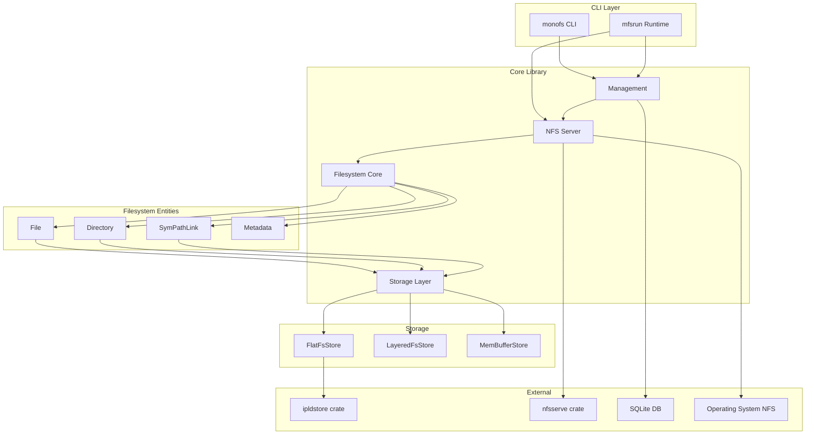
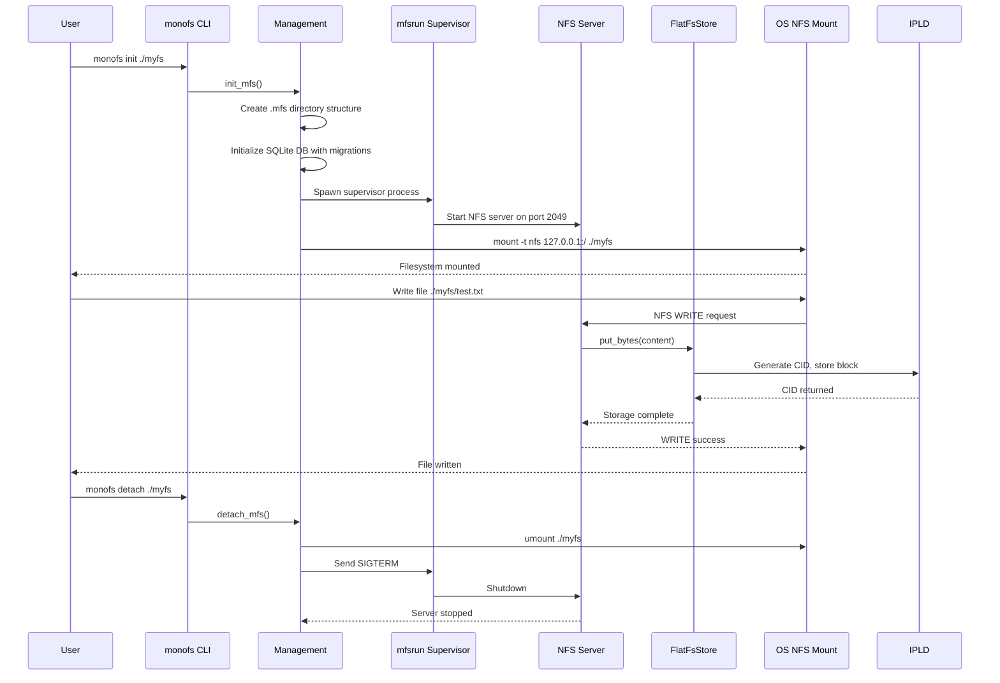

# monofs Exploration Report

## Overview

`monofs` is a **versioned, content-addressed distributed filesystem** written in Rust. It is designed for distributed applications and draws inspiration from the Web-Native File System (WNFS) public filesystem layer, but simplifies the architecture by excluding private/encrypted partitions.

Key characteristics:
- **Immutable filesystem** with clone-on-write semantics
- **Content-addressed storage** using IPLD (InterPlanetary Linked Data) with CID (Content Identifier) references
- **Versioned entities** where every change creates a new version, enabling historical audits and rollbacks
- **Automatic deduplication** by storing identical content only once
- **NFSv3 server interface** for POSIX-compatible access
- **Distributed sync capabilities** supporting Raft consensus and CRDT-based merging

The filesystem is currently in early development (version 0.2.1) and is part of the larger monocore/zerocore-ai ecosystem.

## Repository Information

| Property | Value |
|----------|-------|
| **Remote** | `git@github.com:zerocore-ai/monofs` |
| **Current Branch** | `main` |
| **Latest Commit** | `210aef7` - "feat: move project from microsandbox" |
| **License** | Apache-2.0 |
| **Crate Version** | 0.2.1 |

### Commit History
```
210aef7 feat: move project from microsandbox (microsandbox/microsandbox#175)
f405671 Initial commit
```

## Directory Structure

```
monofs/
├── bin/                          # Binary entry points
│   ├── monofs.rs                 # Main CLI tool (init, detach, etc.)
│   └── mfsrun.rs                 # Runtime binary (NFS server / supervisor)
├── lib/                          # Core library source
│   ├── lib.rs                    # Library root, module exports
│   ├── error.rs                  # Error types (FsError, FsResult)
│   ├── cli/                      # Command-line interface
│   │   ├── mod.rs
│   │   ├── styles.rs             # CLI styling helpers
│   │   └── args/
│   │       ├── mod.rs
│   │       ├── monofs.rs         # monofs CLI argument definitions
│   │       └── mfsrun.rs         # mfsrun CLI argument definitions
│   ├── config/                   # Configuration constants
│   │   ├── mod.rs
│   │   └── default.rs            # Default values (ports, paths, limits)
│   ├── filesystem/               # Core filesystem implementation
│   │   ├── mod.rs
│   │   ├── entity.rs             # Entity enum (File, Dir, SymCidLink, SymPathLink)
│   │   ├── file.rs               # File entity implementation
│   │   │   └── io.rs             # File I/O streams (FileInputStream, FileOutputStream)
│   │   ├── dir.rs                # Directory entity implementation
│   │   │   ├── find.rs           # Path finding utilities
│   │   │   ├── ops.rs            # Directory operations
│   │   │   └── segment.rs        # UTF-8 Unix path segment handling
│   │   ├── metadata.rs           # Entity metadata (timestamps, sync type, xattrs)
│   │   ├── kind.rs               # Entity type definitions
│   │   ├── cidlink.rs            # CID-based entity linking
│   │   │   ├── entity.rs
│   │   │   └── attributes.rs
│   │   ├── symcidlink.rs         # Symbolic CID links
│   │   ├── sympathlink.rs        # Symbolic path links
│   │   └── eq.rs                 # Equality utilities
│   ├── store/                    # Storage backends
│   │   ├── mod.rs
│   │   ├── flatfsstore.rs        # Flat filesystem store (content-addressed disk storage)
│   │   ├── layeredfsstore.rs     # Layered store abstraction
│   │   └── membufferstore.rs     # In-memory buffered store
│   ├── server/                   # NFS server implementation
│   │   ├── mod.rs
│   │   ├── server.rs             # MonofsServer (NFS TCP listener)
│   │   └── nfs.rs                # MonofsNFS (NFSv3 VFS implementation)
│   ├── management/               # Filesystem management utilities
│   │   ├── mod.rs
│   │   ├── db.rs                 # SQLite database connection/migrations
│   │   ├── mfs.rs                # Mount/unmount operations
│   │   ├── find.rs               # MFS root discovery
│   │   └── migrations/           # SQL migration files
│   │       ├── 20250129190837_create_filesystems.up.sql
│   │       ├── 20250129190837_create_filesystems.down.sql
│   │       ├── 20250129190843_create_tags.up.sql
│   │       └── 20250129190843_create_tags.down.sql
│   ├── runtime/                  # Runtime components
│   │   ├── mod.rs
│   │   └── monitor.rs            # NfsServerMonitor (process supervision)
│   └── utils/                    # Utility modules
│       ├── mod.rs
│       ├── path.rs               # Path handling utilities
│       ├── dir.rs                # Directory utilities
│       └── env.rs                # Environment variable helpers
├── examples/                     # Usage examples
│   ├── file.rs                   # File operations
│   ├── dir.rs                    # Directory operations
│   ├── nfs.rs                    # NFS server usage
│   ├── flatfs_store.rs           # FlatFsStore usage
│   └── flatfs_monofs.rs          # Integrated monofs usage
├── tests/                        # Integration tests
│   └── cli/
│       ├── mod.rs
│       └── init.rs               # CLI init command tests
├── Cargo.toml                    # Package manifest
├── Cargo.lock                    # Dependency lock file
├── README.md                     # Project documentation
├── EXPLAINER.md                  # Architecture documentation
├── CHANGELOG.md                  # Version history
├── LICENSE                       # Apache 2.0 license
└── .gitignore
```

## Architecture

### High-Level Component Diagram



### Data Flow Architecture



## Component Breakdown

### 1. Filesystem Entities (`lib/filesystem/`)

The filesystem is built around four core entity types, all implementing the `Storable<S>` trait for IPLD persistence.

#### Entity (`entity.rs`)
Enum representing all filesystem entities:
```rust
pub enum Entity<S>
where S: IpldStore,
{
    File(File<S>),
    Dir(Dir<S>),
    SymCidLink(SymCidLink<S>),
    SymPathLink(SymPathLink<S>),
}
```

Key methods:
- `is_file()`, `is_dir()`, `is_symcidlink()`, `is_sympathlink()` - Type checks
- `into_file()`, `into_dir()`, etc. - Type conversions
- `get_metadata()` - Access entity metadata
- `checkpoint()` - Store and reload entity, creating a new version

#### File (`file.rs`)
Immutable file entity with content-addressed storage:

**Structure:**
```rust
struct FileInner<S> {
    initial_load_cid: OnceLock<Cid>,      // CID when loaded from store
    previous: Option<Cid>,                 // Previous version CID
    metadata: Metadata<S>,                 // File metadata
    content: Option<Cid>,                  // Content block CID
    store: S,                              // Storage backend
}
```

**Key Operations:**
- `new(store)` - Create empty file
- `with_content(store, reader)` - Create file with content
- `get_input_stream()` - Async read access
- `get_output_stream()` - Async write access
- `truncate()` - Clear content
- `get_size()` - File size in bytes

**Immutability Pattern:** Files use `Arc<FileInner>` for clone-on-write semantics. Modifications create a new inner structure via `Arc::make_mut()`.

#### Directory (`dir.rs`)
Immutable directory entity managing entries:

**Structure:**
```rust
struct DirInner<S> {
    initial_load_cid: OnceLock<Cid>,
    previous: Option<Cid>,
    metadata: Metadata<S>,
    entries: HashMap<Utf8UnixPathSegment, Entry<S>>,
    store: S,
}

struct Entry<S> {
    deleted: bool,        // Tombstone marker
    link: EntityCidLink<S>,
}
```

**Key Operations:**
- `put_adapted_entry()` - Add/update entry with versioning
- `remove_entry()` - Mark entry as deleted (tombstone)
- `get_entries()` - Iterate non-deleted entries
- `get_all_entries()` - Iterate all entries including deleted
- `find(path)` - Resolve path to entity
- `rename(from, to)` - Rename/move entity
- `checkpoint()` - Persist directory state

**Versioning:** When updating an existing entry, the previous CID is preserved to maintain version history. Deleted entries are marked with tombstones rather than removed, enabling version reconstruction.

#### Metadata (`metadata.rs`)
Entity metadata with extended attributes:

**Fields:**
- `entity_type: EntityType` - File, Dir, SymCidLink, or SymPathLink
- `created_at: DateTime<Utc>` - Creation timestamp
- `modified_at: DateTime<Utc>` - Last modification timestamp
- `sync_type: SyncType` - Default, Raft, or MerkleCRDT
- `extended_attrs: Option<AttributesCidLink<S>>` - Extended attributes

**Extended Attributes:**
- Stored as IPLD in a separate content-addressed block
- Thread-safe via `Arc<RwLock<BTreeMap<String, Ipld>>>`
- Supports Unix attributes: mode, uid, gid, atime, mtime
- Custom attributes supported via `set_attribute()` / `get_attribute()`

#### Symbolic Links
Two types of symbolic links:
- **SymPathLink** - Traditional path-based symlink
- **SymCidLink** - CID-based link to specific content version

### 2. Storage Layer (`lib/store/`)

#### FlatFsStore (`flatfsstore.rs`)
Content-addressed filesystem store using IPLD:

**Directory Structure Options:**
```
# DirLevels::Zero - All blocks in root
store/
├── 0012345... (hex CID digest)
└── abcdef...

# DirLevels::One (default) - Single subdir level (like IPFS/Git)
store/
├── 00/
│   └── 0012345...
├── ab/
│   └── abcdef...
└── ff/
    └── ffeed...

# DirLevels::Two - Nested subdirs
store/
├── 00/
│   └── 01/
│       └── 0012345...
```

**Features:**
- **Reference Counting:** Optional refcount tracking for garbage collection
- **Chunking:** Configurable via `Chunker` trait (FastCDC or FixedSize)
- **Layout:** Configurable via `Layout` trait (FlatLayout default)
- **Garbage Collection:** Recursive GC when refcount reaches 0

**Block Format (with refcount enabled):**
```
[8 bytes: refcount (big-endian u64)]
[variable: block data]
```

**IPLD Integration:**
```rust
#[async_trait]
impl<C, L> IpldStore for FlatFsStoreImpl<C, L> {
    async fn put_node<T>(&self, data: &T) -> StoreResult<Cid>
    where T: Serialize + IpldReferences + Sync

    async fn put_bytes(&self, reader: impl AsyncRead + Send + Sync) -> StoreResult<Cid>

    async fn get_node<T>(&self, cid: &Cid) -> StoreResult<T>
    where T: DeserializeOwned

    async fn get_bytes(&self, cid: &Cid) -> StoreResult<Pin<Box<dyn AsyncRead + Send>>>

    async fn garbage_collect(&self, cid: &Cid) -> StoreResult<HashSet<Cid>>
}
```

### 3. NFS Server (`lib/server/`)

#### MonofsServer (`server.rs`)
TCP-based NFS server wrapper:

```rust
pub struct MonofsServer {
    store_dir: PathBuf,
    host: String,
    port: u32,
}
```

**Startup Flow:**
1. Creates `FlatFsStore` from `store_dir`
2. Creates `MonofsNFS` filesystem with the store
3. Binds `NFSTcpListener` on host:port
4. Serves NFS requests indefinitely

#### MonofsNFS (`nfs.rs`)
NFSv3 VFS implementation:

**Structure:**
```rust
pub struct MonofsNFS<S>
where S: IpldStore + Send + Sync + 'static,
{
    root: Arc<Mutex<Dir<S>>>,
    next_fileid: AtomicU64,
    filenames: Arc<Mutex<SymbolTable>>,            // Interned filenames
    fileid_to_path_map: Arc<Mutex<HashMap<fileid3, Vec<Symbol>>>>,
    path_to_fileid_map: Arc<Mutex<HashMap<Vec<Symbol>, fileid3>>>,
}
```

**NFS Operations Implemented:**
| Operation | Description |
|-----------|-------------|
| `lookup` | Resolve filename in directory |
| `getattr` | Get file attributes |
| `setattr` | Set file attributes |
| `read` | Read file content |
| `write` | Write file content |
| `create` | Create new file |
| `create_exclusive` | Create file exclusively |
| `mkdir` | Create directory |
| `remove` | Remove file |
| `rename` | Rename/move file |
| `readdir` | List directory contents |
| `symlink` | Create symbolic link |
| `readlink` | Read symlink target |

**Write Semantics:**
- **No sparse files:** Writes beyond current size return `NFS3ERR_INVAL`
- **Copy-on-write:** Each write checkpoints the file, loads original, and creates new version
- **Versioning:** Original file content preserved via checkpoint before modification

**File ID Mapping:**
- Root directory = fileid 0
- Bidirectional mapping between fileids and symbolic paths
- Symbol table for efficient filename storage

### 4. Management Layer (`lib/management/`)

#### Database (`db.rs`)
SQLite database for filesystem metadata:

**Tables:**
- `filesystems` - Tracks mounted filesystems
  - `name`, `mount_dir`, `supervisor_pid`, `nfsserver_pid`
- `tags` - Version tags

**Migrations:** Located in `lib/management/migrations/`

#### MFS Operations (`mfs.rs`)
Filesystem lifecycle management:

**Key Functions:**
- `init_mfs(mount_dir)` - Initialize and mount new filesystem
- `detach_mfs(mount_dir, force)` - Unmount and stop filesystem

**Initialization Steps:**
1. Create mount directory
2. Create `.mfs` adjacent data directory
3. Find available port (default 2049)
4. Create subdirectories: `log/`, `blocks/`
5. Initialize SQLite database with migrations
6. Spawn `mfsrun supervisor` process
7. Wait for port availability
8. Mount NFS share via OS `mount` command
9. Create symlink `.mfs` in mount directory

**Directory Layout After Init:**
```
myfs/                     # Mount point
├── .mfs -> myfs.mfs/     # Symlink to data dir
└── ... user files ...

myfs.mfs/                 # Data directory
├── log/                  # NFS server logs
├── blocks/               # Content-addressed storage
└── fs.db                 # SQLite database
```

### 5. Runtime (`lib/runtime/`)

#### NfsServerMonitor (`monitor.rs`)
Process supervision for NFS server:

**Responsibilities:**
- Capture child process stdout/stderr to rotating logs
- Register filesystem in SQLite database on start
- Clean up database entry on stop
- Manage log file lifecycle

**Log Naming:**
```
mfsrun-{name}-{timestamp}-{child_pid}.log
```

### 6. CLI (`lib/cli/`, `bin/`)

#### monofs CLI (`bin/monofs.rs`)
Main command-line interface:

**Subcommands:**
- `init [mount_dir]` - Initialize new filesystem
- `detach [mount_dir] [-f]` - Unmount filesystem
- `tmp` - Create temporary filesystem (TODO)
- `clone <uri>` - Clone existing filesystem (TODO)
- `sync <uri> -t <type>` - Sync with remote (TODO)
- `rev [-p path]` - Show revisions (TODO)
- `tag <revision> <tag>` - Tag revision (TODO)
- `checkout <revision>` - Checkout revision (TODO)
- `diff <rev1> <rev2>` - Show differences (TODO)
- `version` - Show version info

#### mfsrun Runtime (`bin/mfsrun.rs`)
Polymorphic binary with two modes:

**NFS Server Mode:**
```bash
mfsrun nfsserver --host=127.0.0.1 --port=2049 --store-dir=/path/to/store
```

**Supervisor Mode:**
```bash
mfsrun supervisor \
  --log-dir=/path/to/logs \
  --child-name=my_fs \
  --host=127.0.0.1 \
  --port=2049 \
  --store-dir=/path/to/store \
  --fs-db-path=/path/to/fs.db \
  --mount-dir=/path/to/mount
```

## Entry Points

### Binary: `monofs`
File: `bin/monofs.rs`

```rust
#[tokio::main]
async fn main() -> anyhow::Result<()> {
    tracing_subscriber::fmt::init();
    let args = MonofsArgs::parse();
    match args.subcommand {
        Some(MonofsSubcommand::Init { mount_dir }) => {
            management::init_mfs(mount_dir).await?;
        }
        Some(MonofsSubcommand::Detach { mount_dir, force }) => {
            management::detach_mfs(mount_dir, force).await?;
        }
        // ... other subcommands
    }
}
```

### Binary: `mfsrun`
File: `bin/mfsrun.rs`

```rust
#[tokio::main]
async fn main() -> Result<()> {
    tracing_subscriber::fmt().with_ansi(false).init();
    let args = MfsRuntimeArgs::parse();
    match args.subcommand {
        MfsRuntimeSubcommand::Nfsserver { host, port, store_dir } => {
            let server = MonofsServer::new(store_dir, host, port);
            server.start().await?;
        }
        MfsRuntimeSubcommand::Supervisor { ... } => {
            let child_exe = env::current_exe()?;
            let process_monitor = NfsServerMonitor::new(...).await?;
            let mut supervisor = Supervisor::new(child_exe, child_args, child_envs, log_dir, process_monitor);
            supervisor.start().await?;
        }
    }
}
```

### Library: `monofs`
File: `lib/lib.rs`

Exports all public modules:
```rust
pub mod cli;
pub mod config;
pub mod filesystem;
pub mod management;
pub mod runtime;
pub mod server;
pub mod store;
pub mod utils;

pub use error::*;
```

## Data Flow

### File Creation Flow
```
1. User writes to NFS mount
2. NFS server receives WRITE RPC
3. Server resolves fileid to path
4. Directory.find_mut() locates File entity
5. File.checkpoint() creates versioned copy
6. Original content loaded via checkpoint CID
7. New content written to output stream
8. Remaining content appended (if overwrite in middle)
9. Content bytes stored via store.put_bytes()
10. New CID generated for content block
11. File entity updated with new content CID
12. File attributes updated (mtime, size)
13. NFS response sent to client
```

### Directory Traversal Flow
```
1. NFS lookup request with (dirid, filename)
2. Server converts dirid to path via fileid_to_path()
3. Root directory locked via Arc<Mutex<Dir>>
4. For root path: use root Dir directly
5. For nested path: Dir.find(path) traverses entries
6. Each path segment resolved via HashMap lookup
7. Entity type validated (must be Dir for traversal)
8. Final entity returned
9. Path registered in path_to_fileid_map if new
10. Fileid returned to NFS client
```

### Versioning Flow
```
Initial State:
  File_v1 (CID: abc123)
    previous: None
    content: CID_data1

After Write:
1. checkpoint() called
2. File_v1 stored, returns CID: abc123
3. File reloaded from abc123
4. initial_load_cid = abc123

5. New content written
6. checkpoint() called again
7. File_v2 stored with:
   - previous: Some(abc123)
   - content: CID_data2
8. Returns CID: def456
9. initial_load_cid = def456

Version Chain:
  File_v2 (def456) -> File_v1 (abc123)
```

## External Dependencies

### Core Dependencies

| Crate | Version | Purpose |
|-------|---------|---------|
| `ipldstore` | git | IPLD storage abstraction, CID handling |
| `serde` | 1.0 | Serialization framework |
| `chrono` | 0.4 | Timestamp handling |
| `tokio` | 1.42 | Async runtime |
| `thiserror` | 2.0 | Error type derivation |
| `anyhow` | 1.0 | Flexible error handling |
| `clap` | 4.5 | CLI argument parsing |
| `sqlx` | 0.8 | SQLite database access |
| `nfsserve` | 0.10 | NFSv3 server framework |
| `serde_ipld_dagcbor` | 0.6 | IPLD CBOR codec |
| `bytes` | 1.9 | Byte buffer handling |
| `futures` | 0.3 | Async utilities |
| `tracing` | 0.1 | Logging/instrumentation |
| `getset` | 0.1 | Getter derivation |
| `async-trait` | 0.1 | Async trait support |
| `intaglio` | 1.10 | Symbol interning |
| `nix` | 0.29 | Unix system calls |
| `typed-path` | 0.10 | Type-safe paths |
| `microsandbox-utils` | git | Utilities from microsandbox |

### Key External Integrations

**ipldstore (GitHub: microsandbox/ipldstore):**
- Provides `IpldStore` trait for content-addressed storage
- CID generation and parsing
- IPLD node serialization/deserialization
- Reference tracking for DAG structures

**nfsserve:**
- NFSv3 protocol implementation
- VFS trait for filesystem operations
- TCP transport handling
- XDR encoding/decoding

**sqlx:**
- Async SQLite driver
- Migration framework
- Connection pooling
- Type-safe queries

## Configuration

### Default Constants (`lib/config/default.rs`)

```rust
pub const DEFAULT_SYMLINK_DEPTH: u32 = 10;      // Max symlink follow depth
pub const DEFAULT_HOST: &str = "127.0.0.1";     // Default bind address
pub const DEFAULT_NFS_PORT: u32 = 2049;         // Default NFS port
```

### Environment Variables

| Variable | Purpose |
|----------|---------|
| `MFSRUN_EXE` | Override default mfsrun binary path |

### Directory Structure Constants (`lib/utils/path.rs`)

```rust
pub const MFS_DIR_SUFFIX: &str = ".mfs";        // Data directory suffix
pub const MFS_LINK_FILENAME: &str = ".mfs";     // Symlink name in mount
pub const BLOCKS_SUBDIR: &str = "blocks";       // Content storage
pub const LOG_SUBDIR: &str = "log";             // Log files
pub const FS_DB_FILENAME: &str = "fs.db";       // SQLite database
```

### NFS Mount Options

When mounting via `init_mfs()`:
```
-t nfs -o nolocks,vers=3,tcp,port=2049,mountport=2049,soft
```

- `nolocks` - Disable NFS file locking
- `vers=3` - Use NFSv3 protocol
- `tcp` - TCP transport
- `port` / `mountport` - Same port for NFS and mount protocol
- `soft` - Return errors on timeout rather than hang

## Testing

### Test Structure

Tests are organized by module, with `#[cfg(test)]` modules at the end of source files.

**Test Files:**
- `lib/filesystem/file.rs` - File entity tests
- `lib/filesystem/dir.rs` - Directory entity tests
- `lib/filesystem/metadata.rs` - Metadata tests
- `lib/store/flatfsstore.rs` - Storage backend tests
- `lib/server/nfs.rs` - NFS server integration tests
- `lib/management/db.rs` - Database tests
- `tests/cli/init.rs` - CLI integration tests

### Test Categories

**Unit Tests:**
- Entity creation and manipulation
- Metadata attribute handling
- Serialization/deserialization round-trips
- Store operations (put/get/gc)

**Integration Tests:**
- NFS operation sequences
- Filesystem initialization
- Mount/unmount workflows
- Database migrations

### Example Test Coverage

From `lib/server/nfs.rs`:
```rust
test_nfs_create_file              // File creation
test_nfs_create_exclusive         // Exclusive create
test_nfs_lookup                  // Path resolution
test_nfs_setattr                 // Attribute modification
test_nfs_read_write              // File I/O with offset handling
test_nfs_mkdir                   // Directory creation
test_nfs_symlink                 // Symlink creation
test_nfs_readlink                // Symlink resolution
test_nfs_readdir                 // Directory listing
test_nfs_readdir_complex_hierarchy  // Nested directories
test_nfs_remove                  // File deletion
test_nfs_rename                  // File/directory renaming
```

From `lib/store/flatfsstore.rs`:
```rust
test_flatfsstore_raw_block        // Raw block storage
test_flatfsstore_bytes            // Chunked byte storage
test_flatfsstore_node             // IPLD node storage
test_flatfsstore_directory_structure  // Dir level organization
test_flatfsstore_garbage_collect  // Reference counting GC
test_flatfsstore_complex_garbage_collect  // Multi-level GC
test_flatfsstore_disabled_refcount  // Non-refcount mode
```

## Key Insights

### 1. Clone-on-Write Architecture

All entities use `Arc<Inner>` for shared ownership with copy-on-write semantics:

```rust
#[derive(Clone)]
pub struct File<S> {
    inner: Arc<FileInner<S>>,
}

pub fn set_content(&mut self, content: Option<Cid>) {
    let inner = Arc::make_mut(&mut self.inner);  // Clone if shared
    inner.content = content;
    inner.metadata.set_modified_at(Utc::now());
}
```

This enables:
- Efficient sharing of unmodified data
- Automatic versioning on write
- Thread-safe concurrent reads

### 2. IPLD-Based Content Addressing

Every entity and content block is addressed by its cryptographic hash:

```
File Entity (CBOR serialized)
├── type: "monofs.file"
├── metadata: { ... }
├── content: CID(bafy...)  -> Content block
└── previous: CID(bafz...) -> Previous version
```

Benefits:
- **Deduplication:** Identical content produces identical CIDs
- **Integrity:** Content hash verifies data wasn't corrupted
- **Versioning:** Previous CIDs chain versions together
- **Distribution:** CIDs can be fetched from any source

### 3. Tombstone-Based Deletion

Deleted entries are marked, not removed:

```rust
struct Entry<S> {
    deleted: bool,        // true = tombstone
    link: EntityCidLink<S>,
}
```

Enables:
- Version reconstruction (deleted files visible in old versions)
- Conflict resolution in distributed sync
- Audit trails

### 4. Reference-Counted Garbage Collection

Blocks track reference counts for automatic cleanup:

```
Block Format:
[8 bytes: refcount]
[variable: data]

When storing node:
1. Serialize to CBOR
2. Generate CID
3. Write block with refcount=0
4. Increment refcount for all referenced CIDs

When garbage collecting:
1. Decrement refcount
2. If refcount == 0:
   a. Delete block
   b. Recursively GC referenced CIDs
```

### 5. NFSv3 Compatibility Layer

The NFS server provides POSIX-compatible access to content-addressed storage:

- File IDs mapped to symbolic paths
- Attributes stored as extended attributes on entities
- Writes trigger copy-on-write versioning
- No sparse file support (limitation documented)

### 6. Multi-Mode Synchronization

Entities support different sync strategies:

```rust
pub enum SyncType {
    Default,    // Use configured default
    Raft,       // Strong consistency via Raft consensus
    MerkleCRDT, // Eventual consistency via CRDT merging
}
```

Architecture designed for:
- Single-node local filesystem (current)
- Multi-node Raft replication (future)
- Local-first CRDT sync (future)

## Open Questions

### 1. Cross-Partition Transactions
The EXPLAINER.md mentions "distributed semantics and atomicity" but notes that cross-partition transactions are not fully solved. How are multi-entity atomic operations handled?

### 2. Multi-Raft Partitioning Strategy
The architecture mentions "multi-raft" for scalability but implementation details are TBD:
- What triggers partition splits?
- How is load balanced across partitions?
- How are cross-partition queries handled?

### 3. Conflict Resolution
For CRDT-based sync:
- What specific CRDT types are used for different operations?
- How are write-write conflicts resolved?
- Is there a merge policy configuration?

### 4. Access Control
Currently no authentication/authorization visible:
- How is access control planned?
- Will it integrate with the extended attributes system?
- Support for NFS-level permissions vs filesystem-level?

### 5. Performance Characteristics
- Chunk size defaults and tuning parameters
- Cache strategy for frequently accessed blocks
- Read amplification from content-addressed layout

### 6. Distributed Sync Implementation
The CLI has stub commands for `sync`, `clone`, `rev`, `tag`, `checkout`, `diff` - but these are marked TODO. What is the planned implementation?

### 7. Block Size Limits
Default max node block size is used, but:
- What happens with very large files?
- Is there a maximum filesystem size?
- How does chunking affect large file performance?

### 8. Error Recovery
- Database corruption handling
- Block store consistency checks
- Recovery from incomplete writes

## Conclusion

`monofs` is a sophisticated distributed filesystem implementation that combines:

1. **Content-addressed storage** via IPLD for integrity and deduplication
2. **Immutable versioned entities** for historical tracking
3. **NFSv3 interface** for POSIX compatibility
4. **Flexible sync strategies** (Raft, CRDT) for distributed operation
5. **Reference-counted garbage collection** for storage efficiency

The architecture is well-designed for its stated goals of supporting distributed, verifiable file storage with versioning. The main areas for future development appear to be:
- Implementing the planned sync/clone/versioning CLI commands
- Multi-raft partitioning for scalability
- Access control and authentication
- Production hardening and performance optimization

For a new engineer, understanding the IPLD storage model, the clone-on-write entity pattern, and the NFS VFS mapping are the key concepts to master first.
