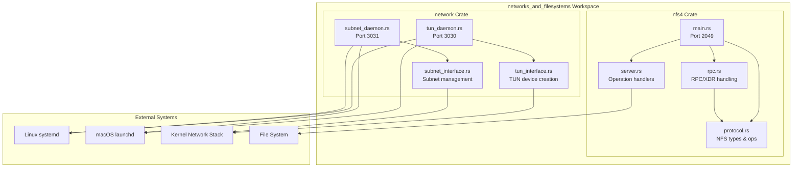
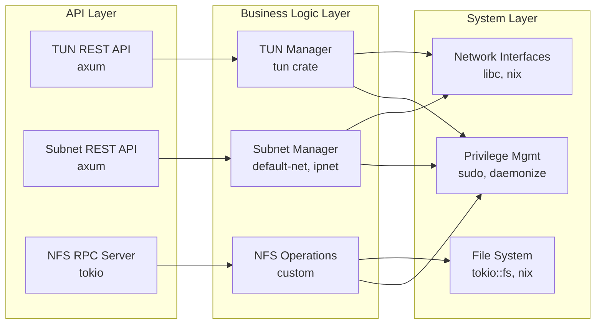
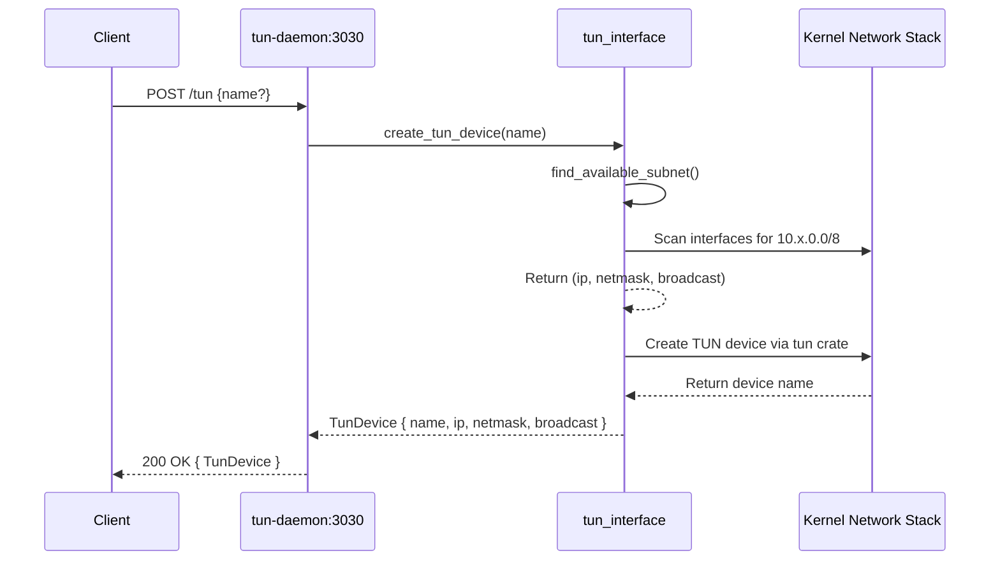
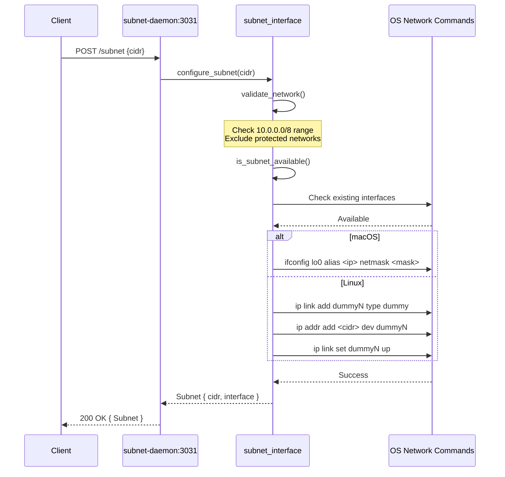
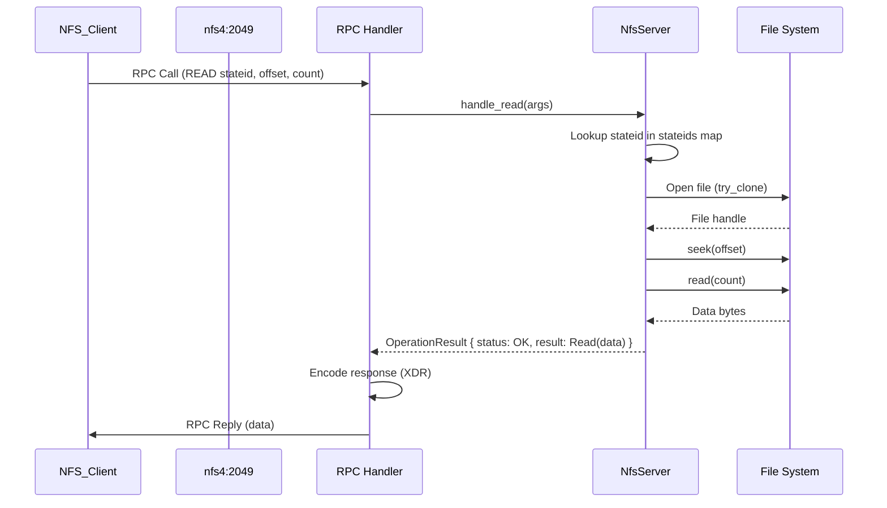

# Project Exploration: networks_and_filesystems

## Overview

The `networks_and_filesystems` project is a Rust workspace containing two main components: a network interface management system and an NFSv4 server implementation. The project provides system daemons for managing TUN (network tunnel) devices and subnet allocations via REST APIs, alongside a complete NFSv4 server for network file sharing.

The network component consists of two daemons - a TUN daemon (port 3030) for creating and managing virtual network tunnel devices, and a Subnet daemon (port 3031) for allocating and managing IP subnets. Both daemons support cross-platform operation on Linux and macOS, with proper system integration via systemd on Linux and launchd on macOS.

The NFS4 component implements an NFSv4 server using the ONC-RPC protocol with XDR encoding. It provides file system operations including access control, file handles, attribute management, and read/write operations. The server is designed to run as a privileged service (typically on port 2049) and exports a configurable directory for network clients.

## Repository

- **Location:** `/home/darkvoid/Boxxed/@formulas/src.rust/src.Containers/src.Microsandbox/networks_and_filesystems`
- **Remote:** N/A - not a git repository
- **Primary Language:** Rust (100%)
- **License:** Not specified

## Directory Structure

```
networks_and_filesystems/
├── Cargo.toml                    # Workspace root configuration
├── Cargo.lock                    # Dependency lock file
├── Makefile                      # Build and installation automation
├── README.md                     # Project documentation
├── .gitignore                    # Git ignore patterns
│
├── network/                      # Network interface management crate
│   ├── Cargo.toml                # Package configuration
│   ├── README.md                 # TUN daemon documentation
│   ├── src/
│   │   ├── lib.rs                # Module exports
│   │   ├── tun_interface.rs      # TUN device creation logic
│   │   └── subnet_interface.rs   # Subnet allocation and management
│   ├── bin/
│   │   ├── tun_daemon.rs         # TUN REST API daemon entry point
│   │   ├── subnet_daemon.rs      # Subnet REST API daemon entry point
│   │   ├── tun.rs                # TUN CLI utility (alternate)
│   │   ├── tun_old.rs            # Legacy TUN implementation
│   │   └── subnet.rs             # Subnet CLI utility
│   ├── tun_daemon.service        # Linux systemd unit (TUN)
│   ├── subnet_daemon.service     # Linux systemd unit (Subnet)
│   ├── com.tun.daemon.plist      # macOS launchd agent (TUN)
│   └── com.subnet.daemon.plist   # macOS launchd agent (Subnet)
│
└── nfs4/                         # NFSv4 server crate
    ├── Cargo.toml                # Package configuration
    └── src/
        ├── lib.rs                # Module exports and re-exports
        ├── main.rs               # NFS server entry point
        ├── protocol.rs           # NFSv4 protocol definitions (types, ops, status)
        ├── rpc.rs                # ONC-RPC message handling (XDR encoding)
        └── server.rs             # NFS server implementation (operation handlers)
```

## Architecture

### High-Level Diagram



### Component Layers



## Component Breakdown

### network Crate

#### tun_interface.rs
- **Location:** `network/src/tun_interface.rs`
- **Purpose:** Creates and manages TUN (network tunnel) devices
- **Dependencies:** `tun` crate, `default_net`, `anyhow`
- **Dependents:** `tun_daemon.rs` binary
- **Key Functions:**
  - `find_available_subnet()` - Scans 10.0.0.0/8 range for available subnets
  - `create_tun_device()` - Creates TUN device with automatic IP assignment

#### subnet_interface.rs
- **Location:** `network/src/subnet_interface.rs`
- **Purpose:** Manages subnet allocation on loopback/dummy interfaces
- **Dependencies:** `ipnet`, `default_net`, `lazy_static`
- **Dependents:** `subnet_daemon.rs` binary
- **Key Functions:**
  - `validate_network()` - Validates against allowed/protected networks
  - `detect_existing_subnets()` - Platform-specific subnet detection
  - `configure_subnet()` - Creates subnet on lo0 (macOS) or dummy interface (Linux)
  - `remove_subnet()` - Removes subnet configuration

#### tun_daemon.rs
- **Location:** `network/bin/tun_daemon.rs`
- **Purpose:** REST API server for TUN device management
- **Dependencies:** `axum`, `tokio`, `daemonize`, `tracing`
- **API Endpoints:**
  - `POST /tun` - Create TUN device
  - `GET /tun` - List TUN devices
- **Server:** Runs on `127.0.0.1:3030`

#### subnet_daemon.rs
- **Location:** `network/bin/subnet_daemon.rs`
- **Purpose:** REST API server for subnet management
- **Dependencies:** `axum`, `tokio`, `daemonize`, `tracing`
- **API Endpoints:**
  - `POST /subnet` - Create subnet
  - `GET /subnet` - List subnets
  - `DELETE /subnet/:cidr` - Remove subnet
- **Server:** Runs on `127.0.0.1:3031`
- **Special:** Implements graceful shutdown with subnet cleanup on SIGTERM

### nfs4 Crate

#### protocol.rs
- **Location:** `nfs4/src/protocol.rs`
- **Purpose:** NFSv4 protocol type definitions
- **Key Types:**
  - `NfsFileHandle`, `NfsFileAttributes`, `NfsTime`
  - `NfsOperation` enum (Access, Close, Commit, Create, GetAttr, GetFh, Lookup, Open, Read, Write)
  - `CompoundRequest`/`CompoundResponse` for RPC operations
  - `NfsStatus` error codes
  - Constants: `ACCESS4_*` rights, `NF4*` file types

#### rpc.rs
- **Location:** `nfs4/src/rpc.rs`
- **Purpose:** ONC-RPC message framing and XDR encoding
- **Key Types:**
  - `RpcMsg`, `RpcMsgBody` (Call/Reply)
  - `CallBody`, `ReplyBody`, `AcceptedReply`, `RejectedReply`
  - `OpaqueAuth`, `AuthSys` for authentication
- **Key Functions:**
  - `read_rpc_message()` - Parse RPC messages from buffer
  - `write_rpc_message()` - Encode RPC messages

#### server.rs
- **Location:** `nfs4/src/server.rs`
- **Purpose:** NFS operation handlers
- **Key Type:** `NfsServer` with state management
- **State Management:**
  - File handle to path mapping (`HashMap<Vec<u8>, PathBuf>`)
  - State ID to file state tracking (`HashMap<[u8; 16], FileState>`)
- **Operations Implemented:**
  - `handle_access()` - Check file permissions
  - `handle_close()` - Close file state
  - `handle_commit()` - Sync file to disk
  - `handle_create()` - Create file/directory
  - `handle_getattr()` - Get file attributes
  - `handle_getfh()` - Get file handle
  - `handle_lookup()` - Lookup path component
  - `handle_open()` - Open file with state
  - `handle_read()` - Read file data
  - `handle_write()` - Write file data

## Entry Points

### tun_daemon
- **File:** `network/bin/tun_daemon.rs`
- **Description:** System daemon for TUN device management via REST API
- **Flow:**
  1. Initialize tracing/logging with separate stdout (INFO/DEBUG/TRACE) and stderr (ERROR/WARN) layers
  2. Daemonize process using `daemonize` crate (creates PID file, redirects stdout/stderr to log files)
  3. Create tokio runtime
  4. Initialize device store (Arc<Mutex<HashMap>>)
  5. Build axum router with `/tun` endpoints
  6. Bind to `127.0.0.1:3030`
  7. Serve requests indefinitely

### subnet_daemon
- **File:** `network/bin/subnet_daemon.rs`
- **Description:** System daemon for subnet management via REST API
- **Flow:**
  1. Initialize tracing/logging
  2. Daemonize process
  3. Create tokio runtime
  4. Detect and register existing subnets on startup
  5. Initialize subnet store
  6. Build axum router with `/subnet` endpoints
  7. Spawn SIGTERM handler for graceful shutdown
  8. Bind to `127.0.0.1:3031`
  9. Serve requests with graceful shutdown support
  10. On shutdown: remove all managed subnets

### nfs4_server
- **File:** `nfs4/src/main.rs`
- **Description:** NFSv4 server accepting client connections
- **Flow:**
  1. Check for root privileges (required for port 2049)
  2. Create export directory (`/tmp/nfs_root` by default)
  3. Initialize `NfsServer` with export path
  4. Bind to `127.0.0.1:2049`
  5. Accept TCP connections in loop
  6. Spawn per-client handler:
     - Read RPC messages from socket
     - Decode XDR-encoded requests
     - Handle compound operations via `NfsServer::handle_compound()`
     - Encode and send response

## Data Flow

### TUN Device Creation Flow



### Subnet Allocation Flow



### NFS Read Operation Flow



## External Dependencies

### Workspace Dependencies

| Dependency | Version | Purpose |
|------------|---------|---------|
| anyhow | 1.0 | Error handling and Result type |
| tokio | 1.0 | Async runtime |
| libc | 0.2 | Low-level C bindings |
| nix | 0.29.0 | Unix system APIs |
| sudo | 0.6 | Privilege checking |

### network Crate Dependencies

| Dependency | Version | Purpose |
|------------|---------|---------|
| axum | 0.7 | Web framework for REST APIs |
| daemonize | 0.5 | Unix daemon process management |
| default-net | 0.22 | Network interface enumeration |
| futures | 0.3.31 | Async utilities |
| ipnet | 2.10 | IP network parsing and validation |
| lazy_static | 1.4 | Static initialization |
| rand | 0.8 | Random number generation |
| serde | 1.0 | Serialization framework |
| tracing | 0.1 | Instrumentation and logging |
| tracing-subscriber | 0.3 | Tracing subscriber implementation |
| tun | 0.7.6 | TUN/TAP device management |

### nfs4 Crate Dependencies

| Dependency | Version | Purpose |
|------------|---------|---------|
| bytes | 1.5 | Byte buffer management |
| serde-xdr | 0.6 | XDR encoding/decoding for RPC |
| thiserror | 1.0 | Error type derivation |
| log | 0.4 | Logging facade |
| env_logger | 0.10 | Logger implementation |
| async-trait | 0.1 | Async trait support |
| tempfile | 3.9 | Temporary file creation (dev) |
| tokio-test | 0.4 | Tokio testing utilities (dev) |

## Configuration

### Build Configuration

The project uses a Cargo workspace with two members:
- `network` - Network interface management
- `nfs4` - NFSv4 server

### Runtime Configuration

#### TUN Daemon
- **Port:** `3030` (hardcoded)
- **PID File:** `/var/run/tun_daemon.pid`
- **Log Files:** `/var/log/tun_daemon.log`, `/var/log/tun_daemon.err`
- **Working Directory:** `/tmp`
- **User:** `root`
- **Group:** `wheel` (macOS) or `root` (Linux)

#### Subnet Daemon
- **Port:** `3031` (hardcoded)
- **PID File:** `/var/run/subnet_daemon.pid`
- **Log Files:** `/var/log/subnet_daemon.log`, `/var/log/subnet_daemon.err`
- **Working Directory:** `/tmp`
- **User:** `root`
- **Group:** `wheel` (macOS) or `root` (Linux)
- **Allowed Network Range:** `10.0.0.0/8`
- **Protected Networks:** `127.0.0.0/8`, `169.254.0.0/16`

#### NFS4 Server
- **Port:** `2049` (hardcoded)
- **Export Path:** `/tmp/nfs_root` (hardcoded)
- **Bind Address:** `127.0.0.1` (localhost only)

### System Service Configuration

#### Linux (systemd)
Both daemons use systemd units with security restrictions:
- `CapabilityBoundingSet=CAP_NET_ADMIN` - Network administration only
- `NoNewPrivileges=yes` - Prevent privilege escalation
- `ProtectSystem=strict` - Read-only system directories
- `ProtectHome=yes` - No home directory access
- `RestrictAddressFamilies=AF_INET AF_INET6 AF_UNIX` - Limited network protocols
- `RestrictNamespaces=yes` - No namespace manipulation

#### macOS (launchd)
Both daemons use launchd agents with:
- `RunAtLoad` - Start at boot
- `KeepAlive` with `SuccessfulExit=false` - Restart on failure
- `ThrottleInterval=5` - Rate limiting
- `UserName=root`, `GroupName=wheel` - Root privileges

## Testing

### Test Strategy
- **nfs4 Crate:** Uses `tokio-test` for async testing and `tempfile` for isolated file system operations
- **network Crate:** No dedicated test files found; relies on integration testing via API endpoints

### Running Tests
```bash
# Run all tests
cargo test

# Run nfs4 tests only
cargo test -p nfs4

# Run network tests only
cargo test -p network
```

### Test Coverage Areas
- RPC message encoding/decoding (nfs4)
- NFS operation handlers (nfs4)
- Subnet validation (network)

## Key Insights

1. **Cross-Platform Design:** Both network daemons implement platform-specific logic using conditional compilation (`#[cfg(target_os = "macos")]` and `#[cfg(target_os = "linux")]`) for interface management.

2. **Privilege Separation:** Daemons run as root but implement security restrictions via systemd/launchd capabilities. The NFS server explicitly checks for root privileges before binding to port 2049.

3. **Automatic Subnet Allocation:** The TUN daemon automatically finds available subnets in the 10.0.0.0/8 range by scanning existing interfaces, preventing IP conflicts.

4. **Stateful NFS Operations:** The NFS server maintains in-memory state for file handles and open files using `HashMap` with `Arc<RwLock>` for thread-safe concurrent access.

5. **Graceful Shutdown:** The subnet daemon implements proper cleanup on shutdown, removing all managed subnets to leave the system in a clean state.

6. **Protected Network Ranges:** The subnet interface explicitly protects localhost (127.0.0.0/8) and link-local (169.254.0.0/16) networks from allocation.

7. **XDR Encoding:** The NFS4 implementation uses serde-xdr for XDR (External Data Representation) encoding, which is the standard RPC encoding format for NFS.

8. **Daemon Pattern:** Both network daemons follow the Unix daemon pattern with PID files, log file redirection, and proper working directory setup.

## Open Questions

1. **Security Model:** The NFS server currently runs on localhost only. Is there intent to support remote clients with proper authentication (AUTH_SYS, RPCSEC_GSS)?

2. **Persistence:** Subnet and TUN device state is stored only in memory. Should there be persistence across daemon restarts?

3. **Configuration Files:** All configuration is hardcoded (ports, paths). Would a configuration file (TOML/YAML) improve deployment flexibility?

4. **NFS Completeness:** Not all NFSv4 operations are implemented (only Access, Close, Commit, Create, GetAttr, GetFh, Lookup, Open, Read, Write). What operations are needed for the intended use case?

5. **Testing Coverage:** Limited test infrastructure exists. What are the critical paths that need automated testing?

6. **Logging Levels:** The daemons split logs by level (INFO/DEBUG/TRACE to stdout, ERROR/WARN to stderr). Is this sufficient for production monitoring, or should structured logging (JSON) be added?

7. **Error Handling:** The NFS server returns generic `NfsStatus::Error` for unimplemented operations. Should more specific error codes be used?

8. **Resource Limits:** Are there limits on the number of TUN devices, subnets, or concurrent NFS clients that should be enforced?
