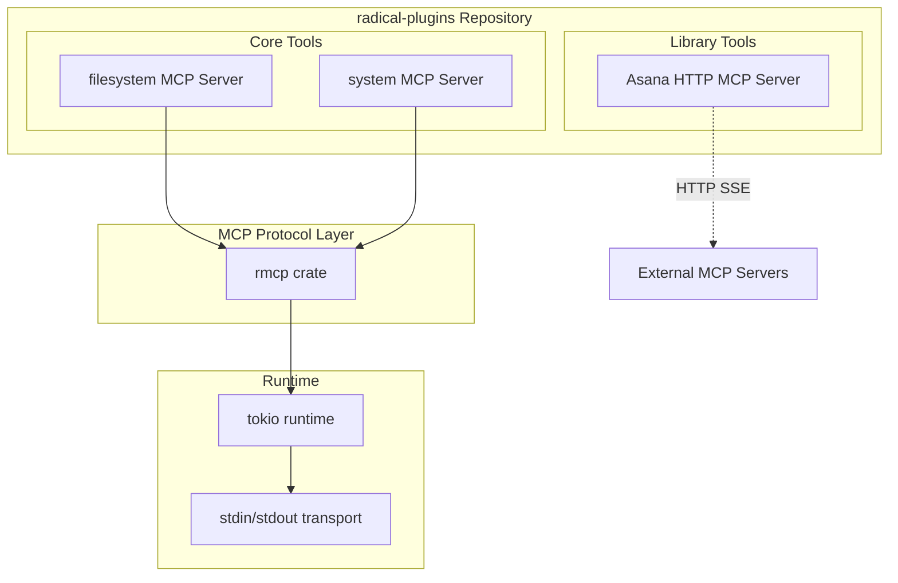
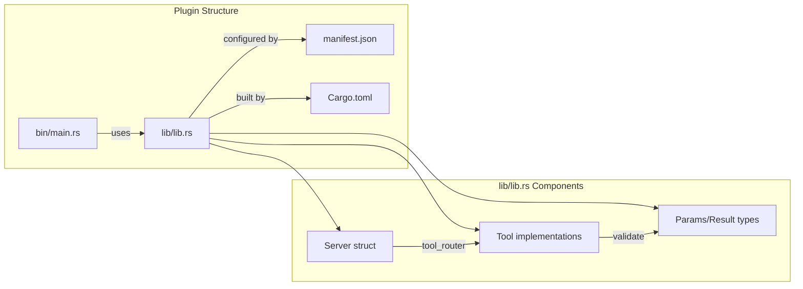
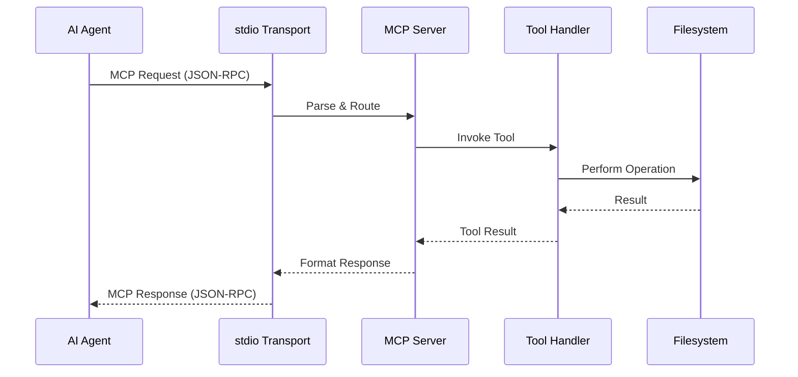
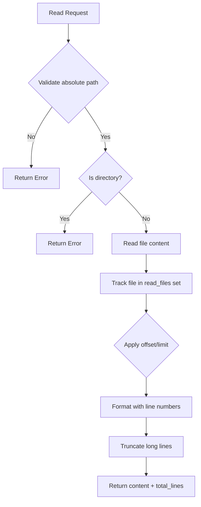
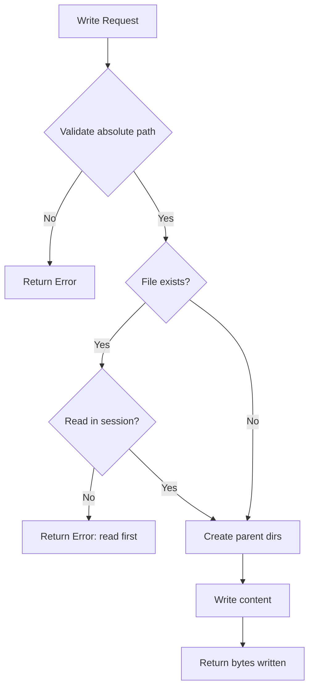

# Project Exploration: radical-plugins

## Overview

radical-plugins is a collection of core plugins designed for the radical/MCP (Model Context Protocol) ecosystem. The project provides modular MCP servers that expose tools for AI agents to interact with external systems, perform filesystem operations, and execute system utilities.

The project follows a monorepo-style organization where each plugin is a self-contained MCP server with its own build configuration, manifest, and implementation. The architecture leverages the `rmcp` crate for MCP protocol implementation, providing a clean separation between tool definitions (lib) and server entry points (bin).

As of the most recent refactor (commit a74b78a), the repository has transitioned to using git submodules for organizing plugins, pointing to separate repositories for `agents`, `tools`, `personas`, and `commands`. This suggests an evolution toward a more distributed plugin architecture.

## Repository

- **Location:** /home/darkvoid/Boxxed/@formulas/src.rust/src.Containers/src.Microsandbox/radical-plugins
- **Remote:** git@github.com:zerocore-ai/radical-plugins
- **Primary Language:** Rust
- **License:** Not specified in repository

## Directory Structure

```
radical-plugins/
├── .git/                    # Git repository metadata
├── .gitmodules              # Git submodule configuration
├── README.md                # Project description
├── agents/                  # Git submodule -> zerocore-ai/agents
├── commands/                # Git submodule -> zerocore-ai/commands
├── personas/                # Git submodule -> zerocore-ai/personas
└── tools/                   # Git submodule -> zerocore-ai/tools
```

### Historical Structure (pre-submodule refactor, commit b2ee4a7)

Before the submodule refactoring, the repository contained inline implementations:

```
radical-plugins/
├── README.md
├── core/
│   └── tools/
│       ├── filesystem/      # Filesystem operations MCP server
│       │   ├── .gitignore
│       │   ├── .mcpbignore
│       │   ├── Cargo.lock
│       │   ├── Cargo.toml
│       │   ├── bin/
│       │   │   └── main.rs  # Entry point
│       │   ├── lib/
│       │   │   └── lib.rs   # Server implementation
│       │   └── manifest.json
│       └── system/          # System utilities MCP server
│           ├── .gitignore
│           ├── .mcpbignore
│           ├── Cargo.lock
│           ├── Cargo.toml
│           ├── bin/
│           │   └── main.rs  # Entry point
│           ├── lib/
│           │   └── lib.rs   # Server implementation
│           └── manifest.json
└── library/
    └── tools/
        └── asana/           # Asana integration (HTTP MCP server)
            └── mcp.json
```

## Architecture

### High-Level Diagram



### Component Architecture



## Component Breakdown

### filesystem MCP Server

- **Location:** `core/tools/filesystem/` (historical)
- **Purpose:** Provides filesystem operations (read, write, edit) as MCP tools for AI agents
- **Dependencies:** rmcp, tokio, serde, serde_json, anyhow, tracing, tracing-subscriber, schemars
- **Dependents:** AI agents requiring file manipulation capabilities

**Key Tools:**
- `filesystem__read` - Read file contents with line numbers (cat -n format), supports offset/limit for partial reads
- `filesystem__write` - Create new files or overwrite existing ones (requires read-first safety check)
- `filesystem__edit` - Perform exact string replacement in files (requires read-first, validates uniqueness)

**Safety Mechanisms:**
- Enforces absolute paths only
- Tracks read files in session state to prevent accidental overwrites
- Validates edit operations (old_string must exist, new_string must differ)
- Truncates lines at 2000 characters, limits reads to 2000 lines by default

### system MCP Server

- **Location:** `core/tools/system/` (historical)
- **Purpose:** Provides system utilities for AI agents
- **Dependencies:** rmcp, tokio, serde, serde_json, anyhow, tracing, tracing-subscriber, chrono
- **Dependents:** AI agents requiring timing coordination

**Key Tools:**
- `system__sleep` - Sleep for specified duration with timestamps and optional reason logging

### Asana MCP Server (HTTP)

- **Location:** `library/tools/asana/` (historical)
- **Purpose:** Connects to Asana's official MCP server for task/project management
- **Type:** HTTP SSE (Server-Sent Events) connection
- **Dependencies:** External (connects to mcp.asana.com/sse)

### Git Submodules (Current Architecture)

- **agents:** `zerocore-ai/agents` - Agent definitions and configurations
- **commands:** `zerocore-ai/commands` - Command implementations
- **personas:** `zerocore-ai/personas` - AI persona configurations
- **tools:** `zerocore-ai/tools` - Tool definitions and implementations

## Entry Points

### filesystem Binary

- **File:** `core/tools/filesystem/bin/main.rs`
- **Description:** Initializes and runs the filesystem MCP server over stdio
- **Flow:**
  1. Initialize tracing subscriber with DEBUG level, output to stderr
  2. Create new `Server` instance from filesystem lib
  3. Serve over stdio transport using rmcp
  4. Wait for connection to close

```rust
#[tokio::main]
async fn main() -> Result<()> {
    tracing_subscriber::fmt()
        .with_env_filter(EnvFilter::from_default_env().add_directive(tracing::Level::DEBUG.into()))
        .with_writer(std::io::stderr)
        .with_ansi(false)
        .init();

    let service = Server::new().serve(stdio()).await?;
    service.waiting().await?;
    Ok(())
}
```

### system Binary

- **File:** `core/tools/system/bin/main.rs`
- **Description:** Initializes and runs the system utilities MCP server over stdio
- **Flow:** Identical pattern to filesystem binary

## Data Flow

### MCP Request/Response Flow



### filesystem__read Flow



### filesystem__write Flow



## External Dependencies

| Dependency | Version | Purpose |
|------------|---------|---------|
| rmcp | 0.10 | Model Context Protocol implementation (server, macros, transport) |
| tokio | 1.x | Async runtime (macros, rt-multi-thread, io-std, fs, time) |
| serde | 1.0 (+derive) | Serialization framework |
| serde_json | 1.0 | JSON serialization |
| anyhow | 1.0 | Error handling |
| tracing | 0.1 | Logging/tracing |
| tracing-subscriber | 0.3 (+env-filter) | Tracing subscriber with environment filtering |
| schemars | 0.8 | JSON Schema generation for tool parameters |
| chrono | 0.4 | Date/time handling (system tools) |

## Configuration

### Environment Variables

- `RUST_LOG` - Controls tracing log level via `EnvFilter::from_default_env()`

### manifest.json Configuration

Each plugin includes a `manifest.json` for MCP server configuration:

```json
{
  "manifest_version": "0.3",
  "name": "filesystem",
  "version": "0.1.0",
  "description": "Filesystem operations MCP server",
  "server": {
    "type": "binary",
    "entry_point": "target/release/filesystem",
    "mcp_config": {
      "command": "${__dirname}/target/release/filesystem"
    }
  },
  "compatibility": {
    "platforms": ["darwin"]
  }
}
```

### Platform Compatibility

- Currently targets **darwin** (macOS) only as specified in manifest compatibility
- `.mcpbignore` files present for MCP build exclusions

### Git Submodule Configuration (.gitmodules)

```
[submodule "agents"]   -> https://github.com/zerocore-ai/agents.git
[submodule "tools"]    -> https://github.com/zerocore-ai/tools.git
[submodule "personas"] -> https://github.com/zerocore-ai/personas.git
[submodule "commands"] -> https://github.com/zerocore-ai/commands.git
```

## Testing

### Test Strategy

No explicit test files were found in the repository history. The project relies on:

1. **Type Safety** - Rust's type system catches many errors at compile time
2. **Integration Testing** - MCP servers can be tested via MCP protocol clients
3. **Manual Testing** - Likely tested through the radical agent framework

### Recommended Test Areas

- Filesystem tool edge cases (empty files, large files, concurrent access)
- Path validation (relative vs absolute, symlinks, permissions)
- Edit operation uniqueness validation
- Sleep duration accuracy

## Key Insights

1. **MCP-Native Design**: The project is built entirely around the Model Context Protocol, using `rmcp` macros (`#[tool]`, `#[tool_router]`, `#[tool_handler]`) to generate boilerplate.

2. **Safety-First Filesystem Operations**: The read-before-write/edit pattern prevents accidental data loss by requiring files to be read in the session before modification.

3. **Binary + Lib Pattern**: Each plugin separates library code (`lib/lib.rs`) from the binary entry point (`bin/main.rs`), enabling reuse and cleaner testing boundaries.

4. **Stdio Transport**: Core tools use stdio for MCP transport, making them suitable for local agent integration. Library tools use HTTP SSE for remote services.

5. **Schema Generation**: Uses `schemars` to automatically generate JSON Schema from Rust types, ensuring tool parameter validation stays in sync with code.

6. **Evolution to Submodules**: The recent refactor from inline implementations to git submodules suggests a move toward independent versioning and potentially community-contributed plugins.

7. **Zero-to-Hero for MCP Servers**: The architecture provides a template for quickly building new MCP servers - define tools with macros, implement handlers, and serve over stdio.

## Open Questions

1. **Current Submodule Contents**: The submodules (`agents`, `tools`, `personas`, `commands`) are not initialized in the working directory. What is their current implementation state?

2. **Migration Path**: How do the historical inline plugins (`filesystem`, `system`, `asana`) map to the new submodule structure? Are they preserved in `zerocore-ai/tools`?

3. **Testing Strategy**: Is there an integration test suite for the MCP servers? How are plugins validated before release?

4. **Cross-Platform Support**: The manifests specify only `darwin` compatibility. Are Linux and Windows builds planned?

5. **Plugin Discovery**: How do agents discover available plugins? Is there a plugin registry or marketplace?

6. **Version Compatibility**: How is MCP protocol versioning handled across plugins? What is the minimum supported `rmcp` version?

7. **Error Handling Patterns**: The code uses `anyhow::Result` in binaries but string errors in tools. Is there a standardized error handling pattern for new plugins?
