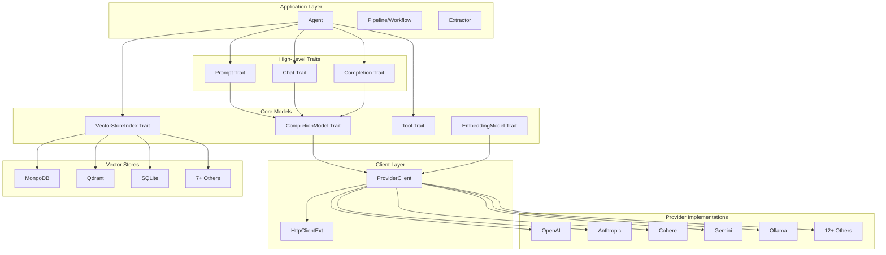
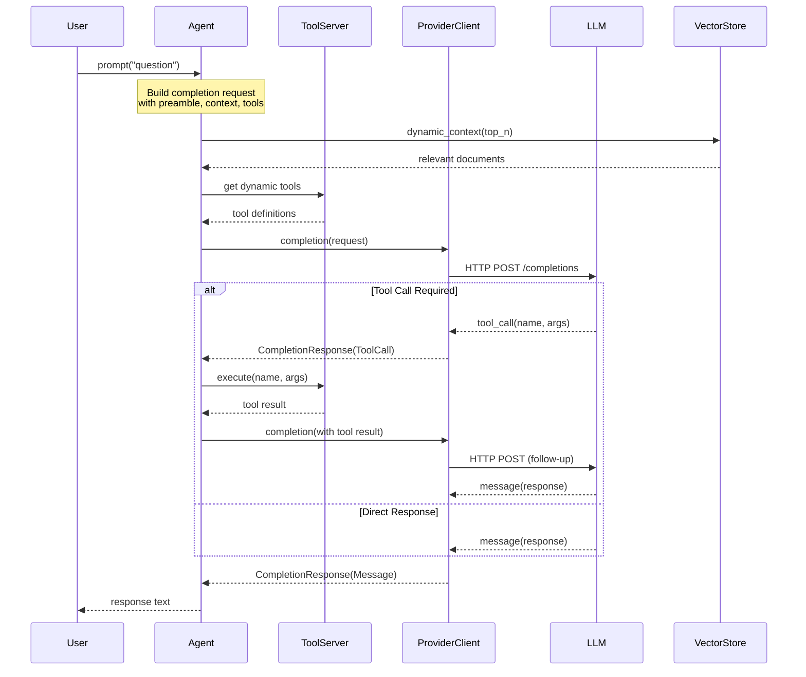
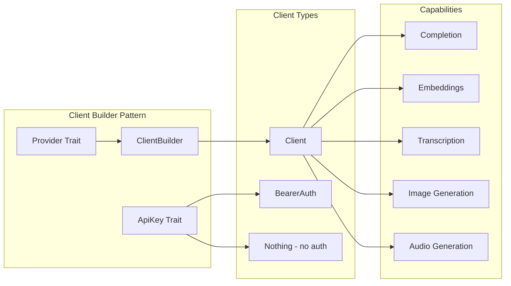

# Rig Exploration Report

## Overview

Rig is a Rust library for building LLM-powered applications with a focus on ergonomics, modularity, and scalability. The codebase follows a monorepo structure with a main core library (`rig-core`) and multiple companion crates for different model providers and vector store integrations.

**Key Characteristics:**
- Unified interface for 20+ LLM model providers (OpenAI, Anthropic, Cohere, Gemini, etc.)
- Unified interface for 10+ vector store integrations (MongoDB, Qdrant, SQLite, etc.)
- Full support for completion, embedding, streaming, tool use, and RAG workflows
- WASM-compatible core library
- OpenTelemetry/GenAI Semantic Convention support for telemetry
- MCP (Model Context Protocol) tool integration support

## Repository

- **Remote:** `git@github.com:zerocore-ai/rig` (fork of `https://github.com/0xPlaygrounds/rig`)
- **Current Branch:** `develop` (up to date with `origin/develop`)
- **Latest Commit:** `597f585` - "fix(openai): resolve streaming deserialization and request issues (#8)"
- **Recent Activity:** Active development with fixes for streaming, MCP tool output support, and dependency updates

### Git History (Recent)
```
597f585 fix(openai): resolve streaming deserialization and request issues (#8)
361ed33 build(deps): update dependencies including datafusion and arrow (#6)
8c29c24 feat(tool): add rich MCP tool output support (#5)
d68d4a8 fix(openai): add snake_case serde rename for streaming part enums (#4)
a82cd02 fix(openai): propagate streaming errors instead of silently swallowing (#3)
b964461 bug: deny `dbg!`, `todo!`, and `unimplemented!` in CI (#1113)
7f934ef feat: add Anthropic prompt caching support (#1116)
```

## Directory Structure

```
rig/
├── Cargo.toml                    # Workspace manifest (19 members)
├── Cargo.lock                    # Dependency lock file (341KB)
├── README.md                     # Project documentation
├── CONTRIBUTING.md               # Contribution guidelines
├── LICENSE                       # MIT License
├── justfile                      # Task runner configuration
├── rust-toolchain.toml           # Rust 1.90.0 + wasm32 target
├── flake.nix                     # Nix dev environment
├── .github/
│   ├── workflows/
│   │   ├── ci.yaml              # CI: fmt, clippy, wasm check
│   │   └── cd.yaml              # CD pipeline
│   └── ISSUE_TEMPLATE/          # Issue templates for bugs, features, providers
├── img/                          # Logo and branding assets
├── rig-core/                     # MAIN CRATE - Core abstractions (~23K LOC)
│   ├── Cargo.toml
│   ├── src/
│   │   ├── lib.rs               # Library entry point, module exports
│   │   ├── agent/               # Agent abstraction (builder, completion, tools)
│   │   ├── client/              # Provider client traits and builders
│   │   ├── completion/          # Completion model traits and request builders
│   │   ├── embeddings/          # Embedding model traits and builders
│   │   ├── tool/                # Tool trait and tool server
│   │   ├── vector_store/        # Vector store index trait, in-memory store
│   │   ├── providers/           # Built-in provider implementations
│   │   │   ├── openai/          # OpenAI client, completion, embeddings
│   │   │   ├── anthropic/       # Anthropic Claude integration
│   │   │   ├── cohere/          # Cohere models
│   │   │   ├── gemini/          # Google Gemini
│   │   │   ├── azure.rs         # Azure OpenAI
│   │   │   ├── ollama.rs        # Ollama local models
│   │   │   ├── groq.rs          # Groq fast inference
│   │   │   ├── deepseek.rs      # DeepSeek models
│   │   │   ├── huggingface/     # HuggingFace inference
│   │   │   ├── mistral/         # Mistral AI
│   │   │   ├── perplexity.rs    # Perplexity search
│   │   │   ├── xai/             # xAI (Grok)
│   │   │   └── ... (12+ providers)
│   │   ├── streaming.rs         # Streaming response handling
│   │   ├── telemetry/           # OpenTelemetry integration
│   │   ├── pipeline/            # Workflow orchestration
│   │   ├── extractor.rs         # Structured data extraction
│   │   ├── evals.rs             # Evaluation utilities
│   │   ├── loaders/             # Document loaders (PDF, EPUB)
│   │   ├── integrations/        # Third-party integrations
│   │   ├── http_client/         # HTTP client abstraction
│   │   ├── one_or_many.rs       # Utility type for 1+ items
│   │   ├── json_utils.rs        # JSON utilities
│   │   └── wasm_compat.rs       # WASM compatibility helpers
│   ├── rig-core-derive/         # Procedural macros (Embed, rig_tool)
│   ├── examples/                # 80+ example files
│   └── tests/
├── rig-bedrock/                  # AWS Bedrock provider
├── rig-eternalai/                # Eternal AI provider
├── rig-fastembed/                # Fastembed (local embeddings)
├── rig-vertexai/                 # Google Vertex AI
├── rig-wasm/                     # WASM-specific bindings
├── rig-mongodb/                  # MongoDB vector store
├── rig-lancedb/                  # LanceDB vector store
├── rig-neo4j/                    # Neo4j vector store
├── rig-qdrant/                   # Qdrant vector store
├── rig-sqlite/                   # SQLite vector store (sqlite-vec)
├── rig-surrealdb/                # SurrealDB vector store
├── rig-postgres/                 # PostgreSQL + pgvector
├── rig-milvus/                   # Milvus vector store
├── rig-scylladb/                 # ScyllaDB vector store
├── rig-s3vectors/                # AWS S3Vectors
└── rig-helixdb/                  # HelixDB vector store
```

## Architecture

### Core Abstraction Layers



### Request/Response Flow



### Client Architecture



## Component Breakdown

### 1. Agent System (`rig-core/src/agent/`)

The Agent abstraction combines an LLM model with:
- **Preamble**: System prompt/instructions
- **Static Context**: Documents always available
- **Dynamic Context**: RAGged documents from vector stores
- **Static Tools**: Always-available tool functions
- **Dynamic Tools**: RAGged tools from vector stores
- **Tool Server**: Local server for tool execution

**Key Files:**
- `builder.rs` (528 lines): `AgentBuilder` and `AgentBuilderSimple` with fluent API
- `completion.rs`: Agent implementation of `Completion`, `Prompt`, `Chat` traits
- `prompt_request.rs`: Multi-turn prompting with streaming support
- `tool.rs`: Tool integration for agents

**Agent Configuration Example:**
```rust
let agent = openai.agent("gpt-4o")
    .preamble("System prompt")
    .context("Context document 1")
    .dynamic_context(5, vector_index)  // RAG 5 docs
    .tool(my_tool)
    .temperature(0.8)
    .build();
```

### 2. Completion System (`rig-core/src/completion/`)

Core traits for LLM interactions:
- **`Prompt`**: Simple one-shot prompt/response
- **`Chat`**: Prompt with chat history
- **`Completion`**: Low-level completion request builder
- **`CompletionModel`**: Trait for model providers

**Key Types:**
- `CompletionRequest`: Request structure with preamble, chat_history, documents, tools
- `CompletionRequestBuilder<M>`: Fluent builder for requests
- `CompletionResponse<T>`: Response with choice, usage, raw_response
- `Message`: User/Assistant message enum
- `ToolDefinition`: Tool schema for LLM

### 3. Embedding System (`rig-core/src/embeddings/`)

**Key Traits:**
- `EmbeddingModel`: Generate embeddings for text
- `ImageEmbeddingModel`: Generate embeddings for images
- `Embed`: Trait for embeddable types

**Key Components:**
- `EmbeddingsBuilder`: Builder for batch embedding operations
- `Embedding`: Struct with document text and vector
- `TextEmbedder`: Utility for text preprocessing
- `distance.rs`: Cosine, Euclidean, Dot product distance functions

### 4. Tool System (`rig-core/src/tool/`)

**Tool Trait:**
```rust
pub trait Tool {
    const NAME: &'static str;
    type Error;
    type Args: DeserializeOwned;
    type Output: Serialize;

    async fn definition(&self, prompt: String) -> ToolDefinition;
    async fn call(&self, args: Self::Args) -> Result<Self::Output, Self::Error>;
}
```

**ToolOutput Enum:**
- `Text(String)`: Simple text output
- `Mcp(CallToolResult)`: Full MCP protocol output

**ToolServer:**
- Local HTTP server for tool execution
- Supports static and dynamic tools
- Handles tool routing and execution

### 5. Vector Store System (`rig-core/src/vector_store/`)

**VectorStoreIndex Trait:**
```rust
pub trait VectorStoreIndex {
    type Filter: SearchFilter;

    fn top_n<T>(&self, req: VectorSearchRequest<Self::Filter>)
        -> impl Future<Output = Result<Vec<(f64, String, T)>>>;

    fn top_n_ids(&self, req: VectorSearchRequest<Self::Filter>)
        -> impl Future<Output = Result<Vec<(f64, String)>>>;
}
```

**In-Memory Store:**
- Default vector store implementation
- Cosine similarity search
- Document storage with embeddings

### 6. Provider Clients (`rig-core/src/client/`)

**Generic Client Architecture:**
- `Client<Ext, H>`: Generic client with provider extension and HTTP backend
- `Provider` trait: Abstracts provider-specific behavior
- `ProviderBuilder` trait: Builder for provider extensions
- `ApiKey` trait: Authentication token handling
- `Capabilities` trait: Compile-time capability checking

**Supported Capabilities:**
- `Completion`: Text completion/chat
- `Embeddings`: Vector embeddings
- `Transcription`: Audio-to-text
- `ImageGeneration`: Text-to-image
- `AudioGeneration`: Text-to-audio

### 7. Streaming (`rig-core/src/streaming.rs`)

**Streaming Types:**
- `StreamingCompletionResponse`: Wrapper for streaming results
- `StreamingResult<M>`: Iterator over streaming chunks
- `PartialMessage`: Accumulates partial streaming responses

**EventSource Support:**
- SSE (Server-Sent Events) parsing
- NDJSON streaming support

### 8. Telemetry (`rig-core/src/telemetry/`)

**OpenTelemetry Integration:**
- GenAI Semantic Convention compliance
- `ProviderRequestExt`: Extract request metadata
- `ProviderResponseExt`: Extract response metadata
- `SpanCombinator`: Record traces to spans

**Recorded Metrics:**
- `gen_ai.usage.input_tokens`
- `gen_ai.usage.output_tokens`
- `gen_ai.response.id`
- `gen_ai.response.model_name`
- `gen_ai.input.messages`
- `gen_ai.output.messages`

### 9. Pipeline/Workflow (`rig-core/src/pipeline/`)

Workflow orchestration for:
- Sequential chains
- Parallel execution
- Conditional branching
- Agent orchestration

### 10. Extractor (`rig-core/src/extractor.rs`)

Structured data extraction from LLM responses:
- Type-safe extraction to Rust structs
- Schema validation
- Multi-extract support

## Entry Points

### Library Entry Point (`rig-core/src/lib.rs`)

```rust
pub mod agent;
pub mod client;
pub mod completion;
pub mod embeddings;
pub mod evals;
pub mod extractor;
pub mod http_client;
pub mod integrations;
pub mod loaders;
pub mod one_or_many;
pub mod pipeline;
pub mod prelude;
pub mod providers;
pub mod streaming;
pub mod telemetry;
pub mod tool;
pub mod tools;
pub mod transcription;
pub mod vector_store;
pub mod wasm_compat;
```

### Provider Module (`rig-core/src/providers/mod.rs`)

Exports all built-in providers:
```rust
pub mod anthropic;
pub mod azure;
pub mod cohere;
pub mod deepseek;
pub mod galadriel;
pub mod gemini;
pub mod groq;
pub mod huggingface;
pub mod hyperbolic;
pub mod mira;
pub mod mistral;
pub mod moonshot;
pub mod ollama;
pub mod openai;
pub mod openrouter;
pub mod perplexity;
pub mod together;
pub mod voyageai;
pub mod xai;
```

### Companion Crates Entry Points

**rig-bedrock:**
```rust
pub mod client;      // AWS Bedrock client
pub mod completion;  // Bedrock completion models
pub mod embedding;   // Bedrock embedding models
pub mod image;       // Bedrock image generation
pub mod streaming;   // Bedrock streaming
pub mod types;       // Bedrock type definitions
```

**rig-wasm:**
```rust
pub mod completion;
pub mod embedding;
pub mod tool;
pub mod vector_store;
pub mod providers;
```

## Data Flow

### Simple Completion Flow

```
User Input
    │
    ▼
┌─────────────────────────────────┐
│  Agent.prompt("question")       │
└─────────────────────────────────┘
    │
    ▼
┌─────────────────────────────────┐
│  Build CompletionRequest        │
│  - preamble                     │
│  - chat_history                 │
│  - tools                        │
└─────────────────────────────────┘
    │
    ▼
┌─────────────────────────────────┐
│  ProviderClient                 │
│  - Serialize request            │
│  - Add auth headers             │
│  - HTTP POST                    │
└─────────────────────────────────┘
    │
    ▼
┌─────────────────────────────────┐
│  LLM Provider API               │
│  (OpenAI, Anthropic, etc.)      │
└─────────────────────────────────┘
    │
    ▼
┌─────────────────────────────────┐
│  CompletionResponse             │
│  - choice (Message/ToolCall)    │
│  - usage (tokens)               │
│  - raw_response                 │
└─────────────────────────────────┘
    │
    ▼
User Output
```

### RAG Flow with Dynamic Context

```
User Input
    │
    ▼
┌─────────────────────────────────┐
│  Agent.prompt("question")       │
└─────────────────────────────────┘
    │
    ├──────────────────────────┐
    │                          │
    ▼                          ▼
┌─────────────────────┐  ┌─────────────────────┐
│  Embed Query        │  │  Get Static Context │
│  (EmbeddingModel)   │  │  Documents          │
└─────────────────────┘  └─────────────────────┘
    │                          │
    ▼                          │
┌─────────────────────┐        │
│  VectorStore.top_n()│        │
│  - Cosine search    │        │
│  - Return top K     │        │
└─────────────────────┘        │
    │                          │
    └──────────┬───────────────┘
               │
               ▼
        ┌─────────────────────┐
        │  Combined Context   │
        │  (Static + Dynamic) │
        └─────────────────────┘
               │
               ▼
        ┌─────────────────────┐
        │  CompletionRequest  │
        └─────────────────────┘
               │
               ▼
        [To Provider API...]
```

### Multi-Turn Tool Use Flow

```
User: "What's the weather in NYC?"
    │
    ▼
┌─────────────────────────────────┐
│  LLM decides to call tool       │
│  ToolCall: get_weather(nyc)     │
└─────────────────────────────────┘
    │
    ▼
┌─────────────────────────────────┐
│  ToolServer.execute()           │
│  - Route to tool implementation │
│  - Call external API if needed  │
└─────────────────────────────────┘
    │
    ▼
┌─────────────────────────────────┐
│  Tool Result: "72°F, sunny"     │
└─────────────────────────────────┘
    │
    ▼
┌─────────────────────────────────┐
│  LLM (follow-up with result)    │
│  "The weather in NYC is..."     │
└─────────────────────────────────┘
    │
    ▼
User: Final Response
```

## External Dependencies

### Workspace Dependencies (from `Cargo.toml`)

**Core Dependencies:**
- `serde` (1.0.219): Serialization/deserialization
- `serde_json` (1.0.140): JSON handling
- `tokio` (1.45.1): Async runtime
- `reqwest` (0.12.20): HTTP client
- `tracing` (0.1.41): Logging/tracing
- `thiserror` (2.0.12): Error handling
- `futures` (0.3.31): Async utilities
- `async-stream` (0.3.6): Async stream builders
- `schemars` (1.0.4): JSON Schema generation
- `url` (2.5): URL parsing

**Provider-Specific:**
- `aws-sdk-bedrockruntime` (1.102.0): AWS Bedrock
- `aws-config` (1.8.5): AWS configuration
- `google-cloud-auth` (1.0): Google Cloud auth
- `google-cloud-aiplatform-v1` (1.2.0): Google Vertex AI
- `ethers` (2.0.14): Ethereum (Eternal AI)

**Vector Store Dependencies:**
- `mongodb` (3.2.5): MongoDB driver
- `qdrant-client` (1.14.0): Qdrant client
- `lancedb` (0.22): LanceDB
- `neo4rs` (0.8.0): Neo4j driver
- `rusqlite` (0.32): SQLite
- `pgvector` (0.4): PostgreSQL vectors
- `scylla` (1.2.0): ScyllaDB
- `surrealdb` (2.3.8): SurrealDB
- `sqlx` (0.8.6): SQL toolkit

**Utilities:**
- `chrono` (0.4): Date/time
- `uuid` (1.17.0): UUID generation
- `base64` (0.22.1): Base64 encoding
- `bytes` (1.10.1): Byte buffers
- `rayon` (1.10.0): Parallel iterators
- `glob` (0.3.2): Glob patterns
- `mime_guess` (2.0.5): MIME type detection

**Document Processing:**
- `lopdf` (0.36.0): PDF parsing
- `epub` (2.1.4): EPUB parsing
- `quick-xml` (0.38.0): XML parsing

**Testing:**
- `assert_fs` (1.1.3): Filesystem testing
- `tokio-test` (0.4.4): Tokio testing utilities
- `httpmock` (0.7.0): HTTP mocking

**OpenTelemetry:**
- `opentelemetry` (0.30.0)
- `opentelemetry_sdk` (0.30.0)
- `opentelemetry-otlp` (0.30.0)
- `tracing-opentelemetry` (0.31.0)

**MCP Integration:**
- `rmcp`: Model Context Protocol (from zerocore-ai/rust-sdk)

### Feature Flags

```toml
[features]
default = ["reqwest-tls"]
all = ["derive", "pdf", "rayon"]
audio = []
image = []
derive = ["dep:rig-derive"]
experimental = []
discord-bot = ["dep:serenity"]
pdf = ["dep:lopdf"]
epub = ["dep:epub", "dep:quick-xml"]
rayon = ["dep:rayon"]
worker = ["dep:worker", "dep:wasm-bindgen-futures"]
rmcp = ["dep:rmcp"]
socks = ["reqwest/socks"]
reqwest-tls = ["reqwest/default"]
reqwest-rustls = ["reqwest/rustls-tls", ...]
```

## Configuration

### Rust Toolchain (`rust-toolchain.toml`)

```toml
[toolchain]
channel = "1.90.0"
profile = "default"
components = ["rust-analyzer", "rust-src"]
targets = ["wasm32-unknown-unknown"]
```

### Nix Development Environment (`flake.nix`)

Provides:
- Rust toolchain (from rust-toolchain.toml)
- `wasm-bindgen-cli`, `wasm-pack`
- `pkg-config`, `cmake`, `just`
- `openssl`, `sqlite`, `postgresql`, `protobuf`

### Task Runner (`justfile`)

```just
ci:
    just fmt
    just clippy

clippy:
    cargo clippy --all-features --all-targets

fmt:
    cargo fmt -- --check

build-wasm:
    cargo build -p rig-wasm --release --target wasm32-unknown-unknown
    wasm-bindgen --target experimental-nodejs-module ...

doc:
    RUSTDOCFLAGS="--cfg docsrs" cargo +nightly doc --package rig-core --all-features --open
```

### Environment Variables

**Provider API Keys:**
- `OPENAI_API_KEY`
- `ANTHROPIC_API_KEY`
- `COHERE_API_KEY`
- `GEMINI_API_KEY`
- `GROQ_API_KEY`
- `AZURE_OPENAI_API_KEY`
- `AZURE_OPENAI_ENDPOINT`
- (and many more per provider)

**Vector Store Configuration:**
- `MONGODB_URI`
- `QDRANT_URL`
- `DATABASE_URL` (PostgreSQL)
- etc.

## Testing

### Test Structure

**Unit Tests:**
- Located in `tests/` directories within each crate
- `rig-core/tests/embed_macro.rs`: Tests for derive macros
- `rig-core/tests/openai_response_schema.rs`: OpenAI response validation

**Integration Tests:**
- Vector store crates have `tests/integration_tests.rs`
- Use `testcontainers` for spinning up test databases
- Require environment variables for external services

**Example Tests:**
```rust
// rig-core/src/completion/request.rs
#[test]
fn test_document_display_without_metadata() { ... }

#[test]
fn test_document_display_with_metadata() { ... }

#[test]
fn test_normalize_documents_with_documents() { ... }
```

### CI Pipeline (`.github/workflows/ci.yaml`)

**Jobs:**
1. **fmt**: `cargo fmt -- --check`
2. **check-wasm**: `cargo check --package rig-core --target wasm32-unknown-unknown`
3. **clippy**: `cargo clippy --all-features --all-targets`

**Linting Rules:**
```toml
[workspace.lints.clippy]
dbg_macro = "forbid"
todo = "forbid"
unimplemented = "forbid"
```

### Release Process

- Uses `release-plz` GitHub Action
- Conventional Commits for versioning (`feat:`, `fix:`, `chore:`, etc.)
- CHANGELOG.md auto-generated per crate

## Key Insights

### 1. Modular Architecture
Rig's architecture is highly modular, with clear separation between:
- **Core abstractions** (traits like `CompletionModel`, `EmbeddingModel`)
- **Provider implementations** (OpenAI, Anthropic, etc.)
- **High-level constructs** (Agent, Pipeline, Extractor)

This allows easy addition of new providers without changing core logic.

### 2. Builder Pattern Everywhere
The codebase heavily uses the builder pattern for:
- Client construction (`ClientBuilder`)
- Agent construction (`AgentBuilder`)
- Request construction (`CompletionRequestBuilder`)
- Embedding construction (`EmbeddingsBuilder`)

This provides a fluent, ergonomic API for users.

### 3. WASM Compatibility
The core library is designed with WASM compatibility in mind:
- `WasmCompatSend`, `WasmCompatSync` traits
- Conditional compilation for WASM targets
- `rig-wasm` crate for WASM-specific bindings

### 4. Trait-Based Abstractions
Rig defines traits for every major concept:
- `CompletionModel`, `EmbeddingModel` for model providers
- `VectorStoreIndex` for vector stores
- `Tool` for tool implementations
- `Prompt`, `Chat`, `Completion` for high-level interfaces

This allows users to swap implementations easily.

### 5. Streaming Support
First-class streaming support with:
- `StreamingCompletionResponse` type
- EventSource/SSE parsing
- Partial message accumulation
- Token usage tracking in streams

### 6. MCP Integration
Recent addition of MCP (Model Context Protocol) support:
- `ToolOutput::Mcp(CallToolResult)` for rich tool output
- `rmcp` crate integration
- Support for tool servers

### 7. Telemetry-Ready
Built-in OpenTelemetry support with GenAI Semantic Convention:
- Automatic token usage tracking
- Request/response metadata recording
- Span recording utilities

### 8. Error Handling
Comprehensive error types:
- `CompletionError`, `EmbeddingError`, `VectorStoreError`
- `PromptError` for high-level prompting errors
- `ToolError` for tool execution errors
- All errors use `thiserror` for better ergonomics

## Open Questions

1. **Pipeline Implementation**: The `pipeline/` module structure wasn't fully explored. Understanding the workflow orchestration patterns would require deeper investigation.

2. **Dynamic Tool RAG**: How exactly are tools embedded and RAGged from vector stores? The mechanism for semantic tool discovery is unclear from surface-level analysis.

3. **Multi-Agent Patterns**: While there are examples like `multi_agent.rs` and `agent_orchestrator.rs`, the exact patterns for agent-to-agent communication aren't documented in the core API.

4. **Custom Provider Implementation**: What's the exact process for implementing a custom provider? While traits are defined, a step-by-step guide would be helpful.

5. **Vector Store Filter System**: The `SearchFilter` trait and filter implementation details weren't fully explored. How do different vector stores handle filtering?

6. **Tool Server Architecture**: How does the tool server handle concurrent tool executions? What's the HTTP API surface?

7. **Rate Limiting/Retry**: Is there built-in rate limiting or retry logic for provider API calls? This is critical for production use.

8. **Caching**: Is there any response caching mechanism to reduce API costs for repeated prompts?

9. **Batch Operations**: What batch operations are supported beyond embeddings? Can completions be batched?

10. **Fine-tuning Support**: Is there any support for fine-tuned models or model training workflows?

---

*This exploration was generated by analyzing the Rig codebase structure, source files, and documentation. For the most up-to-date information, refer to the official documentation at https://docs.rig.rs and the API reference at https://docs.rs/rig-core/latest/rig/.*
