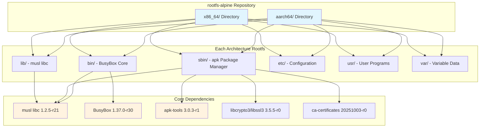
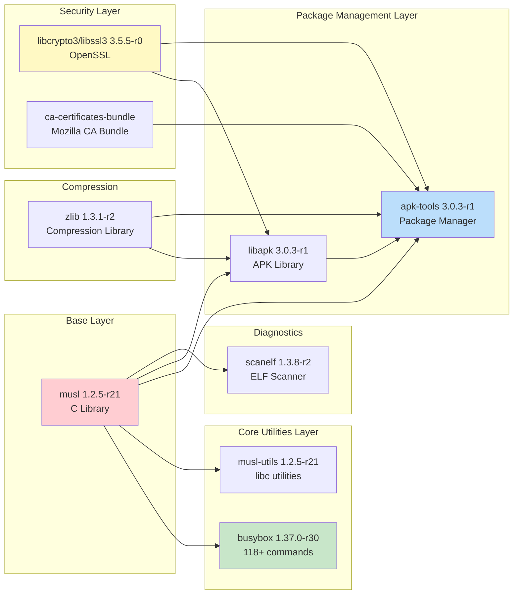
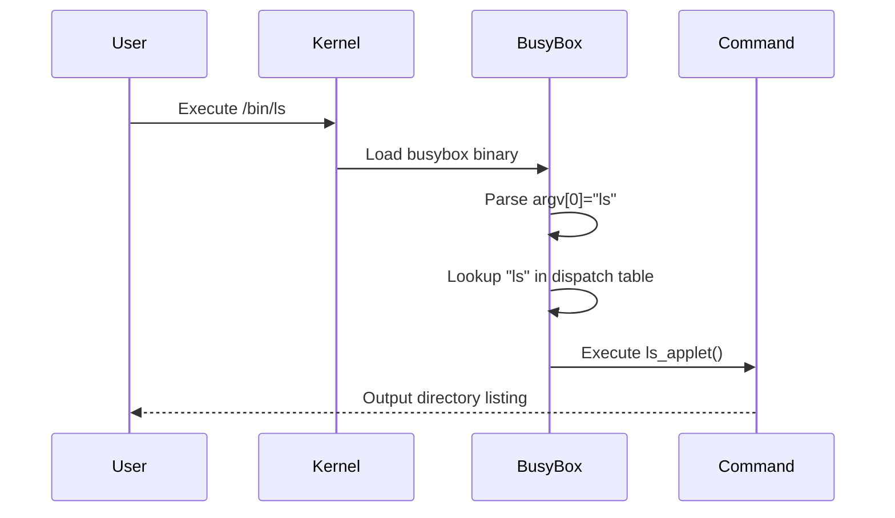
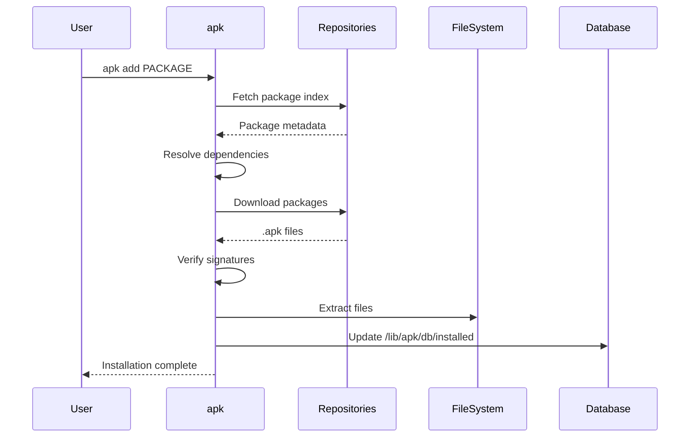
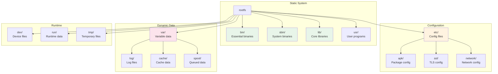

# rootfs-alpine Exploration Report

## Overview

The `rootfs-alpine` repository contains pre-built Alpine Linux v3.23.3 root filesystems for multiple CPU architectures. These are minimal, container-ready root filesystems exported from the official Alpine Linux Docker images. The repository serves as a foundational component for the zerocore-ai Microsandbox infrastructure, providing lightweight, security-focused base environments for containerized workloads.

Key characteristics:
- **Base Distribution**: Alpine Linux 3.23.3
- **C Library**: musl libc (lightweight, security-focused alternative to glibc)
- **Shell**: BusyBox ash (118+ built-in commands)
- **Package Manager**: apk (Alpine Package Keeper) v3.0.3-r1
- **Footprint**: ~9.5MB (aarch64), ~9.7MB (x86_64)
- **License Mix**: GPL-2.0-only, MIT, Apache-2.0, Zlib, BSD-2-Clause

## Repository Information

| Property | Value |
|----------|-------|
| **Remote** | git@github.com:zerocore-ai/rootfs-alpine |
| **Current Branch** | main |
| **Upstream** | origin/main (up to date) |
| **Total Commits** | 3 |
| **Author** | Stephen Akinyemi <appcypher@outlook.com> |

### Commit History

```
20db0d6 (HEAD -> main, origin/main) Reorganize rootfs by architecture and add x86_64
    Move aarch64 rootfs into aarch64/ subdirectory and add x86_64 rootfs
    exported from the official Alpine Docker image.

4c96aad Add Alpine Linux 3.23.3 aarch64 rootfs
    Exported from the official Alpine Docker image. Includes busybox
    utilities, musl libc, and apk package manager.

2a26ca3 Initial commit
```

## Directory Structure

```
rootfs-alpine/
├── .git/                    # Git repository metadata
├── .gitignore               # Git ignore rules (excludes .dockerenv)
├── README.md                # Project documentation
├── aarch64/                 # ARM 64-bit root filesystem
│   ├── bin/                 # Essential user binaries
│   │   └── busybox          # Multi-call binary (118+ commands)
│   ├── dev/                 # Device files
│   │   └── console          # System console device
│   ├── etc/                 # System configuration
│   │   ├── alpine-release   # Version: 3.23.3
│   │   ├── apk/             # Package manager configuration
│   │   │   ├── arch         # Architecture: aarch64
│   │   │   ├── keys/        # APK signing keys (2 files)
│   │   │   ├── repositories # Package repos (main, community)
│   │   │   └── world        # Installed packages list
│   │   ├── busybox-paths.d/ # BusyBox symlink configuration
│   │   ├── crontabs/        # Cron job definitions
│   │   ├── fstab            # Filesystem mount table
│   │   ├── group            # Group definitions (35 groups)
│   │   ├── hostname         # System hostname (empty)
│   │   ├── hosts            # Hostname resolution (empty)
│   │   ├── inittab          # Init process configuration
│   │   ├── issue            # Login banner
│   │   ├── logrotate.d/     # Log rotation config
│   │   ├── modprobe.d/      # Kernel module config
│   │   ├── modules          # Kernel modules to load
│   │   ├── motd             # Message of the day
│   │   ├── network/         # Network configuration
│   │   ├── nsswitch.conf    # Name service switch config
│   │   ├── passwd           # User definitions (17 users)
│   │   ├── profile          # System-wide shell profile
│   │   ├── profile.d/       # Profile script extensions
│   │   ├── protocols        # Network protocols
│   │   ├── resolv.conf      # DNS resolver (empty)
│   │   ├── secfixes.d/      # Security fixes tracking
│   │   ├── securetty        # Secure terminal definitions
│   │   ├── services         # Network services
│   │   ├── shadow           # Password hashes
│   │   ├── shells           # Valid login shells
│   │   ├── ssl/             # SSL/TLS configuration
│   │   ├── sysctl.conf      # Kernel parameters
│   │   └── udhcpc/          # DHCP client config
│   ├── lib/                 # System libraries
│   │   ├── apk/             # APK package database
│   │   └── ld-musl-aarch64.so.1  # musl dynamic linker
│   ├── sbin/                # System binaries
│   │   ├── apk              # Package manager binary
│   │   └── ldconfig         # Shared library cache
│   ├── usr/                 # User programs and data
│   │   ├── bin/             # User utilities
│   │   └── lib/             # User libraries
│   └── var/                 # Variable data
└── x86_64/                  # x86 64-bit root filesystem
    └── [mirrors aarch64 structure with x86_64-specific binaries]
```

## Architecture

### High-Level Architecture



### Package Dependency Graph



## Component Breakdown

### 1. BusyBox (1.37.0-r30)

**Purpose**: Size-optimized toolbox providing 118+ common UNIX utilities in a single binary.

**Location**: `bin/busybox`

**Provided Commands** (304 symlinks configured):
- **File Operations**: cat, cp, ls, mkdir, mv, rm, rmdir, touch, chmod, chown, ln
- **Text Processing**: awk, grep, sed, cut, sort, uniq, head, tail, wc, tr
- **System**: ps, kill, top, free, mount, umount, reboot, poweroff, halt
- **Network**: ifconfig, ip, route, ping, wget, nc, netstat, dnsdomainname
- **Shell**: ash (sh), test, [, [[, echo, printf, read, eval
- **Archiving**: tar, gzip, gunzip, bzip2, bunzip2, cpio, unzip
- **Editors**: vi
- **Find Utilities**: find, xargs, grep, pgrep, pkill

**Dependencies**: musl libc only

**Binary Info**:
- aarch64: ELF 64-bit LSB pie executable, ARM aarch64, dynamically linked
- x86_64: ELF 64-bit LSB pie executable, x86-64, dynamically linked

### 2. musl libc (1.2.5-r21)

**Purpose**: Lightweight, standards-compliant C standard library implementation.

**Location**: `lib/ld-musl-{arch}.so.1`

**Components**:
- `ld-musl-{arch}.so.1`: Dynamic linker/loader
- `libc.musl-{arch}.so.1`: C library symlink

**Features**:
- Static and dynamic linking support
- POSIX compliance
- Thread-safe (pthread support)
- Memory-efficient (~80KB base)

**Provided by**: musl and musl-utils packages

**Utilities Included**:
- `getconf`: Get configuration values
- `getent`: Get database entries
- `iconv`: Character encoding conversion
- `ldd`: Print shared library dependencies
- `ldconfig`: Configure dynamic linker cache
- `scanelf`: Scan ELF binaries (PaX utilities)

### 3. apk-tools (3.0.3-r1)

**Purpose**: Alpine Package Keeper - the package management system.

**Location**: `sbin/apk`

**Features**:
- Package installation, removal, upgrade
- Dependency resolution
- Repository management
- Signature verification
- Database tracking

**Dependencies**:
- musl >= 1.2.3_git20230424
- libcrypto3 >= 3.5
- libapk = 3.0.3-r1
- ca-certificates-bundle
- libz.so.1

**Repository Configuration** (`etc/apk/repositories`):
```
https://dl-cdn.alpinelinux.org/alpine/v3.23/main
https://dl-cdn.alpinelinux.org/alpine/v3.23/community
```

### 4. OpenSSL Libraries (3.5.5-r0)

**Purpose**: Cryptographic and SSL/TLS functionality.

**Components**:
- `libcrypto.so.3`: Cryptographic algorithms (AES, RSA, SHA, etc.)
- `libssl.so.3`: SSL/TLS protocol implementation

**Engine Modules** (`usr/lib/engines-3/`):
- `afalg.so`: Linux AF_ALG crypto API
- `capi.so`: Microsoft CryptoAPI
- `loader_attic.so`: Legacy engine loader
- `padlock.so`: VIA PadLock hardware crypto

**OSSL Modules** (`usr/lib/ossl-modules/`):
- `legacy.so`: Legacy providers (MD4, SEED, etc.)

### 5. CA Certificates Bundle (20251003-r0)

**Purpose**: Trusted Certificate Authority certificates for TLS verification.

**Location**: `etc/ssl/certs/ca-certificates.crt`

**Contents**: Mozilla CA certificate bundle (222KB)

**Supporting Files**:
- `etc/ssl/cert.pem`: Symlink to bundle
- `etc/ssl/openssl.cnf`: OpenSSL configuration
- `etc/ssl/ct_log_list.cnf`: Certificate Transparency log list

### 6. System Configuration Files

#### User/Group Management

**passwd** (17 users):
| User | UID | GID | Home | Shell |
|------|-----|-----|------|-------|
| root | 0 | 0 | /root | /bin/sh |
| bin | 1 | 1 | /bin | /sbin/nologin |
| daemon | 2 | 2 | /sbin | /sbin/nologin |
| lp | 4 | 7 | /var/spool/lpd | /sbin/nologin |
| sync | 5 | 0 | /sbin | /bin/sync |
| shutdown | 6 | 0 | /sbin | /sbin/shutdown |
| halt | 7 | 0 | /sbin | /sbin/halt |
| mail | 8 | 12 | /var/mail | /sbin/nologin |
| news | 9 | 13 | /usr/lib/news | /sbin/nologin |
| uucp | 10 | 14 | /var/spool/uucppublic | /sbin/nologin |
| cron | 16 | 16 | /var/spool/cron | /sbin/nologin |
| ftp | 21 | 21 | /var/lib/ftp | /sbin/nologin |
| sshd | 22 | 22 | /dev/null | /sbin/nologin |
| games | 35 | 35 | /usr/games | /sbin/nologin |
| ntp | 123 | 123 | /var/empty | /sbin/nologin |
| guest | 405 | 100 | /dev/null | /sbin/nologin |
| nobody | 65534 | 65534 | / | /sbin/nologin |

**group** (35 groups): Includes root, bin, daemon, wheel, kmem, disk, tty, audio, video, netdev, kvm, and more.

#### Init Configuration (etc/inittab)

```
::sysinit:/sbin/openrc sysinit
::sysinit:/sbin/openrc boot
::wait:/sbin/openrc default
tty1::respawn:/sbin/getty 38400 tty1
# ... tty2-6
::ctrlaltdel:/sbin/reboot
::shutdown:/sbin/openrc shutdown
```

Note: References openrc but this minimal rootfs uses BusyBox init.

#### Network Configuration

**nsswitch.conf**: `hosts: files dns`

**resolv.conf**: Empty (populated at runtime)

**hosts**: Empty (localhost typically added at runtime)

**hostname**: Empty (set at runtime)

#### Shell Environment (etc/profile)

```sh
export PATH="/usr/local/sbin:/usr/local/bin:/usr/sbin:/usr/bin:/sbin:/bin"
export PAGER=less
umask 022

# PS1 configuration for bash/ash/zsh
if [ -n "$BASH_VERSION" -o "$BB_ASH_VERSION" ]; then
    PS1='\h:\w\$ '
elif [ -n "$ZSH_VERSION" ]; then
    PS1='%m:%~%# '
else
    : "${HOSTNAME:=$(hostname)}"
    PS1='${HOSTNAME%%.*}:$PWD'
    [ "$(id -u)" -eq 0 ] && PS1="${PS1}# " || PS1="${PS1}\$ "
fi

# Load profile.d scripts
for script in /etc/profile.d/*.sh ; do
    if [ -r "$script" ] ; then
        . "$script"
    fi
done
```

**etc/profile.d/20locale.sh**:
```sh
export CHARSET=${CHARSET:-UTF-8}
export LANG=${LANG:-C.UTF-8}
export LC_COLLATE=${LC_COLLATE:-C}
```

#### Cron Configuration (etc/crontabs/root)

```
*/15 * * * * run-parts /etc/periodic/15min
0 * * * * run-parts /etc/periodic/hourly
0 2 * * * run-parts /etc/periodic/daily
0 3 * * 6 run-parts /etc/periodic/weekly
0 5 1 * * run-parts /etc/periodic/monthly
```

#### Security Configuration

**securetty**: Lists terminals where root can log in (tty1-tty6, ttyS0)

**modprobe.d/blacklist.conf**: Blacklists 40+ kernel modules including:
- tulip drivers (de4x5, dmfe)
- irdma (Intel RDMA)
- evbug (debug tool)
- eth1394 (FireWire ethernet)
- i8xx-tco (watchdog - causes crashes)
- via-ircc (infrared - broken)
- snd-pcsp (PC speaker)
- Various framebuffer drivers

## Entry Points

### Primary Entry Points

| Binary | Path | Purpose |
|--------|------|---------|
| `/bin/sh` | symlink to busybox | Default shell (ash) |
| `/bin/busybox` | busybox binary | Multi-call command dispatcher |
| `/sbin/apk` | apk binary | Package management |
| `/sbin/init` | busybox applet | System initialization |

### Available Shells

- `/bin/sh` -> busybox ash
- `/bin/ash` -> busybox ash

### BusyBox as Multi-call Binary

BusyBox examines `argv[0]` to determine which command to execute:



### Package Management Workflow



## Data Flow

### Filesystem Layout



### Package Installation Data Flow

1. **User invokes**: `apk add PACKAGE`
2. **apk reads**: `/etc/apk/repositories` for repository URLs
3. **apk fetches**: Package index from CDN
4. **apk verifies**: Signatures using keys in `/etc/apk/keys/`
5. **apk downloads**: `.apk` packages to `/var/cache/apk/`
6. **apk extracts**: Files to rootfs
7. **apk updates**: Database in `/lib/apk/db/`

## External Dependencies

### Package Dependencies (from /lib/apk/db/installed)

| Package | Version | Size | Description | License |
|---------|---------|------|-------------|---------|
| alpine-baselayout | 3.7.1-r8 | 6.5KB | Base directory structure | GPL-2.0-only |
| alpine-baselayout-data | 3.7.1-r8 | 19KB | Configuration files | GPL-2.0-only |
| alpine-keys | 2.6-r0 | 12.5KB | Package signing keys | MIT |
| alpine-release | 3.23.3-r0 | 343B | Release identification | MIT |
| apk-tools | 3.0.3-r1 | 135KB | Package manager | GPL-2.0-only |
| busybox | 1.37.0-r30 | 928KB | Core utilities | GPL-2.0-only |
| busybox-binsh | 1.37.0-r30 | 1B | /bin/sh symlink | GPL-2.0-only |
| ca-certificates-bundle | 20251003-r0 | 222KB | CA certificates | MPL-2.0 AND MIT |
| libapk | 3.0.3-r1 | 330KB | APK library | GPL-2.0-only |
| libcrypto3 | 3.5.5-r0 | 4.9MB | OpenSSL crypto | Apache-2.0 |
| libssl3 | 3.5.5-r0 | 868KB | OpenSSL SSL | Apache-2.0 |
| musl | 1.2.5-r21 | 723KB | C library | MIT |
| musl-utils | 1.2.5-r21 | 20KB | musl utilities | MIT AND BSD-2-Clause AND GPL-2.0-or-later |
| scanelf | 1.3.8-r2 | 67KB | ELF scanner | GPL-2.0-only |
| ssl_client | 1.37.0-r30 | 67KB | TLS helper for wget | GPL-2.0-only |
| zlib | 1.3.1-r2 | 133KB | Compression | Zlib |

### Repository Sources

- **Main**: https://dl-cdn.alpinelinux.org/alpine/v3.23/main
- **Community**: https://dl-cdn.alpinelinux.org/alpine/v3.23/community

### Package Signing Keys

24 RSA public keys stored in `/etc/apk/keys/` and `/usr/share/apk/keys/` for verifying package integrity across all supported architectures.

## Configuration

### Key Configuration Files

| File | Purpose |
|------|---------|
| `/etc/alpine-release` | Alpine version (3.23.3) |
| `/etc/apk/arch` | Target architecture |
| `/etc/apk/repositories` | Package repository URLs |
| `/etc/apk/world` | Explicitly installed packages |
| `/etc/busybox-paths.d/busybox` | BusyBox symlink registry |
| `/etc/hosts` | Static hostname mappings |
| `/etc/nsswitch.conf` | Name service configuration |
| `/etc/profile` | System-wide shell environment |
| `/etc/inittab` | Init process configuration |
| `/etc/fstab` | Filesystem mount table |
| `/etc/modprobe.d/*.conf` | Kernel module configuration |
| `/etc/ssl/openssl.cnf` | OpenSSL configuration |
| `/etc/sysctl.conf` | Kernel parameter overrides |
| `/etc/udhcpc/udhcpc.conf` | DHCP client configuration |

### Environment Variables (default)

```sh
PATH=/usr/local/sbin:/usr/local/bin:/usr/sbin:/usr/bin:/sbin:/bin
CHARSET=UTF-8
LANG=C.UTF-8
LC_COLLATE=C
PAGER=less
UMASK=022
```

### Architecture-Specific Configuration

- **aarch64**: Uses `ld-musl-aarch64.so.1` as dynamic linker
- **x86_64**: Uses `ld-musl-x86_64.so.1` as dynamic linker
- Architecture-specific APK keys in `/usr/share/apk/keys/{arch}/`

## Testing

### Current State

This repository contains static root filesystem exports with no automated tests.

### Recommended Testing Strategies

1. **Chroot Validation**:
   ```bash
   sudo chroot /path/to/rootfs-alpine/aarch64 /bin/sh -c "echo test"
   ```

2. **Package Manager Verification**:
   ```bash
   sudo chroot /path/to/rootfs-alpine/aarch64 apk update
   sudo chroot /path/to/rootfs-alpine/aarch64 apk info
   ```

3. **Binary Compatibility**:
   ```bash
   file /path/to/rootfs-alpine/aarch64/bin/busybox
   ldd /path/to/rootfs-alpine/aarch64/sbin/apk
   ```

4. **Security Verification**:
   ```bash
   sudo chroot /path/to/rootfs-alpine/aarch64 scanelf -qRF /bin
   ```

### Container Integration Testing

The rootfs can be tested with container runtimes:

```bash
# Using Docker
docker import rootfs-alpine-aarch64.tar alpine:test
docker run --rm alpine:test /bin/sh -c "cat /etc/alpine-release"

# Using Podman
podman import rootfs-alpine-x86_64.tar alpine:test
podman run --rm alpine:test /bin/sh -c "apk --version"
```

## Key Insights

### 1. Minimalist Design Philosophy

This rootfs follows Alpine's "less is more" philosophy:
- Only 12 base packages installed
- No systemd (uses OpenRC/BusyBox init)
- Single binary for 118+ utilities (BusyBox)
- Total footprint under 10MB per architecture

### 2. Multi-Architecture Support

The repository provides identical functionality across ARM64 and x86_64:
- Same Alpine version (3.23.3)
- Same package versions
- Same directory structure
- Architecture-specific binaries only where required

### 3. Security-First Configuration

- musl libc provides security hardening (ASLR, stack protection)
- Package signature verification enforced
- 40+ potentially problematic kernel modules blacklisted
- Minimal attack surface (no unnecessary services)
- Root login restricted to secure terminals only

### 4. Container-Ready Out of the Box

- No hardware-specific configuration
- Empty network configuration (populated at runtime)
- Empty hostname (set by container runtime)
- Compatible with chroot, Docker, Podman, and other OCI runtimes

### 5. apk Database Structure

The `/lib/apk/db/installed` file maintains comprehensive package metadata:
- Content checksums (C:)
- Package name, version, architecture
- Size information (S: installed, I: download)
- Dependency information (D:)
- File manifests with checksums (F:, R:, Z:)
- Maintainer and upstream information

### 6. BusyBox Configuration

BusyBox is configured to provide 304 symlinks covering:
- Core utilities (ls, cp, mv, rm)
- Text processing (awk, sed, grep)
- System administration (ps, kill, mount)
- Networking (ifconfig, ip, wget)
- Shells (ash, sh, hush)

## Open Questions

### 1. Init System Discrepancy

The `inittab` references `/sbin/openrc` for init, but the rootfs does not include OpenRC packages. This suggests either:
- The init scripts are expected to be provided externally
- The configuration is inherited from the Docker image but not used
- BusyBox init handles the actual initialization

### 2. Build/Export Process

How are the root filesystems generated? Likely approaches:
- Docker image export: `docker save` or `docker export`
- debootstrap-style minimal installation
- Custom buildroot configuration

The commit message mentions "exported from the official Alpine Docker image" suggesting the first approach.

### 3. Update Strategy

No automated update mechanism exists. Questions to consider:
- How often should base images be refreshed?
- Should security updates be backported?
- Is there a CI/CD pipeline for rebuilding?

### 4. Architecture Roadmap

Current architectures: aarch64, x86_64

Potential future additions:
- armhf (ARM 32-bit)
- riscv64 (RISC-V 64-bit)
- ppc64le (PowerPC)
- s390x (IBM Z)

The APK keys directory already includes keys for these architectures.

### 5. Integration with Microsandbox

How does this rootfs integrate with the parent Microsandbox project?
- Is it used directly via chroot?
- Is it packaged into container images?
- Are additional layers added on top?

### 6. Customization Points

What customizations might be needed for specific use cases?
- Additional packages pre-installed?
- Custom configuration in /etc?
- Custom users/groups?
- Network configuration templates?

## Appendix: BusyBox Command Index

Full list of 304 commands provided by BusyBox:

```
[, [[, acpid, add-shell, addgroup, adduser, adjtimex, arch, arp,
arping, ash, awk, base64, basename, bbconfig, bc, beep, blkdiscard,
blkid, blockdev, brctl, bunzip2, bzcat, bzip2, cal, cat, chattr,
chgrp, chmod, chown, chpasswd, chroot, chvt, cksum, clear, cmp,
comm, cp, cpio, crond, crontab, cryptpw, cut, date, dc, dd,
deallocvt, delgroup, deluser, depmod, df, diff, dirname, dmesg,
dnsdomainname, dos2unix, du, dumpkmap, echo, egrep, eject, env,
ether-wake, expand, expr, factor, fallocate, false, fatattr, fbset,
fbsplash, fdflush, fdisk, fgrep, find, findfs, flock, fold, free,
fsck, fstrim, fsync, fuser, getopt, getty, grep, groups, gunzip,
gzip, halt, hd, head, hexdump, hostid, hostname, hwclock, id,
ifconfig, ifdown, ifenslave, ifup, init, inotifyd, insmod, install,
ionice, iostat, ip, ipaddr, ipcalc, ipcrm, ipcs, iplink, ipneigh,
iproute, iprule, iptunnel, kbd_mode, kill, killall, killall5, klogd,
last, less, link, linux32, linux64, ln, loadfont, loadkmap, logger,
login, logread, losetup, ls, lsattr, lsmod, lsof, lsusb, lzcat, lzma,
lzop, lzopcat, makemime, md5sum, mdev, mesg, microcom, mkdir,
mkdosfs, mkfifo, mkfs.vfat, mknod, mkpasswd, mkswap, mktemp,
modinfo, modprobe, more, mount, mountpoint, mpstat, mv, nameif,
nanddump, nandwrite, nbd-client, nc, netstat, nice, nl, nmeter,
nohup, nologin, nproc, nsenter, nslookup, ntpd, od, openvt,
partprobe, passwd, paste, pgrep, pidof, ping, ping6, pipe_progress,
pivot_root, pkill, pmap, poweroff, printenv, printf, ps, pscan,
pstree, pwd, pwdx, raidautorun, rdate, rdev, readahead, readlink,
realpath, reboot, reformime, remove-shell, renice, reset, resize,
rev, rfkill, rm, rmdir, rmmod, route, run-parts, sed, sendmail,
seq, setconsole, setfont, setkeycodes, setlogcons, setpriv,
setserial, setsid, sh, sha1sum, sha256sum, sha3sum, sha512sum,
showkey, shred, shuf, slattach, sleep, sort, split, stat, strings,
stty, su, sum, swapoff, swapon, switch_root, sync, sysctl, syslogd,
tac, tail, tar, tee, test, time, timeout, top, touch, tr,
traceroute, traceroute6, tree, true, truncate, tty, ttysize, tunctl,
udhcpc, udhcpc6, umount, uname, unexpand, uniq, unix2dos, unlink,
unlzma, unlzop, unshare, unxz, unzip, uptime, usleep, uudecode,
uuencode, vconfig, vi, vlock, volname, watch, watchdog, wc, wget,
which, who, whoami, whois, xargs, xxd, xzcat, yes, zcat, zcip
```

---

*Exploration generated on 2026-03-19*
*Repository: zerocore-ai/rootfs-alpine*
*Commit: 20db0d631dd3938f22e9bedaebc4c2af3300c55e*
