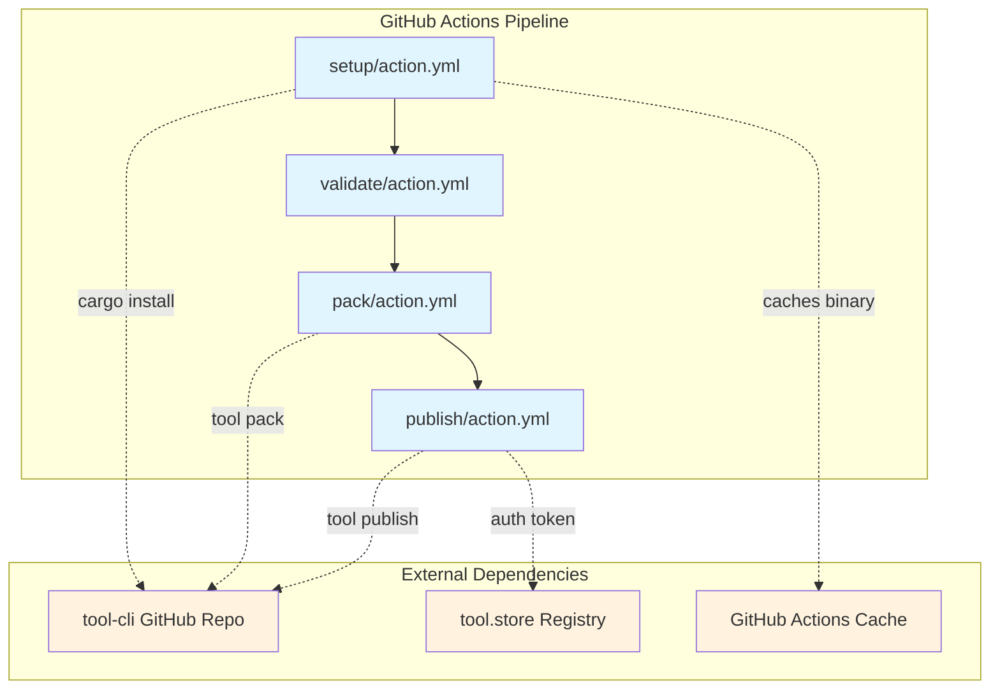
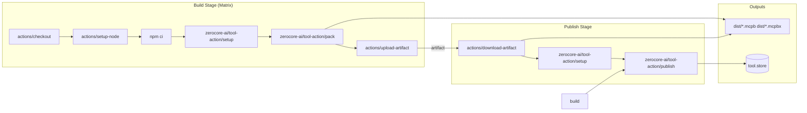

# Tool-Action Repository Exploration

## Overview

The `tool-action` repository is a collection of GitHub Actions designed for building, packaging, and publishing MCPB (Model Context Protocol Bundle) bundles. MCPB is a packaging format for MCP (Model Context Protocol) servers/tools, with support for both standard bundles (`.mcpb`) and extended bundles with advanced features (`.mcpbx`).

This repository provides four composable GitHub Actions that form a complete CI/CD pipeline for MCP bundle development:

1. **setup** - Installs the `tool-cli` Rust CLI tool
2. **validate** - Validates `manifest.json` before packing
3. **pack** - Creates platform-specific MCPB bundles
4. **publish** - Publishes multi-platform bundles to the tool.store registry

The actions are designed to work together in a matrix build strategy across six platform targets: macOS (ARM64/x86_64), Linux (ARM64/x86_64), and Windows (ARM64/x86_64).

## Repository Information

| Property | Value |
|----------|-------|
| **Repository** | `zerocore-ai/tool-action` |
| **Remote** | `git@github.com:zerocore-ai/tool-action` |
| **Default Branch** | `main` |
| **License** | Apache-2.0 |
| **Total Files** | 6 (excluding .git) |
| **Total Size** | ~20KB |

### Commit History

| Commit | Date | Author | Message |
|--------|------|--------|---------|
| `188c93e` | 2026-02-13 | Stephen Akinyemi | refactor(setup): use cargo install with caching instead of prebuilt scripts (#3) |
| `74bf305` | 2026-02-10 | Stephen Akinyemi | docs(readme): note cross-platform support for setup action |
| `a504d31` | 2026-02-10 | Stephen Akinyemi | feat(setup): add native Windows prebuilt binary support (#2) |
| `e5ebbe9` | 2026-02-09 | Stephen Akinyemi | feat: add GitHub Actions for MCPB bundle workflows (#1) |
| `67b7d5b` | 2026-02-09 | Stephen Akinyemi | Initial commit |

## Directory Structure

```
tool-action/
├── .git/                          # Git repository metadata
├── LICENSE                        # Apache-2.0 license text
├── README.md                      # Comprehensive documentation (7.9KB)
├── setup/
│   └── action.yml                 # Setup action definition
├── validate/
│   └── action.yml                 # Validate action definition
├── pack/
│   └── action.yml                 # Pack action definition
└── publish/
    └── action.yml                 # Publish action definition
```

### File Inventory

| File | Size | Purpose |
|------|------|---------|
| `LICENSE` | 11.3KB | Apache-2.0 license |
| `README.md` | 7.9KB | User documentation with examples |
| `setup/action.yml` | 1.4KB | Tool installation action |
| `validate/action.yml` | 1.5KB | Manifest validation action |
| `pack/action.yml` | 3.1KB | Bundle packaging action |
| `publish/action.yml` | 4.5KB | Registry publishing action |

## Architecture

The repository follows GitHub Actions composite action pattern, where each action is self-contained in its own directory with an `action.yml` manifest.

### Component Architecture



### Data Flow



## Component Breakdown

### 1. Setup Action (`setup/action.yml`)

**Purpose:** Install the `tool-cli` Rust CLI tool from the zerocore-ai/tool-cli repository.

**Inputs:**
| Input | Default | Description |
|-------|---------|-------------|
| `version` | `latest` | Git tag to install, or `latest` for main branch HEAD |

**Outputs:**
| Output | Description |
|--------|-------------|
| `version` | Installed tool-cli version string |

**Implementation Details:**
- Uses composite action runner (`using: composite`)
- Caches binaries to `~/.cargo/bin/tool` or `~/.cargo/bin/tool.exe`
- Cache key format: `tool-cli-{os}-{arch}-{version}`
- When cache miss occurs:
  1. Sets up Rust toolchain via `dtolnay/rust-toolchain@stable`
  2. Runs `cargo install --git https://github.com/zerocore-ai/tool-cli`
  3. Adds `~/.cargo/bin` to `$GITHUB_PATH`
- Verifies installation with `tool --version`

**Key Innovation:** The refactor in commit `188c93e` replaced prebuilt binary scripts with direct `cargo install`, leveraging GitHub Actions caching for faster subsequent runs while maintaining cross-platform compatibility.

### 2. Validate Action (`validate/action.yml`)

**Purpose:** Validate `manifest.json` before packing bundles.

**Inputs:**
| Input | Default | Description |
|-------|---------|-------------|
| `strict` | `false` | Treat warnings as errors |
| `working-directory` | `.` | Directory containing manifest.json |

**Outputs:**
| Output | Description |
|--------|-------------|
| `valid` | `true` if validation passed |

**Implementation Details:**
- Validates `tool-cli` is installed (fails with helpful error if not)
- Checks for `manifest.json` existence
- Runs `tool validate` or `tool validate --strict`
- Uses `set -euo pipefail` for strict bash error handling
- Outputs validation status to GitHub Actions output context

### 3. Pack Action (`pack/action.yml`)

**Purpose:** Create MCPB bundles with optional platform suffixes.

**Inputs:**
| Input | Default | Description |
|-------|---------|-------------|
| `target` | `""` | Platform suffix (e.g., `darwin-arm64`) |
| `output-dir` | `dist` | Output directory for bundles |
| `checksum` | `true` | Generate `.sha256` checksum file |
| `working-directory` | `.` | Directory containing manifest.json |

**Outputs:**
| Output | Description |
|--------|-------------|
| `bundle-path` | Full path to created bundle |
| `bundle-name` | Filename of bundle |
| `checksum-path` | Path to checksum file (if generated) |

**Implementation Details:**
- Cleans existing `.mcpb` and `.mcpbx` files before packing
- Runs `tool pack` to create bundle
- Renames bundle to include platform target if specified
- Creates output directory and moves bundle
- Generates SHA256 checksum using Node.js crypto module (inline script)

**Checksum Generation:**
```javascript
const fs = require('fs');
const crypto = require('crypto');
const path = require('path');
const p = process.argv[1];
const d = fs.readFileSync(p);
const h = crypto.createHash('sha256').update(d).digest('hex');
fs.writeFileSync(p + '.sha256', h + '  ' + path.basename(p) + '\n');
```

### 4. Publish Action (`publish/action.yml`)

**Purpose:** Publish multi-platform MCPB bundles to tool.store registry.

**Inputs:**
| Input | Default | Description |
|-------|---------|-------------|
| `bundles` | `dist/*.mcpb dist/*.mcpbx` | Glob patterns for bundle files |
| `dry-run` | `false` | Validate without uploading |
| `working-directory` | `.` | Directory containing manifest.json |

**Outputs:**
| Output | Description |
|--------|-------------|
| `published` | `true` if publish succeeded |

**Environment Variables:**
| Variable | Required | Description |
|----------|----------|-------------|
| `TOOL_REGISTRY_TOKEN` | Yes (unless dry-run) | Authentication token for tool.store |

**Platform Detection:**
The action automatically maps bundle filenames to platform flags:

| Filename Pattern | Flag |
|------------------|------|
| `*-darwin-arm64.mcpb[x]` | `--darwin-arm64` |
| `*-darwin-x86_64.mcpb[x]` or `*-darwin-x64.mcpb[x]` | `--darwin-x64` |
| `*-linux-arm64.mcpb[x]` | `--linux-arm64` |
| `*-linux-x86_64.mcpb[x]` or `*-linux-x64.mcpb[x]` | `--linux-x64` |
| `*-win32-arm64.mcpb[x]` | `--win32-arm64` |
| `*-win32-x86_64.mcpb[x]` or `*-win32-x64.mcpb[x]` | `--win32-x64` |

**Implementation Details:**
- Validates `tool-cli` is installed
- Validates `TOOL_REGISTRY_TOKEN` is set (unless dry-run)
- Uses bash glob patterns with `shopt -s nullglob`
- Builds command arguments dynamically based on detected platforms
- Requires at least one platform-specific bundle
- Runs `tool publish --multi-platform [flags...]`

## Entry Points

Each action is designed to be invoked as a GitHub Actions step:

### Typical Invocation Pattern

```yaml
- uses: zerocore-ai/tool-action/setup@v1
  with:
    version: latest

- uses: zerocore-ai/tool-action/validate@v1
  with:
    strict: "false"

- uses: zerocore-ai/tool-action/pack@v1
  with:
    target: darwin-arm64
    checksum: "true"

- uses: zerocore-ai/tool-action/publish@v1
  env:
    TOOL_REGISTRY_TOKEN: ${{ secrets.TOOL_REGISTRY_TOKEN }}
```

### Matrix Build Entry Point

The recommended pattern uses a matrix strategy for parallel platform builds:

```yaml
strategy:
  matrix:
    include:
      - target: darwin-arm64
        runner: macos-15
      - target: darwin-x86_64
        runner: macos-15-intel
      - target: linux-arm64
        runner: ubuntu-24.04-arm
      - target: linux-x86_64
        runner: ubuntu-24.04
      - target: win32-arm64
        runner: windows-11-arm
      - target: win32-x86_64
        runner: windows-2022

runs-on: ${{ matrix.runner }}
```

## External Dependencies

### Runtime Dependencies

| Dependency | Purpose | Source |
|------------|---------|--------|
| `tool-cli` | Core CLI for MCPB operations | https://github.com/zerocore-ai/tool-cli |
| `dtolnay/rust-toolchain` | Rust toolchain for building tool-cli | GitHub Marketplace |
| `actions/cache@v4` | Binary caching for faster setup | GitHub Actions |
| `actions/checkout@v4` | Repository checkout | GitHub Actions |
| `actions/upload-artifact@v4` | Bundle artifact storage | GitHub Actions |
| `actions/download-artifact@v4` | Bundle artifact retrieval | GitHub Actions |
| `actions/setup-node@v4` | Node.js for checksum generation | GitHub Actions |

### Registry Integration

| Registry | Purpose | Authentication |
|----------|---------|----------------|
| `tool.store` | MCPB bundle distribution | `TOOL_REGISTRY_TOKEN` env var |

## Configuration

### GitHub Secrets Required

| Secret | Usage |
|--------|-------|
| `TOOL_REGISTRY_TOKEN` | Authentication for publishing to tool.store |

### Runner Requirements

| Platform | Minimum Runner | Notes |
|----------|---------------|-------|
| macOS ARM64 | `macos-15` | Apple Silicon |
| macOS x86_64 | `macos-15-intel` | Intel Macs |
| Linux ARM64 | `ubuntu-24.04-arm` | ARM-based Linux |
| Linux x86_64 | `ubuntu-24.04` | Standard Linux |
| Windows ARM64 | `windows-11-arm` | ARM-based Windows |
| Windows x86_64 | `windows-2022` | Standard Windows |

### Bundle Extension Types

| Extension | Description |
|-----------|-------------|
| `.mcpb` | Standard MCP bundle |
| `.mcpbx` | Extended bundle (HTTP transport, reference mode, system config, OAuth) |
| `.sha256` | SHA256 checksum file |

## Testing

The repository does not include explicit test files. Testing is performed through:

1. **GitHub Actions Workflow Integration** - Actions are tested when consumed by downstream repositories
2. **Dry-Run Mode** - The `publish` action supports `dry-run: "true"` for validation without side effects
3. **Validation Action** - The `validate` action can be run with `strict: "true"` to catch warnings

### Validation Coverage

| Action | Validation Type |
|--------|-----------------|
| `setup` | Verifies `tool --version` succeeds |
| `validate` | Checks `manifest.json` exists and passes `tool validate` |
| `pack` | Verifies exactly one bundle is created |
| `publish` | Validates `TOOL_REGISTRY_TOKEN` and platform detection |

## Key Insights

### Design Patterns

1. **Composite Actions** - All actions use `using: composite`, allowing bash steps without container overhead
2. **Dependency Injection** - Actions expect `tool-cli` to be pre-installed (via setup action)
3. **Convention Over Configuration** - Default values minimize required inputs
4. **Matrix-Ready** - Designed for GitHub Actions matrix strategy parallelization

### Platform Detection Strategy

The `publish` action uses filename-based platform detection, which is elegant because:
- No additional metadata parsing required
- Works with glob patterns
- Supports both `.mcpb` and `.mcpbx` extensions
- Handles x86_64/x64 naming variations

### Caching Strategy

The `setup` action's cache key includes:
- `runner.os` - OS type
- `runner.arch` - CPU architecture
- `inputs.version` - Git tag or `latest`

This ensures:
- Cache isolation per platform
- Cache invalidation on version change
- Fast subsequent runs via cache hit

### Error Handling

Consistent patterns across actions:
- `set -euo pipefail` for strict bash
- `command -v tool` checks for dependency verification
- `::error::` prefixed GitHub Actions error annotations
- Early exits with informative messages

## Open Questions

1. **Version Pinning Strategy** - The README uses `@v1` but it's unclear what the current release tag is. Is `@main` recommended for development?

2. **tool-cli Compatibility** - What versions of `tool-cli` are supported? Is there a minimum version requirement?

3. **MCPBX Feature Detection** - How does the build process determine whether to output `.mcpbx` vs `.mcpb`? Is this automatic based on `manifest.json` features?

4. **Registry API** - What is the tool.store API specification? Is it public documentation available?

5. **Local Testing** - Is there a recommended way to test these actions locally (e.g., with act or similar tools)?

6. **Rollback Strategy** - If a publish fails mid-way, is there a rollback mechanism for partially published bundles?

7. **Checksum Verification** - The checksum is generated but never verified downstream. Is verification expected to happen at publish time or by consumers?

## Appendix: Complete File Contents

### setup/action.yml
- Lines: 51
- Key: Uses `actions/cache@v4` for binary caching, `dtolnay/rust-toolchain@stable` for Rust setup

### validate/action.yml
- Lines: 58
- Key: Validates `manifest.json` exists, runs `tool validate` with optional `--strict` flag

### pack/action.yml
- Lines: 101
- Key: Creates bundles, renames with platform suffix, generates SHA256 via Node.js inline script

### publish/action.yml
- Lines: 127
- Key: Platform detection via filename pattern matching, builds `tool publish --multi-platform` command
