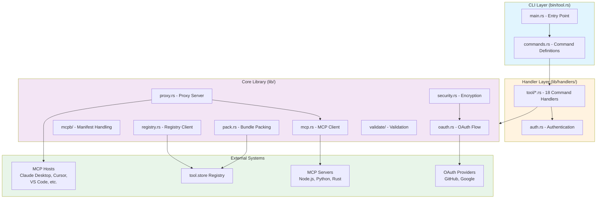
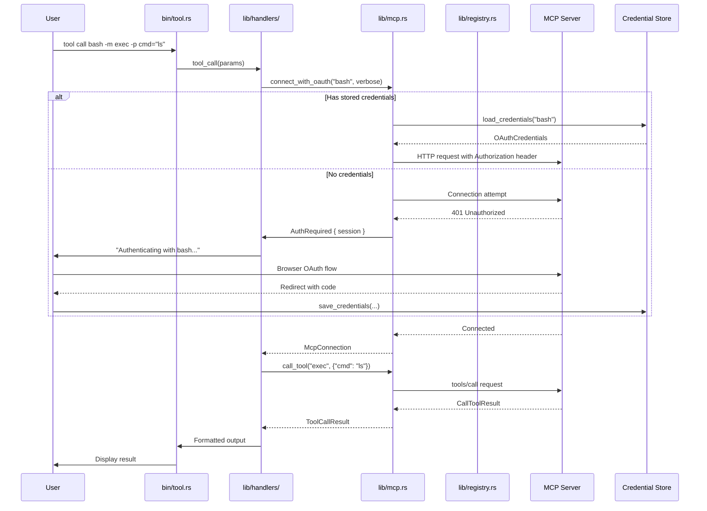
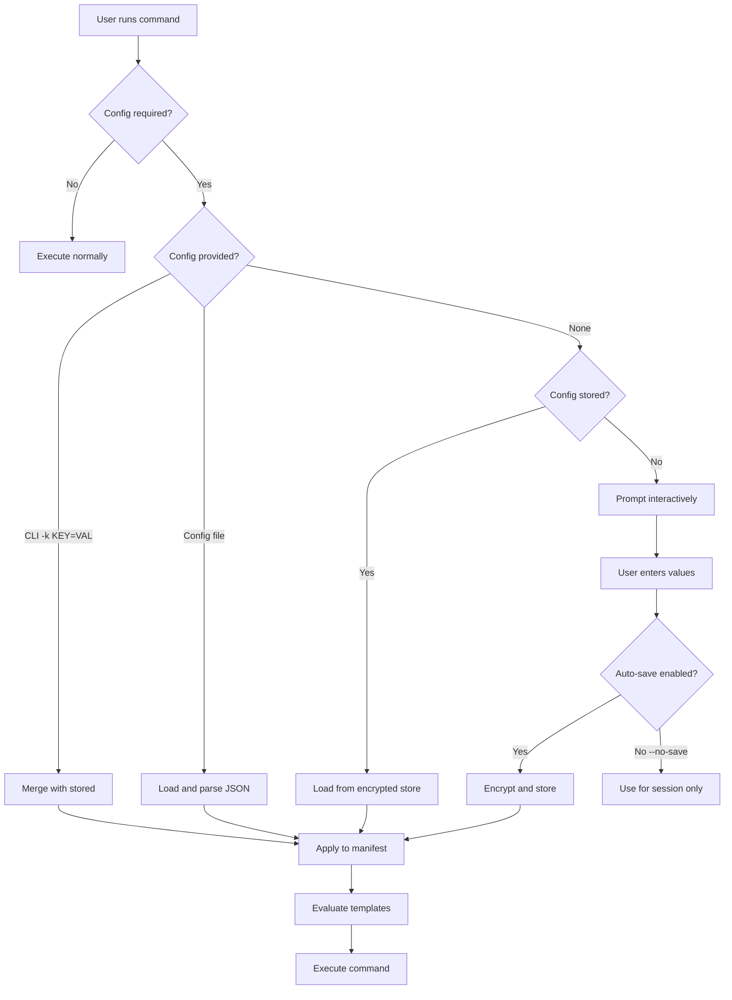

# Project Exploration: tool-cli

## Overview

`tool-cli` is a comprehensive CLI toolchain for managing MCP (Model Context Protocol) tools. It serves as the missing package manager for MCP tools, handling the entire lifecycle from scaffolding new MCP servers to publishing, distributing, and consuming tools from a central registry (tool.store).

The project implements a complete developer experience for MCP tool creators and consumers. For creators, it provides project initialization with template scaffolding for Node.js, Python, and Rust MCP servers, manifest validation, bundling into `.mcpb`/`.mcpbx` packages, and publishing to the registry. For consumers, it offers tool discovery via search, installation from the registry or local paths, direct method invocation, and seamless integration with MCP hosts like Claude Desktop, Cursor, VS Code, and other AI development environments.

Built in Rust with a focus on performance and reliability, the CLI leverages the `rmcp` SDK for MCP protocol implementation and supports both stdio and HTTP transports, OAuth authentication, multi-platform bundles, and transport bridging (exposing stdio tools via HTTP and vice versa).

## Repository

- **Location:** `/home/darkvoid/Boxxed/@formulas/src.rust/src.Containers/src.Microsandbox/tool-cli`
- **Remote:** `git@github.com:zerocore-ai/tool-cli`
- **Primary Language:** Rust
- **License:** Apache 2.0 (MIT in Cargo.toml, Apache 2.0 in LICENSE file)
- **Current Version:** 0.2.0

## Directory Structure

```
tool-cli/
├── bin/
│   └── tool.rs              # Main CLI entry point (tokio::main, command dispatch)
├── lib/
│   ├── lib.rs               # Library root, module exports
│   ├── commands.rs          # Clap CLI command definitions (Cli struct, Command enum)
│   ├── concise.rs           # Concise output formatting for AI agents
│   ├── constants.rs         # Registry URLs, manifest filenames, defaults
│   ├── error.rs             # ToolError enum with 25+ error variants
│   ├── format.rs            # Output formatting utilities
│   ├── hosts.rs             # MCP host integrations (Claude Desktop, Cursor, etc.)
│   ├── mcp.rs               # MCP client connections (stdio, HTTP, OAuth)
│   ├── mcpb/
│   │   ├── mod.rs           # MCPB module root
│   │   ├── manifest.rs      # McpbManifest struct, load/resolve/serialize
│   │   ├── types.rs         # McpbServer, McpbTool, McpbPrompt, config types
│   │   ├── init_mode.rs     # Bundle vs Reference mode detection
│   │   ├── platform.rs      # Platform detection and overrides
│   │   ├── resolved.rs      # ResolvedMcpbManifest with template evaluation
│   │   └── platform.rs      # Platform enum and detection
│   ├── oauth.rs             # OAuth 2.0 flow, credential storage, encryption
│   ├── output.rs            # Output formatting and display
│   ├── pack.rs              # Bundle packing (zip/tar.gz), icon extraction
│   ├── prompt.rs            # Interactive prompts using cliclack
│   ├── proxy.rs             # MCP proxy server for transport bridging
│   ├── references.rs        # Tool reference parsing (namespace/name@version)
│   ├── registry.rs          # Registry API client (search, publish, download)
│   ├── resolver.rs          # Tool resolution from references
│   ├── scaffold.rs          # Project scaffolding for new MCP servers
│   ├── security.rs          # Credential encryption (AES-GCM)
│   ├── self_update.rs       # Self-update mechanism
│   ├── styles.rs            # CLI styling (colored output, spinners)
│   ├── suggest.rs           # Command suggestions (strsim-based)
│   ├── system_config.rs     # System-wide configuration handling
│   ├── tree.rs              # Command tree visualization
│   ├── validate/
│   │   ├── mod.rs           # Validation module root
│   │   ├── validators/      # Individual validators (manifest, fields, etc.)
│   │   ├── codes.rs         # Validation error codes (270+ lines)
│   │   ├── result.rs        # ValidationResult type
│   │   └── tests.rs         # Validation test cases
│   └── vars.rs              # Variable substitution (${__dirname}, etc.)
├── handlers/
│   ├── mod.rs               # Handler module exports
│   ├── auth.rs              # Login/logout/whoami handlers
│   └── tool/
│       ├── mod.rs           # Tool handler exports
│       ├── call.rs          # tool call - invoke tool methods
│       ├── common.rs        # Shared handler utilities
│       ├── config_cmd.rs    # tool config - manage configurations
│       ├── detect_cmd.rs    # tool detect - scan existing MCP projects
│       ├── grep.rs          # tool grep - search tool schemas
│       ├── host_cmd.rs      # tool host - register with MCP hosts
│       ├── info.rs          # tool info - inspect tool capabilities
│       ├── init.rs          # tool init - create new MCP servers
│       ├── install.rs       # tool install - install from registry
│       ├── list.rs          # tool list - show installed tools
│       ├── pack_cmd.rs      # tool pack - create bundles
│       ├── preview.rs       # tool preview - preview registry tools
│       ├── publish.rs       # tool publish - upload to registry
│       ├── run.rs           # tool run - start MCP server proxy
│       ├── scripts.rs       # External script execution
│       ├── search.rs        # tool search - registry search
│       ├── uninstall.rs     # tool uninstall - remove tools
│       └── validate_cmd.rs  # tool validate - validate manifests
├── assets/                  # Images for README documentation
├── cookbooks/               # Example integrations and tutorials
│   ├── claude-code/
│   ├── langchain/
│   └── mcps/
├── Cargo.toml               # Package configuration and dependencies
├── Cargo.lock               # Locked dependency versions
├── install.sh               # Unix installation script
├── install.ps1              # Windows PowerShell installation
├── Makefile                 # Build automation
├── plan.md                  # Validation standardization roadmap
├── README.md                # Comprehensive documentation (532+ lines)
└── .github/
    └── workflows/
        └── rust_tests.yml   # CI/CD pipeline
```

## Architecture

### High-Level Diagram



### Component Breakdown

#### CLI Entry Point (`bin/tool.rs`)
- **Location:** `bin/tool.rs`
- **Purpose:** Application entry point, tracing initialization, error display, command dispatch
- **Dependencies:** All handler modules, Cli struct from commands.rs
- **Dependents:** None (top-level binary)
- **Key Features:**
  - Tokio runtime initialization
  - Conditional tracing based on RUST_LOG environment variable
  - Styled error output with specific formatting for 15+ error types
  - Command routing to appropriate handlers

#### Command Definitions (`lib/commands.rs`)
- **Location:** `lib/commands.rs`
- **Purpose:** Clap CLI structure definition with 20+ subcommands
- **Dependencies:** clap derive macros, styles module
- **Dependents:** bin/tool.rs, all handlers
- **Key Features:**
  - `Cli` struct with global flags (--concise, --no-header)
  - `Command` enum with 20 variants (Init, Detect, Install, Call, etc.)
  - Extensive example documentation for each command
  - Nested subcommands (SelfCommand, ConfigCommand, HostCommand)

#### MCP Client (`lib/mcp.rs`)
- **Location:** `lib/mcp.rs` (985 lines)
- **Purpose:** MCP protocol client for stdio and HTTP transports
- **Dependencies:** rmcp SDK, tokio, oauth module, security module
- **Dependents:** All tool handlers that interact with MCP servers
- **Key Features:**
  - `McpConnection` struct with lifecycle management (Drop impl kills processes)
  - `connect()` function supporting stdio and HTTP transports
  - OAuth integration with stored credentials
  - Server readiness polling with exponential backoff
  - Process group management for clean shutdown (Unix)

#### Proxy Server (`lib/proxy.rs`)
- **Location:** `lib/proxy.rs`
- **Purpose:** MCP proxy for transport bridging (stdio ↔ HTTP)
- **Dependencies:** rmcp server traits, tokio, axum
- **Dependents:** `tool run` handler
- **Key Features:**
  - `ProxyHandler` implementing rmcp ServerHandler trait
  - Shared state with Arc<RwLock<McpConnection>>
  - HTTP server with StreamableHttpService
  - Graceful shutdown with CancellationToken
  - Capability forwarding (tools, prompts, resources)

#### MCPB Manifest (`lib/mcpb/manifest.rs`)
- **Location:** `lib/mcpb/manifest.rs` (788 lines)
- **Purpose:** MCP bundle manifest structure and operations
- **Dependencies:** serde, std collections
- **Dependents:** pack, validate, init, detect handlers
- **Key Features:**
  - `McpbManifest` struct with 30+ fields
  - Template variable substitution (${__dirname}, ${user_config.*})
  - Platform-specific overrides
  - MCPBX format detection (extended features)
  - Init mode support (Bundle vs Reference)

#### Registry Client (`lib/registry.rs`)
- **Location:** `lib/registry.rs`
- **Purpose:** API client for tool.store registry
- **Dependencies:** reqwest, serde, bytes, futures-util
- **Dependents:** install, publish, search, preview handlers
- **Key Features:**
  - `RegistryClient` with authentication
  - Search API with pagination
  - Artifact metadata retrieval
  - Bundle download with streaming
  - Publish API with multipart upload

#### OAuth Module (`lib/oauth.rs`)
- **Location:** `lib/oauth.rs`
- **Purpose:** OAuth 2.0 authentication flow
- **Dependencies:** rmcp auth, security module, axum (callback server)
- **Dependents:** mcp.rs, auth handler
- **Key Features:**
  - Dynamic Client Registration (DCR)
  - Interactive browser-based flow
  - Credential encryption and storage
  - Token refresh handling
  - PKCE support

#### Bundle Packing (`lib/pack.rs`)
- **Location:** `lib/pack.rs`
- **Purpose:** Create .mcpb/.mcpbx bundle files
- **Dependencies:** zip, tar, flate2, walkdir, ignore
- **Dependents:** pack, publish handlers
- **Key Features:**
  - Gitignore-aware file collection
  - Manifest validation before packing
  - SHA-256 checksums
  - Icon extraction
  - Progress callbacks
  - Multi-platform bundle support

#### Validation (`lib/validate/`)
- **Location:** `lib/validate/` directory
- **Purpose:** MCPB manifest validation
- **Dependencies:** regex, serde_json
- **Dependents:** validate, pack, publish handlers
- **Key Features:**
  - 20+ validation rules
  - Error codes and detailed messages
  - Schema validation
  - Field-level validators
  - Strict mode support

## Entry Points

### Primary CLI Binary (`tool`)

**File:** `bin/tool.rs`

**Description:** The main entry point that initializes the application and dispatches to command handlers.

**Flow:**
1. `init_tracing()` - Sets up tracing subscriber if RUST_LOG is set
2. `Cli::parse()` - Parses command-line arguments using clap
3. Match on `cli.command` enum variant
4. Call appropriate handler function with parsed arguments
5. Handle errors with styled `print_error()` function
6. Exit with code 1 on error

**Example Execution Path (tool call):**
```
bin/tool.rs:main()
  └─> commands.rs:Cli::parse()
        └─> clap parses: tool call bash -m exec -p command="ls"
  └─> match Command::Call
        └─> handlers::tool_call(...)
              └─> mcp.rs:connect_with_oauth()
                    └─> mcp.rs:connect()
                          └─> mcp.rs:connect_stdio() or connect_http_*()
              └─> mcp.rs:call_tool()
                    └─> rmcp client call_tool()
              └─> output formatting
```

### Library Entry Point (`tool_cli`)

**File:** `lib/lib.rs`

**Description:** Re-exports all public modules for use by the binary and external consumers.

**Flow:**
1. Declares 23 modules (commands, concise, constants, detect, etc.)
2. Re-exports key types for public API
3. Provides unified import surface: `use tool_cli::{Cli, Command, ToolError}`

## Data Flow



### Configuration Flow



## External Dependencies

| Dependency | Version | Purpose |
|------------|---------|---------|
| **CLI Framework** |
| clap | 4.5 | Command-line argument parsing with derive macros |
| cliclack | 0.3 | Interactive prompts and spinners |
| colored | 3.0 | Terminal color output |
| console | 0.15 | Terminal utilities |
| indicatif | 0.18 | Progress bars |
| **Async Runtime** |
| tokio | 1.0 (full) | Async runtime with all features |
| tokio-util | 0.7 | Tokio utilities |
| futures-util | 0.3 | Future combinators |
| bytes | 1.0 | Byte buffer management |
| **Error Handling** |
| anyhow | 1.0 | Flexible error handling |
| thiserror | 2.0 | Derive macro for error types |
| **Serialization** |
| serde | 1.0 | Serialization framework |
| serde_json | 1.0 | JSON with order preservation |
| toml | 0.8 | TOML parsing |
| toml_edit | 0.22 | TOML editing |
| **MCP Protocol** |
| rmcp | 0.10.0 (git) | Rust MCP SDK with all transports |
| reqwest | 0.12 | HTTP client with JSON/streaming |
| http-body | 1.0 | HTTP body types |
| axum | 0.8 | Web framework for OAuth callback |
| **OAuth** |
| oauth2 | 5.0 | OAuth 2.0 client |
| aes-gcm | 0.10 | Credential encryption |
| rand | 0.8 | Random number generation |
| zeroize | 1.8 | Secure memory zeroing |
| chrono | 0.4 | Date/time with serde |
| **File Handling** |
| walkdir | 2.5 | Directory traversal |
| ignore | 0.4 | .gitignore parsing |
| grep-* | 0.1 | Grep utilities |
| glob | 0.3 | Glob pattern matching |
| zip | 4.0 | ZIP archive creation |
| flate2 | 1.1 | GZIP compression |
| tar | 0.4 | TAR archive handling |
| dirs | 6.0 | Platform-specific directories |
| **Utilities** |
| regex | 1.11 | Regular expressions |
| semver | 1.0 | Semantic versioning |
| uuid | 1.11 | UUID generation |
| base64 | 0.22 | Base64 encoding |
| urlencoding | 2.1 | URL encoding |
| sha2 | 0.10 | SHA-256 hashing |
| strsim | 0.11 | String similarity (suggestions) |
| libc | 0.2 | Platform APIs |
| ctrlc | 3.4 | Signal handling |
| open | 5.3 | Open URLs in browser |
| async-trait | 0.1 | Async trait support |
| **Logging** |
| tracing | 0.1 | Tracing instrumentation |
| tracing-subscriber | 0.3 | Subscriber with env-filter |

## Configuration

### Environment Variables

| Variable | Purpose | Default |
|----------|---------|---------|
| `RUST_LOG` | Enable tracing output | Off (suppresses rmcp logs) |
| `CREDENTIALS_SECRET_KEY` | OAuth credential encryption key | Auto-generated |
| `TOOL_REGISTRY_URL` | Custom registry URL | `https://tool.store` |
| `TOOL_REGISTRY_TOKEN` | Registry API token | Loaded from secure store |

### Configuration Files

**Stored Credentials:**
- Location: Platform-specific secure storage
- Format: Encrypted JSON with AES-GCM
- Contents: OAuth tokens, refresh tokens, expiry

**Tool Configuration:**
- Location: `~/.tool-cli/config/` (platform-specific via `dirs` crate)
- Format: JSON files per tool
- Contents: User-provided config values (API keys, endpoints)

**Host Integrations:**
- Claude Desktop: `~/Library/Application Support/Claude/claude_desktop_config.json` (macOS)
- Cursor: `~/.cursor/mcp.json`
- VS Code: Extension-specific storage
- Backup created before modifications

### Manifest Configuration

Tools define configuration schemas in `manifest.json`:

```json
{
  "user_config": {
    "api_key": {
      "type": "string",
      "title": "API Key",
      "required": true,
      "sensitive": true
    }
  },
  "system_config": {
    "port": {
      "type": "port",
      "default": 3000
    }
  }
}
```

## Testing

### Test Structure

The project uses Rust's built-in testing framework with tests in several locations:

| Location | Purpose |
|----------|---------|
| `lib/validate/tests.rs` | Validation test cases (187 lines) |
| Inline `#[cfg(test)]` modules | Unit tests in individual modules |
| `.github/workflows/rust_tests.yml` | CI/CD test runner |

### Running Tests

```bash
# Run all tests
cargo test

# Run tests with output
cargo test -- --nocapture

# Run specific test module
cargo test validate

# Run tests for specific feature
cargo test --features <feature>
```

### Test Coverage Areas

- **Validation:** Manifest field validation, regex patterns, error messages
- **Reference Parsing:** Tool reference format (namespace/name@version)
- **Platform Detection:** OS and architecture identification
- **Template Substitution:** Variable evaluation in manifest
- **Error Types:** ToolError variant coverage

### CI/CD Pipeline

The `rust_tests.yml` workflow:
1. Runs on Ubuntu, macOS, and Windows
2. Executes `cargo test` on each platform
3. Validates cross-platform compatibility

## Key Insights

1. **Dual Transport Model:** The CLI seamlessly handles both stdio (local process) and HTTP (remote server) MCP transports, with automatic bridging via the proxy module.

2. **Reference vs Bundle Mode:** MCP servers can be packaged as full bundles (`.mcpb`) with all code included, or as reference manifests (`.mcpbx`) that point to external commands (`npx`, `uvx`) or remote URLs.

3. **MCPBX Extension:** The `.mcpbx` format extends the MCPB spec with HTTP transport, OAuth configuration, system config, and template functions—features the base spec doesn't support.

4. **OAuth Integration:** Full OAuth 2.0 flow with Dynamic Client Registration, PKCE, encrypted credential storage, and automatic token refresh. Works with GitHub, Google, and other providers.

5. **Host Integration:** Automatic configuration of 10+ MCP hosts (Claude Desktop, Cursor, VS Code, etc.) with backup creation before modifications.

6. **Multi-Platform Publishing:** Supports platform-specific bundles for native binaries (Rust, Go) and universal bundles for interpreted languages (Node.js, Python).

7. **Template System:** Manifest supports variable substitution (`${__dirname}`, `${user_config.*}`, `${system_config.*}`) for dynamic configuration.

8. **Validation-First Approach:** All pack and publish operations validate manifests first, with 20+ validation rules and strict mode for CI/CD.

9. **Graceful Process Management:** Unix process group handling ensures clean shutdown of MCP servers and child processes.

10. **Concise Mode:** Special `--concise` flag for AI agent consumption with minimal formatting and machine-parseable output.

## Open Questions

1. **Registry API Versioning:** The API prefix is `/api/v1`—what's the migration strategy for breaking changes?

2. **Multi-Platform Testing:** How are platform-specific bundles tested in CI given GitHub Actions runners?

3. **OAuth Token Rotation:** What happens when OAuth tokens are rotated on the server side—does the client handle this gracefully?

4. **Host Compatibility:** How does the CLI handle new MCP hosts that aren't in the supported list—is there a plugin mechanism?

5. **Bundle Size Limits:** Are there size limits for published bundles, and how are large dependencies handled?

6. **Schema Evolution:** How does the manifest schema handle backward compatibility when new fields are added?

7. **Rate Limiting:** Does the registry client implement rate limiting or exponential backoff for API calls?

8. **Credential Migration:** If the encryption key changes, how are stored credentials migrated?

9. **Proxy Session Management:** How does the HTTP proxy handle multiple concurrent client sessions?

10. **Discovery Mechanism:** How does `tool detect` determine if an existing project is an MCP server—what patterns does it look for?
