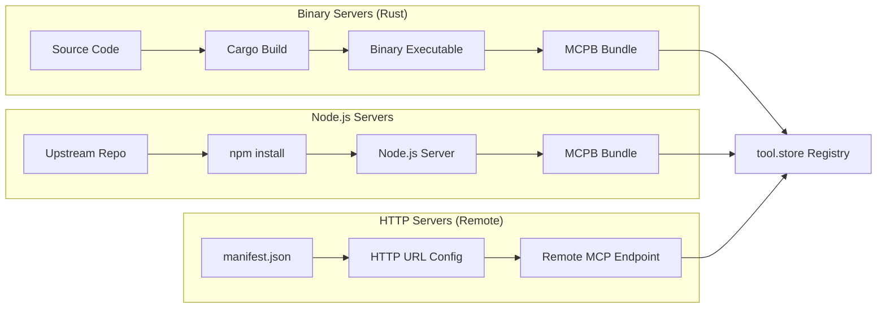
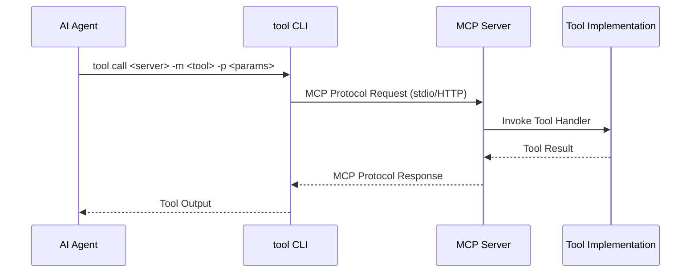
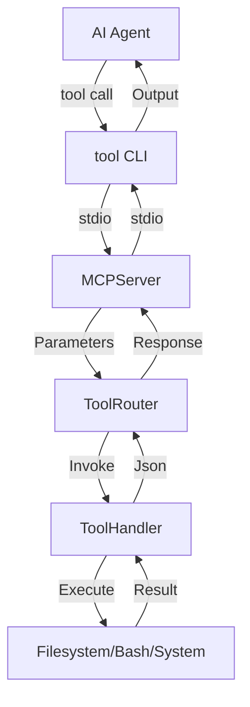
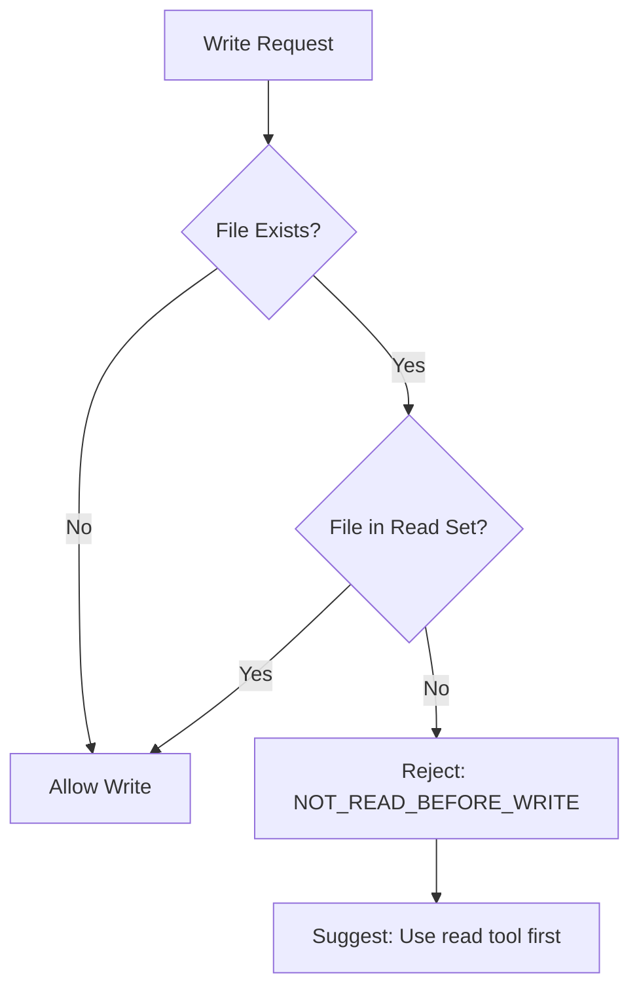
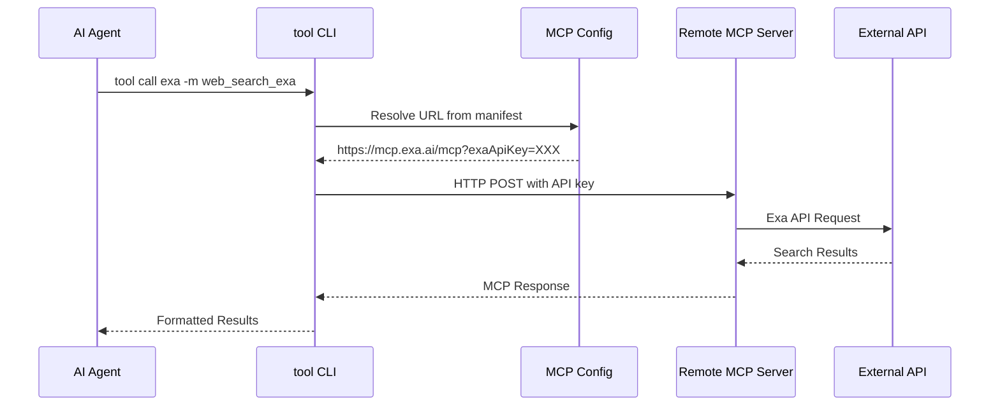

# Tool-Library Exploration

## Overview

The **tool-library** repository is a collection of MCP (Model Context Protocol) servers for AI agents, developed by zerocore-ai. It provides a modular architecture where each "server" is an independent MCP service that exposes tools for AI agents to interact with external systems, execute commands, manage files, and access various APIs.

The repository is organized into two main categories:
- **Core**: First-party Rust-based MCP servers providing fundamental capabilities (bash execution, filesystem operations, system utilities, etc.)
- **External**: Third-party MCP servers packaged as wrappers around upstream projects, distributed via tool.store registry

All servers are written in Rust and use the `rmcp` crate (version 0.12) for MCP protocol implementation. They are distributed as MCPB (MCP Bundle) packages that can be installed via the `tool-cli` utility from https://github.com/zerocore-ai/tool-cli.

The core servers are based on Claude Code's tool designs and implement comprehensive functionality including:
- Timeout handling and working directory validation
- Output truncation for large responses
- Structured error handling with error codes
- Extensive unit and integration tests

## Repository

| Property | Value |
|----------|-------|
| **Remote URL** | git@github.com:zerocore-ai/tool-library |
| **Current Branch** | main |
| **Recent Commit** | `eb8cbe1` - refactor: rename submodules and add notion/playwright (#40) |
| **License** | Apache-2.0 |

### Git History (Last 5 Commits)
```
eb8cbe1 refactor: rename submodules and add notion/playwright (#40)
352509a feat: add context7 and exa MCP submodules (#39)
5945165 chore: update submodule refs (#38)
cbedf97 refactor: simplify tool names and update submodule refs (#37)
23da9c8 chore: update submodule refs with simplified release workflows (#36)
```

## Directory Structure

```
tool-library/
├── core/                           # First-party Rust MCP servers
│   ├── bash/                       # Shell command execution
│   │   ├── Cargo.toml
│   │   ├── Cargo.lock
│   │   ├── src/
│   │   │   ├── lib.rs              # Server implementation with exec tool
│   │   │   └── main.rs             # Entry point
│   │   ├── manifest.json           # MCPB manifest for tool.store
│   │   ├── README.md
│   │   └── .mcpbignore
│   ├── filesystem/                 # File operations (read, write, edit, glob, grep)
│   │   ├── Cargo.toml
│   │   ├── src/
│   │   │   ├── lib.rs              # Full filesystem server implementation
│   │   │   └── main.rs
│   │   ├── manifest.json
│   │   └── README.md
│   ├── system/                     # System utilities (sleep, datetime, random)
│   │   ├── Cargo.toml
│   │   ├── src/
│   │   │   ├── lib.rs              # System tools implementation
│   │   │   └── main.rs
│   │   ├── manifest.json
│   │   └── README.md
│   ├── elicitation/                # User input via structured questions [submodule]
│   ├── opendata/                   # Open data access [submodule]
│   ├── plugins/                    # Plugin registry search [submodule]
│   ├── terminal/                   # PTY-based terminal sessions [submodule]
│   ├── todolist/                   # Session-scoped task tracking [submodule]
│   └── web/                        # Web fetch and search [submodule]
│
├── external/                       # Third-party MCP server wrappers
│   ├── atlassian/                  # Jira and Confluence integration [submodule]
│   ├── context7/                   # Context7 MCP [submodule]
│   ├── elastic/                    # Elasticsearch operations [submodule]
│   ├── exa/                        # Exa AI web search (remote HTTP server)
│   ├── github/                     # GitHub API access (remote HTTP server)
│   ├── linear/                     # Linear project management [submodule]
│   ├── monday/                     # Monday.com workspace (Node.js upstream)
│   │   ├── upstream/               # Original mondaycom/mcp repository
│   │   ├── server/                 # Wrapper server
│   │   ├── scripts/
│   │   ├── manifest.json
│   │   └── package.json
│   ├── mongodb/                    # MongoDB database operations (Node.js upstream)
│   │   ├── upstream/               # Original mongodb/mongodb-mcp-server
│   │   ├── server/
│   │   ├── scripts/
│   │   └── manifest.json
│   ├── notion/                     # Notion workspace (Node.js upstream)
│   │   ├── upstream/               # Original makenotion/notion-mcp-server
│   │   ├── server/
│   │   ├── scripts/
│   │   └── manifest.json
│   └── playwright/                 # Browser automation (Node.js upstream)
│       ├── upstream/               # Original microsoft/playwright-mcp
│       ├── server/
│       ├── scripts/
│       └── manifest.json
│
├── scripts/
│   └── release.sh                  # Release automation script
├── Makefile                        # Build system for cross-compilation
├── Cross.toml                      # Cross-rs configuration for Linux builds
├── .gitmodules                     # Git submodule definitions (18 submodules)
├── action-plan.md                  # GitHub Action specification for MCPB bundling
└── README.md                       # Project overview and usage
```

## Architecture

### High-Level Component Diagram

```mermaid
graph TB
    subgraph "Tool-Library Repository"
        subgraph "Core Servers (Rust)"
            bash["bash - Shell Execution"]
            filesystem["filesystem - File Operations"]
            system["system - System Utilities"]
            elicitation["elicitation - User Input"]
            terminal["terminal - PTY Sessions"]
            todolist["todolist - Task Tracking"]
            web["web - Web Fetch/Search"]
            plugins["plugins - Plugin Registry"]
            opendata["opendata - Open Data"]
        end

        subgraph "External Servers (Wrappers)"
            exa["exa - AI Web Search (HTTP)"]
            github["github - GitHub API (HTTP)"]
            linear["linear - Project Management"]
            monday["monday - Monday.com (Node.js)"]
            mongodb["mongodb - Database Ops (Node.js)"]
            notion["notion - Workspace (Node.js)"]
            playwright["playwright - Browser Automation"]
            atlassian["atlassian - Jira/Confluence"]
            elastic["elastic - Elasticsearch"]
            context7["context7 - Code Context"]
        end
    end

    subgraph "Distribution"
        mcpb["MCPB Bundles"]
        toolstore["tool.store Registry"]
        toolcli["tool CLI"]
    end

    bash --> mcpb
    filesystem --> mcpb
    system --> mcpb
    exa --> toolstore
    github --> toolstore
    monday --> toolstore

    mcpb --> toolstore
    toolstore --> toolcli
    toolcli --> agents["AI Agents"]
```



### Server Type Architecture



### MCP Protocol Integration



## Component Breakdown

### Core Servers (Rust)

| Server | Tools | Description | Runtime | Key Implementation Details |
|--------|-------|-------------|---------|---------------------------|
| **bash** | `exec` | Shell command execution with timeout, working directory, output truncation | Binary | Uses `tokio::process::Command`, validates working directory, truncates output at 30K chars, timeout max 600s |
| **filesystem** | `read`, `write`, `edit`, `glob`, `grep` | File operations with sandbox support, read-before-write constraints | Binary | Uses `glob`, `grep-regex`, `grep-searcher`, `ignore` crates; gitignore-aware searching |
| **system** | `sleep`, `get_datetime`, `get_random_integer` | System utilities for timing and randomness | Binary | Uses `chrono` for UTC timestamps, `rand` 0.9 for secure random, max sleep 300s |
| **elicitation** | `clarify` | Structured user input/questions | Binary (submodule) | Submodule - implementation not examined |
| **terminal** | `create`, `destroy`, `list`, `send`, `read`, `info` | PTY-based terminal sessions | Binary (submodule) | Submodule - implementation not examined |
| **todolist** | `get`, `set` | Session-scoped task tracking | Binary (submodule) | Submodule - implementation not examined |
| **web** | `fetch`, `search` | Web fetching and search capabilities | Binary (submodule) | Submodule - implementation not examined |
| **plugins** | `search`, `resolve` | Plugin registry search and resolution | Binary (submodule) | Submodule - implementation not examined |
| **opendata** | (varies) | Open data access | Binary (submodule) | Submodule - implementation not examined |

### External Servers

| Server | Transport | Description | Upstream |
|--------|-----------|-------------|----------|
| **exa** | HTTP | AI-powered web search, code search, research | Remote (mcp.exa.ai) |
| **github** | HTTP | GitHub API for repos, issues, PRs | Remote (api.githubcopilot.com) |
| **linear** | (varies) | Linear project management | Submodule |
| **monday** | Node.js | Monday.com workspace management | mondaycom/mcp |
| **mongodb** | Node.js | MongoDB database operations | mongodb-js/mongodb-mcp-server |
| **notion** | Node.js | Notion workspace content | makenotion/notion-mcp-server |
| **playwright** | Node.js | Browser automation and testing | microsoft/playwright-mcp |
| **atlassian** | (varies) | Jira and Confluence integration | Submodule |
| **elastic** | (varies) | Elasticsearch operations | Submodule |
| **context7** | (varies) | Code context provider | Submodule |

## Entry Points

### Rust Binary Servers

Each Rust server follows a consistent entry point pattern:

**main.rs** (example from bash/server/system):
```rust
use anyhow::Result;
use <server>::Server;
use rmcp::{ServiceExt, transport::stdio};
use tracing_subscriber::{self, EnvFilter};

#[tokio::main]
async fn main() -> Result<()> {
    tracing_subscriber::fmt()
        .with_env_filter(EnvFilter::from_default_env()
            .add_directive(tracing::Level::DEBUG.into()))
        .with_writer(std::io::stderr)
        .with_ansi(false)
        .init();

    let service = Server::new().serve(stdio()).await?;
    service.waiting().await?;
    Ok(())
}
```

### Server Library Pattern

Each server library (`src/lib.rs`) implements:

1. **Constants** - Configuration values (timeouts, max sizes)
2. **Error Types** - Custom enums with `code()` and `to_mcp_error()` methods
3. **Input/Output Types** - Serde structs with JsonSchema for MCP tool schemas
4. **Server Struct** - Holds the `ToolRouter<Self>`
5. **Tool Implementations** - Async methods annotated with `#[tool]` macro
6. **ServerHandler Trait** - Returns `ServerInfo` with protocol version and capabilities
7. **Tests** - Comprehensive unit and integration tests

### Bash Server Implementation Details

**Constants:**
- `DEFAULT_TIMEOUT_MS`: 120,000 (2 minutes)
- `MAX_TIMEOUT_MS`: 600,000 (10 minutes)
- `MAX_OUTPUT_SIZE`: 30,000 characters

**Error Types:**
- `EmptyCommand` - Command is empty or whitespace
- `TimeoutTooLong(u64)` - Timeout exceeds maximum
- `Timeout(u64)` - Command timed out
- `SpawnFailed(String)` - Process spawn failed
- `DirectoryNotFound(String)` - Working directory doesn't exist
- `DirectoryNotAccessible(String)` - Cannot read directory
- `IoError(String)` - I/O error

**exec Tool Input:**
```rust
pub struct ExecInput {
    pub command: String,
    pub description: Option<String>,
    pub timeout_ms: Option<u64>,
    pub working_directory: Option<String>,
}
```

**exec Tool Output:**
```rust
pub struct ExecOutput {
    pub stdout: String,
    pub stderr: String,
    pub exit_code: i32,
    pub stdout_truncated: bool,
    pub stderr_truncated: bool,
    pub duration_ms: u64,
}
```

### System Server Implementation Details

**Constants:**
- `MAX_SLEEP_DURATION_MS`: 300,000 (5 minutes)

**Tools:**
- `sleep` - Pause execution (validates duration < 5 min)
- `get_datetime` - Returns UTC timestamp in ISO8601 and Unix milliseconds
- `get_random_integer` - Cryptographically secure random in range [min, max]

### Filesystem Server Implementation Details

**Tools:**
- `read` - Read file with offset/limit, returns content with line numbers
- `write` - Write content to file
- `edit` - String replacement with optional replace_all
- `glob` - Find files matching glob pattern
- `grep` - Regex search with context lines, file type filtering

**Dependencies:**
- `glob` 0.3 - Pattern matching
- `grep-regex`, `grep-searcher`, `grep-matcher` - Content searching
- `ignore` 0.4 - Gitignore-aware file walking

### MCPB Manifest Structure

Each server includes a `manifest.json` conforming to MCPB specification v0.3:

```json
{
  "manifest_version": "0.3",
  "name": "bash",
  "display_name": "Bash MCP",
  "version": "0.1.0",
  "server": {
    "type": "binary",
    "entry_point": "dist/bash",
    "mcp_config": {
      "command": "${__dirname}/dist/bash",
      "args": [],
      "env": {}
    }
  },
  "tools": [...],
  "_meta": {
    "store.tool.mcpb": {
      "runtime": "rust",
      "scripts": { "build": "cargo build --release && mkdir -p dist && ..." }
    }
  }
}
```

## Data Flow

### Request Flow (Binary Server)



### Filesystem Server Read-Before-Write Flow



### HTTP Server Flow (Remote)



## External Dependencies

### Rust Dependencies (Common)

| Crate | Version | Purpose |
|-------|---------|---------|
| `rmcp` | 0.12 | MCP protocol implementation (server, macros, transport) |
| `tokio` | 1 | Async runtime with macros, rt-multi-thread, io, process, time |
| `serde` | 1.0 | Serialization/deserialization with derive |
| `serde_json` | 1.0 | JSON support |
| `schemars` | 1 | JSON Schema generation for tool definitions |
| `anyhow` | 1.0 | Error handling |
| `thiserror` | 2 | Custom error types |
| `tracing` | 0.1 | Instrumentation and logging |
| `tracing-subscriber` | 0.3 | Logging subscriber with env-filter |
| `chrono` | 0.4 | Date/time handling (system server) |
| `rand` | 0.9 | Random number generation (system server) |

### Filesystem-Specific Dependencies

| Crate | Purpose |
|-------|---------|
| `glob` | 0.3 | Glob pattern matching |
| `grep-regex` | 0.1 | Regex search |
| `grep-searcher` | 0.1 | File content searching |
| `grep-matcher` | 0.1 | Search matchers |
| `ignore` | 0.4 | Gitignore-aware file walking |

### Node.js Dependencies (External Servers)

External servers using Node.js upstreams include:
- `@modelcontextprotocol/sdk` - MCP SDK
- Service-specific SDKs (e.g., `@mondaycom/mcp`, `mongodb`, `notion`)

## Configuration

### Build Configuration (Makefile)

The Makefile provides targets for building all servers across platforms:

```makefile
SERVERS := bash elicitation filesystem plugins system terminal todolist web
TARGETS := darwin-arm64 linux-arm64 linux-x86_64

# Build all servers for all platforms
make build-all

# Build single server for all platforms
make build-bash

# Build single server for specific platform
make build-bash-darwin-arm64
```

### Cross-Compilation (Cross.toml)

```toml
[target.aarch64-unknown-linux-gnu]
pre-build = [
    "dpkg --add-architecture arm64 || true",
    "apt-get update",
    "apt-get install -y libssl-dev:arm64 pkg-config"
]

[target.x86_64-unknown-linux-gnu]
pre-build = [
    "apt-get update",
    "apt-get install -y libssl-dev pkg-config"
]
```

### Server Configuration (filesystem example)

```rust
pub struct ServerConfig {
    pub allowed_directories: Option<Vec<PathBuf>>,
    pub require_read_before_write: bool,
    pub max_read_size: usize,
    pub max_write_size: usize,
    pub reject_binary_files: bool,
}
```

### MCPB Manifest Configuration

External HTTP servers define user configuration in manifest:

```json
{
  "user_config": {
    "api_key": {
      "type": "string",
      "title": "Exa API Key",
      "required": true,
      "sensitive": true
    }
  },
  "server": {
    "transport": "http",
    "mcp_config": {
      "url": "https://mcp.exa.ai/mcp?exaApiKey=${user_config.api_key}"
    }
  }
}
```

## Testing

### Unit Tests (Rust)

Each Rust server includes comprehensive unit tests organized into categories:

**Test Categories:**
1. **Serialization Tests** - Verify JSON serialization/deserialization of input/output types
2. **Error Tests** - Validate error codes and messages
3. **Helper Function Tests** - Test utility functions in isolation (e.g., `truncate_output`, `validate_working_directory`)
4. **Functional Tests** - End-to-end tool execution tests
5. **Integration Tests** - Cross-component tests with `TempDir`

**Example Test Coverage (bash server - 25+ tests):**
- `test_exec_simple_command` - Basic command execution
- `test_exec_empty_command` / `test_exec_whitespace_only_command` - Input validation
- `test_exec_stderr_output` / `test_exec_mixed_stdout_stderr` - Stream handling
- `test_exec_nonzero_exit_code` - Exit code propagation
- `test_exec_command_not_found` - Error handling
- `test_exec_with_working_directory` / `test_exec_invalid_working_directory` - Path validation
- `test_exec_timeout_too_long` / `test_exec_timeout_triggered` - Timeout behavior
- `test_exec_special_characters` / `test_exec_pipe_command` / `test_exec_chained_commands` - Shell features
- `test_exec_environment_variable` - Env var handling
- `test_exec_duration_tracking` - Timing accuracy
- `test_exec_large_output_truncation` - Output size limits (30K chars)
- `test_exec_binary_output_handling` - Binary data sanitization
- `test_exec_with_tempdir` - Integration test with temp directory

**Example Test (bash server):**
```rust
#[tokio::test]
async fn test_exec_simple_command() {
    let server = Server::new();
    let params = Parameters(ExecInput {
        command: "echo hello".to_string(),
        description: None,
        timeout_ms: None,
        working_directory: None,
    });

    let result = server.exec(params).await;
    assert!(result.is_ok());
    let output = result.unwrap().0;
    assert_eq!(output.stdout.trim(), "hello");
    assert_eq!(output.exit_code, 0);
    assert!(output.duration_ms < 5000);
}
```

**Example Test Coverage (system server - 20+ tests):**
- `test_sleep_zero_duration` / `test_sleep_normal_duration` - Sleep behavior
- `test_sleep_at_max_boundary` / `test_sleep_exceeds_max_duration` - Boundary conditions
- `test_get_datetime_returns_valid_iso8601` - Timestamp format validation
- `test_get_datetime_consistency` - ISO8601/Unix_ms consistency
- `test_get_random_integer_normal_range` / `test_get_random_integer_same_min_max` - Random generation
- `test_get_random_integer_invalid_range` - Input validation
- `test_get_random_integer_negative_range` / `test_get_random_integer_spans_zero` - Negative handling
- `test_get_random_integer_distribution` - Randomness quality (20 iterations)

### Running Tests

```bash
# Run tests for a specific server
cd core/bash && cargo test

# Run tests with output
cargo test -- --nocapture

# Run specific test
cargo test test_exec_simple_command
```

### Test Output Example

The bash server tests verify:
- Output truncation keeps the tail (last 30K characters)
- Binary bytes are replaced with Unicode replacement character
- Working directory validation checks existence and readability
- Duration tracking is accurate within tolerance

### External Server Tests

Node.js-based external servers include TypeScript tests:
- monday/upstream: 19 test files covering board tools, item tools, workspace tools
- Tests use Jest framework
- Test command: `npm test` in upstream directories

## Key Insights

### 1. Modular MCP Server Architecture

The repository demonstrates a clean modular approach where each server is:
- Independently buildable and deployable
- Self-contained with its own Cargo.toml and manifest.json
- Following consistent patterns for tool definition and error handling
- Using the same MCP protocol version (V_2024_11_05) and rmcp crate

### 2. MCPB (Model Context Protocol Bundle) Standard

The project uses the MCPB specification (v0.3) for packaging:
- Binary servers compiled to native executables
- HTTP servers configured via remote URLs
- Node.js servers bundled with dependencies
- All distributed via tool.store registry
- Manifest includes static_responses for tools/list optimization

### 3. Submodule-Based Code Management

Core servers are managed as git submodules pointing to:
- `git@github.com:zerocore-ai-library/<name>.git`
- Allows independent versioning and development
- Enables reuse across multiple projects
- Release script pulls artifacts from submodule GitHub releases

### 4. Comprehensive Error Handling Pattern

All servers implement consistent error handling:
- Custom error enums using `thiserror` derive macros
- Error codes for programmatic handling (e.g., `EMPTY_COMMAND`, `TIMEOUT`)
- Structured error data included in MCP responses
- Helper method `to_mcp_error()` converts to MCP protocol errors

### 5. Read-Before-Write Safety

The filesystem server implements a safety mechanism:
- Tracks read files in session state
- Prevents writes to files not previously read
- Helps prevent accidental data loss
- Configurable via `require_read_before_write` flag

### 6. Cross-Platform Build System

The Makefile with cross-rs enables:
- Building for macOS (ARM64 native, x86_64 native)
- Building for Linux (ARM64, x86_64 via cross-compilation)
- Pre-build scripts install OpenSSL dependencies in cross containers
- All from a single Rust codebase

### 7. Output Truncation Strategy

Large outputs are handled gracefully:
- Maximum 30,000 characters per stream (stdout/stderr)
- Truncation keeps the tail (most recent output)
- Boolean flags indicate truncation occurred
- Prevents context window exhaustion

### 8. Timeout Enforcement

All potentially long-running operations enforce timeouts:
- Bash exec: default 120s, max 600s
- System sleep: max 300s
- Tokio's `time::timeout()` wraps async operations
- Timeout errors include actual elapsed time

### 9. Remote HTTP Server Pattern

Some servers (exa, github) use remote HTTP transport:
- No local binary required
- API keys passed via URL parameters
- Reduces client-side complexity
- Defined in manifest.json with `user_config` schema

### 10. Extensive Test Coverage

Core servers include 20-30+ tests each:
- Serialization/deserialization validation
- Error condition coverage
- Functional end-to-end tests
- Integration tests with temporary directories
- Boundary condition tests (max values, empty inputs)

## Open Questions

1. **Unimplemented Core Servers**: Several core submodules (elicitation, terminal, todolist, web, plugins, opendata) show minimal content in their git trees. What is the implementation status and timeline for these servers?

2. **Windows Support**: The Makefile and manifests mention `win32-arm64` and `win32-x86_64` targets, but Cross.toml only configures Linux cross-compilation. How are Windows binaries built? Is there a separate Windows build process?

3. **External Server Gaps**: Some external submodules (atlassian, elastic, context7, linear) appear to be placeholders or have minimal content. Are these in active development or deprecated?

4. **tool-cli Integration**: The project references `tool-cli` extensively for installation and execution. What is the exact relationship between tool-library and tool-cli repositories? Are they versioned together?

5. **MCPB Specification**: The manifest uses `manifest_version: "0.3"`. Where is the official MCPB specification documented? Is it part of anthropics/mcpb or a separate spec?

6. **Security Model**: What sandboxing is applied to bash/terminal servers? Are there configurable restrictions on allowed commands or blocked patterns (e.g., rm -rf, fork bombs)?

7. **Version Management**: How are breaking changes handled across the submodule ecosystem? Is there a coordinated release process or semantic versioning strategy?

8. **Testing Coverage**: While Rust servers have extensive unit tests, how is integration testing handled across the full MCP protocol stack? Are there end-to-end tests with actual AI agents?

9. **Performance Characteristics**: What are the performance implications of stdio transport vs HTTP transport for MCP servers? Are there benchmarks or latency targets?

10. **Plugin System**: The `plugins` server is listed but its implementation is not visible. How does the plugin discovery and resolution mechanism work? What is the plugin registry?

11. **Binary Detection**: How does the filesystem server detect binary files? Is it based on null byte detection, MIME types, or file extensions?

12. **Concurrency Model**: How does the server handle concurrent tool invocations? Is there shared state that could cause race conditions?

13. **Memory Limits**: Are there memory limits for tool execution? How is memory usage controlled for operations like large file reads or grep across many files?

14. **Localization**: Are error messages and tool descriptions localized? Is there support for multiple languages?

---

*Exploration completed using the .agents/exploration-agent.md workflow.*
