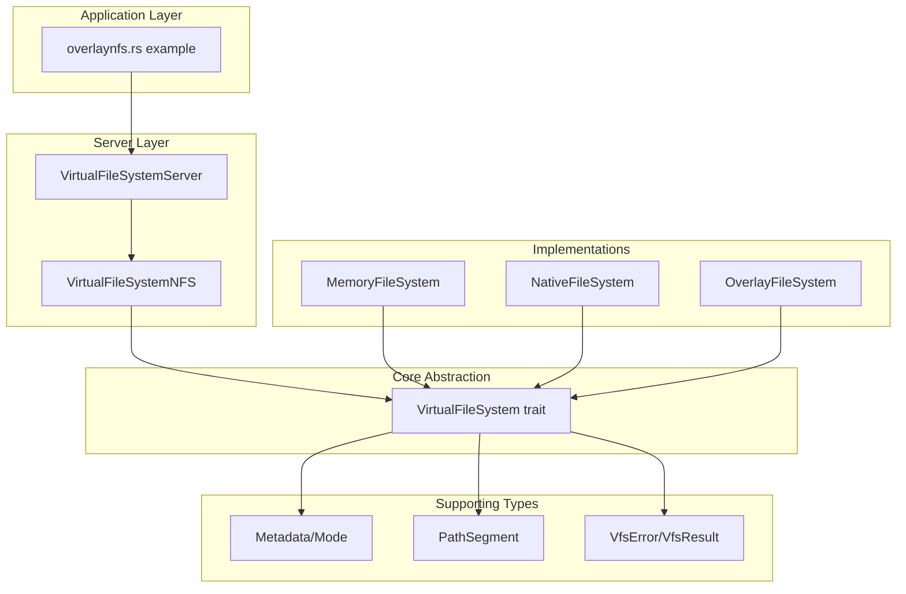
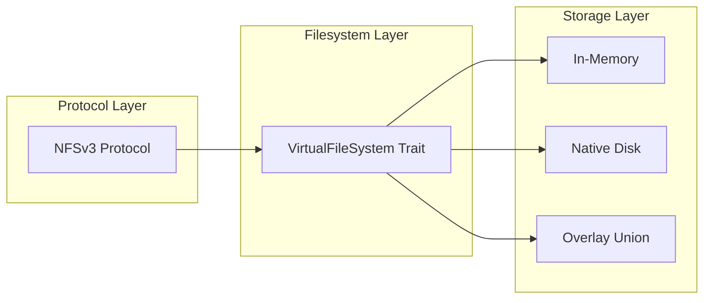
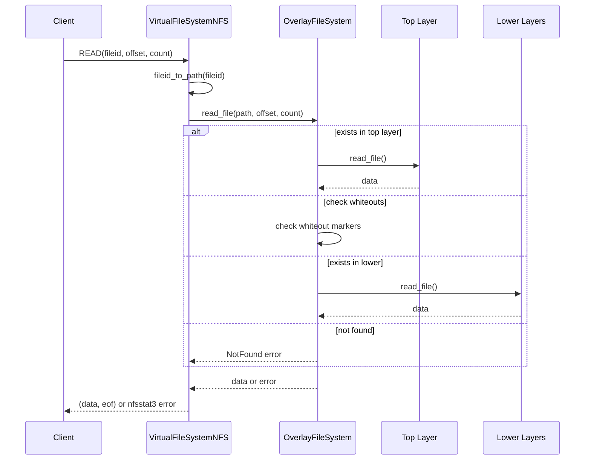
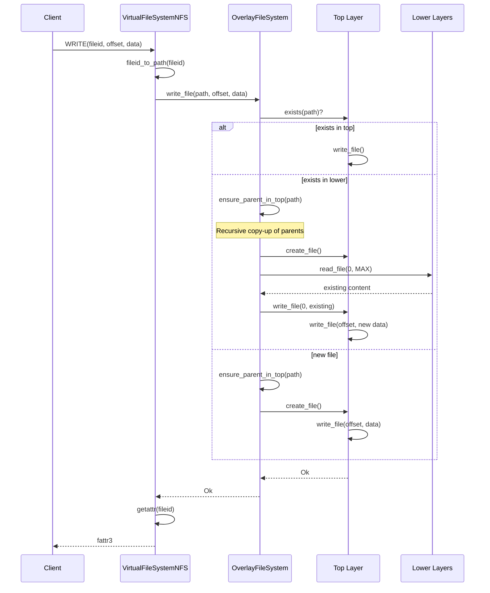

# VirtualFS Exploration Report

## Overview

`virtualfs` is a Rust library that provides an abstraction layer for virtual file systems. It defines a unified interface (`VirtualFileSystem` trait) that can be implemented by various backends including in-memory filesystems, native disk-based filesystems, and overlay filesystems. The library also includes an NFS server implementation that can expose any virtual filesystem implementation over the NFSv3 protocol.

The project is designed for use in container runtimes and sandboxing environments, as evidenced by its OCI-compatible whiteout file support in the overlay filesystem implementation and its integration with the broader MicroSandbox/zerocore-ai ecosystem.

## Repository

- **Remote**: `git@github.com:zerocore-ai/virtualfs` (formerly under microsandbox/microsandbox#175)
- **Branch**: `main` (up to date with `origin/main`)
- **License**: Apache-2.0
- **Authors**: Team MicroSandbox <team@microsandbox.dev>
- **Recent Commits**:
  - `633f7cb` - feat: move project from microsandbox (microsandbox/microsandbox#175)
  - `b296def` - Initial commit

## Directory Structure

```
virtualfs/
├── Cargo.toml              # Package manifest with dependencies
├── Cargo.lock              # Locked dependency versions
├── LICENSE                 # Apache-2.0 license
├── README.md               # Brief project description
├── .gitignore              # Git ignore patterns (target/, *.bk, private/, etc.)
├── examples/
│   └── overlaynfs.rs       # Example: NFS server with overlay filesystem
└── lib/
    ├── lib.rs              # Library root, module declarations and exports
    ├── filesystem.rs       # Core VirtualFileSystem trait definition
    ├── error.rs            # Error types (VfsError, VfsResult, AnyError)
    ├── metadata.rs         # File metadata structures (Mode, Permissions, timestamps)
    ├── segment.rs          # PathSegment type for safe path components
    ├── defaults.rs         # Default constants (NFS host/port)
    ├── implementations/
    │   ├── mod.rs          # Module exports for implementations
    │   ├── memoryfs.rs     # In-memory filesystem implementation
    │   ├── nativefs.rs     # Native disk-based filesystem implementation
    │   └── overlayfs.rs    # Overlay/union filesystem with OCI whiteouts
    └── server/
        ├── mod.rs          # Module exports for server
        ├── server.rs       # VirtualFileSystemServer (NFS TCP listener)
        └── nfs.rs          # NFSv3 protocol implementation (VirtualFileSystemNFS)
```

## Architecture

The library follows a clean layered architecture with clear separation of concerns:



### Component Layers



## Component Breakdown

### Core Trait: `VirtualFileSystem`

The `VirtualFileSystem` trait (in `lib/filesystem.rs`) defines 14 asynchronous operations that any filesystem implementation must provide:

| Operation | Description |
|-----------|-------------|
| `exists(&path)` | Check if a file/directory exists |
| `create_file(&path, exists_ok)` | Create an empty file |
| `create_directory(&path)` | Create a new directory |
| `create_symlink(&path, &target)` | Create a symbolic link |
| `read_file(&path, offset, length)` | Read file data with offset/length |
| `read_directory(&path)` | List directory contents |
| `read_symlink(&path)` | Read symlink target |
| `get_metadata(&path)` | Get file/directory metadata |
| `set_metadata(&path, metadata)` | Update metadata |
| `write_file(&path, offset, data)` | Write data at offset |
| `remove(&path)` | Delete file or empty directory |
| `rename(&old_path, &new_path)` | Move/rename file or directory |

All operations return `VfsResult<T>` (a type alias for `Result<T, VfsError>`) and use Tokio's async runtime.

### Error Handling (`lib/error.rs`)

The error system provides comprehensive error types:

- **`VfsError`**: Enum with 15+ variants covering all filesystem error conditions:
  - Path errors: `ParentDirectoryNotFound`, `AlreadyExists`, `NotFound`, `NotADirectory`, `NotAFile`, `NotASymlink`, `NotEmpty`
  - Operation errors: `InvalidOffset`, `PermissionDenied`, `ReadOnlyFilesystem`, `InvalidSymlinkTarget`
  - Path component errors: `EmptyPathSegment`, `InvalidPathComponent`
  - System errors: `Io` (wraps `std::io::Error`), `Custom` (wraps `AnyError`)
  - Overlay-specific: `OverlayFileSystemRequiresAtLeastOneLayer`

- **Conversion to NFS errors**: `VfsError` implements `From<VfsError> for nfsserve::nfs::nfsstat3`, mapping each error to the appropriate NFSv3 status code.

### Metadata System (`lib/metadata.rs`)

Rich Unix-style metadata support:

- **`Metadata` struct**: Contains file mode, size, timestamps (created/modified/accessed), and Unix uid/gid
- **`Mode` type** (Unix only): 32-bit integer with:
  - File type bits (S_IFMT): File (S_IFREG), Directory (S_IFDIR), Symlink (S_IFLNK)
  - Permission bits: User (S_IRWXU), Group (S_IRWXG), Other (S_IRWXO)
- **`ModePerms` struct**: Type-safe permission flags with `User`, `Group`, `Other` enums
- **Builder pattern**: Permissions can be combined using bitwise OR (e.g., `User::RW | Group::R | Other::R` for 0o644)

### Path Handling (`lib/segment.rs`)

- **`PathSegment`**: Newtype wrapper around `OsString` ensuring valid single path components
- Validates that segments don't contain separators (`/` or `\`)
- Rejects special components (`.` and `..`)
- Provides conversions to/from `Component`, `PathBuf`, `&OsStr`, `&[u8]`

### Filesystem Implementations (`lib/implementations/`)

#### 1. `MemoryFileSystem`

An in-memory filesystem for testing and temporary storage:

- **Data structures**:
  - `Dir`: Contains metadata and `HashMap<PathSegment, Entity>` for entries
  - `File`: Contains metadata and `Vec<u8>` content
  - `Symlink`: Contains metadata and target `PathBuf`
  - `Entity`: Enum with `Dir`, `File`, `Symlink` variants
- **Concurrency**: Uses `Arc<RwLock<Dir>>` for thread-safe concurrent access
- **Features**: Full async support, comprehensive test suite with 15+ tests

#### 2. `NativeFileSystem`

A disk-backed filesystem wrapping Tokio's async file operations:

- **Root-relative**: All operations relative to configured `root_path`
- **Direct mapping**: Each virtual operation maps to corresponding `tokio::fs` call
- **Permission handling**: Converts between virtual `Mode` and native Unix permissions
- **Limited reader**: Custom `LimitedReader` wrapper for offset+length reads

#### 3. `OverlayFileSystem`

An OCI-compatible overlay/union filesystem:

- **Layer structure**:
  - Single writable `top_layer` (upperdir)
  - Multiple read-only `lower_layers`
- **OCI whiteout support**:
  - Whiteout files: `.wh.<filename>` to hide files from lower layers
  - Opaque markers: `.wh..wh..opq` to mask entire directories
- **Copy-up mechanism**:
  - `ensure_parent_in_top()`: Recursively creates parent directories in top layer
  - `ensure_parent_in_top_recursive()`: Full subtree copy-up for directories
- **Merged view**: `read_directory()` returns union of all layers with whiteouts applied
- **Layer ordering**: Provided from lowest to highest; last becomes writable top

### NFS Server (`lib/server/`)

#### `VirtualFileSystemServer<F>`

Generic TCP server wrapper:

- Binds to configurable host:port
- Creates `VirtualFileSystemNFS` wrapper
- Uses `nfsserve::tcp::NFSTcpListener` for NFS TCP transport

#### `VirtualFileSystemNFS<F>`

NFSv3 protocol implementation:

- **File ID management**:
  - Atomic counter for unique file IDs
  - Bidirectional mappings: `fileid_to_path_map` and `path_to_fileid_map`
  - Symbol table (`intaglio::SymbolTable`) for efficient path storage
- **Path resolution**: Converts between NFS file IDs and filesystem paths
- **Metadata conversion**: Maps `Metadata` to NFS `fattr3` structures
- **Capabilities**: Reports `VFSCapabilities::ReadWrite`

## Entry Points

### Library Entry Point (`lib/lib.rs`)

```rust
mod defaults;
mod error;
mod filesystem;
mod implementations;
mod metadata;
mod segment;
mod server;

// All modules re-exported at crate root
pub use defaults::*;
pub use error::*;
pub use filesystem::*;
pub use implementations::*;
pub use metadata::*;
pub use segment::*;
pub use server::*;
```

### Example Application (`examples/overlaynfs.rs`)

Command-line NFS server:

```bash
cargo run --example overlaynfs /path/to/layer1 /path/to/layer2 --host 127.0.0.1 --port 2049
```

Flow:
1. Parse CLI args (layers, host, port)
2. Create `NativeFileSystem` for each layer path
3. Wrap in `OverlayFileSystem`
4. Start `VirtualFileSystemServer`

## Data Flow

### Read Operation Flow



### Write Operation with Copy-Up



## External Dependencies

| Dependency | Version | Purpose |
|------------|---------|---------|
| `async-trait` | 0.1 | Async trait method support |
| `tokio` | 1.42 (full) | Async runtime, async I/O |
| `thiserror` | 2.0 | Error type derivation |
| `anyhow` | 1.0 | Contextual error handling |
| `futures` | 0.3 | Async utilities |
| `chrono` | 0.4 (serde) | Timestamps with serialization |
| `getset` | 0.1 | Getter method generation |
| `cfg-if` | 1.0 | Conditional compilation |
| `async-recursion` | 1.1 | Recursive async functions |
| `nfsserve` | 0.10 | NFSv3 protocol implementation |
| `intaglio` | 1.10 | Symbol table for path storage |
| `uzers` | 0.12 | Unix user/group ID retrieval |
| `pretty-error-debug` | 0.3 | Enhanced error Debug output |
| `tracing` | 0.1 | Logging/tracing instrumentation |
| `tracing-subscriber` | 0.3 | Tracing subscriber implementation |

**Development Dependencies**:
- `clap` | 4.5 (derive, color) | CLI argument parsing
- `tempfile` | 3.15 | Temporary directory for tests

## Configuration

### Default Constants (`lib/defaults.rs`)

```rust
pub const DEFAULT_NFS_HOST: &str = "127.0.0.1";
pub const DEFAULT_NFS_PORT: u32 = 2049;  // Standard NFS port
```

### Build Configuration

- **Edition**: Rust 2021
- **Platform support**:
  - Full Unix support (permissions, uid/gid, symlinks)
  - Windows support with reduced functionality (no Unix permissions)
- **Conditional compilation**: Uses `cfg-if` and `#[cfg(unix)]` extensively

### Git Configuration

`.gitignore` patterns:
- Cargo build artifacts (`target/`)
- Rustfmt backups (`*.rs.bk`)
- Monocore build outputs (`monocore/build/`, `libkrun*`)
- Development artifacts (`.history`, `*.temp`, `private/`)

## Testing

The library includes extensive test coverage:

### Unit Tests

**`segment.rs`**: 12 tests for path segment validation
- Valid segments, invalid separators, special components

**`metadata.rs`**: 15 tests for metadata operations (Unix only)
- Mode creation, permission combinations, display formatting, uid/gid handling

**`memoryfs.rs`**: 15 async tests
- Create/read/write/remove for files, directories, symlinks
- Concurrent access, nested paths, metadata operations

**`nativefs.rs`**: 11 async tests
- Mirrors MemoryFileSystem test suite against actual filesystem

**`overlayfs.rs`**: 35+ async tests
- Whiteout behavior, opaque directories, copy-up semantics
- Layer precedence, rename operations with markers
- Merged directory views

**`nfs.rs`**: 13 async tests
- NFS protocol operations: lookup, getattr, setattr, create, mkdir
- Read/write, symlink, rename, readdir, readlink

### Test Patterns

```rust
#[tokio::test]
async fn test_operation() {
    let fs = MemoryFileSystem::new();
    // Or use helper::setup_fs() for pre-populated filesystems
    // Test operations and assert results
}
```

## Key Insights

1. **Clean Abstraction**: The `VirtualFileSystem` trait provides a well-designed interface that cleanly separates filesystem operations from their implementations. This enables swapping backends without changing calling code.

2. **OCI Compliance**: The overlay filesystem follows OCI image specification for whiteout files (`.wh.` prefix), making it suitable for container layer implementations.

3. **Async-First Design**: All operations are async using Tokio, enabling high-concurrency scenarios typical in container runtimes.

4. **Unix-Centric**: Heavy focus on Unix semantics (permissions, uid/gid, symlinks) with conditional compilation for Windows compatibility.

5. **NFS Integration**: The built-in NFS server allows exposing any virtual filesystem implementation over the network, useful for container volume sharing.

6. **Copy-Up Semantics**: The overlay implementation properly handles copy-up of parent directories and full subtrees when modifying lower-layer content.

7. **Path Safety**: The `PathSegment` type enforces valid path components at the type level, preventing path traversal vulnerabilities.

## Open Questions

1. **Hard Link Support**: The NFS implementation hardcodes `nlink: 1`. Does the library need hard link support for certain use cases?

2. **Extended Attributes**: No support for xattrs. Would this be needed for container use cases?

3. **Locking**: No file locking mechanisms. Is this intentional for the use case?

4. **Quota Support**: No filesystem quota mechanisms. May be needed for multi-tenant scenarios.

5. **Audit Logging**: No audit trail for operations. Would this be valuable for security-sensitive deployments?

6. **Performance**: The overlay implementation uses `HashMap` for directory entries and clones paths frequently. Are there performance concerns for large directories?

7. **Persistent Metadata**: MemoryFileSystem loses all state on restart. Is there a need for a persistent metadata store?

8. **NFS Export Options**: No export controls (read-only, access restrictions). Would this be needed for production NFS deployments?
