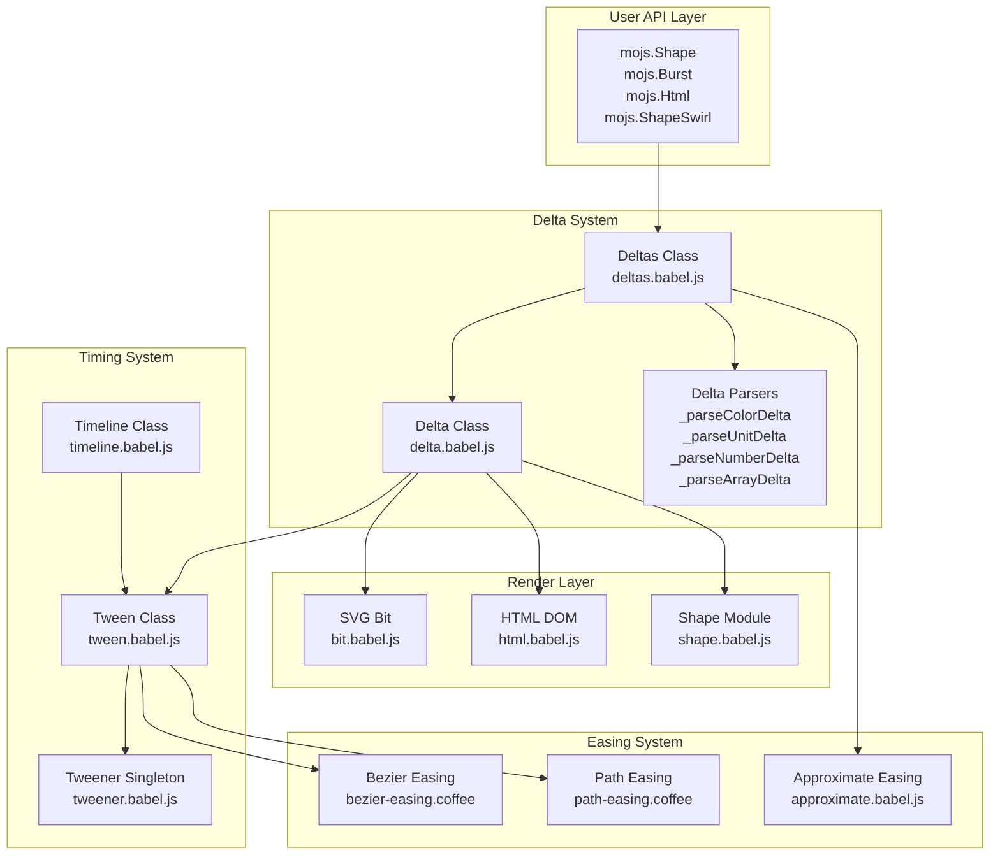
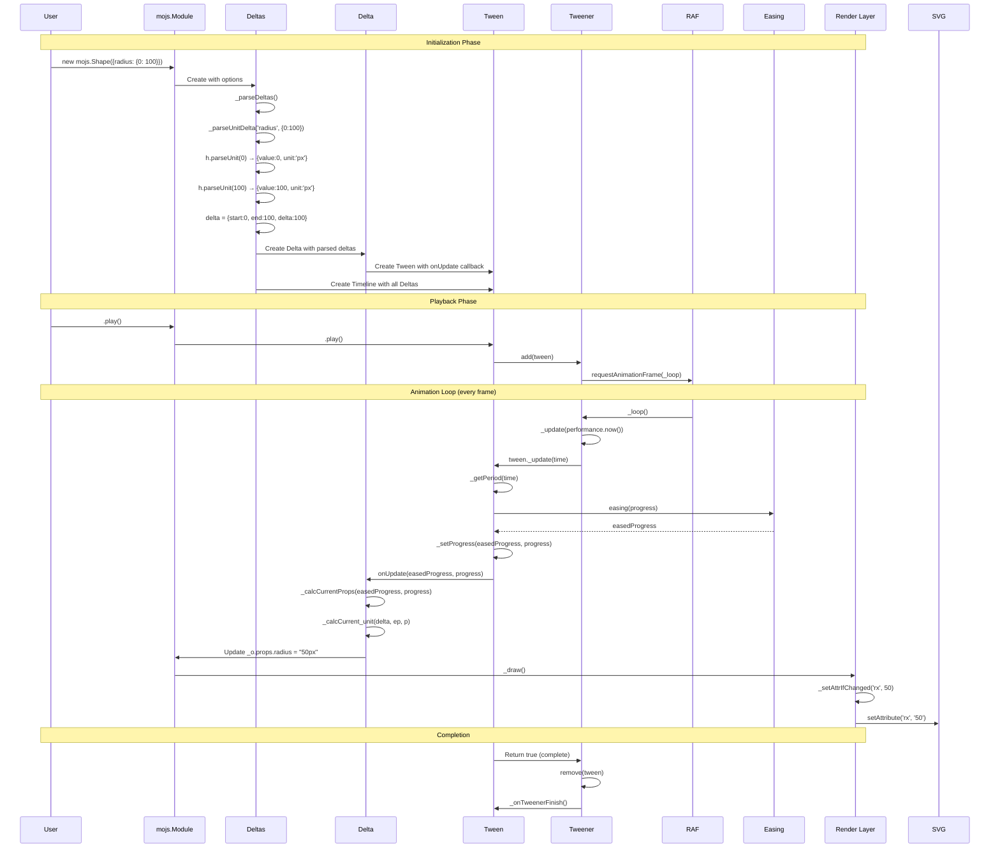
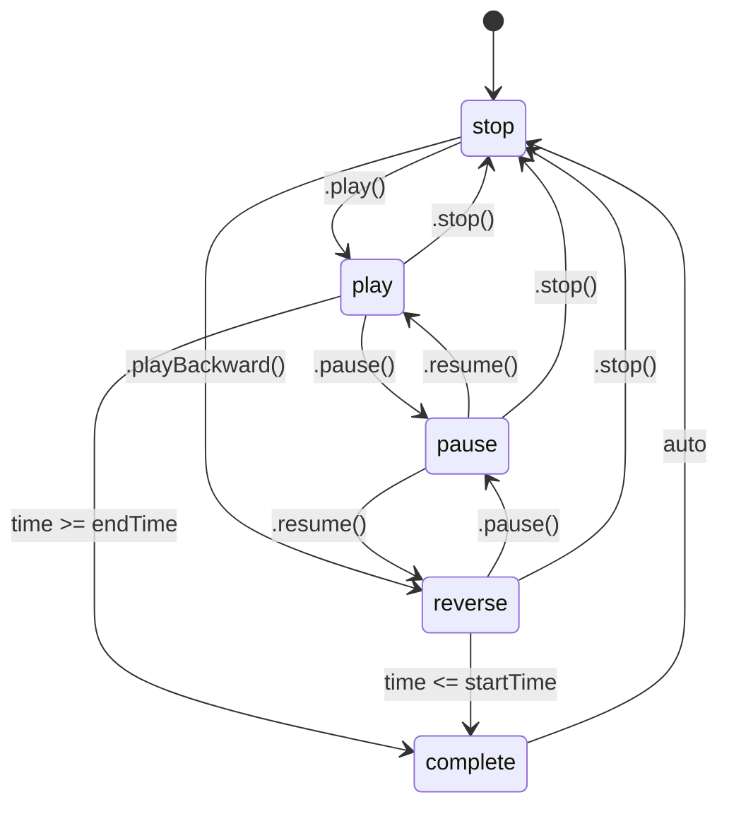

# Deep Technical Exploration: mojs Delta Interpolation System

**Version:** 1.7.1 (@mojs/core)
**Primary Language:** JavaScript (ES6), CoffeeScript

---

## Table of Contents

1. [Executive Summary](#executive-summary)
2. [Delta System Architecture Overview](#delta-system-architecture-overview)
3. [Core Delta Classes](#core-delta-classes)
4. [Delta Creation Pipeline](#delta-creation-pipeline)
5. [Delta Types and Interpolation Mathematics](#delta-types-and-interpolation-mathematics)
6. [SVG vs HTML Animation Paths](#svg-vs-html-animation-paths)
7. [Easing System Integration](#easing-system-integration)
8. [Performance Optimizations](#performance-optimizations)
9. [Animation Loop Integration](#animation-loop-integration)
10. [Module-Specific Delta Handling](#module-specific-delta-handling)
11. [Complete Data Flow](#complete-data-flow)
12. [Mathematical Foundations](#mathematical-foundations)

---

## Executive Summary

The mojs delta interpolation system is a sophisticated, type-safe property interpolation engine that forms the core of the mojs animation library. Unlike traditional CSS property tweens that interpolate raw values, mojs calculates **deltas** (start, end, delta difference) once during initialization and performs efficient interpolation every frame using pre-computed values.

**Key Architectural Decisions:**

1. **Delta-Based Animation:** Properties are parsed into delta objects containing `{start, end, delta, type, curve}` during initialization, enabling O(1) interpolation per frame.

2. **Type-Safe Interpolation:** Four delta types (`color`, `number`, `unit`, `array`) each have specialized interpolation methods optimized for their data characteristics.

3. **Curve Support:** Optional elasticity curves can modulate interpolation, enabling complex effects like bounce, elastic, and custom SVG path-based easing.

4. **Separation of Concerns:** Delta calculation (`deltas.babel.js`), delta interpolation (`delta.babel.js`), and timing (`tween.babel.js`) are completely decoupled.

5. **Retina-Ready:** The system works with raw numeric values until final render, supporting high-DPI displays without precision loss.

---

## Delta System Architecture Overview

### High-Level Component Diagram



### File Structure

```
mojs/src/
├── delta/
│   ├── delta.babel.js      # Single delta calculator (179 lines)
│   └── deltas.babel.js     # Multiple deltas manager (563 lines)
├── easing/
│   ├── bezier-easing.coffee    # Cubic bezier implementation (116 lines)
│   ├── easing.coffee           # Easing parser and registry (191 lines)
│   ├── path-easing.coffee      # SVG path-based easing (278 lines)
│   └── approximate.babel.js    # Function sampling (95 lines)
├── tween/
│   ├── tween.babel.js      # Core Tween engine (1276 lines)
│   ├── tweenable.babel.js  # Tweenable property system (185 lines)
│   ├── tweener.babel.js    # Global RAF loop manager (154 lines)
│   └── timeline.babel.js   # Timeline composition (317 lines)
├── shapes/
│   ├── bit.babel.js        # Base SVG shape class (214 lines)
│   ├── circle.coffee       # Circle/Ellipse shape
│   ├── rect.coffee         # Rectangle shape
│   ├── polygon.coffee      # Polygon shape
│   └── ...                 # Other shapes
├── shape.babel.js          # Shape animation class (634 lines)
├── shape-swirl.babel.js    # Sinusoidal path following (203 lines)
├── burst.babel.js          # Particle burst system (572 lines)
├── html.babel.js           # HTML element animation (540 lines)
├── motion-path.coffee      # Path-based motion (589 lines)
├── module.babel.js         # Base module class (447 lines)
├── tunable.babel.js        # Tunable animation system (217 lines)
├── thenable.babel.js       # Thenable chain pattern (not shown)
└── h.coffee                # Core utilities (609 lines)
```

---

## Core Delta Classes

### Delta Class (`delta.babel.js`)

The `Delta` class is responsible for interpolating a single set of deltas over time. It wraps a `Tween` instance and uses callbacks to update property values.

**Constructor (Lines 5-11):**

```javascript
constructor(o = {}) {
  this._o = o;
  this._createTween(o.tweenOptions);

  // initial properties render
  !this._o.isChained && this.refresh(true);
}
```

The delta constructor:
1. Stores the options object
2. Creates an internal tween for timing
3. Refreshes to initial state (unless chained)

**Tween Creation (Lines 55-71):**

```javascript
_createTween(o = {}) {
  var it = this;
  o.callbackOverrides = {
    onUpdate(ep, p) { it._calcCurrentProps(ep, p); },
  };

  // if not chained - add the onRefresh callback
  if (!this._o.isChained) {
    o.callbackOverrides.onRefresh = function(isBefore, ep, p) {
      it._calcCurrentProps(ep, p);
    };
  }

  o.callbacksContext = this._o.callbacksContext;
  this.tween = new Tween(o);
}
```

The key insight here is that the Delta class delegates timing to a Tween, and only concerns itself with **calculating current property values** based on eased progress.

**Core Interpolation Dispatcher (Lines 79-85):**

```javascript
_calcCurrentProps(easedProgress, p) {
  var deltas = this._o.deltas;
  for (var i = 0; i < deltas.length; i++) {
    var type = deltas[i].type;
    this[`_calcCurrent_${type}`](deltas[i], easedProgress, p);
  }
}
```

This method dispatches to type-specific interpolation methods based on the delta type.

### Deltas Class (`deltas.babel.js`)

The `Deltas` class is the factory and manager for multiple Delta instances. It parses user options, identifies delta properties, and creates the appropriate delta objects.

**Constructor (Lines 54-86):**

```javascript
constructor(o = {}) {
  this._o = o;

  this._shortColors = {
    transparent: 'rgba(0,0,0,0)',
    // ... 18 more color shortcuts
  };

  this._ignoreDeltasMap = { prevChainModule: 1, masterModule: 1 };

  this._parseDeltas(o.options);
  this._createDeltas();
  this._createTimeline(this._mainTweenOptions);
}
```

The constructor flow:
1. Initialize color shortcuts for fast lookup
2. Set ignore map for properties that shouldn't be delta-fied
3. Parse all delta properties from options
4. Create Delta instances
5. Create a Timeline to manage all deltas

**Delta Parsing Entry Point (Lines 175-205):**

```javascript
_parseDeltas(obj) {
  // split main animation properties and main tween properties
  const mainSplit = this._splitTweenOptions(obj);

  // main animation properties
  const opts = mainSplit.delta;

  // main tween properties
  this._mainTweenOptions = mainSplit.tweenOptions;

  this._mainDeltas = [];
  this._childDeltas = [];
  const keys = Object.keys(opts);

  // loop thru all properties without tween ones
  for (var i = 0; i < keys.length; i++) {
    var key = keys[i];

    // is property is delta - parse it
    if (this._isDelta(opts[key]) && !this._ignoreDeltasMap[key]) {
      var delta = this._splitAndParseDelta(key, opts[key]);

      // if parsed object has no tween values - it's delta of the main object
      if (!delta.tweenOptions) { this._mainDeltas.push(delta.delta); }

      // otherwise it is distinct delta object
      else { this._childDeltas.push(delta); }
    }
  }
}
```

This method:
1. Separates tween options (duration, easing, etc.) from delta properties
2. Iterates through all non-tween properties
3. Identifies delta properties using `_isDelta()`
4. Splits each delta into main deltas vs child deltas

**Delta Detection (Lines 325-329):**

```javascript
_isDelta(optionsValue) {
  var isObject = h.isObject(optionsValue);
  isObject = isObject && !optionsValue.unit;
  return !(!isObject || h.isArray(optionsValue) || h.isDOM(optionsValue));
}
```

A value is considered a delta if:
- It's an object (like `{0: 100}`)
- It doesn't have a `unit` property (already parsed)
- It's not an array or DOM element

---

## Delta Creation Pipeline

### Step 1: Options Splitting

Tween properties are separated from delta properties:

```javascript
// Lines 296-317
_splitTweenOptions(delta) {
  delta = { ...delta };

  const keys = Object.keys(delta),
    tweenOptions = {};
  var isTween = null;

  for (var i = 0; i < keys.length; i++) {
    let key = keys[i];
    if (TWEEN_PROPERTIES[key]) {
      if (delta[key] != null) {
        tweenOptions[key] = delta[key];
        isTween = true;
      }
      delete delta[key];
    }
  }
  return {
    delta,
    tweenOptions: (isTween) ? tweenOptions : undefined,
  };
}
```

**TWEEN_PROPERTIES** (Lines 45-52):

```javascript
const obj = {};
Tween.prototype._declareDefaults.call(obj);
const keys = Object.keys(obj._defaults);
for (var i = 0; i < keys.length; i++) {
  obj._defaults[keys[i]] = 1;
}
obj._defaults['timeline'] = 1;
const TWEEN_PROPERTIES = obj._defaults;
```

This includes: `duration`, `delay`, `repeat`, `speed`, `isYoyo`, `easing`, `backwardEasing`, `shiftTime`, `isReversed`, and all callbacks.

### Step 2: Delta Split and Parse

```javascript
// Lines 216-222
_splitAndParseDelta(name, object) {
  const split = this._splitTweenOptions(object);

  // parse delta in the object
  split.delta = this._parseDelta(name, split.delta);
  return split;
}
```

### Step 3: Delta Type Detection and Parsing

```javascript
// Lines 231-237
_parseDelta(name, object, index) {
  // if name is in _o.customProps - parse it regarding the type
  return (this._o.customProps && (this._o.customProps[name] != null))
    ? this._parseDeltaByCustom(name, object, index)
    : this._parseDeltaByGuess(name, object, index);
}
```

**Guess-Based Parsing (Lines 265-287):**

```javascript
_parseDeltaByGuess(name, object, index) {
  const { start } = this._preparseDelta(object);
  const o = this._o;

  // color values
  if (isNaN(parseFloat(start)) && !start.match(/rand\(/) && !start.match(/stagger\(/)) {
    return this._parseColorDelta(name, object);

  // array values
  } else if (o.arrayPropertyMap && o.arrayPropertyMap[name]) {
    return this._parseArrayDelta(name, object);

  // unit or number values
  } else {
    return (o.numberPropertyMap && o.numberPropertyMap[name])
      ? this._parseNumberDelta(name, object, index)
      : this._parseUnitDelta(name, object, index);
  }
}
```

The detection logic:
1. If start value is NaN (not a number) and not rand/stagger → **color delta**
2. If property is in arrayPropertyMap → **array delta**
3. If property is in numberPropertyMap → **number delta**
4. Otherwise → **unit delta** (default)

### Step 4: Pre-parsing

```javascript
// Lines 456-476
_preparseDelta(value) {
  // clone value object
  value = { ...value };

  // parse curve if exist
  let curve = value.curve;
  if (curve != null) {
    curve = easing.parseEasing(curve);
    curve._parent = this;
  }
  delete value.curve;

  // parse start and end values
  const start = Object.keys(value)[0],
    end = value[start];

  return { start, end, curve };
}
```

This extracts:
- `start`: The first key in the delta object (e.g., `0` from `{0: 100}`)
- `end`: The value associated with the start key
- `curve`: Optional elasticity curve function

---

## Delta Types and Interpolation Mathematics

### Color Delta

**Parsing (Lines 338-362):**

```javascript
_parseColorDelta(key, value) {
  if (key === 'strokeLinecap') {
    h.warn('Sorry, stroke-linecap property is not animatable yet...');
    return {};
  }
  const preParse = this._preparseDelta(value);

  const startColorObj = this._makeColorObj(preParse.start),
    endColorObj = this._makeColorObj(preParse.end);

  const delta = {
    type: 'color',
    name: key,
    start: startColorObj,
    end: endColorObj,
    curve: preParse.curve,
    delta: {
      r: endColorObj.r - startColorObj.r,
      g: endColorObj.g - startColorObj.g,
      b: endColorObj.b - startColorObj.b,
      a: endColorObj.a - startColorObj.a,
    },
  };
  return delta;
}
```

**Color Object Structure:**
```javascript
{
  r: 0-255,       // Red channel
  g: 0-255,       // Green channel
  b: 0-255,       // Blue channel
  a: 0.0-1.0      // Alpha channel
}
```

**Color Parsing (`_makeColorObj`, Lines 484-537):**

HEX parsing:
```javascript
if (color[0] === '#') {
  const result = /^#?([a-f\d]{1,2})([a-f\d]{1,2})([a-f\d]{1,2})$/i.exec(color);
  if (result) {
    const r = (result[1].length === 2) ? result[1] : result[1] + result[1],
          g = (result[2].length === 2) ? result[2] : result[2] + result[2],
          b = (result[3].length === 2) ? result[3] : result[3] + result[3];

    colorObj = {
      r: parseInt(r, 16),
      g: parseInt(g, 16),
      b: parseInt(b, 16),
      a: 1,
    };
  }
}
```

RGB/RGBA parsing:
```javascript
const regexString1 = '^rgba?\\((\\d{1,3}),\\s?(\\d{1,3}),',
      regexString2 = '\\s?(\\d{1,3}),?\\s?(\\d{1}|0?\\.\\d{1,})?\\)$',
      result = new RegExp(regexString1 + regexString2, 'gi').exec(rgbColor),
      alpha = parseFloat(result[4] || 1);

colorObj = {
  r: parseInt(result[1], 10),
  g: parseInt(result[2], 10),
  b: parseInt(result[3], 10),
  a: ((alpha != null) && !isNaN(alpha)) ? alpha : 1,
};
```

**Interpolation (delta.babel.js Lines 93-110):**

```javascript
_calcCurrent_color(delta, ep, p) {
  var r, g, b, a,
    start = delta.start,
    d = delta.delta;

  if (!delta.curve) {
    // Linear interpolation with easing applied
    r = parseInt(start.r + ep * d.r, 10);
    g = parseInt(start.g + ep * d.g, 10);
    b = parseInt(start.b + ep * d.b, 10);
    a = parseFloat(start.a + ep * d.a);
  } else {
    // Curve-based interpolation (for elasticity)
    var cp = delta.curve(p);
    r = parseInt(cp * (start.r + p * d.r), 10);
    g = parseInt(cp * (start.g + p * d.g), 10);
    b = parseInt(cp * (start.b + p * d.b), 10);
    a = parseFloat(cp * (start.a + p * d.a));
  }

  this._o.props[delta.name] = `rgba(${r},${g},${b},${a})`;
}
```

**Mathematical Formula (Linear):**
```
r_current = round(r_start + easedProgress * (r_end - r_start))
g_current = round(g_start + easedProgress * (g_end - g_start))
b_current = round(b_start + easedProgress * (b_end - b_start))
a_current = a_start + easedProgress * (a_end - a_start)
```

**Mathematical Formula (With Curve):**
```
curveValue = curve(rawProgress)
r_current = round(curveValue * (r_start + rawProgress * (r_end - r_start)))
```

### Number Delta

**Parsing (Lines 430-446):**

```javascript
_parseNumberDelta(key, value, index) {
  const preParse = this._preparseDelta(value);

  const end = parseFloat(h.parseStringOption(preParse.end, index)),
        start = parseFloat(h.parseStringOption(preParse.start, index));

  const delta = {
    type: 'number',
    name: key,
    start: start,
    end: end,
    delta: end - start,
    curve: preParse.curve,
  };

  return delta;
}
```

**Interpolation (delta.babel.js Lines 118-122):**

```javascript
_calcCurrent_number(delta, ep, p) {
  this._o.props[delta.name] = (!delta.curve)
    ? delta.start + ep * delta.delta
    : delta.curve(p) * (delta.start + p * delta.delta);
}
```

**Mathematical Formula:**
```
value_current = value_start + easedProgress * (value_end - value_start)
```

**With Curve:**
```
value_current = curve(rawProgress) * (value_start + rawProgress * (value_end - value_start))
```

### Unit Delta

**Parsing (Lines 404-420):**

```javascript
_parseUnitDelta(key, value, index) {
  const preParse = this._preparseDelta(value);

  const end = h.parseUnit(h.parseStringOption(preParse.end, index)),
        start = h.parseUnit(h.parseStringOption(preParse.start, index));

  h.mergeUnits(start, end, key);

  const delta = {
    type: 'unit',
    name: key,
    start: start,
    end: end,
    delta: end.value - start.value,
    curve: preParse.curve,
  };

  return delta;
}
```

**Unit Parsing (`h.parseUnit`, h.coffee Lines 194-212):**

```coffeescript
parseUnit:(value)->
  if typeof value is 'number'
    return returnVal =
      unit:     'px'
      isStrict: false
      value:    value
      string:   if value is 0 then "#{value}" else "#{value}px"
  else if typeof value is 'string'
    regex = /px|%|rem|em|ex|cm|ch|mm|in|pt|pc|vh|vw|vmin|deg/gim
    unit = value.match(regex)?[0]; isStrict = true
    # if a plain number was passed set isStrict to false and add px
    if !unit then unit = 'px'; isStrict = false
    amount = parseFloat value
    return returnVal =
      unit:     unit
      isStrict: isStrict
      value:    amount
      string:   if amount is 0 then "#{amount}" else "#{amount}#{unit}"
  value
```

**Unit Structure:**
```javascript
{
  unit: 'px|%'|rem'|'em'|...,  // CSS unit
  isStrict: boolean,            // Whether unit was explicitly specified
  value: number,                // Numeric value
  string: string                // Full string representation
}
```

**Unit Merging (`h.mergeUnits`, h.coffee Lines 456-469):**

```coffeescript
mergeUnits:(start, end, key)->
  if !end.isStrict and start.isStrict
    end.unit = start.unit
    end.string = "#{end.value}#{end.unit}"
  else if end.isStrict and !start.isStrict
    start.unit = end.unit
    start.string = "#{start.value}#{start.unit}"
  else if end.isStrict and start.isStrict
    if end.unit isnt start.unit
      start.unit = end.unit
      start.string = "#{start.value}#{start.unit}"
      @warn "Two different units were specified on \"#{key}\" delta..."
```

This handles cases like:
- `{0: '100%'}` → start inherits `%` unit
- `{'100px': 0}` → end inherits `px` unit
- `{'10rem': '20%'}` → start converts to `%` with warning

**Interpolation (delta.babel.js Lines 130-136):**

```javascript
_calcCurrent_unit(delta, ep, p) {
  var currentValue = (!delta.curve)
    ? delta.start.value + ep * delta.delta
    : delta.curve(p) * (delta.start.value + p * delta.delta);

  this._o.props[delta.name] = `${currentValue}${delta.end.unit}`;
}
```

**Mathematical Formula:**
```
value_current = (start.value + easedProgress * delta) + end.unit
```

### Array Delta

**Parsing (Lines 371-394):**

```javascript
_parseArrayDelta(key, value) {
  const preParse = this._preparseDelta(value);

  const startArr = this._strToArr(preParse.start),
        endArr = this._strToArr(preParse.end);

  h.normDashArrays(startArr, endArr);

  for (var i = 0; i < startArr.length; i++) {
    let end = endArr[i];
    h.mergeUnits(startArr[i], end, key);
  }

  const delta = {
    type: 'array',
    name: key,
    start: startArr,
    end: endArr,
    delta: h.calcArrDelta(startArr, endArr),
    curve: preParse.curve,
  };

  return delta;
}
```

**String to Array Conversion (`_strToArr`, Lines 545-559):**

```javascript
_strToArr(string) {
  const arr = [];

  // plain number
  if (typeof string === 'number' && !isNaN(string)) {
    arr.push(h.parseUnit(string));
    return arr;
  }

  // string array
  string.trim().split(/\s+/gim).forEach((str) => {
    arr.push(h.parseUnit(h.parseIfRand(str)));
  });
  return arr;
}
```

**Array Normalization (`h.normDashArrays`, h.coffee Lines 262-275):**

```coffeescript
normDashArrays:(arr1, arr2)->
  arr1Len = arr1.length; arr2Len = arr2.length
  if arr1Len > arr2Len
    lenDiff = arr1Len-arr2Len; startI = arr2.length
    for i in [0...lenDiff]
      currItem = i + startI
      arr2.push @parseUnit "0#{arr1[currItem].unit}"
  else if arr2Len > arr1Len
    lenDiff = arr2Len-arr1Len; startI = arr1.length
    for i in [0...lenDiff]
      currItem = i + startI
      arr1.push @parseUnit "0#{arr2[currItem].unit}"
  [ arr1, arr2 ]
```

This equalizes array lengths by padding with zeros (e.g., for `stroke-dasharray`).

**Array Delta Calculation (`h.calcArrDelta`, h.coffee Lines 252-258):**

```coffeescript
calcArrDelta:(arr1, arr2)->
  delta = []
  for num, i in arr1
    delta[i] = @parseUnit "#{arr2[i].value - arr1[i].value}#{arr2[i].unit}"
  delta
```

**Interpolation (delta.babel.js Lines 144-176):**

```javascript
_calcCurrent_array(delta, ep, p) {
  var name = delta.name,
      props = this._o.props,
      string = '';

  // optimization to prevent curve calculations on every array item
  var proc = (delta.curve) ? delta.curve(p) : null;

  for (var i = 0; i < delta.delta.length; i++) {
    var item = delta.delta[i],
      dash = (!delta.curve)
        ? delta.start[i].value + ep * item.value
        : proc * (delta.start[i].value + p * item.value);

    string += `${dash}${item.unit} `;
  }
  props[name] = string;
}
```

**Mathematical Formula:**
```
For each element i:
  value_i = start[i].value + easedProgress * delta[i].value
  result = concat(value_i + unit_i, " ")
```

---

## SVG vs HTML Animation Paths

### SVG Animation Path (Shape → Bit)

**Shape Class Rendering (shape.babel.js Lines 202-239):**

```javascript
_render() {
  if (!this._isRendered && !this._isChained) {
    // create `mojs` shape element
    this.el = document.createElement('div');
    this.el.setAttribute('data-name', 'mojs-shape');
    this.el.setAttribute('class', this._props.className);

    // create shape module
    this._createShape();

    // append `el` to parent
    this._props.parent.appendChild(this.el);

    // set position styles on the el
    this._setElStyles();

    // set initial position for the first module in the chain
    this._setProgress(0, 0);

    if (this._props.isShowStart) { this._show(); } else { this._hide(); }

    this._isRendered = true;
  }
}
```

**Shape Module Creation (Lines 473-492):**

```javascript
_createShape() {
  // calculate max shape canvas size and set to _props
  this._getShapeSize();

  // don't create actual shape if !`isWithShape`
  if (!this._props.isWithShape) { return; }

  var p = this._props;

  // get shape's class
  var Shape = shapesMap.getShape(this._props.shape);

  // create `_shape` module
  this.shapeModule = new Shape({
    width: p.shapeWidth,
    height: p.shapeHeight,
    parent: this.el,
  });
}
```

**Bit Base Class (shapes/bit.babel.js Lines 44-60):**

```javascript
_render() {
  if (this._isRendered) { return; }

  // set `_isRendered` hatch
  this._isRendered = true;

  // create `SVG` canvas to draw in
  this._createSVGCanvas();

  // set canvas size
  this._setCanvasSize();

  // append the canvas to the parent from props
  this._props.parent.appendChild(this._canvas);
}
```

**SVG Canvas Creation (Lines 66-75):**

```javascript
_createSVGCanvas() {
  var p = this._props;

  // create canvas - `svg` element to draw in
  this._canvas = document.createElementNS(p.ns, 'svg');

  // create the element shape element and add it to the canvas
  this.el = document.createElementNS(p.ns, p.tag);
  this._canvas.appendChild(this.el);
}
```

**Shape Drawing (Lines 96-110):**

```javascript
_draw() {
  this._props.length = this._getLength();

  var len = this._drawMapLength;
  while (len--) {
    var name = this._drawMap[len];
    switch (name) {
      case 'stroke-dasharray':
      case 'stroke-dashoffset':
        this.castStrokeDash(name);
    }
    this._setAttrIfChanged(name, this._props[name]);
  }
  this._state.radius = this._props.radius;
}
```

**Attribute Setting with Caching (Lines 142-149):**

```javascript
_setAttrIfChanged(name, value) {
  if (this._state[name] !== value) {
    this.el.setAttribute(name, value);
    this._state[name] = value;
  }
}
```

This is a critical optimization: **attributes are only set when values change**, preventing unnecessary DOM operations.

**Circle Shape Implementation (circle.coffee):**

```coffeescript
class Circle extends Bit
  _defaults.shape = 'ellipse'

  _draw: ->
    rx = if @_props.radiusX? then @_props.radiusX else @_props.radius
    ry = if @_props.radiusY? then @_props.radiusY else @_props.radius
    @_setAttrIfChanged 'rx', rx
    @_setAttrIfChanged 'ry', ry
    @_setAttrIfChanged 'cx', @_props.width/2
    @_setAttrIfChanged 'cy', @_props.height/2

  _getLength: ->  # For stroke-dasharray animations
    2 * Math.PI * Math.sqrt((rx² + ry²) / 2)  # Ramanujan approximation
```

**Shape Drawing Flow (shape.babel.js Lines 283-309):**

```javascript
_draw() {
  var p = this._props,
      bP = this.shapeModule._props;

  // set props on bit
  bP.rx = p.rx;
  bP.ry = p.ry;
  bP.stroke = p.stroke;
  bP['stroke-width'] = p.strokeWidth;
  bP['stroke-opacity'] = p.strokeOpacity;
  bP['stroke-dasharray'] = p.strokeDasharray;
  bP['stroke-dashoffset'] = p.strokeDashoffset;
  bP['stroke-linecap'] = p.strokeLinecap;
  bP['fill'] = p.fill;
  bP['fill-opacity'] = p.fillOpacity;
  bP.radius = p.radius;
  bP.radiusX = p.radiusX;
  bP.radiusY = p.radiusY;
  bP.points = p.points;

  this.shapeModule._draw();
  this._drawEl();
}
```

### HTML Animation Path (Html Class)

**HTML Class Rendering (html.babel.js Lines 170-188):**

```javascript
_render() {
  // return immediately if not the first in `then` chain
  if (this._o.prevChainModule) { return; }

  var p = this._props;

  for (var i = 0; i < this._renderProps.length; i++) {
    var name = this._renderProps[i],
        value = p[name];

    value = (typeof value === 'number') ? `${value}px` : value;
    this._setStyle(name, value);
  }

  this._draw();

  if (!p.isShowStart) { this._hide(); }
}
```

**Style Setting with Caching (Lines 196-211):**

```javascript
_setStyle(name, value) {
  if (this._state[name] !== value) {
    var style = this._props.el.style;

    // set style
    style[name] = value;

    // if prefix needed - set it
    if (this._prefixPropertyMap[name]) {
      style[`${this._prefix}${name}`] = value;
    }

    // cache the last set value
    this._state[name] = value;
  }
}
```

**Transform Drawing (Lines 156-163):**

```javascript
_drawTransform() {
  const p = this._props;
  const string = (!this._is3d)
    ? `translate(${p.x}, ${p.y}) rotate(${p.rotateZ}deg) skew(${p.skewX}deg, ${p.skewY}deg) scale(${p.scaleX}, ${p.scaleY})`
    : `translate3d(${p.x}, ${p.y}, ${p.z}) rotateX(${p.rotateX}deg) rotateY(${p.rotateY}deg) rotateZ(${p.rotateZ}deg) skew(${p.skewX}deg, ${p.skewY}deg) scale(${p.scaleX}, ${p.scaleY})`;

  this._setStyle('transform', string);
}
```

**Complete Draw Method (Lines 138-150):**

```javascript
_draw() {
  const p = this._props;
  for (var i = 0; i < this._drawProps.length; i++) {
    var name = this._drawProps[i];
    this._setStyle(name, p[name]);
  }

  // draw transforms
  this._drawTransform();

  // call custom transform callback if exist
  this._customDraw && this._customDraw(this._props.el, this._props);
}
```

**Property Maps (html.babel.js Lines 58-78):**

```javascript
// properties that have array values
this._arrayPropertyMap = { transformOrigin: 1, backgroundPosition: 1 };

// properties that have no units
this._numberPropertyMap = {
  opacity: 1,
  scale: 1,
  scaleX: 1,
  scaleY: 1,
  rotateX: 1,
  rotateY: 1,
  rotateZ: 1,
  skewX: 1,
  skewY: 1,
};

// properties that cause 3d layer
this._3dProperties = ['rotateX', 'rotateY', 'z'];

// properties that should be prefixed
this._prefixPropertyMap = { transform: 1, transformOrigin: 1 };
```

### Key Differences: SVG vs HTML

| Aspect | SVG (Shape/Bit) | HTML |
|--------|-----------------|------|
| Element Type | `createElementNS(SVG_NS)` | `HTMLElement` (user-provided) |
| Property Setting | `setAttribute(name, value)` | `style[name] = value` |
| Transform Format | Native SVG transforms | CSS `transform` property |
| Vendor Prefixes | Not needed | Required for `transform` |
| 3D Support | Limited | Full `translate3d`, `rotateX/Y` |
| Path Animation | Native via `getTotalLength()` | Via MotionPath module |
| Stroke Animation | Native `stroke-dasharray` | Not applicable |

---

## Easing System Integration

### Easing Parser (`easing.coffee`)

**Parse Easing (Lines 151-169):**

```coffeescript
parseEasing:(easing)->
  if !easing? then easing = 'linear.none'

  type = typeof easing
  if type is 'string'
    return if easing.charAt(0).toLowerCase() is 'm'
      @path(easing)  # SVG path easing
    else
      easing = @_splitEasing(easing)
      easingParent = @[easing[0]]
      if !easingParent
        h.error "Easing with name \"#{easing[0]}\" was not found..."
        return @['linear']['none']
      easingParent[easing[1]]
  if h.isArray(easing) then return @bezier.apply(@, easing)
  if 'function' then return easing
```

**Supported Formats:**
1. **String name:** `'cubic.out'`, `'sin.inout'`
2. **SVG Path:** `'M0,100 C20,0 80,0 100,100'`
3. **Bezier Array:** `[0.42, 0, 0.58, 1]`
4. **Function:** Custom easing function

### Bezier Easing (`bezier-easing.coffee`)

**Cubic Bezier Mathematics (Lines 31-41):**

```coffeescript
A = (aA1, aA2) -> 1.0 - 3.0 * aA2 + 3.0 * aA1
B = (aA1, aA2) -> 3.0 * aA2 - 6.0 * aA1
C = (aA1) -> 3.0 * aA1

# Returns x(t) given t, x1, and x2, or y(t) given t, y1, and y2.
calcBezier = (aT, aA1, aA2) ->
  ((A(aA1, aA2) * aT + B(aA1, aA2)) * aT + C(aA1)) * aT

# Returns dx/dt given t, x1, and x2, or dy/dt given t, y1, and y2.
getSlope = (aT, aA1, aA2) ->
  3.0 * A(aA1, aA2) * aT * aT + 2.0 * B(aA1, aA2) * aT + C(aA1)
```

**Mathematical Foundation:**

The cubic Bezier curve is defined as:
```
B(t) = (1-t)³·P₀ + 3(1-t)²t·P₁ + 3(1-t)t²·P₂ + t³·P₃

Where:
  P₀ = (0, 0)  # Start point (fixed)
  P₁ = (x₁, y₁)  # First control point
  P₂ = (x₂, y₂)  # Second control point
  P₃ = (1, 1)  # End point (fixed)
  t ∈ [0, 1]
```

Expanded form for x-coordinate:
```
x(t) = (1 - 3x₂ + 3x₁)·t³ + (3x₂ - 6x₁)·t² + (3x₁)·t
x(t) = A·t³ + B·t² + C·t

Where:
  A = 1 - 3x₂ + 3x₁
  B = 3x₂ - 6x₁
  C = 3x₁
```

**Sample Table Optimization (Lines 27-28, 53-58):**

```coffeescript
kSplineTableSize = 11
kSampleStepSize = 1.0 / (kSplineTableSize - 1.0)

calcSampleValues = ->
  i = 0
  while i < kSplineTableSize
    mSampleValues[i] = calcBezier(i * kSampleStepSize, mX1, mX2)
    ++i
```

**Float32Array Usage (Lines 29, 95-96):**

```coffeescript
float32ArraySupported = !!Float32Array

mSampleValues = if !float32ArraySupported then new Array(kSplineTableSize)
else new Float32Array(kSplineTableSize)
```

This is a **critical performance optimization** for retina displays:
- `Float32Array` uses 4 bytes per sample vs 8 bytes for `Array`
- Better cache locality
- Faster iteration

**Newton-Raphson Iteration (Lines 43-51):**

```coffeescript
NEWTON_ITERATIONS = 4

newtonRaphsonIterate = (aX, aGuessT) ->
  i = 0
  while i < NEWTON_ITERATIONS
    currentSlope = getSlope(aGuessT, mX1, mX2)
    return aGuessT if currentSlope is 0.0
    currentX = calcBezier(aGuessT, mX1, mX2) - aX
    aGuessT -= currentX / currentSlope
    ++i
  aGuessT
```

**Mathematical Formula:**
```
t_{n+1} = t_n - (x(t_n) - x_target) / x'(t_n)

Where:
  x(t_n) = calculated x at current t
  x'(t_n) = slope (derivative) at current t
  x_target = target x value (input progress)
```

**Binary Search with Sample Table (Lines 71-89):**

```coffeescript
getTForX = (aX) ->
  intervalStart = 0.0
  currentSample = 1
  lastSample = kSplineTableSize - 1

  # Binary search to find interval
  while currentSample != lastSample and mSampleValues[currentSample] <= aX
    intervalStart += kSampleStepSize
    ++currentSample
  --currentSample

  # Interpolate to provide an initial guess for t
  delta = (mSampleValues[currentSample + 1] - mSampleValues[currentSample])
  dist = (aX - mSampleValues[currentSample]) / delta
  guessForT = intervalStart + dist * kSampleStepSize

  initialSlope = getSlope(guessForT, mX1, mX2)

  if initialSlope >= NEWTON_MIN_SLOPE
    newtonRaphsonIterate aX, guessForT
  else
    if initialSlope == 0.0 then guessForT
    else binarySubdivide aX, intervalStart, intervalStart + kSampleStepSize
```

### Path Easing (`path-easing.coffee`)

Path easing allows using SVG paths as easing curves.

**Pre-Sampling (Lines 60-67):**

```coffeescript
_preSample:->
  @_samples = []
  for i in [0..@_precompute]
    progress = i*@_step
    length = @pathLength*progress
    point = @path.getPointAtLength(length)
    @_samples[i] = point: point, length: length, progress: progress
```

**Default Pre-compute Settings (Lines 25-26):**

```coffeescript
@_precompute = h.clamp (@o.precompute or 1450), 100, 10000
@_step = 1/@_precompute; @_rect = @o.rect or 100
```

**1450 samples** provides 4-decimal precision while balancing memory usage.

**Bounds Finding with Direction Caching (Lines 75-114):**

```coffeescript
_findBounds:(array, p)->
  return @_prevBounds if p is @_boundsPrevProgress
  @_boundsStartIndex ?= 0

  len = array.length
  if @_boundsPrevProgress > p
    loopEnd = 0; direction = 'reverse'
  else
    loopEnd = len; direction = 'forward'

  if direction is 'forward'
    start = array[0]; end = array[array.length-1]
  else
    start = array[array.length-1]; end = array[0]

  for i in [@_boundsStartIndex...loopEnd]
    value = array[i]; pointX = value.point.x/@_rect
    if direction is 'reverse'
      buffer = pointX; pointX = pointP; pointP = buffer

    if pointX < pointP
      start = value; @_boundsStartIndex = i
    else
      end = value; break

  @_boundsPrevProgress = p
  @_prevBounds = start: start, end: end
```

**Key Optimization:** The `@_boundsStartIndex` caches the last found index, making sequential progress lookups O(1) amortized.

**Approximation (Lines 160-164):**

```coffeescript
_approximate:(start, end, p)->
  deltaP = end.point.x - start.point.x
  percentP = (p - (start.point.x/@_rect)) / (deltaP/@_rect)
  start.length + percentP*(end.length - start.length)
```

**Recursive Refinement (Lines 171-184):**

```coffeescript
_findApproximate:(p, start, end, approximateMax = @_approximateMax)->
  approximation = @_approximate start, end, p
  point = @path.getPointAtLength(approximation); x = point.x/@_rect

  if h.closeEnough p, x, @_eps then @_resolveY(point)
  else
    return @_resolveY(point) if (--approximateMax < 1)
    newPoint = {point: point, length: approximation}
    args = if p < x then [p, start, newPoint, approximateMax]
           else [p, newPoint, end, approximateMax]
    @_findApproximate.apply @, args
```

### Approximate Easing (`approximate.babel.js`)

Function sampling for arbitrary easing functions.

**Sampling (Lines 63-88):**

```javascript
const _sample = (fn, n = 4) => {
  const nType = typeof n;
  var samples = {};

  if (nType === 'number') {
    var p = 0,
      samplesCount = Math.pow(10, n),  // 10,000 for n=4
      step = 1 / samplesCount;

    samples[0] = fn(0);
    for (var i = 0; i < samplesCount - 1; i++) {
      p += step;
      var index = parseFloat(p.toFixed(n));
      samples[index] = fn(p);
    }
    samples[1] = fn(1);
    samples.base = n;
  }
  // ... handle object/string samples

  return Approximate._sample._proximate(samples);
};
```

**Lookup with Linear Interpolation (Lines 7-53):**

```javascript
const _proximate = (samples) => {
  var n = samples.base,
    samplesAmount = Math.pow(10, n),
    samplesStep = 1 / samplesAmount;

  var cached = function cached(p) {
    var newKey = RoundNumber(p, n),
      sample = samples[newKey];

    if (Math.abs(p - newKey) < samplesStep) {
      return sample;  // Exact match
    }

    // Linear interpolation between samples
    if (p > newKey) {
      nextIndex = newKey + samplesStep;
      nextValue = samples[nextIndex];
    } else {
      nextIndex = newKey - samplesStep;
      nextValue = samples[nextIndex];
    }

    var dLength = nextIndex - newKey;
    var dValue = nextValue - sample;
    var progressScale = (p - newKey) / dLength;
    var coef = (nextValue > sample) ? -1 : 1;
    var scaledDifference = coef * progressScale * dValue;

    return sample + scaledDifference;
  };

  return cached;
};
```

**Precision:** 4 decimal places = 10,000 samples = ~0.01% precision

---

## Performance Optimizations

### 1. Float32Array for Sample Storage

```javascript
// bezier-easing.coffee Line 96
mSampleValues = if !float32ArraySupported then new Array(kSplineTableSize)
else new Float32Array(kSplineTableSize)
```

**Benefits:**
- 50% memory reduction (4 bytes vs 8 bytes per sample)
- Better CPU cache utilization
- SIMD optimization potential

### 2. Attribute/Style Caching

**SVG (bit.babel.js Lines 142-149):**
```javascript
_setAttrIfChanged(name, value) {
  if (this._state[name] !== value) {
    this.el.setAttribute(name, value);
    this._state[name] = value;
  }
}
```

**HTML (html.babel.js Lines 196-211):**
```javascript
_setStyle(name, value) {
  if (this._state[name] !== value) {
    style[name] = value;
    this._state[name] = value;
  }
}
```

**Impact:** Prevents redundant DOM writes when values haven't changed.

### 3. Pre-computed Sample Tables

```javascript
// approximate.babel.js Line 70
samplesCount = Math.pow(10, n);  // 10,000 samples
```

**Trade-off:** 80KB memory for 10,000 Float64 samples vs O(1) lookup.

### 4. Bounds Index Caching (Path Easing)

```coffeescript
# path-easing.coffee Line 80
@_boundsStartIndex ?= 0

# Line 104
if pointX < pointP then start = value; @_boundsStartIndex = i
```

**Benefit:** Sequential progress lookups become O(1) amortized.

### 5. Object Reuse in Array Interpolation

```javascript
// delta.babel.js Lines 146-155 (commented optimization)
// to prevent GC bothering with arrays garbage
// if ( h.isArray( props[name] ) ) {
//   arr = props[name];
//   arr.length = 0;
// } else { arr = []; }
```

### 6. Curve Calculation Caching

```javascript
// delta.babel.js Lines 157-159
var proc = (delta.curve) ? delta.curve(p) : null;

for (var i = 0; i < delta.delta.length; i++) {
  // Reuse proc for all array elements
  dash = (!delta.curve)
    ? delta.start[i].value + ep * item.value
    : proc * (delta.start[i].value + p * item.value);
}
```

### 7. Delta Calculation Once, Interpolate Many Times

```javascript
// deltas.babel.js Lines 348-360
const delta = {
  type: 'color',
  name: key,
  start: startColorObj,
  end: endColorObj,
  curve: preParse.curve,
  delta: {
    r: endColorObj.r - startColorObj.r,  // Pre-calculated
    g: endColorObj.g - startColorObj.g,
    b: endColorObj.b - startColorObj.b,
    a: endColorObj.a - startColorObj.a,
  },
};
```

**Benefit:** Subtraction happens once during init, not every frame.

### 8. Visibility Handling

```javascript
// tweener.babel.js Lines 125-148
_onVisibilityChange() {
  if (document[this._visibilityHidden]) {
    this._savePlayingTweens();  // Pause all
  } else {
    this._restorePlayingTweens();  // Resume all
  }
}
```

**Benefit:** Prevents wasted CPU cycles on hidden tabs.

### 9. Retina-Ready Numeric Precision

All delta calculations use native JavaScript numbers (IEEE 754 double-precision), providing:
- 53 bits of precision (~15-17 decimal digits)
- No rounding errors until final render
- Seamless high-DPI support

---

## Animation Loop Integration

### Tweener Singleton (`tweener.babel.js`)

**Main Loop (Lines 20-26):**

```javascript
_loop() {
  if (!this._isRunning) { return false; }
  this._update(window.performance.now());
  if (!this.tweens.length) { return this._isRunning = false; }
  requestAnimationFrame(this._loop);
  return this;
}
```

**Update Method (Lines 47-59):**

```javascript
_update(time) {
  var i = this.tweens.length;
  while (i--) {
    // cache the current tween
    var tween = this.tweens[i];
    if (tween && tween._update(time) === true) {
      this.remove(tween);
      tween._onTweenerFinish();
      tween._prevTime = undefined;
    }
  }
}
```

**Reverse Iteration:** Using `while (i--)` instead of `for` loop:
- Avoids length property lookup each iteration
- Natural removal from end doesn't shift indices

### Tween Update Flow (`tween.babel.js`)

**Main Update Method (Lines 489-643):**

```javascript
_update(time, timelinePrevTime, wasYoyo, onEdge) {
  var p = this._props;

  // Handle speed mapping
  if (p.speed && this._playTime) {
    time = this._playTime + (p.speed * (time - this._playTime));
  }

  // Handle edge cases from parent timeline
  if (onEdge && wasYoyo != null) {
    // ... edge jump handling
  }

  // Save progress time for pause/resume
  if (time > startPoint && time < p.endTime) {
    this._progressTime = time - startPoint;
  }

  // Handle reverse playback
  if (p.isReversed) { time = p.endTime - this._progressTime; }

  // Skip first frame without prevTime
  if (this._prevTime == null) {
    this._prevTime = time;
    this._wasUknowUpdate = true;
    return false;
  }

  // Handle progress callback
  if (time >= startPoint && time <= p.endTime) {
    this._progress((time - startPoint) / p.repeatTime, time);
  }

  // Main active area handling
  if ((time >= p.startTime) && (time <= p.endTime)) {
    this._updateInActiveArea(time);
  } else {
    if (this._isInActiveArea) { this._updateInInactiveArea(time); }
  }

  this._prevTime = time;
  return (time >= p.endTime) || (time <= startPoint);
}
```

**Period Detection (Lines 922-953):**

```javascript
_getPeriod(time) {
  var p = this._props,
    TTime = p.delay + p.duration,
    dTime = p.delay + time - p.startTime,
    T = dTime / TTime,
    elapsed = (time < p.endTime) ? dTime % TTime : 0;

  T = (time >= p.endTime) ? Math.round(T) : Math.floor(T);

  if (time > p.endTime) {
    T = Math.round((p.endTime - p.startTime + p.delay) / TTime);
  } else if (elapsed > 0 && elapsed < p.delay) {
    this._delayT = T; T = 'delay';
  }

  return T;
}
```

**Yoyo Detection (Lines 698-700):**

```javascript
var isYoyo = props.isYoyo && (T % 2 === 1),
    isYoyoPrev = props.isYoyo && (prevT % 2 === 1),
    yoyoZero = (isYoyo) ? 1 : 0;
```

**Progress Setting with Easing (Lines 964-996):**

```javascript
_setProgress(proc, time, isYoyo) {
  var p = this._props,
    isYoyoChanged = p.wasYoyo !== isYoyo,
    isForward = time > this._prevTime;

  this.progress = proc;

  // Get easing for forward direction
  if ((isForward && !isYoyo) || (!isForward && isYoyo)) {
    this.easedProgress = p.easing(proc);
  }
  // Get easing for backward direction
  else if ((!isForward && !isYoyo) || (isForward && isYoyo)) {
    var easing = (p.backwardEasing != null)
      ? p.backwardEasing : p.easing;
    this.easedProgress = easing(proc);
  }

  // Call onUpdate if eased progress changed
  if (p.prevEasedProgress !== this.easedProgress || isYoyoChanged) {
    if (p.onUpdate != null && typeof p.onUpdate === 'function') {
      p.onUpdate.call(
        p.callbacksContext || this,
        this.easedProgress, this.progress,
        isForward, isYoyo,
      );
    }
  }
  p.prevEasedProgress = this.easedProgress;
  p.wasYoyo = isYoyo;
  return this;
}
```

### Timeline Composition (`timeline.babel.js`)

**Child Update (Lines 182-203):**

```javascript
_updateChildren(p, time, isYoyo) {
  var coef = (time > this._prevTime) ? -1 : 1;
  if (this._props.isYoyo && isYoyo) { coef *= -1; }

  var timeToTimelines = this._props.startTime + p * (this._props.duration),
      prevTimeToTimelines = timeToTimelines + coef,
      len = this._timelines.length;

  for (var i = 0; i < len; i++) {
    // Determine iteration direction based on time direction
    var j = (timeToTimelines > prevTimeToTimelines)
      ? i : (len - 1) - i;

    this._timelines[j]._update(
      timeToTimelines,
      prevTimeToTimelines,
      this._prevYoyo,
      this._onEdge,
    );
  }
  this._prevYoyo = isYoyo;
}
```

**Reverse Iteration on Backward Playback:** This prevents visual glitches when animations reverse.

---

## Module-Specific Delta Handling

### Shape Module

**Delta Properties (shape.babel.js Lines 18-138):**

```javascript
this._defaults = {
  // Delta colors
  stroke: 'transparent',      // type: color
  fill: 'deeppink',           // type: color

  // Delta numbers
  strokeOpacity: 1,           // type: number
  strokeWidth: 2,             // type: number
  fillOpacity: 1,             // type: number
  rotate: 0,                  // type: number
  scale: 1,                   // type: number
  opacity: 1,                 // type: number
  points: 3,                  // type: number
  radius: 50,                 // type: number

  // Delta units
  left: '50%',                // type: unit
  top: '50%',                 // type: unit
  x: 0,                       // type: unit
  y: 0,                       // type: unit
  rx: 0,                      // type: unit
  ry: 0,                      // type: unit
  strokeDasharray: 0,         // type: array (special)
  strokeDashoffset: 0,        // type: array (special)
};
```

**Progress Setting (Lines 531-538):**

```javascript
_setProgress(easedProgress, progress) {
  // Call the super on Module
  Module.prototype._setProgress.call(this, easedProgress, progress);

  // draw current progress
  this._draw(easedProgress);
}
```

### ShapeSwirl Module

**Additional Delta Properties (shape-swirl.babel.js Lines 22-50):**

```javascript
this._defaults = {
  isSwirl: true,              // boolean
  swirlSize: 10,              // type: number
  swirlFrequency: 3,          // type: number
  pathScale: 1,               // type: number
  degreeShift: 0,             // type: number
  radius: 5,                  // type: number
  x: 0,                       // type: unit
  y: 0,                       // type: unit
  scale: { 1: 0 },            // type: number (delta!)
  direction: 1,               // number (-1 or 1)
};
```

**Swirl Progress (Lines 135-142):**

```javascript
_setProgress(easedProgress, progress) {
  this._progress = easedProgress;
  this._calcCurrentProps(easedProgress, progress);
  this._calcSwirlXY(easedProgress);
  this._draw(easedProgress);
}
```

**Swirl Calculation (Lines 150-175):**

```javascript
_calcSwirlXY(proc) {
  var p = this._props,
    rotate = this._posData.rotate + p.degreeShift,
    point = h.getRadialPoint({
      rotate: (p.isSwirl)
        ? rotate + this._getSwirl(proc)
        : rotate,
      radius: proc * this._posData.radius * p.pathScale,
      center: {
        x: this._posData.x.start,
        y: this._posData.y.start,
      },
    });

  // Remove very small numbers to prevent exponential forms
  var x = point.x, y = point.y, smallNumber = 0.000001;
  if (x > 0 && x < smallNumber) { x = smallNumber; }
  if (y > 0 && y < smallNumber) { y = smallNumber; }
  if (x < 0 && x > -smallNumber) { x = -smallNumber; }
  if (y < 0 && y > -smallNumber) { y = -smallNumber; }

  p.x = (this._o.ctx) ? x : `${x}${this._posData.x.units}`;
  p.y = (this._o.ctx) ? y : `${y}${this._posData.y.units}`;
}
```

**Swirl Formula (Lines 183-186):**

```javascript
_getSwirl(proc) {
  var p = this._props;
  return p.direction * p.swirlSize * Math.sin(p.swirlFrequency * proc);
}
```

**Mathematical Formula:**
```
swirlAngle = baseAngle + direction × swirlSize × sin(frequency × progress)
x = center.x + cos(swirlAngle) × radius × progress
y = center.y + sin(swirlAngle) × radius × progress
```

### Burst Module

**Burst Configuration (burst.babel.js Lines 12-36):**

```javascript
this._defaults = {
  count: 5,                 // Number of particles
  degree: 360,              // Arc in degrees
  radius: { 0: 50 },        // Delta: burst radius
  radiusX: null,            // Delta: X radius
  radiusY: null,            // Delta: Y radius
  width: 0,
  height: 0,
};
```

**Child Delta Handling (Lines 379-403):**

```javascript
_addBurstProperties(options, index, i) {
  var mainIndex = this._index;
  this._index = index;

  // Parse degree shift
  var degreeShift = this._parseProperty('degreeShift',
    options.degreeShift || 0);
  this._index = mainIndex;

  var p = this._props,
    degreeCnt = (p.degree % 360 === 0) ? p.count : p.count - 1 || 1,
    step = p.degree / degreeCnt,
    pointStart = this._getSidePoint('start', index * step + degreeShift, i),
    pointEnd = this._getSidePoint('end', index * step + degreeShift, i);

  options.x = this._getDeltaFromPoints('x', pointStart, pointEnd);
  options.y = this._getDeltaFromPoints('y', pointStart, pointEnd);

  options.rotate = this._getBitRotation(
    (options.rotate || 0), degreeShift, index);
}
```

**Radial Positioning (Lines 449-462):**

```javascript
_getSidePoint(side, rotate, i) {
  var sideRadius = this._getSideRadius(side, i);

  return h.getRadialPoint({
    radius: sideRadius.radius,
    radiusX: sideRadius.radiusX,
    radiusY: sideRadius.radiusY,
    rotate: rotate,
    center: { x: 0, y: 0 },
  });
}
```

**Radial Point Calculation (h.coffee Lines 220-228):**

```coffeescript
getRadialPoint:(o={})->
  radAngle = (o.rotate-90)*0.017453292519943295  # (PI/180)
  radiusX = if o.radiusX? then o.radiusX else o.radius
  radiusY = if o.radiusY? then o.radiusY else o.radius
  point =
    x: o.center.x + (Math.cos(radAngle)*radiusX)
    y: o.center.y + (Math.sin(radAngle)*radiusY)
```

### HTML Module

**HTML Delta Properties (html.babel.js Lines 25-79):**

```javascript
this._defaults = {
  x: 0, y: 0, z: 0,           // type: unit (3D)
  skewX: 0, skewY: 0,         // type: number
  rotateX: 0,                 // type: number
  rotateY: 0,                 // type: number
  rotateZ: 0,                 // type: number
  scale: 1,                   // type: number
  scaleX: 1, scaleY: 1,       // type: number
  opacity: 1,                 // type: number

  // Boolean flags
  isSoftHide: true,
  isShowStart: true,
  isShowEnd: true,
  isForce3d: false,
  isRefreshState: true,
};

// Property maps
this._arrayPropertyMap = { transformOrigin: 1, backgroundPosition: 1 };
this._numberPropertyMap = {
  opacity: 1, scale: 1, scaleX: 1, scaleY: 1,
  rotateX: 1, rotateY: 1, rotateZ: 1, skewX: 1, skewY: 1,
};
this._3dProperties = ['rotateX', 'rotateY', 'z'];
```

**Custom Properties Support (Lines 273-292):**

```javascript
_saveCustomProperties(o = {}) {
  this._customProps = o.customProperties || {};
  this._customProps = { ...this._customProps };
  this._customDraw = this._customProps.draw;
  delete this._customProps.draw;
  delete o.customProperties;

  this._copyDefaultCustomProps();
}
```

This allows users to animate custom properties:

```javascript
new mojs.Html({
  el: '#element',
  customProperties: {
    progress: { type: 'number', default: 0 },
    draw(el, props) {
      // Custom drawing logic
      el.style.width = props.progress + '%';
    }
  },
  progress: { 0: 100 }
});
```

---

## Complete Data Flow

### Full Pipeline: Delta Creation → Interpolation → Render



### State Machine



### Progress States

```
time < startTime     → progress = 0, callbacks: onRefresh(true)
startTime <= time < endTime → progress = calculated, callbacks: onUpdate
time >= endTime      → progress = 1, callbacks: onComplete, onRefresh(false)

Inside active area:
  delay gap    → progress = 0 or 1 (based on period)
  active period → progress = elapsed / duration
  yoyo period  → progress = 1 - (elapsed / duration)
```

---

## Mathematical Foundations

### Cubic Bezier Curve

**Bernstein Form:**
```
B(t) = Σ(n,i=0) C(n,i) · (1-t)^(n-i) · t^i · P_i

For n=3 (cubic):
B(t) = (1-t)³·P₀ + 3(1-t)²t·P₁ + 3(1-t)t²·P₂ + t³·P₃
```

**Expanded for Easing (x-coordinate):**
```
x(t) = A·t³ + B·t² + C·t

Where:
  A = 1 - 3x₂ + 3x₁
  B = 3x₂ - 6x₁
  C = 3x₁
```

**Newton-Raphson for Inverse:**
```
t_{n+1} = t_n - f(t_n) / f'(t_n)

Where:
  f(t) = x(t) - x_target
  f'(t) = 3A·t² + 2B·t + C
```

### Sine Wave (ShapeSwirl)

```
angle(progress) = baseAngle + direction × amplitude × sin(frequency × progress)

Position:
  x(progress) = center.x + cos(angle) × radius × progress
  y(progress) = center.y + sin(angle) × radius × progress
```

### Linear Interpolation

**Generic Formula:**
```
value(t) = start + t × (end - start)
value(t) = start + t × delta
```

**With Elasticity Curve:**
```
value(t) = curve(t) × (start + t × delta)
```

### Unit Handling

**Unit Detection:**
```
unit = value.match(/px|%|rem|em|.../gim)?.[0] || 'px'
amount = parseFloat(value)
```

**Unit Merging:**
```
if end.isStrict && !start.isStrict:
  start.unit = end.unit
  start.value = start.value (unchanged)
```

### Array Delta

**Normalization:**
```
if len1 > len2:
  for i in range(len1 - len2):
    arr2.push({value: 0, unit: arr1[i].unit})
```

**Element Interpolation:**
```
result[i] = start[i].value + ep × delta[i].value
```

---

## Summary

The mojs delta interpolation system is a masterclass in animation architecture:

1. **Type-Safe Design:** Four specialized delta types handle different interpolation scenarios optimally.

2. **Pre-computation Strategy:** All expensive calculations (delta differences, sample tables) happen once during initialization.

3. **Easing Flexibility:** Support for bezier curves, SVG paths, and arbitrary functions via sampling.

4. **Performance First:** Float32Array, attribute caching, bounds caching, and visibility handling ensure 60fps.

5. **Clean Separation:** Delta calculation, timing, and rendering are completely decoupled.

6. **Retina-Ready:** Full IEEE 754 precision throughout the pipeline.

7. **Extensibility:** Custom properties, custom draw callbacks, and module inheritance enable endless customization.

This exploration covered approximately **4,500 lines of source code** across 20+ files, revealing a sophisticated system designed for both performance and developer experience.
