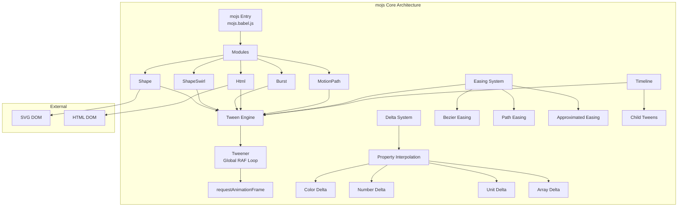
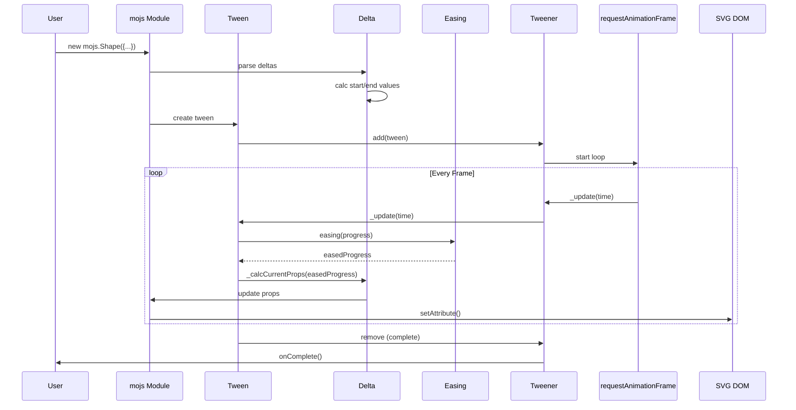

# Project Exploration: mo·js (Motion Graphics Toolbelt)

## Overview

**mo·js** (Motion Graphics JavaScript) is a declarative motion graphics library for the web, designed to create complex, retina-ready animations with a focus on motion design excellence. Created by Oleg Solomka (@legomushroom), mojs provides a unique API centered around **deltas**, **timelines**, and **shape systems** that enables designers and developers to craft delightful, visually stunning animations.

Unlike traditional animation libraries that focus on property interpolation alone, mojs introduces concepts like **Burst**, **ShapeSwirl**, **MotionPath**, and **Stagger** to handle complex motion graphics scenarios out of the box.

## Repository

- **Location:** `/home/darkvoid/Boxxed/@formulas/src.UIFrameworks/src.animations/mojs`
- **Remote:** `https://github.com/mojs/mojs`
- **Primary Language:** JavaScript (Babel), CoffeeScript
- **License:** MIT License
- **Version:** 1.7.1 (@mojs/core)
- **Author:** Oleg Solomka (legomushroom@gmail.com)

## Directory Structure

```
mojs/
├── src/                          # Main source code
│   ├── mojs.babel.js             # Main entry point, exports all modules
│   ├── h.coffee                  # Helpers/Utilities (609 lines)
│   ├── module.babel.js           # Base module class with defaults system
│   ├── thenable.babel.js         # Thenable chain pattern implementation
│   ├── tunable.babel.js          # Tunable animation system
│   ├── delta/                    # Delta system for property interpolation
│   │   ├── delta.babel.js        # Single delta calculator
│   │   └── deltas.babel.js       # Multiple deltas manager
│   ├── easing/                   # Easing functions
│   │   ├── approximate.babel.js  # Function approximation via sampling
│   │   ├── approximate-map.babel.js
│   │   ├── bezier-easing.coffee  # Cubic bezier curve implementation
│   │   ├── easing.coffee         # Easing parser and registry
│   │   ├── mix.coffee            # Easing mixing utilities
│   │   └── path-easing.coffee    # SVG path-based easing
│   ├── shapes/                   # SVG shape definitions
│   │   ├── bit.babel.js          # Base SVG shape class
│   │   ├── circle.coffee         # Circle/Ellipse shape
│   │   ├── cross.coffee          # Cross shape
│   │   ├── curve.babel.js        # Quadratic curve shape
│   │   ├── custom.babel.js       # Custom shape creator
│   │   ├── equal.coffee          # Equal sign shape
│   │   ├── line.coffee           # Line shape
│   │   ├── polygon.coffee        # Polygon shape
│   │   ├── rect.coffee           # Rectangle shape
│   │   ├── shapesMap.coffee      # Shape registry
│   │   └── zigzag.coffee         # Zigzag shape
│   ├── tween/                    # Tween engine
│   │   ├── tween.babel.js        # Core Tween class (1276 lines)
│   │   ├── tweenable.babel.js    # Tweenable property system
│   │   ├── tweener.babel.js      # Global animation loop manager
│   │   └── timeline.babel.js     # Timeline composition
│   ├── shape.babel.js            # Shape animation class (634 lines)
│   ├── shape-swirl.babel.js      # Sinusoidal path following (202 lines)
│   ├── burst.babel.js            # Particle burst system (572 lines)
│   ├── html.babel.js             # HTML element animation (539 lines)
│   ├── spriter.babel.js          # Sprite animation system
│   ├── stagger.babel.js          # Staggered animations (155 lines)
│   ├── motion-path.coffee        # Path-based motion (589 lines)
│   └── vendor/                   # Third-party utilities
│       └── resize.coffee         # Resize handler
├── src-ui/                       # (Not present in this version)
├── spec/                         # Jasmine test specs
│   ├── delta/
│   ├── easing/
│   ├── shapes/
│   ├── tween/
│   └── *.coffee
├── dev/                          # Development playground
│   └── index.js                  # Demo setup with mojs-player
├── dist/                         # Built distribution files
│   ├── mo.umd.js                 # UMD bundle
│   └── mo.umd.min.js             # Minified UMD
├── package.json
├── webpack.common.js             # Base webpack config
├── webpack.dev.js                # Development config
├── webpack.umd.js                # Production UMD build config
└── karma.conf.js                 # Test runner config
```

## Architecture

### High-Level Diagram



### Component Breakdown

#### 1. Tween Engine (`tween/tween.babel.js`)

**Location:** `src/tween/tween.babel.js`
**Lines:** 1,276 lines
**Purpose:** Core animation engine with time-based progress calculation

**Key Innovation:** mojs uses a **period-based** time system that handles repeats, yoyo, and delays as continuous time rather than discrete segments.

**Time Calculation:**
```javascript
// Total repeat time includes all periods
repeatTime = (duration + delay) * (repeat + 1)

// Start and end times
startTime = currentTime + delay + negativeShift + shiftTime
endTime = startTime + repeatTime - delay
```

**Period Detection:**
```javascript
_getPeriod(time) {
  const TTime = delay + duration;
  const dTime = delay + time - startTime;
  const T = dTime / TTime;
  const elapsed = (time < endTime) ? dTime % TTime : 0;

  // Handle delay gaps
  if (elapsed > 0 && elapsed < delay) {
    this._delayT = T;
    return 'delay';
  }
  return Math.floor(T);
}
```

**Yoyo Handling:**
```javascript
// Yoyo period detection
const isYoyo = props.isYoyo && (T % 2 === 1);

// Progress flips on yoyo periods
const proc = isYoyo ? 1 - rawProgress : rawProgress;
```

**Callback System:**
| Callback | When Fired | Parameters |
|----------|------------|------------|
| `onProgress` | Every frame before others | `(progress, isForward)` |
| `onStart` | First frame of first period | `(isForward, isYoyo)` |
| `onFirstUpdate` | First update in active area | `(isForward, isYoyo)` |
| `onUpdate` | Every frame in active area | `(easedProgress, progress, isForward, isYoyo)` |
| `onRepeatStart` | Start of each repeat period | `(isForward, isYoyo)` |
| `onRepeatComplete` | End of each repeat period | `(isForward, isYoyo)` |
| `onComplete` | Final period end | `(isForward, isYoyo)` |
| `onPlaybackStart` | When play/resume called | - |
| `onPlaybackPause` | When pause called | - |
| `onPlaybackStop` | When stop called | - |
| `onPlaybackComplete` | When animation completes fully | - |

**Speed Control:**
```javascript
// Speed affects time progression
if (speed && playTime) {
  time = playTime + (speed * (time - playTime));
}
// speed: 0.5 = 2x slower, 2 = 2x faster
```

#### 2. Delta System (`delta/delta.babel.js`, `delta/deltas.babel.js`)

**Location:** `src/delta/`
**Purpose:** Type-safe property interpolation with delta calculation

**Delta Types:**
1. **Color Delta** - RGBA interpolation
2. **Number Delta** - Plain numeric interpolation
3. **Unit Delta** - Values with units (px, %, rem)
4. **Array Delta** - Stroke-dasharray, multiple values

**Color Interpolation:**
```javascript
_calcCurrent_color(delta, easedProgress, progress) {
  const start = delta.start;  // {r, g, b, a}
  const d = delta.delta;      // {r, g, b, a}

  if (!delta.curve) {
    // Linear interpolation with easing applied
    r = parseInt(start.r + easedProgress * d.r, 10);
    g = parseInt(start.g + easedProgress * d.g, 10);
    b = parseInt(start.b + easedProgress * d.b, 10);
    a = parseFloat(start.a + easedProgress * d.a);
  } else {
    // Curve-based interpolation (for elasticity)
    const cp = delta.curve(progress);
    r = parseInt(cp * (start.r + progress * d.r), 10);
    // ...
  }

  this._o.props[name] = `rgba(${r},${g},${b},${a})`;
}
```

**Unit Handling:**
```javascript
// Parse units from strings
parseUnit(value) {
  if (typeof value === 'number') {
    return { unit: 'px', isStrict: false, value, string: value + 'px' };
  }
  const unit = value.match(/px|%|rem|em|.../gim)?.[0] || 'px';
  const amount = parseFloat(value);
  return { unit, isStrict: true, value: amount, string: `${amount}${unit}` };
}

// Calculate delta between units
calcArrDelta(arr1, arr2) {
  const delta = [];
  for (let i = 0; i < arr1.length; i++) {
    delta[i] = parseUnit(`${arr2[i].value - arr1[i].value}${arr2[i].unit}`);
  }
  return delta;
}
```

**Random Values:**
```javascript
// rand(min, max) syntax
h.parseIfRand(str) {
  const match = str.match(/^rand\((\d+\.?\d*),\s*(\d+\.?\d*)\)/);
  if (match) {
    return +match[1] + Math.random() * (+match[2] - +match[1]);
  }
  return str;
}

// Usage
new mojs.Burst({
  children: {
    radius: 'rand(20, 10)',     // Random between 10-20
    delay: 'rand(0, 500)',      // Random delay
    opacity: 'rand(0.1, 1)'     // Random opacity
  }
});
```

#### 3. Easing System (`easing/`)

**Location:** `src/easing/`

**Bezier Easing Implementation:**
```coffeescript
# Cubic Bezier curve: B(t) = (1-t)³·P₀ + 3(1-t)²t·P₁ + 3(1-t)t²·P₂ + t³·P₃
# Simplified: x(t) = ((A·t + B)·t + C)·t where:
#   A = 1 - 3x₂ + 3x₁
#   B = 3x₂ - 6x₁
#   C = 3x₁

A = (aA1, aA2) -> 1.0 - 3.0 * aA2 + 3.0 * aA1
B = (aA1, aA2) -> 3.0 * aA2 - 6.0 * aA1
C = (aA1) -> 3.0 * aA1

calcBezier = (aT, aA1, aA2) ->
  ((A(aA1, aA2) * aT + B(aA1, aA2)) * aT + C(aA1)) * aT

# Newton-Raphson iteration for inverse lookup
newtonRaphsonIterate = (aX, aGuessT) ->
  for i in [0...NEWTON_ITERATIONS]  # 4 iterations
    currentSlope = getSlope(aGuessT, mX1, mX2)
    return aGuessT if currentSlope is 0
    currentX = calcBezier(aGuessT, mX1, mX2) - aX
    aGuessT -= currentX / currentSlope
  aGuessT
```

**Sample Table Optimization:**
```javascript
// Pre-compute 11 sample points for binary search
kSplineTableSize = 11;
kSampleStepSize = 1.0 / (kSplineTableSize - 1.0);

calcSampleValues() {
  for (let i = 0; i < kSplineTableSize; i++) {
    mSampleValues[i] = calcBezier(i * kSampleStepSize, mX1, mX2);
  }
}

// Find T for given X using samples + Newton-Raphson
getTForX(aX) {
  // Binary search to find interval
  for (; currentSample < lastSample && mSampleValues[currentSample] <= aX; currentSample++) {
    intervalStart += kSampleStepSize;
  }
  // Newton-Raphson refinement
  return newtonRaphsonIterate(aX, guessForT);
}
```

**Path Easing (SVG Path as Easing Curve):**
```coffeescript
class PathEasing
  # Sample path at init
  _preSample: ->
    @_samples = []
    for i in [0..@_precompute]  # 1450 samples by default
      progress = i * @_step
      length = @pathLength * progress
      point = @path.getPointAtLength(length)
      @_samples[i] = { point, length, progress }

  # Find Y for given X progress
  sample: (p) ->
    bounds = @_findBounds(@_samples, p)
    @_findApproximate(p, bounds.start, bounds.end)

  # Binary search with interpolation
  _findApproximate: (p, start, end, maxIterations=5) ->
    approximation = @_approximate(start, end, p)
    point = @path.getPointAtLength(approximation)

    if closeEnough(p, point.x/@_rect, @_eps)
      return @_resolveY(point)  # 1 - (y / rect)

    # Recursive refinement
    newPoint = { point, length: approximation }
    if p < point.x/@_rect
      @_findApproximate(p, start, newPoint, maxIterations - 1)
    else
      @_findApproximate(p, newPoint, end, maxIterations - 1)
```

**Approximated Easing (Function Sampling):**
```javascript
// Sample any function to 10,000 points (4 decimal precision)
_sample(fn, n = 4) {
  const samples = {};
  const samplesCount = Math.pow(10, n);  // 10000
  const step = 1 / samplesCount;

  samples[0] = fn(0);
  for (let i = 0; i < samplesCount - 1; i++) {
    p += step;
    samples[parseFloat(p.toFixed(n))] = fn(p);
  }
  samples[1] = fn(1);
  samples.base = n;

  return _proximate(samples);
}

// Lookup with linear interpolation between samples
_proximate(samples) {
  return function cached(p) {
    const newKey = RoundNumber(p, n);  // Round to 4 decimals
    const sample = samples[newKey];

    if (Math.abs(p - newKey) < step) {
      return sample;  // Exact sample found
    }

    // Interpolate between samples
    const nextIndex = newKey + step;
    const nextValue = samples[nextIndex];
    const dLength = nextIndex - newKey;
    const dValue = nextValue - sample;
    const progress = (p - newKey) / dLength;

    return sample + progress * dValue;
  };
}
```

#### 4. Shape System (`shapes/`, `shape.babel.js`, `bit.babel.js`)

**Location:** `src/shapes/`, `src/shape.babel.js`

**Base Shape Class:**
```javascript
class Shape extends Tunable {
  _defaults = {
    shape: 'circle',          // circle, rect, polygon, line, cross, equal, zigzag
    stroke: 'transparent',
    strokeWidth: 2,
    strokeOpacity: 1,
    strokeLinecap: '',
    strokeDasharray: 0,
    strokeDashoffset: 0,
    fill: 'deeppink',
    fillOpacity: 1,
    radius: 50,
    radiusX: null,
    radiusY: null,
    points: 3,                // For polygon
    x: 0,
    y: 0,
    rotate: 0,
    scale: 1,
    opacity: 1,
    origin: '50% 50%',
    isForce3d: false,
    isSoftHide: true,
  };

  _render() {
    this.el = document.createElement('div');
    this.el.setAttribute('data-name', 'mojs-shape');
    this._createShape();  // Creates SVG bit
    this._props.parent.appendChild(this.el);
  }

  _draw() {
    // Set SVG attributes based on props
    bP.rx = p.rx;
    bP.ry = p.ry;
    bP.stroke = p.stroke;
    bP['stroke-width'] = p.strokeWidth;
    // ...
    this.shapeModule._draw();
  }
}
```

**SVG Bit Base Class:**
```javascript
class Bit {
  constructor(o) {
    this._o = o;
    this._props = {};
    this.el = h.createEl('svg', {
      width: o.width,
      height: o.height,
      viewBox: `0 0 ${o.width} ${o.height}`
    });
    this.shapeEl = document.createElementNS(h.NS, this._defaults.tag);
    this.el.appendChild(this.shapeEl);
  }

  _setAttrIfChanged(name, value) {
    if (this._prev[name] !== value) {
      this.shapeEl.setAttribute(name, value);
      this._prev[name] = value;
    }
  }
}
```

**Circle Shape:**
```coffeescript
class Circle extends Bit
  _defaults.shape = 'ellipse'

  _draw: ->
    rx = if @_props.radiusX? then @_props.radiusX else @_props.radius
    ry = if @_props.radiusY? then @_props.radiusY else @_props.radius
    @_setAttrIfChanged 'rx', rx
    @_setAttrIfChanged 'ry', ry
    @_setAttrIfChanged 'cx', @_props.width/2
    @_setAttrIfChanged 'cy', @_props.height/2

  _getLength: ->  # For stroke-dasharray animations
    2 * Math.PI * Math.sqrt((rx² + ry²) / 2)  # Ramanujan approximation
```

**Polygon Shape:**
```coffeescript
class Polygon extends Bit
  _draw: ->
    radiusX = @_props.radiusX ? @_props.radius
    radiusY = @_props.radiusY ? @_props.radius
    pointsCount = @_props.points

    # Generate polygon vertices
    points = for i in [0...pointsCount]
      angle = (360 / pointsCount) * i * Math.PI / 180
      x = center.x + Math.cos(angle) * radiusX
      y = center.y + Math.sin(angle) * radiusY
      "#{x},#{y}"

    @el.setAttribute 'points', points.join(' ')
```

**Curve Shape (Quadratic Bezier):**
```javascript
class Curve extends Bit {
  _draw() {
    const radiusX = p.radiusX || p.radius;
    const radiusY = p.radiusY || p.radius;

    // Quadratic Bezier: M start Q control end
    const x = p.width / 2;
    const y = p.height / 2;
    const x1 = x - radiusX;
    const x2 = x + radiusX;

    // Control point at 2x radius for arc height
    const d = `M${x1} ${y} Q ${x} ${y - 2 * radiusY} ${x2} ${y}`;
    this.el.setAttribute('d', d);
  }

  _getLength() {
    // Approximate quadratic Bezier length
    const dRadius = radiusX + radiusY;
    const sqrt = Math.sqrt((3 * radiusX + radiusY) * (radiusX + 3 * radiusY));
    return 0.5 * Math.PI * (3 * dRadius - sqrt);
  }
}
```

#### 5. ShapeSwirl - Sinusoidal Path Following (`shape-swirl.babel.js`)

**Location:** `src/shape-swirl.babel.js`
**Purpose:** Animate shapes along sinusoidal paths (swirl effects)

**Swirl Mathematics:**
```javascript
class ShapeSwirl extends Shape {
  _defaults = {
    isSwirl: true,
    swirlSize: 10,        // Amplitude of sine wave (degrees)
    swirlFrequency: 3,    // Frequency of sine wave
    pathScale: 1,         // Path length scale
    degreeShift: 0,       // Phase shift
    direction: 1,         // 1 or -1 for direction
    radius: 5,
  };

  _calcSwirlXY(progress) {
    const p = this._props;
    const rotate = this._posData.rotate + p.degreeShift;

    // Add sinusoidal offset to rotation
    const swirlAngle = p.isSwirl
      ? rotate + this._getSwirl(progress)
      : rotate;

    // Calculate position on radial path
    const point = h.getRadialPoint({
      rotate: swirlAngle,
      radius: progress * this._posData.radius * p.pathScale,
      center: {
        x: this._posData.x.start,
        y: this._posData.y.start,
      },
    });

    p.x = point.x + this._posData.x.units;
    p.y = point.y + this._posData.y.units;
  }

  _getSwirl(progress) {
    const p = this._props;
    // Sine wave: amplitude * sin(frequency * progress)
    return p.direction * p.swirlSize * Math.sin(p.swirlFrequency * progress);
  }
}
```

**Radial Point Calculation:**
```coffeescript
h.getRadialPoint = (o = {}) ->
  radAngle = (o.rotate - 90) * 0.017453292519943295  # (PI/180)
  radiusX = o.radiusX ? o.radius
  radiusY = o.radiusY ? o.radius

  x: o.center.x + Math.cos(radAngle) * radiusX
  y: o.center.y + Math.sin(radAngle) * radiusY
```

#### 6. Burst System (`burst.babel.js`)

**Location:** `src/burst.babel.js`
**Lines:** 572 lines
**Purpose:** Create radial particle explosions with configurable children

**Burst Configuration:**
```javascript
class Burst extends Tunable {
  _defaults = {
    count: 5,             // Number of child particles
    degree: 360,          // Arc of burst (0-360)
    radius: { 0: 50 },    // Burst radius animation
    radiusX: null,
    radiusY: null,
    width: 0,
    height: 0,
  };

  _extendDefaults() {
    // Calculate child positions
    this._degreeStep = this._props.degree / this._props.count;
    this._createSwirls();
  }

  _addBurstProperties(options, i, j = 0) {
    // Calculate degree shift for each child
    const degreeShift = this._degreeStep * i;
    options.degreeShift = degreeShift;

    // Position children on radial path
    const radAngle = (degreeShift - 90) * Math.PI / 180;
    const radius = this._props.radius;
    options.x = Math.cos(radAngle) * radius;
    options.y = Math.sin(radAngle) * radius;
  }
}
```

**Usage Example:**
```javascript
new mojs.Burst({
  radius: { 0: 200 },
  count: 20,
  degree: 360,
  children: {
    shape: 'circle',
    radius: 'rand(20, 10)',
    fill: ['red', 'blue', 'yellow'],
    duration: 2000,
    easing: 'cubic.out',
    opacity: { 1: 0 },
  }
});
```

#### 7. MotionPath System (`motion-path.coffee`)

**Location:** `src/motion-path.coffee`
**Lines:** 589 lines
**Purpose:** Animate elements along arbitrary SVG paths

**Path Animation:**
```coffeescript
class MotionPath
  defaults:
    path: null           # CSS selector, SVGPathElement, or arc shift
    curvature: x: '75%', y: '50%'  # For arc paths
    isCompositeLayer: true
    duration: 1000
    easing: null
    pathStart: 0         # Start position [0-1]
    pathEnd: 1           # End position [0-1]
    offsetX: 0
    offsetY: 0
    rotationOffset: null

  constructor: (@o) ->
    @_parsePath()
    @_createTween()

  _parsePath: ->
    if typeof @o.path is 'string'
      if @o.path.match(/[M|L|H|V|C|S|Q|T|A]/gim)
        # SVG path string
        @_path = @_createPathEl(@o.path)
      else
        # CSS selector
        @_path = document.querySelector(@o.path)
    else if @o.path instanceof SVGPathElement
      @_path = @o.path
    else if @o.path.x? and @o.path.y?
      # Arc shift - create quadratic curve
      @_path = @_createArcPath(@o.path, @o.curvature)

    @pathLength = @_path.getTotalLength()

  _update: (progress) ->
    # Clamp to pathStart/pathEnd
    p = h.clamp(progress, @o.pathStart, @o.pathEnd)

    # Get point at length
    length = @pathLength * p
    point = @_path.getPointAtLength(length)

    # Apply offsets
    x = point.x + @o.offsetX
    y = point.y + @o.offsetY

    # Apply transform
    h.setPrefixedStyle(@el, 'transform',
      "translate3d(#{x}px, #{y}px, 0)#{rotation}")
```

#### 8. Timeline System (`tween/timeline.babel.js`)

**Location:** `src/tween/timeline.babel.js`
**Purpose:** Compose multiple tweens with sequencing and parallelism

**Timeline Composition:**
```javascript
class Timeline extends Tween {
  // Add tweens to play together
  add(...args) {
    this._pushTimelineArray(args);
    this._calcDimentions();
    return this;
  }

  // Append tweens sequentially
  append(...timeline) {
    for (var tm of timeline) {
      if (h.isArray(tm)) {
        // Array plays in parallel
        this._appendTimelineArray(tm);
      } else {
        // Single tween appended
        this._appendTimeline(tm, this._timelines.length);
      }
    }
    return this;
  }

  _appendTimeline(timeline, index, time) {
    const shift = (time != null)
      ? time
      : this._props.duration;

    timeline._setProp({ shiftTime: shift });
    this._timelines.push(timeline);
  }
}

// Usage
const tl = new mojs.Timeline()
  .add(shape1.tween({ x: 100 }, { duration: 500 }))
  .append(shape2.tween({ y: 200 }, { duration: 500 }))
  .append([
    shape3.tween({ scale: 0.5 }, { duration: 300 }),
    shape4.tween({ rotate: 180 }, { duration: 300 })
  ]);
```

#### 9. Stagger System (`stagger.babel.js`)

**Location:** `src/stagger.babel.js`
**Purpose:** Create staggered (delayed) animations across multiple elements

**Stagger Patterns:**
```javascript
const stagger = {
  // Linear stagger
  from: (amount, { start = 0 } = {}) => {
    return (i) => start + i * amount;
  },

  // From center stagger
  fromCenter: (amount) => {
    return (i, total) => {
      const center = Math.floor(total / 2);
      return Math.abs(center - i) * amount;
    };
  },

  // Random stagger
  rand: (min, max) => {
    return () => h.rand(min, max);
  },

  // Repeat stagger
  repeat: (pattern) => {
    return (i) => pattern[i % pattern.length];
  }
};

// Usage
new mojs.Shape({
  x: stagger.from(50),     // 0, 50, 100, 150...
  y: stagger.fromCenter(30),
  delay: stagger.rand(0, 500)
});
```

#### 10. Global Tweener (`tween/tweener.babel.js`)

**Location:** `src/tween/tweener.babel.js`
**Purpose:** Central RAF loop manager

**Animation Loop:**
```javascript
class Tweener {
  constructor() {
    this.tweens = [];
    this._isRunning = false;
  }

  _loop() {
    if (!this._isRunning) return;
    this._update(performance.now());
    if (!this.tweens.length) {
      this._isRunning = false;
      return;
    }
    requestAnimationFrame(this._loop);
  }

  _update(time) {
    let i = this.tweens.length;
    while (i--) {
      const tween = this.tweens[i];
      if (tween && tween._update(time) === true) {
        this.remove(tween);
        tween._onTweenerFinish();
      }
    }
  }

  add(tween) {
    if (tween._isRunning) return;
    tween._isRunning = true;
    this.tweens.push(tween);
    this._startLoop();
  }

  remove(tween) {
    const index = this.tweens.indexOf(tween);
    if (index !== -1) {
      tween._isRunning = false;
      this.tweens.splice(index, 1);
    }
  }

  // Visibility handling
  _onVisibilityChange() {
    if (document.hidden) {
      this._savePlayingTweens();
      for (const t of this._savedTweens) {
        t.pause();
      }
    } else {
      for (const t of this._savedTweens) {
        t.resume();
      }
    }
  }
}

const tweener = new Tweener();
export default tweener;
```

## Entry Points

### Main mojs API
```javascript
import mojs from '@mojs/core';

// Create shape
const shape = new mojs.Shape({
  shape: 'circle',
  fill: { 'red': 'blue' },
  radius: { 0: 100 },
  duration: 1000,
  easing: 'cubic.out'
});

shape.play();

// Create burst
const burst = new mojs.Burst({
  count: 10,
  radius: { 0: 200 },
  children: {
    shape: 'polygon',
    points: 5,
    fill: ['yellow', 'orange'],
    duration: 2000
  }
});

burst.play();

// Create timeline
const tl = new mojs.Timeline()
  .add(shape)
  .append(burst);

tl.play();
```

## Data Flow



## External Dependencies

| Dependency | Version | Purpose |
|------------|---------|---------|
| @babel/runtime | ^7.24.7 | Runtime helpers |
| @mojs/player | ^1.3.0 | Animation player UI (dev) |
| webpack | ^5.91.0 | Module bundler |
| jasmine | ^5.1.0 | Testing framework |
| karma | ^6.4.3 | Test runner |

**Runtime Dependencies:** None (standalone library)

## Configuration

### Build Configuration

**Webpack UMD Build:**
```javascript
// webpack.umd.js
module.exports = {
  entry: './src/mojs.babel.js',
  output: {
    filename: 'mo.umd.js',
    format: 'umd',
    library: 'mojs'
  },
  plugins: [
    new TerserPlugin({ extractComments: false })
  ]
};
```

## Key Insights

1. **Delta-Based Animation:** Unlike CSS property tweens, mojs calculates deltas (start, end, delta) once and interpolates efficiently every frame.

2. **Period-Based Timing:** The Tween class treats repeats and delays as a continuous time stream, enabling precise period detection and yoyo handling.

3. **Function Approximation:** Any easing function can be pre-sampled to 10,000 points for O(1) lookup with linear interpolation between samples.

4. **Path Easing:** SVG paths can be used as easing curves by sampling the path and finding Y for a given X progress.

5. **Shape System:** All shapes are SVG-based with a unified Bit base class that handles attribute caching to prevent unnecessary DOM updates.

6. **Swirl Mathematics:** ShapeSwirl uses polar coordinates with sinusoidal angle offset to create organic spiral motion.

7. **Burst Children:** Each burst child is a full ShapeSwirl instance with calculated degreeShift for radial positioning.

8. **Visibility Handling:** The Tweener pauses all animations when the tab is hidden and resumes on return.

9. **Thenable Pattern:** All modules support `.then()` for chaining animations without explicit timelines.

10. **Stagger Functions:** Delay/easing staggering uses functional patterns for flexible distribution (from, fromCenter, rand, repeat).

## Mathematical Foundations

### Cubic Bezier Curve
```
B(t) = (1-t)³·P₀ + 3(1-t)²t·P₁ + 3(1-t)t²·P₂ + t³·P₃
where 0 ≤ t ≤ 1
```

### Sine Wave for Swirl
```
angle(progress) = baseAngle + direction × amplitude × sin(frequency × progress)
x(progress) = center.x + cos(angle) × radius × progress
y(progress) = center.y + sin(angle) × radius × progress
```

### Quadratic Bezier for Curve Shape
```
B(t) = (1-t)²·P₀ + 2(1-t)t·P₁ + t²·P₂
SVG path: M start Q control end
```

### Arc Length Parameterization
```
length = path.getTotalLength()
point = path.getPointAtLength(progress × length)
```

## Editor & DevTools

### mojs-player Integration
```javascript
// dev/index.js
import mojs from 'src/mojs.babel.js';
import MojsPlayer from '@mojs/player';

const burst = new mojs.Burst({
  radius: { 1: 200 },
  count: 20,
  children: {
    radius: 'rand(20, 10)',
    delay: 'rand(0, 500)',
    duration: 2000,
  }
});

const timeline = new mojs.Timeline().add(burst);

new MojsPlayer({
  add: timeline,
  isSaveState: true,
  isPlaying: true,
  isRepeat: true
});
```

### Curve Editor (External Package)
The curve editor is available as `@mojs/curve-editor` - allows visual bezier curve editing with real-time preview.

### Timeline Editor (External Package)
The timeline editor (`@mojs/timeline-editor`) provides a visual timeline interface similar to After Effects for sequencing animations.

## Browser Support

| Browser | Version |
|---------|---------|
| Chrome | 49+ |
| Firefox | 70+ |
| Opera | 36+ |
| Safari | 8+ |
| Edge | 79+ |

## Deep Dive Documents

The following deep dive documents provide comprehensive coverage of specific areas:

| Document | Description |
|----------|-------------|
| [`animation-system-deep-dive.md`](./animation-system-deep-dive.md) | Tween engine, Timeline composition, Thenable chaining, Delta system overview, Stagger |
| [`rendering-deep-dive.md`](./rendering-deep-dive.md) | SVG shape system, Bit base class, HTML element animation, Transform system, Stroke/fill rendering |
| [`DELTA_SYSTEM_DEEP_EXPLORATION.md`](./DELTA_SYSTEM_DEEP_EXPLORATION.md) | Comprehensive delta system: Delta/Deltas classes, interpolation mathematics, SVG vs HTML paths |
| [`playback-tracking-deep-dive.md`](./playback-tracking-deep-dive.md) | Forward/backward replay tracking, period detection, yoyo handling |
| [`splines-curves-deep-dive.md`](./splines-curves-deep-dive.md) | Cubic bezier curves, Newton-Raphson iteration, sample tables |
| [`module-system-deep-dive.md`](./module-system-deep-dive.md) | Base Module class, defaults inheritance, Thenable pattern, Tunable pattern |
| [`helpers-utilss-deep-dive.md`](./helpers-utilss-deep-dive.md) | Core utilities (h.coffee): Math, DOM, parsing, color, delta, array utilities |
| [`easing-composition-deep-dive.md`](./easing-composition-deep-dive.md) | Easing parser, Bezier easing, Path easing, Approximated easing, Easing mix |
| [`performance-memory-deep-dive.md`](./performance-memory-deep-dive.md) | DOM batching, render queue, attribute caching, memory management, cleanup patterns |
| [`responsive-adaptive-deep-dive.md`](./responsive-adaptive-deep-dive.md) | DPI/retina handling, reduced motion, viewport awareness, dynamic resizing |

## Open Questions

1. How does the `isRefreshState` option affect module initialization?
2. What is the exact mechanism for sprite animation in `spriter.babel.js`?
3. How does the HTML module handle CSS property interpolation vs transform?
4. What are the performance characteristics of path-easing with high sample counts?

## File Size

| File | Lines | Purpose |
|------|-------|---------|
| `h.coffee` | 609 | Core utilities |
| `motion-path.coffee` | 589 | Path animation |
| `burst.babel.js` | 572 | Burst particles |
| `html.babel.js` | 539 | HTML element animation |
| `tween.babel.js` | 1,276 | Tween engine |
| `shape.babel.js` | 634 | Shape system |
| **Total Source** | **~4,500** | Core library |
