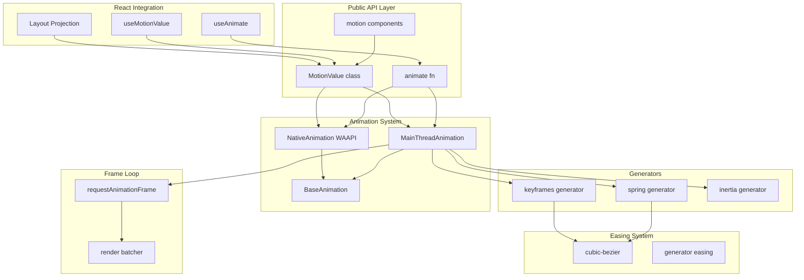

# Motion (framer-motion) Deep Exploration

## Project Overview

Motion is a production-grade animation library for JavaScript and React, created by Framer. It's a **hybrid animation engine** that intelligently chooses between Web Animations API (WAAPI) for performance and main-thread JavaScript animations for flexibility.

### Key Differentiators

1. **Hybrid Engine**: WAAPI when possible, main-thread fallback for complex animations
2. **Dual APIs**: JavaScript (`animate()`) and React (`motion.div`)
3. **Physics-based**: Spring and inertia generators with duration-based configuration
4. **Layout Animations**: FLIP (First Last Invert Play) technique for smooth layout transitions
5. **Gesture System**: Built-in drag, pan, hover, tap gesture handlers
6. **Motion Values**: Reactive value system with velocity tracking
7. **Smart Batching**: Render batching to minimize layout thrashing

---

## Architecture Breakdown



### Monorepo Structure

```
motion/
├── packages/
│   ├── framer-motion/       # Core animation library
│   │   ├── src/
│   │   │   ├── animation/   # Animation engines & generators
│   │   │   ├── easing/      # Easing functions
│   │   │   ├── value/       # MotionValue system
│   │   │   ├── frameloop/   # RAF scheduling
│   │   │   ├── render/      # DOM & SVG rendering
│   │   │   ├── motion/      # React motion components
│   │   │   ├── layout/      # Layout projection system
│   │   │   ├── gesture/     # Drag, pan, tap handlers
│   │   │   ├── scroll/      # Scroll-triggered animations
│   │   │   └── utils/       # Shared utilities
│   │   └── cypress/         # E2E tests
│   ├── motion/              # Unified export wrapper
│   └── motion-dom/          # DOM-specific exports
├── dev/
│   ├── html/                # Vanilla JS examples
│   └── react/               # React examples
└── cypress/                 # Integration tests
```

---

## Core Animation Engines

### 1. MainThreadAnimation - JavaScript-powered animations

For complex animations requiring per-frame JavaScript computation:

```typescript
// MainThreadAnimation.ts - Core JavaScript animation engine
export class MainThreadAnimation<T extends string | number>
    extends BaseAnimation<T, ResolvedData<T>> {

    private driver?: DriverControls      // RAF loop controller
    private holdTime: number | null = null
    private currentTime: number = 0
    private playbackSpeed = 1
    startTime: number | null = null

    constructor(options: ValueAnimationOptions<T>) {
        super(options)
        // Schedule keyframe resolution
        this.resolver.scheduleResolve()
    }

    protected initPlayback(keyframes: ResolvedKeyframes<T>) {
        const {
            type = "keyframes",
            repeat = 0,
            repeatDelay = 0,
            repeatType,
            velocity = 0,
        } = this.options

        // Select generator based on type
        const generatorFactory = isGenerator(type)
            ? type
            : generators[type] || keyframesGeneratorFactory

        // Handle non-numeric keyframes (colors, complex values)
        let mapPercentToKeyframes: ((v: number) => T) | undefined
        if (generatorFactory !== keyframesGeneratorFactory &&
            typeof keyframes[0] !== "number") {

            // Map [0, 100] to actual values
            mapPercentToKeyframes = pipe(
                percentToProgress,
                mix(keyframes[0], keyframes[1])
            ) as (t: number) => T
            keyframes = [0 as T, 100 as T]
        }

        const generator = generatorFactory({ ...this.options, keyframes })

        // Mirror generator for repeatType: "mirror"
        let mirroredGenerator: KeyframeGenerator<T> | undefined
        if (repeatType === "mirror") {
            mirroredGenerator = generatorFactory({
                ...this.options,
                keyframes: [...keyframes].reverse(),
                velocity: -velocity,
            })
        }

        // Calculate duration if undefined
        if (generator.calculatedDuration === null) {
            generator.calculatedDuration = calcGeneratorDuration(generator)
        }

        const calculatedDuration = generator.calculatedDuration
        const resolvedDuration = calculatedDuration + repeatDelay
        const totalDuration = resolvedDuration * (repeat + 1) - repeatDelay

        return {
            generator,
            mirroredGenerator,
            mapPercentToKeyframes,
            calculatedDuration,
            resolvedDuration,
            totalDuration,
        }
    }

    // Called every frame by the driver
    tick(timestamp: number, sample = false): AnimationState<T> {
        const { resolved } = this
        if (!resolved) {
            // Return final keyframe if resolution failed
            return { done: true, value: this.options.keyframes.slice(-1)[0] }
        }

        const {
            generator,
            mirroredGenerator,
            mapPercentToKeyframes,
            totalDuration,
            resolvedDuration,
        } = resolved

        if (this.startTime === null) return generator.next(0)

        const { delay, repeat, repeatType, repeatDelay, onUpdate } = this.options

        // Update currentTime based on speed
        if (sample) {
            this.currentTime = timestamp
        } else if (this.holdTime !== null) {
            this.currentTime = this.holdTime
        } else {
            // Rounding to handle floating point inaccuracies
            this.currentTime = Math.round(timestamp - this.startTime) * this.speed
        }

        // Handle delay phase
        const timeWithoutDelay = this.currentTime - delay * (this.speed >= 0 ? 1 : -1)
        const isInDelayPhase = this.speed >= 0
            ? timeWithoutDelay < 0
            : timeWithoutDelay > totalDuration
        this.currentTime = Math.max(timeWithoutDelay, 0)

        let elapsed = this.currentTime
        let frameGenerator = generator

        // Handle repeats
        if (repeat) {
            const progress = Math.min(this.currentTime, totalDuration) / resolvedDuration
            let currentIteration = Math.floor(progress)
            let iterationProgress = progress % 1.0

            if (!iterationProgress && progress >= 1) {
                iterationProgress = 1
            }
            iterationProgress === 1 && currentIteration--
            currentIteration = Math.min(currentIteration, repeat + 1)

            const isOddIteration = Boolean(currentIteration % 2)
            if (isOddIteration) {
                if (repeatType === "reverse") {
                    iterationProgress = 1 - iterationProgress
                } else if (repeatType === "mirror") {
                    frameGenerator = mirroredGenerator!
                }
            }

            elapsed = clamp(0, 1, iterationProgress) * resolvedDuration
        }

        // Get interpolated value from generator
        const state = isInDelayPhase
            ? { done: false, value: keyframes[0] }
            : frameGenerator.next(elapsed)

        // Map percent back to actual value if needed
        if (mapPercentToKeyframes) {
            state.value = mapPercentToKeyframes(state.value as number)
        }

        // Check if animation is finished
        let { done } = state
        if (!isInDelayPhase && calculatedDuration !== null) {
            done = this.speed >= 0
                ? this.currentTime >= totalDuration
                : this.currentTime <= 0
        }

        const isAnimationFinished = this.holdTime === null &&
            (this.state === "finished" || (this.state === "running" && done))

        if (isAnimationFinished) {
            state.value = getFinalKeyframe(keyframes, this.options)
        }

        if (onUpdate) onUpdate(state.value)
        if (isAnimationFinished) this.finish()

        return state
    }

    play() {
        if (!this._resolved) {
            this.pendingPlayState = "running"
            return
        }

        const { driver = frameloopDriver, onPlay } = this.options

        if (!this.driver) {
            this.driver = driver((timestamp) => this.tick(timestamp))
        }

        onPlay && onPlay()

        const now = this.driver.now()
        if (this.holdTime !== null) {
            this.startTime = now - this.holdTime
        } else if (!this.startTime) {
            this.startTime = now
        }

        this.holdTime = null
        this.state = "running"
        this.driver.start()
    }

    pause() {
        this.state = "paused"
        this.holdTime = this.currentTime ?? 0
    }

    // time is in seconds
    set time(newTime: number) {
        newTime = secondsToMilliseconds(newTime)
        this.currentTime = newTime

        if (this.holdTime !== null || this.speed === 0) {
            this.holdTime = newTime
        } else if (this.driver) {
            this.startTime = this.driver.now() - newTime / this.speed
        }
    }

    get speed() {
        return this.playbackSpeed
    }

    set speed(newSpeed: number) {
        const hasChanged = this.playbackSpeed !== newSpeed
        this.playbackSpeed = newSpeed
        if (hasChanged) {
            // Recalculate startTime to maintain current position
            this.time = millisecondsToSeconds(this.currentTime)
        }
    }
}
```

### 2. NativeAnimation - Web Animations API

For GPU-accelerated CSS property animations:

```typescript
// NativeAnimation.ts - WAAPI wrapper
export class NativeAnimation implements AnimationPlaybackControls {
    animation: Animation  // Native WAAPI Animation object

    constructor(
        element: Element,
        valueName: string,
        valueKeyframes: ValueKeyframesDefinition,
        options: ValueAnimationOptions
    ) {
        const isCSSVar = valueName.startsWith("--")
        this.setValue = isCSSVar ? setCSSVar : setStyle

        // Read initial keyframe if null provided
        const readInitialKeyframe = () => {
            return valueName.startsWith("--")
                ? (element as HTMLElement).style.getPropertyValue(valueName)
                : window.getComputedStyle(element)[valueName as any]
        }

        if (!Array.isArray(valueKeyframes)) {
            valueKeyframes = [valueKeyframes]
        }

        hydrateKeyframes(valueName, valueKeyframes, readInitialKeyframe)

        // Convert generator to keyframes if needed
        if (isGenerator(options.type)) {
            const generatorOptions = createGeneratorEasing(
                options, 100, options.type
            )
            options.ease = supportsLinearEasing()
                ? generatorOptions.ease
                : defaultEasing
            options.duration = secondsToMilliseconds(generatorOptions.duration)
            options.type = "keyframes"
        }

        // Stop any existing animation on this property
        const existingAnimation = getElementAnimationState(element).get(valueName)
        existingAnimation && existingAnimation.stop()

        if (!supportsWaapi()) {
            // Fallback: set final keyframe immediately
            onFinish()
        } else {
            this.animation = startWaapiAnimation(
                element, valueName, valueKeyframes as string[], options
            )

            if (options.autoplay === false) {
                this.animation.pause()
            }

            this.animation.onfinish = onFinish

            // Track in state map for cleanup
            getElementAnimationState(element).set(valueName, this)
        }
    }

    // Time in seconds
    get time() {
        return this.animation
            ? millisecondsToSeconds(this.animation.currentTime || 0)
            : 0
    }

    set time(newTime: number) {
        if (this.animation) {
            this.animation.currentTime = secondsToMilliseconds(newTime)
        }
    }

    get speed() {
        return this.animation ? this.animation.playbackRate : 1
    }

    set speed(newSpeed: number) {
        if (this.animation) {
            this.animation.playbackRate = newSpeed
        }
    }

    get state() {
        return this.animation ? this.animation.playState : "finished"
    }

    play() {
        if (this.state === "finished") {
            this.updateFinishedPromise()
        }
        this.animation && this.animation.play()
    }

    pause() {
        this.animation && this.animation.pause()
    }

    stop() {
        if (this.animation.commitStyles) {
            this.animation.commitStyles()  // Apply final styles to element
        }
        this.cancel()
    }

    complete() {
        this.animation && this.animation.finish()
    }

    cancel() {
        this.removeAnimation()
        this.animation && this.animation.cancel()
    }
}

// WAAPI animation starter
function startWaapiAnimation(
    element: Element,
    valueName: string,
    keyframes: string[],
    options: ValueAnimationOptions
): Animation {
    const waaapiKeyframes: Keyframe[] = [{ [valueName]: keyframes[0] }]
    const lastKeyframe: Keyframe = { [valueName]: keyframes[keyframes.length - 1] }

    // Build WAAPI keyframes
    for (let i = 1; i < keyframes.length - 1; i++) {
        waaapiKeyframes.push({
            [valueName]: keyframes[i],
            offset: options.times?.[i] || i / (keyframes.length - 1)
        })
    }
    waaapiKeyframes.push(lastKeyframe)

    const animationOptions: KeyframeAnimationOptions = {
        duration: options.duration || 300,
        easing: options.ease as string,
        iterations: options.repeat ? options.repeat + 1 : 1,
        direction: getWAAPIDirection(options.repeatType),
        fill: "both",
    }

    return element.animate(waaapiKeyframes, animationOptions)
}
```

---

## Generator System

Generators are pure functions that produce animation values over time. They follow an iterator-like pattern:

```typescript
// types.ts - Generator interface
interface AnimationState<T> {
    done: boolean
    value: T
}

interface KeyframeGenerator<T> {
    calculatedDuration: number | null
    next: (t: number) => AnimationState<T>
    toString?: () => string  // For WAAPI conversion
}
```

### Spring Generator - Physics-based motion

```typescript
// spring/index.ts - Spring physics simulation
export function spring(
    optionsOrVisualDuration: ValueAnimationOptions<number> | number = springDefaults.visualDuration,
    bounce = springDefaults.bounce
): KeyframeGenerator<number> {
    const options = typeof optionsOrVisualDuration !== "object"
        ? {
              visualDuration: optionsOrVisualDuration,
              keyframes: [0, 1],
              bounce,
          } as ValueAnimationOptions<number>
        : optionsOrVisualDuration

    const origin = options.keyframes[0]
    const target = options.keyframes[options.keyframes.length - 1]

    const state: AnimationState<number> = { done: false, value: origin }

    // Resolve spring parameters
    const {
        stiffness, damping, mass, duration, velocity, isResolvedFromDuration,
    } = getSpringOptions({
        ...options,
        velocity: -millisecondsToSeconds(options.velocity || 0),
    })

    const initialVelocity = velocity || 0.0
    const dampingRatio = damping / (2 * Math.sqrt(stiffness * mass))
    const initialDelta = target - origin
    const undampedAngularFreq = millisecondsToSeconds(
        Math.sqrt(stiffness / mass)
    )

    // Granular scale detection for fine-tuned rest thresholds
    const isGranularScale = Math.abs(initialDelta) < 5
    const restSpeed = isGranularScale
        ? springDefaults.restSpeed.granular
        : springDefaults.restSpeed.default
    const restDelta = isGranularScale
        ? springDefaults.restDelta.granular
        : springDefaults.restDelta.default

    // Select spring solution based on damping ratio
    let resolveSpring: (v: number) => number

    if (dampingRatio < 1) {
        // Underdamped spring (oscillates)
        const angularFreq = calcAngularFreq(undampedAngularFreq, dampingRatio)

        resolveSpring = (t: number) => {
            const envelope = Math.exp(-dampingRatio * undampedAngularFreq * t)
            return (
                target -
                envelope *
                    (((initialVelocity +
                        dampingRatio * undampedAngularFreq * initialDelta) /
                        angularFreq) *
                        Math.sin(angularFreq * t) +
                        initialDelta * Math.cos(angularFreq * t))
            )
        }
    } else if (dampingRatio === 1) {
        // Critically damped spring (fastest return without oscillation)
        resolveSpring = (t: number) =>
            target -
            Math.exp(-undampedAngularFreq * t) *
                (initialDelta +
                    (initialVelocity + undampedAngularFreq * initialDelta) * t)
    } else {
        // Overdamped spring (slow return)
        const dampedAngularFreq =
            undampedAngularFreq * Math.sqrt(dampingRatio * dampingRatio - 1)

        resolveSpring = (t: number) => {
            const envelope = Math.exp(-dampingRatio * undampedAngularFreq * t)
            const freqForT = Math.min(dampedAngularFreq * t, 300)  // Cap to prevent Infinity

            return (
                target -
                (envelope *
                    ((initialVelocity +
                        dampingRatio * undampedAngularFreq * initialDelta) *
                        Math.sinh(freqForT) +
                        dampedAngularFreq * initialDelta * Math.cosh(freqForT))) /
                    dampedAngularFreq
            )
        }
    }

    const generator = {
        calculatedDuration: isResolvedFromDuration ? duration || null : null,
        next: (t: number) => {
            const current = resolveSpring(t)

            if (!isResolvedFromDuration) {
                // Calculate velocity for underdamped springs
                let currentVelocity = 0.0
                if (dampingRatio < 1) {
                    currentVelocity =
                        t === 0
                            ? secondsToMilliseconds(initialVelocity)
                            : calcGeneratorVelocity(resolveSpring, t, current)
                }

                const isBelowVelocityThreshold =
                    Math.abs(currentVelocity) <= restSpeed
                const isBelowDisplacementThreshold =
                    Math.abs(target - current) <= restDelta

                state.done =
                    isBelowVelocityThreshold && isBelowDisplacementThreshold
            } else {
                state.done = t >= duration!
            }

            state.value = state.done ? target : current
            return state
        },
        toString: () => {
            // Convert spring to WAAPI-compatible linear easing
            const calculatedDuration = Math.min(
                calcGeneratorDuration(generator),
                maxGeneratorDuration
            )

            const easing = generateLinearEasing(
                (progress: number) =>
                    generator.next(calculatedDuration * progress).value,
                calculatedDuration,
                30  // 30 sample points
            )

            return calculatedDuration + "ms " + easing
        },
    }

    return generator
}

// Spring parameter derivation from duration/bounce
function findSpring({
    duration = springDefaults.duration,
    bounce = springDefaults.bounce,
    velocity = springDefaults.velocity,
    mass = springDefaults.mass,
}: SpringOptions) {
    let envelope: (num: number) => number
    let derivative: (num: number) => number

    let dampingRatio = 1 - bounce

    // Clamp to valid ranges
    dampingRatio = clamp(springDefaults.minDamping, springDefaults.maxDamping, dampingRatio)
    duration = clamp(springDefaults.minDuration, springDefaults.maxDuration,
                     millisecondsToSeconds(duration))

    if (dampingRatio < 1) {
        // Underdamped equations
        envelope = (undampedFreq) => {
            const exponentialDecay = undampedFreq * dampingRatio
            const delta = exponentialDecay * duration
            const a = exponentialDecay - velocity
            const b = calcAngularFreq(undampedFreq, dampingRatio)
            const c = Math.exp(-delta)
            return safeMin - (a / b) * c
        }
        derivative = (undampedFreq) => { /* derivative calculation */ }
    } else {
        // Critically damped equations
        envelope = (undampedFreq) => {
            const a = Math.exp(-undampedFreq * duration)
            const b = (undampedFreq - velocity) * duration + 1
            return -safeMin + a * b
        }
    }

    // Newton-Raphson root finding
    const initialGuess = 5 / duration
    const undampedFreq = approximateRoot(envelope, derivative, initialGuess)

    const stiffness = Math.pow(undampedFreq, 2) * mass
    return {
        stiffness,
        damping: dampingRatio * 2 * Math.sqrt(mass * stiffness),
        duration: secondsToMilliseconds(duration),
    }
}

function approximateRoot(
    envelope: Resolver,
    derivative: Resolver,
    initialGuess: number
): number {
    let result = initialGuess
    for (let i = 1; i < 12; i++) {  // 12 iterations for precision
        result = result - envelope(result) / derivative(result)
    }
    return result
}
```

### Keyframes Generator - Multi-value interpolation

```typescript
// keyframes.ts - Keyframe interpolation
export function keyframes<T extends string | number>({
    duration = 300,
    keyframes: keyframeValues,
    times,
    ease = "easeInOut",
}: ValueAnimationOptions<T>): KeyframeGenerator<T> {

    // Convert easing definitions to functions
    const easingFunctions = isEasingArray(ease)
        ? ease.map(easingDefinitionToFunction)
        : easingDefinitionToFunction(ease)

    const state: AnimationState<T> = {
        done: false,
        value: keyframeValues[0],
    }

    // Create times array from offsets
    const absoluteTimes = convertOffsetToTimes(
        times && times.length === keyframeValues.length
            ? times
            : defaultOffset(keyframeValues),
        duration
    )

    // Create interpolation function
    const mapTimeToKeyframe = interpolate<T>(absoluteTimes, keyframeValues, {
        ease: Array.isArray(easingFunctions)
            ? easingFunctions
            : defaultEasing(keyframeValues, easingFunctions),
    })

    return {
        calculatedDuration: duration,
        next: (t: number) => {
            state.value = mapTimeToKeyframe(t)
            state.done = t >= duration
            return state
        },
    }
}

// Default easing between keyframes
function defaultEasing(
    values: any[],
    easing?: EasingFunction
): EasingFunction[] {
    return values.map(() => easing || easeInOut).splice(0, values.length - 1)
}
```

### Inertia Generator - Momentum-based deceleration

```typescript
// inertia.ts - Momentum/inertia animation
export function inertia({
    from = 0,
    velocity = 0,
    min,
    max,
    power = 0.8,
    timeConstant = 750,
    bounceStiffness = 500,
    bounceDamping = 10,
    restDelta = 0.5,
}: InertiaOptions): KeyframeGenerator<number> {

    const state: AnimationState<number> = { done: false, value: from }

    // Calculate target based on power and velocity
    const modifyTarget = (target: number) => {
        if (min !== undefined && max !== undefined) {
            return clamp(min, max, target)
        } else if (min !== undefined) {
            return Math.max(min, target)
        } else if (max !== undefined) {
            return Math.min(max, target)
        }
        return target
    }

    const target = modifyTarget(from + velocity * power)

    const resolveInertia = (t: number) => {
        const delta = target - from
        const exponentialDecay = 1 - Math.exp(-t / timeConstant)
        return from + delta * exponentialDecay
    }

    return {
        next: (t: number) => {
            const current = resolveInertia(t)

            // Check if close enough to target
            const isAtTarget = Math.abs(target - current) <= restDelta
            state.done = isAtTarget
            state.value = current
            return state
        },
    }
}
```

---

## Easing System

### Cubic Bezier Implementation

Motion uses a modified version of Gaëtan Renaudeau's bezier-easing:

```typescript
// cubic-bezier.ts - Optimized bezier curve evaluation
const calcBezier = (t: number, a1: number, a2: number) =>
    (((1.0 - 3.0 * a2 + 3.0 * a1) * t + (3.0 * a2 - 6.0 * a1)) * t + 3.0 * a1) * t

const subdivisionPrecision = 0.0000001
const subdivisionMaxIterations = 12

// Binary search to find t given x
function binarySubdivide(
    x: number,
    lowerBound: number,
    upperBound: number,
    mX1: number,
    mX2: number
): number {
    let currentX: number
    let currentT: number
    let i: number = 0

    do {
        currentT = lowerBound + (upperBound - lowerBound) / 2.0
        currentX = calcBezier(currentT, mX1, mX2) - x
        if (currentX > 0.0) {
            upperBound = currentT
        } else {
            lowerBound = currentT
        }
    } while (
        Math.abs(currentX) > subdivisionPrecision &&
        ++i < subdivisionMaxIterations
    )

    return currentT
}

export function cubicBezier(
    mX1: number, mY1: number, mX2: number, mY2: number
): EasingFunction {
    if (mX1 === mY1 && mX2 === mY2) return noop  // Linear shortcut

    const getTForX = (aX: number) => binarySubdivide(aX, 0, 1, mX1, mX2)

    return (t: number) =>
        t === 0 || t === 1 ? t : calcBezier(getTForX(t), mY1, mY2)
}

// Preset easings
export const easeIn = cubicBezier(0.42, 0, 1, 1)
export const easeOut = cubicBezier(0, 0, 0.58, 1)
export const easeInOut = cubicBezier(0.42, 0, 0.58, 1)
```

### Generator to Easing Conversion

For WAAPI compatibility, generators are sampled and converted to linear easing strings:

```typescript
// create-generator-easing.ts
export function createGeneratorEasing(
    options: Transition,
    scale = 100,
    createGenerator: GeneratorFactory
) {
    const generator = createGenerator({ ...options, keyframes: [0, scale] })
    const duration = Math.min(
        calcGeneratorDuration(generator),
        maxGeneratorDuration
    )

    // Sample generator at regular intervals
    const ease = (progress: number) =>
        generator.next(duration * progress).value / scale

    return {
        type: "keyframes",
        ease,  // Will be converted to linear() string for WAAPI
        duration: millisecondsToSeconds(duration),
    }
}
```

---

## Interpolation System

### Multi-value Interpolation

```typescript
// interpolate.ts - Generic interpolation
export function interpolate<T>(
    input: number[],
    output: T[],
    { clamp: isClamp = true, ease, mixer }: InterpolateOptions<T> = {}
): (v: number) => T {
    const inputLength = input.length

    invariant(
        inputLength === output.length,
        "Both input and output ranges must be the same length"
    )

    // Single value shortcut
    if (inputLength === 1) return () => output[0]
    if (inputLength === 2 && input[0] === input[1]) return () => output[1]

    // Reverse if input runs high to low
    if (input[0] > input[inputLength - 1]) {
        input = [...input].reverse()
        output = [...output].reverse()
    }

    // Create mixer functions for each segment
    const mixers = createMixers(output, ease, mixer)
    const numMixers = mixers.length

    const interpolator = (v: number): T => {
        let i = 0
        // Find which segment we're in
        if (numMixers > 1) {
            for (; i < input.length - 2; i++) {
                if (v < input[i + 1]) break
            }
        }

        const progressInRange = progress(input[i], input[i + 1], v)
        return mixers[i](progressInRange)
    }

    return isClamp
        ? (v: number) => interpolator(clamp(input[0], input[inputLength - 1], v))
        : interpolator
}

// Progress calculation
export function progress(from: number, to: number, value: number): number {
    const toFromDifference = to - from
    return toFromDifference === 0 ? 1 : (value - from) / toFromDifference
}

// Value mixing
export function mix(from: number, to: number): (v: number) => number {
    return (v: number) => from + (to - from) * v
}
```

---

## MotionValue - Reactive Value System

```typescript
// value/index.ts - MotionValue class
export class MotionValue<V = any> {
    version = "__VERSION__"
    owner?: Owner  // If owned by motion component, can use WAAPI

    private current: V | undefined
    private prev: V | undefined
    private prevFrameValue: V | undefined  // For velocity calculation
    private updatedAt: number
    private prevUpdatedAt: number | undefined

    private passiveEffect?: PassiveEffect<V>  // e.g., spring smoothing
    private stopPassiveEffect?: VoidFunction

    animation?: AnimationPlaybackControls

    private canTrackVelocity: boolean | null = null

    constructor(init: V, options: MotionValueOptions = {}) {
        this.setCurrent(init)
        this.owner = options.owner
    }

    setCurrent(current: V) {
        this.current = current
        this.updatedAt = time.now()

        if (this.canTrackVelocity === null && current !== undefined) {
            this.canTrackVelocity = isFloat(this.current)
        }
    }

    setPrevFrameValue(prevFrameValue: V | undefined = this.current) {
        this.prevFrameValue = prevFrameValue
        this.prevUpdatedAt = this.updatedAt
    }

    // Subscribe to value changes
    on<EventName extends keyof MotionValueEventCallbacks<V>>(
        eventName: EventName,
        callback: MotionValueEventCallbacks<V>[EventName]
    ): () => void {
        if (!this.events[eventName]) {
            this.events[eventName] = new SubscriptionManager()
        }

        const unsubscribe = this.events[eventName].add(callback)

        // Auto-stop animation when no more change listeners
        if (eventName === "change") {
            return () => {
                unsubscribe()
                frame.read(() => {
                    if (!this.events.change.getSize()) {
                        this.stop()
                    }
                })
            }
        }

        return unsubscribe
    }

    // Attach passive effect (e.g., spring smoothing)
    attach(passiveEffect: PassiveEffect<V>, stopPassiveEffect: VoidFunction) {
        this.passiveEffect = passiveEffect
        this.stopPassiveEffect = stopPassiveEffect
    }

    // Set value, optionally triggering passive effect
    set(v: V, render = true) {
        if (!render || !this.passiveEffect) {
            this.updateAndNotify(v, render)
        } else {
            this.passiveEffect(v, this.updateAndNotify)
        }
    }

    // Set with explicit velocity
    setWithVelocity(prev: V, current: V, delta: number) {
        this.set(current)
        this.prev = undefined
        this.prevFrameValue = prev
        this.prevUpdatedAt = this.updatedAt - delta
    }

    // Jump to value without animation
    jump(v: V, endAnimation = true) {
        this.updateAndNotify(v)
        this.prev = v
        this.prevUpdatedAt = this.prevFrameValue = undefined
        endAnimation && this.stop()
        if (this.stopPassiveEffect) this.stopPassiveEffect()
    }

    updateAndNotify = (v: V, render = true) => {
        const currentTime = time.now()

        // Track frame boundaries for velocity
        if (this.updatedAt !== currentTime) {
            this.setPrevFrameValue()
        }

        this.prev = this.current
        this.setCurrent(v)

        // Notify change subscribers
        if (this.current !== this.prev && this.events.change) {
            this.events.change.notify(this.current)
        }

        // Notify render subscribers
        if (render && this.events.renderRequest) {
            this.events.renderRequest.notify(this.current)
        }
    }

    get() {
        if (collectMotionValues.current) {
            collectMotionValues.current.push(this)
        }
        return this.current!
    }

    getVelocity(): number {
        const currentTime = time.now()

        if (
            !this.canTrackVelocity ||
            this.prevFrameValue === undefined ||
            currentTime - this.updatedAt > MAX_VELOCITY_DELTA  // 30ms
        ) {
            return 0
        }

        const delta = Math.min(
            this.updatedAt - this.prevUpdatedAt!,
            MAX_VELOCITY_DELTA
        )

        return velocityPerSecond(
            parseFloat(this.current as any) - parseFloat(this.prevFrameValue as any),
            delta
        )
    }

    // Start animation on this value
    start(startAnimation: StartAnimation): Promise<void> {
        this.stop()

        return new Promise<void>((resolve) => {
            this.hasAnimated = true
            this.animation = startAnimation(resolve)

            if (this.events.animationStart) {
                this.events.animationStart.notify()
            }
        }).then(() => {
            if (this.events.animationComplete) {
                this.events.animationComplete.notify()
            }
            this.clearAnimation()
        })
    }

    stop() {
        if (this.animation) {
            this.animation.stop()
            if (this.events.animationCancel) {
                this.events.animationCancel.notify()
            }
        }
        this.clearAnimation()
    }

    isAnimating(): boolean {
        return !!this.animation
    }

    destroy() {
        this.clearListeners()
        this.stop()
        if (this.stopPassiveEffect) {
            this.stopPassiveEffect()
        }
    }
}
```

---

## Frame Loop System

Motion uses a batched frame loop for efficient rendering:

```typescript
// frameloop/frame.ts
export const {
    schedule: frame,
    cancel: cancelFrame,
    state: frameData,
    steps: frameSteps,
} = createRenderBatcher(
    typeof requestAnimationFrame !== "undefined" ? requestAnimationFrame : noop,
    true
)

// Batcher organizes callbacks into phases
function createRenderBatcher(
    scheduleRequest: (callback: () => void) => number,
    useDefaultElapsed: boolean
) {
    const state = {
        delta: 0,
        timestamp: 0,
        isProcessing: false,
    }

    const steps = {
        read: new Set<FrameCallback>(),
        update: new Set<FrameCallback>(),
        preRender: new Set<FrameCallback>(),
        render: new Set<FrameCallback>(),
        postRender: new Set<FrameCallback>(),
    }

    const processStep = (step: FrameCallback[]) => {
        for (const callback of step) {
            callback(state)
        }
    }

    const processFrame = () => {
        state.isProcessing = true
        state.timestamp = time.now()
        state.delta = clamp(0, 1000, state.timestamp - state.lastUpdatedTimestamp)
        state.lastUpdatedTimestamp = state.timestamp

        // Execute phases in order
        processStep(steps.read)
        processStep(steps.update)
        processStep(steps.preRender)
        processStep(steps.render)
        processStep(steps.postRender)

        state.isProcessing = false

        // Continue loop if work pending
        if (hasScheduledTasks()) {
            requestRef.current = scheduleRequest(processFrame)
        }
    }

    return {
        schedule: (step: StepName, callback: FrameCallback) => {
            steps[step].add(callback)
            if (!state.isProcessing) {
                requestRef.current = scheduleRequest(processFrame)
            }
        },
        cancel: (step: StepName, callback: FrameCallback) => {
            steps[step].delete(callback)
        },
        state,
        steps,
    }
}
```

### Frame Phases

| Phase | Purpose |
|-------|---------|
| `read` | DOM measurements (batched reads) |
| `update` | Value calculations, spring physics |
| `preRender` | Final preparation before render |
| `render` | DOM mutations (batched writes) |
| `postRender` | Cleanup, notifications |

---

## WAAPI Detection & Fallback

```typescript
// waapi/utils/supports-waapi.ts
let supportsWaapiCache: boolean | undefined

export function supportsWaapi(): boolean {
    if (supportsWaapiCache !== undefined) return supportsWaapiCache

    const element = document.createElement("div")
    const result = typeof element.animate === "function"

    // Test if animations actually work
    if (result) {
        try {
            const animation = element.animate({ opacity: [0, 1] }, { duration: 1 })
            animation.cancel()
            supportsWaapiCache = true
        } catch (e) {
            supportsWaapiCache = false
        }
    } else {
        supportsWaapiCache = false
    }

    return supportsWaapiCache
}

// Check for linear() easing support (newer feature)
export function supportsLinearEasing(): boolean {
    // Test if CSS supports linear() easing function
    try {
        document.documentElement.style.setProperty("transition-timing-function", "linear(0, 1)")
        return true
    } catch (e) {
        return false
    }
}
```

---

## Key Insights

### 1. Hybrid Animation Strategy

Motion intelligently chooses between WAAPI and main-thread:

- **WAAPI** for: Simple CSS properties, better performance, lower CPU
- **Main-thread** for: Complex values, spring physics, custom generators

### 2. Generator Pattern

All animations use the same iterator-like interface:
```typescript
{
    calculatedDuration: number | null,
    next: (t: number) => { done: boolean, value: T }
}
```

This allows springs, keyframes, and inertia to be used interchangeably.

### 3. Duration-Based Springs

Instead of requiring stiffness/damping, users can specify:
```javascript
animate(element, { x: 100 }, {
    type: spring,
    duration: 0.6,  // Visual duration
    bounce: 0.2     // Oscillation amount
})
```

The system derives stiffness/damping from these intuitive parameters.

### 4. Motion Value Reactivity

MotionValues track velocity automatically and support passive effects:
```javascript
const x = useMotionValue(0)
const springX = useSpring(x)  // Passive effect intercepts set()
```

### 5. Render Batching

All DOM reads/writes are batched into frame phases to prevent layout thrashing.

### 6. Velocity Tracking

Velocity is calculated from frame-to-frame differences:
```typescript
getVelocity() {
    const delta = this.updatedAt - this.prevUpdatedAt!
    return velocityPerSecond(
        parseFloat(this.current) - parseFloat(this.prevFrameValue),
        delta
    )
}
```

---

## Open Questions / Areas for Deeper Dive

1. **Layout Projection**: How does the FLIP system handle nested transforms?
2. **Shared Layout**: How do `layoutId` transitions work between components?
3. **Scroll System**: How does scroll-triggered animation integrate with frameloop?
4. **Three.js Integration**: How does motion value system map to Three.js properties?
5. **Performance at Scale**: What's the strategy for 1000+ concurrent animations?

---

## Summary

Motion (framer-motion) is a sophisticated animation library featuring:

- **Hybrid Engine**: Automatic WAAPI/main-thread selection for optimal performance
- **Physics-based Generators**: Spring, keyframes, and inertia with duration-based configuration
- **Motion Values**: Reactive values with automatic velocity tracking
- **Frame Loop**: Batched read/update/render phases for performance
- **React Integration**: Declarative `motion` components with layout animations
- **WAAPI Conversion**: Generators sampled to linear easing for native animations

The architecture prioritizes:
1. **Performance**: WAAPI when possible, batched DOM operations
2. **Developer Experience**: Intuitive spring parameters, dual APIs
3. **Flexibility**: Custom generators, motion value composition
4. **Production Ready**: Extensive testing, fallback strategies
