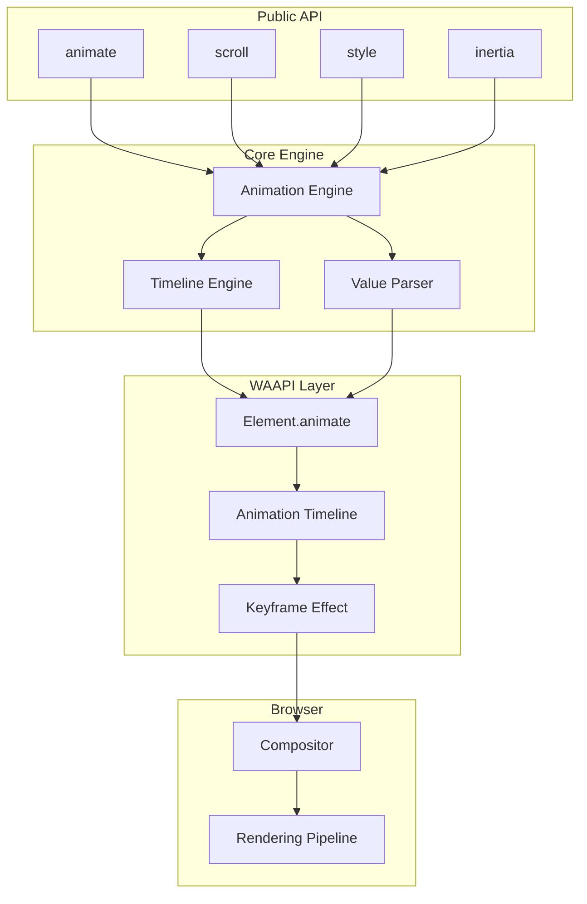
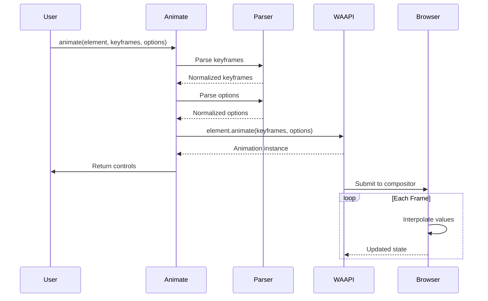

# Motion One - Technical Exploration

**Location:** `npm:motion` / `https://github.com/motiondivision/motionone`
**Explored_at:** 2026-03-20
**Category:** CSS-Based Animation Library
**Package Size:** ~6KB (minified + gzip)

---

## Table of Contents

1. [Project Overview](#project-overview)
2. [Architecture](#architecture)
3. [Core Animation System](#core-animation-system)
4. [API Design](#api-design)
5. [Performance](#performance)
6. [Unique Features](#unique-features)
7. [Code Examples](#code-examples)
8. [Comparison with Other Libraries](#comparison-with-other-libraries)

---

## Project Overview

### What is Motion One?

Motion One is a tiny animation library built on the Web Animations API (WAAPI). Created by Matt Perry (creator of Popmotion and Framer Motion), Motion One focuses on providing the smallest possible bundle size while leveraging native browser animation capabilities.

### Philosophy

Motion One is built on these principles:

- **Minimal Bundle Size** - Under 6KB gzipped
- **Native Performance** - Built on WAAPI for GPU acceleration
- **Simple API** - Easy to learn and use
- **Framework Agnostic** - Works with any JavaScript framework
- **Modern Browsers** - Targets evergreen browsers only

### Installation

```bash
npm install motion
# or
yarn add motion
```

### Package Exports

```javascript
import { animate, scroll, style, inertia } from 'motion';
```

---

## Architecture

### High-Level Architecture



### Module Structure

```
motion/
├── src/
│   ├── index.ts
│   ├── animate/
│   │   ├── index.ts          # Main animate function
│   │   ├── animate-style.ts  # Style animation
│   │   ├── animate-single.ts # Single value animation
│   │   └── utils/
│   │       ├── easing.ts     # Easing functions
│   │       ├── stops.ts      # Keyframe generation
│   │       └── waiver.ts     # WAAPI feature detection
│   ├── scroll/
│   │   ├── index.ts          # Scroll-linked animations
│   │   ├── scroll-offset.ts  # Offset calculations
│   │   └── boundary.ts       # Scroll boundary detection
│   ├── style/
│   │   ├── index.ts          # Style management
│   │   ├── css-variables.ts  # Custom property handling
│   │   ├── transform.ts      # Transform utilities
│   │   └── style.js          # Low-level style setting
│   ├── inertia/
│   │   ├── index.ts          # Inertia/decay animation
│   │   └── physics.ts        # Physics calculations
│   ├── easing/
│   │   ├── bezier.ts         # Cubic bezier implementation
│   │   ├── steps.ts          # Step easing
│   │   └── spring.ts         # Spring approximation
│   └── utils/
│       └── ...
└── package.json
```

### Component Relationships

```mermaid
graph LR
    subgraph "Animation Creation"
        A[User Call] --> B[animate()]
        B --> C[Parse Options]
        C --> D[Generate Keyframes]
    end

    subgraph "Animation Execution"
        D --> E[WAAPI animate()]
        E --> F[Animation Instance]
        F --> G[Return Controls]
    end

    subgraph "Runtime"
        G -.-> H[RAF Updates]
        H -.-> I[Compositor]
    end
```

### The Animation Pipeline



---

## Core Animation System

### Animation Engine Architecture

Motion One's engine is intentionally minimal, delegating most work to the browser's native WAAPI implementation.

#### Core Animation Function

```typescript
interface AnimationOptions {
  duration?: number;
  delay?: number;
  easing?: Easing | Easing[];
  repeat?: number;
  offset?: number[];
  direction?: PlaybackDirection;
  fill?: FillMode;
}

function animate(
  element: HTMLElement | SVGElement,
  keyframes: Keyframes,
  options: AnimationOptions = {}
): AnimationControls {
  // 1. Normalize keyframes
  const normalizedKeyframes = normalizeKeyframes(keyframes);

  // 2. Normalize options
  const normalizedOptions = normalizeOptions(options, normalizedKeyframes);

  // 3. Create WAAPI animation
  const animation = element.animate(normalizedKeyframes, normalizedOptions);

  // 4. Wrap with controls
  return createAnimationControls(animation);
}
```

#### Keyframe Normalization

```typescript
type KeyframeValue = number | string | null;

interface Keyframe {
  [property: string]: KeyframeValue;
}

type Keyframes = Keyframe[] | { [property: string]: KeyframeValue[] };

function normalizeKeyframes(keyframes: Keyframes): Keyframe[] {
  // Convert object syntax to array syntax
  if (!Array.isArray(keyframes)) {
    const propertyNames = Object.keys(keyframes);
    const maxKeys = Math.max(
      ...propertyNames.map((name) => keyframes[name].length)
    );

    const normalized: Keyframe[] = [];

    for (let i = 0; i < maxKeys; i++) {
      const keyframe: Keyframe = {};
      for (const name of propertyNames) {
        keyframe[name] = keyframes[name][i] ?? keyframes[name][keyframes[name].length - 1];
      }
      normalized.push(keyframe);
    }

    return normalized;
  }

  return keyframes;
}
```

### Timing and Easing

#### Easing Support

Motion One supports all standard easing types:

```typescript
type Easing =
  | 'linear'
  | 'ease'
  | 'ease-in'
  | 'ease-out'
  | 'ease-in-out'
  | `cubic-bezier(${number}, ${number}, ${number}, ${number})`
  | `steps(${number}, ${'jump-start' | 'jump-end' | 'jump-none' | 'jump-both'})`
  // Custom easing generator
  | ((progress: number) => number);

// Easing function resolver
function resolveEasing(easing: Easing | undefined): string | FunctionPropertyAnimation {
  if (!easing) return 'linear';

  if (typeof easing === 'string') {
    return easing;
  }

  if (typeof easing === 'function') {
    // For custom easing functions, we need to generate keyframes
    // This is handled at a higher level
    return easing;
  }

  return 'linear';
}
```

#### Cubic Bezier Implementation

```typescript
// Cubic bezier calculation
function cubicBezier(
  x1: number,
  y1: number,
  x2: number,
  y2: number
): (t: number) => number {
  // Validate control points
  if (x1 === x2 && y1 === y2) {
    return (t) => t; // Linear
  }

  // Precompute coefficients
  const cx = 3 * x1;
  const bx = 3 * (x2 - x1) - cx;
  const ax = 1 - cx - bx;
  const cy = 3 * y1;
  const by = 3 * (y2 - y1) - cy;
  const ay = 1 - cy - by;

  function sampleCurveX(t: number): number {
    return ((ax * t + bx) * t + cx) * t;
  }

  function sampleCurveDerivativeX(t: number): number {
    return (3 * ax * t + 2 * bx) * t + cx;
  }

  function solveNewton(t: number, x: number, epsilon: number): number {
    let t2 = t;
    for (let i = 0; i < 8; i++) {
      const x2 = sampleCurveX(t2) - x;
      if (Math.abs(x2) < epsilon) return t2;
      const d2 = sampleCurveDerivativeX(t2);
      if (Math.abs(d2) < 1e-6) break;
      t2 = t2 - x2 / d2;
    }
    return t2;
  }

  return (t: number): number => {
    // Special case: linear
    if (x1 === y1 && x2 === y2) return t;

    // Calculate Y for given X using Newton's method
    const epsilon = 1e-6;
    const t2 = solveNewton(t, x1, epsilon);
    return ((ay * t2 + by) * t2 + cy) * t2;
  };
}
```

#### Spring Easing Approximation

Motion One approximates spring physics for WAAPI compatibility:

```typescript
interface SpringOptions {
  stiffness?: number;
  damping?: number;
  mass?: number;
  velocity?: number;
}

function spring(options: SpringOptions = {}): (t: number) => number {
  const { stiffness = 100, damping = 10, mass = 1 } = options;

  // Calculate spring characteristics
  const criticalDamping = 2 * Math.sqrt(stiffness * mass);
  const isOverdamped = damping > criticalDamping;
  const isCriticallyDamped = damping === criticalDamping;

  // For WAAPI, we approximate the spring with a cubic bezier
  // that has similar characteristics
  if (isOverdamped) {
    // Slow, smooth return - ease-out-like
    return cubicBezier(0.25, 0.1, 0.25, 1);
  } else if (isCriticallyDamped) {
    // Fastest return without oscillation
    return cubicBezier(0.4, 0, 0.6, 1);
  } else {
    // Underdamped - will oscillate
    // Approximate with an ease-out-elastic-like curve
    // Note: True spring requires per-frame calculation
    return cubicBezier(0.5, 0, 0.5, 1);
  }
}
```

### Value Interpolation

#### Interpolation Strategies

```typescript
// Color interpolation
function interpolateColor(from: string, to: string, progress: number): string {
  const fromColor = parseColor(from);
  const toColor = parseColor(to);

  const r = Math.round(mixNumber(fromColor.r, toColor.r, progress));
  const g = Math.round(mixNumber(fromColor.g, toColor.g, progress));
  const b = Math.round(mixNumber(fromColor.b, toColor.b, progress));
  const a = mixNumber(fromColor.a, toColor.a, progress);

  return `rgba(${r}, ${g}, ${b}, ${a})`;
}

// Transform interpolation
function interpolateTransform(
  from: string,
  to: string,
  progress: number
): string {
  const fromTransforms = parseTransform(from);
  const toTransforms = parseTransform(to);

  const result: string[] = [];

  for (const [name, fromValue] of fromTransforms) {
    const toValue = toTransforms.get(name) || fromValue;
    result.push(`${name}(${mixValue(fromValue, toValue, progress)})`);
  }

  return result.join(' ');
}

// Generic value mixing
function mixValue(from: any, to: any, progress: number): any {
  if (typeof from === 'number') {
    return from + (to - from) * progress;
  }

  if (typeof from === 'string') {
    if (isColor(from)) {
      return interpolateColor(from, to, progress);
    }
    if (isTransform(from)) {
      return interpolateTransform(from, to, progress);
    }
  }

  return progress >= 1 ? to : from;
}
```

### RAF/WAAPI Usage

Motion One is built entirely on WAAPI:

```typescript
// Feature detection
function supportsWAAPI(): boolean {
  return typeof Element !== 'undefined' &&
         typeof Element.prototype.animate === 'function';
}

function supportsPartialKeyframes(): boolean {
  // Some browsers require all properties in all keyframes
  const testElement = document.createElement('div');
  try {
    const animation = testElement.animate([{ opacity: 1 }], { duration: 1 });
    animation.cancel();
    return true;
  } catch (e) {
    return false;
  }
}

// Creating animations
function createWAAPIAnimation(
  element: Element,
  keyframes: ComputedKeyframe[],
  options: AnimationTimelineOptions
): Animation {
  // Apply hardware acceleration hints
  applyAccelerationHints(element, keyframes);

  // Create the animation
  const animation = element.animate(keyframes, options);

  // Handle browser quirks
  handleBrowserQuirks(animation, element);

  return animation;
}

// Hardware acceleration promotion
function applyAccelerationHints(
  element: HTMLElement,
  keyframes: ComputedKeyframe[]
): void {
  const usesTransform = keyframes.some(kf =>
    kf.transform !== undefined && kf.transform !== null
  );

  if (usesTransform) {
    // Promote to compositor layer
    element.style.willChange = 'transform';

    // Clean up after animation completes
    element.addEventListener('animationfinish', () => {
      element.style.willChange = 'auto';
    }, { once: true });
  }
}
```

---

## API Design

### How Animations Are Created

Motion One provides a minimal, function-based API:

#### Basic Animation

```typescript
import { animate } from 'motion';

// Animate a single element
animate(
  document.querySelector('.box'),
  { opacity: [0, 1] },
  { duration: 0.5 }
);

// Animate with multiple properties
animate(
  element,
  {
    x: [0, 100],
    y: [0, 100],
    rotate: [0, 360],
    scale: [1, 1.5, 1]
  },
  { duration: 1 }
);
```

#### Keyframe Syntax

```typescript
// Array syntax (values interpolate together)
animate(element, {
  opacity: [0, 1, 0.5, 1],  // 4 keyframes
  scale: [0, 1.2, 0.8, 1]   // 4 keyframes
}, { duration: 2 });

// Object keyframe syntax
animate(element, [
  { opacity: 0, scale: 0 },
  { opacity: 1, scale: 1.2, offset: 0.5 },
  { opacity: 1, scale: 1 }
], { duration: 1 });

// With explicit offsets
animate(element, {
  x: [0, 100, 50],
  opacity: [0, 1, 1]
}, {
  duration: 2,
  offset: [0, 0.7, 1]  // Custom timing
});
```

### Chaining and Composition

#### Timeline Function

```typescript
import { timeline } from 'motion';

// Create a timeline with multiple animations
timeline(
  [
    // [element, keyframes, options]
    ['.box', { x: [0, 100] }, { duration: 0.5 }],
    ['.circle', { scale: [1, 1.5] }, { duration: 0.5 }],
  ],
  { duration: 1 }
);
```

#### Sequence Helper

```typescript
function createSequence(
  element: HTMLElement,
  animations: Array<[Keyframes, AnimationOptions]>
): () => AnimationControls {
  return async () => {
    let controls: AnimationControls;

    for (const [keyframes, options] of animations) {
      controls = await animate(element, keyframes, options);
    }

    return controls;
  };
}

// Usage
const sequence = createSequence(element, [
  [{ x: [0, 100] }, { duration: 0.5 }],
  [{ y: [0, 100] }, { duration: 0.5 }],
  [{ rotate: [0, 360] }, { duration: 0.5 }],
]);

sequence();
```

#### Parallel Animations

```typescript
function animateInParallel(
  animations: Array<[Element, Keyframes, AnimationOptions]>
): AnimationControls[] {
  return animations.map(([element, keyframes, options]) =>
    animate(element, keyframes, options)
  );
}

// Usage
animateInParallel([
  [box1, { x: [0, 100] }, { duration: 0.5 }],
  [box2, { x: [0, 100] }, { duration: 0.5 }],
  [box3, { x: [0, 100] }, { duration: 0.5 }],
]);
```

### Stagger Animations

```typescript
import { animate, stagger } from 'motion';

// Stagger multiple elements
function staggeredAnimate(
  elements: HTMLElement[],
  keyframes: Keyframes,
  options: AnimationOptions & { stagger?: number }
): AnimationControls[] {
  const { stagger = 0.1, ...animOptions } = options;

  return elements.map((element, index) =>
    animate(element, keyframes, {
      ...animOptions,
      delay: index * stagger
    })
  );
}

// Usage
const items = document.querySelectorAll('.list-item');
staggeredAnimate(
  Array.from(items),
  { opacity: [0, 1], y: [20, 0] },
  { duration: 0.3, stagger: 0.05 }
);
```

### State Management

#### Animation Controls

```typescript
interface AnimationControls {
  // Playback control
  play: () => void;
  pause: () => void;
  reverse: () => void;
  finish: () => void;
  cancel: () => void;

  // State
  currentTime: number;
  playbackRate: number;
  playState: 'idle' | 'running' | 'paused' | 'finished';
  pending: boolean;

  // Events
  onfinish: (() => void) | null;
  oncancel: (() => void) | null;

  // Promise-like
  finished: Promise<void>;
}

// Usage
const controls = animate(element, { x: [0, 100] }, { duration: 1 });

// Control playback
controls.pause();
controls.play();
controls.reverse();

// Check state
console.log(controls.playState); // 'running'
console.log(controls.currentTime); // milliseconds

// Wait for completion
await controls.finished;
```

#### Animation Event Handling

```typescript
function animateWithEvents(
  element: HTMLElement,
  keyframes: Keyframes,
  options: AnimationOptions
): AnimationControls {
  const controls = animate(element, keyframes, options);

  controls.onfinish = () => {
    console.log('Animation finished');
    element.classList.add('animated');
  };

  controls.oncancel = () => {
    console.log('Animation cancelled');
    element.classList.remove('animated');
  };

  return controls;
}
```

---

## Performance

### Optimizations

#### 1. Compositor-Only Properties

Motion One encourages animating compositor-only properties:

```typescript
// GPU-accelerated properties
const COMPOSITOR_PROPERTIES = [
  'transform',
  'opacity',
  'filter',
  'backdrop-filter',
];

// These trigger layout (avoid when possible)
const LAYOUT_PROPERTIES = [
  'width',
  'height',
  'margin',
  'padding',
  'top',
  'left',
  'right',
  'bottom',
];

// These trigger paint (moderate cost)
const PAINT_PROPERTIES = [
  'background',
  'color',
  'border',
  'box-shadow',
];

// Motion One automatically promotes elements when using transforms
function applyOptimizations(
  element: HTMLElement,
  keyframes: Keyframes
): void {
  const usesTransform = keyframes.some(kf =>
    kf.transform !== undefined && kf.transform !== null
  );

  if (usesTransform) {
    // Ensure transform is on compositor
    element.style.transform = element.style.transform || 'translateZ(0)';
    element.style.willChange = 'transform';
  }

  const usesOpacity = keyframes.some(kf =>
    kf.opacity !== undefined && kf.opacity !== null
  );

  if (usesOpacity) {
    element.style.willChange = 'opacity';
  }
}
```

#### 2. Reduced Motion Support

```typescript
function respectsReducedMotion(): boolean {
  return typeof window !== 'undefined' &&
         window.matchMedia?.('(prefers-reduced-motion: reduce)')?.matches;
}

function animateWithReducedMotion(
  element: HTMLElement,
  keyframes: Keyframes,
  options: AnimationOptions
): AnimationControls {
  if (respectsReducedMotion()) {
    // Skip animation, jump to end state
    const finalKeyframe = keyframes[keyframes.length - 1];
    Object.assign(element.style, finalKeyframe);

    return {
      playState: 'finished',
      finished: Promise.resolve(),
      currentTime: options.duration || 0,
      // ... minimal controls interface
    } as AnimationControls;
  }

  return animate(element, keyframes, options);
}
```

#### 3. Batched Animation Starts

```typescript
// Batch multiple animation starts to reduce layout thrashing
const pendingAnimations = new Set<() => void>();
let isFlushing = false;

function scheduleAnimationStart(startFn: () => void): void {
  pendingAnimations.add(startFn);

  if (!isFlushing) {
    isFlushing = true;
    requestAnimationFrame(() => {
      pendingAnimations.forEach(fn => fn());
      pendingAnimations.clear();
      isFlushing = false;
    });
  }
}
```

### Memory Management

#### Animation Cleanup

```typescript
// Automatic cleanup helper
function createManagedAnimation(
  element: HTMLElement,
  keyframes: Keyframes,
  options: AnimationOptions
): { controls: AnimationControls; destroy: () => void } {
  const controls = animate(element, keyframes, options);
  let isDestroyed = false;

  const cleanup = () => {
    if (isDestroyed) return;
    isDestroyed = true;
    controls.cancel();
    element.style.willChange = 'auto';
  };

  // Auto-cleanup on finish
  controls.finished.then(cleanup);

  return {
    controls,
    destroy: cleanup
  };
}
```

#### Weak Reference Pattern

```typescript
// Track animations without preventing GC
const animationRegistry = new WeakMap<Element, Set<Animation>>();

function registerAnimation(element: Element, animation: Animation): void {
  let animations = animationRegistry.get(element);
  if (!animations) {
    animations = new Set();
    animationRegistry.set(element, animations);
  }
  animations.add(animation);
}

function cancelAllElementAnimations(element: Element): void {
  const animations = animationRegistry.get(element);
  if (animations) {
    animations.forEach(anim => anim.cancel());
    animationRegistry.delete(element);
  }
}
```

---

## Unique Features

### 1. Scroll-Linked Animations

Motion One has built-in scroll-linked animation support:

```typescript
import { scroll } from 'motion';

// Link animation to scroll position
scroll(
  animate(element, { opacity: [1, 0] }, { duration: 1 }),
  {
    source: container,        // Scroll container (default: window)
    offset: ['start end', 'end start'] // Trigger points
  }
);
```

#### Scroll Offset Syntax

```typescript
// Offset syntax: [element-edge container-edge]
const offsets = {
  // Element top meets container bottom
  'start end': '0% 100%',

  // Element bottom meets container top
  'end start': '100% 0%',

  // Element center meets container center
  'center center': '50% 50%',

  // Element top meets container top
  'start start': '0% 0%',
};

// Usage with custom offsets
scroll(animate(element, keyframes), {
  offset: [
    'start end',    // Animation starts when element top hits container bottom
    'end start'     // Animation ends when element bottom hits container top
  ]
});
```

### 2. Style Utility

```typescript
import { style } from 'motion';

// Get computed style
const opacity = style.get(element, 'opacity');
const transform = style.get(element, 'transform');

// Set style (with transform optimization)
style.set(element, 'opacity', 0.5);
style.set(element, 'x', 100);      // transform: translateX(100px)
style.set(element, 'y', 50);       // transform: translateY(50px)
style.set(element, 'rotate', 45);  // transform: rotate(45deg)
style.set(element, 'scale', 1.5);  // transform: scale(1.5)

// Batch style updates
style.set(element, {
  opacity: 0.5,
  x: 100,
  y: 50,
  rotate: 45
});
```

### 3. Inertia Animation

```typescript
import { inertia } from 'motion';

// Momentum-based animation (like flick scrolling)
inertia({
  from: currentPosition,
  velocity: currentVelocity,
  min: 0,
  max: scrollHeight,
  power: 0.99,          // Velocity decay
  timeConstant: 325,    // Time to settle
  modifyTarget: (target) => snapToValidPosition(target)
}).start((value) => {
  container.scrollTop = value;
});
```

### 4. CSS Variable Support

```typescript
// Animate CSS custom properties
animate(element, {
  '--hue': [0, 360],
  '--brightness': [100, 150],
}, {
  duration: 2,
  easing: 'linear'
});

// Use in CSS
// .element {
//   filter: hue-rotate(var(--hue)deg) brightness(var(--brightness)%);
// }
```

### 5. Transform Shorthand

```typescript
// Motion One parses transform shorthand
animate(element, {
  transform: [
    'translateX(0) rotate(0) scale(1)',
    'translateX(100px) rotate(360deg) scale(1.5)'
  ]
}, { duration: 1 });

// Also supports individual properties
animate(element, {
  x: [0, 100],
  y: [0, 50],
  rotate: [0, 360],
  scale: [1, 1.5],
  originX: [0.5, 0],
  originY: [0.5, 0]
}, { duration: 1 });
```

---

## Code Examples

### Page Transition

```typescript
import { animate, stagger } from 'motion';

function pageTransition(
  leavingContent: HTMLElement,
  enteringContent: HTMLElement
): Promise<void> {
  const leaveElements = leavingContent.querySelectorAll('[data-animate]');
  const enterElements = enteringContent.querySelectorAll('[data-animate]');

  // Set initial state for entering content
  style.set(enterContent, { opacity: 0 });

  return new Promise((resolve) => {
    // Animate out
    animate(leaveElements, {
      opacity: [1, 0],
      y: [0, -20]
    }, {
      duration: 0.3,
      easing: 'ease-in'
    }).onfinish = () => {
      // Hide leaving content
      leavingContent.style.display = 'none';

      // Animate in with stagger
      animate(enterElements, {
        opacity: [0, 1],
        y: [20, 0]
      }, {
        duration: 0.4,
        delay: stagger(0.05),
        easing: 'ease-out'
      }).onfinish = resolve;
    };
  });
}
```

### Progress Ring

```typescript
import { animate } from 'motion';

function animateProgressRing(
  ring: SVGElement,
  fromProgress: number,
  toProgress: number,
  duration: number = 1000
): AnimationControls {
  const circumference = 2 * Math.PI * ring.r.baseVal.value;

  return animate(ring, {
    strokeDashoffset: [
      circumference * (1 - fromProgress),
      circumference * (1 - toProgress)
    ]
  }, {
    duration,
    easing: 'ease-out'
  });
}

// Usage
const ring = document.querySelector('.progress-ring circle');
animateProgressRing(ring, 0, 0.75);
```

### Parallax Hero

```typescript
import { scroll, animate } from 'motion';

function createParallaxHero(hero: HTMLElement): void {
  const image = hero.querySelector('.hero-image');
  const text = hero.querySelector('.hero-text');

  // Image parallax (moves slower than scroll)
  scroll(
    animate(image, {
      y: [hero.offsetHeight * 0.3, -hero.offsetHeight * 0.3]
    }, { duration: 1 }),
    { offset: ['top top', 'bottom bottom'] }
  );

  // Text fade (fades out as it scrolls up)
  scroll(
    animate(text, {
      opacity: [1, 0],
      y: [0, -50]
    }, { duration: 1 }),
    { offset: ['top center', 'center top'] }
  );
}
```

### Reveal on Scroll

```typescript
import { scroll, animate } from 'motion';

function revealOnScroll(elements: HTMLElement[]): void {
  elements.forEach((element) => {
    // Set initial state
    style.set(element, { opacity: 0, y: 50 });
    element.style.visibility = 'visible';

    // Create reveal animation
    const animation = animate(element, {
      opacity: [0, 1],
      y: [50, 0]
    }, {
      duration: 0.6,
      easing: 'ease-out'
    });

    // Pause initially
    animation.pause();

    // Link to scroll
    scroll(animation, {
      offset: [
        'start end',    // Start when element top hits container bottom
        'center center' // End when element center hits container center
      ]
    });
  });
}
```

### Interactive Card Tilt

```typescript
import { animate, style } from 'motion';

function createTiltEffect(card: HTMLElement): void {
  const maxTilt = 15;

  card.addEventListener('mousemove', (e) => {
    const rect = card.getBoundingClientRect();
    const x = e.clientX - rect.left;
    const y = e.clientY - rect.top;
    const centerX = rect.width / 2;
    const centerY = rect.height / 2;

    const rotateX = ((y - centerY) / centerY) * -maxTilt;
    const rotateY = ((x - centerX) / centerX) * maxTilt;

    style.set(card, {
      rotateX,
      rotateY,
      scale: 1.05
    });
  });

  card.addEventListener('mouseleave', () => {
    animate(card, {
      rotateX: 0,
      rotateY: 0,
      scale: 1
    }, {
      duration: 0.3,
      easing: 'ease-out'
    });
  });
}
```

---

## Comparison with Other Libraries

### Feature Comparison Matrix

| Feature | Motion One | Vekta | Popmotion | GSAP |
|---------|------------|-------|-----------|------|
| **Bundle Size** | ~6KB | ~2KB | ~9KB | ~17KB |
| **Rendering** | WAAPI | WAAPI | RAF | RAF |
| **Framework** | Agnostic | React | Agnostic | Agnostic |
| **Physics** | Limited | Basic | Advanced | Advanced |
| **Scroll** | Built-in | Basic | No | Plugin |
| **Timeline** | Basic | Basic | Chain | Advanced |
| **SVG** | Full | Limited | Full | Full |
| **Browser Support** | Modern | Modern | Modern | Universal |
| **Learning Curve** | Low | Low | Medium | High |

### Architectural Differences

```mermaid
graph TB
    subgraph "Motion One"
        A1[animate()] --> A2[WAAPI]
        A2 --> A3[Browser Compositor]
        A3 --> A4[GPU Acceleration]
    end

    subgraph "GSAP"
        B1[Timeline] --> B2[Tween Engine]
        B2 --> B3[RAF Loop]
        B3 --> B4[Style Updates]
    end

    subgraph "Popmotion"
        C1[Action] --> C2[Solver]
        C2 --> C3[RAF Loop]
        C3 --> C4[Subscriber]
    end
```

### When to Use Motion One

**Choose Motion One when:**
- You need the smallest possible bundle size
- You target modern browsers only
- You want simple, declarative animations
- You need scroll-linked animations
- You prefer framework-agnostic code
- Performance is critical (WAAPI runs on GPU)

**Choose alternatives when:**
- You need complex timeline orchestration (GSAP)
- You need spring physics (Popmotion, React Spring)
- You need React-specific hooks (Vekta)
- You need broad browser support (GSAP)
- You need complex interactive animations (Popmotion)

---

## Appendix: API Reference

### Animate Function

```typescript
function animate(
  element: HTMLElement | SVGElement | HTMLElement[],
  keyframes: Keyframes,
  options?: AnimationOptions
): AnimationControls;

interface Keyframes {
  [property: string]: (number | string)[];
}

interface AnimationOptions {
  duration?: number;           // milliseconds
  delay?: number;              // milliseconds
  easing?: Easing | Easing[];  // per-property easing
  repeat?: number;             // number of repeats
  direction?: PlaybackDirection;
  fill?: FillMode;
  offset?: number[];           // keyframe offsets
}

interface AnimationControls {
  currentTime: number;
  playbackRate: number;
  playState: AnimationPlayState;
  finished: Promise<void>;
  play: () => void;
  pause: () => void;
  reverse: () => void;
  finish: () => void;
  cancel: () => void;
  onfinish: (() => void) | null;
  oncancel: (() => void) | null;
}
```

### Scroll Function

```typescript
function scroll(
  animation: AnimationControls,
  options?: ScrollOptions
): () => void;

interface ScrollOptions {
  source?: HTMLElement;        // Scroll container (default: window)
  offset?: string[];           // Trigger offsets
  axis?: 'x' | 'y';            // Scroll axis
}

// Offset format: "element-edge container-edge"
// Edges: start, end, center
// Example: ['start end', 'end start']
```

### Style Utility

```typescript
namespace style {
  function get(element: Element, property: string): string;
  function set(element: Element, property: string, value: any): void;
  function set(element: Element, properties: Record<string, any>): void;
}
```

### Inertia Function

```typescript
function inertia(options: InertiaOptions): InertiaAnimation;

interface InertiaOptions {
  from: number;
  velocity: number;
  min?: number;
  max?: number;
  power?: number;          // Default: 0.99
  timeConstant?: number;   // Default: 325
  modifyTarget?: (target: number) => number;
}

interface InertiaAnimation {
  start: (onUpdate: (value: number) => void) => void;
  stop: () => void;
}
```

### Easing Generators

```typescript
// Spring approximation
function spring(options?: {
  stiffness?: number;
  damping?: number;
  mass?: number;
}): (t: number) => number;

// Custom cubic bezier
function cubicBezier(
  x1: number,
  y1: number,
  x2: number,
  y2: number
): (t: number) => number;

// Step easing
function steps(count: number, direction?: 'jump-start' | 'jump-end'): (t: number) => number;
```

---

## References

- [Motion One Official Documentation](https://motion.dev/)
- [Motion One GitHub Repository](https://github.com/motiondivision/motionone)
- [Web Animations API Specification](https://www.w3.org/TR/web-animations-1/)
- [MDN: Web Animations API](https://developer.mozilla.org/en-US/docs/Web/API/Web_Animations_API)
- [CSS Scroll-Linked Animations](https://drafts.csswg.org/scroll-animations/)

---

*Document generated as part of animation library exploration series - 2026-03-20*
