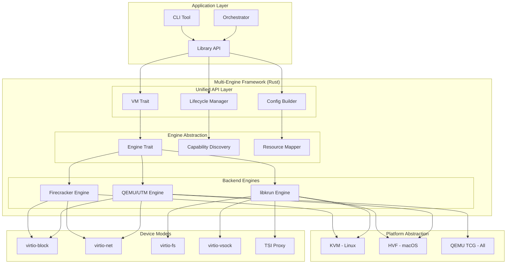

# Multi-Engine MicroVM Framework Exploration

## Project Vision

A unified, extensible Rust framework that abstracts multiple virtualization backends (Firecracker/KVM, libkrun/KVM-HVF, QEMU/HVF) into a single coherent API for creating and managing lightweight virtual machines and containerized workloads across Linux and macOS.

## Motivation

The three explored technologies each solve similar problems but with different approaches:

| Aspect | Firecracker | libkrun | UTM (QEMU) |
|--------|-------------|---------|------------|
| **Primary Use** | Serverless microVMs | Container VMs | Full system emulation |
| **Backend** | KVM only | KVM (Linux), HVF (macOS) | QEMU (all), HVF (macOS) |
| **Boot Time** | < 125ms | ~230ms | 2-5s |
| **Memory Overhead** | ~30MB VMM | ~20MB VMM | ~100MB+ QEMU |
| **Device Model** | Minimal VirtIO | Extensive VirtIO + TSI | Full device emulation |
| **API** | REST over Unix socket | C API (embeddable) | AppleScript + utmctl |
| **Security** | Seccomp + Jail + namespaces | Process isolation | App sandbox (macOS) |
| **Snapshot Support** | Full + Diff | Limited | Full (QEMU) |
| **Networking** | TAP/CNI | TSI (transparent), passt, tap | User/bridged/shared |
| **Platform** | Linux only | Linux + macOS | macOS (this impl) |

**The Opportunity:** Combine the strengths of all three:
1. **Firecracker's** security-first design and fast boot
2. **libkrun's** embeddable architecture and cross-platform KVM/HVF
3. **UTM's** user-friendly automation and full emulation fallback

## Target Architecture



## Crate Structure

```
multi-engine-microvm/
├── Cargo.toml                    # Workspace definition
├── README.md
├── LICENSE                       # Apache-2.0 OR MIT
│
├── crates/
│   ├── microvm-core/             # Core traits and types
│   │   ├── Cargo.toml
│   │   └── src/
│   │       ├── lib.rs
│   │       ├── vm.rs             # VMTrait definition
│   │       ├── engine.rs         # EngineTrait definition
│   │       ├── config.rs         # VM configuration builder
│   │       ├── lifecycle.rs      # State machine, lifecycle events
│   │       ├── error.rs          # Unified error types
│   │       └── capabilities.rs   # Feature discovery
│   │
│   ├── engine-firecracker/       # Firecracker backend
│   │   ├── Cargo.toml
│   │   └── src/
│   │       ├── lib.rs
│   │       ├── engine.rs         # EngineTrait implementation
│   │       ├── api_client.rs     # REST API client
│   │       ├── jailer.rs         # Jailer integration
│   │       └── snapshot.rs       # Snapshot management
│   │
│   ├── engine-libkrun/           # libkrun backend
│   │   ├── Cargo.toml
│   │   └── src/
│   │       ├── lib.rs
│   │       ├── engine.rs         # EngineTrait implementation
│   │       ├── context.rs        # KrunContext wrapper
│   │       ├── tsi.rs            # TSI networking
│   │       └── devices.rs        # VirtIO device config
│   │
│   ├── engine-qemu/              # QEMU/UTM backend
│   │   ├── Cargo.toml
│   │   └── src/
│   │       ├── lib.rs
│   │       ├── engine.rs         # EngineTrait implementation
│   │       ├── qemu_cli.rs       # QEMU CLI builder
│   │       ├── applescript.rs    # UTM automation (macOS)
│   │       └── utmctl.rs         # utmctl wrapper
│   │
│   ├── platform-kvm/             # KVM platform abstraction
│   │   ├── Cargo.toml
│   │   └── src/
│   │       ├── lib.rs
│   │       ├── vm_fd.rs          # VM file descriptor
│   │       ├── vcpu.rs           # vCPU management
│   │       └── memory.rs         # Guest memory
│   │
│   ├── platform-hvf/             # HVF platform abstraction (macOS)
│   │   ├── Cargo.toml
│   │   └── src/
│   │       ├── lib.rs
│   │       ├── vm.rs             # HVF VM
│   │       ├── vcpu.rs           # HVF vCPU
│   │       └── memory.rs         # HVF memory
│   │
│   ├── devices-virtio/           # Shared VirtIO device models
│   │   ├── Cargo.toml
│   │   └── src/
│   │       ├── lib.rs
│   │       ├── block.rs          # virtio-block
│   │       ├── net.rs            # virtio-net
│   │       ├── fs.rs             # virtio-fs
│   │       ├── vsock.rs          # virtio-vsock
│   │       ├── balloon.rs        # virtio-balloon
│   │       └── rng.rs            # virtio-rng
│   │
│   ├── networking/               # Networking abstractions
│   │   ├── Cargo.toml │   │   └── src/
│   │       ├── lib.rs
│   │       ├── tap.rs            # TAP device management
│   │       ├── tsi.rs            # TSI proxy implementation
│   │       ├── passt.rs          # passt integration
│   │       └── cninet.rs         # CNI networking
│   │
│   └── microvm-cli/              # CLI tool
│       ├── Cargo.toml
│       └── src/
│           ├── main.rs
│           ├── commands/
│           │   ├── create.rs
│           │   ├── start.rs
│           │   ├── stop.rs
│           │   ├── snapshot.rs
│           │   └── list.rs
│           └── config/
│               └── cli.rs
│
└── examples/
    ├── basic-vm/                 # Basic VM creation
    ├── container-vm/             # Container in microVM
    ├── snapshot-restore/         # Snapshot demo
    └── multi-vm-orchestration/   # Multiple VMs
```

## Core Traits

### VMTrait

The foundational trait that all VM implementations must implement:

```rust
/// Core VM trait abstracting lifecycle and operations
#[async_trait]
pub trait VM: Send + Sync {
    /// Unique identifier for this VM
    fn id(&self) -> &str;

    /// Human-readable name
    fn name(&self) -> &str;

    /// Current VM state
    fn state(&self) -> VMState;

    /// Get VM configuration
    fn config(&self) -> &VMConfig;

    /// Start the VM
    async fn start(&mut self) -> Result<()>;

    /// Stop the VM gracefully
    async fn stop(&mut self) -> Result<()>;

    /// Force stop the VM
    async fn kill(&mut self) -> Result<()>;

    /// Pause VM execution
    async fn pause(&mut self) -> Result<()>;

    /// Resume from paused state
    async fn resume(&mut self) -> Result<()>;

    /// Check if VM is running
    fn is_running(&self) -> bool;

    /// Get VM exit code (if exited)
    fn exit_code(&self) -> Option<i32>;
}

/// VM lifecycle states
#[derive(Debug, Clone, PartialEq)]
pub enum VMState {
    Created,
    Starting,
    Running,
    Paused,
    Stopping,
    Stopped,
    Snapshotting,
    Restoring,
    Error(String),
}
```

### EngineTrait

The engine abstraction that each backend implements:

```rust
/// Engine trait for backend implementations
#[async_trait]
pub trait Engine: Send + Sync {
    /// Engine name (firecracker, libkrun, qemu)
    fn name(&self) -> &'static str;

    /// Engine version
    fn version(&self) -> &str;

    /// Check if engine is available on this platform
    fn is_available() -> Result<bool>;

    /// Get engine capabilities
    fn capabilities(&self) -> EngineCapabilities;

    /// Create a new VM instance
    async fn create_vm(&self, config: VMConfig) -> Result<Box<dyn VM>>;

    /// Load existing VM from state
    async fn load_vm(&self, id: &str) -> Result<Box<dyn VM>>;

    /// List all VMs managed by this engine
    async fn list_vms(&self) -> Result<Vec<VMInfo>>;

    /// Remove a VM
    async fn remove_vm(&self, id: &str) -> Result<()>;

    /// Create a snapshot
    async fn snapshot(&self, vm_id: &str, path: &Path) -> Result<()>;

    /// Restore from snapshot
    async fn restore(&self, snapshot_path: &Path) -> Result<Box<dyn VM>>;
}

/// Engine feature capabilities
#[derive(Debug, Clone)]
pub struct EngineCapabilities {
    /// Fast boot (< 500ms)
    pub fast_boot: bool,
    /// Snapshot support
    pub snapshots: bool,
    /// Diff snapshots
    pub diff_snapshots: bool,
    /// Live migration
    pub live_migration: bool,
    /// Memory ballooning
    pub memory_ballooning: bool,
    /// GPU passthrough
    pub gpu_passthrough: bool,
    /// virtio-fs support
    pub virtio_fs: bool,
    /// TSI networking
    pub tsi_networking: bool,
    /// Confidential computing (SEV/TDX)
    pub confidential: bool,
    /// Platform support
    pub platforms: Vec<Platform>,
}

#[derive(Debug, Clone, PartialEq)]
pub enum Platform {
    LinuxX86_64,
    LinuxAArch64,
    MacOSAArch64,
    MacOSX86_64,
}
```

### VMConfig Builder

Unified configuration builder that adapts to each engine:

```rust
/// VM configuration builder
#[derive(Debug, Clone)]
pub struct VMConfig {
    /// VM identifier
    pub id: String,
    /// VM name
    pub name: String,
    /// Number of vCPUs
    pub vcpus: u8,
    /// Memory in MiB
    pub memory_mib: u32,
    /// Boot source
    pub boot: BootConfig,
    /// Disk devices
    pub disks: Vec<DiskConfig>,
    /// Network interfaces
    pub networks: Vec<NetworkConfig>,
    /// virtio-fs mounts
    pub fs_mounts: Vec<FsMountConfig>,
    /// Engine-specific options
    pub engine_options: EngineOptions,
}

#[derive(Debug, Clone)]
pub struct BootConfig {
    /// Kernel image path
    pub kernel: Option<PathBuf>,
    /// Initramfs path
    pub initramfs: Option<PathBuf>,
    /// Kernel command line
    pub cmdline: String,
    /// Root disk ID
    pub root_disk_id: Option<String>,
    /// EFI boot (for QEMU/libkrun-efi)
    pub efi_boot: bool,
}

#[derive(Debug, Clone)]
pub struct DiskConfig {
    /// Disk identifier
    pub id: String,
    /// Path to disk image
    pub path: PathBuf,
    /// Is root filesystem
    pub is_root: bool,
    /// Read-only flag
    pub read_only: bool,
    /// Disk interface (virtio, nvme, ide)
    pub interface: DiskInterface,
}

#[derive(Debug, Clone)]
pub enum DiskInterface {
    Virtio,
    Nvme,
    Ide,
    Sata,
}

#[derive(Debug, Clone)]
pub struct NetworkConfig {
    /// Interface ID
    pub id: String,
    /// Network type
    pub net_type: NetworkType,
    /// MAC address (optional)
    pub mac_address: Option<MacAddress>,
    /// Host device (tap, passt socket)
    pub host_device: Option<HostDevice>,
}

#[derive(Debug, Clone)]
pub enum NetworkType {
    /// TAP device with CNI
    Tap,
    /// User-mode networking (passt)
    Passt,
    /// TSI socket proxy (libkrun)
    Tsi,
    /// Bridged networking
    Bridged,
    /// Host-only network
    HostOnly,
    /// Shared/NAT network
    Shared,
}

/// Builder pattern for VMConfig
impl VMConfigBuilder {
    pub fn new(id: impl Into<String>) -> Self { /* ... */ }

    pub fn vcpus(mut self, count: u8) -> Self { /* ... */ }

    pub fn memory(mut self, mib: u32) -> Self { /* ... */ }

    pub fn kernel(mut self, path: impl Into<PathBuf>) -> Self { /* ... */ }

    pub fn rootfs(mut self, path: impl Into<PathBuf>) -> Self { /* ... */ }

    pub fn network(mut self, config: NetworkConfig) -> Self { /* ... */ }

    pub fn disk(mut self, config: DiskConfig) -> Self { /* ... */ }

    pub fn build(self) -> Result<VMConfig> { /* ... */ }
}
```

## Engine Implementations

### Firecracker Engine

Leverages Firecracker's REST API and jailer:

```rust
pub struct FirecrackerEngine {
    binary_path: PathBuf,
    jailer_path: Option<PathBuf>,
    api_sock_path: PathBuf,
    seccomp_level: SeccompLevel,
}

#[async_trait]
impl Engine for FirecrackerEngine {
    fn name(&self) -> &'static str { "firecracker" }

    fn version(&self) -> &str { /* query binary */ }

    fn is_available() -> Result<bool> {
        // Check /dev/kvm exists and user has access
        // Check firecracker binary exists
        Ok(std::path::Path::new("/dev/kvm").exists())
    }

    fn capabilities(&self) -> EngineCapabilities {
        EngineCapabilities {
            fast_boot: true,
            snapshots: true,
            diff_snapshots: true,
            live_migration: false,
            memory_ballooning: true,
            gpu_passthrough: false,
            virtio_fs: false,
            tsi_networking: false,
            confidential: false,
            platforms: vec![Platform::LinuxX86_64, Platform::LinuxAArch64],
        }
    }

    async fn create_vm(&self, config: VMConfig) -> Result<Box<dyn VM>> {
        // Create jailer directory structure
        // Copy firecracker binary to jail
        // Write config.json
        // Spawn firecracker process via jailer
        // Connect to API socket
        // Configure and boot VM
        Ok(Box::new(FirecrackerVM::new(...)))
    }
}

pub struct FirecrackerVM {
    id: String,
    name: String,
    config: VMConfig,
    state: VMState,
    api_client: FirecrackerApiClient,
    jailer_child: Option<Child>,
}
```

### libkrun Engine

Embeds libkrun directly via FFI:

```rust
pub struct LibkrunEngine {
    lib_path: Option<PathBuf>,  // Dynamic library path
    variants: LibkrunVariants,
}

#[derive(Debug)]
pub struct LibkrunVariants {
    generic: Option<PathBuf>,    // libkrun.so
    sev: Option<PathBuf>,        // libkrun-sev.so
    tdx: Option<PathBuf>,        // libkrun-tdx.so
    efi: Option<PathBuf>,        // libkrun-efi.so
}

#[async_trait]
impl Engine for LibkrunEngine {
    fn name(&self) -> &'static str { "libkrun" }

    fn is_available() -> Result<bool> {
        // Check for libkrun.so or bundled library
        Ok(true)  // Can bundle statically
    }

    fn capabilities(&self) -> EngineCapabilities {
        EngineCapabilities {
            fast_boot: true,
            snapshots: false,
            diff_snapshots: false,
            live_migration: false,
            memory_ballooning: true,
            gpu_passthrough: true,  // via virgl
            virtio_fs: true,
            tsi_networking: true,   // Unique feature!
            confidential: true,     // SEV/TDX variants
            platforms: vec![
                Platform::LinuxX86_64,
                Platform::LinuxAArch64,
                Platform::MacOSAArch64,
            ],
        }
    }

    async fn create_vm(&self, config: VMConfig) -> Result<Box<dyn VM>> {
        // Create krun context via FFI
        // Configure VM (vCPUs, memory, devices)
        // Set up TSI port mappings if requested
        // Enter VM (blocking call in spawned task)
        Ok(Box::new(LibkrunVM::new(...)))
    }
}

/// Rust wrapper around libkrun FFI
pub struct LibkrunContext {
    ctx_id: u32,
    _marker: PhantomData<*mut ()>,  // Not Send/Sync by default
}

impl LibkrunContext {
    pub fn create() -> Result<Self> {
        let ctx_id = unsafe { krun_create_ctx() };
        if ctx_id < 0 {
            return Err(LibkrunError::ContextCreationFailed);
        }
        Ok(Self {
            ctx_id: ctx_id as u32,
            _marker: PhantomData,
        })
    }

    pub fn set_vm_config(&mut self, vcpus: u8, ram_mib: u32) -> Result<()> {
        let ret = unsafe {
            krun_set_vm_config(self.ctx_id, vcpus, ram_mib)
        };
        if ret < 0 { Err(LibkrunError::ConfigFailed) } else { Ok(()) }
    }

    pub fn add_tsi_port_mapping(&mut self, guest_port: u16, host_port: u16) -> Result<()> {
        // Uses libkrun's TSI for socket proxying
        let ret = unsafe {
            krun_add_tsi_port(self.ctx_id, guest_port, host_port)
        };
        if ret < 0 { Err(LibkrunError::PortMappingFailed) } else { Ok(()) }
    }

    pub fn enter(&self) -> Result<i32> {
        // Blocking call - run in spawned task
        let ret = unsafe { krun_start_enter(self.ctx_id) };
        if ret < 0 { Err(LibkrunError::VMExit) } else { Ok(ret) }
    }
}
```

### QEMU/UTM Engine

Wraps QEMU CLI on Linux and UTM automation on macOS:

```rust
pub struct QemuEngine {
    qemu_bin: PathBuf,         // qemu-system-x86_64 or qemu-system-aarch64
    storage_root: PathBuf,
    platform: Platform,
}

#[cfg(target_os = "macos")]
pub struct UTMEngine {
    utm_app_path: PathBuf,
    driver: UTMDriver,  // Version-specific
}

#[async_trait]
impl Engine for QemuEngine {
    fn name(&self) -> &'static str {
        if cfg!(target_os = "macos") { "qemu-utm" } else { "qemu" }
    }

    fn capabilities(&self) -> EngineCapabilities {
        EngineCapabilities {
            fast_boot: false,
            snapshots: true,
            diff_snapshots: false,
            live_migration: true,
            memory_ballooning: true,
            gpu_passthrough: cfg!(target_os = "macos"),  // UTM GPU
            virtio_fs: true,
            tsi_networking: false,
            confidential: false,
            platforms: vec![/* all platforms */],
        }
    }

    async fn create_vm(&self, config: VMConfig) -> Result<Box<dyn VM>> {
        if cfg!(target_os = "macos") {
            // Use AppleScript/utmctl for UTM
            self.create_utm_vm(config).await
        } else {
            // Use QEMU CLI directly
            self.create_qemu_vm(config).await
        }
    }
}

#[cfg(target_os = "macos")]
impl UTMEngine {
    async fn create_utm_vm(&self, config: VMConfig) -> Result<Box<dyn VM>> {
        // Generate AppleScript for VM creation
        // Or use utmctl CLI
        let vm_id = utmctl_create(&config).await?;
        Ok(Box::new(UTMVM { id: vm_id, config }))
    }
}
```

## Unified VM Manager

```rust
/// Multi-engine VM manager
pub struct MicroVMManager {
    engines: HashMap<String, Box<dyn Engine>>,
    vms: HashMap<String, Box<dyn VM>>,
    default_engine: String,
}

impl MicroVMManager {
    pub fn new() -> Result<Self> {
        let mut manager = Self {
            engines: HashMap::new(),
            vms: HashMap::new(),
            default_engine: String::new(),
        };

        // Auto-discover available engines
        manager.discover_engines()?;

        // Set default engine based on platform
        manager.default_engine = manager.select_default_engine();

        Ok(manager)
    }

    fn discover_engines(&mut self) -> Result<()> {
        // Try to initialize each engine
        if let Ok(engine) = FirecrackerEngine::new() {
            if FirecrackerEngine::is_available().unwrap_or(false) {
                self.engines.insert("firecracker".into(), Box::new(engine));
            }
        }

        if let Ok(engine) = LibkrunEngine::new() {
            if LibkrunEngine::is_available().unwrap_or(false) {
                self.engines.insert("libkrun".into(), Box::new(engine));
            }
        }

        if let Ok(engine) = QemuEngine::new() {
            self.engines.insert("qemu".into(), Box::new(engine));
        }

        Ok(())
    }

    /// Create VM with auto-selected engine
    pub async fn create_vm(&mut self, config: VMConfig) -> Result<&dyn VM> {
        let engine_name = self.select_engine_for_config(&config);
        self.create_vm_with_engine(engine_name, config).await
    }

    /// Create VM with specific engine
    pub async fn create_vm_with_engine(
        &mut self,
        engine: &str,
        config: VMConfig,
    ) -> Result<&dyn VM> {
        let engine = self.engines.get(engine)
            .ok_or_else(|| Error::EngineNotFound(engine.to_string()))?;

        let vm = engine.create_vm(config).await?;
        let id = vm.id().to_string();

        self.vms.insert(id, vm);
        Ok(self.vms.get(id).unwrap().as_ref())
    }

    /// Get best engine for config
    fn select_engine_for_config(&self, config: &VMConfig) -> &str {
        // Decision logic based on requirements:
        // - Linux + fast boot → firecracker
        // - macOS → libkrun or utm
        // - Need virtio-fs → libkrun
        // - Need TSI networking → libkrun
        // - Need full emulation → qemu
        // - Need snapshots → firecracker or qemu

        if cfg!(target_os = "macos") {
            if self.engines.contains_key("libkrun") {
                "libkrun"
            } else {
                "qemu"
            }
        } else {
            // Linux
            if config.engine_options.require_fast_boot {
                if self.engines.contains_key("firecracker") {
                    "firecracker"
                } else {
                    "libkrun"
                }
            } else if config.engine_options.require_tsi {
                "libkrun"
            } else {
                "firecracker"
            }
        }
    }
}
```

## TSI Networking Implementation

One of libkrun's most innovative features - transparent socket impersonation:

```rust
/// TSI (Transparent Socket Impersonation) proxy
/// Proxies guest socket connections through host
pub struct TsiProxy {
    vsock_listener: UnixListener,
    port_mappings: HashMap<u16, u16>,  // guest → host
    tcp_listeners: HashMap<u16, TcpListener>,
    udp_sockets: HashMap<u16, UdpSocket>,
}

impl TsiProxy {
    pub fn new() -> Result<Self> {
        // Create vsock listening socket for guest connections
        let vsock_listener = UnixListener::bind("/tmp/tsi_vsock")?;

        Ok(Self {
            vsock_listener,
            port_mappings: HashMap::new(),
            tcp_listeners: HashMap::new(),
            udp_sockets: HashMap::new(),
        })
    }

    pub fn add_tcp_mapping(&mut self, guest_port: u16, host_port: u16) -> Result<()> {
        // Bind to host port
        let listener = TcpListener::bind(format!("127.0.0.1:{}", host_port))?;
        listener.set_nonblocking(true)?;

        self.port_mappings.insert(guest_port, host_port);
        self.tcp_listeners.insert(host_port, listener);

        Ok(())
    }

    /// Run the proxy event loop
    pub async fn run(&mut self) -> Result<()> {
        loop {
            select! {
                // Accept connection from guest via vsock
                guest_conn = self.vsock_listener.accept() => {
                    self.handle_guest_connection(guest_conn?).await?;
                }

                // Accept incoming host connection for port forward
                (host_port, conn) = accept_from_any_listener(&self.tcp_listeners) => {
                    self.handle_host_connection(host_port, conn?).await?;
                }
            }
        }
    }

    async fn handle_guest_connection(&mut self, conn: UnixStream) -> Result<()> {
        // Read target from guest (vsock protocol)
        let target = read_vsock_target(&conn).await?;

        // Connect to actual target from host
        let host_conn = TcpStream::connect(target).await?;

        // Bidirectional proxy
        tokio::spawn(async move {
            let (mut guest_read, mut guest_write) = conn.into_split();
            let (mut host_read, mut host_write) = host_conn.into_split();

            let guest_to_host = io::copy(&mut guest_read, &mut host_write);
            let host_to_guest = io::copy(&mut host_read, &mut guest_write);

            tokio::select! {
                _ = guest_to_host => {},
                _ = host_to_guest => {},
            }
        });

        Ok(())
    }

    async fn handle_host_connection(&mut self, guest_port: u16, conn: TcpStream) -> Result<()> {
        // Forward to guest via vsock
        let mut vsock_conn = self.connect_to_guest(guest_port).await?;

        tokio::spawn(async move {
            let (mut host_read, mut host_write) = conn.into_split();
            let (mut guest_read, mut guest_write) = vsock_conn.into_split();

            let host_to_guest = io::copy(&mut host_read, &mut guest_write);
            let guest_to_host = io::copy(&mut guest_read, &mut host_write);

            tokio::select! {
                _ = host_to_guest => {},
                _ = guest_to_host => {},
            }
        });

        Ok(())
    }
}
```

## CLI Design

```bash
# Create a VM (auto-selects best engine)
microvm create my-vm \
  --vcpus 2 \
  --memory 2048 \
  --kernel ./vmlinux \
  --rootfs ./rootfs.ext4 \
  --network tsi \
  --disk data.ext4

# Create with specific engine
microvm create secure-vm --engine firecracker \
  --vcpus 4 \
  --memory 4096 \
  --jailer \
  --seccomp level3

# Create on macOS with libkrun
microvm create mac-vm --engine libkrun \
  --vcpus 4 \
  --memory 8192 \
  --efi-boot \
  --gpu \
  --tsi-port 8080:8080

# Snapshot operations
microvm snapshot my-vm --output ./snapshot.vmss
microvm restore ./snapshot.vmss --name restored-vm

# List VMs
microvm list
microvm list --engine firecracker

# Network operations (TSI)
microvm network add my-vm --type tsi --guest-port 80 --host-port 8080
microvm network add my-vm --type passt

# Container-in-VM (like firecracker-containerd)
microvm container create my-vm \
  --image docker.io/library/nginx:latest \
  --rootfs ./container-rootfs.ext4
```

## Key Design Decisions

### 1. Engine Abstraction Over Unification

**Decision:** Each engine remains a separate crate with its own implementation rather than forcing a common internal structure.

**Rationale:**
- Firecracker, libkrun, and QEMU have fundamentally different architectures
- Firecracker: external process with REST API
- libkrun: embedded library with FFI
- QEMU: external process with CLI
- Forcing common internals would create leaky abstractions

**Implementation:** Trait-based abstraction at the API boundary only.

### 2. Capability-Driven Engine Selection

**Decision:** Auto-select the best engine based on VM requirements.

```rust
let config = VMConfigBuilder::new("my-vm")
    .require_fast_boot(true)      // → prefers firecracker/libkrun
    .require_confidential(true)   // → prefers libkrun-sev/tdx
    .require_snapshots(true)      // → prefers firecracker/qemu
    .build()?;

// Manager selects best available engine
let vm = manager.create_vm(config).await?;
```

### 3. TSI as First-Class Networking

**Decision:** Implement TSI networking as a standalone feature that can be used independently of libkrun.

**Rationale:**
- TSI provides simpler networking than TAP/CNI for many use cases
- No root privileges needed
- Works through NAT automatically
- Can be extracted as a standalone crate

### 4. Platform-Specific Defaults

| Platform | Default Engine | Fallback |
|----------|---------------|----------|
| Linux x86_64 | Firecracker | libkrun, QEMU |
| Linux AArch64 | Firecracker | libkrun, QEMU |
| macOS AArch64 | libkrun | UTM/QEMU |
| macOS x86_64 | QEMU | - |

### 5. Container Support via RootFS

Rather than implementing full OCI runtime like firecracker-containerd, provide utilities for building container-based rootfs images:

```rust
// Build rootfs from OCI image
let rootfs = ContainerRootFS::builder()
    .from_oci("docker.io/library/nginx:latest")
    .add_agent()  // Add init agent for container management
    .build()?;

let config = VMConfigBuilder::new("container-vm")
    .rootfs(rootfs.path())
    .build()?;
```

## Comparison Matrix

| Feature | Firecracker | libkrun | QEMU/UTM | Unified Framework |
|---------|-------------|---------|----------|-------------------|
| Boot Time | < 125ms | ~230ms | 2-5s | Auto-selects fastest |
| Memory | ~30MB | ~20MB | ~100MB | Auto-selects lightest |
| Security | Seccomp + Jail | Process isolation | App sandbox | Best available |
| Snapshots | Full + Diff | Limited | Full | Unified API |
| Networking | TAP/CNI | TSI + passt | All types | TSI preferred |
| Platforms | Linux | Linux + macOS | All | Cross-platform |
| API | REST | C FFI | CLI/AppleScript | Unified Rust API |
| GPU | No | Yes (virgl) | Yes | Auto-enables |
| Confidential | No | SEV/TDX | No | Auto-enables |

## Implementation Phases

### Phase 1: Foundation (Weeks 1-2)
- [ ] Create workspace structure
- [ ] Implement `microvm-core` crate with traits
- [ ] Create `engine-libkrun` (easiest to implement first)
- [ ] Basic CLI with create/start/stop

### Phase 2: Firecracker Engine (Weeks 3-4)
- [ ] Implement `engine-firecracker`
- [ ] Jailer integration
- [ ] Snapshot support
- [ ] API client

### Phase 3: QEMU/UTM Engine (Weeks 5-6)
- [ ] Implement `engine-qemu` for Linux
- [ ] Implement `UTMEngine` for macOS
- [ ] AppleScript integration
- [ ] utmctl wrapper

### Phase 4: Advanced Features (Weeks 7-8)
- [ ] TSI proxy implementation
- [ ] virtio-fs support
- [ ] Container rootfs builder
- [ ] Device model refinement

### Phase 5: Polish (Weeks 9-10)
- [ ] Documentation
- [ ] Examples
- [ ] Performance tuning
- [ ] CI/CD setup

## Related Work

- **Dragonball:** Alibaba's Firecracker fork with additional features
- **Kata Containers:** Container isolation via microVMs
- **Flintlock:** CNCF project for bare-metal provisioning
- **cloud-hypervisor:** Rust VMM with similar goals
- **rust-vmm:** Shared VMM crates (vm-memory, kvm-ioctls, etc.)

## Open Questions

1. **WASM integration:** Should the framework support running WASM workloads inside microVMs?
2. **Live migration:** Worth implementing across engines or leave as engine-specific?
3. **Resource limits:** Implement cgroup-based limits at framework level or rely on engines?
4. **Orchestration:** Build Kubernetes CRD integration or leave to external tools?
5. **Snapshot compatibility:** Should snapshots be portable across engines? (Technically challenging)

## References

- [Firecracker Documentation](https://firecracker-microvm.github.io/)
- [libkrun GitHub](https://github.com/containers/libkrun)
- [UTM Documentation](https://mac.getutm.app/)
- [KVM API](https://www.kernel.org/doc/html/latest/virt/kvm/api.html)
- [HVF Documentation](https://developer.apple.com/documentation/hypervisor)
- [VirtIO Specification](https://docs.oasis-open.org/virtio/virtio/v1.1/virtio-v1.1.html)
