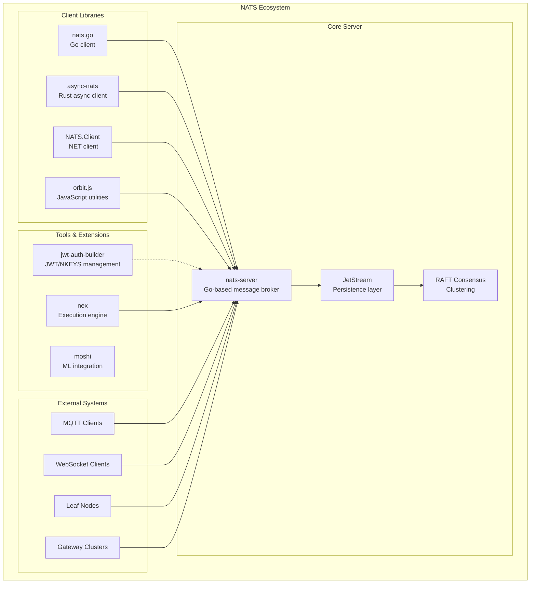
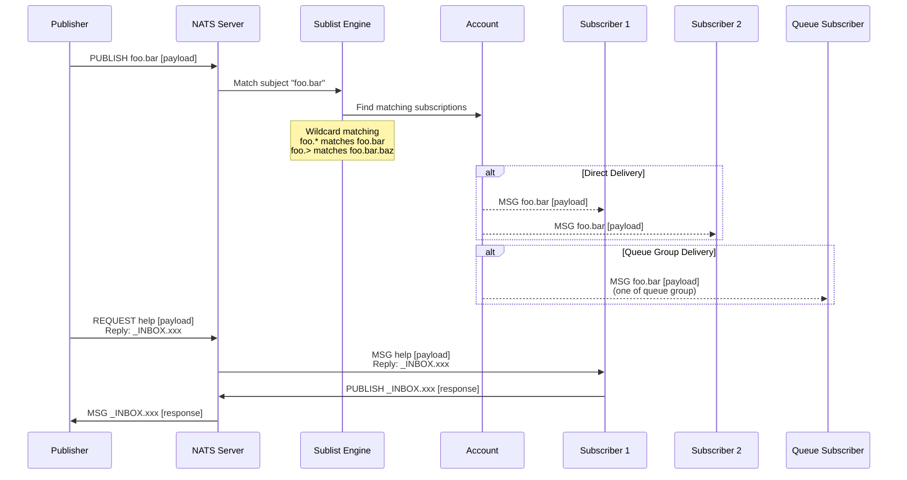
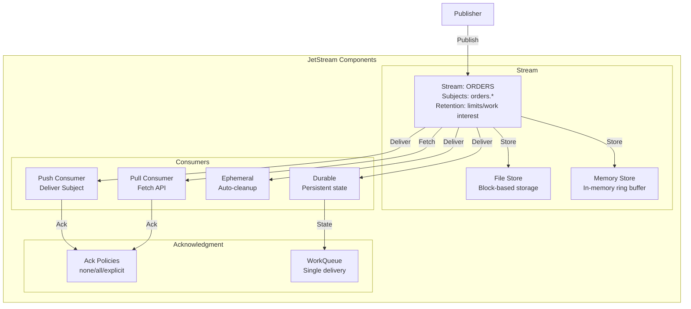
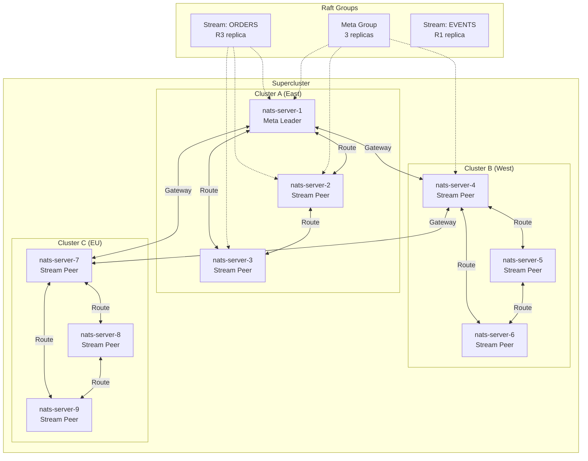
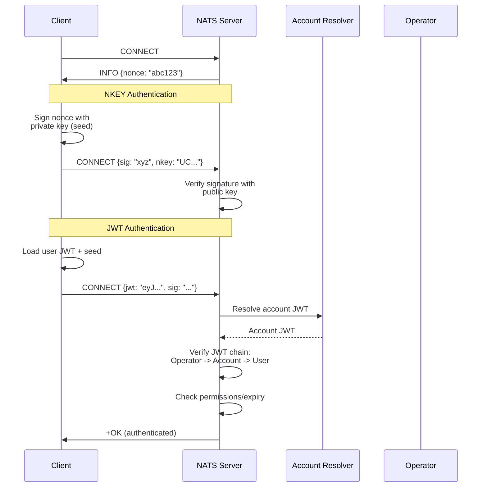
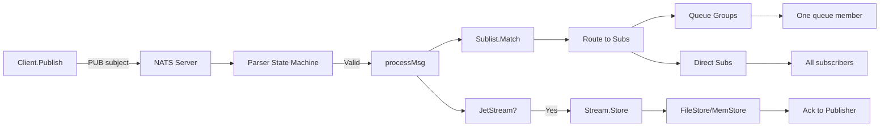
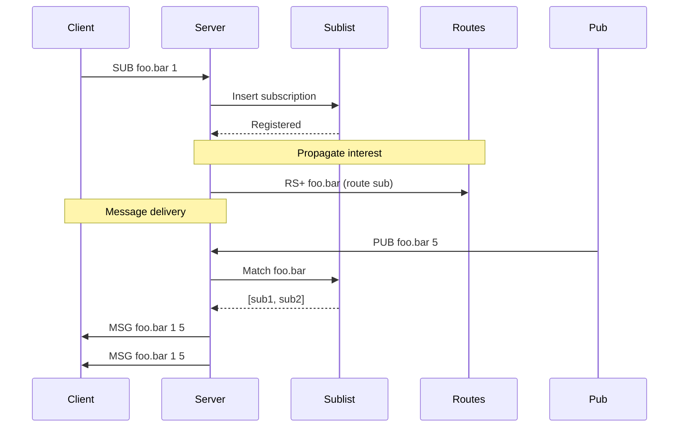

# Project Exploration: NATS Messaging System

## Overview

NATS is a simple, secure, and high-performance open-source messaging system designed for cloud-native applications, IoT messaging, and microservices architectures. It is part of the Cloud Native Computing Foundation (CNCF) and provides a fundamental layer for modern distributed systems communication.

The NATS ecosystem consists of two primary components:
1. **NATS Server (nats-server)**: The core message broker written in Go, providing publish/subscribe messaging, request/reply patterns, and JetStream for persistence
2. **NATS Clients**: Official client libraries in multiple languages (Go, Rust, .NET, JavaScript) that enable applications to connect to NATS servers

NATS is known for its simplicity, with a text-based protocol, sub-millisecond latency, and the ability to scale from embedded devices to global superclusters connecting millions of devices.

## Repository Information

| Project | Location | Remote | Primary Language |
|---------|----------|--------|------------------|
| nats-server | `/home/darkvoid/Boxxed/@formulas/Others/src.nats/nats-server` | github.com/nats-io/nats-server | Go |
| nats.go | `/home/darkvoid/Boxxed/@formulas/Others/src.nats/nats.go` | github.com/nats-io/nats.go | Go |
| nats.rs | `/home/darkvoid/Boxxed/@formulas/Others/src.nats/nats.rs` | github.com/nats-io/nats.rs | Rust |
| nats.net | `/home/darkvoid/Boxxed/@formulas/Others/src.nats/nats.net` | github.com/nats-io/nats.net | C# |
| orbit.js | `/home/darkvoid/Boxxed/@formulas/Others/src.nats/orbit.js` | github.com/synadia-io/orbit.js | JavaScript |
| jwt-auth-builder.go | `/home/darkvoid/Boxxed/@formulas/Others/src.nats/jwt-auth-builder.go` | github.com/synadia-io/jwt-auth-builder.go | Go |
| nex | `/home/darkvoid/Boxxed/@formulas/Others/src.nats/nex` | github.com/synadia-io/nex | Go |
| moshi | `/home/darkvoid/Boxxed/@formulas/Others/src.nats/moshi` | github.com/kyutai-labs/moshi | Python/Rust |
| reveal.js | `/home/darkvoid/Boxxed/@formulas/Others/src.nats/reveal.js` | github.com/hakimel/reveal.js | JavaScript |
| rethink_connectivity | `/home/darkvoid/Boxxed/@formulas/Others/src.nats/rethink_connectivity` | github.com/synadia-io/rethink_connectivity | Educational |
| html | `/home/darkvoid/Boxxed/@formulas/Others/src.nats/html` | github.com/smol-ai/html | HTML/TypeScript |

**Note**: These are filesystem clones, not git repositories (no .git directories present).

## Directory Structure

### 1. nats-server/ (Core Server - 322 files)

```
nats-server/
├── main.go                          # Server entry point with CLI flags
├── go.mod                           # Go module definition
├── LICENSE                          # Apache 2.0 License
├── README.md                        # Project overview
├── CONTRIBUTING.md                  # Contribution guidelines
├── DEPENDENCIES.md                  # External dependencies
├── TODO.md                          # Future work items
├── AMBASSADORS.md                   # Community ambassadors
├── MAINTAINERS.md                   # Maintainer information
├── GOVERNANCE.md                    # Project governance
├── locksordering.txt                # Lock ordering documentation
├── .goreleaser.yml                  # GoReleaser configuration
├── .golangci.yml                    # Linter configuration
├── .travis.yml                      # CI configuration
├── conf/                            # Configuration file parser
│   ├── parse.go                     # Configuration parser
│   ├── lex.go                       # Lexer for config parsing
│   ├── fuzz.go                      # Fuzz testing
│   ├── simple.conf                  # Example configuration
│   └── includes/                    # Include file examples
├── internal/                        # Internal packages
│   ├── fastrand/                    # Fast random number generator
│   ├── ldap/                        # LDAP integration
│   ├── ocsp/                        # OCSP certificate handling
│   └── testhelper/                  # Test utilities
├── logger/                          # Logging subsystem
│   ├── log.go                       # Main logging interface
│   ├── syslog.go                    # Syslog support
│   └── syslog_windows.go            # Windows syslog
├── server/                          # Core server implementation (300+ files)
│   ├── server.go                    # Main server struct and lifecycle
│   ├── client.go                    # Client connection handling
│   ├── accounts.go                  # Multi-tenant account system
│   ├── auth.go                      # Authentication (NKEYS, JWT, users)
│   ├── parser.go                    # NATS protocol parser
│   ├── sublist.go                   # Subject matching engine
│   ├── route.go                     # Cluster routing
│   ├── gateway.go                   # Supercluster gateways
│   ├── leafnode.go                  # Leaf node connections
│   ├── websocket.go                 # WebSocket support
│   ├── mqtt.go                      # MQTT protocol support
│   ├── jetstream.go                 # JetStream core
│   ├── jetstream_cluster.go         # JetStream clustering (Raft)
│   ├── stream.go                    # Stream management
│   ├── consumer.go                  # Consumer management
│   ├── filestore.go                 # File-based storage
│   ├── memstore.go                  # Memory-based storage
│   ├── raft.go                      # Raft consensus implementation
│   ├── events.go                    # System events
│   ├── monitor.go                   # Monitoring endpoints
│   ├── opts.go                      # Server options
│   ├── errors.go                    # Error definitions
│   ├── jwt.go                       # JWT authentication
│   ├── nkey.go                      # NKEY authentication
│   ├── avl/                         # AVL tree for sequences
│   ├── certidp/                     # Certificate IDP
│   ├── certstore/                   # Certificate store
│   ├── pse/                         # Process system info (cross-platform)
│   ├── stree/                       # Subject tree optimization
│   ├── sysmem/                      # System memory detection
│   └── tpm/                         # TPM integration
├── test/                            # Integration tests
│   ├── accounts_cycles_test.go
│   ├── auth_test.go
│   ├── cluster_test.go
│   ├── jetstream/                   # JetStream test configs
│   └── configs/                     # Test configurations
└── util/                            # Utilities
    └── nats-server.service          # Systemd service file
```

### 2. nats.go/ (Go Client - 121 files)

```
nats.go/
├── nats.go                          # Core client implementation
├── context.go                       # Context support
├── enc.go                           # Encoded connections
├── js.go                            # Legacy JetStream
├── jsm.go                           # JetStream management
├── kv.go                            # Key-Value store
├── object.go                        # Object store
├── parser.go                        # Message parser
├── ws.go                            # WebSocket support
├── jetstream/                       # New JetStream API
│   ├── jetstream.go                 # JetStream context
│   ├── api.go                       # API types
│   ├── stream.go                    # Stream operations
│   ├── stream_config.go             # Stream configuration
│   ├── consumer.go                  # Consumer operations
│   ├── consumer_config.go           # Consumer configuration
│   ├── publish.go                   # Publishing
│   ├── pull.go                      # Pull consumers
│   ├── ordered.go                   # Ordered consumers
│   ├── kv.go                        # Key-Value API
│   ├── object.go                    # Object store API
│   ├── message.go                   # Message handling
│   ├── errors.go                    # Error types
│   ├── jetstream_options.go         # Configuration options
│   └── test/                        # JetStream tests
├── micro/                           # Service API
│   ├── service.go                   # Service definition
│   ├── request.go                   # Request handling
│   └── test/                        # Service tests
├── encoders/                        # Message encoders
│   ├── builtin/                     # Default, JSON, GOB encoders
│   └── protobuf/                    # Protocol Buffers
├── examples/                        # Usage examples
│   ├── jetstream/                   # JetStream examples
│   ├── nats-bench/                  # Benchmarking tool
│   ├── nats-pub/                    # Publishing example
│   ├── nats-sub/                    # Subscription example
│   └── nats-req/                    # Request/Reply example
├── test/                            # Client tests
│   ├── auth_test.go
│   ├── basic_test.go
│   ├── jetstream_test.go
│   └── cluster_test.go
├── internal/
│   ├── parser/                      # Internal parser
│   └── syncx/                       # Sync primitives
└── util/                            # Utilities
    └── tls.go                       # TLS helpers
```

### 3. nats.rs/ (Rust Client - 91 files)

```
nats.rs/
├── Cargo.toml                       # Workspace definition
├── async-nats/                      # Async client (Tokio-based)
│   ├── Cargo.toml
│   ├── src/
│   │   ├── lib.rs                   # Library entry point
│   │   ├── client.rs                # Client implementation
│   │   ├── connection.rs            # TCP/TLS connection
│   │   ├── connector.rs             # Reconnection logic
│   │   ├── message.rs               # Message types
│   │   ├── header.rs                # NATS headers
│   │   ├── auth.rs                  # Authentication
│   │   ├── auth_utils.rs            # Auth utilities
│   │   ├── options.rs               # Client options
│   │   ├── tls.rs                   # TLS configuration
│   │   ├── error.rs                 # Error types
│   │   ├── status.rs                # Status codes
│   │   ├── subject.rs               # Subject handling
│   │   ├── crypto.rs                # Cryptography
│   │   ├── jetstream/               # JetStream API
│   │   │   ├── mod.rs
│   │   │   ├── context.rs           # JetStream context
│   │   │   ├── stream.rs            # Streams
│   │   │   ├── consumer/            # Consumers
│   │   │   │   ├── mod.rs
│   │   │   │   ├── pull.rs          # Pull consumers
│   │   │   │   └── push.rs          # Push consumers
│   │   │   ├── kv/                  # Key-Value store
│   │   │   ├── object_store/        # Object store
│   │   │   ├── publish.rs           # Publishing
│   │   │   ├── message.rs           # Messages
│   │   │   ├── account.rs           # Account info
│   │   │   ├── errors.rs            # JetStream errors
│   │   │   └── response.rs          # Response handling
│   │   └── service/                 # Service API
│   │       ├── mod.rs
│   │       ├── endpoint.rs
│   │       └── error.rs
│   ├── examples/
│   │   ├── pub.rs                   # Publishing
│   │   ├── sub.rs                   # Subscribing
│   │   ├── jetstream_pull.rs        # JetStream pull
│   │   ├── jetstream_push.rs        # JetStream push
│   │   ├── kv.rs                    # Key-Value
│   │   └── json.rs                  # JSON messages
│   ├── benches/                     # Benchmarks
│   │   ├── core_nats.rs
│   │   └── jetstream.rs
│   └── tests/                       # Integration tests
│       ├── client_tests.rs
│       ├── jetstream_tests.rs
│       ├── kv_tests.rs
│       └── nkey_tests.rs
├── nats/                            # Legacy sync client (deprecated)
│   ├── src/
│   │   ├── client.rs
│   │   ├── subscription.rs
│   │   ├── connector.rs
│   │   ├── jetstream/
│   │   └── kv.rs
│   └── examples/
└── nats-server/                     # Test server helper
    └── src/lib.rs                   # Embeddable nats-server
```

### 4. nats.net/ (.NET Client)

```
nats.net/src/
├── NATS.Client.Core/                # Core client library
├── NATS.Client.JetStream/           # JetStream support
├── NATS.Client.KeyValueStore/       # Key-Value store
├── NATS.Client.ObjectStore/         # Object store
├── NATS.Client.Services/            # Service API
├── NATS.Client.Simplified/          # Simplified API
├── NATS.Extensions.Microsoft.DependencyInjection/  # DI integration
└── NATS.Net/                        # Main package
```

### 5. Supporting Projects

```
jwt-auth-builder.go/                 # JWT/NKEYS builder utility
├── operator.go                      # Operator management
├── accounts.go                      # Account management
├── user.go                          # User management
├── scope.go                         # Permission scopes
├── memresolver.go                   # Memory resolver
└── types.go                         # Type definitions

nex/                                 # NATS Execution Engine
├── nex/                             # CLI tool
├── agent/                           # Firecracker VM agent
├── internal/node/                   # Node management
├── control-api/                     # Control API
├── host-services/                   # Host services
└── examples/                        # Examples

orbit.js/                            # JavaScript utilities
├── nhgc/                            # NATS HTTP Gateway Client
└── messagepipeline/                 # Message pipeline utilities

moshi/                               # NATS-based ML tool (Kyutai Labs)
├── client/                          # Client implementation
├── moshi/                           # Core MOSHI logic
├── rust/                            # Rust components
└── scripts/                         # Build scripts

rethink_connectivity/                # Educational screencast series
├── 01-getting-started-with-nats/
├── 02-getting-started-with-jetstream/
├── 04-clusters/
├── 05-superclusters/
├── 06-decentralized-auth/
└── ... (20 episodes total)

html/                                # HTML templates/resources
reveal.js/                           # Presentation framework
```

## Architecture

### High-Level Architecture Diagram



### NATS Publish/Subscribe Architecture



### JetStream Streaming Architecture



### JetStream Cluster Topology (Raft)



### Authentication Flow (JWT/NKEYS)



## Component Breakdown

### nats-server Components

#### Core Server (`server/server.go`)
- **Location**: `nats-server/server/server.go`
- **Purpose**: Main server lifecycle, client connection management, and coordination
- **Key Structures**:
  - `Server`: Main server struct with atomic operations for stats
  - `Info`: Server information exchanged with clients
  - `Options`: Configuration options
- **Dependencies**: logger, conf parser, nkeys, jwt
- **Dependents**: All other server components

#### Client Handler (`server/client.go`)
- **Location**: `nats-server/server/client.go`
- **Purpose**: Individual client connection state and message processing
- **Key Functions**:
  - `parse()`: Protocol message parsing
  - `processMsg()`: Message routing to subscribers
  - `processPub()`: Handle PUBLISH commands
  - `processSub()`: Handle SUBSCRIBE commands
  - `flushOutbound()`: Write buffered data to connection
- **Protocol States**: OP_START, OP_P, OP_SUB, OP_UNSUB, MSG_PAYLOAD, etc.

#### Parser (`server/parser.go`)
- **Location**: `nats-server/server/parser.go`
- **Purpose**: NATS wire protocol parser (state machine)
- **Supported Commands**:
  - `PUB <subject> <size>` - Publish message
  - `HPUB <subject> <hdr_size> <total_size>` - Publish with headers
  - `SUB <subject> [queue] <sid>` - Subscribe
  - `UNSUB <sid> [max_msgs]` - Unsubscribe
  - `PING/PONG` - Keepalive
  - `CONNECT` - Client connection info
  - `MSG <subject> <sid> <size>` - Server delivery

#### Sublist Engine (`server/sublist.go`)
- **Location**: `nats-server/server/sublist.go`
- **Purpose**: Efficient subject matching for message routing
- **Algorithm**: Tree-based subject matching with caching
- **Wildcards**:
  - `*` - Matches single token
  - `>` - Matches remaining tokens (suffix only)
- **Performance**: O(log n) matching with frontend cache

#### Accounts (`server/accounts.go`)
- **Location**: `nats-server/server/accounts.go`
- **Purpose**: Multi-tenant isolation
- **Features**:
  - Import/Export permissions between accounts
  - Service imports with latency tracking
  - User mapping to accounts
  - System account for internal messaging

#### Authentication (`server/auth.go`)
- **Location**: `nats-server/server/auth.go`
- **Purpose**: Client authentication and authorization
- **Methods**:
  - Username/Password
  - Token-based
  - NKEYS (public-key)
  - JWT (Operator/Account/User chain)
- **Permissions**: Subject-based publish/subscribe allow/deny

#### JetStream Core (`server/jetstream.go`)
- **Location**: `nats-server/server/jetstream.go`
- **Purpose**: Persistence layer for NATS
- **Key Concepts**:
  - `jetStream`: Top-level JS state
  - `jsAccount`: Per-account JS state
  - Storage limits, account quotas
- **Features**: Memory/Store limits, API stats

#### Streams (`server/stream.go`)
- **Location**: `nats-server/server/stream.go`
- **Purpose**: Message storage and retention
- **Config**: `StreamConfig` with retention, storage, subjects
- **Retention Policies**:
  - `limits`: Delete on max msgs/bytes/age
  - `interest`: Delete when no interest
  - `workqueue`: Delete after ack (single delivery)
- **Storage Types**: FileStore, MemStore

#### Consumers (`server/consumer.go`)
- **Location**: `nats-server/server/consumer.go`
- **Purpose**: Message delivery to clients
- **Config**: `ConsumerConfig` with delivery, ack, filtering
- **Delivery Policies**:
  - `all`: From beginning
  - `last`: Latest message
  - `new`: Only new messages
  - `by_start_time`: From timestamp
  - `last_per_subject`: Latest per subject
- **Ack Policies**: none, all, explicit, workqueue

#### JetStream Cluster (`server/jetstream_cluster.go`)
- **Location**: `nats-server/server/jetstream_cluster.go`
- **Purpose**: Distributed JetStream using Raft
- **Components**:
  - `jetStreamCluster`: Meta controller
  - `streamAssignment`: Stream placement
  - `consumerAssignment`: Consumer placement
  - `raftGroup`: Raft node group
- **Operations**: assignStreamOp, streamMsgOp, updateDeliveredOp

#### Raft (`server/raft.go`)
- **Location**: `nats-server/server/raft.go`
- **Purpose**: Consensus for clustering
- **Features**: Leader election, log replication, snapshots
- **Used By**: JetStream clustered mode

#### Routes (`server/route.go`)
- **Location**: `nats-server/server/route.go`
- **Purpose**: Server clustering (same cluster)
- **Protocol**: Route protocol for subscription sharing
- **Features**: Implicit/explicit routes, pooling

#### Gateway (`server/gateway.go`)
- **Location**: `nats-server/server/gateway.go`
- **Purpose**: Supercluster connections (cross-cluster)
- **Features**: Interest-only mode, gateway URLs

#### LeafNode (`server/leafnode.go`)
- **Location**: `nats-server/server/leafnode.go`
- **Purpose**: Edge device connections
- **Features**: Hub-spoke topology, account mapping

### nats.go Components

#### Core Client (`nats.go/nats.go`)
- **Location**: `nats.go/nats.go`
- **Purpose**: Main NATS client implementation
- **Key Types**:
  - `Conn`: Connection state
  - `Subscription`: Subscription state
  - `Msg`: Message container
  - `Options`: Connection options
- **Constants**: Version 1.37.0, DefaultURL nats://127.0.0.1:4222

#### JetStream API (`nats.go/jetstream/jetstream.go`)
- **Location**: `nats.go/jetstream/jetstream.go`
- **Purpose**: Modern JetStream interface
- **Interfaces**:
  - `JetStream`: Top-level context
  - `Publisher`: Sync/async publishing
  - `StreamManager`: Stream CRUD
  - `StreamConsumerManager`: Consumer CRUD
  - `KeyValueManager`: KV store management
  - `ObjectStoreManager`: Object store management

### nats.rs Components

#### Async Client (`async-nats/src/lib.rs`)
- **Location**: `nats.rs/async-nats/src/lib.rs`
- **Purpose**: Tokio-based async NATS client
- **Features**: Core NATS, JetStream, KV, Object Store, Service API
- **Version**: 0.36.0

#### Connection (`async-nats/src/connection.rs`)
- **Location**: `nats.rs/async-nats/src/connection.rs`
- **Purpose**: TCP/TLS connection management

#### Client (`async-nats/src/client.rs`)
- **Location**: `nats.rs/async-nats/src/client.rs`
- **Purpose**: Main client API

## Entry Points

### nats-server Entry Point

**File**: `nats-server/main.go`

```go
func main() {
    // 1. Parse command-line flags
    opts, err := server.ConfigureOptions(fs, os.Args[1:], ...)

    // 2. Create server with options
    s, err := server.NewServer(opts)

    // 3. Configure logger
    s.ConfigureLogger()

    // 4. Start server (blocks until shutdown)
    server.Run(s)

    // 5. Adjust MAXPROCS for cgroups
    maxprocs.Set(...)

    // 6. Wait for shutdown signal
    s.WaitForShutdown()
}
```

**CLI Options**:
- `-p, --port`: Server port (default: 4222)
- `-js, --jetstream`: Enable JetStream
- `-sd, --store_dir`: JetStream storage directory
- `-c, --config`: Configuration file
- `- routes`: Cluster routes
- `-cluster`: Cluster URL
- `--user/--pass/--auth`: Authentication
- `--tls*`: TLS configuration

### nats.go Entry Point

**File**: `nats.go/nats.go`

```go
// Connect to NATS server
nc, err := nats.Connect(nats.DefaultURL,
    nats.UserInfo("user", "pass"),
    nats.MaxReconnects(60),
    nats.ReconnectWait(2*time.Second))

// Create JetStream context
js, err := jetstream.New(nc)

// Publish messages
js.Publish(ctx, "subject", []byte("data"))

// Subscribe
sub, err := nc.Subscribe("foo", handler)

// Request/Reply
msg, err := nc.Request("help", data, 10*time.Millisecond)
```

### async-nats Entry Point

**File**: `nats.rs/async-nats/src/lib.rs`

```rust
// Connect to NATS
let client = async_nats::connect("demo.nats.io").await?;

// Create JetStream context
let jetstream = async_nats::jetstream::new(client);

// Publish
client.publish("foo", "bar".into()).await?;

// Subscribe
let mut sub = client.subscribe("foo").await?;
while let Some(msg) = sub.next().await {
    println!("Received: {:?}", msg);
}
```

## Data Flow

### Message Publishing Flow



### Message Subscription Flow



## External Dependencies

### nats-server Dependencies

| Dependency | Version | Purpose |
|------------|---------|---------|
| github.com/klauspost/compress | v1.17.9 | S2 compression for messages |
| github.com/minio/highwayhash | v1.0.3 | Fast hashing for message IDs |
| github.com/nats-io/jwt/v2 | v2.6.0 | JWT token handling |
| github.com/nats-io/nkeys | v0.4.7 | NKEY cryptography |
| github.com/nats-io/nuid | v1.0.1 | Unique ID generation |
| github.com/nats-io/nats.go | v1.36.0 | Go client (testing) |
| go.uber.org/automaxprocs | v1.5.3 | GOMAXPROCS auto-tuning |
| golang.org/x/crypto | v0.27.0 | Cryptographic primitives |
| golang.org/x/sys | v0.25.0 | System calls |
| golang.org/x/time | v0.6.0 | Rate limiting |
| github.com/google/go-tpm | v0.9.0 | TPM integration |

### nats.go Dependencies

| Dependency | Version | Purpose |
|------------|---------|---------|
| github.com/klauspost/compress | v1.17.2 | Message compression |
| github.com/nats-io/nkeys | v0.4.7 | NKEY authentication |
| github.com/nats-io/nuid | v1.0.1 | Unique IDs |
| golang.org/x/text | v0.14.0 | Text encoding |

### async-nats Dependencies

| Dependency | Version | Purpose |
|------------|---------|---------|
| tokio | 1.36 | Async runtime |
| futures | 0.3.28 | Future combinators |
| serde | 1.0.184 | Serialization |
| nkeys | 0.4 | NKEY authentication |
| nuid | 0.5 | Unique IDs |
| tokio-rustls | 0.26 | TLS support |
| bytes | 1.4.0 | Byte buffers |
| time | 0.3.36 | Time handling |
| tracing | 0.1 | Tracing/logging |

## Configuration

### Server Configuration

```conf
# nats-server.conf
listen: 0.0.0.0:4222
server_name: nats-server-1

# Authorization
authorization {
  user: "user"
  password: "pass"
  timeout: 0.5
}

# JetStream
jetstream {
  store_dir: /data/nats
  max_memory: 1GB
  max_storage: 10GB
}

# Clustering
cluster {
  listen: 0.0.0.0:6222
  routes: [
    nats://nats-server-2:6222
    nats://nats-server-3:6222
  ]
}

# Gateways (Supercluster)
gateway {
  name: "EAST"
  listen: 0.0.0.0:7222
  gateways: [
    {
      name: "WEST"
      url: "nats://gateway-west:7222"
    }
  ]
}

# LeafNodes
leafnodes {
  listen: 0.0.0.0:7422
}

# TLS
tls {
  cert_file: "server.crt"
  key_file: "server.key"
  ca_file: "ca.crt"
  verify: true
}

# Accounts
accounts {
  SYS {
    users: [{user: sys, password: secret}]
    jetstream: enabled
  }
  APP {
    users: [{user: app, password: secret}]
    imports: [{service: {account: SYS, subject: "$SYS.REQ"}}]
  }
}

# Logging
debug: true
trace: true
log_file: /var/log/nats.log
logtime: true
```

### Client Options (nats.go)

```go
nats.Connect(url,
    // Reconnection
    nats.MaxReconnects(60),
    nats.ReconnectWait(2*time.Second),
    nats.ReconnectJitter(100*time.Millisecond, 1*time.Second),
    nats.DontRandomize(),

    // Authentication
    nats.UserInfo("user", "pass"),
    nats.Token("token"),
    nats.UserCredentials("user.creds"),
    nats.NkeyOptionFromSeed("seed.txt"),

    // TLS
    nats.Secure(&tls.Config{}),
    nats.RootCAs("ca.pem"),
    nats.ClientCert("cert.pem", "key.pem"),

    // Timeouts
    nats.Timeout(2*time.Second),
    nats.PingInterval(2*time.Minute),
    nats.MaxPingsOut(2),

    // Callbacks
    nats.DisconnectErrHandler(func(nc *nats.Conn, err error) {}),
    nats.ReconnectHandler(func(nc *nats.Conn) {}),
    nats.ClosedHandler(func(nc *nats.Conn) {}),

    // Buffer sizes
    nats.ReconnectBufSize(8*1024*1024),

    // JetStream
    nats.Domain("jetstream-domain"),
)
```

### JetStream Stream Configuration

```go
jetstream.StreamConfig{
    Name:        "ORDERS",
    Subjects:    []string{"orders.*"},
    Retention:   jetstream.LimitsPolicy,
    MaxConsumers: 100,
    MaxMsgs:     1000000,
    MaxBytes:    1 * 1024 * 1024 * 1024,
    MaxAge:      72 * time.Hour,
    MaxMsgSize:  1024 * 1024,
    Discard:     jetstream.DiscardOld,
    Storage:     jetstream.FileStorage,
    Replicas:    3,
    Duplicates:  2 * time.Minute,
}
```

### JetStream Consumer Configuration

```go
jetstream.ConsumerConfig{
    Durable:         "my-consumer",
    DeliverPolicy:   jetstream.DeliverAllPolicy,
    AckPolicy:       jetstream.AckExplicitPolicy,
    AckWait:         30 * time.Second,
    MaxDeliver:      5,
    FilterSubject:   "orders.new",
    ReplayPolicy:    jetstream.ReplayInstantPolicy,
    MaxAckPending:   1000,
    Heartbeat:       5 * time.Second,
    FlowControl:     true,
}
```

## Testing

### nats-server Testing

**Location**: `nats-server/test/`, `nats-server/server/*_test.go`

- **Test Framework**: Go testing package with helpers
- **Test Categories**:
  - Unit tests: `*_test.go` in each package
  - Integration tests: `test/` directory
  - Cluster tests: `test/cluster_test.go`
  - JetStream tests: `server/jetstream*_test.go`
  - Benchmark tests: `server/*_benchmark_test.go`

**Running Tests**:
```bash
# Run all tests
go test ./...

# Run with race detector
go test -race ./...

# Run JetStream tests
go test -v ./server -run JetStream

# Run benchmarks
go test -bench=. ./server
```

### nats.go Testing

**Location**: `nats.go/test/`, `nats.go/jetstream/test/`

```bash
# Run tests
go test -v ./...

# Run JetStream tests
go test -v ./jetstream/test

# Coverage
./scripts/cov.sh
```

### nats.rs Testing

**Location**: `nats.rs/async-nats/tests/`

```bash
# Run tests
cargo test

# Run with features
cargo test --features "experimental"

# Run benchmarks
cargo bench
```

## Key Insights

### Architectural Decisions

1. **Text-based Protocol**: NATS uses a simple text protocol (with optional binary headers) for easy debugging and interoperability

2. **Subject-based Routing**: The sublist engine provides O(log n) subject matching with frontend caching for hot paths

3. **Multi-tenant by Design**: Accounts provide isolation boundaries with explicit import/export permissions

4. **Decentralized Authentication**: JWT/NKEYS enables decentralized identity management with Operator/Account/User chains

5. **Raft for Consensus**: JetStream clustering uses a custom Raft implementation embedded in the server

6. **Store Abstraction**: FileStore and MemStore share a common interface, allowing configuration-based storage selection

7. **Interest Propagation**: Routes propagate subscription interest to minimize unnecessary message traffic

### Performance Characteristics

1. **Sub-millisecond Latency**: Typical message delivery is under 1ms
2. **Millions of Messages/Second**: Single server can handle 1M+ messages/second
3. **Efficient Memory**: Uses atomics and lock-free patterns where possible
4. **Horizontal Scale**: Clusters scale to thousands of servers
5. **Compression Support**: S2 compression for message payloads and RAFT replication

### Security Features

1. **NKEYS**: Public-key authentication without password transmission
2. **JWT Chains**: Operator -> Account -> User trust chain
3. **Scoped Permissions**: Subject-based allow/deny per user
4. **TLS Everywhere**: Encryption for clients, routes, gateways, leafnodes
5. **OCSP Support**: Certificate revocation checking

### JetStream Design

1. **Stream-centric**: All persistence flows through streams
2. **Consumer Independence**: Consumers can have independent delivery policies
3. **WorkQueue Semantics**: Single delivery with acknowledgment
4. **KV Abstraction**: Key-Value store built on streams with subject transforms
5. **Object Store**: Large file storage with chunking and metadata

## Open Questions

1. **moshi Integration**: How does moshi specifically use NATS for ML workloads? The relationship is not clear from the codebase structure.

2. **reveal.js Connection**: The reveal.js project appears to be the standard presentation framework - its specific NATS integration is not evident.

3. **html Project**: Purpose of the html directory is unclear - appears to be a minimal web project with Vite/React.

4. **nex Production Readiness**: nex uses Firecracker VMs for workload isolation - what is the production adoption status?

5. **Gateway vs LeafNode**: When should one use gateways vs leafnodes for cross-datacenter communication? Both serve different topologies but the decision criteria could be clearer.

6. **Compression Trade-offs**: What are the specific CPU/memory trade-offs for S2 compression levels in high-throughput scenarios?

7. **RAFT Tuning**: What are the recommended RAFT configuration parameters for different cluster sizes?

8. **Supercluster Limits**: What are the tested limits for supercluster deployments (number of clusters, total servers)?

9. **JetStream Scaling**: What is the maximum recommended number of streams/consumers per server?

10. **Client Backpressure**: How do clients handle slow consumer scenarios, and what are the best practices for flow control?

## Testing Strategies Observed

1. **Helper Test Servers**: Both nats.go and nats.rs include embeddable test server helpers (`nats-server` crate in Rust)

2. **Config-based Tests**: Extensive use of configuration files for testing different scenarios (TLS, clustering, auth)

3. **Integration Test Suites**: Separate integration test directories with full server setups

4. **Benchmark Suites**: Performance benchmarks in all clients and server

5. **Race Detection**: Go tests run with `-race` flag for concurrency issues

6. **Compatibility Tests**: nats.rs includes compatibility tests ensuring API compatibility across client libraries

## Files of Interest

| File | Purpose |
|------|---------|
| `nats-server/server/parser.go` | Protocol parser state machine |
| `nats-server/server/sublist.go` | Subject matching engine |
| `nats-server/server/jetstream_cluster.go` | Distributed JetStream (Raft) |
| `nats-server/server/stream.go` | Stream configuration and storage |
| `nats-server/server/consumer.go` | Consumer delivery logic |
| `nats.go/jetstream/jetstream.go` | Go JetStream API |
| `nats.rs/async-nats/src/jetstream/` | Rust JetStream implementation |
