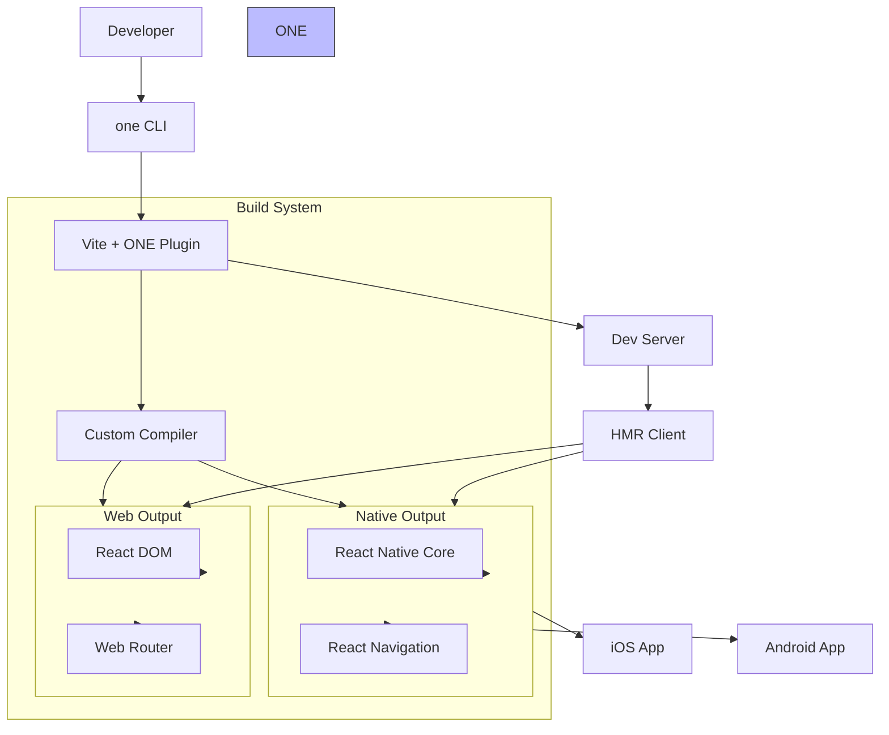

# Project Exploration: ONE (VXRN)

## Overview

ONE is a universal React framework that enables developers to write once and run everywhere - iOS, Android, and Web. Built on top of Tamagui, Vite, and React Navigation, ONE provides a truly unified development experience with native performance.

**Key Characteristics:**
- **Universal React** - Single codebase for iOS, Android, and Web
- **Native Performance** - Pre-compiles React Native for faster startup
- **Vite-based** - Fast HMR and bundling
- **Expo/RN Compatible** - Works with existing React Native ecosystem
- **Type-Safe** - Full TypeScript support with inferred types

## Repository Structure

```
one/
├── packages/
│   ├── one/                    # Main ONE framework package
│   │   ├── src/
│   │   │   ├── index.ts        # Main exports
│   │   │   ├── vite.ts         # Vite integration
│   │   │   ├── serve.ts        # Dev server
│   │   │   ├── router/         # Universal router
│   │   │   │   ├── useNavigation.ts
│   │   │   │   ├── Link.tsx
│   │   │   │   └── params.ts
│   │   │   ├── app/            # App configuration
│   │   │   ├── exports/        # Re-exported modules
│   │   │   └── native/         # Native-specific code
│   │   ├── run.mjs             # CLI entry point
│   │   ├── vendor/             # Vendored dependencies (React, etc.)
│   │   └── package.json
│   │
│   ├── vxrn/                   # Core bundler (Vite + React Native)
│   │   ├── src/
│   │   │   ├── index.ts
│   │   │   ├── vite/           # Vite plugin
│   │   │   ├── native/         # Native compilation
│   │   │   ├── server/         # Dev server
│   │   │   └── utils/
│   │   └── package.json
│   │
│   ├── create-vxrn/            # Project scaffolding CLI
│   ├── compiler/               # Custom compiler transforms
│   ├── mdx/                    # MDX support
│   ├── color-scheme/           # Universal color scheme (light/dark)
│   ├── universal-color-scheme/ # Cross-platform color scheme
│   ├── react-native-prebuilt/  # Pre-compiled RN modules
│   ├── safe-area/              # Safe area context wrapper
│   ├── vite-flow/              # Vite development flow
│   ├── vite-native-client/     # Native HMR client
│   ├── vite-native-hmr/        # Native hot module replacement
│   ├── url-parse/              # URL parsing utilities
│   ├── query-string/           # Query string handling
│   ├── use-isomorphic-layout-effect/ # Universal layout effect
│   ├── emitter/                # Event emitter
│   ├── utils/                  # Shared utilities
│   ├── resolve/                # Module resolution
│   ├── debug/                  # Debug utilities
│   ├── better-auth/            # Authentication integration
│   │
│   └── test/                   # Test utilities
│
├── apps/
│   ├── site/                   # Documentation website
│   └── demo/                   # Demo application
│
├── examples/
│   ├── basic/                  # Basic starter
│   ├── tabs/                   # Tabs navigation
│   ├── drawer/                 # Drawer navigation
│   └── ...                     # More examples
│
└── docs/                       # Documentation
```

## Architecture

### High-Level Diagram



### Core Stack

| Layer | Technology |
|-------|------------|
| Framework | ONE |
| UI Components | Tamagui |
| Bundler | Vite + Custom plugins |
| Navigation | React Navigation 7 |
| Styling | Tamagui CSS-in-JS |
| State | React Context, Zustand |
| Data | TanStack Query, Zero |
| Router | ONE Router (file-based) |

## ONE Framework

### Main Package API

```typescript
// one package exports
export {
  // App
  App,
  Stack,
  Slot,

  // Routing
  Link,
  useNavigation,
  useLocalSearchParams,
  useRouter,
  redirect,

  // Hooks
  useFocusEffect,
  useLayoutEffect,

  // Components
  Image,
  View,
  Text,
  ScrollView,

  // Server
  createRequestHandler,
} from 'one';
```

### File-Based Routing

ONE uses file-system routing similar to Next.js:

```
app/
├── _layout.tsx           # Root layout
├── index.tsx             # Home route (/)
├── about.tsx             # About route (/about)
├── posts/
│   ├── index.tsx         # Posts list (/posts)
│   └── [id].tsx          # Dynamic route (/posts/:id)
└── _error.tsx            # Error boundary
```

```typescript
// app/posts/[id].tsx
import { useLocalSearchParams } from 'one';

export default function PostScreen() {
  const { id } = useLocalSearchParams();
  return <Text>Post {id}</Text>;
}
```

### Layouts

```typescript
// app/_layout.tsx
import { Stack } from 'one';

export default function RootLayout() {
  return (
    <Stack>
      <Stack.Screen name="index" options={{ title: 'Home' }} />
      <Stack.Screen name="about" options={{ title: 'About' }} />
    </Stack>
  );
}
```

### Navigation

```typescript
import { Link, useNavigation } from 'one';

function MyComponent() {
  const navigation = useNavigation();

  return (
    <View>
      {/* Declarative navigation */}
      <Link href="/posts/123">View Post</Link>

      {/* Programmatic navigation */}
      <Button onPress={() => navigation.navigate('about')} />

      {/* With params */}
      <Link href={{ pathname: '/post', params: { id: 1 } }}>
        View Post
      </Link>

      {/* Replace stack */}
      <Button onPress={() => navigation.replace('home')} />

      {/* Pop */}
      <Button onPress={() => navigation.goBack()} />
    </View>
  );
}
```

## VXRN (Vite + React Native)

### What is VXRN?

VXRN is the core bundler that makes ONE work. It's a Vite plugin system that:

1. Pre-compiles React Native for faster startup
2. Handles native module resolution
3. Provides HMR for React Native
4. Bundles for web and native simultaneously

### Vite Configuration

```typescript
// vite.config.ts
import { defineConfig } from 'vite';
import { one } from 'one/vite';

export default defineConfig({
  plugins: [
    one({
      // ONE options
      web: {
        port: 3000,
      },
      native: {
        // Native dev options
      },
    }),
  ],
});
```

### Pre-compilation

VXRN pre-compiles React Native modules:

```typescript
// Before: Slow startup
import { View, Text } from 'react-native';

// After: Pre-compiled for fast startup
import { View, Text } from 'react-native'; // Already bundled
```

## Tamagui Integration

### What is Tamagui?

Tamagui is a universal UI kit and styling system that powers ONE.

### Basic Usage

```typescript
import { styled, XStack, Text } from 'tamagui';

const Button = styled(XStack, {
  backgroundColor: '$blue10',
  borderRadius: '$4',
  padding: '$3',

  variants: {
    size: {
      small: { padding: '$2' },
      large: { padding: '$4' },
    },
  } as const,
});

function App() {
  return (
    <Button size="large">
      <Text color="white">Click me</Text>
    </Button>
  );
}
```

### Design Tokens

```typescript
// tamagui.config.ts
import { createTamagui } from 'tamagui';

export const config = createTamagui({
  tokens: {
    color: {
      blue1: '#eff6ff',
      blue10: '#1e40af',
      // ...
    },
    space: {
      '1': 4,
      '2': 8,
      '3': 12,
      '4': 16,
    },
    radius: {
      '1': 4,
      '2': 8,
      '4': 16,
    },
  },
});
```

## Commands

```bash
# Create new project
npx create-vxrn my-app
cd my-app

# Run development
yarn dev
yarn dev:web     # Web only
yarn dev:ios     # iOS only
yarn dev:android # Android only

# Build
yarn build
yarn build:web
yarn build:ios
yarn build:android

# Production serve
yarn serve
```

## Project Structure

```
my-app/
├── app/                    # App source
│   ├── _layout.tsx         # Root layout
│   ├── index.tsx           # Home screen
│   └── ...
├── tamagui.config.ts       # Tamagui configuration
├── vite.config.ts          # Vite configuration
├── tsconfig.json           # TypeScript config
├── package.json
└── ...
```

## Key Features

### 1. Universal Components

```typescript
// Works on web and native
import { View, Text, Button } from 'one';

function MyComponent() {
  return (
    <View>
      <Text>Hello</Text>
      <Button title="Click" onPress={() => {}} />
    </View>
  );
}
```

### 2. Zero Data Loading

ONE integrates with Zero for real-time data:

```typescript
import { useQuery } from 'one/zero';

function Posts() {
  const { posts } = useQuery((q) => q.posts.all());

  return (
    <ScrollView>
      {posts.map((post) => (
        <Text key={post.id}>{post.title}</Text>
      ))}
    </ScrollView>
  );
}
```

### 3. Image Optimization

```typescript
import { Image } from 'one';

<Image
  source={{ uri: 'https://...' }}
  width={300}
  height={200}
  resizeMode="cover"
  priority="high"
/>
```

### 4. Safe Area

```typescript
import { SafeAreaProvider, SafeAreaView } from 'one/safe-area';

function App() {
  return (
    <SafeAreaProvider>
      <SafeAreaView>
        {/* Content respects notches, etc. */}
      </SafeAreaView>
    </SafeAreaProvider>
  );
}
```

### 5. Color Scheme

```typescript
import { useColorScheme } from 'one/color-scheme';

function ThemedComponent() {
  const { colorScheme } = useColorScheme(); // 'light' | 'dark'

  return (
    <View backgroundColor={colorScheme === 'dark' ? '$black' : '$white'}>
      <Text>Auto theme support</Text>
    </View>
  );
}
```

## Dependencies

### Core Dependencies

| Package | Purpose |
|---------|---------|
| `react` | UI library |
| `react-native` | Native runtime |
| `react-navigation` | Navigation |
| `tamagui` | UI components & styling |
| `vite` | Bundler |
| `vxrn` | RN + Vite integration |

### Navigation Dependencies

| Package | Purpose |
|---------|---------|
| `@react-navigation/native` | Core navigation |
| `@react-navigation/native-stack` | Stack navigator |
| `@react-navigation/bottom-tabs` | Tab navigator |
| `@react-navigation/drawer` | Drawer navigator |
| `react-native-screens` | Native screens |
| `react-native-safe-area-context` | Safe area |
| `react-native-gesture-handler` | Gestures |
| `react-native-reanimated` | Animations |

## Development Workflow

### Hot Module Replacement

ONE provides fast HMR for both web and native:

```
Web: Vite HMR (~50ms)
Native: Custom HMR via WebSocket
```

### Debugging

```bash
# Open React DevTools
yarn one devtools

# View logs
yarn one logs:ios
yarn one logs:android
```

## Performance

### Optimizations

1. **Pre-compiled React Native** - Faster startup
2. **Tree-shaking** - Remove unused code
3. **Lazy loading** - Load screens on demand
4. **Native modules** - Optimized native code
5. **Memoization** - React.memo, useMemo, useCallback

### Bundle Sizes

```
Web: ~50KB gzipped (base)
iOS: ~200KB (delta over RN)
Android: ~200KB (delta over RN)
```

## Key Insights

1. **True Universal Code** - Same components work everywhere without modification.

2. **Vite Speed** - Lightning-fast HMR and builds.

3. **Expo Compatible** - Can use Expo modules and EAS.

4. **TypeScript First** - Full type inference for routes, params, navigation.

5. **Tamagui Powered** - Universal styling system with design tokens.

6. **React Navigation 7** - Latest navigation with full TypeScript support.

7. **Pre-compilation** - React Native modules are pre-bundled for speed.

8. **File-Based Routing** - Familiar Next.js-style routing.

## Open Considerations

1. **Production Maturity** - How battle-tested is ONE in production?

2. **Third-Party Libraries** - Which RN libraries work out of the box?

3. **Code Sharing** - How much code can actually be shared?

4. **Web SEO** - How does SSR/hydration work for web?

5. **Native Module Support** - Which native modules require extra config?

6. **App Store Submission** - Any special considerations?

7. **Learning Curve** - How steep is the learning curve for RN developers?

8. **Community Size** - How large is the ONE community?
