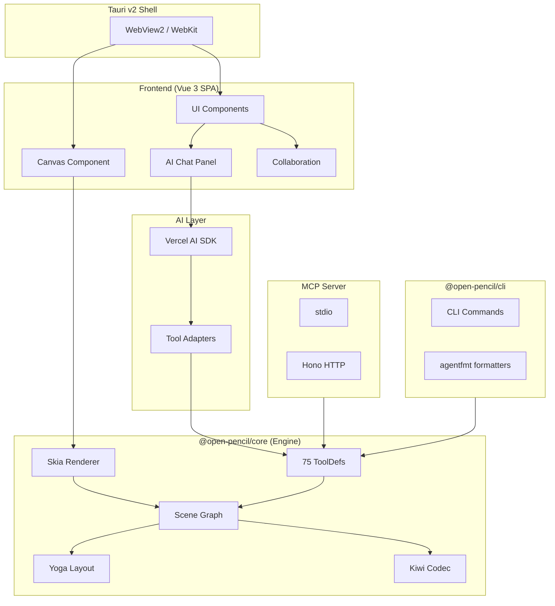
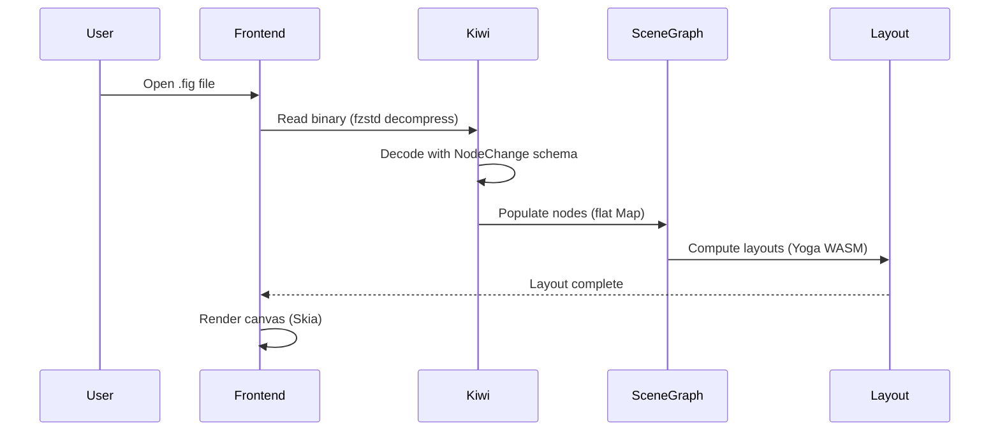
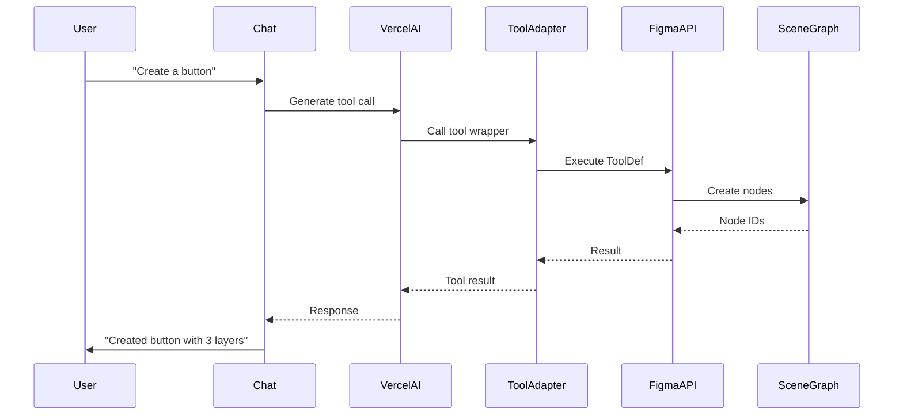
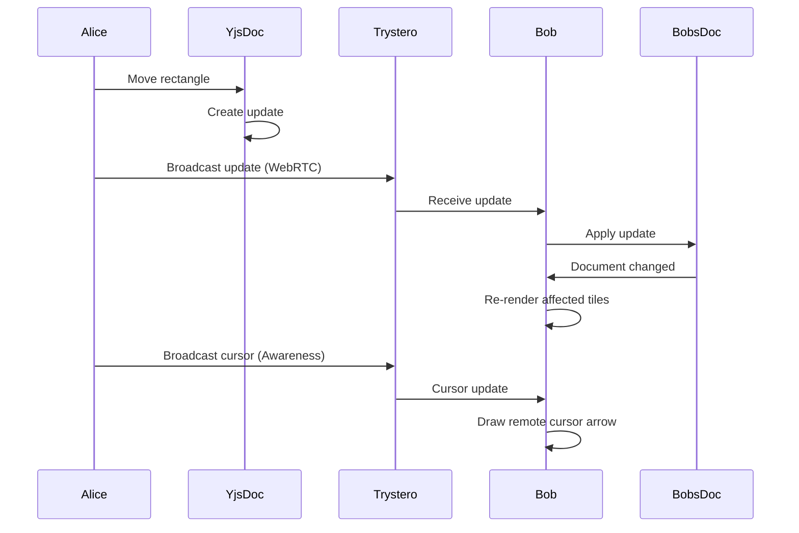

# Project Exploration: OpenPencil

## Overview

OpenPencil is an open-source, AI-native design editor that serves as a Figma-compatible alternative. It enables designers to work with native .fig files while providing programmatic access through AI tools, MCP server, and headless CLI.

**Key differentiators:**
- **Open Source**: MIT licensed, fully transparent
- **Figma-compatible**: Native .fig file import/export using Kiwi binary format
- **AI-native**: 75 AI tools wired to chat, CLI, and MCP - bring your own API key
- **Lightweight**: ~7 MB Tauri desktop app (vs Electron's 100MB+)
- **Programmable**: Every operation is scriptable via CLI or MCP
- **P2P Collaboration**: WebRTC + Yjs CRDT, no server required

## Repository

- **Location:** `/home/darkvoid/Boxxed/@formulas/src.AppOSS/open-pencil`
- **Remote:** git@github.com:open-pencil/open-pencil
- **Primary Language:** TypeScript, Vue 3
- **License:** MIT

## Directory Structure

```
open-pencil/
├── packages/
│   ├── core/           # @open-pencil/core — Zero DOM deps, headless engine
│   │   ├── src/
│   │   │   ├── canvaskit.ts      # CanvasKit WASM binding
│   │   │   ├── clipboard.ts      # Clipboard operations
│   │   │   ├── color.ts          # Color utilities (culori)
│   │   │   ├── constants.ts      # Shared constants
│   │   │   ├── fig-export.ts     # .fig file export
│   │   │   ├── figma-api.ts      # Figma-compatible API (Symbol-based)
│   │   │   ├── fonts.ts          # Font loading/management
│   │   │   ├── kiwi/             # Kiwi binary format (vendored)
│   │   │   │   ├── codec.ts      # Kiwi encoder/decoder
│   │   │   │   ├── fig-file.ts   # .fig file handling
│   │   │   │   ├── kiwi-schema/  # 533-definition schema
│   │   │   │   └── protocol.ts   # Sync protocol
│   │   │   ├── layout.ts         # Yoga WASM layout engine
│   │   │   ├── render/           # JSX-to-design renderer
│   │   │   │   ├── components.ts # Design primitives
│   │   │   │   ├── jsx-runtime.ts# Minimal JSX runtime
│   │   │   │   ├── render-jsx.ts # JSX → nodes
│   │   │   │   └── export-jsx.ts # Nodes → JSX
│   │   │   ├── renderer.ts       # Skia rendering
│   │   │   ├── scene-graph.ts    # Flat node tree with parentIndex
│   │   │   ├── tools/
│   │   │   │   ├── schema.ts     # 75 ToolDef definitions
│   │   │   │   └── ai-adapter.ts # Tools → AI/MCP adapters
│   │   │   ├── types.ts          # Shared types (GUID, Color, Vector)
│   │   │   ├── undo.ts           # Undo/redo stack
│   │   │   ├── vector.ts         # Vector network blob format
│   │   │   └── kiwi-serialize.ts # Kiwi serialization
│   │   └── package.json
│   │
│   ├── cli/            # @open-pencil/cli — Headless CLI
│   │   ├── src/
│   │   │   ├── commands/
│   │   │   │   ├── info.ts       # Document stats
│   │   │   │   ├── tree.ts       # Node tree visualization
│   │   │   │   ├── find.ts       # Search nodes
│   │   │   │   ├── node.ts       # Node details
│   │   │   │   ├── pages.ts      # List pages
│   │   │   │   ├── variables.ts  # Design variables
│   │   │   │   ├── export.ts     # Render to PNG/JPG/WEBP
│   │   │   │   └── analyze/      # Analysis tools
│   │   │   │       ├── colors.ts # Color palette
│   │   │   │       ├── typography.ts # Font audit
│   │   │   │       ├── spacing.ts # Gap/padding analysis
│   │   │   │       └── clusters.ts # Pattern detection
│   │   │   ├── format.ts         # agentfmt formatters
│   │   │   ├── headless.ts       # Headless API
│   │   │   └── index.ts          # citty CLI entry
│   │   └── package.json
│   │
│   ├── mcp/            # @open-pencil/mcp — MCP server
│   │   ├── src/
│   │   │   ├── server.ts         # stdio MCP server
│   │   │   ├── http.ts           # HTTP (Hono + Streamable HTTP)
│   │   │   └── index.ts          # stdio entry point
│   │   └── package.json
│   │
│   └── docs/           # VitePress documentation
│
├── src/              # Root Vue 3 + Tauri app
│   ├── ai/
│   │   └── tools.ts          # AI tool wiring (Vercel AI SDK)
│   ├── components/           # Vue SFCs
│   │   ├── canvas/           # Canvas component
│   │   ├── panels/           # Side panels (layers, properties)
│   │   ├── collaboration/    # Remote cursors, presence
│   │   └── color-picker/     # Color picker
│   ├── composables/
│   │   ├── use-canvas-input.ts # Pointer/keyboard handling
│   │   ├── use-canvas.ts       # Canvas lifecycle
│   │   ├── use-chat.ts         # AI chat composable
│   │   ├── use-collab.ts       # P2P collaboration (Trystero + Yjs)
│   │   ├── use-keyboard.ts     # Keyboard shortcuts
│   │   ├── use-menu.ts         # Context menus
│   │   └── use-text-edit.ts    # Text editing
│   ├── engine/             # Re-export shims from @open-pencil/core
│   │   ├── canvaskit.ts
│   │   ├── clipboard.ts
│   │   ├── color.ts
│   │   ├── fig-export.ts
│   │   ├── fonts.ts
│   │   ├── layout.ts
│   │   ├── renderer.ts
│   │   ├── scene-graph.ts
│   │   └── undo.ts
│   ├── kiwi/               # Kiwi utilities (app-level)
│   │   ├── client.ts
│   │   ├── codec.ts
│   │   ├── fig-file.ts
│   │   ├── fig-import.ts
│   │   └── protocol.ts
│   ├── stores/
│   │   ├── editor.ts       # Editor state (Vue reactivity)
│   │   └── tabs.ts         # Tab management
│   ├── views/              # Route views
│   ├── constants.ts        # App constants
│   ├── main.ts             # Vue app entry
│   └── router.ts           # Vue Router config
│
├── desktop/            # Tauri v2 (Rust)
│   ├── src/
│   │   └── main.rs           # Rust entry point
│   ├── Cargo.toml
│   └── tauri.conf.json
│
├── tests/
│   ├── e2e/              # Playwright visual regression
│   └── engine/           # Unit tests (bun:test)
│
├── index.html
├── vite.config.ts
├── tsconfig.json
└── package.json
```

## Architecture

### High-Level Diagram



### Component Breakdown

#### @open-pencil/core

**Location:** `packages/core/`

**Purpose:** Zero-DOM-dependency engine that runs headless in Bun or browser. Contains scene graph, renderer, layout, Kiwi codec, and tool definitions.

**Key Technologies:** CanvasKit WASM, Yoga WASM, culori, fflate, fzstd

**Dependencies:** None (pure TypeScript)

**Dependents:** Frontend app, CLI, MCP server

**Key Modules:**

| Module | Purpose |
|--------|---------|
| `scene-graph.ts` | Flat `Map<string, SceneNode>` with `parentIndex` tree references |
| `renderer.ts` | Skia-based rendering with viewport culling |
| `layout.ts` | Yoga WASM flexbox layout |
| `kiwi/codec.ts` | Kiwi binary encoder/decoder for .fig files |
| `tools/schema.ts` | 75 `ToolDef` definitions (framework-agnostic) |
| `tools/ai-adapter.ts` | Tools → Vercel AI + valibot adapters |
| `figma-api.ts` | Figma Plugin API compatible wrapper (Symbol-based internals) |
| `vector.ts` | Vector network blob format (reverse-engineered) |

**Tool Definition Pattern:**

```typescript
export const createRectangle = defineTool({
  name: 'create_rectangle',
  description: 'Create a rectangle node',
  params: {
    x: { type: 'number', description: 'X position', required: true },
    y: { type: 'number', description: 'Y position', required: true },
    width: { type: 'number', description: 'Width', required: true },
    height: { type: 'number', description: 'Height', required: true }
  },
  execute: (figma, { x, y, width, height }) => {
    const rect = figma.createNode('RECTANGLE')
    rect.x = x; rect.y = y; rect.width = width; rect.height = height
    return { id: rect.id }
  }
})
```

All 75 tools are defined once in `schema.ts` and automatically available in:
- AI chat (via `ai-adapter.ts` → Vercel AI)
- MCP server (via `toolsToMCP()` → zod schemas)
- CLI (`eval` command has access to all ToolDefs)

#### @open-pencil/cli

**Location:** `packages/cli/`

**Purpose:** Headless CLI for .fig file operations without GUI.

**Key Technologies:** citty (CLI framework), agentfmt (formatting)

**Commands:**

| Command | Description |
|---------|-------------|
| `info <file>` | Document stats, node types, fonts, variables |
| `tree <file>` | Visual node tree with `fmtTree()` |
| `find <file> --type TEXT` | Search nodes by type or name |
| `node <file> --id <id>` | Detailed node properties |
| `pages <file>` | List all pages |
| `variables <file>` | List design variables |
| `export <file> -f png -s 2` | Render to PNG/JPG/WEBP at scale |
| `analyze colors <file>` | Color palette analysis |
| `analyze typography <file>` | Font/size/weight audit |
| `analyze spacing <file>` | Gap/padding distribution |
| `analyze clusters <file>` | Repeated pattern detection |

**agentfmt Integration:**

All output uses `agentfmt` formatters from `packages/cli/src/format.ts`:
- `fmtList()` — formatted lists
- `fmtTree()` — tree visualization
- `fmtNode()` — node details
- `kv()` — key-value pairs
- `entity()` — entity highlighting

#### @open-pencil/mcp

**Location:** `packages/mcp/`

**Purpose:** Model Context Protocol server for AI coding tools (Claude Code, Cursor, etc.).

**Entry Points:**

| Entry | Protocol | Usage |
|-------|----------|-------|
| `index.ts` (stdio) | stdin/stdout | Claude Code, Cursor integration |
| `http.ts` (Hono) | Streamable HTTP | Browser extensions, scripts |

**Tools Provided:**
- All 75 design tools from `@open-pencil/core`
- `open_file` — Open .fig file
- `save_file` — Save document
- `new_document` — Create new document

**Architecture:**
```typescript
// server.ts
export function createServer(figma: FigmaAPI) {
  const server = new Server({ name: 'open-pencil', version }, ...)

  // Convert ToolDefs → zod schemas + register
  for (const tool of ALL_TOOLS) {
    const zodSchema = toolDefToZod(tool)
    server.registerTool(tool.name, {
      description: tool.description,
      inputSchema: zodSchema,
      execute: async (args) => tool.execute(figma, args)
    })
  }

  // Add file ops
  server.registerTool('open_file', ...)
  server.registerTool('save_file', ...)

  return server
}
```

#### Frontend (Vue 3 + Tauri)

**Location:** `src/`

**Purpose:** Desktop editor UI with canvas, panels, AI chat, and collaboration.

**Key Technologies:** Vue 3, VueUse, Reka UI, Tailwind CSS 4, Trystero, Yjs

**Key Modules:**

| Module | Purpose |
|--------|---------|
| `composables/use-canvas.ts` | CanvasKit lifecycle, surface management |
| `composables/use-canvas-input.ts` | Pointer events, pan/zoom, selection |
| `composables/use-collab.ts` | P2P sync via Trystero + Yjs Awareness |
| `composables/use-chat.ts` | AI chat with tool use (Vercel AI SDK) |
| `composables/use-keyboard.ts` | Keyboard shortcuts (Mac: Option key handling) |
| `stores/editor.ts` | Editor state with Vue reactivity |
| `kiwi/fig-import.ts` | .fig file import |
| `engine/fig-export.ts` | .fig file export |

**Rendering Architecture:**

- `renderVersion` vs `sceneVersion`: Separate counters for canvas repaint vs scene mutations
- `requestRender()` — bumps both (pan/zoom/hover)
- `requestRepaint()` — bumps only `renderVersion` (animation frame)
- `renderNow()` — immediate surface recreation (font loading)
- Viewport culling skips off-screen nodes
- Selection border width constant regardless of zoom (divide by scale)

**Collaboration (P2P):**

```typescript
// use-collab.ts
import { joinRoom } from 'trystero'
import { Doc } from 'yjs'

export function useCollab(roomId: string) {
  const doc = new Doc()
  const awareness = new Awareness(doc)

  // Connect to peers via WebRTC (MQTT signaling)
  const room = joinRoom({ appId: TRYSTERO_APP_ID }, roomId)

  // Sync Yjs doc state
  room.onPeerJoin(peerId => { /* broadcast awareness */ })
  room.onPeerLeave(peerId => { /* remove stale cursors */ })

  // Broadcast cursor/selection
  awareness.on('change', changes => {
    for (const [peerId, state] of changes) {
      updateRemoteCursor(peerId, state.cursor)
    }
  })

  return { doc, awareness, room }
}
```

- No server required — peers connect directly via WebRTC
- Signaling via public MQTT brokers
- `y-indexeddb` for local persistence (survives refresh)
- Follow mode: click peer avatar to follow viewport

## Entry Points

### Frontend App

**File:** `src/main.ts`

**Flow:**
1. Initialize Vue app with plugins (VueUse, Reka UI)
2. Set up Vue Router
3. Initialize CanvasKit WASM
4. Load system fonts
5. Connect to Yjs room (if sharing)
6. Mount to `#app`

### Tauri Desktop App

**File:** `desktop/src/main.rs`

**Flow:**
1. Create Tauri app with plugins (dialog, fs, opener)
2. Configure permissions (file system access)
3. Create window with WebView2 (Windows) / WebKit (macOS/Linux)
4. Load frontend from Vite dev server or bundled assets
5. Run event loop

### CLI

**File:** `packages/cli/src/index.ts`

```typescript
#!/usr/bin/env bun

import { cli } from 'citty'
import { commands } from './commands'

cli({
  name: 'open-pencil',
  commands: {
    info: commands.info,
    tree: commands.tree,
    find: commands.find,
    export: commands.export,
    analyze: commands.analyze
  }
})
```

### MCP Server (stdio)

**File:** `packages/mcp/src/index.ts`

```typescript
#!/usr/bin/env bun

import { createServer } from './server'
import { FigmaAPI } from '@open-pencil/core'

const figma = new FigmaAPI()
const server = createServer(figma)
server.run() // stdio transport
```

## Data Flow

### .fig File Import



### AI Tool Execution



### P2P Collaboration



## External Dependencies

### Core Engine

| Dependency | Purpose |
|------------|---------|
| `canvaskit-wasm` | Skia graphics (7 MB WASM) |
| `yoga-layout` | Flexbox layout (WASM) |
| `culori` | Color parsing/conversion |
| `fflate` | Zstd compression (browser) |
| `fzstd` | Zstd decompression |

### Frontend

| Dependency | Purpose |
|------------|---------|
| `vue` | UI framework |
| `@vueuse/core` | Composables (useEventListener, etc.) |
| `reka-ui` | UI components (Splitter, ContextMenu) |
| `tailwindcss` | Styling (v4) |
| `trystero` | WebRTC P2P (no server) |
| `yjs` + `y-protocols` | CRDT sync |
| `y-indexeddb` | Local persistence |
| `@ai-sdk/vue` + `ai` | Vercel AI SDK |
| `valibot` | Schema validation |

### CLI

| Dependency | Purpose |
|------------|---------|
| `citty` | CLI framework |
| `agentfmt` | Formatters (fmtList, fmtTree, etc.) |

### MCP

| Dependency | Purpose |
|------------|---------|
| `@modelcontextprotocol/sdk` | MCP protocol |
| `hono` | HTTP server (Streamable HTTP) |
| `zod` | Schema validation (MCP) |

### Desktop (Tauri)

| Dependency | Purpose |
|------------|---------|
| `@tauri-apps/cli` | Tauri v2 CLI |
| `@tauri-apps/plugin-dialog` | File dialogs |
| `@tauri-apps/plugin-fs` | File system access |
| `@tauri-apps/plugin-opener` | URL/file opening |

## Configuration

### Environment Variables

| Variable | Purpose |
|----------|---------|
| `OPENAI_API_KEY` | OpenAI/compatible AI provider |
| `OPENROUTER_API_KEY` | OpenRouter provider |
| `ANTHROPIC_API_KEY` | Anthropic Claude (future) |

### Feature Flags

- `enable-feature-render-wasm` — Enable WASM rendering
- `enable-render-wasm-dpr` — Use device pixel ratio

### Build Configuration

| File | Purpose |
|------|---------|
| `vite.config.ts` | Vite 7 + Vue plugin + Tailwind 4 |
| `tsconfig.json` | TypeScript config (TypeScript 5.8) |
| `oxlint.json` | Linting rules (oxlint) |
| `desktop/tauri.conf.json` | Tauri app config |
| `playwright.config.ts` | E2E test config |

## Testing

### Unit Tests

**Location:** `tests/engine/`

**Framework:** `bun:test`

**Run:** `bun run test:unit`

### Visual Regression (E2E)

**Location:** `tests/e2e/`

**Framework:** Playwright

**Run:** `bun run test`

**Update snapshots:** `bun run test:update`

### Duplicate Detection

**Run:** `bun run test:dupes`

Uses `jscpd` with 5-line / 50-token threshold across all TS sources.

## Quality Gates

Before committing:

```sh
bun run check          # oxlint + typecheck
bun run format         # oxfmt (import sorting)
bun run test:dupes     # jscpd < 3%
bun run test:unit      # bun:test
bun run test           # Playwright E2E
```

## Key Insights

### Kiwi Binary Format

1. **NodeChange Schema:** 533-field schema with 538 definitions
2. **Encoding:** Binary codec with Zstd compression + ZIP container
3. **Vector Networks:** Reverse-engineered `vectorNetworkBlob` format
4. **Round-trip:** Export from Figma → OpenPencil → Re-import in Figma

### Tool Architecture

1. **Define Once:** All 75 tools defined as `ToolDef` in `schema.ts`
2. **Framework Agnostic:** Execute function operates on `FigmaAPI`
3. **Three Adapters:**
   - AI: `toolsToAI()` → valibot schemas + Vercel AI wrappers
   - MCP: `toolsToMCP()` → zod schemas + MCP registration
   - CLI: Manual commands (better formatting) + `eval` for all ToolDefs

### Collaboration Design

1. **No Server:** Trystero handles WebRTC peer discovery via MQTT signaling
2. **CRDT:** Yjs for conflict-free document sync
3. **Awareness:** Separate channel for cursors/presence/follow mode
4. **Persistence:** `y-indexeddb` survives page refresh

### Rendering Strategy

1. **CanvasKit:** Skia WASM on WebGL surface (not DOM)
2. **Tile System:** Not used — full canvas redraws with rAF throttle
3. **Version Counters:** Separate `renderVersion` (canvas) vs `sceneVersion` (UI panels)
4. **Selection:** Constant border width regardless of zoom (divide by scale)

### Figma Compatibility

1. **Copy/Paste:** Kiwi clipboard format matches Figma's
2. **Symbols:** Hidden internals use `Symbol` for private state
3. **File System Access API:** Chrome/Edge native, Tauri fallback
4. **Tauri Detection:** `IS_TAURI` constant, not inline `window` checks

## Open Questions

1. **Grid CSS Support:** Yoga doesn't support CSS Grid — what's the fallback strategy?
2. **Plugin System:** No plugin architecture yet — how will third-party extensions work?
3. **Version History:** How are snapshots/document versions managed?
4. **Variable Binding:** How are design variable bindings encoded in Kiwi?
5. **Component Sync:** How do instance overrides propagate to component updates?
6. **Font Matching:** How are missing fonts handled in .fig import?
7. **Image Assets:** How are embedded images extracted/re-encoded?
8. **Effect Rendering:** How are blur/shadow effects composited in Skia?
9. **WebGPU Support:** CanvasKit has WebGPU backend — is migration planned?
10. **Offline AI:** Any plans for local model support (Ollama, MLX)?
