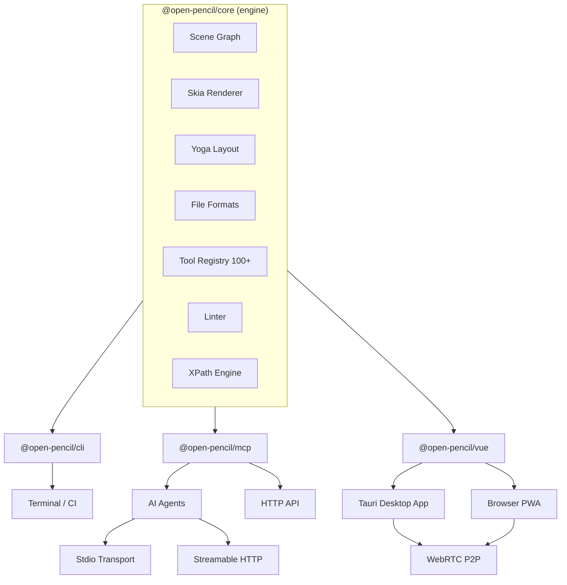
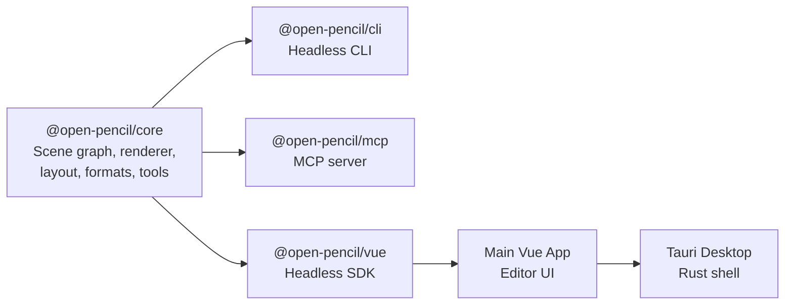
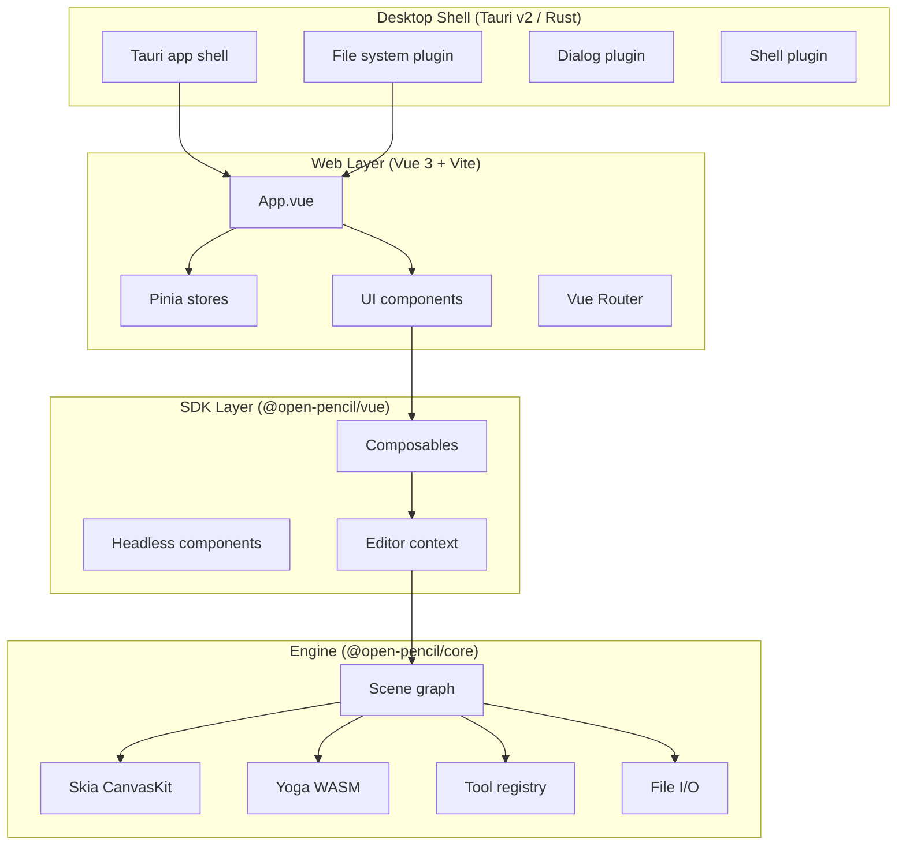
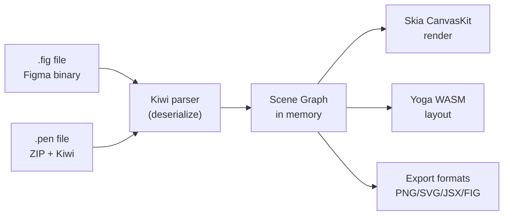

# OpenPencil -- Architecture

## System Overview

OpenPencil is a monorepo with a shared core engine and multiple distribution surfaces built on top of it.



## Package Dependency Graph



| Package | Workspace Name | Role |
|---------|---------------|------|
| `packages/core/` | `@open-pencil/core` | Engine: scene graph, Skia CanvasKit renderer, Yoga layout, Kiwi/.fig/.pen file formats, 100+ tool registry, linter, XPath engine, RPC system |
| `packages/vue/` | `@open-pencil/vue` | Headless Vue SDK: composables for editor context, canvas input, selection, property controls, color picker, layer tree, typography, layout, variables |
| `packages/cli/` | `@open-pencil/cli` | Headless CLI: tree, query, export, lint, analyze, eval, convert, info, find, pages, selection, formats, variables |
| `packages/mcp/` | `@open-pencil/mcp` | MCP server: stdio (`openpencil-mcp`) and HTTP (`openpencil-mcp-http`) transports, 100+ tool registration, RPC bridge to browser |
| `packages/docs/` | `@open-pencil/docs` | Documentation site (openpencil.dev) |

## Application Layers



## Key Abstractions

### Scene Graph

The scene graph is a tree of `SceneNode` objects. Each node has a `type` (FRAME, TEXT, RECTANGLE, ELLIPSE, LINE, VECTOR, GROUP, SECTION, COMPONENT, INSTANCE, BOOLEAN_OPERATION, etc.), an `id` (GUID), a `name`, and a set of properties (fills, strokes, effects, layout, constraints, text content, vector data, etc.).

```
Document
├── Page 1
│   ├── Frame
│   │   ├── Rectangle
│   │   ├── Text
│   │   └── Group
│   │       ├── Ellipse
│   │       └── Vector
│   └── Component
│       └── Instance
└── Page 2
    └── ...
```

### Editor

The `Editor` class manages the scene graph, tools, undo/redo, clipboard, and selection. It exposes an API for structural modifications and emits events for reactive UI updates.

### Renderer

The `SkiaRenderer` uses CanvasKit WASM to paint the scene graph onto a WebGL/WebGPU canvas. It handles:

- Shape rendering (rectangles, ellipses, lines, polygons, vectors)
- Fill types (solid, gradient linear/radial/angular, image)
- Stroke properties (weight, alignment, caps, joins, dash)
- Effects (drop shadow, inner shadow, blur, layer blur)
- Typography (font loading, text layout, style runs)
- Auto layout (Yoga WASM integration)
- Grid layout (custom Yoga fork)
- Image handling and caching

### Tools

The tool registry defines 100+ operations that can modify the scene graph. Tools are registered with typed parameters and descriptions, making them directly usable by AI models. They are split into:

- **Core tools** (create, modify, read, analyze, calc, structure)
- **Extended tools** (codegen, describe, vector, variables, stock photo)

Each tool has a schema, an executor, and a debug log for tracing AI behavior.

## Communication Patterns

### CLI --> Engine

The CLI loads a `.fig` or `.pen` file into a headless scene graph, executes commands (tree, query, export, lint, etc.), and exits. No UI, no browser.

### MCP --> Engine

The MCP server runs as a standalone Node.js process. It opens a WebSocket to the browser app (or uses RPC) to execute tools. The browser acts as the engine; the MCP server translates MCP protocol calls into RPC commands.

### Vue SDK --> Engine

The Vue SDK provides reactive bindings to the Editor instance. Composables read from the scene graph and emit commands that modify it. The editor context is provided via Vue's `provide/inject` mechanism.

### Desktop App --> Tauri

The Tauri shell manages file system access, native dialogs, window management, and system integration. The Vue app communicates with Rust via Tauri's IPC bridge.

## File Format Pipeline



## See Also

- [Core Engine](02-core-engine.md) -- Detailed scene graph, renderer, and tool internals
- [CLI](03-cli.md) -- Headless CLI commands
- [Vue SDK](06-vue-sdk.md) -- Headless Vue SDK architecture
