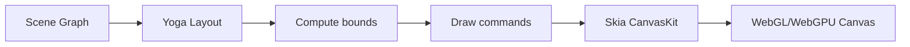

# OpenPencil -- Core Engine

## Scene Graph

The scene graph is the central data structure in `@open-pencil/core`. It is a tree of `SceneNode` objects, where each node represents a visual element.

### Node Types

| Type | Description |
|------|-------------|
| `DOCUMENT` | Root node, contains pages |
| `PAGE` | Top-level container, has its own background and bounds |
| `FRAME` | Auto-layout container with fills, strokes, effects |
| `GROUP` | Simple grouping container (no layout) |
| `SECTION` | Semantic grouping with background |
| `RECTANGLE` | Basic shape |
| `ELLIPSE` | Circle/ellipse shape |
| `LINE` | Straight line |
| `STAR` | Star shape |
| `POLYGON` | Polygon shape |
| `VECTOR` | Bezier curve network (vector paths) |
| `TEXT` | Text node with style runs and character overrides |
| `BOOLEAN_OPERATION` | Union/subtract/intersect/exclude of shapes |
| `COMPONENT` | Reusable component definition |
| `INSTANCE` | Reference to a component with overrides |

### Node Properties

Each node carries a rich set of properties:

- **Geometry**: `x`, `y`, `width`, `height`, `rotation`, `opacity`
- **Fills**: Array of solid colors, gradients (linear/radial/angular), images, videos
- **Strokes**: Weight, alignment (inside/center/outside), caps, joins, dash pattern
- **Effects**: Drop shadow, inner shadow, layer blur, background blur
- **Layout**: Auto-layout (flex) direction, gap, padding, sizing, alignment; Grid columns/rows, track sizing, child positioning
- **Constraints**: How the node resizes with its parent (left/right/scale/hug)
- **Border radius**: Per-corner or uniform
- **Export settings**: Multiple export formats and scales per node
- **Variables**: Color, number, string, boolean variable bindings

### Scene Graph API

```typescript
const graph = new SceneGraph()
graph.on('nodeAdded', (node) => { ... })
graph.on('nodeRemoved', (node) => { ... })
graph.on('nodeChanged', (node, prop) => { ... })

graph.addNode(parent, node)
graph.removeNode(node)
graph.moveNode(node, newParent, index)
graph.duplicateNode(node)
graph.findNodeById(id)
```

## Renderer

The rendering engine uses **Skia CanvasKit WASM** compiled to WebAssembly. It provides GPU-accelerated rendering via WebGL or WebGPU.

### Pipeline



### Rendering Stages

1. **Layout resolution** -- Yoga WASM computes final positions for auto-layout and grid containers
2. **Bounds computation** -- Absolute bounding boxes for every visible node
3. **Draw call generation** -- Each node type produces Skia draw commands
4. **Paint execution** -- GPU renders the commands to the canvas
5. **Label cache** -- Component and section labels are cached for performance

### Supported Visual Features

- Solid colors, linear/radial/angular gradients, image fills
- Stroke with dash patterns, corner caps, joins
- Drop shadow, inner shadow, layer blur, background blur
- Blend modes (pass through, normal, multiply, screen, overlay, etc.)
- Masks (alpha, vector, layer)
- Vector paths with bezier curves
- Styled text with font families, weights, sizes, decorations
- Opacity and rotation

## Layout Engine

Layout is powered by **Yoga WASM**, using a [forked version](https://github.com/open-pencil/yoga/tree/grid) that adds CSS Grid support.

### Flex Layout (Auto Layout)

- Direction: horizontal, vertical
- Gap, padding, item spacing
- Primary/counter axis alignment
- Sizing: fixed, hug, fill
- Wrap support

### Grid Layout

- Column/row track definitions (fixed, fractional, auto)
- Child grid position (span, start, end)
- Gap between tracks
- Alignment within cells

## File Formats

### .fig (Figma)

OpenPencil reads and writes native Figma `.fig` files by implementing the **Kiwi protocol** -- the binary serialization format Figma uses internally.

- **Parsing**: Zstd-decompressed protobuf-like binary format
- **Message types**: Node changes, variable bindings, style updates
- **Compatibility**: Reads Figma files, exports Figma-compatible `.fig` files
- **Wire protocol**: Handles `fig-wire` magic header and message framing

### .pen (OpenPencil native)

The `.pen` format is OpenPencil's native document format.

- **Structure**: ZIP archive containing Kiwi-serialized scene graph data
- **Compression**: Zstd for efficient storage
- **Open**: Documented and parseable without proprietary software

### Kiwi Binary Format

The Kiwi format is the internal serialization layer used by both `.fig` and `.pen`:

- Varint-encoded lengths and identifiers
- Message types for node operations (add, remove, modify)
- Type-safe GUIDs for node identity
- Color, paint, effect, and variable binding serialization
- Schema-driven (compiled schema for validation)

### Export Formats

| Format | Role | Notes |
|--------|------|-------|
| PNG | Raster | Scales 1x-4x, full page or selection |
| JPG | Raster | Quality 0-100, with white background |
| WEBP | Raster | Lossless/lossy, transparency |
| SVG | Vector | Path-based, preserves vector data |
| JSX | Code | React JSX with inline styles or Tailwind CSS |
| .fig | Figma | Figma-compatible binary export |

## Tool Registry

The tool registry defines all operations that can modify the scene graph. Tools are the bridge between user actions, AI models, and programmatic access.

### Tool Definition

```typescript
interface ToolDef {
  name: string
  description: string
  params: Record<string, ParamDef>
  execute: (args: Record<string, unknown>, context: ToolContext) => Promise<ToolResult>
}
```

### Tool Categories

| Category | Tools | Purpose |
|----------|-------|---------|
| **Create** | `create_rectangle`, `create_text`, `create_frame`, `create_ellipse`, `create_line`, `create_star`, `create_polygon`, `create_vector`, `create_section`, `create_component` | Add new nodes to the scene |
| **Modify** | `set_property`, `set_fills`, `set_strokes`, `set_effects`, `set_text`, `set_layout`, `set_opacity`, `set_rotation`, `set_border_radius`, `rename`, `move`, `resize` | Change existing nodes |
| **Read** | `get_node`, `get_tree`, `get_selection`, `get_properties`, `get_styles`, `get_variables` | Query the scene graph |
| **Analyze** | `analyze_colors`, `analyze_typography`, `analyze_spacing`, `analyze_clusters` | Audit design systems |
| **Structure** | `group`, `ungroup`, `flatten`, `boolean_union`, `boolean_subtract`, `boolean_intersect`, `boolean_exclude` | Structural operations |
| **Vector** | `vector_create`, `vector_add_vertex`, `vector_remove_vertex`, `vector_move_vertex` | Vector path editing |
| **Variables** | `create_variable`, `set_variable_value`, `bind_variable`, `get_variables` | Design token management |
| **Codegen** | `render`, `get_jsx`, `get_svg` | Design-to-code export |
| **Stock Photo** | `search_pexels`, `search_unsplash`, `set_image_fill` | Image search and insertion |
| **Eval** | `eval` | Execute Figma Plugin API scripts |

### AI Integration

Tools are converted to AI tool schemas via `toolsToAI()`, which maps parameter types to the Vercel AI SDK format. The AI adapter handles:

- Step budgeting (token/cost limits per AI step)
- Tool result formatting
- Debug logging for tracing AI decisions
- Multi-step execution with error recovery

## XPath Engine

OpenPencil implements XPath queries for navigating the scene graph.

```sh
//FRAME                    # All frames
//FRAME[@width < 300]      # Frames under 300px wide
//TEXT[contains(@name, 'Title')]  # Text nodes named 'Title'
//*[@cornerRadius > 0]     # Nodes with rounded corners
//SECTION//TEXT            # Text inside sections
```

### XPath API

```typescript
queryByXPath(root, "//FRAME[@autoLayout]")
matchByXPath(root, "//TEXT", { typeFilter: ["TEXT"] })
nodeToXPath(node)  # Generate XPath for a specific node
```

## Linter

The lint system checks design files for quality issues.

### Rules (18 built-in)

| Rule | Category | Severity |
|------|----------|----------|
| `no-default-names` | Naming | Warning |
| `no-empty-frames` | Structure | Warning |
| `no-hidden-layers` | Structure | Warning |
| `no-groups` | Structure | Warning (prefer frames) |
| `no-deeply-nested` | Structure | Warning |
| `no-detached-instances` | Components | Warning |
| `min-text-size` | Accessibility | Warning |
| `color-contrast` | Accessibility | Warning |
| `touch-target-size` | Accessibility | Warning |
| `prefer-auto-layout` | Layout | Warning |
| `consistent-spacing` | Layout | Warning |
| `consistent-radius` | Layout | Warning |
| `pixel-perfect` | Layout | Warning |
| `no-hardcoded-colors` | Design tokens | Warning |
| `no-mixed-styles` | Design tokens | Warning |
| `text-style-required` | Typography | Warning |
| `effect-style-required` | Effects | Warning |
| `color-space` | Color | Warning |

### Presets

- **recommended** -- Core set for most projects
- **strict** -- All rules enabled
- **accessibility** -- Focus on accessibility rules

## Vector Engine

Handles bezier curve networks for freeform drawing:

- Vertex, segment, and region data structures
- Cubic bezier evaluation (bounds, splitting, nearest point)
- Handle mirroring and breaking
- SVG path encoding
- Blob serialization for Kiwi format

## Color System

- Standard RGBA color representation
- **OkHCL** perceptual color space for intuitive editing
- Color space management (sRGB, Display P3)
- Color distance computation for palette analysis
- OKLCH for modern CSS color output

## Font System

- OpenType font loading via opentype.js
- CJK and Arabic fallback fonts
- Variable font detection
- Glyph outline probing for rendering
- Font provider abstraction for custom font sources

## RPC System

The RPC (Remote Procedure Call) system enables communication between the CLI, MCP server, and the browser app:

- Command-based protocol (tool execution, file operations, queries)
- Codec for message encoding/decoding
- Session management with authentication tokens
- WebSocket transport for browser communication

## See Also

- [CLI](03-cli.md) -- How the CLI uses the engine headlessly
- [AI & MCP](04-ai-mcp.md) -- How tools are exposed to AI agents
- [Vue SDK](06-vue-sdk.md) -- How the Vue SDK interacts with the engine
