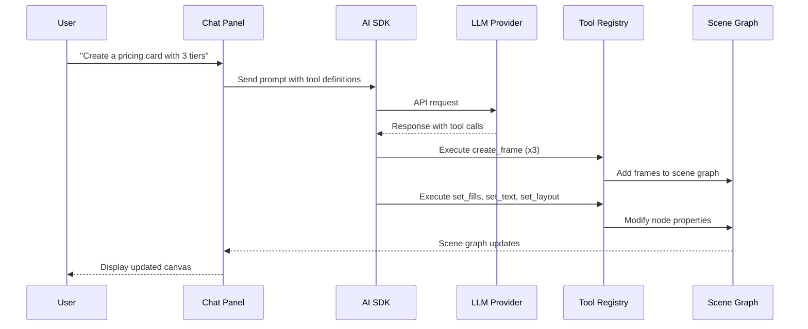
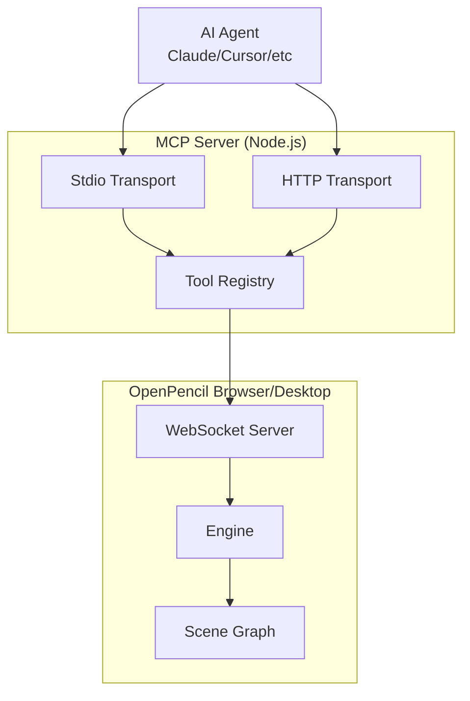

# OpenPencil -- AI & MCP

## Overview

OpenPencil has deep AI integration at multiple levels: a built-in chat assistant, an MCP server for external AI agents, and desktop integration for coding agents like Claude Code, Codex, and Gemini CLI.

## Built-in Chat Assistant

Press `Cmd+J` (macOS) or `Ctrl+J` (other platforms) to open the AI assistant panel.

### Capabilities

The assistant has access to **100+ tools** that can:

- Create shapes (rectangles, ellipses, lines, stars, polygons, vectors)
- Set fills (solid colors, gradients, images) and strokes
- Manage auto-layout (direction, gap, padding, alignment, sizing)
- Work with components and instances
- Run boolean operations (union, subtract, intersect, exclude)
- Modify text content and typography
- Analyze design tokens (colors, typography, spacing, clusters)
- Export assets (PNG, SVG, JSX)
- Search and insert stock photos (Pexels, Unsplash)

### LLM Providers

Bring your own API key. Supported providers:

| Provider | Models |
|----------|--------|
| Anthropic | Claude Haiku, Sonnet, Opus |
| OpenAI | GPT-4o, o-series |
| Google AI | Gemini 2.5 Flash, Pro |
| OpenRouter | 100+ models across providers |
| Z.ai | GLM models |
| MiniMax | MiniMax models |

No backend, no account -- API keys are stored locally.

### How It Works



The AI SDK (Vercel AI SDK) handles:

- Tool schema generation from the core tool registry
- Multi-step tool execution with error recovery
- Step budgeting (cost/token limits)
- Streaming responses
- Debug logging for tracing AI decisions

## MCP Server

The MCP (Model Context Protocol) server exposes all 100+ design tools to external AI agents.

### Installation

```sh
bun add -g @open-pencil/mcp
```

### Transports

#### Stdio (Claude Code, Cursor, Windsurf)

```sh
openpencil-mcp
```

Configuration for Claude Code (`~/.claude/settings.json`):

```json
{
  "mcpServers": {
    "open-pencil": {
      "command": "openpencil-mcp"
    }
  }
}
```

#### HTTP (scripts, CI)

```sh
openpencil-mcp-http   # http://localhost:3100/mcp
```

The HTTP server also exposes an `/rpc` endpoint for direct tool invocation.

### Architecture



The MCP server is a **bridge**: it registers 100+ tools from `@open-pencil/core`, but the actual execution happens in the browser app. When an AI agent calls a tool, the MCP server sends an RPC request over WebSocket to the browser, which executes it against the scene graph and returns the result.

### File Access

Set `OPENPENCIL_MCP_ROOT` to scope file operations (`open_file`, `new_document`, export `path` parameter) to a directory. Defaults to the current working directory. This prevents path traversal attacks.

### MCP Tools

All tools from the core registry are exposed, plus:

| Tool | Description |
|------|-------------|
| `open_file` | Open a .fig or .pen file from disk |
| `new_document` | Create a new empty document |
| `save_file` | Save the current document to disk |
| `get_codegen_prompt` | Get design-to-code generation guidelines |
| `eval` | Execute Figma Plugin API scripts (disabled by default in MCP) |

## Coding Agents (Desktop)

The desktop app supports running Claude Code, Codex, or Gemini CLI directly in the chat panel.

### Claude Code Setup

1. Install the ACP adapter: `npm i -g @agentclientprotocol/claude-agent-acp`
2. Add MCP permission to `~/.claude/settings.json`:

```json
{
  "permissions": {
    "allow": ["mcp__open-pencil"]
  }
}
```

3. Open the desktop app, press `Ctrl+J`, select **Claude Code** from the provider dropdown

The agent connects to the editor's MCP server and uses all 100+ design tools to manipulate the canvas.

## AI Agent Skill

Teach AI coding agents to use OpenPencil:

```sh
npx skills add open-pencil/skills@open-pencil
```

Works with Claude Code, Cursor, Windsurf, Codex, and any agent that supports [skills.sh](https://skills.sh).

The skill teaches agents how to:

- Inspect design files (tree, query, info)
- Export assets (PNG, SVG, JSX)
- Analyze tokens (colors, typography, spacing)
- Modify `.fig` files via MCP

## Tool Schemas

Tools are defined with typed parameters that translate directly to AI tool schemas:

```typescript
interface ToolDef {
  name: string          // Unique identifier
  description: string   // What the tool does (used in AI prompt)
  params: {
    [key: string]: {
      type: 'string' | 'number' | 'boolean' | 'color' | 'string[]'
      description: string
      required?: boolean
      enum?: string[]
      min?: number
      max?: number
    }
  }
}
```

The `toolsToAI()` function converts this to the Vercel AI SDK format, and the MCP SDK uses Zod schemas generated from the same definitions.

## See Also

- [Core Engine](02-core-engine.md) -- Tool registry internals
- [CLI](03-cli.md) -- Headless access to the same tools
- [Vue SDK](06-vue-sdk.md) -- How the UI connects to the engine
