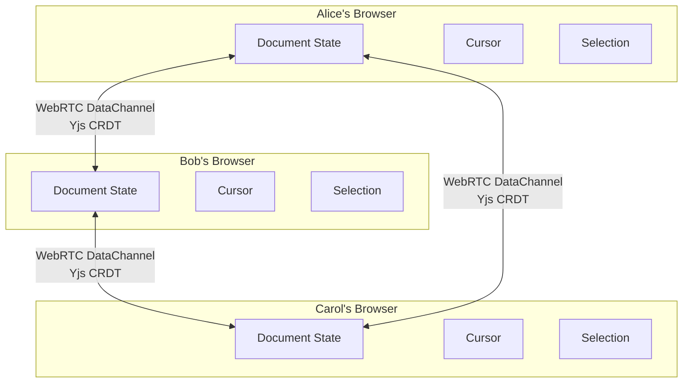

# OpenPencil -- Collaboration

## Overview

OpenPencil supports real-time collaborative editing via **WebRTC peer-to-peer** connections. No server relays your data, no account is required.

## How It Works

### Technology Stack

| Layer | Technology | Purpose |
|-------|-----------|---------|
| Transport | Trystero (WebRTC) | Peer discovery and DataChannel setup |
| CRDT | Yjs | Conflict-free replicated document state |
| Persistence | IndexedDB (y-indexeddb) | Local state persistence |
| Signaling | Trystero default | Room joining (no data relayed) |

### WebRTC P2P

Peers connect directly to each other using WebRTC DataChannels. The design data flows browser-to-browser without passing through a central server. Room IDs are cryptographically random, so only people with the link can join.

### CRDT (Conflict-Free Replicated Data Type)

Yjs ensures that concurrent edits from multiple peers merge automatically without conflicts. Each peer maintains a copy of the full document state, and Yjs handles the synchronization.

## Features

### What Syncs

- **Document changes** -- Every edit (shapes, text, properties, layout) syncs instantly across all peers
- **Cursors** -- Each peer's cursor position is visible to everyone, with their name and color
- **Selections** -- Highlighted selections are visible to all collaborators

### Follow Mode

Click a collaborator's avatar in the top bar to follow their viewport. Your canvas pans and zooms to match their view. Click again to stop following.

### Room Lifecycle

1. **Create** -- Click the share button in the top-right panel
2. **Join** -- Collaborators open the link (`app.openpencil.dev/share/<room-id>`)
3. **Active** -- Room stays active as long as at least one participant has the page open
4. **Leave** -- When a peer disconnects, their cursor is cleaned up automatically
5. **Rejoin** -- If you refresh the page, you rejoin with the same document state (persisted in IndexedDB)

## Sharing a Room

1. Click the **share button** in the top-right corner
2. Copy the generated link (`app.openpencil.dev/share/<room-id>`)
3. Send it to your collaborators

Anyone with the link can join the room.

## Tips

- Works in both the **browser** and the **desktop app**
- Room IDs are **cryptographically random** -- only people with the link can join
- Stale cursors are **cleaned up automatically** when someone disconnects
- Document state is **persisted locally** via IndexedDB -- refresh and you get the same state
- No server stores your design data -- it goes directly peer-to-peer

## Limitations

- **No centralized room management** -- rooms exist only while participants are connected
- **Max peers** depends on WebRTC mesh topology (practical limit around 10-20 peers)
- **No server fallback** -- if P2P connectivity fails, collaboration won't work

## See Also

- [Architecture](01-architecture.md) -- Overall system design
- [Overview](00-overview.md) -- Project capabilities
