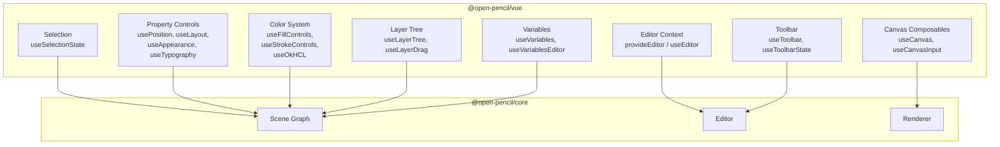

# OpenPencil -- Vue SDK

## Overview

`@open-pencil/vue` is a headless Vue SDK for building custom design editors. It provides composable functions and headless UI components that connect to the OpenPencil core engine.

## Architecture



## Installation

```sh
bun add @open-pencil/vue
```

## Editor Context

The foundation of the SDK. Make an Editor instance available to a Vue subtree:

```typescript
import { provideEditor, useEditor } from '@open-pencil/vue'

// In a parent component:
provideEditor(editor)

// In any child component:
const { editor, state } = useEditor()
```

### API

| Export | Purpose |
|--------|---------|
| `provideEditor(editor)` | Make editor available via Vue provide/inject |
| `useEditor()` | Access editor and state from any child component |
| `EDITOR_KEY` | Injection key for custom scenarios |

## Canvas Composables

### useCanvas

Sets up the CanvasKit rendering surface:

```typescript
const { canvasRef, resizeObserver } = useCanvas({
  editor,
  zoom,
  pan
})
```

### useCanvasInput

Handles mouse/touch input on the canvas:

- Pan, zoom, selection
- Tool-specific interactions (shape drawing, text editing)
- Keyboard shortcuts

### useTextEdit

In-place text editing overlay:

- Caret management
- Font metrics
- Commit/cancel handling

### useCanvasDrop

Drag-and-drop support:

- File drops (images, .fig, .pen)
- Clipboard paste handling
- Image extraction from clipboard

## Property Controls

### useNodeProps

Read and write node properties with mixed-value support (when multiple nodes are selected with different values):

```typescript
const { width, height, rotation, opacity } = useNodeProps()
```

### usePosition

X, Y, width, height, rotation, and corner radius controls.

### useLayout

Auto-layout and grid layout controls:

- Layout mode (horizontal, vertical, grid, none)
- Gap, padding, item spacing
- Alignment, sizing modes
- Grid tracks and child positioning

### useAppearance

Opacity, blend mode, visibility controls.

### useTypography

Text properties:

- Font family, size, weight
- Alignment, spacing, decoration
- Character style overrides
- Style run management

### useFillControls / useStrokeControls

Fill and stroke management:

- Solid colors, gradients, images
- Stroke weight, alignment, caps, joins
- OkHCL color space support

### useOkHCL

Perceptual color editing via OkHCL color space.

### useEffectsControls

Drop shadow, inner shadow, blur effect controls.

## Color System

### ColorPicker

Headless color picker components:

```typescript
import {
  ColorInputRoot,
  ColorPickerRoot,
  createColorPickerModel,
  createSliderGradientModel
} from '@open-pencil/vue'
```

Supports:

- Solid color (RGB, HSL, HSB, OkHCL)
- Gradient editor (linear, radial, angular)
- Opacity control
- Color format conversion

## Layout Components

### LayerTree

Hierarchical layer display:

```typescript
import { LayerTreeRoot, LayerTreeItem, useLayerTree } from '@open-pencil/vue'
```

### Toolbar

Tool selection and state:

```typescript
import { ToolbarRoot, ToolbarItem, useToolbar } from '@open-pencil/vue'
```

### PropertyList

Generic property display with editing:

```typescript
import { PropertyListRoot, PropertyListItem, usePropertyList } from '@open-pencil/vue'
```

## Variables Editor

Design token (variable) management:

| Composable | Purpose |
|------------|---------|
| `useVariables` | Access variable collections and values |
| `useVariablesEditor` | Full variable editor state |
| `useVariablesTable` | Tabular variable display |
| `useVariablesDialogState` | Variable creation/editing dialog |

## Commands and Menus

### useEditorCommands

Maps editor commands to keyboard shortcuts and menu entries:

```typescript
const { commands, execute } = useEditorCommands()
```

### useMenuModel

Builds menu structures from command definitions:

```typescript
const menuModel = useMenuModel(commandGroups)
```

## Canvas Components

The SDK also exports headless structural primitives:

| Component | Purpose |
|-----------|---------|
| `CanvasRoot` | Root container for canvas |
| `CanvasSurface` | CanvasKit rendering surface |
| `ColorInputRoot` | Color input wrapper |
| `ColorPickerRoot` | Color picker root |
| `FillPickerRoot` | Fill picker wrapper |
| `FontPickerRoot` | Font picker wrapper |
| `GradientEditorRoot` | Gradient editor |
| `GradientEditorBar` | Gradient bar |
| `GradientEditorStop` | Gradient stop handle |
| `LayerTreeRoot` | Layer tree root |
| `LayerTreeItem` | Layer tree item |
| `LayoutControlsRoot` | Layout controls |
| `AppearanceControlsRoot` | Appearance controls |
| `PageListRoot` | Page navigation |
| `PositionControlsRoot` | Position controls |
| `ScrubInputRoot` | Numeric scrub input |
| `ToolbarRoot` | Toolbar container |
| `TypographyControlsRoot` | Typography panel |
| `VariablesEditor` | Variable editor panel |

## Internationalization

Built-in i18n support:

```typescript
import { setLocale, useI18n, AVAILABLE_LOCALES } from '@open-pencil/vue'

setLocale('de')
const { t } = useI18n()
```

Supported locales: English, German, French, Spanish, Italian, Polish, Russian, and more.

## Building a Custom Editor

Minimal example:

```vue
<script setup lang="ts">
import { createEditor } from '@open-pencil/core'
import { provideEditor, useCanvas, CanvasRoot, CanvasSurface } from '@open-pencil/vue'

const editor = createEditor({ /* options */ })
provideEditor(editor)

const { canvasRef } = useCanvas({ editor })
</script>

<template>
  <CanvasRoot>
    <CanvasSurface ref="canvasRef" />
    <!-- Add your custom UI around the canvas -->
  </CanvasRoot>
</template>
```

## See Also

- [Core Engine](02-core-engine.md) -- The engine the SDK connects to
- [Architecture](01-architecture.md) -- How the SDK fits in the package graph
