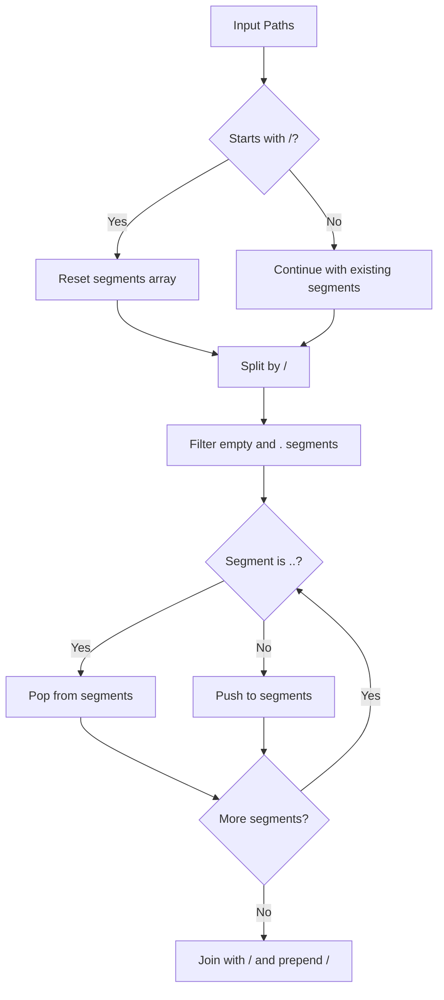
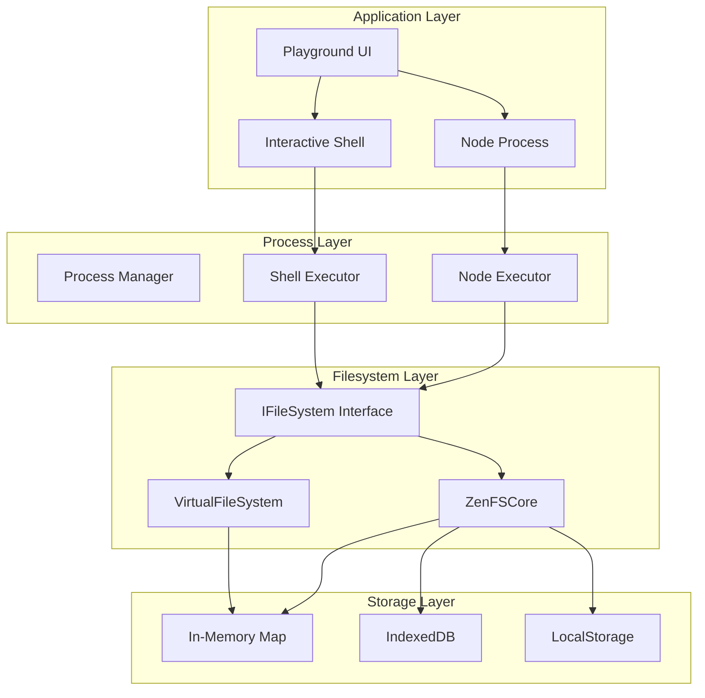
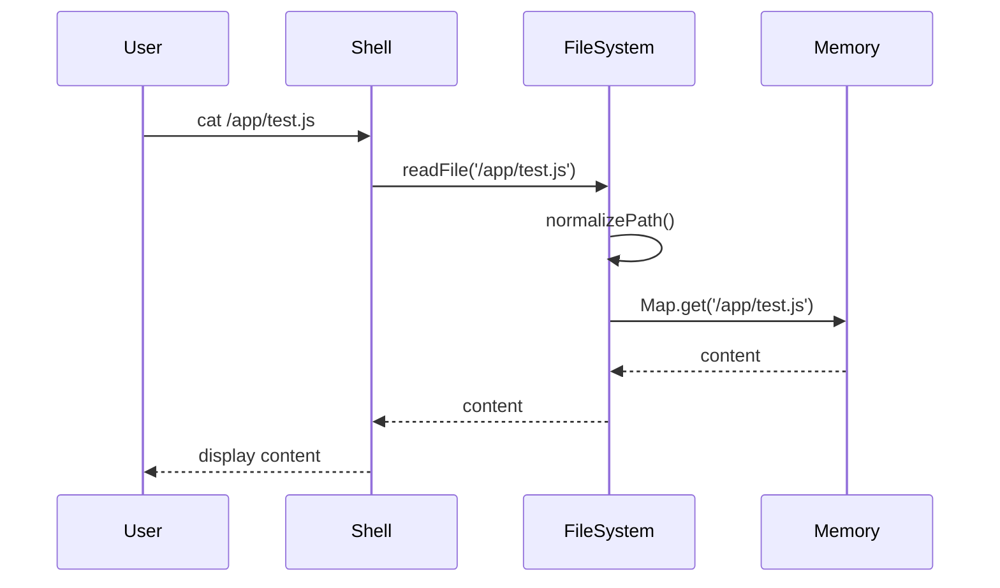
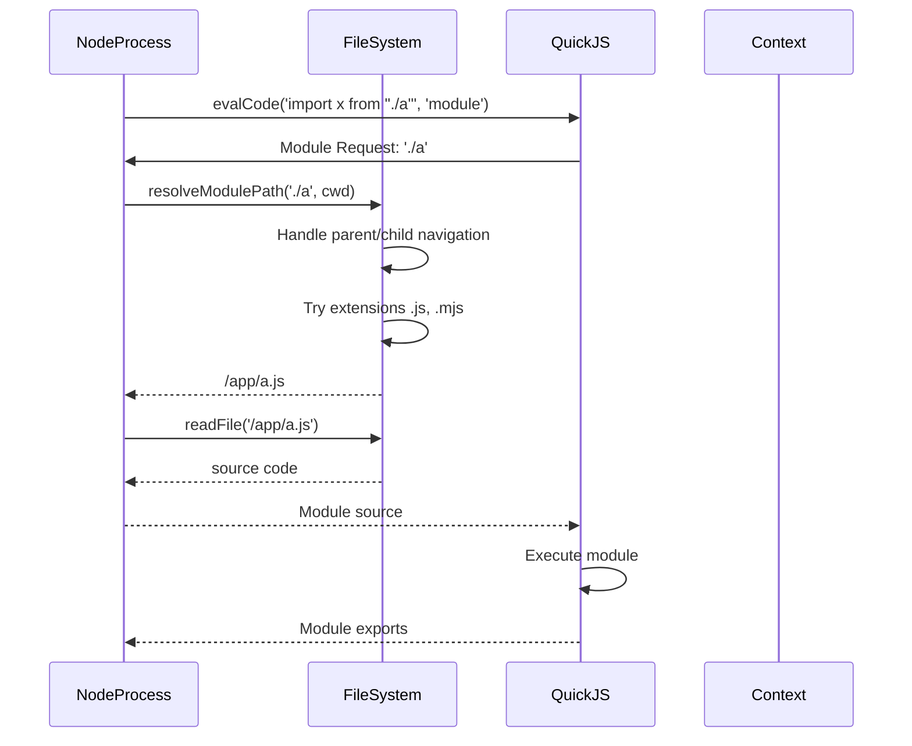

# Virtual File System Deep Dive: OpenWebContainer

## Overview

The Virtual File System (VFS) in OpenWebContainer is a browser-based filesystem abstraction that enables server-like file operations entirely within the browser environment. It provides a POSIX-like filesystem interface that supports both volatile in-memory storage and persistent storage through browser APIs (IndexedDB, LocalStorage) via the ZenFS library.

### Purpose

The VFS serves as the foundation for:
- **Container isolation**: Each container has its own isolated filesystem namespace
- **Module loading**: JavaScript modules are loaded from the virtual filesystem
- **Shell operations**: All shell commands (ls, cat, mkdir, etc.) operate on virtual files
- **Development workflows**: Users can create, edit, and execute files as if running on a server

### Architecture Summary

```mermaid
graph TD
    A[OpenWebContainer] --> B[IFileSystem Interface]
    B --> C[VirtualFileSystem In-Memory]
    B --> D[ZenFSCore ZenFS Backend]
    D --> E[@zenfs/core Library]
    E --> F[InMemory Backend]
    E --> G[IndexedDB Backend]
    E --> H[LocalStorage Backend]
    
    C --> I[Files Map]
    C --> J[Directories Set]
    
    B --> K[Path Utilities]
    K --> L[normalizePath]
    K --> M[resolvePath]
    K --> N[resolveModulePath]
    
    A --> O[Process Executors]
    O --> P[NodeProcess Executor]
    O --> Q[ShellProcess Executor]
    
    P --> B
    Q --> B
```

---

## 1. FileSystem Architecture

### 1.1 IFileSystem Interface

All filesystem implementations conform to the `IFileSystem` interface defined in `/packages/core/src/filesystem/types.ts`:

```typescript
export interface IFileSystem {
    // File operations
    writeFile(path: string, content: string): void;
    writeBuffer(path: string, buffer: Buffer): void;
    readFile(path: string): string | undefined;
    readBuffer(path: string): Buffer | undefined;
    deleteFile(path: string, recursive?: boolean): void;
    listFiles(basePath?: string): string[];
    
    // Path operations
    resolvePath(path: string, basePath?: string): string;
    fileExists(path: string): boolean;
    resolveModulePath(specifier: string, basePath?: string): string;
    normalizePath(path: string): string;
    
    // Directory operations
    createDirectory(path: string): void;
    deleteDirectory(path: string): void;
    listDirectory(path: string): string[];
    isDirectory(path: string): boolean;
}
```

**Design Decisions:**
- Returns `undefined` for missing files instead of throwing (read operations)
- Throws errors for invalid operations (write to existing directory, delete non-empty directory)
- All paths are normalized to absolute paths starting with `/`
- Buffer operations are defined but not implemented in the base VirtualFileSystem

### 1.2 VirtualFileSystem Class Structure

Located at `/packages/core/src/filesystem/virtual-fs.ts`, the `VirtualFileSystem` class implements an in-memory filesystem:

```typescript
export class VirtualFileSystem implements IFileSystem {
    private files: Map<string, string>;
    private directories: Set<string>;

    constructor() {
        this.files = new Map();
        this.directories = new Set();
        this.directories.add('/'); // Root directory
    }
    // ... implementations
}
```

**Data Structures:**

| Structure | Type | Purpose |
|-----------|------|---------|
| `files` | `Map<string, string>` | Maps normalized paths to file contents |
| `directories` | `Set<string>` | Stores all created directory paths |

**Key Characteristics:**
- O(1) file lookup via Map
- O(1) directory existence check via Set
- No actual disk I/O - all operations are memory-based
- Root directory `/` is automatically created

### 1.3 ZenFS Integration (zenfs-core.ts)

The `ZenFSCore` class at `/packages/core/src/filesystem/zenfs-core.ts` provides integration with the ZenFS library:

```typescript
import { fs, normalizePath } from '@zenfs/core';

export class ZenFSCore implements IFileSystem {
    private fs: typeof fs;

    constructor() {
        this.fs = fs;
    }

    writeFile(path: string, content: string): void {
        this.fs.writeFileSync(path, content, {encoding:'utf-8'});
    }

    readFile(path: string): string | undefined {
        return this.fs.readFileSync(path, 'utf-8');
    }
    // ... other implementations
}
```

**ZenFS Core Features:**
- Leverages `@zenfs/core` library for cross-backend compatibility
- Supports sync and async operations
- Provides access to multiple storage backends
- Handles file metadata automatically

### 1.4 Backend Options

The OpenWebContainer primarily uses ZenFSCore which supports these backends through `@zenfs/core`:

#### InMemory Backend
```typescript
// Configuration would look like:
import { fs } from '@zenfs/core';
await fs.configure({ backend: 'InMemory' }).commit();
```
- **Volatile**: Data lost on page refresh
- **Fast**: No I/O latency
- **Unlimited**: Limited only by browser memory
- **Use case**: Testing, temporary containers

#### IndexedDB Backend
```typescript
await fs.configure({ backend: 'IndexedDB' }).commit();
```
- **Persistent**: Survives page refresh and browser restart
- **Large storage**: Typically 50MB+ depending on browser
- **Async**: Operations are asynchronous internally
- **Use case**: Production containers, persistent projects

#### LocalStorage Backend
```typescript
await fs.configure({ backend: 'LocalStorage' }).commit();
```
- **Persistent**: Survives page refresh
- **Limited**: ~5-10MB storage limit
- **Sync**: Synchronous API (can block UI)
- **Use case**: Small configurations, settings

### 1.5 Mount Points and Mounting Strategy

The current implementation uses a **single-root filesystem** without explicit mount points. All paths resolve under the root `/` directory.

**Potential Mount Point Architecture:**
```mermaid
graph TD
    subgraph "Virtual Filesystem Root"
        R[/]
        R --> A[/app]
        R --> B[/home]
        R --> C[/node_modules]
        R --> D[/tmp]
    end
    
    subgraph "Backend Mapping"
        A -.-> E[IndexedDB - Persistent]
        B -.-> E
        C -.-> F[InMemory - Cached]
        D -.-> F
    end
```

**Current Implementation:**
- Default working directory: `/`
- No explicit mount point API
- All files stored in single backend
- Container isolation via path prefixes (e.g., `/container-123/`)

---

## 2. Path Resolution

### 2.1 Path Normalization Algorithm

The `normalizePath` method in `VirtualFileSystem`:

```typescript
normalizePath(path: string): string {
    let normalized = path.replace(/\\/g, '/');
    if (!normalized.startsWith('/')) {
        normalized = '/' + normalized;
    }
    return normalized.replace(/\/+/g, '/');
}
```

**Algorithm Steps:**
1. Replace all backslashes with forward slashes (Windows compatibility)
2. Ensure path starts with `/` (absolute path conversion)
3. Collapse multiple consecutive slashes into single slash

**Examples:**
| Input | Output |
|-------|--------|
| `foo/bar` | `/foo/bar` |
| `./foo/bar` | `/./foo/bar` |
| `foo//bar` | `/foo/bar` |
| `C:\Users\file` | `/C:/Users/file` |

### 2.2 Absolute vs Relative Paths

**Path Resolution Logic** (from `resolvePath`):

```typescript
resolvePath(path: string, basePath: string = ''): string {
    const normalizedPath = this.normalizePath(path);
    const normalizedBasePath = this.normalizePath(basePath);
    if (normalizedPath.startsWith('/')) {
        return normalizedPath;  // Absolute path - use as-is
    }
    return normalizedBasePath + '/' + normalizedPath;  // Relative - join with base
}
```

**Behavior:**
- Paths starting with `/` are absolute and ignore the base path
- Paths not starting with `/` are joined to the base path
- No `.` or `..` resolution in this method (handled in `resolveModulePath`)

### 2.3 Parent Directory Resolution (..)

The `resolveModulePath` method handles parent directory navigation:

```typescript
resolveModulePath(specifier: string, basePath: string = ''): string {
    // ...
    if (specifier.startsWith('./') || specifier.startsWith('../')) {
        const baseSegments = baseDir.split('/').filter(Boolean);
        const specSegments = specifier.split('/').filter(Boolean);
        const resultSegments = [...baseSegments];

        for (const segment of specSegments) {
            if (segment === '..') {
                if (resultSegments.length === 0) {
                    throw new Error(`Invalid path: ${specifier} goes beyond root from ${basePath}`);
                }
                resultSegments.pop();  // Go up one directory
            } else if (segment !== '.') {
                resultSegments.push(segment);  // Go down one directory
            }
        }
        resolvedPath = '/' + resultSegments.join('/');
    }
    // ...
}
```

**Algorithm:**
1. Split base path into segments, filtering empty strings
2. Split specifier into segments
3. Process each segment:
   - `..` → pop from result stack (with root check)
   - `.` → skip (current directory)
   - other → push to result stack
4. Join segments back with `/`

**Examples:**
| Base | Specifier | Result |
|------|-----------|--------|
| `/app/src` | `./utils.js` | `/app/src/utils.js` |
| `/app/src` | `../lib/helper.js` | `/app/lib/helper.js` |
| `/app` | `../../etc/passwd` | **Error** (beyond root) |
| `/app/src/deep` | `../../../foo.js` | `/foo.js` |

### 2.4 Current Directory Handling (.)

The current directory is tracked in the Shell:

```typescript
export class Shell implements IShell {
    private currentDirectory: string = '/';
    
    private resolvePath(path: string): string {
        if (path.startsWith('/')) {
            return path;
        }
        return `${this.currentDirectory}/${path}`.replace(/\/+/g, '/');
    }
    
    setWorkingDirectory(path: string): void {
        const resolvedPath = this.resolvePath(path);
        if (!this.fileSystem.isDirectory(resolvedPath)) {
            throw new Error(`Directory not found: ${path}`);
        }
        this.currentDirectory = resolvedPath;
        this.env.set('PWD', resolvedPath);
    }
}
```

**Key Points:**
- Shell maintains `currentDirectory` state
- Default working directory is `/`
- `cd` command updates `currentDirectory`
- All relative paths resolve against `currentDirectory`

### 2.5 Path Joining Logic

The `pathUtils` module provides path joining utilities:

```typescript
export const pathUtils = {
    join(...paths: string[]): string {
        return paths.join('/').replace(/\/+/g, '/');
    },
    
    resolve(...paths: string[]): string {
        const segments: string[] = [];
        
        paths.forEach(path => {
            if (path.startsWith('/')) {
                segments.length = 0;  // Reset on absolute path
            }
            
            const parts = path.split('/').filter(p => p && p !== '.');
            
            parts.forEach(part => {
                if (part === '..') {
                    segments.pop();
                } else {
                    segments.push(part);
                }
            });
        });
        
        return '/' + segments.join('/');
    }
};
```

**Full Resolution Algorithm:**


---

## 3. File Operations

### 3.1 writeFile() Implementation

**VirtualFileSystem Implementation:**
```typescript
writeFile(path: string, content: string): void {
    const normalizedPath = this.normalizePath(path);
    const dirPath = this.getDirectoryPath(normalizedPath);

    // Auto-create parent directories
    if (!this.directories.has(dirPath)) {
        this.createDirectory(dirPath);
    }

    this.files.set(normalizedPath, content);
}

private getDirectoryPath(path: string): string {
    return this.normalizePath(path.split('/').slice(0, -1).join('/'));
}
```

**Behavior:**
1. Normalize the path
2. Extract parent directory path
3. Auto-create parent directories if missing (recursive creation)
4. Store content in the files Map

**Edge Cases Handled:**
- Creating `/a/b/c/file.txt` automatically creates `/a`, `/a/b`, `/a/b/c`
- Overwriting existing files (Map.set replaces value)
- Path normalization ensures consistent keys

**ZenFSCore Implementation:**
```typescript
writeFile(path: string, content: string): void {
    this.fs.writeFileSync(path, content, {encoding:'utf-8'});
}
```

### 3.2 readFile() Implementation

**VirtualFileSystem:**
```typescript
readFile(path: string): string | undefined {
    return this.files.get(this.normalizePath(path));
}
```

**ZenFSCore:**
```typescript
readFile(path: string): string | undefined {
    return this.fs.readFileSync(path, 'utf-8');
}
```

**Behavior:**
- Returns `undefined` for non-existent files (no error thrown)
- Returns full file content as string
- Path is normalized before lookup

**Error Handling:**
| Scenario | VirtualFileSystem | ZenFSCore |
|----------|------------------|-----------|
| File not found | `undefined` | Throws ENOENT |
| Path is directory | `undefined` | Throws EISDIR |
| Permission denied | N/A | Throws EACCES |

### 3.3 deleteFile() Implementation

**VirtualFileSystem:**
```typescript
deleteFile(path: string, recursive = false): void {
    const normalizedPath = this.normalizePath(path);
    if (!this.files.has(normalizedPath)) {
        throw new Error(`File not found: ${path}`);
    }
    this.files.delete(normalizedPath);
}
```

**ZenFSCore:**
```typescript
deleteFile(path: string, recursive = false): void {
    this.fs.rmSync(path, { recursive });
}
```

**Behavior:**
- Throws error if file doesn't exist
- `recursive` parameter exists but is unused in VirtualFileSystem
- ZenFSCore passes recursive to underlying fs.rmSync

### 3.4 File Metadata

The current implementation has **minimal metadata** tracking:

| Metadata | VirtualFileSystem | ZenFSCore |
|----------|------------------|-----------|
| Size | Computed from content.length | Available via fs.statSync |
| Created | Not tracked | Available via fs.statSync |
| Modified | Not tracked | Available via fs.statSync |
| Permissions | Not implemented | Depends on backend |

**Getting File Size:**
```typescript
// With ZenFSCore
const stat = this.fs.statSync(path);
const size = stat.size;

// With VirtualFileSystem (manual)
const content = this.readFile(path);
const size = content?.length || 0;
```

### 3.5 File Permissions

**Current Status:** Not implemented

The filesystem currently has no permission system:
- All files are readable by all processes
- No user/group ownership
- No chmod/chown operations

**Potential Implementation:**
```typescript
interface FileMetadata {
    content: string;
    mode: number;      // Unix permissions (e.g., 0o644)
    uid: number;       // User ID
    gid: number;       // Group ID
    createdAt: Date;
    modifiedAt: Date;
}

private files: Map<string, FileMetadata>;
```

---

## 4. Directory Operations

### 4.1 createDirectory() Implementation

**VirtualFileSystem:**
```typescript
createDirectory(path: string): void {
    const normalizedPath = this.normalizePath(path);
    
    if (this.files.has(normalizedPath)) {
        throw new Error(`File exists at path: ${path}`);
    }

    // Create parent directories recursively
    const parentPath = this.getDirectoryPath(normalizedPath);
    if (parentPath !== '/' && !this.directories.has(parentPath)) {
        this.createDirectory(parentPath);
    }

    this.directories.add(normalizedPath);
}
```

**Algorithm:**
1. Normalize path
2. Check if a file exists at that path (error if so)
3. Recursively create parent directories
4. Add path to directories Set

**ZenFSCore:**
```typescript
createDirectory(path: string): void {
    this.fs.mkdirSync(path, {recursive:true});
}
```

### 4.2 deleteDirectory() Implementation

**VirtualFileSystem:**
```typescript
deleteDirectory(path: string): void {
    const normalizedPath = this.normalizePath(path);
    if (!this.directories.has(normalizedPath)) {
        throw new Error(`Directory not found: ${path}`);
    }
    if (this.listDirectory(normalizedPath).length > 0) {
        throw new Error(`Directory not empty: ${path}`);
    }
    this.directories.delete(normalizedPath);
}
```

**Behavior:**
- Throws error if directory doesn't exist
- Throws error if directory is not empty (safety check)
- Does NOT recursively delete contents

**ZenFSCore:**
```typescript
deleteDirectory(path: string): void {
    this.fs.rmdirSync(path);
}
```

**Note:** ZenFS's `rmdirSync` also requires empty directories. For recursive deletion, use `deleteFile(path, true)` which calls `fs.rmSync(path, {recursive: true})`.

### 4.3 listDirectory() Implementation

**VirtualFileSystem:**
```typescript
listDirectory(path: string): string[] {
    const normalizedPath = this.normalizePath(path);
    if (!this.directories.has(normalizedPath)) {
        throw new Error(`Directory not found: ${path}`);
    }

    const entries = new Set<string>();

    // Add subdirectories
    for (const dir of this.directories) {
        if (dir !== normalizedPath && dir.startsWith(normalizedPath)) {
            const relativePath = dir.slice(normalizedPath.length + 1);
            const topLevel = relativePath.split('/')[0];
            if (topLevel) {
                entries.add(topLevel + '/');  // Trailing slash for directories
            }
        }
    }

    // Add files
    for (const file of this.files.keys()) {
        if (file.startsWith(normalizedPath)) {
            const relativePath = file.slice(normalizedPath.length);
            const topLevel = relativePath.split('/')[0];
            if (topLevel) {
                entries.add(topLevel);
            }
        }
    }

    return Array.from(entries).sort();
}
```

**Algorithm:**
1. Validate directory exists
2. Find all directories that start with the given path
3. Extract only the immediate children (first level)
4. Add trailing `/` to directory names
5. Find all files that start with the given path
6. Extract immediate children
7. Return sorted array

**Example:**
```
Directory structure:
/app/
/app/src/
/app/src/index.js
/app/src/utils.js
/app/package.json
/app/node_modules/

listDirectory('/app') returns:
['node_modules/', 'package.json', 'src/']
```

**ZenFSCore:**
```typescript
listDirectory(path: string): string[] {
    return this.fs.readdirSync(path);
}
```

### 4.4 Directory Tree Traversal

**Recursive Tree Listing** (from ZenFSCore.listFiles):

```typescript
listFiles(basePath:string="/"): string[] {
    const files = [];
    const items = fs.readdirSync(basePath, { withFileTypes: true });
    if (basePath.endsWith('/')) basePath = basePath.slice(0, -1);
    for (const item of items) {
        if (item.isDirectory()) {
            files.push(...this.listFiles(`${basePath}/${item.name}`));  // Recursive
        } else {
            files.push(`${basePath}/${item.name}`);
        }
    }
    return files;
}
```

**Tree Structure Generation:**
```typescript
interface FileTreeNode {
    name: string;
    type: 'file' | 'directory';
    children?: FileTreeNode[];
    path: string;
}

function buildTree(path: string): FileTreeNode {
    if (fs.isDirectory(path)) {
        return {
            name: path.split('/').pop() || '/',
            type: 'directory',
            children: fs.readdirSync(path).map(child => 
                buildTree(`${path}/${child}`)
            ),
            path
        };
    } else {
        return {
            name: path.split('/').pop() || '',
            type: 'file',
            path
        };
    }
}
```

### 4.5 exists() Checks

**File Existence:**
```typescript
fileExists(path: string): boolean {
    const normalizedPath = this.normalizePath(path);
    return this.files.has(normalizedPath);
}
```

**Directory Existence:**
```typescript
isDirectory(path: string): boolean {
    return this.directories.has(this.normalizePath(path));
}
```

**ZenFSCore:**
```typescript
fileExists(path: string): boolean {
    return this.fs.existsSync(path);
}

isDirectory(path: string): boolean {
    return this.fs.lstatSync(path).isDirectory();
}
```

**Combined Check Pattern:**
```typescript
function exists(path: string): boolean {
    return fileSystem.fileExists(path) || fileSystem.isDirectory(path);
}

function stat(path: string): 'file' | 'directory' | null {
    if (fileSystem.isDirectory(path)) return 'directory';
    if (fileSystem.fileExists(path)) return 'file';
    return null;
}
```

---

## 5. ZenFS Core Integration

### 5.1 FileSystem Interface

The ZenFS library provides a standardized interface that OpenWebContainer wraps:

```typescript
// From @zenfs/core
export interface FileSystem {
    // Sync operations
    readFileSync(path: string, options?: {encoding?: string}): string | Buffer;
    writeFileSync(path: string, data: string | Buffer, options?: {encoding?: string}): void;
    mkdirSync(path: string, options?: {recursive?: boolean}): void;
    rmdirSync(path: string): void;
    rmSync(path: string, options?: {recursive?: boolean}): void;
    readdirSync(path: string, options?: {withFileTypes?: boolean}): string[] | Dirent[];
    statSync(path: string): Stats;
    lstatSync(path: string): Stats;
    existsSync(path: string): boolean;
    
    // Async operations
    readFile(path: string, options?: {encoding?: string}): Promise<string | Buffer>;
    writeFile(path: string, data: string | Buffer, options?: {encoding?: string}): Promise<void>;
    // ... more async methods
}
```

### 5.2 Backend Selection

ZenFS supports multiple backends selected at configuration time:

```typescript
import { fs } from '@zenfs/core';

// InMemory - fastest, volatile
await fs.configure({ backend: 'InMemory' }).commit();

// IndexedDB - persistent, large storage
await fs.configure({ 
    backend: 'IndexedDB',
    options: { dbName: 'openwebcontainer' }
}).commit();

// LocalStorage - persistent, limited size
await fs.configure({ backend: 'LocalStorage' }).commit();

// Hybrid approach (custom implementation)
await fs.configure({
    backend: 'Overlay',
    options: {
        writable: 'IndexedDB',
        readable: ['InMemory', 'IndexedDB']
    }
}).commit();
```

### 5.3 Async Operations

While the current OpenWebContainer implementation uses synchronous methods, ZenFS supports async operations:

```typescript
// Async implementation example
export class ZenFSAsync implements IFileSystem {
    private fs: typeof fs;

    async writeFile(path: string, content: string): Promise<void> {
        await this.fs.writeFile(path, content, {encoding:'utf-8'});
    }

    async readFile(path: string): Promise<string | undefined> {
        try {
            return await this.fs.readFile(path, 'utf-8');
        } catch (e) {
            return undefined;
        }
    }

    async listFiles(basePath: string = "/"): Promise<string[]> {
        const files: string[] = [];
        await this.walkDirectory(basePath, files);
        return files;
    }

    private async walkDirectory(path: string, files: string[]): Promise<void> {
        const items = await this.fs.readdir(path, {withFileTypes: true});
        for (const item of items) {
            if (item.isDirectory()) {
                await this.walkDirectory(`${path}/${item.name}`, files);
            } else {
                files.push(`${path}/${item.name}`);
            }
        }
    }
}
```

### 5.4 Error Handling

**Error Types:**

```typescript
interface ZenFSErrors {
    ENOENT: 'No such file or directory';
    EEXIST: 'File already exists';
    ENOTDIR: 'Not a directory';
    EISDIR: 'Is a directory';
    EACCES: 'Permission denied';
    ENOSPC: 'No space left on device';
    EINVAL: 'Invalid argument';
}
```

**Error Handling Pattern:**
```typescript
readFile(path: string): string | undefined {
    try {
        return this.fs.readFileSync(path, 'utf-8');
    } catch (error: any) {
        if (error.code === 'ENOENT') {
            return undefined;  // File not found - expected case
        }
        if (error.code === 'EISDIR') {
            return undefined;  // Path is directory
        }
        throw error;  // Re-throw unexpected errors
    }
}
```

---

## 6. Module Loading

### 6.1 Import Resolution

The module resolution is implemented in `resolveModulePath`:

```typescript
resolveModulePath(specifier: string, basePath: string = ''): string {
    const normalizedBasePath = this.normalizePath(basePath);
    let resolvedPath: string;

    if (specifier.startsWith('./') || specifier.startsWith('../')) {
        // Relative import - resolve from base path
        const baseSegments = baseDir.split('/').filter(Boolean);
        const specSegments = specifier.split('/').filter(Boolean);
        const resultSegments = [...baseSegments];

        for (const segment of specSegments) {
            if (segment === '..') {
                if (resultSegments.length === 0) {
                    throw new Error(`Invalid path: ${specifier} goes beyond root`);
                }
                resultSegments.pop();
            } else if (segment !== '.') {
                resultSegments.push(segment);
            }
        }
        resolvedPath = '/' + resultSegments.join('/');
    } else {
        // Absolute or bare import
        resolvedPath = this.normalizePath(specifier);
    }

    // Check for exact match
    if (this.files.has(resolvedPath)) {
        return resolvedPath;
    }

    // Try common extensions
    for (const ext of ['.js', '.mjs']) {
        const withExt = `${resolvedPath}${ext}`;
        if (this.files.has(withExt)) {
            return withExt;
        }
    }

    throw new Error(`Module not found: ${specifier}`);
}
```

### 6.2 File-based Module Loading

The NodeProcess executor sets up module loading:

```typescript
// From NodeProcess.execute()
runtime.setModuleLoader(
    // Module resolution callback
    (moduleName, ctx) => {
        try {
            const resolvedPath = this.fileSystem.resolveModulePath(moduleName, this.cwd);
            const content = this.fileSystem.readFile(resolvedPath);
            
            if (content === undefined) {
                return { error: new Error(`Module not found: ${moduleName}`) };
            }
            return { value: content };
        } catch (error: any) {
            return { error };
        }
    },
    // Path resolution callback
    (baseModuleName, requestedName) => {
        try {
            let basePath = baseModuleName ?
                baseModuleName.substring(0, baseModuleName.lastIndexOf('/')) :
                this.cwd;
            
            const resolvedPath = this.fileSystem.resolveModulePath(requestedName, basePath);
            return { value: resolvedPath };
        } catch (error: any) {
            return { error };
        }
    }
);
```

### 6.3 Caching Strategy

**Current Implementation:** No explicit caching

The filesystem Map provides implicit O(1) lookup caching:
- Files are stored in memory
- No additional caching layer needed
- Each read is a direct Map lookup

**Potential Caching Layers:**
```typescript
interface CachedModule {
    path: string;
    content: string;
    hash: string;
    loadedAt: number;
    dependencies: string[];
}

class ModuleCache {
    private cache = new Map<string, CachedModule>();
    
    get(path: string): CachedModule | undefined {
        return this.cache.get(path);
    }
    
    set(path: string, content: string): void {
        const hash = this.computeHash(content);
        this.cache.set(path, {
            path,
            content,
            hash,
            loadedAt: Date.now(),
            dependencies: this.extractDependencies(content)
        });
    }
    
    invalidate(path: string): void {
        this.cache.delete(path);
        // Also invalidate dependents
        for (const [key, module] of this.cache) {
            if (module.dependencies.includes(path)) {
                this.cache.delete(key);
            }
        }
    }
}
```

### 6.4 ES Module Support

The QuickJS runtime is configured for ES Module support:

```typescript
const result = context.evalCode(content, this.executablePath, { 
    type: 'module'  // ES Module mode
});

// Dynamic imports are supported
const requireFn = context.newFunction("require", (moduleId) => {
    const id = context.getString(moduleId);
    
    // Handle dynamic import
    const result = context.evalCode(
        `import('${modulePath}').then(m => m.default || m)`,
        'dynamic-import.js',
        { type: 'module' }
    );
    
    const promiseState = context.getPromiseState(result.value);
    if (promiseState.type === 'fulfilled') {
        return promiseState.value;
    }
    // ... error handling
});
```

**ES Module Features:**
- `import` statements supported
- `export` statements supported
- Dynamic `import()` supported
- Default and named exports
- Circular dependency handling depends on QuickJS

---

## 7. Persistence

### 7.1 InMemory Backend (Volatile)

**Characteristics:**
```typescript
export class VirtualFileSystem {
    private files: Map<string, string>;
    private directories: Set<string>;
}
```

| Property | Value |
|----------|-------|
| Persistence | None - data lost on reload |
| Speed | Fastest (direct memory access) |
| Size Limit | Browser memory limits |
| Atomicity | N/A - single thread |

**Use Cases:**
- Temporary scratch space
- Testing and development
- Caching downloaded packages
- Ephemeral containers

### 7.2 IndexedDB Backend (Persistent)

**Configuration:**
```typescript
import { fs } from '@zenfs/core';
await fs.configure({ 
    backend: 'IndexedDB',
    options: {
        storeName: 'openwebcontainer-fs'
    }
}).commit();
```

| Property | Value |
|----------|-------|
| Persistence | Full - survives browser restart |
| Speed | Moderate (async I/O) |
| Size Limit | ~50MB typical, varies by browser |
| Atomicity | Transaction-based |

**IndexedDB Schema:**
```
Database: openwebcontainer-fs
  Store: files
    Key: path (string)
    Value: {
      content: string|Blob,
      metadata: {
        created: number,
        modified: number,
        size: number
      }
    }
```

### 7.3 LocalStorage Backend (Persistent, Size Limited)

**Configuration:**
```typescript
await fs.configure({ backend: 'LocalStorage' }).commit();
```

| Property | Value |
|----------|-------|
| Persistence | Full |
| Speed | Moderate (sync, blocks UI) |
| Size Limit | ~5-10MB |
| Atomicity | Per-operation |

**Storage Format:**
```javascript
// Keys stored as:
localStorage.setItem('vfs:/app/index.js', JSON.stringify({
    content: 'console.log("hello")',
    mtime: Date.now()
}));

// Retrieved with:
const data = localStorage.getItem('vfs:/app/index.js');
const file = JSON.parse(data);
```

### 7.4 Sync Strategies

**Write-Through Caching:**
```typescript
class HybridFileSystem {
    private memoryCache = new Map<string, string>();
    private persistent: IFileSystem;
    
    async writeFile(path: string, content: string): Promise<void> {
        // Write to cache immediately
        this.memoryCache.set(path, content);
        
        // Async write to persistent storage
        this.persistent.writeFile(path, content);
    }
    
    async readFile(path: string): Promise<string | undefined> {
        // Try cache first
        if (this.memoryCache.has(path)) {
            return this.memoryCache.get(path);
        }
        
        // Fall back to persistent
        const content = await this.persistent.readFile(path);
        if (content) {
            this.memoryCache.set(path, content);
        }
        return content;
    }
}
```

**Debounced Persistence:**
```typescript
class DebouncedFileSystem {
    private pendingWrites = new Map<string, string>();
    private saveTimeout: NodeJS.Timeout | null = null;
    
    writeFile(path: string, content: string): void {
        this.pendingWrites.set(path, content);
        
        if (this.saveTimeout) {
            clearTimeout(this.saveTimeout);
        }
        
        // Batch save after 1 second of inactivity
        this.saveTimeout = setTimeout(() => {
            this.flush();
        }, 1000);
    }
    
    async flush(): Promise<void> {
        const writes = Array.from(this.pendingWrites.entries());
        await Promise.all(
            writes.map(([path, content]) => 
                this.persistent.writeFile(path, content)
            )
        );
        this.pendingWrites.clear();
    }
}
```

---

## 8. Performance Considerations

### 8.1 Caching Layers

**Current Architecture:**
```
Application
    ↓
Shell / NodeProcess
    ↓
IFileSystem (VirtualFileSystem or ZenFSCore)
    ↓
Memory Map / ZenFS Backend
```

**Optimized Architecture:**
```
Application
    ↓
LRU Cache (recent files)
    ↓
IFileSystem
    ↓
Write Buffer (debounced)
    ↓
Backend (IndexedDB/LocalStorage)
```

### 8.2 Batch Operations

**Current: No batch operations**

**Proposed Batch API:**
```typescript
interface BatchOperation {
    type: 'write' | 'delete' | 'mkdir';
    path: string;
    content?: string;
}

async batch(operations: BatchOperation[]): Promise<void> {
    // Group by type for efficiency
    const writes = operations.filter(op => op.type === 'write');
    const deletes = operations.filter(op => op.type === 'delete');
    const mkdirs = operations.filter(op => op.type === 'mkdir');
    
    // Create directories first
    for (const op of mkdirs) {
        this.createDirectory(op.path);
    }
    
    // Then write files
    for (const op of writes) {
        this.writeFile(op.path, op.content!);
    }
    
    // Finally delete
    for (const op of deletes) {
        this.deleteFile(op.path);
    }
}
```

### 8.3 Large File Handling

**Current Limitations:**
- No streaming support
- Entire file loaded into memory
- No chunking for large files

**Proposed Streaming API:**
```typescript
interface ReadStream {
    read(chunkSize?: number): Promise<string | null>;
    close(): Promise<void>;
}

interface WriteStream {
    write(chunk: string): Promise<void>;
    close(): Promise<void>;
}

async createReadStream(path: string, options: {chunkSize?: number}): Promise<ReadStream> {
    const content = this.readFile(path);
    let position = 0;
    
    return {
        read: async (chunkSize = 4096) => {
            if (position >= content!.length) return null;
            const chunk = content!.slice(position, position + chunkSize);
            position += chunkSize;
            return chunk;
        },
        close: async () => {}
    };
}
```

### 8.4 Memory Management

**Memory Profile:**
```typescript
// VirtualFileSystem memory usage:
// files Map: N files × avg_size
// directories Set: M directories × path_length

// Example: 1000 files, 1KB average = ~1MB
//          100 directories, 50 chars = ~5KB
```

**Memory Optimization Strategies:**

1. **Lazy Loading:**
```typescript
class LazyFileSystem {
    private loadedFiles = new Map<string, string>();
    private fileIndex = new Map<string, {loaded: boolean, size: number}>();
    
    // Only load file when read
    readFile(path: string): string | undefined {
        if (!this.loadedFiles.has(path)) {
            const content = this.backend.readFile(path);
            this.loadedFiles.set(path, content!);
        }
        return this.loadedFiles.get(path);
    }
    
    // Unload files to save memory
    evictOldest(count: number): void {
        // LRU eviction logic
    }
}
```

2. **Content Compression:**
```typescript
import { pako } from 'pako';

class CompressedFileSystem {
    private files: Map<string, Uint8Array>;
    
    writeFile(path: string, content: string): void {
        const compressed = pako.deflate(content, { level: 6 });
        this.files.set(path, compressed);
    }
    
    readFile(path: string): string | undefined {
        const compressed = this.files.get(path);
        if (!compressed) return undefined;
        return pako.inflate(compressed, { to: 'string' });
    }
}
```

---

## 9. Edge Cases and Error Handling

### 9.1 Path Edge Cases

| Case | Input | Handling |
|------|-------|----------|
| Empty path | `''` | Normalized to `/` |
| Root path | `'/'` | Handled specially |
| Double slash | `'//foo///bar'` | Collapsed to `/foo/bar` |
| Trailing slash | `'/foo/'` | Preserved in directories, ignored in files |
| Windows path | `'C:\foo\bar'` | Converted to `/C:/foo/bar` |
| Beyond root | `'../../etc'` | Error thrown |

### 9.2 File Operation Errors

```typescript
// File not found
readFile('/nonexistent.txt')  // Returns undefined (VirtualFileSystem)
                              // Throws ENOENT (ZenFSCore)

// Write to existing directory
writeFile('/existing-dir/', 'content')  // Creates file named '' inside dir

// Delete non-empty directory
deleteDirectory('/non-empty')  // Throws "Directory not empty"

// Create directory where file exists
createDirectory('/existing-file')  // Throws "File exists at path"
```

### 9.3 Race Conditions

**Single-threaded Environment:**
- No true race conditions (JavaScript is single-threaded)
- Async operations can interleave

**Potential Issue:**
```typescript
// Without proper handling:
fs.writeFile('/data.json', content1);
fs.writeFile('/data.json', content2);  // May complete first if async

// Solution: Serialize writes or use transactional API
```

---

## 10. Comparison with Similar Virtual Filesystems

### 10.1 Comparison Table

| Feature | OpenWebContainer VFS | BrowserFS | Filer.js | ZenFS |
|---------|---------------------|-----------|----------|-------|
| In-Memory Backend | ✓ | ✓ | ✓ | ✓ |
| IndexedDB Backend | ✓ (via ZenFS) | ✓ | ✓ | ✓ |
| LocalStorage Backend | ✓ (via ZenFS) | ✓ | ✓ | ✓ |
| POSIX API | Partial | Full | Full | Full |
| Streaming | ✗ | Partial | ✗ | ✓ |
| Permissions | ✗ | Basic | Basic | ✓ |
| Watch API | ✗ | ✗ | ✗ | Partial |
| Module Loading | ✓ | ✗ | ✗ | ✗ |
| Shell Integration | ✓ | ✗ | ✗ | ✗ |

### 10.2 Key Differentiators

**OpenWebContainer Strengths:**
1. **Tight integration** with process execution
2. **Module loading** built-in for QuickJS
3. **Shell command** support (ls, cd, cat, etc.)
4. **Simple API** - easy to understand and extend

**Areas for Improvement:**
1. No streaming support for large files
2. No file watching/events
3. No permission system
4. Limited metadata tracking
5. No atomic operations/transactions

---

## 11. Architecture Diagrams

### 11.1 Component Diagram



### 11.2 Data Flow Diagram



### 11.3 Module Loading Flow



---

## 12. Code Examples

### 12.1 Basic File Operations

```typescript
import { OpenWebContainer } from '@open-web-container/core';

const container = new OpenWebContainer();

// Create directory structure
container.createDirectory('/app/src');
container.createDirectory('/app/dist');

// Write files
container.writeFile('/app/src/index.js', `
import { helper } from './helper.js';
console.log(helper('World'));
`);

container.writeFile('/app/src/helper.js', `
export function helper(name) {
    return 'Hello, ' + name;
}
`);

// Read file
const content = container.readFile('/app/src/index.js');
console.log(content);

// List directory
const files = container.listDirectory('/app');
console.log(files);  // ['src/', 'dist/']

// Execute
const process = await container.spawn('node', '/app/src/index.js');
```

### 12.2 Path Resolution Examples

```typescript
const fs = new VirtualFileSystem();

// Setup
fs.createDirectory('/home/user/project/src');
fs.writeFile('/home/user/project/src/index.js', 'code');

// Absolute paths
fs.resolvePath('/etc/config')        // '/etc/config'
fs.resolvePath('/etc/config', '/app') // '/etc/config'

// Relative paths
fs.resolvePath('config.json')         // '/config.json'
fs.resolvePath('config.json', '/app') // '/app/config.json'

// Module resolution
fs.resolveModulePath('./utils', '/app/src')      // '/app/src/utils' (+ .js/.mjs)
fs.resolveModulePath('../lib/helper', '/app/src') // '/app/lib/helper' (+ .js/.mjs)
```

### 12.3 Error Handling Pattern

```typescript
async function safeReadFile(fs: IFileSystem, path: string): Promise<string | null> {
    try {
        if (!fs.fileExists(path)) {
            console.warn(`File not found: ${path}`);
            return null;
        }
        if (fs.isDirectory(path)) {
            console.warn(`Path is directory: ${path}`);
            return null;
        }
        return fs.readFile(path);
    } catch (error: any) {
        console.error(`Error reading ${path}:`, error.message);
        return null;
    }
}

async function safeWriteFile(
    fs: IFileSystem, 
    path: string, 
    content: string
): Promise<boolean> {
    try {
        // Ensure parent directories exist
        const parentDir = path.split('/').slice(0, -1).join('/');
        if (parentDir) {
            fs.createDirectory(parentDir);
        }
        fs.writeFile(path, content);
        return true;
    } catch (error: any) {
        console.error(`Error writing ${path}:`, error.message);
        return false;
    }
}
```

---

## 13. Implementation Checklist

For anyone implementing a similar virtual filesystem:

### Core Data Structures
- [ ] File storage (Map, Object, or database)
- [ ] Directory tracking (Set, Tree, or paths)
- [ ] Path normalization utility

### Required Methods
- [ ] `normalizePath(path)` - Convert to canonical form
- [ ] `resolvePath(path, base)` - Handle relative paths
- [ ] `resolveModulePath(specifier, base)` - Module resolution
- [ ] `createDirectory(path)` - Create directories
- [ ] `deleteDirectory(path)` - Remove empty directories
- [ ] `listDirectory(path)` - List contents
- [ ] `isDirectory(path)` - Check if directory
- [ ] `writeFile(path, content)` - Write file
- [ ] `readFile(path)` - Read file
- [ ] `deleteFile(path)` - Delete file
- [ ] `fileExists(path)` - Check existence

### Optional Enhancements
- [ ] Streaming read/write
- [ ] File watching
- [ ] Permission system
- [ ] Metadata tracking (size, dates)
- [ ] Compression
- [ ] Transaction/batch operations
- [ ] Multiple backend support
- [ ] Sync strategies

---

## Conclusion

The OpenWebContainer Virtual File System provides a solid foundation for browser-based containerized execution. Its simple in-memory design with ZenFS integration offers flexibility for different persistence needs while maintaining a clean POSIX-like API.

Key strengths include:
- Clean interface abstraction
- Automatic parent directory creation
- Robust path resolution with parent navigation
- ES Module loading integration
- Shell command integration

Areas for future enhancement:
- Streaming support for large files
- File watching/events
- Permission and security model
- Transaction support
- Better metadata tracking

This document should provide sufficient detail to understand, use, and extend the OpenWebContainer VFS implementation.
