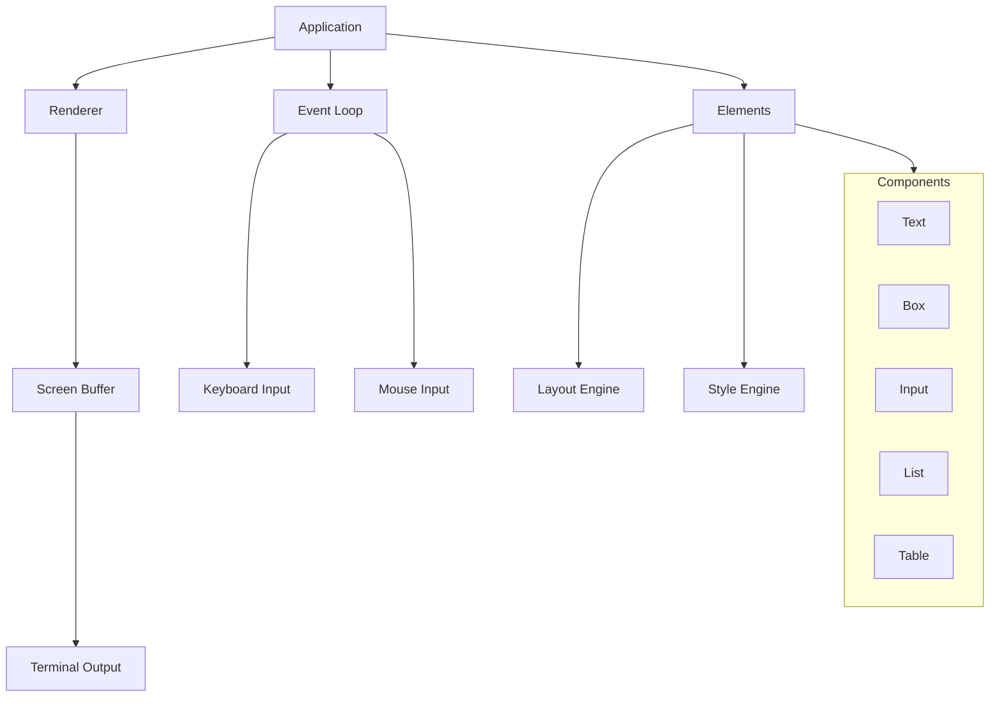
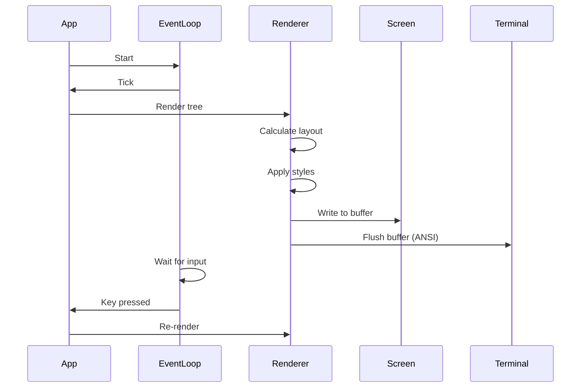

# Project Exploration: OpenTUI

## Overview

OpenTUI is a TypeScript library for building terminal user interfaces (TUIs). It's designed as a foundational framework for building interactive command-line applications with a modern, component-based architecture. OpenTUI works standalone and provides bindings for React, Vue, Solid, and Go.

**Key Characteristics:**
- **Multi-Framework** - React, Vue, Solid, and Go bindings
- **TypeScript First** - Full TypeScript support
- **Modern Architecture** - Component-based TUI building
- **Cross-Platform** - Works on all major terminals
- **Performant** - Optimized rendering engine

## Repository Structure

```
opentui/
├── packages/
│   ├── core/                     # Core library (standalone)
│   │   ├── src/
│   │   │   ├── index.ts          # Main exports
│   │   │   ├── app.ts            # Application class
│   │   │   ├── render.ts         # Rendering engine
│   │   │   ├── components/       # Built-in components
│   │   │   │   ├── text.ts       # Text component
│   │   │   │   ├── box.ts        # Box container
│   │   │   │   ├── input.ts      # Text input
│   │   │   │   ├── button.ts     # Clickable button
│   │   │   │   ├── list.ts       # List component
│   │   │   │   ├── table.ts      # Table component
│   │   │   │   ├── spinner.ts    # Loading spinner
│   │   │   │   ├── progress.ts   # Progress bar
│   │   │   │   └── tabs.ts       # Tab navigation
│   │   │   ├── elements/         # Low-level elements
│   │   │   │   ├── element.ts    # Base element class
│   │   │   │   ├── container.ts  # Container element
│   │   │   │   └── text.ts       # Text element
│   │   │   ├── styles/           # Styling system
│   │   │   │   ├── style.ts      # Style object
│   │   │   │   ├── border.ts     # Border styles
│   │   │   │   └── colors.ts     # Color utilities
│   │   │   ├── events/           # Event system
│   │   │   │   ├── event.ts      # Event base class
│   │   │   │   ├── keyboard.ts   # Keyboard events
│   │   │   │   ├── mouse.ts      # Mouse events
│   │   │   │   └── focus.ts      # Focus events
│   │   │   ├── layout/           # Layout system
│   │   │   │   ├── flex.ts       # Flexbox layout
│   │   │   │   ├── grid.ts       # Grid layout
│   │   │   │   └── box.ts        # Box model
│   │   │   ├── input/            # Input handling
│   │   │   │   ├── keyboard.ts   # Keyboard input
│   │   │   │   ├── mouse.ts      # Mouse input
│   │   │   │   └── ansi.ts       # ANSI parsing
│   │   │   ├── output/           # Terminal output
│   │   │   │   ├── ansi.ts       # ANSI codes
│   │   │   │   ├── renderer.ts   # Renderer interface
│   │   │   │   └── screen.ts     # Screen buffer
│   │   │   ├── utils/            # Utilities
│   │   │   │   ├── color.ts      # Color conversion
│   │   │   │   ├── string.ts     # String utilities
│   │   │   │   └── ansi.ts       # ANSI helpers
│   │   │   └── examples/         # Usage examples
│   │   │       └── *.ts
│   │   ├── package.json
│   │   └── bunfig.toml
│   │
│   ├── react/                    # React reconciler
│   │   ├── src/
│   │   │   ├── index.ts          # React exports
│   │   │   ├── components.ts     # React components
│   │   │   ├── reconciler.ts     # React reconciler
│   │   │   └── hooks.ts          # Custom hooks
│   │   └── package.json
│   │
│   ├── vue/                      # Vue reconciler
│   │   ├── src/
│   │   │   ├── index.ts          # Vue exports
│   │   │   ├── components.ts     # Vue components
│   │   │   └── directives.ts     # Vue directives
│   │   └── package.json
│   │
│   ├── solid/                    # Solid reconciler
│   │   ├── src/
│   │   │   ├── index.ts          # Solid exports
│   │   │   ├── components.ts     # Solid components
│   │   │   └── signals.ts        # Solid signals
│   │   └── package.json
│   │
│   └── go/                       # Go bindings
│       ├── opentui.go            # Main Go package
│       ├── element.go            # Element interface
│       ├── app.go                # Application
│       ├── components/           # Go components
│       │   ├── text.go
│       │   ├── box.go
│       │   └── ...
│       └── examples/             # Go examples
│           └── basic/
│               └── main.go
│
├── scripts/                      # Build scripts
├── install.sh                    # System-wide install script
└── package.json                  # Root package.json
```

## Architecture

### Core Architecture



### Rendering Pipeline



## Installation

### TypeScript/JavaScript

```bash
# Using bun
bun install @opentui/core

# Using npm
npm install @opentui/core

# Using pnpm
pnpm add @opentui/core
```

### Go

```bash
# Install system-wide
curl -L https://github.com/sst/opentui/releases/latest/download/install.sh | sh

# Or use go get
go get github.com/sst/opentui/packages/go
```

### Create Project

```bash
# Quick start with template
bun create tui
```

## Core API

### Basic Application

```typescript
import { App, Box, Text } from '@opentui/core'

const app = new App({
  title: 'My TUI App',
})

// Create root element
const root = new Box({
  width: '100%',
  height: '100%',
  border: { type: 'rounded' },
})

// Add content
root.add(
  new Text({
    content: 'Hello, OpenTUI!',
    color: 'green',
    bold: true,
  })
)

app.root = root
app.render()
app.start()
```

### Component Example

```typescript
import { App, Box, Text, Input, Button, VStack } from '@opentui/core'

const app = new App()

const form = new VStack({
  spacing: 1,
  padding: 2,
})

const nameInput = new Input({
  label: 'Name: ',
  placeholder: 'Enter your name',
})

const emailInput = new Input({
  label: 'Email: ',
  type: 'email',
})

const submitButton = new Button({
  label: 'Submit',
  onClick: () => {
    console.log('Submitted!')
  },
})

form.add(nameInput, emailInput, submitButton)

app.root = form
app.start()
```

## Components

### Text

```typescript
const text = new Text({
  content: 'Hello World',
  color: 'blue',
  backgroundColor: 'white',
  bold: true,
  italic: false,
  underline: false,
  align: 'center',
})
```

### Box (Container)

```typescript
const box = new Box({
  width: 50,
  height: 20,
  padding: { top: 1, bottom: 1, left: 2, right: 2 },
  margin: { top: 1, bottom: 1, left: 1, right: 1 },
  border: {
    type: 'rounded',
    color: 'blue',
  },
  backgroundColor: 'gray',
})
```

### Input

```typescript
const input = new Input({
  label: 'Search: ',
  placeholder: 'Type to search...',
  value: '',
  password: false,
  onSubmit: (value) => {
    console.log('Submitted:', value)
  },
  onChange: (value) => {
    console.log('Changed:', value)
  },
})
```

### Button

```typescript
const button = new Button({
  label: 'Click me',
  variant: 'primary', // primary, secondary, danger
  onClick: () => {
    console.log('Clicked!')
  },
  disabled: false,
})
```

### List

```typescript
const list = new List({
  items: ['Item 1', 'Item 2', 'Item 3'],
  selectable: true,
  selectedIndex: 0,
  onSelect: (index, item) => {
    console.log('Selected:', item)
  },
})
```

### Table

```typescript
const table = new Table({
  columns: ['Name', 'Email', 'Role'],
  data: [
    ['John', 'john@example.com', 'Admin'],
    ['Jane', 'jane@example.com', 'User'],
  ],
  selectable: true,
  onSelect: (row) => {
    console.log('Selected row:', row)
  },
})
```

### Spinner

```typescript
const spinner = new Spinner({
  frames: ['⠋', '⠙', '⠹', '⠸', '⠼', '⠴', '⠦', '⠧', '⠇', '⠏'],
  interval: 80,
  color: 'green',
})

// Start animation
spinner.start()

// Stop animation
spinner.stop()
```

### Progress Bar

```typescript
const progress = new ProgressBar({
  total: 100,
  current: 50,
  width: 40,
  filledChar: '█',
  emptyChar: '░',
  showPercentage: true,
})

// Update progress
progress.current = 75
progress.render()
```

## Layout System

### VStack (Vertical Stack)

```typescript
import { VStack, Text, Input } from '@opentui/core'

const vstack = new VStack({
  spacing: 2,
  padding: 1,
  align: 'center',
})

vstack.add(
  new Text({ content: 'Title' }),
  new Input({ label: 'Name: ' }),
  new Input({ label: 'Email: ' }),
)
```

### HStack (Horizontal Stack)

```typescript
import { HStack, Button } from '@opentui/core'

const hstack = new HStack({
  spacing: 2,
  justify: 'center',
})

hstack.add(
  new Button({ label: 'Cancel' }),
  new Button({ label: 'OK', variant: 'primary' }),
)
```

### Flexbox Layout

```typescript
const flex = new Box({
  display: 'flex',
  flexDirection: 'row',
  justifyContent: 'space-between',
  alignItems: 'center',
})
```

## Styling

### Style Object

```typescript
const style = {
  color: 'white',
  backgroundColor: 'blue',
  bold: true,
  underline: false,
  padding: { top: 1, bottom: 1, left: 2, right: 2 },
  margin: { top: 0, bottom: 1, left: 0, right: 0 },
  border: {
    type: 'rounded',
    color: 'blue',
  },
}
```

### Border Types

```typescript
const borders = {
  none: 'none',
  single: '─ │ ┌ ┐ └ ┘',
  double: '═ ║ ╔ ╗ ╚ ╝',
  rounded: '─ │ ╭ ╮ ╰ ╯',
  bold: '━ ┃ ┏ ┓ ┗ ┛',
  singleDouble: '─ ║ ┍ ┑ ┕ ┙',
}
```

### Colors

```typescript
// Named colors
const colors = [
  'black', 'red', 'green', 'yellow',
  'blue', 'magenta', 'cyan', 'white',
  'brightBlack', 'brightRed', 'brightGreen',
  'brightYellow', 'brightBlue', 'brightMagenta',
  'brightCyan', 'brightWhite',
]

// RGB colors
const rgbColor = { r: 255, g: 100, b: 50 }

// Hex colors
const hexColor = '#ff6432'
```

## Event Handling

### Keyboard Events

```typescript
import { App, Box } from '@opentui/core'

const app = new App()

app.on('key', (key) => {
  if (key.name === 'q') {
    app.exit()
  }
  if (key.name === 'up') {
    // Move selection up
  }
  if (key.name === 'down') {
    // Move selection down
  }
  if (key.name === 'enter') {
    // Select item
  }
})
```

### Mouse Events

```typescript
app.on('mouse', (event) => {
  if (event.button === 'left') {
    // Left click
  }
  if (event.button === 'right') {
    // Right click
  }
  if (event.action === 'wheelUp') {
    // Scroll up
  }
})
```

### Focus Events

```typescript
input.on('focus', () => {
  console.log('Input focused')
})

input.on('blur', () => {
  console.log('Input blurred')
})
```

## React Integration

```tsx
import { render, Box, Text, useInput } from '@opentui/react'

function App() {
  const [count, setCount] = React.useState(0)

  useInput((key) => {
    if (key.name === 'up') setCount(c => c + 1)
    if (key.name === 'down') setCount(c => c - 1)
  })

  return (
    <Box border="rounded" padding={2}>
      <Text bold>Count: {count}</Text>
      <Text color="gray">Press ↑/↓ to change</Text>
    </Box>
  )
}

render(<App />)
```

## Vue Integration

```vue
<script setup>
import { ref } from 'vue'
import { useInput } from '@opentui/vue'

const count = ref(0)

useInput((key) => {
  if (key.name === 'up') count.value++
  if (key.name === 'down') count.value--
})
</script>

<template>
  <Box border="rounded" :padding="2">
    <Text :bold="true">Count: {{ count }}</Text>
  </Box>
</template>
```

## Go Integration

```go
package main

import (
    "github.com/sst/opentui/packages/go"
)

func main() {
    app := opentui.NewApp()

    box := opentui.NewBox()
    box.SetBorder(true)
    box.SetPadding(2)

    text := opentui.NewText("Hello from Go!")
    text.SetColor("green")
    text.SetBold(true)

    box.AddChild(text)
    app.SetRoot(box)

    app.Run()
}
```

## Examples

### Loading Screen

```typescript
import { App, VStack, Spinner, Text, ProgressBar } from '@opentui/core'

const app = new App()

const loading = new VStack({ align: 'center' })

loading.add(
  new Text({ content: 'Loading...', bold: true }),
  new Spinner({ interval: 80 }),
  new ProgressBar({ total: 100, current: 0, width: 40 }),
)

app.root = loading
app.start()

// Simulate loading
let progress = 0
const interval = setInterval(() => {
  progress += 10
  ;(app.root.children[2] as ProgressBar).current = progress
  app.render()

  if (progress >= 100) {
    clearInterval(interval)
    app.exit()
  }
}, 200)
```

### Interactive Menu

```typescript
import { App, List, Text, VStack } from '@opentui/core'

const app = new App()

const menu = new VStack()

menu.add(
  new Text({ content: 'Main Menu', bold: true, align: 'center' }),
  new List({
    items: [
      'Start Game',
      'Load Game',
      'Settings',
      'Quit',
    ],
    selectable: true,
    onSelect: (index, item) => {
      if (item === 'Quit') {
        app.exit()
      } else {
        console.log('Selected:', item)
      }
    },
  }),
)

app.root = menu
app.start()
```

## Key Insights

1. **Framework Agnostic** - Works standalone or with React, Vue, Solid.

2. **TypeScript First** - Full type safety and IntelliSense.

3. **Go Bindings** - Unique among JS TUI libraries.

4. **Component-Based** - Modern component architecture.

5. **Layout System** - Flexbox-like layouts in terminal.

6. **Event Driven** - Full keyboard and mouse support.

7. **ANSI Optimized** - Efficient terminal rendering.

8. **Cross-Platform** - Works on all major terminals.

## Open Considerations

1. **Maturity** - Still in development, not production-ready.

2. **Documentation** - How complete is the API documentation?

3. **Performance** - How does it compare to Ink (React TUI)?

4. **Accessibility** - Screen reader support?

5. **Theming** - Built-in theme support?

6. **Testing** - Testing utilities for TUI apps?

7. **Plugins** - Plugin ecosystem?

8. **Windows Support** - Full Windows Terminal support?
