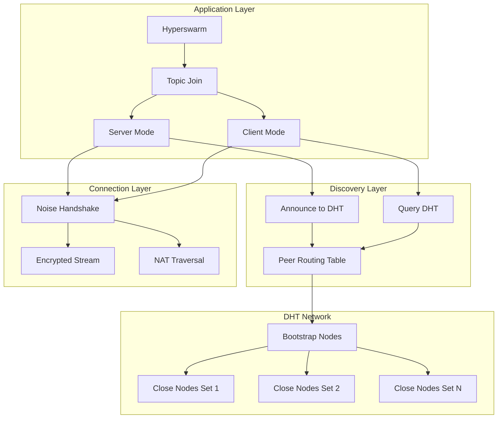

# Deep Dive: HyperDHT - Kademlia-Style P2P Discovery

## Overview

This deep dive examines HyperDHT, the Kademlia-style Distributed Hash Table that powers Hyperswarm's peer discovery. We explore the routing table structure, lookup algorithms, NAT traversal, and the announcement/discovery protocols.

## Architecture



## Kademlia Fundamentals

### XOR Distance Metric

```javascript
// Distance calculation in Kademlia
// Distance = XOR of two node IDs

function xorDistance(a, b) {
  const distance = Buffer.alloc(32)
  for (let i = 0; i < 32; i++) {
    distance[i] = a[i] ^ b[i]
  }
  return distance
}

// Example:
// Node A: 0x1234...
// Node B: 0x5678...
// Distance: A XOR B = 0x444c...

// Properties:
// 1. Symmetric: distance(A, B) = distance(B, A)
// 2. Triangle inequality: distance(A, C) ≤ distance(A, B) + distance(B, C)
// 3. Identity: distance(A, A) = 0
```

### Routing Table Structure (K-Buckets)

```javascript
// HyperDHT routing table implementation
class RoutingTable {
  constructor(localNodeId) {
    this.localNodeId = localNodeId
    this.kBuckets = [] // 256 buckets (one per bit)
    this.K = 20 // Bucket size (alpha in Kademlia)
    
    // Initialize empty buckets
    for (let i = 0; i < 256; i++) {
      this.kBuckets[i] = []
    }
  }
  
  // Add node to appropriate bucket
  addNode(node) {
    const distance = xorDistance(this.localNodeId, node.id)
    const bucketIndex = this.bucketIndex(distance)
    const bucket = this.kBuckets[bucketIndex]
    
    // Check if node already exists
    const existing = bucket.find(n => n.id.equals(node.id))
    if (existing) {
      // Move to front (most recently seen)
      bucket.splice(bucket.indexOf(existing), 1)
      bucket.push(node)
      return
    }
    
    // Add if bucket not full
    if (bucket.length < this.K) {
      bucket.push(node)
      return
    }
    
    // Bucket full - check if first node is responsive
    this.ping(bucket[0]).then(responsive => {
      if (!responsive) {
        // Remove unresponsive node, add new one
        bucket.shift()
        bucket.push(node)
      }
    })
  }
  
  // Find bucket index based on distance
  bucketIndex(distance) {
    for (let i = 0; i < 256; i++) {
      if (distance[i] !== 0) {
        return i
      }
    }
    return 0
  }
  
  // Find K closest nodes to target
  findClosest(target, k = this.K) {
    const all = []
    for (const bucket of this.kBuckets) {
      all.push(...bucket)
    }
    
    // Sort by distance to target
    all.sort((a, b) => {
      const distA = xorDistance(target, a.id)
      const distB = xorDistance(target, b.id)
      return compareDistance(distA, distB)
    })
    
    return all.slice(0, k)
  }
}
```

### Node Lookup Algorithm

```javascript
// Iterative lookup in Kademlia
async function lookup(target, routingTable, sendRPC) {
  const ALPHA = 3 // Parallelism factor
  const visited = new Set()
  const shortlist = routingTable.findClosest(target, ALPHA)
  
  while (shortlist.length > 0) {
    // Get next ALPHA nodes to query
    const next = shortlist.splice(0, ALPHA)
    const pending = []
    
    // Query nodes in parallel
    for (const node of next) {
      if (visited.has(node.id.toString('hex'))) {
        continue
      }
      visited.add(node.id.toString('hex'))
      
      pending.push(queryNode(node, target, sendRPC))
    }
    
    // Wait for responses
    const results = await Promise.all(pending)
    
    // Collect closer nodes from responses
    for (const response of results) {
      if (response && response.closer) {
        for (const closerNode of response.closer) {
          if (!visited.has(closerNode.id.toString('hex'))) {
            // Insert sorted by distance
            insertSorted(shortlist, closerNode, target)
          }
        }
      }
    }
    
    // Check if we found the target
    if (results.some(r => r && r.id && r.id.equals(target))) {
      return results.find(r => r.id.equals(target))
    }
  }
  
  // Return closest nodes found
  return routingTable.findClosest(target)
}

async function queryNode(node, target, sendRPC) {
  try {
    const response = await sendRPC(node, 'FIND_NODE', { target })
    return response
  } catch (err) {
    // Node unresponsive
    return null
  }
}
```

## HyperDHT Implementation

### DHT Node Structure

```javascript
// core DHT node
class DHTNode extends EventEmitter {
  constructor(opts = {}) {
    super()
    
    this.keyPair = opts.keyPair || keygen()
    this.table = new RoutingTable(this.keyPair.publicKey)
    this.server = new UDPSocket()
    this.concurrency = opts.concurrency || 10
    this.nodes = opts.bootstrap || BOOTSTRAP_NODES
    
    // Pending RPCs
    this.pending = new Map()
    this.tokenSecret = null
    this.tokenRotation = 30000 // 30 seconds
    
    // Start token rotation
    this.rotateTokenSecret()
    setInterval(() => this.rotateTokenSecret(), this.tokenRotation)
  }
  
  // Bootstrap the DHT
  async bootstrap() {
    // Connect to bootstrap nodes
    for (const node of this.nodes) {
      try {
        await this.addNode(node)
      } catch (err) {
        // Bootstrap node unreachable
      }
    }
    
    // Refresh routing table
    await this.refreshTable()
    
    this.emit('ready')
  }
  
  // Add node to routing table
  async addNode(node) {
    // Ping to verify liveness
    await this.ping(node)
    
    // Add to routing table
    this.table.addNode({
      id: node.publicKey,
      host: node.host,
      port: node.port,
      publicKey: node.publicKey
    })
  }
  
  // Send RPC to node
  async sendRPC(node, method, params) {
    const tid = randomTransactionId()
    const message = {
      type: 'request',
      tid,
      method,
      params,
      from: this.keyPair.publicKey
    }
    
    // Sign message
    message.signature = sign(message, this.keyPair.secretKey)
    
    return new Promise((resolve, reject) => {
      const timeout = setTimeout(() => {
        this.pending.delete(tid)
        reject(new Error('RPC timeout'))
      }, 5000)
      
      this.pending.set(tid, { resolve, reject, timeout })
      this.server.send(message, node.host, node.port)
    })
  }
  
  // Handle incoming message
  async onMessage(message, rinfo) {
    if (message.type === 'request') {
      await this.handleRequest(message, rinfo)
    } else if (message.type === 'response') {
      this.handleResponse(message)
    }
  }
  
  // Handle RPC request
  async handleRequest(message, rinfo) {
    // Verify signature
    if (!verify(message, message.from)) {
      return
    }
    
    switch (message.method) {
      case 'PING':
        this.sendResponse(rinfo, message.tid, { id: this.keyPair.publicKey })
        break
        
      case 'FIND_NODE':
        const closest = this.table.findClosest(message.params.target)
        this.sendResponse(rinfo, message.tid, {
          id: this.keyPair.publicKey,
          closer: closest
        })
        break
        
      case 'ANNOUNCE_PEER':
        // Verify token
        if (!this.verifyToken(message.params.token, rinfo.address)) {
          this.sendResponse(rinfo, message.tid, { error: 'bad_token' })
          return
        }
        
        // Store peer announcement
        this.storeAnnouncement(
          message.params.topic,
          message.params.peer
        )
        
        this.sendResponse(rinfo, message.tid, { id: this.keyPair.publicKey })
        break
        
      case 'GET_PEERS':
        const token = this.generateToken(rinfo.address)
        const peers = this.getPeers(message.params.topic)
        
        this.sendResponse(rinfo, message.tid, {
          id: this.keyPair.publicKey,
          token,
          peers
        })
        break
    }
  }
}
```

### Token-Based Authentication

```javascript
class DHTNode {
  // Generate time-based token for rate limiting
  generateToken(address) {
    const interval = Math.floor(Date.now() / this.tokenRotation)
    const data = Buffer.concat([
      Buffer.from(address),
      Buffer.from(interval.toString())
    ])
    return hmac(data, this.tokenSecret)
  }
  
  // Verify token validity
  verifyToken(token, address) {
    const currentToken = this.generateToken(address)
    const previousToken = this.generatePreviousToken(address)
    
    return token.equals(currentToken) || token.equals(previousToken)
  }
  
  // Rotate token secret periodically
  rotateTokenSecret() {
    this.previousTokenSecret = this.tokenSecret
    this.tokenSecret = crypto.randomBytes(32)
  }
  
  generatePreviousToken(address) {
    if (!this.previousTokenSecret) {
      return Buffer.alloc(0)
    }
    
    const interval = Math.floor(Date.now() / this.tokenRotation) - 1
    const data = Buffer.concat([
      Buffer.from(address),
      Buffer.from(interval.toString())
    ])
    return hmac(data, this.previousTokenSecret)
  }
}
```

## Peer Announcement Protocol

### Server Mode Announcement

```javascript
// Hyperswarm PeerDiscovery
class PeerDiscovery extends EventEmitter {
  constructor(swarm, topic, opts) {
    super()
    this.swarm = swarm
    this.topic = topic
    this.server = opts.server !== false
    this.client = opts.client !== false
    this.dht = swarm.dht
    this.announced = false
    this.flushed = false
  }
  
  // Start announcement/discovery
  async start() {
    if (this.server) {
      // Announce to DHT
      await this.announce()
    }
    
    if (this.client) {
      // Query DHT for peers
      await this.discover()
    }
  }
  
  // Announce presence to DHT
  async announce() {
    const target = this.topic
    
    // Find closest nodes to topic
    const closest = await this.dht.lookup(target)
    
    // Announce to K closest nodes
    const announcePromises = closest.map(node => 
      this.dht.sendRPC(node, 'ANNOUNCE_PEER', {
        topic: this.topic,
        peer: {
          publicKey: this.swarm.keyPair.publicKey,
          host: this.swarm.host,
          port: this.swarm.port
        },
        token: node.token // Token from previous GET_PEERS
      })
    )
    
    await Promise.all(announcePromises)
    this.announced = true
    this.emit('announcing')
  }
  
  // Discover peers from DHT
  async discover() {
    const target = this.topic
    
    // Lookup closest nodes
    const closest = await this.dht.lookup(target)
    
    // Get peers from each node
    for (const node of closest) {
      const response = await this.dht.sendRPC(node, 'GET_PEERS', {
        topic: this.topic
      })
      
      if (response.peers) {
        for (const peer of response.peers) {
          this.emit('peer', peer)
          // Attempt connection
          this.swarm._connect(peer)
        }
      }
    }
  }
  
  // Wait for announcement to complete
  async flushed() {
    if (this.flushed) return Promise.resolve()
    
    return new Promise(resolve => {
      const onFlush = () => {
        this.flushed = true
        this.removeListener('flush', onFlush)
        resolve()
      }
      this.once('flush', onFlush)
    })
  }
  
  // Refresh announcement
  async refresh(opts) {
    await this.destroy()
    this.server = opts.server !== false
    this.client = opts.client !== false
    await this.start()
  }
  
  // Stop discovery
  async destroy() {
    if (this.announced) {
      // Remove announcement from DHT
      await this.dht.announce(this.topic, null, { remove: true })
    }
    this.emit('destroy')
  }
}
```

### Client Mode Discovery

```javascript
// Client queries DHT for servers
class PeerDiscovery {
  async discover() {
    // Iterative lookup for topic
    const closest = await this.dht.lookup(this.topic)
    
    // Query each close node for peers
    const queries = closest.map(async node => {
      try {
        const response = await this.dht.sendRPC(node, 'GET_PEERS', {
          topic: this.topic
        })
        
        // Store token for future announcements
        node.token = response.token
        
        // Process discovered peers
        if (response.peers) {
          for (const peer of response.peers) {
            this._handlePeer(peer)
          }
        }
        
        // If node is itself a peer, connect
        if (response.immortal) {
          this._handlePeer({
            publicKey: node.publicKey,
            host: node.host,
            port: node.port
          })
        }
      } catch (err) {
        // Node unreachable
      }
    })
    
    await Promise.all(queries)
    this.emit('complete')
  }
  
  _handlePeer(peer) {
    // Avoid duplicate connections
    const key = peer.publicKey.toString('hex')
    if (this.seenPeers.has(key)) {
      return
    }
    this.seenPeers.add(key)
    
    // Emit peer event
    this.emit('peer', peer)
  }
}
```

## NAT Traversal

### Hole Punching

```javascript
// NAT traversal via hole punching
class NATTraversal {
  constructor(dht) {
    this.dht = dht
    this.pendingHoles = new Map()
  }
  
  // Attempt hole punch to peer
  async holePunch(peer) {
    const session = {
      peer,
      state: 'init',
      localAddresses: await this.getLocalAddresses(),
      remoteAddresses: [],
      sockets: []
    }
    
    // Create multiple UDP sockets for punching
    for (let i = 0; i < 3; i++) {
      const socket = await this.createSocket()
      session.sockets.push(socket)
      
      // Send punch packets to peer's known addresses
      for (const addr of peer.addresses) {
        socket.send(HOLE_PUNCH_PACKET, addr.host, addr.port)
      }
    }
    
    // Exchange addresses via DHT
    await this.exchangeAddresses(session)
    
    // Wait for connection
    const connected = await this.waitForConnection(session, 10000)
    
    if (!connected) {
      // Hole punch failed, try relay
      return this.connectViaRelay(peer)
    }
    
    return session.sockets[0]
  }
  
  // Exchange addresses through DHT
  async exchangeAddresses(session) {
    // Store our addresses in DHT
    const announcement = {
      topic: hash(session.peer.publicKey),
      addresses: session.localAddresses
    }
    
    await this.dht.announce(announcement.topic, announcement)
    
    // Get peer's addresses
    const result = await this.dht.lookup(announcement.topic)
    session.remoteAddresses = result.addresses
  }
  
  // Wait for successful connection
  waitForConnection(session, timeout) {
    return new Promise(resolve => {
      const timer = setTimeout(() => {
        for (const socket of session.sockets) {
          socket.close()
        }
        resolve(false)
      }, timeout)
      
      for (const socket of session.sockets) {
        socket.on('message', (msg, rinfo) => {
          if (this.isValidHolePunchResponse(msg)) {
            clearTimeout(timer)
            resolve(true)
          }
        })
      }
    })
  }
}
```

## Conclusion

HyperDHT provides:

1. **Scalable Discovery**: O(log N) lookup complexity
2. **Resilient Storage**: Replicated peer announcements
3. **Token Auth**: Rate limiting and Sybil resistance
4. **NAT Traversal**: Automatic hole punching
5. **Decentralized**: No single point of failure
